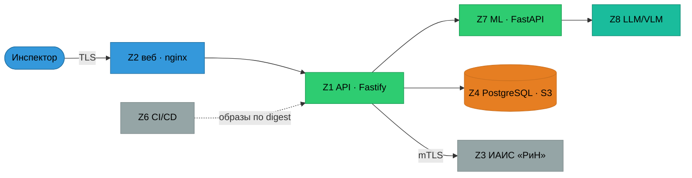
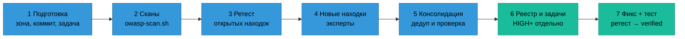

# Мегаплан регулярного OWASP-аудита

## 1. Зачем и что считаем успехом

Разовый аудит устаревает через неделю: только за 26–27.09 в `main` влилось ~165 коммитов, появились S3, гостевой
вход, PostgreSQL, публичный демо-стенд. Поэтому аудит здесь — **программа**, а не событие. В ней пять ритмов разной глубины,
один реестр находок и одно правило выката.

Успех программы измеряется четырьмя числами:

| Показатель | Цель | Где считается |
|---|---|---|
| Открытые CRITICAL / HIGH на `main` | 0 / 0 (или принятый риск с подписью владельца) | `findings/REGISTER.md` |
| Находки, закреплённые тестом, который краснеет при возврате дефекта | ≥ 90 % закрытых | колонка «Тест» реестра |
| Среднее время закрытия (MTTR) HIGH | ≤ 7 дней | реестр: `found` → `verified` |
| Регрессии (закрытая находка открылась снова) | 0 | статус `regression` |

## 2. Объект аудита — платформа целиком

Аудит всегда покрывает восемь зон. Зона — единица планирования: у неё есть эксперт, стандарты и набор автоматических
проверок. Опись активов и точек входа — [`scope/asset-inventory.md`](scope/asset-inventory.md), модель угроз —
[`methodology/threat-model.md`](methodology/threat-model.md).

| Зона | Что входит | Эксперт |
|---|---|---|
| Z1 Приложение и API | `apps/api`: вход, сессии, роли, объекты, валидация, загрузка, выгрузки, журнал | E1 |
| Z2 Веб-клиент | `apps/web`: вывод данных сервера, токен, CSP, nginx-заголовки | E1 |
| Z3 Интеграции | ИАИС «РиН» (mTLS), S3 Yandex Object Storage, ClamAV, прокси выхода | E1 + E2 |
| Z4 Данные | PostgreSQL 18 (роли, миграции, журнал только на добавление), блобы с AES-GCM, бэкапы, ключи | E2 |
| Z5 Инфраструктура | Dockerfile ×3, compose `gpu`/`stand`/`demo`, сети, секреты, TLS, Caddy, наблюдаемость | E2 |
| Z6 CI/CD и цепочка поставок | `ci-gate.yml`, страж, раннер, lock-файлы, образы по digest, модели по хешу, SBOM | E2 |
| Z7 ML-конвейер документов | `ml/`: разбор недоверенных PDF/DOCX/ZIP/TIFF, OCR, таблицы, VLM, кэш, рендер протокола | E3 |
| Z8 LLM и приватность | советник, поиск норм, промпты, вывод ИИ в протокол, ПДн, маркировка ИИ (ПП 2078-ПП), 152-ФЗ | E3 |



Z5 (инфраструктура) — среда, в которой живут все узлы схемы, поэтому отдельным узлом не рисуется.

## 3. Методики — полный набор OWASP

Какой стандарт к какой зоне и что именно из него проверяется — [`methodology/standards-map.md`](methodology/standards-map.md).
Кратко:

- **Классификация рисков:** Top 10:2025, API Security Top 10:2023, Top 10 for LLM Applications 2025,
  Machine Learning Security Top 10, Top 10 CI/CD Security Risks, Top 10 Privacy Risks.
- **Требования (что проверять):** ASVS 5.0 уровень L2 — основной чек-лист
  ([`methodology/asvs-5.0-L2-checklist.md`](methodology/asvs-5.0-L2-checklist.md)); SCVS — для цепочки поставок.
- **Как тестировать:** WSTG — живой прогон локального API; Cheat Sheet Series — эталон фикса.
- **Как проектировать:** Threat Modeling (STRIDE по границам доверия), Proactive Controls 2024.
- **Зрелость процесса:** SAMM 2.0 — [`methodology/samm-assessment.md`](methodology/samm-assessment.md).
- **Оценка тяжести:** CVSS 4.0 для HIGH и выше, OWASP Risk Rating — для принятия риска.

## 4. Пять ритмов аудита

| Ритм | Когда | Кто | Глубина | Результат |
|---|---|---|---|---|
| **R0 Непрерывный** | каждый коммит и PR | гейт (`scripts/local-gate.sh`, `ci-gate.yml`) | автоматические проверки | красный гейт = нет влития |
| **R1 Еженедельный** | понедельник | ведущий аудитор | `OWASP/tooling/owasp-scan.sh`, разбор новых CVE, ретест открытых HIGH | строка в [`audits/INDEX.md`](audits/INDEX.md), обновлённый реестр |
| **R2 По изменению** | новая поверхность атаки (см. §5), до влития | 1 эксперт зоны | точечный аудит зоны | `audits/<дата>-<зона>-T<NNN>/report.md` |
| **R3 Ежемесячный** | последняя неделя месяца | панель 3 экспертов | полный аудит 8 зон + ретест всего реестра | `audits/<дата>-full-T<NNN>/` |
| **R4 Ежеквартальный** | раз в квартал | панель + владелец | полный ASVS L2, пересмотр модели угроз и SAMM, WSTG по отдельному стенду (с разрешения владельца) | обновлённые `methodology/*`, план на квартал |
| **Предвыкатный шлагбаум** | перед выкатом в прод и сдачей жюри | ведущий аудитор + владелец | сверка реестра | «да» владельца на список открытых рисков |

### R0 — что уже есть в гейте и чего не хватает

| Проверка | Сейчас | Добавить |
|---|---|---|
| Секреты в истории (gitleaks, страж `.gitleaksignore`) | ✅ гейт | — |
| Уязвимости образов (trivy HIGH/CRITICAL) | ✅ гейт | снять `--ignore-unfixed` для прод-образов, сторонние образы из compose (T088-M9) |
| Dockerfile (hadolint) | ✅ локальный гейт | — |
| Тесты безопасности (`domain-security`, `db-hardening`, `openapi-contract`, `deploy.test.mjs`) | ✅ гейт | тест на каждую закрытую находку — обязательная колонка реестра |
| Зависимости (`pnpm audit`, `pip-audit`) | ❌ | шаг гейта до тестов (T088-M9) |
| SAST (semgrep по `apps/`, `ml/`) | ❌ | еженедельно в R1, в гейт — после отладки ложных срабатываний |
| SBOM и подпись образов | ❌ | `syft` в R1; cosign — вместе с деплой-джобой (T088-M10) |

## 5. Триггеры внепланового аудита (R2)

Точечный аудит зоны обязателен **до влития в `main`**, если изменение:

1. добавляет или меняет маршрут API, роль или правило доступа;
2. добавляет формат документа, парсер или путь распаковки;
3. подключает внешнюю интеграцию, облако, прокси или новый исходящий адрес;
4. добавляет сервис в compose, открывает порт, меняет сеть, том или секрет;
5. меняет вход, сессии, гостевой режим или хранение паролей и ключей;
6. подключает модель, LLM, VLM или меняет промпт;
7. меняет CI, раннер, публикацию образов или lock-файлы крупнее одного пакета;
8. открывает что-либо в интернет (демо-стенд, публичная ссылка).

Образец R2 — аудит T-129 ([`audits/2026-09-27-s3-ml-T129/`](audits/2026-09-27-s3-ml-T129/report.md)): 13 находок,
11 закрыты кодом и тестами в той же ветке.

## 6. Команда

| Роль | Зона | Методический багаж |
|---|---|---|
| **E1 — AppSec/API/Web** | Z1, Z2, Z3 (API-часть) | Top 10:2025, API Top 10:2023, ASVS V1–V8 и V16, WSTG, Proactive Controls, CS по входу, сессиям, авторизации, загрузке, XSS |
| **E2 — Infra/CI-CD/Supply chain/Data** | Z3 (сеть), Z4, Z5, Z6 | Top 10:2025 A02/A03/A04/A08/A09, CI/CD Top 10, SCVS, CycloneDX, Docker/Secrets/DB/TLS/Crypto CS, ASVS V11–V14, SAMM |
| **E3 — ML/LLM/документы/приватность** | Z7, Z8 | LLM Top 10 2025, ML Top 10, AI Exchange, Agentic AI Threats, CS по загрузке, XXE, десериализации, DoS, SSRF, Top 10 Privacy Risks, 152-ФЗ |
| **Ведущий аудитор** | все | дедупликация, приоритет, сверка доказательств, реестр, задачи |
| **Владелец** | — | принимает риски, даёт «да» на выкат, решает матрицу доступа (ТЗ 12.2) |

Эксперты независимы и пишут каждый свой отчёт. Ведущий аудитор не переписывает их выводы, а консолидирует. Спорную
находку он проверяет повторно, прежде чем внести её в реестр.

## 7. Процесс одного аудита (R2–R4)



1. **Подготовка.** Задача в `tasks/` (`T-NNN`), отдельный worktree от `origin/main`, фиксируется sha. Бриф экспертам —
   по [`templates/expert-brief.md`](templates/expert-brief.md).
2. **Сканы.** `OWASP/tooling/owasp-scan.sh` → `audits/<папка>/scans/`.
3. **Ретест.** Каждая открытая находка реестра получает статус с доказательством.
4. **Новые находки.** По [`templates/finding.md`](templates/finding.md): где, доказательство, сценарий, фикс, тест.
5. **Консолидация.** Отчёт по [`templates/audit-report.md`](templates/audit-report.md): дедупликация, сквозной ID `OWASP-NNNN`.
6. **Реестр и задачи.** Новые строки в [`findings/REGISTER.md`](findings/REGISTER.md). Для HIGH и выше — отдельная
   задача в `tasks/`, MEDIUM группируются по зоне.
7. **Закрытие.** Фикс вместе с тестом, который краснеет при возврате дефекта. Затем ретест, и только после него статус `verified`.

## 8. Тяжесть и сроки закрытия

| Тяжесть | Критерий | CVSS 4.0 | Срок | Выкат с открытой |
|---|---|---|---|---|
| CRITICAL | эксплуатируется без аутентификации: утечка ПДн, подмена решения, RCE | 9.0–10 | 24 часа | запрещён |
| HIGH | эксплуатируется при частичном доступе или ломает журнал, изоляцию, доступность | 7.0–8.9 | 7 дней | только с принятым риском |
| MEDIUM | нужна цепочка или особое положение нарушителя | 4.0–6.9 | 30 дней | разрешён |
| LOW | гигиена, эшелонированная защита | 0.1–3.9 | 90 дней или бэклог | разрешён |
| INFO | наблюдение без риска | — | — | — |

**Жизненный цикл находки:** `open` → `in-progress` → `fixed` (код и тест в ветке) → `verified` (ретест на `main`).
Боковые ветви: `accepted` — риск принят владельцем, со сроком пересмотра; `regression` — закрытая находка вернулась,
тяжесть при этом на ступень выше; `wontfix` — неприменимо, с обоснованием.

## 9. Хранение

```
OWASP/
├── README.md                 точка входа
├── MEGAPLAN.md               этот документ
├── methodology/              стандарты, ASVS-чек-лист, модель угроз, SAMM
├── scope/                    опись активов и поверхности атаки
├── findings/REGISTER.md      единый реестр находок всех аудитов (источник истины о статусе)
├── audits/
│   ├── INDEX.md              журнал всех аудитов и еженедельных прогонов
│   └── ГГГГ-ММ-ДД-<тип>-T<NNN>/
│       ├── report.md         консолидированный отчёт (после сдачи не правится)
│       ├── expert-*.md       отчёты экспертов
│       ├── scans/            сырые выводы инструментов (без секретов)
│       └── sbom/             SBOM на коммит аудита
├── templates/                бриф эксперта, находка, отчёт
└── tooling/owasp-scan.sh     автоматические сканы
```

Правила:

- Отчёт аудита **неизменяем** после сдачи: статусы меняются только в реестре, а отчёт фиксирует срез на свой sha.
- Папка аудита: `ГГГГ-ММ-ДД-<full|db|s3-ml|zone>-T<NNN>`, внутри обязательно `report.md` с frontmatter
  `owner / date / task / commit / scope / standards`.
- Ничего не удаляем. Устаревшее переносится в `OWASP/_archive/`, на прежнем месте остаётся тумбстоун.
- В хранилище не попадают корпус (ADR-0002), секреты, живые токены и ПДн. Доказательства — только на синтетике.

## 10. Ограничения, которые действуют всегда

- **Корпус не читается** ни в каком виде (ADR-0002). Для живых проверок используется синтетика `ml/synth`, `data/synth`.
- **Прод и публичный демо-стенд не атакуются.** Снаружи — только пассивный просмотр заголовков и TLS.
  WSTG-прогон — на отдельном стенде, с разрешения владельца.
- **Правило №0:** тяжёлые сканы идут только через `scripts/heavy.sh` и строго по одному. Stryker, e2e и сборка образов в аудит не входят.
- **Внешним провайдерам** сообщаем только про их слой (скилл `/vendor-support`).

## 11. Календарь

| Дата | Событие |
|---|---|
| 2026-09-27 | R3 полный аудит T-140 (базовая линия программы) |
| 2026-09-28 | Предвыкатный шлагбаум к сдаче жюри: сверка реестра, «да» владельца на открытые риски |
| 2026-09-29 23:59 | стоп-код ЛЦТ — после него только R0 и R1 |
| каждый понедельник, с 2026-10-05 | R1 еженедельный прогон |
| 2026-10-26…30 | R3 полный аудит (ретест базовой линии) |
| 2026-11-23…27 | R3 полный аудит |
| 2026-12-21…25 | R4 квартальный: ASVS L2 целиком, модель угроз, SAMM, WSTG на отдельном стенде |

## 12. Дорожная карта зрелости (SAMM)

Текущая оценка и цели — [`methodology/samm-assessment.md`](methodology/samm-assessment.md). Порядок подъёма:

1. **Q4 2026 — Verification:** зависимости и SAST в гейте, тест на каждую закрытую находку, реестр как источник истины.
2. **Q4 2026 — Implementation:** подпись образов и SBOM (cosign, syft), изолированный раннер (T-093), пин вложенных
   actions (T-095).
3. **Q1 2027 — Design:** модель угроз пересматривается при каждом R2, требования безопасности идут через ГЕРУ
   (`docs/gera/inspector/03-services.md`) с трассировкой к тестам.
4. **Q1 2027 — Operations:** алерты безопасности в «QxP Operations Center», учения по восстановлению (T-072), журнал
   инцидентов.
