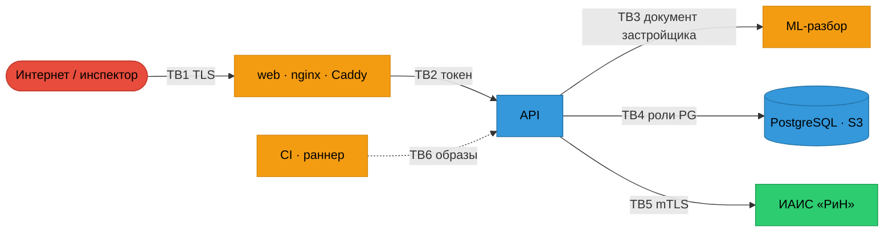

# Модель угроз платформы

Метод — STRIDE по границам доверия, по четырём вопросам Threat Modeling Manifesto: что строим, что может пойти не так,
что с этим делаем, хорошо ли справились. Конвейер документа внутри ML подробно разобран в модели угроз эксперта E3
(отчёт текущего полного аудита, раздел 5).

## Что строим: границы доверия

| Граница | Кто по ту сторону | Главный вопрос |
|---|---|---|
| TB1 интернет → web | кто угодно (демо nadzorium публичен) | что видно без входа и что можно перебрать |
| TB2 web → API | пользователь с ролью | достаточно ли роли, чтобы трогать **этот** объект |
| TB3 API → ML | застройщик **через содержимое документа** | может ли файл уронить, обмануть или прочитать сервис |
| TB4 API → данные | процесс API | может ли скомпрометированный API переписать историю |
| TB5 API ↔ «РиН» | внешняя система | подлинность стороны и данных |
| TB6 CI → прод | коммиттер, зависимость, action | может ли чужой код попасть в образ |

## Что может пойти не так: STRIDE

| Граница | S подмена | T искажение | R отказ от действия | I раскрытие | D отказ в обслуживании | E повышение прав |
|---|---|---|---|---|---|---|
| TB1 | перебор паролей, общий IP за прокси (T088-H2) | — | IP клиента не в журнале (T088-H2) | версии в `/health` (T088-L7), заголовки | перебор логина блокирует всех | — |
| TB2 | кража токена (XSS) | mass assignment, prototype pollution (T088-H1) | решение без записи в журнал (T088-H1) | BOLA на чужую проверку (T088-M1) | большие тела, нет пагинации (T088-M4) | admin выносит решения инспектора (T088-M2) |
| TB3 | — | подмена извлечения через кэш (T088-M8), скрытый текст | — | разметка протокола читает локальные файлы (T088-H6) | бомбы: страницы, пиксели, ZIP (T129-SEC-01) | RCE парсера (pdfium, Pillow) |
| TB4 | — | UPDATE/DELETE журнала (DB-HIGH-2) | стирание аудита | токены открытым текстом (DB-HIGH-3), ключ S3 | долгие запросы без таймаутов | суперпользователь API (DB-HIGH-1) |
| TB5 | подмена «РиН» без mTLS | подмена пакета (сверка sha256) | — | пакет в чужую систему | медленный «РиН» держит воркеры | — |
| TB6 | вложенный action по тегу (T088-H7) | перезаписываемый тег образа (T088-M10) | нет provenance | учётка реестра в `~/.docker` (T088-H5) | — | docker.sock на раннере (T088-H5) |

## Что с этим делаем

Каждая ячейка с кодом находки ведёт в [`findings/REGISTER.md`](../findings/REGISTER.md): там её текущий статус и тест.
Если у угрозы нет ни находки, ни контроля, это пробел модели. Такие пробелы ведущий аудитор вносит в бриф следующего R3.

## Хорошо ли справились

Модель пересматривается:
- при каждом R2 — затронутая граница;
- при каждом R4 — целиком, со сверкой по описи активов;
- после любого инцидента — граница, через которую он прошёл.
