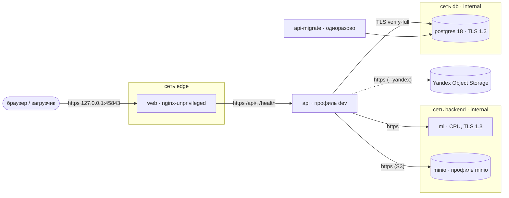

# Стенд «stand» — Инспектор ИИ на маке одной командой

NFR-STAND (T-129). Образы по sha коммита, `docker compose` без сборки на хосте, healthcheck у каждого сервиса,
рантайм без root и пакетного менеджера, код только для чтения, TLS между всеми сервисами (NFR-TLS-INTERNAL).

## Одна команда

```bash
scripts/heavy.sh scripts/stand.sh build   # собрать inspector-{api,ml,web}:<git-sha> (тяжёлое — под замком)
scripts/stand.sh up                        # поднять на Yandex Object Storage (бакет nadzorium); --minio — только паритет в тестах
scripts/stand.sh status                    # healthy + /health каждого + revision == sha сборки
scripts/stand.sh down                      # остановить (данные сохраняются); down --wipe — стереть тома
```

`logs [сервис…]` — последние 200 строк журналов. `build` и `up` не запускаются при свободном диске < 20 ГБ.

## Состав и порты



| Сервис | Наружу | Проверка живости |
|---|---|---|
| web | `127.0.0.1:45843` → 8443, HTTPS | HEALTHCHECK образа: `curl` своей статики на петле |
| api | нет | HEALTHCHECK образа: `node` → `/health` по https, цепочка по CA стенда |
| ml | нет | HEALTHCHECK образа: `python` urllib → `/health` по https |
| postgres | нет | `pg_isready` |
| minio | нет | `curl` `/minio/health/live` по https |
| api-migrate, minio-init | — | одноразовые, `service_completed_successfully` |

**Единственный вход — web.** API наружу не публикуется: загрузчик пакетов и браузер ходят в
`https://127.0.0.1:45843/api/v1/…` через прокси web (лимит тела 210 МБ, потоковая передача без буфера на диске).
Одна точка TLS и заголовков безопасности (CSP, HSTS), меньше открытых портов. Пакет больше 200 МБ загрузчик
отправляет частями (дозагрузка одной проверки, T-129). Порт выше 40000: на низких портах localhost живут
service worker чужих проектов.

## Режимы хранилища блобов (ADR-0006)

| Режим | Команда | Куда | Ключи |
|---|---|---|---|
| MinIO (только автотесты) | `up --minio` | `https://minio:9000`, бакет `inspector-stand`, `var/stand/minio-data` | `var/stand/secrets/s3-minio/` (генерируются) |
| Yandex Object Storage | `up --yandex` | `https://storage.yandexcloud.net`, `ru-central1`, бакет `nadzorium`, префикс `blobs/` | `var/stand/secrets/s3-yandex/` (из `.secrets/yandex-s3-nadzorium.env`) |
| Файлы | `up --fs` | только том `api-blobs` | — |

Кэш блобов — том `api-blobs`: API пишет, ML читает его только на чтение и ключей S3 не получает.
Блобы шифруются на клиенте (AES-256-GCM) ключом `var/stand/secrets/s3_encryption_key`: stand.sh создаёт
его один раз и никогда не перезаписывает. **Потеря файла = потеря данных в бакете** — держите копию.
MinIO — `pgsty/minio` (официальный образ снят с Docker Hub; форк — сборка того же исходника, только для паритета).

## Секреты и TLS

Всё — в `var/stand/` (вне git), файлы-секреты с правами 600, в compose — через `secrets:`, в переменных окружения
только пути `*_FILE`. Готовит `scripts/stand.sh secrets` (вызывается из `up`), существующее не трогает.

- `secrets/` — пароли ролей PostgreSQL, первого администратора, демо-учёток (`demo_password`), ключи S3, ключ шифрования;
- `tls/` — CA стенда (`ca.crt`, `ca.key`) и сертификаты `api`, `web`, `ml`, `postgres`, `minio`
  (SAN: имя сервиса, `localhost`, `127.0.0.1`).

Браузеру и загрузчику нужен корень `var/stand/tls/ca.crt` (или `curl --cacert var/stand/tls/ca.crt`).

## Как войти и загрузить пакет

API в стенде — профиль `dev` (очередь в процессе, без ClamAV и RabbitMQ): служба миграций заводит пять демо-учёток
(`inspector`, `supervisor`, `admin`, `ml`, `curator`) с паролем из `var/stand/secrets/demo_password`.

```bash
CA=var/stand/tls/ca.crt; B=https://127.0.0.1:45843
curl --cacert $CA $B/health                       # revision = sha сборки
curl --cacert $CA $B/api/v1/openapi.json | head   # контракт API через прокси web
```

Пакет грузится через интерфейс (`$B`) или загрузчиком T-129 с базовым адресом `$B` и корнем доверия `$CA`.
ML на CPU разбирает большие PDF долго: API ждёт его до 30 минут (`INSPECTOR_ML_TIMEOUT_MS=1800000`).

## Ограничения

- Только мак (Docker Desktop): файлы-секреты 600 читаются контейнерами с другим uid благодаря общей ФС Docker Desktop;
  на Linux-хосте нужны владельцы по uid (как описано в `deploy/gpu/.env.example`).
- Образы arm64; стенд gpu — x86 из гейта CI.
- MinIO не позволяет поднять минимум TLS до 1.3 (принимает 1.2+); остальные внутренние соединения — только TLS 1.3.
