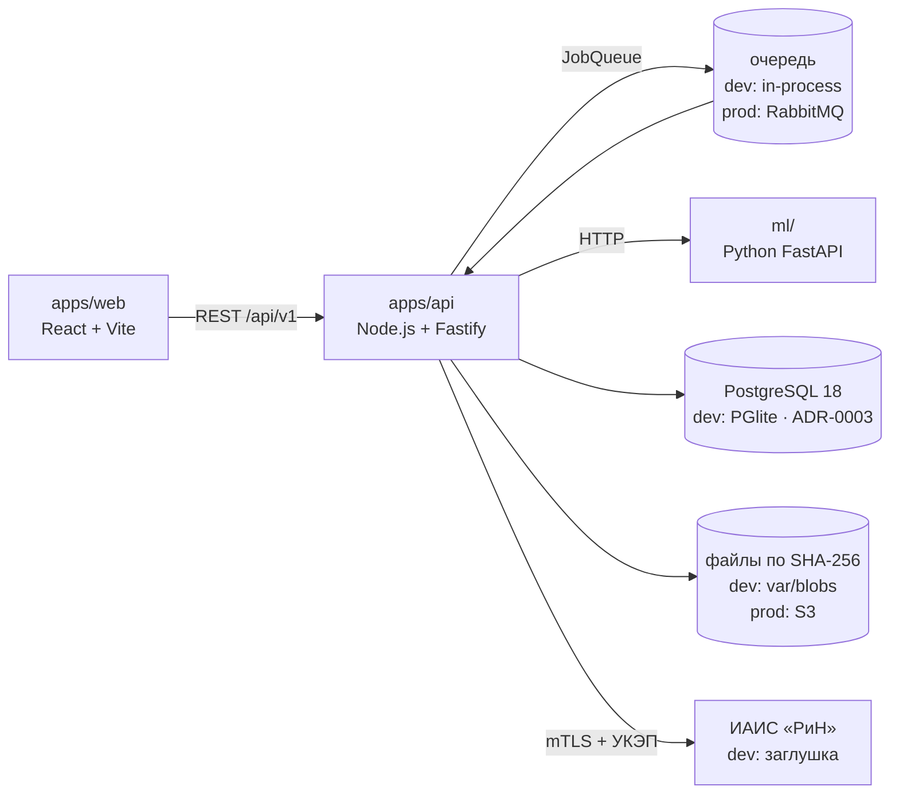

# ADR-0001. Один код, два профиля исполнения

## Контекст

Эксплуатация — сервер с GPU класса NVIDIA H100 (80 ГБ): OCR на нейросетях, эмбеддинги,
LLM для свободного поиска гипотез. Разработка — MacBook Air M4, 24 ГБ RAM, свободно < 10 ГБ
диска (ограничение C-02). ТЗ §1.5 задаёт стек: React, Node.js, Python ≥ 3.11 для ML,
REST + OpenAPI 3.0, RabbitMQ, Redis.

## Решение

Три развёртываемые части, каждая за интерфейсом, у которого есть лёгкая и тяжёлая реализация.

| Слот | dev (MacBook) | prod (GPU) |
|---|---|---|
| Текст PDF | текстовый слой (pypdfium2) | то же |
| OCR | Tesseract CLI, если установлен | PaddleOCR / Surya на CUDA |
| Семантические якоря | лексический поиск + нечёткое сравнение (rapidfuzz) | sentence-transformers (all-MiniLM-L6-v2 или мультиязычный аналог) |
| Гипотезы | логические правила из БД | + LLM на vLLM |
| Очередь | in-process, та же семантика ack/retry | RabbitMQ |
| Кэш разбора | таблица по SHA-256 | Redis |
| БД | ~~SQLite (`node:sqlite`)~~ → PGlite (PostgreSQL 18 в процессе), **ADR-0003** | PostgreSQL 18, **ADR-0003** |

Профиль выбирается переменной `INSPECTOR_PROFILE=dev|gpu` и проверяется громко при старте.
На маке ничего из колонки prod не устанавливается: torch и CUDA-стек не ставятся вообще.

## Последствия

- Весь предметный код (выбор редакции, сравнение, статусы, протокол, верификация) один и тот же
  в обоих профилях и полностью тестируется на маке.
- Метрики качества ML из ТЗ §14 на маке не измеряются — только на GPU-стенде (to-be).
- Переход in-process → RabbitMQ — замена адаптера, не бизнес-логики. Хранилище пересмотрено в ADR-0003: PostgreSQL
  во всех профилях (разный SQL-диалект в dev и проде оставлял эксплуатационный код непротестированным).
