# Инспектор ИИ — C4 и модель базы данных

Дополняет [`C4.md`](C4.md) (уровни 1–2 прод-профиля `deploy/gpu`): здесь — стенд **nadzorium-gpu**
(`deploy/gpu-stand/`), компоненты API и ML, поток обработки документа и модель БД по миграциям
`apps/api/src/db/migrations/0001…0015`. Источники сверены с кодом ветки `integ/t233-gpu-stand` на 28.09.2026; модель БД (§5) — с веткой `feat/t234-db-model-tz10` (T-234: все 128 полей ТЗ §10).

Цвета во всех схемах: синий — интерфейс и вход, зелёный — наши сервисы, оранжевый — хранилища,
бирюзовый — кэш и очереди, серый — внешние системы и модели, фиолетовый — люди.

---

## 1. C4, уровень 1 — контекст

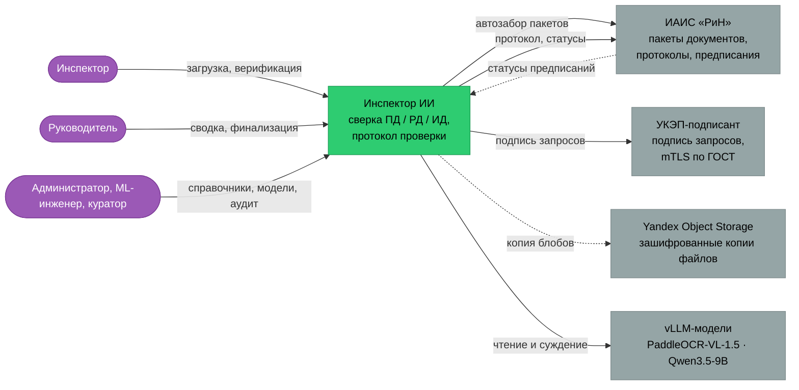

Инспектор загружает пакет или система сама забирает его из «РиН», сверяет параметры и выпускает протокол,
который после решений инспектора уходит обратно в «РиН». Роли в коде: `inspector`, `supervisor`, `admin`,
`ml_engineer`, `curator` (`domain/types.ts`). Пунктир — то, что на стенде nadzorium-gpu выключено:
«РиН» — заглушка (`INSPECTOR_RIN_MOCK=1`, `INSPECTOR_RIN_PULL=off`), блобы — локальный каталог вместо S3.
Модели — только открытые веса и только локально, на той же видеокарте.

---

## 2. C4, уровень 2 — контейнеры стенда nadzorium-gpu

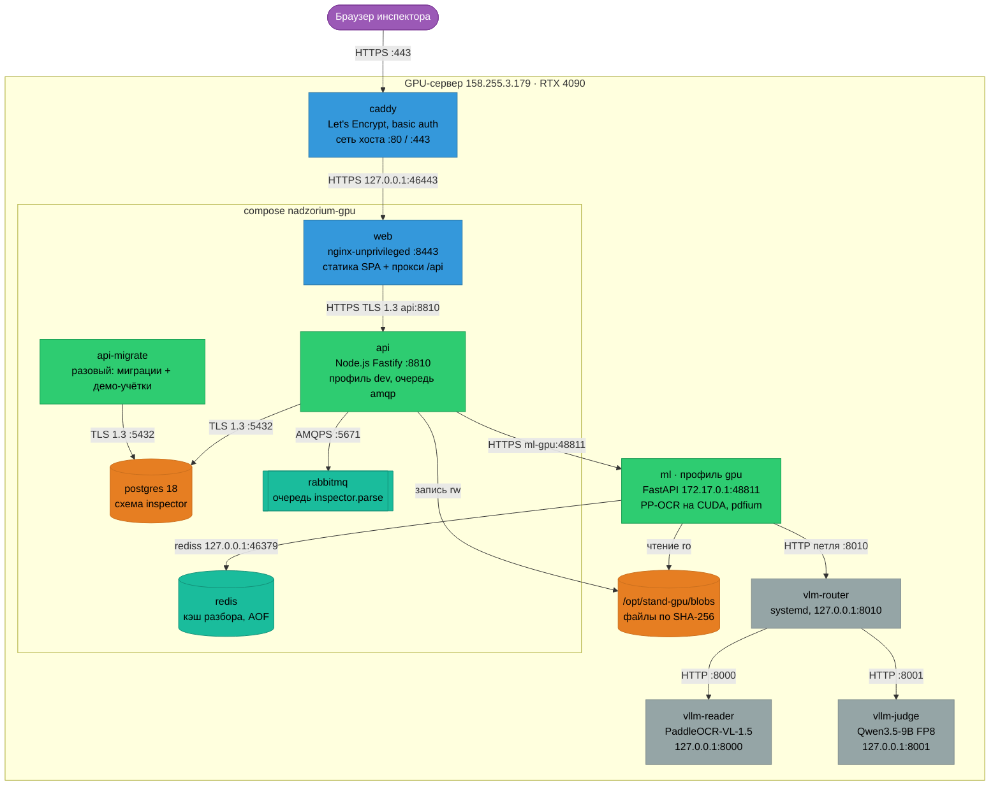

Снаружи открыт только Caddy (80/443); всё остальное слушает `127.0.0.1` или мост `172.17.0.1`.
Между нашими контейнерами — TLS 1.3 с CA стенда (Postgres, RabbitMQ `amqps`, Redis `rediss`, API ↔ ML);
исключение — vLLM и маршрутизатор: открытый HTTP только на петле хоста (`check_vlm_url`), поэтому ML живёт
в сети хоста (`network_mode: host`). vLLM и маршрутизатор запускает не compose, а `deploy/gpu-stand/vllm.sh`
(ревизии HF закреплены, офлайн); маршрутизатор выбирает процесс vLLM по полю `model` запроса.

---

## 3. C4, уровень 3 — компоненты

### 3.1. API (`apps/api/src`)

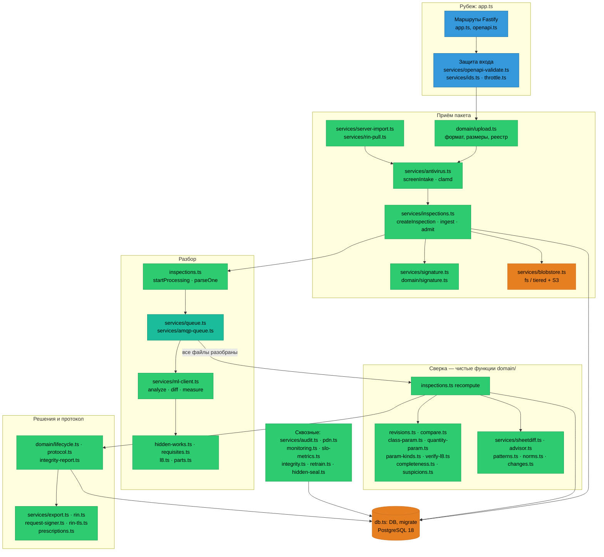

Правило проекта держится в коде: предметная логика — чистые функции в `domain/`, всё, что ходит в базу,
сеть и диск, — в `services/`. Оркестратор проверки — `services/inspections.ts`: приём → выбор редакций →
разбор через ML → пересчёт доказательных групп (`recompute`) → снимок протокола. Ручная загрузка, серверный
импорт и автозабор из «РиН» сходятся в одном шаге приёма (`screenIntake` → `ingest`/`admit`).

### 3.2. ML (`ml/inspector_ml`)

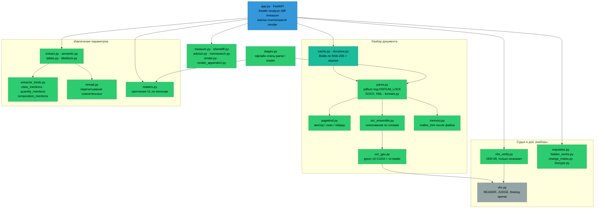

`/analyze` сначала ищет готовый ответ в кэше (SHA-256 файла + состав параметров + версия), затем разобранный
документ (`docstore`), и только потом разбирает сам. В профиле gpu ансамбль OCR — `ppocr-v5,vl-reader`:
PP-OCRv5 на CUDA даёт рамки слов, PaddleOCR-VL читает каждую строку кропом как второй голос; Tesseract в gpu
запрещён, недоступный движок роняет старт (`ocr_gpu.check_ready`). Судья Qwen (`vlm_verify.py`) проверяет
упоминания класса по кропу и может только понизить уверенность.

---

## 4. Поток обработки документа

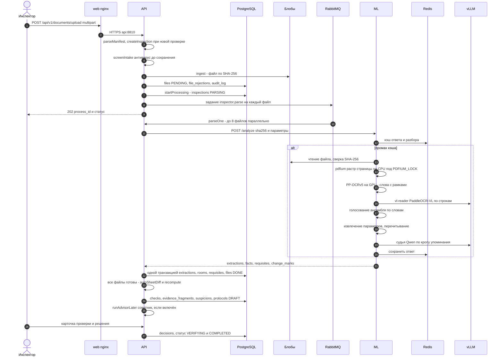

Загрузка и разбор развязаны очередью: запрос возвращает `202` сразу после приёма, а разбор идёт заданиями
RabbitMQ (повтор до 2 раз, затем файл `FAILED` и уведомление администратору). Растеризация pdfium — на CPU
и строго под `PDFIUM_LOCK`, OCR и VL — на видеокарте. Когда разобран последний файл, API пересчитывает
доказательные группы одной транзакцией под блокировкой проверки и выпускает черновик протокола — это и есть
сводка в карточке проверки.

---

## 5. Модель базы данных

PostgreSQL 18, схема `inspector` (`deploy/gpu/postgres/init/10-roles.sh`), 15 применённых миграций плюс журнал
`schema_migrations` (создаёт `db.ts`). В диаграммах сплошная линия — внешний ключ в базе, пунктир — логическая
ссылка без FK (так задумано: решения и журналы переживают пересчёт проверки).

Диаграммы показывают **все 128 ключевых полей ТЗ §10** (T-234): у колонки поля ТЗ в комментарии — `ТЗ <Таблица>.<поле>`
и миграция, если поле добавлено позже 0001. Прочие колонки — только те, без которых не понятна связь. Итог
«поле ТЗ → колонка → где пишется → где читается → тест» — [`docs/qa/t234/tz10-db-coverage.md`](../qa/t234/tz10-db-coverage.md),
проверка схемы — тест `tz10-model-route.test.ts` «каждое из 128 полей 16 таблиц ТЗ — колонка схемы».

### 5.0. Таблицы ТЗ §10 → таблицы схемы

| № | Таблица ТЗ | Таблица схемы | Полей ТЗ | Имя поля в схеме отличается |
|---|---|---|---|---|
| 1 | Params | `params` | 9 | — |
| 2 | Checks | `checks` | 9 | — (param_id, object_id, completeness_status — 0015) |
| 3 | Objects | `objects` | 6 | — |
| 4 | Files | `files` | 12 | file_hash → `sha256`; file_path — генерируемая `blobs/<sha256>` (0015, ADR-0006) |
| 5 | Protocols | `protocols` | 10 | — (object_id — 0015) |
| 6 | Rejection_Log | `rejection_log` | 6 | violation_id → `check_id`; rejection_reason → `reason_code` + `comment`; retraining_status — 0015 |
| 7 | Dispute_Log | `dispute_log` | 6 | violation_id → `check_id`; resolution_status, resolved_by — 0015 |
| 8 | Suspicions | `suspicions` | 6 | — |
| 9 | Logical_Rules | `logical_rules` | 6 | condition → `condition_json`; expected → `expected_json` |
| 10 | Normative_Base | `normative_base` | 9 | — (0015: norm_key, measure, unit, rule, applies_to_json — пределы CMP-06) |
| 11 | ML_Retraining_Log | представление `ml_retraining_log` над `model_versions` | 11 | ADR-0011: split_hashes, per_category_metrics — из колонок *_json реестра; precision, recall, f1, false_positive_rate — из `metrics_json` |
| 12 | Audit_Log | `audit_log` | 8 | — |
| 13 | Monitoring_Metrics | `monitoring_metrics` | 6 | — |
| 14 | Evidence_Fragments | `evidence_fragments` | 8 | — (evidence_group_id — 0015) |
| 15 | Dataset_Items | `dataset_items` | 8 | — |
| 16 | Model_Versions | `model_versions` | 8 | у ТЗ нет id — суррогатный `id`, `model_version` уникален |
| | **Итого** | 15 таблиц + 1 представление | **128** | |

«Нарушение» (violation_id журналов) в схеме — запись `checks` с `verification_status = CONFIRMED_VIOLATION`
или отклонённый кандидат: отдельной таблицы нарушений ТЗ не задаёт (заметка S10). Ссылки `checks.object_id`,
`checks.param_id`, `evidence_fragments.evidence_group_id`, `protocols.object_id` заполняет база триггером из родительской
строки, `checks.completeness_status` и `files.file_path` — генерируемые колонки (миграция 0015).

### 5.1. Приём и разбор

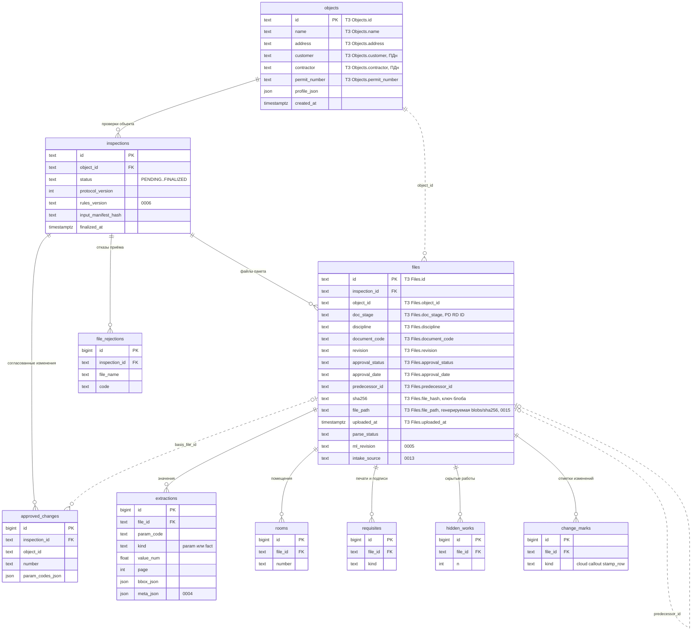

Объект строительства собирает проверки, проверка — файлы пакета. Файл адресуется по содержимому: `file_path` —
путь `blobs/<sha256>` в хранилище (S3 и кэш-том, ADR-0006), по нему идёт проверка целостности хранилища. Всё, что
ML нашёл в файле, хранится по строкам с номером страницы и рамкой и при повторном разборе заменяется целиком.

### 5.2. Сверка, решения и протокол

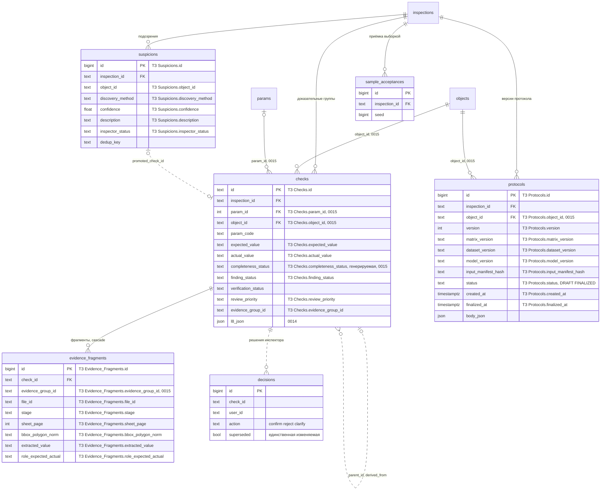

Проверка — набор доказательных групп (`checks`) по параметрам Матрицы; группа опирается на фрагменты документов
с координатами. Статус комплектности (`completeness_status`) хранится отдельно от итога сверки (`finding_status`):
раздел «комплектность и сопоставимость» протокола строится по нему (ТЗ 9.2 п. 4). Решение инспектора (`decisions`) —
след аудита без FK на `checks`, меняться может только флаг `superseded`. Финализированный протокол неизменяем.

### 5.3. Журналы обратной связи: отклонения и споры

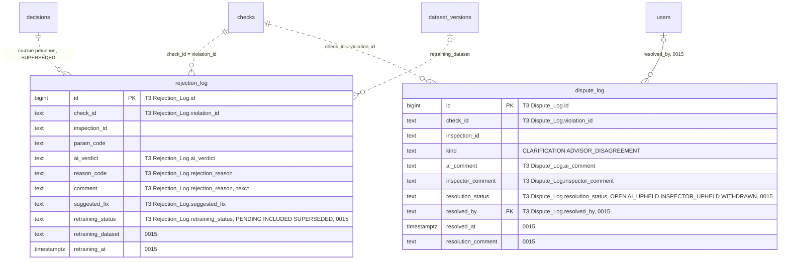

Журналы только дописываются (триггеры 0002/0015): единственное изменение — переход статуса. У записи отклонения
`retraining_status` меняется один раз из PENDING — на INCLUDED при выпуске версии GOLD, в которую вошло отклонение,
или на SUPERSEDED, когда решение снято (триггер на `decisions.superseded`). Спор закрывает супервизор или администратор
(`POST /api/v1/disputes/{id}/resolve`) — один раз, с исходом, автором, временем и записью аудита.

### 5.4. «РиН», справочники и нормативы

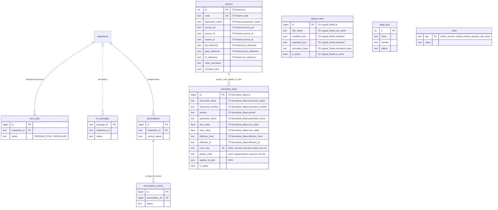

`normative_base` — единственный источник норм (T-234, OS-INSP-7.2.3): пределы сравнения по паспортам (CMP-06, запись
по `norm_key`), сроки действия и активность читает пересчёт; сид `data/seed/norms.json` только наполняет таблицу
новыми ключами. Правка нормы в интерфейсе сразу пересчитывает зависящие параметры открытых проверок (OS-INSP-7.2.4).
Ссылки СП, ГОСТ и ФЗ параметров наполнены из текста Матрицы, основания паспорта и справочника норм (OS-INSP-7.1.25).

### 5.5. Пользователи, аудит, безопасность, мониторинг

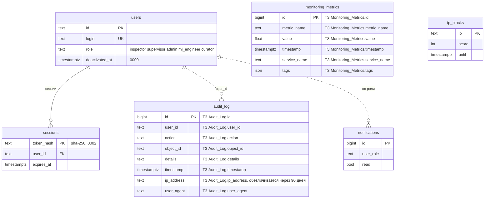

### 5.6. Обратная связь в обучение: набор, журнал дообучения, реестр моделей

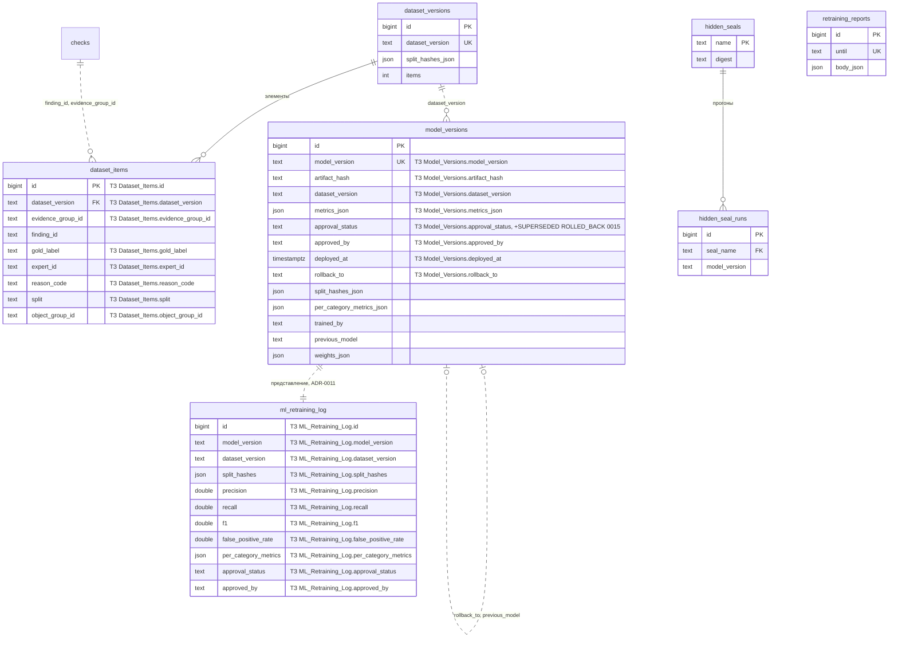

Отрицательные метки набора берут причину и эксперта из журнала отклонений; набор, где доказательная группа попала
в две выборки или у метки нет эксперта, в обучение не идёт (OS-INSP-6.1.10). ML_Retraining_Log и Model_Versions —
одна таблица (ADR-0011): итерация регистрируется одной строкой, журнал дообучения — представление с полями ТЗ.
В контуре одна действующая модель: публикация переводит прежнюю в SUPERSEDED и пишет её в `rollback_to` новой;
откат (`POST /api/v1/ml/models/{v}/rollback`) снимает действующую (ROLLED_BACK) и возвращает `rollback_to`. Веса
действующей модели применяются, только если их хеш совпадает с `artifact_hash`.
