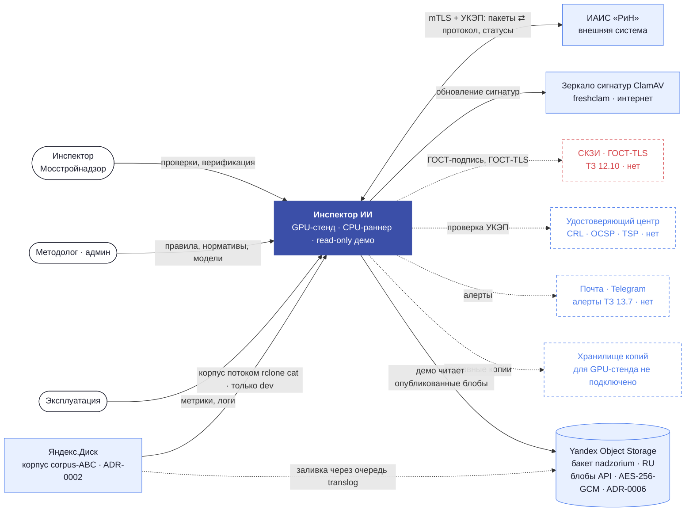
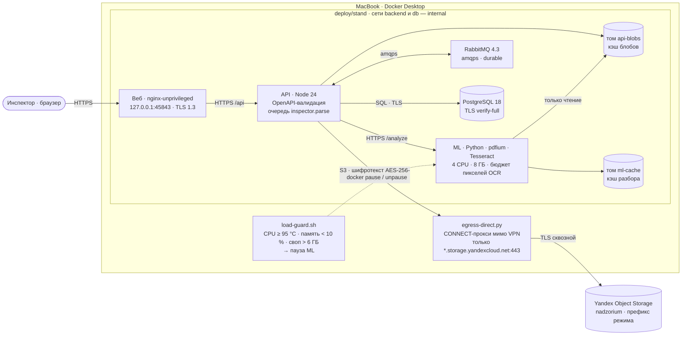

# Архитектура «Инспектора ИИ» — C4, уровни 1–2

Интерактивная версия с разбором «зоопарка» — [`docs/gera/ARCHITECTURE.html`](../gera/ARCHITECTURE.html),
кнопка «Архитектура» на карте трассы. Генератор — `scripts/arch-map.mjs` (`pnpm trace`). Меняется
архитектура — правятся оба файла. Источники: `deploy/gpu-stand/compose.yml`, `deploy/demo/compose.yml`, `deploy/gpu/compose.yml`, ADR-0001…0009, `docs/ops/REMOTE-RUNNER.md`, аудиты OWASP T-184/T-185. Конфигурация, прежние живые проверки и текущий runtime здесь помечаются отдельно.

## Текущие контуры и границы подтверждения

| Контур | Назначение | Свидетельство |
|---|---|---|
| GPU-стенд `nadzorium-gpu` | RTX 4090, GPU OCR и vLLM; локальные блобы; RIN mock; AV off; без мониторинга и backup в его compose | Конфигурация `deploy/gpu-stand`; live-аудиты T-184/T-185 от 28.09.2026. Снимок процессов 29.09 приведён ниже |
| `deploy/gpu` | Целевая конфигурация с иным набором сервисов; GPU OCR и vLLM нельзя выводить из отдельного GPU-стенда | Только код-конфигурация; самостоятельный rollout здесь не подтверждён |
| CPU-раннер | Сборки, тесты и стенды веток; CUDA отключена | ADR-0009 от 28.09.2026 |
| Демо `nadzorium` | Только чтение результатов публикации; мутации API отвечают 403 | Код и предыдущие проверки описаны в T-131; текущее состояние не опрашивалось |

### Снимок процессов 29.09.2026, 15:31 UTC

Read-only SSH-проверка: web/API/PostgreSQL/RabbitMQ/Redis healthy; vLLM reader работает; ML-контейнер остановлен (137), judge остановлен (0). RTX 4090: 6259/24564 МиБ. Это наблюдение процесса, не сквозная проверка инференса.

## Уровень 1 — контекст

Сплошные линии — то, что работает сегодня. Пунктир — внешние стороны, которые ТЗ требует подключить.

## Уровень 2 — GPU-стенд nadzorium-gpu (T-185)

Модуль дообучения (учитель разметки, верификатор извлечения, реестр итераций, ворота, подпись) — [`RETRAIN.md`](RETRAIN.md).

Схема отражает фактическую конфигурацию отдельного GPU-стенда, а не общий `deploy/gpu` профиль. Последние живые проверки
периметра, vLLM и GPU-контура сохранены в аудитах T-184/T-185 от 28.09.2026; снимок процессов 29.09 приведён выше.
Пробелы этого стенда и статус целевой конфигурации различаются. Основания каждого — в таблице на странице
[`ARCHITECTURE.html`](../gera/ARCHITECTURE.html).

```mermaid
flowchart TB
  insp(["Инспектор"])
  meth(["Методолог · админ"])
  ops(["Эксплуатация"])
  rin["ИАИС «РиН»"]
  uc["Удостоверяющий центр<br/>CRL · OCSP · TSP"]
  notify["Почта · Telegram"]
  offsite[("Внешнее хранилище копий")]

  subgraph stand["Инспектор ИИ · nadzorium-gpu · deploy/gpu-stand/compose.yml"]
    subgraph product["Продукт — три своих сервиса"]
      web["<b>Веб</b><br/>React 19 · Vite 6<br/>nginx-unprivileged :8443"]
      api["<b>API</b><br/>Node 24 · Fastify 5 · TS<br/>REST /api/v1 · TLS 1.3"]
      ml["<b>ML</b><br/>Python · FastAPI<br/>PP-OCR · ONNX Runtime CUDA<br/>PaddleOCR-VL + Qwen через vLLM"]
    end
    subgraph data["Данные"]
      pg[("PostgreSQL 18<br/>миграции · ADR-0003")]
      blobs[("Кэш блобов по SHA-256<br/>том api-blobs · ML читает")]
      s3[("Локальные блобы<br/>/opt/stand-gpu/blobs<br/>ML монтирует read-only")]
    end
    subgraph tz["Требует ТЗ"]
      rabbit["RabbitMQ 4.3<br/>ТЗ 1.5"]
      redis[("Redis 8.8<br/>ТЗ 9.1.5")]
      clamav["ClamAV<br/>ТЗ 12.11"]
    end
    subgraph obs["Наблюдаемость"]
      prom["Prometheus 3.15<br/>ТЗ 13.5, 13.7"]
      grafana["Grafana 12.4"]
      logstash["Logstash 9.5"]
      es[("Elasticsearch 9.5<br/>+ es-setup")]
      kibana["Kibana 9.5"]
      alertm["Alertmanager 0.34<br/>ТЗ 13.7 · T-085"]
    end
    subgraph needtz["Требует ТЗ — в стенде нет"]
      skzi["Шлюз СКЗИ<br/>сайдкар api · ТЗ 12.10"]
      export["Экспортёры метрик<br/>ТЗ 13.4"]
      backup["Бэкап по расписанию<br/>ТЗ 12.8 · T-072"]
      atrest["Шифрование в покое<br/>ТЗ 12.3"]
      ids["IDS · защита от DDoS<br/>ТЗ 12.9"]
      train["LoRA судьи — отдельный этап<br/>T-156 · см. RETRAIN.md"]
    end
    subgraph needteam["Решение команды — в стенде нет"]
      gpuocr["GPU-OCR и vLLM настроены<br/>T-184/T-185; не в deploy/gpu"]
      llm["vLLM reader + judge<br/>RTX 4090 · живые проверки T-185"]
      worker["Воркер разбора<br/>потребитель RabbitMQ"]
      edge["Входной прокси<br/>T-060"]
    end
  end

  insp --> web
  meth --> web
  web -->|HTTPS /api/v1| api
  api -->|HTTP /analyze /advise /diff …| ml
  api -->|amqps: durable-очередь разбора, ack после разбора,<br/>повтор и восстановление после сбоя| rabbit
  api -->|clamd INSTREAM| clamav
  api -->|SQL, пул pg| pg
  api -->|запись и кэш| blobs
  api -->|S3 API · шифротекст| s3
  ml -.->|чтение| blobs
  ml -->|кэш разбора| redis
  api <-->|mTLS + УКЭП| rin
  prom -->|/metrics| api
  grafana --> prom
  api -.->|GELF через демон Docker| logstash
  ml -.-> logstash
  logstash --> es
  kibana --> es
  ops --> grafana
  ops --> kibana

  edge -.->|HTTPS| web
  api -.->|HTTP на loopback| skzi
  skzi -.->|ГОСТ-mTLS| rin
  api -.->|CRL, OCSP, метка времени| uc
  prom -->|алерты| alertm
  alertm -.->|почта, Telegram| notify
  prom -.->|/metrics| export
  backup -.->|копии БД, файлов, логов| offsite
  ml -.-> gpuocr
  ml -.->|HTTP| llm
  worker -.->|AMQP| rabbit
  worker -.->|HTTP| ml
  train -.->|веса| s3

  classDef person fill:#FFFFFF,stroke:#1D1F2E,color:#1D1F2E
  classDef prod fill:#3B4FA8,stroke:#3B4FA8,color:#FFFFFF
  classDef store fill:#EAEDF8,stroke:#A9B2D8,color:#1D1F2E
  classDef tzc fill:#FFF4DC,stroke:#E0A21A,color:#1D1F2E
  classDef obsc fill:#EEF0F5,stroke:#9097AD,color:#1D1F2E
  classDef ext fill:#E8F0FF,stroke:#4B7BEC,color:#1D1F2E
  classDef ghostx fill:#FFFFFF,stroke:#4B7BEC,stroke-dasharray:5 4,color:#4B7BEC
  classDef ghost fill:#FFFFFF,stroke:#D6454A,stroke-dasharray:5 4,color:#D6454A
  classDef ghostc fill:#FFFFFF,stroke:#9097AD,stroke-dasharray:5 4,color:#474B62
  class insp,meth,ops person
  class web,api,ml prod
  class pg,blobs,s3 store
  class rabbit,redis,clamav tzc
  class prom,grafana,logstash,es,kibana,alertm obsc
  class rin ext
  class uc,notify,offsite ghostx
  class skzi,export,backup,atrest,ids,train ghost
  class gpuocr,llm,worker,edge ghostc
```

## Прежний Docker-стенд на Mac (T-129; исторический)

`deploy/stand/compose.yml`, запуск — `scripts/stand.sh up --yandex`: те же образы по git-sha, что и для сервера;
профиль dev, но каналы как в gpu — TLS 1.3 везде (`INSPECTOR_INTERNAL_TLS=required`). Наружу — только
`127.0.0.1:45843`. Секреты — файлами (compose secrets), пароль брокера тоже (SEC-07).

Надёжность разбора (OS-INSP-2.1.9–2.1.11): задание подтверждается после разбора — перезапуск API или отключение
питания не теряют файлы, брокер вернёт неподтверждённые; при старте `recoverParsing` дочищает застрявшие проверки;
файл берёт ровно одно задание (атомарный захват), дубли пропускаются; перед повтором API ждёт готовности ML;
ответ ML ждётся по `INSPECTOR_ML_TIMEOUT_MS`, а не 5 минут умолчания undici. Прогон «Алтуфьевское 79Б»: 802 МБ
загружены за 40 с, 57 файлов разобраны без OOM и повторов.

## Инструменты разработки: Mac-редактор и удалённый раннер

Рабочий ML-контур — GPU-стенд: OCR, чтение и VLM-инференс описаны выше.
Профиль `INSPECTOR_PROFILE=dev` и удалённый раннер относятся к инструментам разработки и не представлены как альтернативный рабочий ML-контур.
Локальный Docker-стенд на Mac больше не штатный способ работы. По принятому 28.09 ADR-0009 Mac используется как редактор;
сборки, тесты и стенды веток выполняет `scripts/remote-run.sh` на Linux CPU-раннере (`/opt/w1-gate`, ядра слота 24–31,
`CUDA_VISIBLE_DEVICES=`). На раннере тесты и демо используют синтетику. Корпус и кэш T-165 разрешены только для чтения;
наружу передаются только агрегаты. См. `docs/ops/REMOTE-RUNNER.md` и `docs/ops/WAVES.md`.

## Объектное хранилище (с 2026-09-26)

| Что | Значение |
|---|---|
| Сервис | Yandex Object Storage, регион `ru-central1` (Москва), endpoint `storage.yandexcloud.net` |
| Бакет | `nadzorium`: стандартный класс, лимит 200 ГБ, доступ только с авторизацией, без версионирования и KMS |
| Где | организация `organization-almaz-qxp` → облако `src-user-cloud-almaz-qxp` → каталог `default` |
| Оплата | платёжный аккаунт NADZORIUM: грант 5 000 ₽ до 25.11.2026, затем деньги аккаунта. 200 ГБ стандарта ≈ 473 ₽/мес |
| Доступ | сервисный аккаунт `nadzorium-s3` (`ajet2de3oq7teee8dt61`) — потребитель «заливка владельца»; роль `storage.uploader` только на бакет `nadzorium` (на каталог ролей нет): загрузка и чтение, без удаления. Список бакетов ему закрыт (403) |
| Креды | `.secrets/yandex-s3-nadzorium.env` — вне git (`.gitignore`); rclone-ремоут `nadzorium:` (`no_check_bucket`). Первый ключ удалён как засвеченный, действует перевыпущенный (ADR-0004 п.7) |
| Назначение сейчас | 1) блобы API (T-129, ADR-0006): префикс режима стенда (`blobs/`, `demo-…/`), только шифротекст; 2) хранилище данных владельца — заливка только через `translog enqueue` (правило №1) |
| Код | `apps/api/src/services/blobstore.ts`: `BlobStore` fs \| tiered (кэш-том + S3), шифрование на клиенте AES-256-GCM (ключ — файл-секрет), сверка SHA-256 после расшифровки; паритет на MinIO в гейте. Корпус ADR-0002 в бакет — только отдельным решением |

Правила — [ADR-0004](../adr/ADR-0004-object-storage.md): код говорит только с S3-совместимым API, провайдер —
конфигурацией; без SSE-KMS в бакет не кладутся ни ПДн, ни корпус; первый потребитель в коде — бэкап PostgreSQL
(T-072), блобы — по триггеру второго хоста (`BlobStore`: fs и s3, паритет на MinIO); у каждого потребителя свой
сервисный аккаунт с ролью только на свой бакет или префикс.

## Зоопарк: вывод

- **Главное изменение после ADR-0001 — появился отдельный GPU-стенд:** T-184/T-185 описывают GPU OCR и vLLM на RTX 4090. Старый Mac-стенд и MLX-прогоны — исторические; значения из QA М-023 не являются GPU-бенчмарком. Общий `deploy/gpu` профиль не считать развёрнутым только на основании стенда `deploy/gpu-stand`.
- GPU-стенд T-185, CPU-раннер и публичное read-only демо — разные контуры. Число контейнеров не приводится как свойство всей системы: состав определяется выбранным compose.
- **ELK** (Elasticsearch, Logstash, Kibana) — по оценке ~3,3–4 ГБ RAM, больше всего продукта.
  Вопрос организатору (T-078): допускает ли ТЗ 13.6 эквивалент — Loki в уже работающую Grafana.
- **RabbitMQ** даёт устойчивость: durable-очередь, ack после разбора, восстановление после сбоя, атомарный захват
  файла (T-129). Потребитель пока в процессе API; следующий шаг — отдельный воркер, чтобы масштабировать ML.
- ~~PostgreSQL обещан ADR-0001, но в стенде его нет~~ — **закрыто ADR-0003 (T-107, 26.09)**: PostgreSQL 18 в compose
  (uid 70, read-only, секрет из файла), dev и тесты — PGlite, тот же движок; ML больше не видит базу.
- **Хранилище зависит от контура.** Прежний Mac-стенд шифровал блобы в S3; read-only демо читает опубликованные блобы. GPU-стенд T-185 хранит блобы локально в `/opt/stand-gpu/blobs`, без S3. Вопросы открытого хранения на GPU-хосте зафиксированы OWASP-0191.
- `deploy/gpu` содержит проверенный сценарий бэкапа: pg_basebackup ежедневно, WAL-архив, учение восстановления RTO 1,3 с / RPO 120 с (T-072). В GPU-стенде T-185 backup и шифрование в покое не включены; это отдельные открытые находки OWASP-0191/0197.

RAM со знаком «~» — оценка по типичному потреблению образа; замер — T-075.

## Верификация и разметка как часть дообучения

Модуль T-244 опубликован по адресу https://nadzorium-gpu.almazrobots.ru/verification/.
В ревизии df65e188 присутствуют `services/verification-routes.ts`, `services/data-verification.ts`,
`services/annotation-library.ts` и тесты `verification-http.test.ts`, `data-verification.test.ts`.
Это инвентаризация исходников опубликованного модуля, без запуска.

Разметка → выпуск набора → обучение → оценка качества → утверждение и публикация.
Первый этап включает задания, ответы, комментарии, исправления и разбор разногласий.
`releaseAnnotationDataset` выпускает `annotation-dataset.v1` с хешем и разбиением.
GOLD по решениям инспектора и обучение ранжира T-100 существуют как отдельный путь
(`domain/gold.ts`, `services/retrain.ts`, `domain/retrain.ts`, `pages/Ml.tsx`).
Связь нового набора T-244 с тренером и обучение LoRA судьи нельзя считать готовыми
только по наличию разметки. Пробел относится к этим этапам, а не ко всему процессу.
