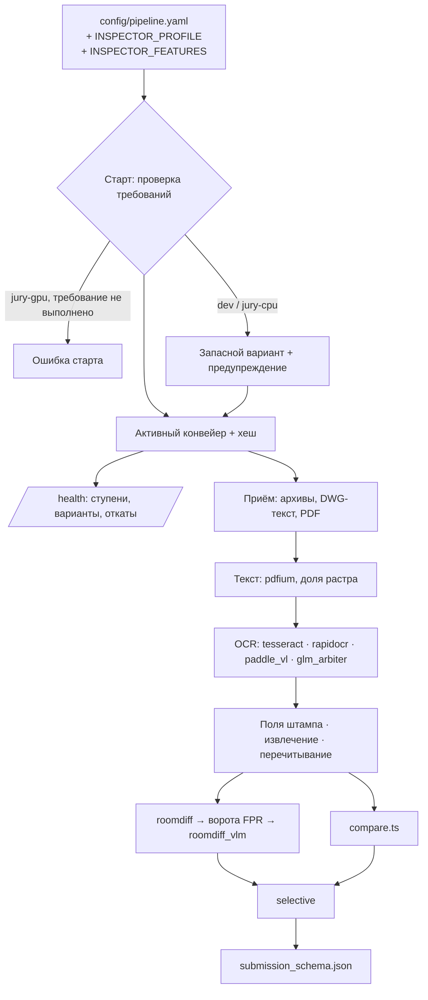

# ML-концепция «Инспектора ИИ»

Единый документ. Сводит инвентарь кода, инвентарь данных организатора и выводы панели из пяти экспертов
(Document AI/OCR, CV чертежей, LLM/NLP, оценка/MLOps, скептик-архитектор). Статус — черновик на решение владельца.

**Решение владельца 26.09:** вопрос GPU откладывается (ищем облачные мощности). До тех пор конвейер строится
от **системы флагов**: каждая модель — ступень под флагом, GPU-ступени выключены, и включение любой из них
не требует правки кода — только флаг и доступный ресурс.

Стоп-код — 29.09.2026 23:59 МСК.

## 1. Что есть на 26.09

### 1.1. Модели и эвристики

| Ступень | Что работает сейчас | Где включено |
|---|---|---|
| Текст PDF | pypdfium2, порог 20 символов на страницу, всё под `PDFIUM_LOCK` | везде |
| OCR | 3 прохода Tesseract (psm4, prep, psm6), голосование по словам IoU ≥ 0,3 | везде |
| OCR на GPU | адаптеры `paddleocr-vl` (API 2.x, `paddleocr<3`), `glm-ocr`, `mineru` — заглушки, включаются сами при импорте пакета | фактически нигде: GPU-пакетов в образе нет |
| Перечитывание значения | `reread.py`: 3 варианта предобработки, 2 из 3 | везде |
| Извлечение 132 параметров | rapidfuzz, якоря 90 / 82 (OCR), regex значения | везде |
| Семантические якоря | MiniLM-L12 ONNX CPU, cos ≥ 0,84 — **единственная нейросеть** | везде, если модель на месте |
| Вид документа, реквизиты | regex, ГОСТ 21.110, HSV печати | везде |
| Измерения на чертеже | `measure.py` (Хаф, масштаб) | только UI, в находки не идёт |
| Дифф редакций листа | `sheetdiff.py` (SIFT, RANSAC, SSIM) | везде, `INSPECTOR_SHEET_DIFF_AUTO` |
| Советник свободного поиска | LLM (Ollama / MLX) за валидатором цитат с bbox | dev — если задана модель; стенд — `none` |
| Поиск по нормам | BM25 + реранк `qwen3-embedding:0.6b` через Ollama | стенд — только BM25 |
| Ранжирование кандидатов | logreg + Платт (`retrain.ts`), ворота публикации в `gold.ts` | нет данных для обучения |
| Паттерн-анализ | медиана/MAD (`patterns.ts`) | нужна история ≥ 5 объектов |

### 1.2. Флаги, которые уже есть

Разбросаны по коду, единого реестра нет:

| Переменная | Что делает | Как проверяется |
|---|---|---|
| `INSPECTOR_PROFILE` | `dev` / `gpu` | громко при старте (ADR-0001) |
| `INSPECTOR_LLM_PROVIDER` | `ollama` / `mlx` / `none` | в gpu обязателен явно, неизвестное — SystemExit (T-086) |
| `INSPECTOR_LLM_MODEL`, `INSPECTOR_MLX_MODEL`, `INSPECTOR_OLLAMA_URL` | модель советника | пусто — советник молча недоступен |
| `INSPECTOR_EMBED_MODEL`, `INSPECTOR_EMBED_FILE`, `INSPECTOR_EMBED` | эмбеддер | **конфликт:** в `semantic.py` это путь, в `normsearch.py` — имя модели Ollama |
| `INSPECTOR_SHEET_DIFF_AUTO` | автодифф листов | по умолчанию `1` |
| `INSPECTOR_CACHE`, `INSPECTOR_QUEUE`, `INSPECTOR_AV` | инфраструктура | по профилю, громко в gpu |
| (нет переменной) | GPU-движки OCR | **неявно:** включаются, если пакет импортируется |

### 1.3. Данные и оценка

- Все метрики качества (1,000) — на своей синтетике без отложенной выборки. Для жюри ничего не значат.
- На реальных сканах 78 % OCR-страниц LOW_QUALITY; `compare.ts` уверенность не учитывает.
- **Все 10 размеченных находок TRAIN — ОВ, ПД↔РД по помещениям, без чисел**; 3 группы из 4 критические.
  60 баллов F1 — на задаче, которую конвейер не решает. Пропуск критической находки — потолок 59.
- ПД на доказательствах — **принципиальные схемы** (помещение = прямоугольник с кодами систем В2.7, П3…),
  РД — **планы этажей**. Сравнивать изображения бессмысленно; сравнивать надо **множества кодов систем по помещению**.
- Выгрузки в `submission_schema.json` и перевода кодов `M-NNN ↔ PZ-/IOS4-` нет — без неё ноль объективных баллов.
- OCR под глобальным замком, uvicorn — один процесс, очередь `concurrency: 2`: экзаменационный объект
  (~16 тыс. стр., 56 % сканов) — 10–15 часов.
- Полный `deploy/gpu/compose.yml` целиком не поднимался; обязательные `${…:?}` на РиН/TLS/ELK.
- В экзаменационном объекте 38 архивов (~662 DWG внутри); код не знает ни архивов, ни DWG.
- ADR-0001 обещает PaddleOCR/Surya, sentence-transformers и vLLM в prod — в коде этого нет. Таблицу слотов
  ADR-0001 заменяет реестр флагов (раздел 3) — потребуется ADR-0003.

## 2. Принцип

**Детерминированный код решает, модели читают и подтверждают.** Так устроены и статья arXiv 2609.26760,
и сам проект (`compare.ts` решает, советник за валидатором). Модель никогда не создаёт находку в одиночку.

## 3. Флаговая система — от неё строится конвейер

### 3.1. Правила

1. **Один реестр** — `config/pipeline.yaml`: все ступени, их варианты, флаги, требования и запасной вариант.
   Код ступеней регистрируется по имени, конвейер собирается из реестра при старте.
2. **Пресеты вместо профилей.** `INSPECTOR_PROFILE` выбирает набор значений флагов: `dev`, `jury-cpu`, `jury-gpu`.
   Точечная правка поверх пресета — `INSPECTOR_FEATURES="ocr.paddle_vl=on,roomdiff.vlm=off"`.
3. **По умолчанию выключено всё, что требует GPU, сети или непроверенной модели.**
4. **Явно, а не по импорту.** Ступень включается флагом; пакет или сервер — это требование, а не выключатель.
   `ExternalEngine` перестаёт включаться сам.
5. **Требования проверяются при старте:** пакет, файл весов с SHA-256, URL сервера (healthcheck), GPU.
   - в `jury-gpu` невыполненное требование включённой ступени — **ошибка старта** (громко, как T-086);
   - в `dev` и `jury-cpu` — предупреждение и переход на запасной вариант ступени.
6. **Неизвестный флаг — ошибка старта** в любом пресете.
7. **Набор флагов — часть результата:** хеш активного конвейера входит в ключ кэша `/analyze`, в журнал прогонов
   и в протокол; `/health` показывает ступени, выбранные варианты и причину отката.
8. **Один флаг — один тест:** включён / выключен / требование не выполнено → ожидаемое поведение.

### 3.2. Реестр ступеней

| Ступень | Флаг | Вариант | Требует | Запасной | dev | jury-cpu | jury-gpu |
|---|---|---|---|---|---|---|---|
| Приём | `ingest.archives` | bsdtar, лимиты, cp866 | `bsdtar` | пропуск архива с NOT_COMPARABLE | on | on | on |
| Приём | `ingest.dwg_text` | LibreDWG `dwg2dxf` → ezdxf: TEXT/MTEXT/ATTRIB, слои, блоки, полилинии; DWG — свидетель, bbox — из PDF | бинарь LibreDWG | NOT_COMPARABLE (не MISSING) | on | on | on |
| Текст | `parse.raster_share` | доля растра на смешанной странице | — | порог 20 символов | on | on | on |
| Текст | `parse.parallel` | OCR вне `PDFIUM_LOCK`, пул по страницам | — | последовательно | on | on | on |
| OCR | `ocr.tesseract` | Tesseract-prep | `tesseract` | — (базовый, выключить нельзя) | on | on | on |
| OCR | `ocr.rapidocr` | PP-OCRv5 eslav ONNX | веса в образе | без него | off | on | on |
| OCR | `ocr.paddle_vl` | PaddleOCR-VL-1.5 через vLLM | URL + GPU | Tesseract | off | off | on |
| OCR | `ocr.glm_arbiter` | GLM-OCR на вырезках | URL + GPU | без арбитра | off | off | on |
| OCR | `ocr.tiling` | тайлы 2048 px для A2 и крупнее | — | целый лист | off | on | on |
| Поля | `fields.stamp` | штамп ГОСТ Р 21.101 + `cipher.py` | реестр шифров | regex заголовка | on | on | on |
| Связка | `link.gliner` | GLiNER2.5-multi-Decide: ссылки ИД→РД, вид документа | сервис `gliner` (torch CPU) | regex | off | off → on после замера (4.1) | off → on после замера |
| Извлечение | `extract.semantic` | MiniLM ONNX | файл модели | лексика | on | on | on |
| Извлечение | `extract.reread` | перечитывание 2 из 3 | `tesseract` | без перечитывания | on | on | on |
| Решение | `decide.roomdiff` | множества кодов систем по помещению | — | нет находок по помещениям | on | on | on |
| Решение | `decide.roomdiff_vlm` | VLM-верификатор спорных помещений | URL LLM | COMPARISON_IMPOSSIBLE | off | off | on |
| Решение | `decide.selective` | отказ от ответа с асимметрией по критичности | — | как сейчас | on | on | on |
| Решение | `decide.sheetdiff` | дифф редакций листа | — | — | on | on | on |
| Гипотезы | `hyp.advisor` | LLM за валидатором цитат | провайдер + модель | без советника | off | off | on |
| Гипотезы | `hyp.advisor_export` | советник в выгрузку жюри | — | только UI | off | off | **off** |
| Гипотезы | `hyp.patterns` | медиана/MAD | история ≥ 5 объектов | молчит | on | on | on |
| Ранжирование | `rank.ai_score` | logreg | опубликованная модель | без оценки | off | off | off |
| Выход | `out.submission` | `submission_schema.json` | таблица кодов | — | on | on | on |

`jury-cpu` — то, что сдаётся, пока GPU нет: работает на 24 ядрах стенда, GPU не требует, в compose нет
`reservations: nvidia`. `jury-gpu` — override-файл compose с GPU-сервисами; включается, когда будут часы GPU для замера.

### 3.3. Как собирается конвейер

## 4. Целевой ансамбль по ступеням

| Участок | Модель / метод | Почему |
|---|---|---|
| Сравнение ПД↔РД по помещениям | **Код**: якоря помещений, коды систем regex, привязка к ячейке схемы / заливке плана, объединение по всем листам РД этажа, цвет воздуховодов как перекрёстная проверка | 60 баллов; это текст, не картинка |
| Верификатор спорных помещений | Qwen3.5-9B (≈ 19 ГБ BF16) или Qwen 27B FP8 (≈ 31 ГБ) на vLLM; читает текст на двух кропах, ответ enum | VLM читают текст на чертежах до 0,95, знаки считают на 0,09–0,55 (AECV-Bench) |
| OCR первичный на GPU | PaddleOCR-VL-1.5 (0,9B, Apache-2.0, кириллица ED 0,109). **Не 1.6** — регрессия кириллицы, issue #18088 | лучший на кириллице и сканах среди открытых |
| OCR арбитр | GLM-OCR (0,9B, MIT) — другое семейство, ошибки не коррелируют | только на вырезках полей Матрицы |
| OCR на CPU | Tesseract-prep + RapidOCR PP-OCRv5 eslav ONNX вместо psm6 | три Tesseract ошибаются одинаково |
| Ключевые поля | штамп → regex → `cipher.py` (сейчас в сервисе не вызывается) → стадия по шифру | дешевле и надёжнее LLM, EM ≥ 0,90 |
| DWG | LibreDWG (GPLv3, отдельный процесс) + ezdxf (MIT): текст, атрибуты штампа, слои, блоки | Q&A №10: не обязательно, **делаем по решению владельца 26.09** — 662 DWG экзамена = векторная истина РД; ODA — лицензионный риск |
| Эмбеддер | MiniLM остаётся; порог 0,84 перекалибровать на x86 quint8; кандидат — deepvk/USER2-base | — |
| Ссылки ИД→РД, вид документа | GLiNER2.5-multi-Decide — условно, по правилам раздела 4.1 | единственная ступень, где у нас есть данные для честной проверки |
| Не брать до стоп-кода | MinerU (кириллица 0,832), PaddleOCR-VL-1.6, дообучение, `retrain.ts`/`patterns.ts` | — |

### 4.1. GLiNER — где и при каких условиях

**Где не нужен:** сравнение по помещениям (60 баллов) — там коды систем, их надёжнее ловит regex;
извлечение чисел 132 параметров — якорь + regex.

**Где нужен — связка документов и комплектность** (10 баллов объективной части + 1 на доске, порог связки 0,95):

1. **Ссылки из актов ИД на РД.** Акт скрытых работ ссылается на шифр, изменение и листы РД свободным текстом:
   «132-0621-ОК-1/Н-4-КЖ03.1.3 изм.4 … лист 1-20». Форматы разные, regex на них ломается. GLiNER извлекает
   спаны «шифр», «изменение», «листы», «дата акта», «вид работ» за один проход, без генерации.
2. **Вид документа по первой странице:** стадия, марка (ОВ, ВК, КЖ…), тип (чертёж, спецификация, акт, ПЗ).
   Сейчас 109 из 154 файлов корпуса — `other`.

**Данные, которые нашлись в архивах** (опись соседней сессии, `КАРТА_ВЫБОРКИ.md`, открытая часть архива 02):

| Набор | Объём | Качество | Годится для |
|---|---|---|---|
| `СВЯЗИ_ИД_РД.jsonl` | 212 связей акт ИД → документ РД с текстом ссылки и датой | разметка организатора, статус проверки уточнить | оценка извлечения ссылок |
| `РАЗМЕТКА_8929_ФАЙЛОВ.jsonl` | 8929 файлов, 9 объектов: стадия, раздел, OCR_REQUIRED | `REVIEWED_AUTOMATICALLY`, стадия из пути, раздел в основном `OTHER`; `training_eligible_labels: 0` | вид документа по стадии, разбиение по объектам |
| `ГРУППЫ_ТОЧНЫХ_ДУБЛЕЙ`, `ДЕФЕКТЫ_И_КАНДИДАТЫ` | 963 группы, 48 дефектов | дефекты комплекта | целостность, не GLiNER |

Размеченного корпуса нарушений в архивах нет: 48 «находок» — дефекты комплекта, задания 9×132 не заполнены.
Метки стадий автоматические — это шумный, но большой и разнесённый по 9 объектам набор; для обучения его
брать нельзя (`training_eligible: false`), для оценки — можно, с пометкой SILVER.

**Условия, при которых GLiNER входит в сдаваемый пресет:**

1. **Русский подтверждён на наших текстах:** 10 актов и 10 первых страниц — спаны находятся.
2. **Выигрыш над regex на отложенных объектах:** оценка по `СВЯЗИ_ИД_РД` и стадиям 9 объектов, разбиение по объектам;
   правило регламента — ≥ +3 исправленных при 0 новых ошибок, точность связки не ниже текущей.
3. **CPU и время:** ≤ 500 мс на документ (§11), пик RAM ≈ 2 ГБ.
4. **Упаковка без torch в образе ML:** отдельный сервис `gliner` (torch CPU) за флагом `link.gliner`,
   запасной вариант — regex. На маке torch не ставим: замер — на hk-nl-heavy (CPU хватает) или в отдельном uv-окружении
   вне репозитория после освобождения диска.
5. **GLiNER только предлагает спан, решает валидатор:** шифр сверяется с реестром (`cipher.py`), лист — с составом РД.

Трудозатраты — около полудня на замер. Не прошёл — флаг остаётся выключенным, запись в журнал.

**Ноу-хау — не сама модель** (она публичная, Apache-2.0), а схема меток под строительную документацию,
дообученные на ней веса и валидаторы вокруг. Дообучение — после хакатона, когда наберутся проверенные
ссылки: GLiNER учится на сотнях примеров, 212 связей — хорошая стартовая точка.

## 5. Отказ от ответа — `apps/api/src/domain/selective.ts`

| Сигнал | Некритичный параметр | Критичный параметр |
|---|---|---|
| Расхождение, оба значения уверенные | VIOLATION_PRESENT | VIOLATION_PRESENT |
| Расхождение, значение сомнительное (LOW_QUALITY, disputed, conf < 0,7), перечитывание не подтвердило | COMPARISON_IMPOSSIBLE + reason_code | VIOLATION_PRESENT «требует проверки» — пропуск дороже |
| Совпадение на плохой странице | COMPARISON_IMPOSSIBLE | COMPARISON_IMPOSSIBLE |
| Помещение только в одной стадии / глобальное переименование систем (> 30 % этажа) | COMPARISON_IMPOSSIBLE | COMPARISON_IMPOSSIBLE |

## 6. Оценка при 10 примерах

- Один размеченный объект → о переносе на скрытый объект не знаем ничего. Публикуем счётчики TP/FP/FN/abstain
  и ДИ Уилсона с кластеризацией по группе (честный n ≈ 4). `ci.py` при одном объекте схлопывает ДИ в точку — исправить.
- FPR ≤ 0,10 доказать нельзя без ≥ 30 проверенных отрицательных примеров. Источник — ≈ 30 помещений на известных
  листах ОВ, подтверждённых глазами (2–3 часа человека).
- Уровни данных не сливаются: GOLD / SILVER / INJECTED / SYNTH.
- Скорер в трёх вариантах (формула организатора не опубликована): `parameter_code+location+label`;
  то же + `file_id+page`; по группе.
- Тест-страж: номера эталона (`F0171`, `F0201`, помещения 012, 140, 142, 147, 198, 267–272, 314) в `ml/` и
  `apps/api/src/domain` запрещены.
- **TEST_HIDDEN — никогда.**

**Регламент приёма модели (ступени) в ансамбль:** карточка до прогона → стадийный набор → парное сравнение
(≥ +3 исправленных при 0 новых ошибок) → гейт → включение флага в пресет. Отсечки: открытая лицензия, веса в
образе, VRAM с запасом на соседа, §11 по времени. Таймбокс 2 часа, одна модель за раз, через `scripts/heavy.sh`.

## 7. Растущая обвязка (arXiv 2609.26760)

**До стоп-кода — дисциплина разработки, не рантайм.** Оптимизатор — сессия Claude Code, исполнитель — конвейер
в пресете `jury-cpu`. Данных на два порядка меньше, чем в статье (10 против 200 + 50 + 50).

| Ярус | Состав | Что видит оптимизатор |
|---|---|---|
| W — окно | 3 из 4 групп Тюменской (ротация) + инъекции + синтетика старых сидов | полные трассы |
| G — гейт | 4-я группа + 8 SILVER Новослободской + ≈ 30 проверенных отрицательных + синтетика нового сида | только «принять / откат» |
| L — финал | 23 записи доменной переразметки по 9 объектам | ничего; один прогон замороженной версии |

- K = 3, Q = 2/3; принять, если ложных тревог на G не прибавилось ни одной, найденных не меньше, тесты зелёные.
- ≤ 15 обращений к G; линтер диффа; дифф ≤ 80 строк; храповик.
- Трассы — `var/harness/runs/<run_id>/traces.jsonl` (вне git), журнал — `var/harness/ledger.jsonl`,
  в каждой записи — хеш активного конвейера из раздела 3.
- Флаги делают цикл честнее: правка ступени проверяется гейтом в обоих положениях флага.

**После хакатона** — эксперимент с малой моделью там, где данных хватает: классификация документов по открытому
манифесту, исполнитель Qwen3.5-4B/9B, цель — доля файлов, решённых без LLM.

## 8. GPU — решение отложено

Стенд жюри **уже даёт** 1×H100 80 ГБ. Облачный GPU нужен нам только для того, чтобы **до стоп-кода замерить**
GPU-ступени; без замера они остаются выключенными в сдаваемом пресете.

### 8.1. Что запускается на MacBook без GPU

| Модель | Память (оценка) | На маке | Для чего |
|---|---|---|---|
| Qwen3.5-9B MLX 4-bit | ≈ 6 ГБ диск, пик ≈ 7–8 ГБ RAM | **да**, после освобождения диска до ≥ 25 ГБ | верификатор помещений и классификация документов на отладке; картинки — через vision-режим (mlx-vlm или Ollama), текст — mlx_lm |
| Qwen3.5-4B MLX 4-bit | ≈ 2,5 ГБ | да | быстрый исполнитель цикла обвязки |
| Qwen 27B | 16–19 ГБ в 4 бит | нет — своп на 24 ГБ | — |
| PaddleOCR-VL-1.5, GLM-OCR | ≈ 2 ГБ | не в профиле dev (нужен torch/vLLM) | — |

Мак проверяет, **работает ли идея** на единицах страниц и помещений. Скорость и качество целого объекта мак не покажет:
генерация на M4 идёт порядка десятков токенов в секунду (замерить), объект — тысячи страниц.

### 8.2. Что даст GPU

| Что открывает | Эффект | Где в баллах |
|---|---|---|
| PaddleOCR-VL-1.5 + GLM-OCR | качество на 42–56 % страниц-сканов; сейчас 78 % LOW_QUALITY | OCR 2 балла на доске + всё, что стоит на OCR: находки, локализация, значения |
| Скорость OCR ≈ 1,3 стр./с (оценка) | 500 стр. ≈ 6,5 мин при норме 10 | §11, «техготовность» |
| VLM-верификатор 27B вместо 9B | меньше ложных тревог на спорных помещениях | FPR, «локализация и FPR», доказательность |
| Советник на 27B | гипотезы свободного поиска в UI | «функциональность», «удобство» |
| Замер на облаке до стоп-кода | право включить GPU-ступени в сдаваемый пресет | всё выше — без замера не включаем |

### 8.3. Что нужно решить, когда найдутся мощности

1. Где собирать образы с весами: OCR ≈ 12–14 ГБ, vLLM + 27B ≈ 40–47 ГБ (на маке 14 ГБ диска, на hk-nl-heavy ≈ 23 ГБ).
2. Какой LLM: Qwen3.5-9B (безопасно на общем H100) или 27B FP8 (статус лицензии Qwen3.8-27B в источниках расходится —
   проверить карточку на HF).
3. Бюджет VRAM: OCR ≈ 16 ГБ; + 9B ≈ 35 ГБ; + 27B ≈ 52 ГБ.

## 9. План до стоп-кода (без GPU)

| Когда | Что |
|---|---|
| 27.09 утро | Реестр флагов `config/pipeline.yaml` + загрузчик + `/health`; пресеты `dev` / `jury-cpu`; конфликт `INSPECTOR_EMBED_MODEL` |
| 27.09 утро | `deploy/jury/compose.yml` (api, web, ml, redis; РиН — мок; без ELK/Grafana/ClamAV); smoke на hk-nl-heavy с `--network none` |
| 27.09 утро | `parse.parallel`: OCR вне замка, `--workers`, `concurrency` |
| 27.09 день | `out.submission`: таблица кодов, sha→F0xxx, нормализация помещения, статусы; скорер ×3 |
| 27.09 день | 5 минут: есть ли текстовый слой на F0171 стр. 88 и F0201 стр. 18 — выбор пути `roomdiff` |
| 27.09 вечер | Базовый прогон T-096 + ≈ 30 проверенных отрицательных |
| 28.09 | `decide.roomdiff` (TDD) + ворота FPR, `decide.selective`; цикл обвязки 4–6 итераций |
| 28.09 | `ingest.archives`, `ingest.dwg_text`, `fields.stamp` — если есть руки |
| **28.09 20:00** | **Фриз функций** |
| **29.09 12:00** | **Фриз кода**, тег, образы по digest + tar.zst с SHA-256, развёртывание с нуля по README |
| **29.09 21:00** | **Руки прочь** до 23:59 |

GPU-ступени (`ocr.paddle_vl`, `ocr.glm_arbiter`, `decide.roomdiff_vlm`, `hyp.advisor`) пишутся как адаптеры
к OpenAI-совместимому HTTP с запасным вариантом — код готов, флаг выключен, включение после замера.

## 10. Решения за владельцем

1. GPU — отложено (раздел 8).
2. ≈ 30 проверенных отрицательных помещений — кто размечает.
3. T-096: убрать «допустим один финальный прогон TEST_HIDDEN».
4. Вопрос организатору: считается ли корректный отказ по критическому параметру «пропуском» для потолка 59.
5. Отдельный compose жюри вместо полного профиля gpu; ADR-0003 «реестр флагов вместо слотов профиля».

## 11. Размерные линейки моделей: где мы на шкале

Проверено 26.09.2026 по релизам и карточкам. Обозначения: **●** — стоит сейчас, **○** — план концепции, **◆** — максимум семейства.

| Модель | Линейка (от меньшей к большей) | Сейчас | План | Максимум для нас |
|---|---|---|---|---|
| Tesseract | движок 5.5.1 → 5.5.2 → **5.5.3** ◆ (6.0 анонсирован); модели rus: **fast 3,9 МБ ●** → standard ≈ 16 МБ → best ≈ 21 МБ ◆ | 5.5.3, rus **fast** — самая лёгкая модель (мак, `tesseract-lang` 4.1.0; в образе — пакет Debian, версия не закреплена) | best для rus | **tessdata_best** — дешёвое улучшение без GPU, проверить замером |
| PaddleOCR, библиотека | 2.x ● → 3.3 → 3.4 → 3.5 → 3.6 → **3.7.0** ◆ (11.06.2026) | `paddleocr<3` в extra gpu, в образ не ставится | 3.x (vLLM-сервис) | 3.7.0 |
| PP-OCR (классический) | v5 mobile / server → v6 tiny 1,5M / small 7,7M / **medium 34,5M** ◆ | нет | ○ v5 **eslav** mobile через RapidOCR | для русского — **v5 eslav**: v6 покрывает китайский, английский, японский и 46 латинских языков, кириллица не заявлена |
| PaddleOCR-VL | 1.0 (10.2025) → ○ **1.5** (01.2026) → **1.6** ◆ (05.2026); все 0,9B | заглушка адаптера | ○ **1.5** | 1.6 — максимум, но с регрессией кириллицы (issue #18088); для нас 1.5 |
| GLM-OCR | один размер, 0,9B ◆ | заглушка адаптера | ○ арбитр | 0,9B |
| Эмбеддер (якоря) | USER2-small 34M → **MiniLM-L12 118M ●** → USER2-base 149M → mpnet-base 278M → Qwen3-Embedding 0,6B → 4B → **8B** ◆ (MTEB multilingual 70,58) | MiniLM-L12, int8 ONNX, CPU — нижняя треть шкалы | держим; кандидат USER2-base | на CPU разумно до 0,6B; 4B/8B — только на GPU |
| Эмбеддер поиска по нормам | Qwen3-Embedding **0,6B ●** → 4B → 8B ◆ | 0,6B через Ollama; на стенде выключен (BM25) | без изменений | — |
| LLM / VLM Qwen3.5 | 0,8B → 2B → 4B → ○ **9B** → 27B → 35B-A3B → 122B-A10B → **397B-A17B** ◆ | **ничего**: советник без модели, на стенде `none` | 9B — мак и запасной вариант | на 1×H100: 27B FP8 или 35B-A3B; 122B-A10B в 4 бит ≈ 65 ГБ — занимает всю карту; 397B — кластер |
| LLM / VLM Qwen3.8 | ○ **27B** → Flash-Next 180B-A6B → **2.4T-A95B** ◆ | ничего | 27B FP8 на H100 (≈ 31 ГБ) | 27B — потолок для одной карты |
| GLiNER2.5 | small 74M → base 0,2B → ○ **multi 287–300M** → Decide 340M → **Decide-1B** ◆ | ничего | ○ multi-Decide 287M | **multi** — единственная многоязычная; 340M и 1B — английские |
| Ранжирование, паттерны | не нейросети (logreg, медиана/MAD) | ● без данных | — | — |

Вывод: в рантайме мы на **нижней ступени** каждой линейки или вне её — одна нейросеть (MiniLM 118M) и самая лёгкая модель
Tesseract. Без GPU доступны два шага вверх: **tessdata_best** для русского и **RapidOCR eslav**. Всё остальное
(VL-OCR, LLM) начинается с GPU.

## Источники

- [arXiv 2609.26760 — Grow the Harness, Not the Context](https://arxiv.org/abs/2609.26760)
- [PaddleOCR-VL-1.5, arXiv 2601.21957](https://arxiv.org/html/2601.21957v1) · [регрессия кириллицы в 1.6, issue #18088](https://github.com/PaddlePaddle/PaddleOCR/issues/18088)
- [GLM-OCR](https://huggingface.co/zai-org/GLM-OCR) · [отчёт, arXiv 2603.10910](https://arxiv.org/html/2603.10910)
- [RapidOCR, модели](https://rapidai.github.io/RapidOCRDocs/main/model_list/) · [eslav PP-OCRv5](https://huggingface.co/PaddlePaddle/eslav_PP-OCRv5_mobile_rec)
- [Qwen3.5-9B](https://huggingface.co/Qwen/Qwen3.5-9B) · [Qwen3.5-9B MLX 4-bit](https://huggingface.co/mlx-community/Qwen3.5-9B-MLX-4bit) · [Qwen3.5-27B-FP8](https://huggingface.co/Qwen/Qwen3.5-27B-FP8) · [Qwen3.8-27B-FP8](https://huggingface.co/Qwen/Qwen3.8-27B-FP8) · [рецепт vLLM](https://recipes.vllm.ai/Qwen/Qwen3.8-27B)
- [AECV-Bench — VLM на чертежах](https://arxiv.org/abs/2601.04819)
- [LibreDWG](https://github.com/libredwg/libredwg) · [ODA File Converter, лицензия](https://www.opendesign.com/faq/question/what-are-oda-viewer-and-oda-file-converter)
- [deepvk/USER2-base](https://huggingface.co/deepvk/USER2-base) · [GLiNER2.5-multi-Decide](https://huggingface.co/fastino/GLiNER2.5-multi-Decide)
- [Релизы PaddleOCR](https://github.com/PaddlePaddle/PaddleOCR/releases) · [PP-OCRv6](https://huggingface.co/blog/PaddlePaddle/pp-ocrv6)
- [Линейка Qwen3.5](https://enclaveai.app/blog/2026/03/08/qwen-3-5-complete-model-family-local-ai/) · [Qwen3-Embedding](https://github.com/QwenLM/Qwen3-Embedding)
- [GLiNER2.5 — история и варианты](https://fastino.ai/blog/gliner2-5-origin-story) · [GLiNER2.5-Decide](https://www.marktechpost.com/2026/09/24/fastino-releases-gliner2-5-decide-a-340m-open-weight-decision-model-that-runs-on-cpu/)
- [Tesseract, релизы](https://tesseract-ocr.github.io/tessdoc/ReleaseNotes.html)
