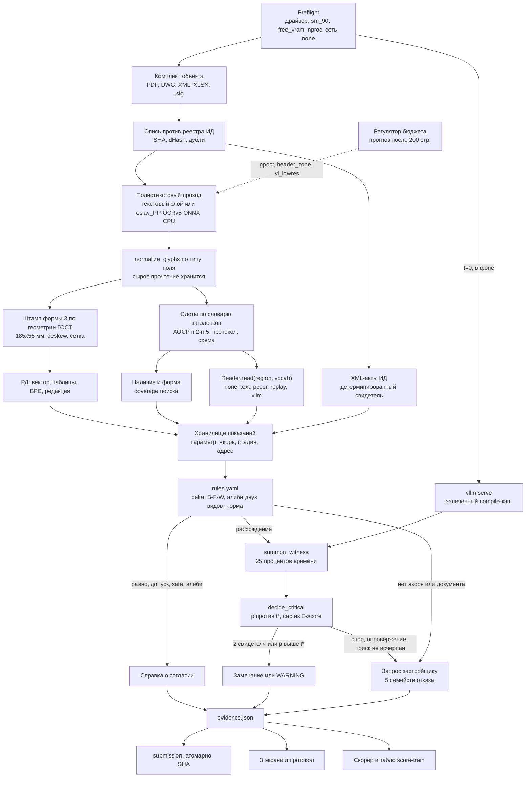

> Итог интроспекции 7 экспертов уровня excellence (Document AI; CAD и чертежи; инспектор стройнадзора; оценка и доверие;
> LLM и агенты; ML-платформа; стратегия победы) × 10 раундов, синтезатор после каждого раунда — 80 агентов.
> Вход: 8 исследовательских итераций, инвентарь кода и данных, описи 140 ГБ (`docs/dataset`).
> Базовый флаговый конвейер — `ML-CONCEPT.md`; этот документ — целевая схема поверх него. Ход и голосование — в приложении А.

# Инспектор ИИ: схема победного решения (раунд 10, итоговая)

## 1. Метафора и принцип

**«Очная ставка».** По каждой клетке Матрицы «параметр × якорь» документы ПД, РД и ИД ставятся лицом к лицу. Каждое показание имеет адрес: sha, страница, bbox, текст, канал. Отсутствие документа тоже считается показанием с адресом, только его адрес — перечень просмотренных страниц. Ставка заканчивается одной из трёх бумаг:
- **«Замечание»**: VIOLATION с карточкой. Слово «нарушение» появляется только после того, как инспектор его признал.
- **«Справка о согласии»**: NO_VIOLATION и две страницы.
- **«Запрос застройщику»**: COMPARISON_IMPOSSIBLE или MISSING_DOCUMENT.

**Принцип: мак строит, GPU добавляет свидетелей, табло решает порядок.** Конвейер целиком работает на CPU. От GPU зависят только счёт свидетелей и label. Каждая строка плана получает измеренную Δ баллов на открытом TRAIN-объекте.

**Неприкосновенное.** Этот пункт единогласно отметили все 7 экспертов в финальном голосовании.
1. bbox никогда не берётся от VLM. Region = (sha, page, bbox_pdf_user), пересчёт идёт одной функцией `page_to_pdf_coords` с golden-тестом.
2. `evidence.json` — единственный контракт. Контрактный тест проверяет, что при reader = none, replay и vllm схема и множество строк submission одинаковы.
3. Связь идёт через п.2 АОСР и штамп формы 3, а цепочка выглядит так: лист КЖ → п.2 → протокол 18105 → исполнительная схема.

Всё остальное в схеме можно менять флагом.

## 2. Архитектура

## 3. Компоненты по слоям

Все флаги собраны в реестре `config/pipeline.yaml`. Строка флага содержит: имя, значение по умолчанию, метрику, порог, окно решения, машину. Неизвестный флаг или неизвестная модель останавливают старт.

| Флаг | По умолчанию | Кто меняет |
|---|---|---|
| `ocr_rec` | eslav_PP-OCRv5_mobile_rec, **без дефолта в коде**; запасной вариант — cyrillic_PP-OCRv5_mobile_rec | CER на F1 |
| `vl_backend` | none \| replay \| vllm | preflight |
| `second_family` | none → qwen3.8-27b-fp8 | preflight + CA в W1 |
| `fulltext` | ppocr_cpu → header_zone → vl_lowres | **регулятор во время прогона** |
| `vl_cpu_llamacpp` | on в SINGLE_CHANNEL, ≤ 600 кропов | замер 10 кропов, F1 |
| `crit_policy` | decide_critical, cap ∈ [3; 5] | предрегистрация F2 |
| `witness_concurrency` | 16 для некритичных, 1 для критичных | SHA в W2 |
| `dwg_text_donor` | решение на F1 | VECTOR_NOTEXT > 10 % |
| `signature_check` | slot_text | не меняется |

### 3.1. Показание с адресом (локализация 15, OCR 2)
- Интерфейс один: **`Reader.read(region, vocab) → (value, raw, conf, channel)`**. Реализации: none, text_layer (pypdfium2 под `PDFIUM_LOCK`), ppocr_onnx_cpu, llamacpp_vl, replay, vllm.
- **Рендер** (Document AI). OCR всегда читает рендер страницы pypdfium2 с известным DPI, пиксели исходного image XObject линт запрещает (CAD). Кроп ячеек штампа и слотов АОСР масштабируется до x-height 28–32 px (300–400 dpi на кроп), по длинной стороне не больше 2 000 px. Для header_zone страница рендерится в 150 dpi.
- **`normalize_glyphs(value, field_type)`** (Document AI). Нормализация одна, внутри Reader, и стоит до rules.yaml и до ключа дедупа. Для арматуры она даёт кириллические А/С, для бетона — В, для шифров — канон. Сырое прочтение сохраняется в evidence. Без неё «А500С» и «A500C» превращаются в два якоря и дают FP. Её проверяет нулевой тест на ≥ 200 гомоглифов.
- **Golden `page_to_pdf_coords`:** /Rotate 0/90/180/270, CropBox, UserUnit, а также три случая image XObject (CAD): скан меньше листа со смещением, поворот через CTM при /Rotate 0, два изображения на странице. Критерий — IoU ≥ 0,95 с pdf.js.
- **Кассеты.** Ключ кэша: (sha страницы, хеш кропа, хеш промпта, digest). Кассеты пишутся только по синтетике (ADR-0002). На маке их проигрывает ReplayReader.
- **Печать и рукопись.** Если два семейства прочли одинаково, пишется значение. Если по-разному — отказ ПРОЧТЕНИЕ.

### 3.2. Приём, опись, слоты (целостность 10)
- Распаковка идёт потоком (bsdtar/7zz, cp437 → cp866). Строится карта `sha → [(file, page, parent_doc)]`.
- Опись сверяется с реестром ИД. Заявленный, но не найденный документ получает MISSING_DOCUMENT.
- **Полнотекстовый проход:** детектор PP-OCRv5_mobile_det, распознаватель eslav_PP-OCRv5_mobile_rec. Оба закреплены по digest, работают на ONNX CPU в пуле процессов. Базовый PP-OCRv5 rec обучен на китайском, английском и японском, поэтому на кириллице он молча выдаёт мусор. Это главная слепая зона, которую нашёл Document AI в финале.
- **Регулятор бюджета** (Platform). После первых 200 страниц регулятор сравнивает «стр/с × оставшиеся страницы» с 60 % таймаута. Если не укладывается, сам переходит на `header_zone` (OCR верхних ~20 % страницы и штампа, полный OCR только для слотов). Если vLLM уже поднят, следующая ступень — `vl_lowres` (PaddleOCR-VL-1.5, 1 024 px, только страницы без текстового слоя). Решение и прогноз пишутся в evidence и в подвал Матрицы. Регулятор нужен потому, что nproc стенда неизвестен: при 8–16 ядрах проход сканов занял бы 40–80 мин.
- ONNX CUDA EP вычеркнут: вторая CUDA-пара не окупает риск.
- Метрики: recall слотов ≥ 0,98 на SYNTH-REAL, 0 урезанных критичных слотов, VL-страниц ≤ 2 500. Замеры идут через `heavy.sh`: 10 страниц → 100.

### 3.3. Сторона РД и ПД
- **Штамп по геометрии ГОСТ** (CAD, финальная правка). На скане нет FPDFPath, вся страница — один image XObject, поэтому прежний поиск штампа по линиям пропускал большинство листов. Новый способ:
  1. Формат в мм берётся из MediaBox и UserUnit.
  2. Основная надпись формы 3 имеет размер 185×55 мм и стоит в правом нижнем углу внутренней рамки. Зона штампа вырезается арифметикой.
  3. Ячейки (шифр, лист, Изм., стадия П/Р, наименование) снимаются шаблонной сеткой.
  4. Для растра делается deskew ±3° по проекции горизонталей, сетка уточняется по линиям в пределах ±2 мм.
  5. На векторе FPDFPath остаётся уточнением.

  Смещения ячеек перед кодированием сверяются с текстом ГОСТ Р 21.101-2020. Golden — 40 листов, из них 20 сканов с наклоном ±2°, шумом и печатью поверх. Цель: EM ≥ 0,95 по шифру и Изм.
- Вектор, таблицы по сетке, склейка по хешу шапки, ВРС как контрольная сумма (подкод AMBIGUOUS_ROW).
- **Редакция.** Приоритет: лист-замена, затем больший «Изм.», затем лист без пометки. При конфликте — семейство отказа РЕДАКЦИЯ.
- **DWG** решается на F1 по VECTOR_NOTEXT: если меньше 10 %, DWG остаётся только в описи. Свидетелем и локатором DWG не бывает никогда.

### 3.4. Сторона ИД (F1, потолок 59)

| Часть | Что | Машина | Ч |
|---|---|---|---|
| **6a** | Наличие и форма по кодам Матрицы: АОСР на скрытые КЖ, исполнительная схема, протоколы (18105, гидро ВК, изоляция ЭОМ, аэродинамика ОВ), подпись СК слотом; **coverage поиска** | мак | 7 |
| **6b** | п.2 (шифр, лист, Изм.) против штампа; п.5 против даты Изм. и порядка актов | мак | 4 |
| **6c** | XML-акты как детерминированный свидетель | мак | 2 |
| **6d** | 18105: серии, R_m, Kт, класс, **якорь протокола = якорь п.2** | мак + replay | 3,5 |
| **6e** | п.3 против спецификации и ВРС | GPU | 4, режется |

- **Отсутствие как показание** (Agentic). Замечание «не представлен» выпускается только после исчерпанного поиска:
  - страницы без класса дочитываются полным OCR, на H100 дополнительно vl_lowres (до 300 стр.);
  - `find_source` проходит опись, реестр, XML и соседние этажные папки;
  - в evidence пишутся coverage (просмотрено N страниц, доля без класса) и сами запросы.

  Если страниц без класса больше 1 % или есть кандидат с похожим заголовком, результат — ИСТОЧНИК, а не VIOLATION. Без этого recall слотов 0,98 давал бы 6–12 ложных «не представлен» на объект, и их причину не поймать дублями: у дубля та же общая причина.
- **Якорь протокола 18105** (Domain). Если захватка, этаж или дата протокола не совпадают с п.2 акта, это ЯКОРЬ/РЕДАКЦИЯ, а не VIOLATION. На экзамене это типичная ошибка раскладки по этажным папкам.
- **Подпись СК** проверяется только по тексту слота. Пустой слот → ПРОЧТЕНИЕ. VIOLATION по подписи не выдаётся никогда.
- `.sig` → SIGNATURE_UNVERIFIED («хеш совпал»).

### 3.5. Показания и якорь
Показание = (param, anchor_interval, stage, edition, value, raw, region, channel). Якорь берётся из п.2, этажной папки, титула и наименования листа из штампа. Цель: ЯКОРЬ ≤ 5 % на SYNTH-REAL.

### 3.6. `rules.yaml` (FPR, статус 15)
Колонки: `parameter_code | допуск (СП 70.13330) | safe_direction | needs_approval | эквиваленты | алиби | норма | critical | шаблон замечания`.
- **classify_delta:** EQUAL, TOL, SAFE, NEEDS_APPROVAL, UNSAFE. А400 → А500С без Изм. даёт WARNING, А400 → А240 — UNSAFE.
- **Бетон — кортеж (B, F, W)** (Domain). Для каждой составляющей своя строка: B вверх — SAFE, F или W вниз — UNSAFE. Пример: протокол B30 W4 при проекте B25 W6 — это UNSAFE по W. В gen1 добавлена мутация W6→W4 при неизменном B.
- **Алиби двух видов** (Domain, финальная правка). Опасное место схемы — не поиск находок, а их снятие.
  - `unconditional` снимает находку сразу.
  - `by_approval` (маркеры «по согласованию», «с разрешения проектной организации») снимает находку, только если `find_source` нашёл второй документ: журнал АН, письмо ГП или лист с Изм. Если второго документа нет, выдаётся NEEDS_APPROVAL → WARNING «замена без согласования», в карточку идут обе цитаты-Region.
  - На формулировки заведено 10 нулевых тестов.

  Остальные алиби: дата Изм. (только снимает находку) и журнал АН. Каждое подтверждается дословной цитатой-Region.
- Шаблон замечания в стиле Мосстройнадзора: «не представлен …», «не соответствует листу … шифр … Изм. …» со ссылкой на пункт СП или 344/пр.
- Строка без нормы не проходит CI. Нулевые тесты генерируются из таблицы. Колонку critical заполняет **только флаг Матрицы**.

### 3.7. summon_witness и decide_critical (P(A), FPR)
- Инструменты:
  - `read(page, bbox, vocab)`: второе семейство на родном кропе, structured outputs, ожидаемое значение модели не показывается, thinking off, temperature 0;
  - `find_source(param, anchor)`.
- На witness отводится ≤ 25 % таймаута объекта, очередь идёт по критичности. Потолок вызовов равен P95 полигона, остаток получает БЮДЖЕТ. Critical идёт с batch = 1: 300 вызовов 27B-FP8 примерно по 1–1,5 с занимают 5–8 мин и укладываются в лимит (Platform). Если SHA разошёлся, некритичные уходят в БЮДЖЕТ.
- **Свидетели.** Детерминированные: заявленный документ отсутствует, XML, текстовый слой, вектор, опись + coverage. Модельные: VL и второе семейство. PaddleOCR-VL и PP-OCRv5 считаются одним семейством.
- **Второе семейство — Qwen3.8-27B-FP8** (Apache 2.0, VL, есть рецепт vLLM). Qwen3-VL-32B подключается, только если CA < 0,9 в W1. Модель, проигравшая сравнение, удаляется из образа.
- **decide_critical** (Trust, финальная правка). Спор 1 закрыт окончательно. p калибруется изотонически по каналу и числу свидетелей на полигоне gen1/gen2 и на TRAIN-табло. Порог t* = C_FP / (C_FP + C_miss), где C_miss — потеря от потолка 59, а C_FP — ΔF1 при ожидаемом N позитивов. Правила:
  - p ≥ t* и опровержения нет → WARNING «Свидетели: 1, требует подтверждения»;
  - p < t*, опровержение или DUAL_CHANNEL-несогласие → ПРОЧТЕНИЕ/ИСТОЧНИК.

  **Кто прав.** Trust прав по асимметрии: 106 из 132 параметров критичны, а пропуск стоит до 41 балла против 2–3 баллов за FP. Domain и Strategist правы, что неограниченная выдача топит доверие. Решение: cap = argmax E[score] на полигоне и TRAIN, **с ограничением 3 ≤ cap ≤ 5**. Верхняя граница 5 взята из практики Domain: 1–4 критичных замечания на объект. Предохранитель остаётся. Возражение Agentic «калибровать только вниз» отклонено: ослабление здесь выводится из формулы организатора и REAL-табло, а не из синтетики.
- До F0 нужно проверить по **публичным** `submission_schema.json` и описанию метрики, считается ли COMPARISON_IMPOSSIBLE по позитивной критической точке пропуском. От ответа зависит t*.
- Промпты и словари замораживаются на F2, их хеш входит в ключ кэша. GEPA, ACE и авто-тюнинг вычеркнуты.

### 3.8. Таблица решений

| Ситуация | label | status |
|---|---|---|
| Согласие, TOL/SAFE/эквивалент/алиби | NO_VIOLATION + 2 стр. | OK |
| UNSAFE, ≥ 2 независимых свидетеля, алиби нет | VIOLATION_PRESENT | по critical |
| NEEDS_APPROVAL без Изм. или `by_approval` без второго документа | VIOLATION_PRESENT | WARNING |
| Критичный, 1 свидетель, p ≥ t*, нет опровержения, в пределах cap | VIOLATION_PRESENT | WARNING «Свидетели: 1» |
| Критичный, второе семейство не согласилось | COMPARISON_IMPOSSIBLE | ПРОЧТЕНИЕ, «переснять» |
| Сверх cap или p < t* | COMPARISON_IMPOSSIBLE | ИСТОЧНИК |
| Обязателен по Матрице, не заявлен, поиск исчерпан, coverage ≥ 99 % | VIOLATION_PRESENT | по critical, свидетель «опись + coverage» |
| Обязателен, поиск не исчерпан | COMPARISON_IMPOSSIBLE | ИСТОЧНИК |
| Заявлен в реестре, не найден | MISSING_DOCUMENT | ID_MISSING |
| Отступление только в журнале АН | VIOLATION_PRESENT | WARNING «Изм. в РД не внесено» |
| Якорь протокола ≠ якорь акта | COMPARISON_IMPOSSIBLE | ЯКОРЬ |
| Некритичный, 1 свидетель или спор | COMPARISON_IMPOSSIBLE | ПРОЧТЕНИЕ |

### 3.9. Карточка и evidence
Дедуп: одна строка на (parameter_code, канонический якорь), первичная страница — с максимальным CA. В evidence лежат Region-ы, сырые и канонические прочтения, тип и счёт свидетелей, p и t*, coverage, строка правил, цитата нормы, SHA.

### 3.10. Инференс и поставка (техготовность 3)
- **Асинхронный старт** (Platform). В t = 0 CPU-проход и `vllm serve` стартуют параллельно. Кэш компиляции (VLLM_CACHE_ROOT, torch_compile_cache) снимается в W1 на том же digest и запекается в образ. Холодный старт 3–8 мин прячется за OCR.
- **VRAM.** Если free_vram ≥ 40 ГБ, резидентны обе модели. Долю VL мерим в W1 (0,10 / 0,15 / 0,20 → минимум, дающий ≥ 80 % пика). Если памяти меньше — CPU-путь и баннер SINGLE_CHANNEL.
- **Preflight не падает.** Неподходящий драйвер или sm ≠ 90 переключают конвейер на CPU. В приоритет 1 вопросов организатору внесены nproc и версия драйвера.
- **llama.cpp-VL** (официальный GGUF PaddleOCR-VL-1.5). Работает в SINGLE_CHANNEL на критичных слотах. Issue #23631 (падение на M4) проверяется замером на 10 кропах. Если воспроизводится, кассеты записываются на hk-nl-heavy (только синтетика, диск 93 %, веса удаляются сразу после записи).
- Один GPU-стек: vLLM и torch. Цифровые отпечатки закреплены, `HF_HUB_OFFLINE=1`, есть запасной `--enforce-eager`. Anytime-запись: tmp → fsync → rename каждые 30 с и по SIGTERM.
- Веса лежат в нижнем слое образа, код — в верхнем (< 200 МБ). Пробная загрузка 28.09, код-слой отправляется до 29.09 18:00.

## 4. Обобщение с TRAIN (ОВ) на экзамен
1. TRAIN учит формату. Семантику проверяют табло score-train, полигон отрицательных и пары «N ↔ N ИЗМ».
2. Ядро одно, адаптеров пять (КЖ, ЭОМ, АР, ВК, ОВ). Адаптер = строки `rules.yaml` + словарь слотов. Абляция ОВ должна совпасть бит-в-бит. CI-страж не пускает ОВ-литералы в domain.
3. На экзамене 56 % сканов, поэтому ядро держат eslav-OCR, слоты, штамп по геометрии и п.2, а не вектор.
4. Порядок атаки: КЖ по этажам с 18105, затем ЭО/ЭМ, АР, ПЗУ, ВК.
5. Около 40 параметров проверяются по наличию и шифру (6a, 6b), около 10 критичных — глубоко (6d, 6e, witness).
6. **REAL-семантика правил** (CAD, Domain, Agentic сошлись независимо). Из пар «лист N ↔ N ИЗМ» извлекается таблица регистрации изменений и сравнивается с диффом значений. Совпадение даёт реальный положительный пример для classify_delta и алиби «Изм.», расхождение — регресс-тест. Начать с 10 пар, на F2 взять 10–15.

## 5. Доверие

- **Табло score-train** (Strategist, финальная правка). `heavy.sh score-train` прогоняет конвейер на открытом TRAIN-объекте, затем скорер, и выдаёт одну строку JSON: F1, loc, статус, целостность, флаг «потолок 59». Первый прогон — на F0-скелете, дальше после каждой закрытой строки. Порядок оставшихся строк пересобирается по Δ за час раз в 6 ч. Этическая обвязка:
  - пути к открытым ответам перечислены в allowlist;
  - архив 02 и TEST_HIDDEN блокирует CI-страж по пути и по хешу;
  - ответы TRAIN используются как REAL-валидация и не попадают ни в rules.yaml, ни в промпты.
- **Два уровня данных.** REAL может ослаблять правило: табло, пары ИЗМ, дубли, таблица Domain (20 случаев), 8 отрицательных. MADE может только ужесточать.
- **Дубли — честно** (Trust). В полигон берутся только пары с близким dHash и **разным sha страницы**. ДИ считается кластерным бутстрепом по документу, в «Метрики» пишется эффективное n. Цифра «0,3 %» снята: её не выносить, пока не посчитано эффективное n.
- **Предохранитель.** ≥ 1 критичный WARNING на парах дублей → политика `crit_policy` переходит в ИСТОЧНИК. ≥ 2 ложных на нулевом объекте → флаг выключается. Карточка при этом остаётся в evidence и в Лупе.
- **Полигон** с полем origin: gen1, gen2, null, dup, regress, **slot_drop** (30 случаев удалённого слоя OCR со страницы АОСР, ожидается ИСТОЧНИК). Если recall gen1 и gen2 расходится больше чем на 10 п.п., это стоп-сигнал F2.
- **Нулевые тесты:** ПД↔ПД, РД↔РД, деградированный скан, два Изм. без изменения, ≥ 200 гомоглифов, повороты, image XObject, формулировки `by_approval`, акт до и после Изм.
- **5 семейств отказа:** ИСТОЧНИК, ПРОЧТЕНИЕ, ЯКОРЬ, РЕДАКЦИЯ, БЮДЖЕТ. В протоколе они сворачиваются в действия «Запросить», «На выезд», «Не успели».
- **Лист «Метрики»** (ДИ по Уилсону и кластерный):
  - FPR на REAL;
  - recall критичных для gen1 и gen2, n ≥ 150;
  - отказы по семействам;
  - WARNING отдельной колонкой;
  - **OCR: eslav · CER печать X % · рукопись Y %**.
- **Предрегистрация на F2:** лестница, `rules.yaml`, t*, cap, предохранитель, оси скорера.
- **Слепая приёмка перед F3:** из 10 карточек не больше 1 отклонённой из-за формулировки.

## 6. Вау-экраны для жюри
Фраза для показа: «Инспектор боится двух вещей — пропустить нарушение и ложно обвинить. Покажем обе». Все экраны — проекции `evidence.json`, данные — SYNTH-DEMO с фиксированным seed и пометкой «синтетика, ADR-0002».

- **A. Матрица (15 с).** «N стр → M документов · OCR eslav, CER X % · регулятор: header_zone на 38 %». В подвале — preflight и SHA вердиктов.
- **B. Карточка (2:00).**
  - Цепочка из 4 узлов с одной дырой (70 с).
  - Лупа: родной кроп, сырое и каноническое прочтение, «Свидетели: 2», строка правил с цитатой СП.
  - **Карточка отсутствия:** «просмотрено 412 стр., 0 кандидатов, 3 запроса», список кликабельный.
  - Ловушка редакции (50 с): акт после Изм.2 → WARNING, акт до Изм.2 → справка о согласии, сдвиг этажа → ЯКОРЬ.
- **C. «Проверь нас сам» (60 с).** Четыре мутации из кэша, одна из них W6→W4 при B25. Плюс «удалить документ» → Запрос застройщику.
- **Отклонение и протокол (30 с).** Пересчёт ≤ 10 с, затем протокол PDF.

Итого 3:45 и 45 с запаса. Режим проектора 1280×720, клавиши A / R / F, CSP без внешних источников, e2e с сетью none. Если нужно урезать, первым уходит протокол PDF, вторыми мутации. Карточка с Лупой не режется.

## 7. План по баллу за час и точки фриза

26.09. Реально доступно 40–45 ч работы (Strategist). Всё ниже черты — бонус, а не план.

| # | Работа | Ч | Даёт |
|---|---|---|---|
| 1 | Контракт location, коды, гомоглифы, дедуп | 3 | множитель |
| 0 | Скорер (location, дубль), **decide_critical**, проверка публичной метрики | 3 | цена решения |
| 0б | **score-train + allowlist-страж** | 1 | табло |
| 2 | Region, Reader, evidence, writer, скелет | 3 | F0 |
| 2б | **eslav по digest, normalize_glyphs, правило рендера** | 1 | весь OCR |
| 4 | rules.yaml, **B-F-W, алиби двух видов**, норма в CI | 5 | FPR, статус |
| 3 | Опись, проход, **регулятор**, слоты, split | 4,5 | целостность |
| 6a | Наличие и форма + **coverage** | 7 | F1, потолок 59 |
| 6b | п.2 ↔ штамп, редакция, даты | 4 | связывание |
| 5 | **Штамп по геометрии ГОСТ**, 40 golden, вектор, ВРС | 6 | F1, loc |
| 9 | Карточка, evidence, протокол | 3 | loc 15 |
| 6d | 18105 + якорь протокола | 3,5 | критичный |
| 10б | Слои образа, пробная загрузка | 1,5 | не обнулить 120 |
| | **Черта «обязательно сдать» ≈ 45,5 ч, всё на маке** | | |
| 6c | XML-свидетель | 2 | второй свидетель |
| 8 | Полигон, дубли по разным sha, пары ИЗМ, предрегистрация | 5 | доверие |
| 7 | summon_witness, лимит | 3 | P(A) |
| 10 | VRAM, preflight, async vLLM, скрипты окон | 3 | техготовность |
| 11 | Три экрана, демо | 4 | доска |
| 6e | п.3 против спецификации | 4 | режется |
| 12 | Нулевой объект, двойной прогон, qa-report, Stryker | 3,5 | F4 |

Черта (45,5 ч) превышает 40–45 доступных часов. Если score-train на F1 покажет низкую Δ строки 5, из строки 5 первыми уходят вектор и ВРС, штамп остаётся. Сверка кодов Матрицы и словарь слотов идут параллельно скелету. После каждой строки делается прогон score-train.

**Окна H100** (по одному тяжёлому за раз):
- **W1, 28.09 08:00–12:00:** доля VRAM; CA Qwen3.8 на 150 полях; CA под печатью; пропускная VL и vl_lowres; **холодный старт с запечённым кэшем и без него**; **CPU-проход с taskset 8 и 16 ядер** для регулятора; запись кассет.
- **W2, 28.09 20:00–23:59:** два холодных прогона с `--network none` и сверкой SHA, нулевой объект, таймаут 50 %.
- **Без окон:** SINGLE_CHANNEL, второй свидетель из XML, вектора и coverage.

**Фризы:**
- **F0** (контракты — 26.09 23:59, скелет — 27.09 12:00): первый score-train, запасная выдача заморожена.
- **F1 (27.09 23:59):** golden (координаты, image XObject, 40 штампов), CER eslav против cyrillic, rules.yaml с тестами, абляция ОВ, решение по DWG, llama.cpp на 10 кропах.
- **F2 (28.09 12:00):** предрегистрация (t*, cap), полигон ≥ 150, gen1 и gen2 расходятся ≤ 10 п.п., промпты заморожены.
- **F3 (28.09 23:59):** SHA совпал, нулевой объект — 0 FP, слепая приёмка.
- **F4 (29.09 15:00):** qa-report с мутационным скором, лицензии, запасное видео. **Выкат — только после «да» владельца.**

**Вычеркнуто в раунде 10:** поиск штампа только по FPDFPath; безымянный «PP-OCRv5 mobile»; фиксированный cap = 3; цифра FPR 0,3 % на 963 группах; «бетон одним числом»; безусловное алиби «Общие указания»; fulltext, выставляемый только preflight.

## 8. Риски и защита

| Атака | Защита |
|---|---|
| Кириллица читается мусором | закреплённый eslav rec, CER на F1, неизвестная модель останавливает старт |
| Штамп не находится на сканах | геометрия ГОСТ 185×55, deskew, 20 сканов в golden |
| Съехавшая рамка на image XObject | только рендер страницы, линт, golden CTM |
| Ложное «не представлен» | coverage, find_source по соседним папкам, slot_drop |
| Алиби снимает настоящее нарушение | `by_approval` требует второй документ |
| B25 W6 → B30 W4 признан SAFE | кортеж B-F-W |
| Протокол от чужой захватки | якорь протокола = якорь п.2 → ЯКОРЬ |
| Четвёртый критичный кандидат ведёт к потолку 59 | decide_critical, cap из E[score], ограничение 3–5 |
| Каскад WARNING | предохранитель на дублях с разным sha |
| Мало ядер на стенде | регулятор во время прогона, taskset-замер |
| Холодный старт vLLM | async-старт, запечённый кэш |
| Порядок работ по интуиции | score-train раз в 6 ч |
| Утечка эталона | allowlist, страж архива 02 и TEST_HIDDEN, ADR-0002 |
| GPU не появился или всё ломает | CPU-путь, контрактный тест, кассеты |
| Образ не загрузился | слои, пробная загрузка 28.09 |

## 9. Карта «строка оценки → компонент → баллы»

**Ни одна цифра не идёт в питч до первого score-train.** Итог записывается как формула:

E[score] = P(нет пропуска критичного) × S_без_потолка + (1 − P) × min(59, S)

P берётся из нижней границы Уилсона для recall критичных на полигоне. Диапазоны ниже — гипотезы до замера. Все эксперты сошлись на том, что прежние 75–94 на CPU завышены.

| Строка | Вес | Компоненты | H100 | CPU |
|---|---|---|---|---|
| F1 | 60 | 6a–6e, rules.yaml, decide_critical | 42–54 | 28–38 |
| Локализация | 15 | Region, штамп ГОСТ, дедуп | 12–14 | 10–12 |
| Значения и статус | 15 | таблица решений, 5 семейств | 12–14 | 10–12 |
| Целостность | 10 | опись, атомарная запись | 8–9 | 7–9 |
| **Итого** | 100 | | **74–91** | **55–71** |

| Доска | Вес | Экран | H100 | CPU |
|---|---|---|---|---|
| Функциональность | 4 | A, C | 4 | 3 |
| OCR | 2 | A (CER на экране), B | 2 | 1–2 |
| Связывание | 1 | B | 1 | 1 |
| Несоответствия | 3 | B, C | 3 | 2 |
| Локализация и FPR | 2 | C, Метрики | 2 | 2 |
| Доказательность | 3 | B, карточка отсутствия | 3 | 3 |
| Техготовность | 3 | A | 3 | 2 |
| Удобство | 2 | B, C | 2 | 2 |
| **Итого** | 20 | | **20** | **16–17** |

**Итог.** На H100 около 94–111 из 120, на CPU около 71–88, с нижней границей до замера. Главный сдвиг финала: порядок работ определяет измеренный балл на открытом TRAIN, а выдачу критичных — формула организатора, а не экспертное число. Три неприкосновенных узла (Region без bbox от VLM, контракт evidence.json, цепочка через п.2 и штамп) не менялись с раунда 5.

Источники: huggingface.co/PaddlePaddle/eslav_PP-OCRv5_mobile_rec, huggingface.co/PaddlePaddle/cyrillic_PP-OCRv5_mobile_rec, PaddleOCR PP-OCRv5_multi_languages; huggingface.co/Qwen/Qwen3.8-27B, recipes.vllm.ai/Qwen/Qwen3.8-27B; huggingface.co/PaddlePaddle/PaddleOCR-VL-1.5-GGUF; github.com/ggml-org/llama.cpp/issues/23631; ГОСТ Р 21.101-2020 (форма 3, 185×55 мм, смещения ячеек сверить по тексту).

---

## Приложение А. Ход интроспекции

| Раунд | Тема | Средняя | Document AI | CAD и чертежи | Инспектор стройнадзора | Оценка и доверие | LLM и агенты | ML-платформа | Стратегия победы |
|---|---|---|---|---|---|---|---|---|---|
| 1 | чистый лист | 0.0 | 0 | 0 | 0 | 0 | 0 | 0 | 0 |
| 2 | перекрёстная критика | 6.9 | 7.5 | 7 | 7 | 6 | 7.5 | 7 | 6 |
| 3 | реальность экзамена | 7.2 | 7 | 7 | 7 | 7.5 | 7 | 7.5 | 7.5 |
| 4 | баллы | 7.2 | 7.5 | 7 | 7 | 7 | 7 | 7.5 | 7.5 |
| 5 | FPR | 7.4 | 7.5 | 7.5 | 7.5 | 7 | 7.5 | 7.5 | 7.5 |
| 6 | вау и демо | 7.7 | 7.5 | 7.5 | 8 | 8 | 8 | 7.5 | 7.5 |
| 7 | red team | 7.6 | 7.5 | 8 | 8 | 7.5 | 7.5 | 7.5 | 7.5 |
| 8 | изящество | 7.1 | 7.5 | 7.5 | 6 | 7 | 7 | 8 | 7 |
| 9 | план | 7.9 | 8 | 8 | 7.5 | 8 | 8 | 8 | 7.5 |
| 10 | голосование | 8.2 | 8 | 8.5 | 8 | 8 | 8 | 8.5 | 8.5 |

### Финальное голосование (раунд 10)

| Эксперт | Оценка | Последняя правка, сильнее всего поднимающая шанс победы | Не трогать |
|---|---|---|---|
| Document AI | 8 | ПОСЛЕДНЯЯ ПРАВКА, дающая больше всего шансов (1 ч, мак, до F1). Закрепить распознаватель eslav_PP-OCRv5_mobile_rec (детектор PP-OCRv5_mobile_det) в ONNX по digest и прописать его в pipeline.yaml как `ocr_rec: eslav_PP-OCRv5_mobile_rec` без значения по умолчанию: неизвестная модель останавливает старт. Запасной вариант — cyrillic_PP-OCRv5_mobile_rec. Выбор между ними делается по CER на 150–200 полях SYNTH-REAL в F1, печать и рукопись считаются отдельно. От этого одного числа зависят полнотекстовый проход, слоты, штамп и п.2, то есть вся черта «обязательно сдать» на маке. | НЕ ТРОГАТЬ: bbox никогда не берётся от VLM. Region = (sha, page, bbox_pdf_user) плюс golden page_to_pdf_coords (/Rotate 0/90/180/270, CropBox, UserUnit, IoU ≥ 0,95 с pdf.js). На этом держатся 15 баллов локализации и доказательность доски; любая «оптимизация» с bbox из модели обнулит Лупу. |
| CAD и чертежи | 8.5 | ПОСЛЕДНЯЯ ПРАВКА (главная): штамп на скане искать по геометрии ГОСТ, а не детектором. Основная надпись формы 3 по ГОСТ Р 21.101-2020 имеет фиксированный размер 185×55 мм и стоит в правом нижнем углу от внутренней рамки (отступ 5 мм, слева 20 мм). Размер листа в мм берётся из MediaBox/UserUnit, дальше зона режется арифметикой, а ячейки (шифр, лист, Изм., стадия, наименование) — шаблонной сеткой со смещениями в мм. На растре нужны только deskew (±3°, по проекции горизонталей рамки через OpenCV morphology) и уточнение сетки по ближайшим линиям ±2 мм. CPU, 2 ч сверх строки 5. Golden 20 листов расширить до 40, из них 20 сканов с наклоном ±2°, шумом и печатью поверх; цель EM ≥ 0,95 по шифру и Изм. Альбомный лист и А1 с двумя штампами покрываются той же формулой (штамп на каждом формате ≥ А3 в правом нижнем углу). | НЕ ТРОГАТЬ: bbox никогда не берётся от VLM. Region = (sha, page, bbox_pdf_user) из текстового слоя, вектора или OCR на рендере плюс одна функция page_to_pdf_coords с golden-тестом. На этом держатся локализация 15, доказательность 3, Лупа и контрактный тест reader-независимости. Любое «упрощение» здесь обнуляет весь вау-экран B. |
| Инспектор стройнадзора | 8 | ПОСЛЕДНЯЯ ПРАВКА, дающая больше всего (1 ч, строка 4). Алиби «Общие указания» разделить на два вида: `unconditional` (снимает находку сразу) и `by_approval` (маркеры «по согласованию», «с разрешения», «с согласия проектной организации/автора проекта»). `by_approval` снимает находку, только если find_source нашёл второй документ: запись журнала АН, письмо ГП или лист с Изм. Если второго документа нет, это NEEDS_APPROVAL → WARNING «замена без согласования», и обе цитаты-Region идут в карточку. Предрегистрировать на F2 и добавить 10 нулевых тестов на формулировки. Это закрывает самый вероятный путь к пропуску критичного по бетону и арматуре, то есть к потолку 59. | НЕ ТРОГАТЬ: связь через п.2 АОСР (шифр, лист, Изм. против штампа формы 3) и цепочку лист КЖ → п.2 АОСР → протокол 18105 → исполнительная схема. Инспектор проверяет ИД именно так, ради этой цепочки жюри-практики и поверят системе. Её нельзя заменять геометрией, эмбеддингами или «умным поиском». |
| Оценка и доверие | 8 | ОДНА ПОСЛЕДНЯЯ ПРАВКА: скорер выбирает рабочую точку по ожидаемому баллу организатора. Вместо экспертных cap = 3 и правила двух свидетелей для критичных нужен модуль `decide_critical(p, costs)` в строке 0 скорера (+1 ч). p калибруется на полигоне gen1/gen2 (изотонически по каналу и числу свидетелей). C_miss — потеря от потолка 59 по формуле, C_FP — ΔF1 при ожидаемом N позитивов (из validation_report: ~11 из 19). Правило: VIOLATION_PRESENT/WARNING «Свидетели: 1», если p ≥ t*. COMPARISON_IMPOSSIBLE по критичному — только при p < t* или при опровержении. Cap выводится как argmax E[score] на полигоне и попадает в предрегистрацию F2 вместо числа 3. Метка остаётся честной: WARNING, «требует подтверждения», карточка с Region, так что доска «FPR с корректным abstention» не страдает. | НЕЛЬЗЯ ТРОГАТЬ: evidence.json как единственный контракт и контрактный тест «схема и строки submission не зависят от reader». Благодаря ему скорер, replay-кассеты, демо и CPU/GPU-треки измеряются одним инструментом, и любая Δ за час сравнима. |
| LLM и агенты | 8 | ПОСЛЕДНЯЯ ПРАВКА — «отсутствие тоже показание с адресом». Находку «не представлен» выпускать только после исчерпания поиска. (1) Страницы, которым header_zone не присвоил класс, дочитываются полным PP-OCRv5. На H100 — дополнительно vl_lowres, до 300 страниц на объект. (2) find_source проходит опись, реестр, XML и соседние этажные папки. (3) В evidence пишется coverage: число просмотренных страниц со всеми каналами, доля страниц без класса, запросы поиска. Если нераспознанных страниц больше 1 % или в соседней папке есть кандидат с похожим заголовком, результат — COMPARISON_IMPOSSIBLE/ИСТОЧНИК, а не VIOLATION. Цена — 3 ч на маке, строку вставить в 6a. Защищает F1, FPR-блок доски и потолок 59 от ложного «нет АОСР». | НЕЛЬЗЯ ТРОГАТЬ: bbox никогда не берётся от VLM. Модель только читает родной кроп Region, не видит ожидаемое значение и может только снять или понизить находку, но не создать её. Контрактный тест none / replay / vllm с неизменной схемой evidence и множеством строк submission держит на себе всю историю доверия и принцип «GPU добавляет свидетелей». |
| ML-платформа | 8.5 | ПОСЛЕДНЯЯ ПРАВКА (одна): регулятор бюджета во время прогона плюс асинхронный старт GPU. Первое: в t = 0 параллельно стартуют CPU-проход и `vllm serve` в фоне, а кэш компиляции (VLLM_CACHE_ROOT / torch_compile_cache, снятый в W1 на том же digest) запечён в образ. Так прогрев GPU прячется за OCR, и 3–8 мин возвращаются в бюджет. Второе: после первых 200 страниц регулятор считает прогноз «стр/с × оставшиеся страницы» против 60 % таймаута объекта и сам переключает fulltext по лестнице ppocr_cpu → header_zone → vl_lowres (если vLLM уже поднят). Решение и прогноз пишутся в evidence.json и в подвал Матрицы. Это одно правило в `pipeline.yaml`: флаг `fulltext` становится значением, которое выставляет регулятор, а не preflight. | НЕ ТРОГАТЬ: контрактный тест независимости от reader. evidence.json и множество строк submission одинаковы при none, replay и vllm, меняются только счёт свидетелей и label. Вместе с «preflight не падает» это единственное, что гарантирует ненулевой сабмит при любом драйвере и любом sm на стенде жюри. |
| Стратегия победы | 8.5 | ПОСЛЕДНЯЯ ПРАВКА: табло баллов вместо экспертного порядка строк. Нужна команда `heavy.sh score-train`: сквозной прогон конвейера на открытом TRAIN-объекте с ответами, затем скорер, затем одна строка JSON (F1, loc, статус, целостность, флаг «потолок 59 сработал»). Первый прогон делается на F0-скелете 27.09 12:00, дальше после каждой закрытой строки плана. На каждую строку записывается измеренная Δ баллов, а порядок оставшихся строк пересобирается по Δ за час раз в 6 ч. Это превращает принцип «каждый час получает измеренную Δ» из лозунга в механизм. | НЕ ТРОГАТЬ: контракт evidence.json плюс Region (bbox никогда не берётся от VLM) и карточку с Лупой. Контракт одновременно даёт локализацию 15, доказательность 3 и страховку от смены GPU/CPU. В демо он единственное, что не режется. |

### Открытые споры после раунда 10

Финальный раунд, споры закрыты: cap/порог — Trust прав по асимметрии цен, рамка 3–5 от Domain, возражение Agentic «только вниз» отклонено (ослабление выводится из формулы организатора и REAL-табло, а не из синтетики); вилка CPU — принята осторожная 55–71 из 100 до первого score-train. Остаются открытыми вопросы исполнения, решаемые замером, а не мнением: (1) засчитывает ли публичная метрика COMPARISON_IMPOSSIBLE по позитивной критической точке как пропуск — читать submission_schema.json до F0, от этого зависит t*; (2) eslav против cyrillic по CER на 150–200 полях SYNTH-REAL на F1; (3) точные смещения ячеек формы 3 сверить по тексту ГОСТ Р 21.101-2020 перед кодированием; (4) nproc и драйвер стенда — вопрос организатору; (5) черта 45,5 ч против 40–45 доступных — при низкой Δ строки 5 на score-train первыми режутся вектор и ВРС, штамп остаётся.

### Журнал изменений по раундам

**Раунд 1 (чистый лист)**
- Ядро сменено с ОВ-roomdiff на общую модель факта (якорь × param_code × стадия) с единым движком сравнения — CAD-инженер, инспектор, поддержано всеми
- Введена лестница источников XML/DOCX/XLSX > DWG > вектор PDF > OCR > VLM с классом происхождения каждого значения — Doc AI, CAD, Agentic, Platform, Strategist
- DWG-канал (LibreDWG 0.14 dwg2dxf отдельным процессом + ezdxf) с регистрацией на лист PDF по RANSAC и порогом невязки 2 мм — Doc AI и CAD; роль DWG как источника значения/второго канала, а не доказательства — Platform
- Иерархический якорь с осевой сеткой и нормализатор location под формат эталона — CAD, инспектор, Strategist
- Фильтр действующей редакции до сверки и таблица решений статуса ПД/РД/ИД (ID_MISSING, COMPARISON_IMPOSSIBLE) — инспектор
- Шаблон АОСР по слотам п.1/п.3/п.4, XML-акты как связывание ИД↔РД — Doc AI, инспектор, CAD
- Целостность без моделей: реестры заявлено-есть, .sig, матрица АОСР × этаж — все эксперты
- Пять уровней данных с DERIVED и NATURAL, калибровка по слоям экзамена, пять вариантов скорера, гейт по ожидаемому баллу — Trust
- Асимметричное вето с бюджетом k на критичных параметрах; правило ML-CONCEPT §5 «сомнение → VIOLATION» отменено — синтез Trust + Agentic
- Матрица-компилятор: YAML-спецификации 132 параметров, 15–20 приоритетных руками — Agentic (урезано по времени)
- Резидентные модели без sleep mode, три пресета с автовыбором, автозамер 60 с, anytime-планировщик, кэш по sha — Platform
- GLM-OCR исключён как арбитр; PaddleOCR-VL-1.5 основной OCR; dots.mocr только после проверки соглашения на веса — Doc AI против Platform
- CPU-путь как фундамент, GPU как надбавка; план по баллу за час с точками фриза F1–F4 — Strategist
- Три экрана защиты: Паспорт комплекта, Сквозной луч/триптих, Нулевой и мутационный тест — Strategist, CAD, инспектор
- Визуальный RAG и «Спросить объект» понижены до бонуса за фризом — Agentic (самокритика)

**Раунд 2 (перекрёстная критика)**
- Добавлена задача №0: скорер под submission_schema и public_train_checks, smoke на Тюменской, ежедневный гейт вливания (Trust, Strategist)
- Статусы переписаны на enum схемы violation_label/protocol_status, «требует проверки» оставлен только в интерфейсе; в таблицу решений добавлены RD_MISSING/PD_MISSING/WARNING (Domain, Trust)
- Бюджет k отменён: асимметричное вето с нулевым бюджетом + два канала для публикации критичных + «критичный минимум» явных NO_VIOLATION против потолка 59 (Trust, Strategist; асимметрия Agentic/Domain сохранена)
- ИД-нога признана OCR-зависимой: основной путь для сканов — H100, CPU — страховка; цели §9 снижены, добавлена колонка «замер» со значением «не измерено» (Document AI, Platform, CAD, Strategist)
- Второй OCR-канал — PP-OCRv5 server (CTC, bbox слов); dots.mocr и GLM-OCR исключены, Tesseract — третий запас (Document AI, Platform, Agentic)
- Верификатор переведён на слепое извлечение значения, уверенность — logprob + изотоническая калибровка, самосогласованность убрана (Agentic)
- Регистрация скана на растр DXF удалена совсем; DWG→PDF — сначала текстовый слой, затем VIEWPORT, RANSAC только как проверка; объективная локализация — лист→страница (CAD, Trust, Document AI)
- Гигиена DWG: %%c, коды MTEXT, ANSI_1251, XREF/прокси, DIMENSION «измерено/надпись», редакция по атрибутам штампа, DXF во временный файл, оценка 5–15 мин (CAD)
- Решётка детализации и поля expected_stage/pd_detail в спецификации; строка «ПД≠, РД=ИД» зависит от наличия изменений ПД (CAD, Domain, Strategist)
- Новый класс проверок формы и хронологии ИД по 344/пр, tolerances.yaml со ссылками на СП 70.13330, ведомость Общих данных как источник редакций, ТЭП ПЗУ/ГП возвращены в приоритет (Domain)
- Бюджет инференса в тайлах, триаж по типу страницы, dHash-дедуп, DPI по типу, явная раскладка VRAM, отдельный CPU-контейнер для Paddle, проверка драйвера, пресет «сосед» переопределён, Qwen3.5-9B убран (Platform, Document AI)
- vLLM выбирается автозамером, при равенстве 0.29.x, Fast Start выключен; PaddleOCR-VL закреплён на 1.5 (issue #18088) (Agentic)
- Гейт = верхняя граница FPR по Клопперу–Пирсону ≤ 0,10 на класс; правило Lipton снято; добавлен уровень SILVER и регресс KR-057 Новослободской (Trust)
- Визуальный RAG вырезан, «Спросить объект» только поверх хранилища фактов и после F3; компиляция 132 спецификаций — дорожная карта, черновики проверяются на ml/synth (CAD, Agentic, Strategist)
- Экраны: язык инспектора, кнопка «В проект предписания», бейдж УКЭП, Паспорт вживую только на данных жюри, запасное видео на синтетике, сценарий защиты на 5 минут (Domain, Strategist)
- FREE_SEARCH возвращён через адаптер roomdiff и расхождения реестра, через тот же гейт (Strategist)
- Петля ошибок в стиле ACE-лайт: ложная находка превращается в регресс-тест и пункт плейбука, два цикла на F2/F3 (Agentic)

**Раунд 3 (реальность экзамена)**
- Схема сверена с открытой описью экзамена Речников 7/7: у экзамена нет XML, .sig и XLSX, у всей РД есть текстовый слой, ИД — 31 скан (96 %) в папках по этажу и конструктиву (все эксперты, факт — CAD, Domain, Document AI)
- Добавлен профиль комплекта: ступени лестницы включаются только при наличии входа; XML, .sig и XLSX оставлены общими адаптерами для других объектов (Document AI)
- DWG перестал быть ступенью и стал вторым каналом РД: вектор + DWG закрывают сторону РД без GPU (CAD)
- Имена в архивах декодируются cp437→cp866, имя DWG служит ключом листа, VIEWPORT остался только для рамки; bsdtar и 7zz, unrar исключён (CAD, Document AI, Platform)
- Правило перекрытия редакций сделано чистой функцией: лист-замена > больший Изм./вер > без пометки; при расхождении — отказ; замены используются как NATURAL-отрицательные (CAD, Domain)
- Якорь ИД берётся из имени папки, опись и титул — главный индекс ИД, OCR только подтверждает (CAD, Domain, Document AI)
- Location для не-ROOM: основной вариант из п.1 АОСР и пути, второй — по каталогу (Domain, Strategist)
- Нормализатор шифра и гомоглифов, страж ≥ 200 пар (Document AI, Trust)
- Исправлена хронология бетона: сравнение с Rт по ГОСТ 18105, промежуточные сроки не дают находок (Domain)
- Добавлены проверка «АООК против АОСР», ЭМ-адаптер (кабели, номиналы, изоляция, петля «фаза–нуль») и класс рукописных слотов (Domain, Platform)
- Целостность пересобрана из PDF: опись, матрица «конструктив × этаж × папка», нумерация папок, реестр в PDF; цель снижена до 6–8 (CAD, Document AI)
- Полный двухканальный OCR всех A4 ИД после dHash, классификатор только маршрутизирует; PP-OCRv5 перенесён на GPU через ORT CUDA EP; сканы берутся встроенным изображением через FPDFImageObj; третья реплика PaddleOCR-VL (Platform)
- Пресет «сосед» пересчитан: INT4 ~21 ГБ, итого 36–40 ГБ; ядра INT4 для гибрида проверяются автозамером (Agentic, Platform)
- Скорер: 6 вариантов (добавлены «отказ по критичному = пропуск» и «штраф за лишние»), метрика взвешена под состав экзамена (Trust, Strategist)
- Добавлена задача 0.5 — матрица атакуемости; ширина ~40 параметров при глубине на ~10 (Strategist)
- Порядок атаки: КЖ → ЭО/ЭМ → АР → ПЗУ/ГП (пара) → ВК (пара); ТЭП ПЗУ убран из приоритета как подгонка под память об эталоне (Document AI, Strategist, Domain)
- Новые уровни данных: DERIVED-GOLD из DWG, SYNTH-REAL из XML/DOCX, INJECTED на уровне рендера DXF (Trust, Agentic, CAD)
- Гейт по стратам «дисциплина × источник»; отрицательные ОВ не переносятся; проверка «без одной дисциплины» для петли ошибок (Trust, Agentic)
- Ядро тестируется на КЖ/ЭОМ, TRAIN-ОВ стал отложенным тестом, абляция adapter.ov бит-в-бит, CI-страж ОВ-литералов в domain (Strategist, Trust, Agentic)
- Приёмка спецификаций на реальном объекте без меток, reason SPEC_UNGROUNDED (Agentic)
- Бейдж УКЭП перенесён во вторичный экран, главный триптих — КЖ, добавлен слайд «одно ядро, пять адаптеров» (Strategist)
- Цели CPU снижены до ≈ 56–73, потолок 59 на CPU признан вероятным (Domain)

**Раунд 4 (баллы)**
- Добавлен компонент разбиения ИД `ingest.split` (§3.2): граница по ≥ 2 из 4 признаков, склейка частей и актов на стыке PDF, выход documents.jsonl, метрика F1 границ на SYNTH-REAL. Предложили все семь экспертов: Document AI, CAD, Domain, Trust, Strategist (склейка частей), Agentic, Platform.
- Добавлен лист «Метрики» (§3.0, задача 8): 8 метрик с 95 % ДИ, n и источником в формате lct_scoring_board; пустая ячейка — красный гейт F4. Предложили Document AI, CAD, Domain, Trust, Agentic, Strategist.
- Рамка — смысловая единица (bbox_unit: ячейка, строка, поле штампа, абзац пункта АОСР, полигон помещения) плюс bbox_tight для подсветки; гранулярность выбирается замером IoU по формату annotations.jsonl и DERIVED-GOLD (CAD, Document AI, Domain).
- Правило первичной страницы (ИД — лист акта, паспорт вторичен; РД — действующий лист, не ОД) и седьмой вариант скорера (Document AI, CAD). Проверка «страница содержит значение» перед выдачей (Agentic).
- Карта вхождений при дедупликации: sha → все (file_id, page, parent_doc), цитируется вхождение внутри проверяемого акта; юнит-тест и нулевой тест «один документ в трёх актах» (Platform).
- Канон вывода значения по формату TRAIN и golden-тест формата в CI (pdf_page_number 1-базовый из PDF) (Document AI, Domain, Trust, Platform).
- Скорер: 8 вариантов, в том числе «в скрытой части 1–2 положительных» (Trust); формула ожидаемого балла E с P(матч loc) и потолком (CAD, Agentic); расстояние до ступени доски (Trust).
- Location поднят на первое место после скорера: неверный формат обнуляет ~90 баллов, а не 60 (CAD).
- В таблицу решений добавлено правило: один канал за согласие и второй не противоречит → NO_VIOLATION со страницей; вето остаётся только для VIOLATION_PRESENT (Agentic).
- Новый GPU-компонент «Критический добор»: агент ищет второй канал по критичным параметрам в отказе, ≤ 8 вызовов, публикует только гейт (Agentic). «Спросить объект» снят с плана (Agentic: не закрывает ни одной строки).
- Переключатель потолка на F2 (Strategist), принят с ограничением Trust: один канал только если граница Клоппера–Пирсона страты остаётся ≤ 0,10. Минимальная публикация 1–3 двухканальных кандидата при нуле VIOLATION (Trust).
- Замер CA/EM на 150–200 полях SYNTH-REAL с разделением печати и рукописи (Trust, Agentic, Strategist); OCR-GOLD-mini урезан до 40 страниц и сделан опциональным (Document AI).
- Экстрактор штампа выделен как замеряемый компонент EM с эталоном ATTRIB DWG ↔ вектор (CAD); геометрия DWG (DIMENSION.measurement или расстояние полилиний ↔ надпись) принята как второй канал для толщин и защитного слоя (CAD), переопределённый текст размера вторым каналом не считается.
- Инференс: одна реплика PaddleOCR-VL вместо трёх, две фазы через vLLM sleep mode, neighbor на FP8 с fp8-KV (~34 ГБ), INT4 снят, основной образ cu12.9 (Platform). Скан ≤ 2 000 px и VL по элементам раскладки, бюджет 35–55 мин (Document AI).
- Действия инспектора «признать / отклонить с причиной / на выезд» с журналом и превращением отклонения в регресс-тест (Strategist, Domain); прогон с чистой ВМ до F3 (Strategist).
- Задача 4 (РД) до задачи 5 (ИД) и не урезается; §9 учитывает сценарий «чертежи», в котором CPU снимает потолок (Domain).
- §9 переписан: две ветки A и B, строки доски выведены формулой листа «Метрики», пороги доски переведены в штуки TP/FP. Итог H100 ≈ 84–94 (было 83–101), CPU ≈ 60–73 (Trust, Agentic, Strategist, CAD, Domain).
- Сжато ради лимита слов: грамматики марок, ЭМ-адаптер, язык карточки, петля ACE и разрыв переноса остались в силе из раунда 3, но в тексте не повторены.

**Раунд 5 (FPR)**
- Добавлен компонент «Алиби и адвокат согласия» (§3.7): шесть детерминированных проверок (редакция/Изм., допуск СП 70, эквивалент, общие указания, типовой этаж, согласование) плюс агент-опровергатель — синтез CAD (decide.alibi), Trust (таксономия вето), Agentic (опровергатель), Domain (замок нормы)
- Единый гейт Клоппера–Пирсона заменён правилом цены p_low·ΔE_TP > (1−p_low)·ΔE_FP с бюджетом ожидаемых FP Σ(1−p) ≤ 0,3 (Trust, Platform, Strategist); CP стал условием доверия к калибровке страты (0 FP при n ≥ 29 или ≤ 1 FP при n ≥ 46, односторонняя граница)
- Переключатель потолка и минимальная публикация 1–3 заменены «одной критической ставкой» вне бюджета (Agentic, Strategist)
- classify_delta (EQUAL/WITHIN_TOL/SAFE_SIDE/UNSAFE_SIDE) и compare: eq|ge|le|tol в YAML-спецификациях, допуски с цитатой пункта нормы (Domain, Strategist)
- equiv.yaml ограничен переименованиями; регресс А400→А240 (KR-057) обязателен (CAD, Domain; Document AI частично)
- Исправлена таблица решений: отступление, оформленное Изм., → NO_VIOLATION; только журнал АН → WARNING; изменения ПД найдены → NO_VIOLATION (Domain, Trust, Strategist); три ступени MISSING_DOCUMENT и WORK_FRONT_UNKNOWN (Domain)
- Замок якоря: этаж+элемент и ≥ 3 из 4 полей без противоречий (Domain + Agentic)
- Определение channel_independent в domain; пара PaddleOCR-VL/PP-OCRv5 голосует только за согласие, вето — кросс-семейное прочтение Qwen на кропе (Document AI, Agentic); DWG↔PDF подтверждает прочтение, а не истину (CAD)
- Фильтр видимости DWG и карта изменений редакции по REVCLOUD/таблице Изм. (CAD)
- Сравнение с матрицей путаниц OCR, ключевые кропы в родном разрешении, удаление печатей по HSV, AMBIGUOUS_ROW, двусторонняя проверка страницы (Document AI)
- Фабрика трудных отрицательных ≥ 150 на дисциплину: NATURAL, двойники INJECTED, near-miss, повторные сканы паспортов, ручной набор ловушек инспектора; 8 реальных отрицательных — отложенная проверка (все эксперты)
- Уверенность не из logprobs; ключ калибровки привязан к пресету; batch invariance в фазе 2 и двойной прогон на F3; сверка FP8/BF16; jury-cpu не публикует VIOLATION по ИД (Platform)
- Порядок урезки выведен из матрицы атакуемости, BUDGET_TRUNCATED без NO_VIOLATION (Platform + Document AI), открытый вопрос 7 закрыт
- Закрытый список reason_code и лимит отказов ≤ 1/8 (потолок 20 % на нулевом объекте) (Agentic, Strategist, Platform)
- check.id_form смягчён: хронология по п.5, подписи только без .sig/XML, результат в целостность, а не в VIOLATION (Domain)
- Скорер расширен до 10 вариантов (9 — согласованное отступление как нарушение, 10 — SAFE_SIDE как нарушение); лист «Метрики»: FPR реальные/фабрика, по типам ловушек, P(0 FP на 8), кривая риск↔покрытие
- Новый вау-экран «Почему мы НЕ выдали нарушение» (Strategist)
- Отклонены: конформный Mondrian α=0,02 (дублирует правило цены, раздувает отказы), трёхчтение одной моделью в другом масштабе (коррелированные ошибки; оставлен только обратный рендер NCC), GEPA и OCR-GOLD-mini (время)

**Раунд 6 (вау и демо)**
- Фраза демо заменена: «Инспектор боится двух вещей: пропустить и ложно обвинить» и «ценность — в обоснованной тишине» (Domain, Trust); «главный тест у вас отрицательный» оставлена внутренней логикой §5, потому что на сцене звучит как подгонка
- Порядок демо: сначала попадание, потом тишина (Domain)
- Новый главный вау-экран «Проверь нас сам»: жюри выбирает мутацию или двойника из генератора фабрики отрицательных (CAD, Trust и Agentic, независимо)
- Экраны «Два листа рядом» (Domain), «Рентген поля» (Document AI), «Лупа» (Platform), «Адвокат проиграл» (Strategist) и «Свидетели» вместо p (Trust) слиты в одну «Карточку-доказательство»; добавлены открытие оригинала в pdf.js по клику и кнопка «сверить SHA» (Document AI)
- «Ловушка редакции»: наложение Изм.1/Изм.2 с XOR и REVCLOUD (CAD, Domain, Strategist) заменила экран-список «Почему НЕ выдали»; снятия остались журналом в карточке
- Новый экран «Цепочка элемента» ПД→РД→АОСР→паспорт→протокол→АООК из хранилища фактов (CAD, Domain)
- «Живая Матрица» на стенде жюри из anytime-submission (Strategist, Platform); паспорт комплекта свёрнут в полосу шапки, отдельный экран снят (все эксперты)
- «Отклонение учит»: дифф YAML каталога FP и пересчёт domain ≤ 10 с (Domain, Trust, Agentic, Strategist); протокол PDF из четырёх разделов, в том числе «Запросить у застройщика» по reason_code (Trust) и «На выезд» (Domain, Strategist)
- Лист «Метрики» убран из показа в раздаточный xlsx; бейджи уровня данных и формулировки практика, кривая риска вынесена в приложение (все эксперты)
- Новый reason_code SINGLE_CHANNEL для jury-cpu, «выдернуть видеокарту» стал запасным ответом (Platform)
- Стенд: фаза 2 перед показом на sleep level 1 с прогревом демо-объектом (Platform)
- Детерминированный демо-объект SYNTH-DEMO: seed, 6 событий, e2e состава в гейте F3 (Strategist); требования к правдоподобию форм 344/пр, ГОСТ 21.101, ГОСТ 7473/34028 и к деградации, рендер общий с SYNTH-REAL (Domain, CAD, Document AI, Agentic)
- Строка плана 12а: инкрементальный пересчёт по якорю, ~2 ч (Agentic)
- DWG понижен до локатора и пары «геометрия ↔ надпись», строка 5 сокращена на 1,5 ч (самокритика CAD)
- Гейт F3 дополнен: демо ≤ 8 мин на GPU и ≤ 20 мин на CPU, сверка имён моделей и флага vLLM через WebSearch (Platform)
- «Спросить объект» не делается отдельным экраном: вместо свободного чата — поиск по хранилищу фактов с шаблонным ответом (Agentic, Strategist: «у нас нет чата»)
- Черновик сжат до лимита: компоненты §3 без потери решений

**Раунд 7 (red team)**
- Ставка «1+8» понижена с константы до одного сценария: пороги подбираются по минимаксу сожаления по k∈{0,1,3,6,10}, добавлены варианты скорера 11–14 (Trust, Strategist)
- Критичные параметры получили отдельную формулу ΔE_TP_crit со скачком потолка 59; лимит «одна ставка» заменён бюджетом ожидаемых FP ≤ 0,15; бюджет FP для некритичных масштабируется от N̂ (Trust, Strategist)
- Асимметричное вето: по критичному расхождение запускает добор третьего источника и голосование 2 из 3 вместо отказа; слепое прочтение идёт через structured outputs по закрытому словарю (Agentic)
- Qwen3.8-27B-FP8 подтверждён WebSearch и выбран вторым семейством, запасной вариант — Qwen3-VL-32B-Instruct; спор Document AI и Strategist с Agentic и Platform решён в пользу последних
- jury-gpu-full без sleep, обе модели резидентны; preflight с автовыбором пресета; кэши запечены в образ; стеки разделены (vLLM и ONNX); smoke-тест с --network none на H100 (Platform, Agentic)
- Воспроизводимость: SHA канонического среза вердиктов, побайтное совпадение только повтором из кэша, код NEAR_THRESHOLD (Platform, Trust, Agentic)
- Маршрутизатор страниц до VL (ориентация, пустые страницы, слоты, ≤ 2 500 VL-страниц), очередь по критичности, тайлинг А2+, снятие печати по кругу Хафа, XML-акты как независимый канал, property-тест page_to_pdf_coords (Document AI)
- VECTOR_NOTEXT и RD_SCAN, замок редакции DWG (DWG_EDITION_MISMATCH), алиби №7 «редакция на дату работ», сущностный дифф редакций, склейка таблиц и ВРС как контрольная сумма, изоляция dwg2dxf (CAD)
- substitution_policy (замена арматуры без Изм. → WARNING), адаптер протокола ГОСТ 18105, elevation_map и якорь-интервал, MISSING_DOCUMENT только для актов, заявленных в описи или реестре, SIGNATURE_UNVERIFIED, формулировка про журнал АН, ГОСТ Р 21.101-2020, ПЗУ поднято в очереди (Domain)
- Адвокат переделан в детерминированную программу, LLM только извлекает алиби с дословной цитатой; страж каталога FP с 30 канарейками INJECTED (Agentic)
- Уровень данных вошёл в ключ калибровки, FPR выводится двумя строками, второй независимый генератор мутаций, предрегистрация на F2, дедуп и атомарная запись anytime (Trust, Platform)
- Демо: вместо живого запуска Матрица — фоновый кадр с честным счётчиком урезки; «Проверь нас сам» по умолчанию из кэша, живой пересчёт только после префлайта, плюс две мутации без OCR; четыре экрана вместо пяти, режим «проектор», слепой тест 3+3 (Strategist, Domain, CAD)
- Строка 10б «репетиция поставки» (слои образа, пробная загрузка 28.09, код-слой до 18:00 29.09) и новые риски в §8 (Strategist)

**Раунд 8 (изящество)**
- Метафора сведена к «очной ставке» с тремя бумагами на выходе (CAD, Agentic, Strategist). «Показание с адресом» стало форматом показания (Document AI). Роли нотариуса и адвоката убраны (Platform, Strategist, CAD).
- Ядро ужато до пяти идей: read_region, якорь из самого документа, rules.yaml, правило двух свидетелей, evidence.json.
- VECTOR_NOTEXT, RD_SCAN, тайлы А2+ и перечитывание кропом слиты в лестницу источников внутри read_region (Document AI, CAD).
- Маршрутизатор из четырёх классификаторов заменён одним полнотекстовым проходом PP-OCRv5 со словарём заголовков, гейт recall слотов ≥ 0,98 (Document AI). PP-OCRv5 перенесён на ONNX CPU EP, CUDA EP включается только по замеру (Platform).
- Якорь берётся из п.2 АОСР, этажной папки и наименования листа, таблица отметок — запасной путь. Сетка осей из DWG вычеркнута (Domain, CAD).
- classify_delta, эквиваленты, substitution_policy, алиби и норма слиты в одну таблицу rules.yaml с одним движком (Domain, Agentic, Strategist). Алиби сокращены с семи до трёх документных (CAD). Замок нормы перенесён в CI.
- Вето, третий источник, критический добор и адвокат-LLM заменены одним циклом summon_witness с бюджетом 2 или 8 (Agentic). LLM-извлечение алиби вычеркнуто.
- Порог по p_low, B(N̂), ΔE_crit и NEAR_THRESHOLD заменены целочисленной лестницей свидетелей 0/1/2+. По критичному при одном свидетеле выпускается WARNING (Trust).
- Скорер сведён к трём булевым осям × k ∈ {0,1,5} плюс линия 0/0 (Trust, Strategist). Уровней данных теперь два, REAL и MADE. Метрик три. Фабрика, канарейки, нулевые тесты и регрессы собраны в один полигон heavy.sh (Trust).
- Reason_code свёрнуты в 5 семейств в submission и UI, подкоды оставлены в evidence. Протокол разложен по действиям инспектора (Trust, Strategist, Domain).
- Замок DWG и порог 90 % спецификации удалены. DWG остался донором текста под флагом, который включается по замеру на F2; свидетелем и локатором он не бывает (компромисс Document AI, CAD, Strategist, Domain).
- Маска печати по Хафу выключена по умолчанию: её заменили два прочтения рядом. Флаг включается, если CA под печатью < 0,9 (Document AI, Domain, Agentic).
- A/B PaddleOCR-VL-1.6 вычеркнут, версия 1.5 закреплена (Document AI, Platform, Strategist). Спор Qwen3.8-27B-FP8 против Qwen3-VL-32B закрывается одним замером, проигравшая модель удаляется из образа (Strategist).
- Три пресета заменены формулой по free_vram, sleep и neighbor удалены. Кэш экспертиз стал одним модулем, ключ калибровки сузился до (digest, dtype) (Platform).
- Экранов стало три (Strategist). Ловушка редакции — второй пример карточки. Карточка открывается на цепочке одного элемента (Domain). Живой OCR-пересчёт, сущностный дифф, живой каталог FP и слепой тест штампов вычеркнуты.
- Проверки наличия и формы ИД (АОСР, схемы, протоколы, порядок дат, подпись строительного контроля) стали первым классом (Domain). Строка ИД выросла с 10 до 16 ч, весь план — с ~69 до ~61 ч.

**Раунд 9 (план)**
- Принцип раунда: мак строит весь конвейер, GPU только добавляет свидетелей; контрактный тест на независимость схемы evidence и строк submission от reader (Agentic, Platform)
- Введён F0: контракты 26.09 23:59, ходячий скелет SYNTH-DEMO→submission к 27.09 12:00, выдача замораживается как запасная (Document AI, Agentic, Trust, Strategist)
- Строка 6 разбита на 6a наличие/форма, 6b п.2+редакция+даты, 6c XML, 6d 18105, 6e п.3 (режется); 6a/6b подняты в начало плана (CAD, Domain, Agentic, Platform, Strategist, Document AI)
- Два трека и окна H100 W1 (28.09 08–12, до F2) и W2 (28.09 20–24, до F3), одна команда heavy.sh h100-window-N; план без окон — SINGLE_CHANNEL (Platform, Trust, Strategist)
- Кассеты/replay-бэкенд кэша экспертиз для разработки без GPU; флаги vl_backend/second_family/fulltext выставляет preflight (Document AI, CAD, Agentic)
- Реестр флагов по шаблону имя|default|метрика|порог|окно|машина (Trust, Platform)
- Запасной путь медленного прохода: header_zone OCR, затем vl_lowres; ONNX CUDA EP вычеркнут (Agentic + Document AI)
- Доля VRAM для VL измеряется в W1, а не назначается (Document AI)
- llama.cpp PaddleOCR-VL-1.5 GGUF как CPU-канал VL (Platform), проверено WebSearch; добавлен риск issue #23631 (падение на Apple M4 CPU-only) и замер на 10 кропах
- Qwen3.8-27B-FP8 подтверждён как VL-модель Apache 2.0 — второе семейство по умолчанию, Qwen3-VL-32B только при CA<0,9 (Agentic, Platform; сомнение Document AI снято)
- Спор 1 закрыт тремя слоями: WARNING только при детерминированном свидетеле или в SINGLE_CHANNEL (Agentic, Platform), cap=3 на объект (Document AI, Domain, Strategist), предохранитель на 963 группах дублей с переходом в ИСТОЧНИК при сохранении Region (Trust, CAD)
- Нулевой REAL-полигон из дублей dHash (Trust) и доменная таблица истинности 20 открытых случаев (Domain)
- critical только из Матрицы; подпись СК — слот-текст, пустое → ПРОЧТЕНИЕ, никогда VIOLATION (единогласно, WARNING Strategist отклонён)
- Бюджет witness — общий лимит 25% таймаута и P95 с полигона; concurrency 16 для некритичных с гейтом SHA (Trust, Agentic, Platform)
- Штамп формы 3 — первая деталь строки 5 с golden на 20 листах (CAD); решение по DWG перенесено на F1 (CAD, Document AI)
- Скорер урезан до 2 ч, ось отказа — на F2 (Trust, Platform)
- Wilson ДИ, gen1 и gen2 раздельно, расхождение >10 п.п. — стоп F2 (Trust); фриз промптов на F2, GEPA/ACE вычеркнуты (Agentic)
- Язык «замечание» и шаблоны Мосстройнадзора, слепая приёмка 10 карточек перед F3 (Domain)
- Демо: цепочка из 4 узлов, сдвиг этажа — в ловушку редакции, экран C 60 с, запас 45 с (CAD, Domain, Strategist)
- Черта «обязательно сдать» ~37 ч на маке (Strategist); preflight переключает на CPU вместо падения, в вопросы организатору — драйвер и nproc (Platform)
- Сверка кодов Матрицы для проверок наличия до F0 (интроспекция Domain)

**Раунд 10 (голосование)**
- Document AI: распознаватель eslav_PP-OCRv5_mobile_rec закреплён по digest, флаг ocr_rec без дефолта, запасной cyrillic, выбор по CER на F1; normalize_glyphs внутри Reader до rules.yaml и дедупа; правило рендера кропов (x-height 28–32 px); строка CER на экране A и в Метриках
- CAD: штамп на сканах ищется по геометрии ГОСТ Р 21.101-2020 (185×55 мм, deskew, шаблонная сетка), golden расширен до 40 листов с 20 сканами; golden page_to_pdf_coords дополнен тремя случаями image XObject, пиксели исходного изображения запрещены линтом
- Domain: алиби «Общие указания» разделено на unconditional и by_approval (второй документ обязателен); бетон — кортеж B-F-W с мутацией W6→W4; в 6d проверка якоря протокола 18105 против п.2 → ЯКОРЬ
- Trust: decide_critical по порогу t* из формулы организатора вместо фиксированного cap = 3; cap = argmax E[score] с рамкой 3–5 (рамка от Domain); проверка публичной метрики до F0; дубли только с разным sha, кластерный бутстреп, цифра 0,3 % снята; раздел 9 переписан как формула E[score]
- Agentic: отсутствие как показание — coverage поиска, find_source по соседним папкам, новые строки таблицы решений (поиск исчерпан / не исчерпан), origin slot_drop в полигоне, карточка отсутствия на экране B
- Platform: регулятор бюджета во время прогона выставляет fulltext; асинхронный старт vLLM с запечённым compile-кэшем; в W1 замер холодного старта и taskset 8/16 ядер; nproc и драйвер — вопрос организатору приоритета 1
- Strategist: табло heavy.sh score-train на открытом TRAIN с allowlist и стражем архива 02/TEST_HIDDEN; пересборка порядка строк по Δ раз в 6 ч; честная вилка CPU 55–71 до замера; черта названа 45,5 ч при доступных 40–45, ниже черты — бонус
- Синтезатор: выделен блок «Неприкосновенное» (единогласно у 7 из 7): bbox не от VLM, контракт evidence.json с reader-независимостью, цепочка через п.2 и штамп; пары «N ↔ N ИЗМ» приняты как REAL-источник семантики правил (CAD, Domain, Agentic независимо)
