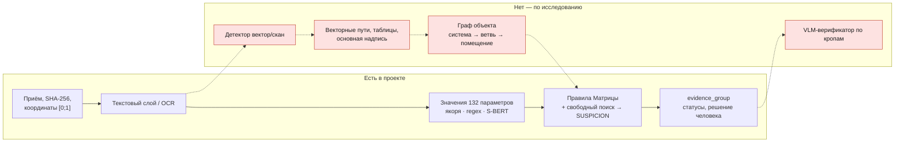

# Исследование мировых практик ↔ «Инспектор ИИ»

Источники (вне git, `ТЗ/research/`):
- **Отчёт** — «Инспектор ИИ: мировые подходы к сравнению ПД, РД и ИД и рекомендации для команды Надзориум», 15 стр.:
  обзор рынка, совет пяти экспертов, стек, конвейер шагов 0–12, MVP;
- **Резюме** — «Исполнительное резюме», 12 стр.: сравнение ревизий одного чертежа (overlay, векторный diff, графы,
  спецификации), дорожная карта на 18 месяцев.

Сверка — по коду на 27.09 (`ml/inspector_ml`, `apps/api/src`), не по документации.

## Вердикт

**Парадигма совпадает, представление данных — нет.** Ядро проекта устроено так, как требует консенсус совета:
детерминированные правила по 132 параметрам дают кандидатов с двусторонними доказательствами и bbox, система умеет
воздерживаться (MISSING_EVIDENCE, NOT_COMPARABLE, CLARIFICATION_REQUIRED), а CONFIRMED_VIOLATION ставит только инспектор.
LLM у нас — ассистент, который не может повысить статус. Этого исследование и требует ради Precision ≥ 0,9.

Расхождение в том, **над чем** работают правила. Исследование строит **граф объекта** (система → ветвь → помещение →
элемент) из **векторного** PDF и сравнивает графы. Проект извлекает **значения параметров Матрицы** по якорям
из текста и сравнивает значения. Для числовых и текстовых параметров (площади, этажность, марки, классы) наш путь
достаточен и уже измерен (стенд §14 на синтетике — P/R 0,99). Для «схема ПД ↔ план РД» (топология подключений,
состав ветвей в помещении) нужен граф, и его нет.

Оценка соответствия по шагам конвейера отчёта (14 строк): **✅ 6 · 🟡 6 · ❌ 2** (ниже).

## Соответствие по шагам конвейера (отчёт, раздел D)

| Шаг | Что предлагает исследование | Что есть у нас | Статус |
|---|---|---|---|
| 0 Приём | хеш, file_id, координаты [0;1] с учётом MediaBox, CropBox, Rotate | SHA-256, реестр, `parse.py` нормирует через `FPDF_PageToDevice` (CropBox и /Rotate), bbox в долях | ✅ |
| 1 Вектор / скан / гибрид | детектор по странице: текст, число путей, доля изображений, SHX-кривые | только порог текста (`MIN_TEXT_CHARS = 20`): есть слой — читаем, нет — OCR всей страницы; пути и изображения не считаются, гибрида нет | 🟡 |
| 2 Классификация листа | правила по шифру и ключевым словам, затем классификатор или VLM | `doctype.py` — вид документа внутри марки правилами; VLM нет | ✅ правила · ❌ VLM |
| 3 Штамп и метаданные | шаблон зон основной надписи ГОСТ Р 21.101, регулярки, граф версий «Изм./Взамен» | шифр и гомоглифы (`cipher.py`), выбор редакции по реестру (`predecessor_id`); штампы «В производство работ» (`requisites.py`); **зоны основной надписи не читаются**, «Изм./Взамен» с листа не разбираются | 🟡 |
| 4a Векторная ветка | текст с bbox, **пути** (цвет, толщина, OCG), выноски, таблицы по сетке | текст с bbox — да; **пути PDF не извлекаются**: измерение чертежа (`measure.py`) работает по растру (Хаф); таблиц нет (OS-INSP-2.2.5) | ❌ |
| 4b Растровая ветка | 200–300 dpi, тайлы, лейаут-детектор, PaddleOCR, LSD/Hough, таблицы Docling | Tesseract (ансамбль), перечитывание значения по кропу (`reread.py`), Хаф и морфология для линий; PaddleOCR — мёртвый код (T-063), лейаут-детектора нет | 🟡 |
| 5 Извлечение сущностей | регулярки маркировок систем (П, В, ВЕ…), помещения, оси, легенда, спецификация | значения 132 параметров по якорям, regex и семантике (`extract.py`, `semantic.py` — paraphrase-multilingual-MiniLM-L12-v2, как советует эксперт 2); помещения (`rooms`); **маркировки систем ОВ и спецификации — нет** | 🟡 |
| 6 Граф объекта | «установка → магистраль → ветвь → устройство → помещение» | **нет** | ❌ |
| 7 Сопоставление стадий | точные ключи → rapidfuzz → S-BERT → венгерский алгоритм; проверка покрытия | сопоставление по коду параметра Матрицы; rapidfuzz для якорей; проверка комплектности и MISSING_EVIDENCE (OS-INSP-1.4); венгерского алгоритма и «переименовано» нет | 🟡 |
| 8 Правила 132 + свободный поиск | параметр = предикат над графом; свободный поиск → SUSPICION | 132 правила над значениями (`compare.ts`); свободный поиск четырьмя способами + LLM-советник, всё → SUSPICION | ✅ (над значениями, не графом) |
| 9 Верификация VLM | кропы ПД/РД, JSON {found, not_found, unreadable}, VLM только понижает | LLM-советник с проверкой дословной цитаты на странице (OS-INSP-3.2.4–3.2.5); по кропам и зрением — нет | 🟡 |
| 10 evidence_group | фрагменты с bbox, правило, уверенность, объяснение | `evidence_fragments`, доказательные группы, PostgreSQL | ✅ |
| 11 Статусы | NEGATIVE_VERIFIED, CANDIDATE, SUSPICION, MISSING_EVIDENCE, NOT_COMPARABLE, CLARIFICATION_REQUIRED, NOT_APPLICABLE; CONFIRMED — только человек; active learning | те же статусы, решение только за инспектором, GOLD-набор и дообучение ранжирования (T-100) | ✅ |
| 12 ИД ↔ ПД/РД | XML-ИД напрямую; АОСР: реквизиты, подписи и печати | XML — приём; реквизиты, подписи, печати (`requisites.py`); скрытые работы из журнала (`hidden_works.py`) | ✅ |

**Резюме (второй документ)**: overlay ревизий одного листа — есть (`sheetdiff.py`: SIFT/ORB + гомография RANSAC + карта
изменений, OS-INSP-3.4); векторный diff сегментов с R-деревом — нет; GED по малым подграфам — нет; diff спецификаций
(BOM) — нет (упирается в таблицы).

## Реализуемость алгоритмов

Оценка — часы работы агента на маке (CPU, без GPU, ADR-0001), до фриза 28.09 20:00 и после.

| Алгоритм | Реализуемость у нас | Оценка | Когда | Главный риск |
|---|---|---|---|---|
| Детектор «вектор / скан / гибрид» по странице | высокая: pdfium отдаёт объекты страницы (текст, пути, изображения) | 2 ч | **до фриза** | SHX-текст кривыми — считать «гибридом» |
| Извлечение векторных путей (цвет, толщина, штрих) | высокая через **pdfium** (Apache/BSD); PyMuPDF из стека отчёта — **AGPL-3.0**, для поставки заказчику не берём | 3 ч | до фриза (прототип) | «взорванные» блоки, OCG часто нет |
| Таблицы по сетке линий (вектор) | высокая: **pdfplumber** 0.11.10 (MIT) или camelot 2.0.0 (MIT) | 3 ч | **до фриза** — это T-119 (OS-INSP-2.2.5) | объединённые ячейки |
| Основная надпись по ГОСТ Р 21.101 (формы 3 и 5) | высокая: зона 185×55 мм в правом нижнем углу, поля по сетке | 3 ч | **до фриза** — это балл «целостность» (10) | нестандартные штампы → запасной путь как сейчас |
| Масштаб из штампа + проверка размерной линией | уже есть (OS-INSP-2.4.6, T-098) | — | — | — |
| Маркировки систем ОВ, привязка к помещениям | средняя: регулярки из отчёта + векторный текст | 5 ч | после фриза | разнобой оформления |
| Граф объекта (NetworkX, BSD) и сравнение подграфов | средняя: нужен шаг выше; GED — только на малых подграфах | 2–3 дня | после фриза | Recall на реальных листах |
| Сопоставление: rapidfuzz + S-BERT + венгерский (SciPy, BSD) | высокая, всё уже в стеке, кроме SciPy | 3 ч | после фриза | пороги без разметки |
| Symbol spotting (SymPoint-V2, CADSpotting) | низкая: нет ОВ-разметки по ГОСТ 21.602, нет GPU | недели | промышленная версия | датасеты архитектурные |
| VLM-верификатор по кропам (Qwen2.5/3-VL 7B) | низкая сейчас: нет GPU; на M4 24 ГБ — медленно; отчёт сам показывает Precision локальной 8B ≈ 2 % без каркаса | 1–2 дня | после появления GPU | галлюцинации; только понижение статуса |
| DWG (ezdxf MIT + ODA) / IFC | не нужно для MVP (отчёт и Q&A 10: DWG не нужен) | — | промышленная версия | лицензия ODA |
| Синтетические мутации **реальных** векторных PDF | средняя: фабрика у нас генерирует документы с нуля (`ml/synth`), мутаций реальных листов нет; корпус под ADR-0002 — только на данных организатора | 1 день | после фриза | правовой режим данных |

## Что проект делает сверх исследования

- Юридическая рамка ИИ-средства (ПП Москвы 2078-ПП, запись о применении ИИ для акта), журнал аудита только на добавление.
- Метрики §14 с доверительными интервалами и вердиктом, мутационное тестирование кода, трасса ТЗ до теста (ГЕРА).
- PostgreSQL 18 с ролями, TLS 1.3, миграциями; наблюдаемость (Prometheus, ELK, алерты).

## Наработки T-127: что показали прототипы на реальных листах

Три модуля в `ml/inspector_ml` (в конвейер не встроены), тесты на синтетике, замер на PDF пакета участника
организатора (`_ОБРАЗЦЫ`, только чтение, в репо — только агрегаты).

| Модуль | Тесты · мутации | Реальные листы | Вывод |
|---|---|---|---|
| `pagekind.py` — вектор / скан / гибрид + векторные пути (pdfium) | 66 · 97,6 % | 119 стр.: vector 60 · **hybrid «текст кривыми» 51** · scan 8; 4 мс на страницу | **43 % листов — SHX-текст кривыми**: текстового слоя нет, `parse.py` считает их векторными и не отправляет в OCR. Главная дыра по F1 на реальных чертежах |
| `tables.py` — таблицы по линиям (pdfplumber, MIT) + связка строки (OS-INSP-2.2.5) | 125 · 98,5 % | 50 стр.: 23 таблицы, 349 строк, связано с Матрицей 0 | механика работает, но в образцах нет томов ПЗ/ПЗУ с ТЭП — польза не доказана до замера на эталоне |
| `titleblock.py` — основная надпись ГОСТ Р 21.101 (формы 3, 5, 6) | 184 · 97,7 % | 50 стр. с текстом: штамп найден 29, шифр и лист 29/29, стадия 12/12; отказы — обложки, чужие вставки, штампы кривыми | годится для связки документов и балла «целостность» (T-120); имя файла участника — не шифр |

Итог: исследование подтверждено на наших данных — векторная экстракция и детектор страницы дают больше, чем
казалось; самое дешёвое и полезное до фриза — маршрутизация страниц «текст кривыми» в OCR (2–3 ч).

## Рекомендация

1. **До фриза — три наработки, которые одновременно поднимают балл организатора:** детектор страницы и векторные пути
   на pdfium; таблицы на pdfplumber (закрывает OS-INSP-2.2.5, T-119); основная надпись по ГОСТ Р 21.101 (связка
   документов и целостность). Прототипы — T-127, без встраивания в конвейер до замера на эталоне (T-096).
2. **После фриза — граф объекта для ОВ** по онтологии эксперта 4 поверх векторных путей и маркировок: единственный
   путь к классу нарушений «схема ↔ план», который сейчас не покрыт.
3. **Не делаем:** symbol spotting с обучением, VLM как детектор, обязательный DWG.

