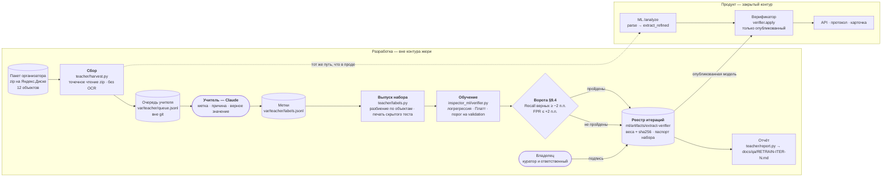
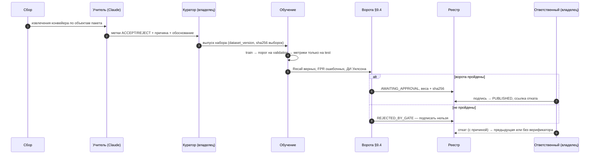

# Модуль дообучения

## Коротко — кто что делает

1. **Извлекает значения в продукте** конвейер: правила, якоря и таблицы по Матрице, а где нужно — локальные модели
   (читатели сканов, судья Qwen3.5-9B). Это не меняется.
2. **Учитель — Claude, только во время разработки.** Он смотрит, что конвейер извлёк на реальных объектах пакета
   организатора, и ставит оценку: верно или неверно, почему, какое значение правильное. В продукт и в закрытый
   контур жюри Claude не попадает — там только локальные модели (Q&A организатора №23).
3. **Верификатор — новая маленькая модель внутри продукта.** Он за миллисекунды перепроверяет каждое извлечённое
   значение и отбрасывает явно ложное: номер раздела вместо значения, класс соседнего здания, «га» вместо м²,
   склейку колонок. Инспектор видит меньше ложных расхождений. **Сейчас верификатор в конвейер ещё не встроен**:
   он заработает после встраивания в `/analyze` и подписи владельца.
4. **Дообучение улучшает отсев ошибок, а не поиск значения.** Верное значение конвейер находит сам, ученик убирает
   неверное и не теряет верного: ворота требуют сохранить ≥ 98 % верных.
5. **Почему не наоборот.** В контуре жюри нельзя Claude, а локальный судья 9B тратит ~5 с на кроп (замер T-129) —
   на тысячи значений объекта это часы. Поэтому большая модель учит офлайн, а в продукте проверяет быстрый ученик.
   **Судья (judge), читатель (reader) и второе мнение пока не дообучаются**; дообучение судьи на тех же метках —
   итерация ev-3, задача [T-156](../../tasks/01-todo/T-156-ev3-lora-судьи-qwen-на-метках-учителя.md), 28.09.

## Две модели дообучения в проекте

| Модель | Что делает | Где живёт | Данные | Статус |
|---|---|---|---|---|
| Ранжир кандидатов (T-100) | оценка вероятности нарушения у CANDIDATE | API, `apps/api/src/domain/retrain.ts`, реестр — таблица `model_versions`, UI «Модель» | решения инспекторов по кандидатам | механика готова; на реальных объектах 6 кандидатов — учиться не на чем |
| **Верификатор извлечения (T-076)** | принять или отбросить извлечённое значение | ML, `ml/inspector_ml/verifier.py`, реестр — `ml/artifacts/extract-verifier/` | метки учителя на объектах пакета | ev-1 не прошла ворота (мало данных), ev-2 — сегодня |
| Судья Qwen3.5-9B (ev-3, T-156) | чьё упоминание: объект / сосед / норма | ML, `inspector_ml/vlm_verify.py`, `ml/models.yaml` → judge | те же метки учителя (SFT) | 28.09 |

## Компоненты

Отказ ворот тоже пишется в реестр — статусом `REJECTED_BY_GATE`: такую итерацию нельзя подписать, но её метрики
видны. Без опубликованной модели `verifier.apply` возвращает извлечения без изменений.

## Поток одной итерации

## Где код, требование и тест

| Элемент | Код | Правило ГЕРЫ | Тест |
|---|---|---|---|
| Сбор очереди | `ml/teacher/harvest.py` (`service_specs`, `queue_items`, `select`), `ml/teacher/remote_zip.py` | OS-INSP-6.4.10 | `ml/tests/test_teacher.py` — строки очереди, отбор, спецификации как у сервиса |
| Метка учителя | `ml/teacher/labels.py::validate`, `verifier.REASONS` | OS-INSP-6.4.10 | метка без справочной причины или к чужой строке отклоняется |
| Выпуск набора | `labels.py::release`, `split_of`, `harvest.py::sealed_shas`, `iterate.py::passport` | OS-INSP-6.4.11 | объект целиком в одной выборке; файл скрытого теста — отказ; паспорт без текстов |
| Обучение | `verifier.py::train`, `choose_threshold`, `build_vocab` | OS-INSP-6.4.12 | метки test не меняют модель и порог; отказ без обоих классов |
| Артефакт и реестр | `verifier_registry.py::record_iteration`, `verifier.py::weights_hash` | OS-INSP-6.4.13 | повтор даёт тот же хеш весов; итерация хранит версии и хеши |
| Ворота, подпись, откат | `verifier.py::gate`, `verifier_registry.py::publish`, `rollback` | OS-INSP-6.4.14 | допуск 2 п.п.; обучавший не подписывает; откат к предыдущей |
| Путь в конвейер | `verifier.py::apply`, `verifier_registry.py::load_published` | OS-INSP-6.4.15 | без опубликованной модели извлечения не меняются; подменённый артефакт не грузится |
| Воспроизведение | `scripts/retrain-iter.sh` | OS-INSP-6.4.13 | тот же набор, хеши выборок и весов, что в реестре |
| Отчёт | `ml/teacher/report.py` | OS-INSP-6.4.13 | цифры только из реестра; подменённый артефакт — отказ |

Связи правило → код → тест — в `docs/gera/inspector/model.yaml` (раздел `impl`), проверка `pnpm trace:check`.

## Не сделано

- **Встраивание в `/analyze`** (`verifier.apply` после `extract_refined`, хеш модели в ключе кэша) — ждёт решения владельца.
- **Раздел «Модель» в UI** показывает только ранжир T-100; итерации верификатора видны в `ml/artifacts/extract-verifier/registry.json`
  и отчётах `docs/qa/RETRAIN-ITER-N.md`.
- **Метки учителя — не экспертное GOLD** (допущение OS-INSP-6.4.10): в набор они идут только выпуском куратора.
