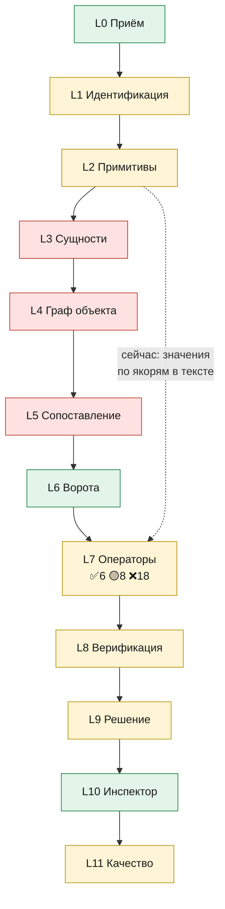

# TO BE ↔ AS IS

Источники (вне git, `ТЗ/research/`):
- **Каталог** — «Инспектор ИИ: целевой (TO BE) каталог операций распознавания и сравнения ПД / РД / ИД»: 12 слоёв
  L0–L11, ~150 операций, **32 оператора сравнения** CMP-01…32, 15 проверок L8, отображение M-001…M-132 на операторы,
  **трассировка 14 пилотных случаев** разметки организатора, волны W1–W3;
- **AEC** — «TO BE: ультимативный pipeline операций сравнения инженерных чертежей»: 53 слоя от форензики файла до
  решения, итоговый объект `ChangeEvent`, четыре движка (A геометрия, B граф и семантика, C документы и доказательства,
  D правила).

Сверка — по коду 27.09 (`apps/api/src`, `ml/inspector_ml`, `data/seed/matrix.json`), с прототипами T-127.

## Вердикт

Оба документа описывают **семантический движок изменений**: чертёж → примитивы → объекты → **граф** → сопоставление
→ дифф свойств и топологии → доказательства. Проект реализует **нижнюю и верхнюю части** этой вертикали, но не
середину:

- ✅ **Документы и решение** (движок C, L0–L1, L6, L9–L11 каталога): приём, реестр, редакции, комплектность, ворота
  применимости и сопоставимости, статусы, evidence_group с bbox, инспектор в контуре, GOLD, метрики с ДИ, регресс-гейт.
- ✅ **Скалярные правила Матрицы** (часть движка D): 132 параметра сравниваются как значения — это операторы
  CMP-01, 02, 03, 06 каталога.
- ❌ **Середина — объекты и граф** (движок B, L3 ENT-01…26 кроме нескольких, L4 NRM-13…15, L5 LNK-04…10, операторы
  CMP-19/20): её нет. Именно она нужна пилотам P1–P5, P12, т. е. **большинству реальных нарушений разметки**.
- 🟡 **Геометрия** (движок A): есть overlay ревизий одного листа (`sheetdiff.py`) и измерение по размерной линии
  (`measure.py`), нет регистрации по осям, геометрических операторов CMP-13…16, векторных примитивов в конвейере
  (есть прототип `pagekind.py`).

## Покрытие по слоям каталога

| Слой | Что в TO BE | У нас | Статус |
|---|---|---|---|
| L0 Приём | ING-01…13: хеш, антивирус, реестр, целостность PDF, манифест страниц, **природа страницы**, подпись, DOCX, XML, дедуп, кэш, дифф манифеста | всё, кроме: природа страницы — прототип `pagekind.py` (не в конвейере), перцептивный дедуп, CAD/BIM-канал | 🟡 почти ✅ |
| L1 Идентификация | IDN-01…15: основная надпись, таблица изменений штампа, облака ревизий, состав тома, страница ↔ лист, шифр, стадия, тип листа, этаж, граф редакций, актуальная редакция, комплектность, штампы ИД, пары листов | шифр и гомоглифы, стадия, вид документа (`doctype.py`), актуальная редакция по реестру, комплектность и сценарий, штампы ИД (`requisites.py`); основная надпись — прототип `titleblock.py`; **нет**: облака ревизий, тип листа (план/схема/спецификация), этаж, страница ↔ лист | 🟡 |
| L2 Примитивы | PRM-01…21: текстовый слой, битая кодировка, пути, кластеры, OCG, **SHX-текст кривыми → OCR**, размеры, выноски, цвет, штриховки, тайлинг, OCR, лейаут, таблицы, спецметки | текстовый слой, OCR (Tesseract, перечитывание значения), размеры (`measure.py`); прототипы: пути, SHX-детектор, таблицы; **нет**: выноски, лейаут-сегментация, штриховки, спецметки | 🟡 |
| L3 Сущности | ENT-01…26: помещения, экспликация, оси, размеры, отметки, масштаб, **марки систем**, оборудование, трассы, проёмы, стены, спецификации, ведомости, ТЭП, характеристики, пирог, **легенда**, **спецзоны (тёплый пол)**, генплан, ИД, реквизиты, график, смета, схемы | значения 132 параметров (ТЭП и характеристики — по якорям в тексте), помещения (номер + имя), масштаб, реквизиты, скрытые работы; **нет**: марки систем, оборудование, трассы, проёмы, стены, легенда, спецзоны, спецификации как сущности, пирог | ❌ в основном |
| L4 Нормализация | NRM-01…15: числа, единицы, гомоглифы, шкалы классов, сечения, канон наименований, номера помещений, иерархия систем, координаты здания, **граф объекта G_PD/G_RD/G_ID** | числа, гомоглифы, шкалы классов (9 перечислимых параметров, M-072 без шкалы), канон через семантику (MiniLM-L12); **нет**: графа объекта, координат здания, иерархии систем | 🟡/❌ |
| L5 Сопоставление | LNK-01…11: пары документов и листов, регистрация, **помещения** (RENUMBERED/SPLIT/MERGED), **системы** (RENAMED), элементы, строки таблиц, **схема ↔ план** | пары документов по стадиям и коду параметра; регистрация листов одной ревизии (SIFT + RANSAC); **нет**: сопоставления помещений, систем, строк, схема ↔ план | ❌ |
| L6 Ворота | GTE-01…05 | применимость ✅ (`NOT_APPLICABLE`), комплектность ✅ (MISSING_EVIDENCE), актуальность ✅ (SUPERSEDED вне сравнения), сопоставимость 🟡 (нет числа → NOT_COMPARABLE), качество 🟡 | ✅ |
| L7 Операторы | 32 оператора | см. ниже: ✅ 6 · 🟡 8 · ❌ 18 | 🟡 |
| L8 Верификация | VER-01…15 | двусторонность ✅, устаревшая редакция ✅, согласованное изменение ✅ (реестр изменений, OS-INSP-1.5), атомизация ✅ (разделение кандидата), дедуп ✅, калибровка 🟡 (T-100, Платт); **нет**: доказательства отсутствия с перечнем просмотренных листов, детализация против изменения, VLM, **каскады к корню**, **физическая правдоподобность** | 🟡 |
| L9 Решение | DEC-01…08 | evidence_group ✅, объяснение ✅, приоритет ✅, протокол ✅, инкрементальный пересчёт ✅, версии ✅; **нет**: **зонного bbox** (эксперты размечают зоны помещений — IoU ≥ 0,5 считается против них), полигонов | 🟡 |
| L10 Инспектор | HIL-01…08 | две панели, overlay ревизий, ≤ 3 клика, причины, разделение, выбор редакции, дозагрузка, журнал ✅; правка bbox инспектором ❌ | ✅ |
| L11 Качество | MUT-01…18, NEG-01…04, QA-01…08 | фабрика синтетики с нуля (132 × 5 исходов), отрицательные примеры, метрики с ДИ, регресс-гейт ✅; **нет**: мутаций **реальных** векторных PDF | 🟡 |

## Операторы сравнения (каталог, раздел 11)

Наши виды сравнения в `matrix.json`: `equal` 48, `decrease` 56, `increase` 9, `delta_pct` 10, `min` 9; порядковые шкалы —
у 9 перечислимых.

| Статус | Операторы |
|---|---|
| ✅ есть (6) | CMP-01 EQ-NUM (`equal`), CMP-02 DELTA-REL (`delta_pct`), CMP-03 DIR-WORSE (`decrease`/`increase`), CMP-06 NORM-THRESH (`min`/`max` + нормативный анализ), CMP-23 TEXT-SEM (семантический диссонанс помещений, семантические якоря), CMP-27 LOGIC-RULE (логические правила) |
| 🟡 частично (8) | CMP-04 ORD-RANK (шкалы, без M-072), CMP-05 SUBST (равенство строк, без таблицы аналогов), CMP-07 COUNT (как число, не подсчёт по чертежу), CMP-12 GEO-DIM (измерение на одном листе, без сравнения стадий — GAP-11), CMP-18 SLOPE-ELEV (отметки как числа), CMP-25 DOC-REQ (реквизиты, комплектность, скрытые работы), CMP-28 EXT-REG (статусы предписаний «РиН»), CMP-29 CHANGE-LEGIT (реестр согласованных изменений, без облаков ревизий) |
| ❌ нет (18) | CMP-08 SET-DIFF, 09 PRESENCE, 10 AGG-SUM, 11 MIX-SHARE, 13 GEO-AREA, 14 GEO-POS, 15 GEO-SHAPE, 16 GEO-REL, 17 GEO-ORIENT, **19 GRAPH-TOPO**, **20 SERVE-MAP**, 21 LAYER-SEQ, 22 TEMPORAL, **24 TOL-ASBUILT**, 26 CERT-MATCH, 30 INTERNAL-CONS, 31 CROSS-DISC, 32 BALANCE |

## Пилотные случаи разметки (каталог, раздел 18)

| # | Случай | Нужные операторы | У нас |
|---|---|---|---|
| P1 | Венткамера 012: схема ПД ↔ план РД | ENT-26, LNK-08, **CMP-19** | ❌ |
| P2 | Тёплый пол МГН 267/270/271/272 | ENT-18, ENT-20, **CMP-20**, VER-05 | ❌ |
| P3 | 140/142: нет местных отсосов В2.4–В2.9 | ENT-07, LNK-05, **CMP-20** | ❌ |
| P4 | 147/198: перекрёстная смена марок ветвей | LNK-05, **CMP-20**, CMP-08 | ❌ |
| P5 | 314: иная конфигурация В3 | CMP-20, CMP-31 | ❌ |
| P6 | ALT79B: назначения и площади помещений | CMP-23, CMP-10, VER-12 | 🟡 назначения есть, каскада площадей нет |
| P7 | UNDMS: исключён броневой лист | ENT-17, **CMP-21** | ❌ |
| P8 | IZM12: ремонт свай в ИД без РД | LNK-09, CMP-08, CMP-25 | 🟡 скрытые работы и реквизиты, без ADDED |
| P9 | LOS3A: перенос двери санузла | ENT-10, **CMP-14**, CMP-29 | ❌ (CMP-29 частично) |
| P10 | **OKT103: отклонения до +980 мм при допусках 12–20 мм — единственный положительный GOLD** | ENT-22, **CMP-24** | ❌ |
| P11 | POL16: площади при той же геометрии | CMP-15, CMP-02, CMP-10 | 🟡 площади как значения |
| P12 | DOO25: пищеблок, перенумерация | LNK-04, CMP-15, CMP-08 | ❌ |
| P13 | SOSH25: добавлено помещение 1.109 | CMP-08, CMP-10, VER-12 | 🟡 площадь этажа как значение |
| P14 | POL17: расхождений нет | вся цепочка | ✅ система воздерживается |

**Итог по пилотам: ✅ 1 · 🟡 4 · ❌ 9.** Честный вывод для балла организатора (F1 — 60 из 100): на реальных
нарушениях разметки наш текущий подход ловит в основном числовые и назначения помещений; «инженерные» нарушения
(ОВ, двери, слои, исполнительные допуски) — нет. На синтетике мы получаем P/R 0,99, потому что синтетика строилась под
наши 132 параметра, а не под эти пилоты.

## Что брать до фриза 28.09 20:00

Отбор — по отношению «пилотов закрыто / часы», только детерминированные операторы без обучения (волна W1 каталога).

| Приоритет | Работа | Пилоты | Оценка |
|---|---|---|---|
| 1 | **CMP-24 TOL-ASBUILT** — исполнительная схема: проектное и фактическое значение, допуск, превышение → CANDIDATE | **P10** (единственный положительный GOLD) | 4–5 ч: таблица/выноски исполнительной схемы + правило |
| 2 | **Маршрутизация «текст кривыми» → OCR** (прототип `pagekind.py`) | все реальные листы (43 % страниц) | 2–3 ч |
| 3 | **Зонный bbox** (DEC-02): объединение фрагментов по помещению с отступом | IoU для всех пилотов с помещениями | 2 ч |
| 4 | **CMP-10 AGG-SUM + VER-12 каскад** (итог = сумма строк; производные — к корню) | P6, P11, P13 | 3 ч (на таблицах `tables.py`) |
| 5 | **CMP-20 SERVE-MAP в минимуме**: марки систем (регулярки ENT-07) + номера помещений по близости → множество «помещение → марки» ПД vs РД, выход SUSPICION | P2*, P3, P4, P5 | 1 день — **после фриза**, до него рискованно |

Граф объекта целиком (NRM-13, LNK-05/08, CMP-19) — после фриза, по онтологии каталога. VLM-верификация (VER-09),
мутации реальных PDF (MUT-01…18) — после появления GPU и разметки.

Пунктир — то, как проект сейчас обходит середину: значения параметров извлекаются по якорям прямо из текста и
идут в скалярные операторы, минуя сущности, граф и сопоставление. Для 132 параметров Матрицы это работает; для
пилотов P1–P5, P7, P9, P10, P12 — нет.
