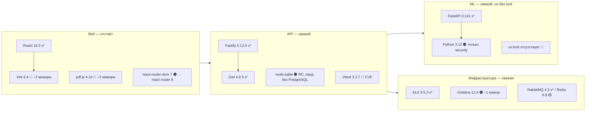

# Аудит стека — «Инспектор ИИ», 25.09.2026

Разбор без скидок. Каждую версию сверили с реестром в день аудита (npm, PyPI, Docker Hub),
сроки поддержки — с endoflife.date, уязвимости — через `pnpm audit` и `pip-audit`. По памяти
ни одна цифра не взята.

## Вердикт в одном абзаце

Эксплуатационная дисциплина выше рынка: образы по digest, многостадийная сборка, в рантайме нет
пакетного менеджера, read-only, `cap_drop: ALL`, гейт поднимает собранный образ. Прод-инфраструктура
почти целиком на последних минорах. **Проблемы — в трёх местах**: воспроизводимость ML-сборки
(нет lock-файла), фронтенд-тулчейн отстаёт на два мажора, а причина держаться за Vitest 3 устарела,
причём из-за неё в дереве висит открытая уязвимость. Отдельно: ADR-0001 обещает PostgreSQL в проде,
а стенд gpu собран без БД — прод-данные лежат в `node:sqlite` со статусом Release Candidate.

## Шкала

| Метка | Значит |
|---|---|
| ✅ | последний мажор и минор, либо отставание в патч |
| 🟡 | минор позади, поддерживается, делать при случае |
| 🟠 | мажор позади или ветка на сопровождении — план на квартал |
| 🔴 | уязвимость, потеря поддержки, невоспроизводимость или расхождение с ADR — в этот спринт |

## 1. Рантаймы и тулчейн

| Компонент | У нас | Актуально 25.09.2026 | Оценка | Комментарий |
|---|---|---|---|---|
| Node.js (прод, образ) | 24-alpine (24.21) | 24 LTS до 2028-04-30; **26 станет LTS 2026-10-28** | ✅ | Верный выбор на сегодня. Через месяц — плановый переезд на 26, тесты уже гоняются на 24 |
| Node.js (мак, dev) | **25.9.0** | 25 — **EOL с 2026-06-01** | 🔴 | Разработка идёт на снятой с поддержки нечётной ветке. Сборка и прод — на 24, значит локальные тесты проверяют не тот рантайм. `fnm`/`.nvmrc` → 24 (или 26 после 28.10) |
| `engines.node` | `>=22.5` | — | 🟠 | Разрешает 22 и 25, на которых стек не проверяется. Сузить до `>=24 <27` |
| pnpm | 10.28.1 | **12.7.0** | 🟠 | Два мажора позади. Pnpm 10 ещё работает, но lockfile-формат и настройки безопасности 11/12 (блок скриптов, `minimumReleaseAge`) — это защита от атак на цепочку поставок, ради них и обновляться |
| Python (ML) | 3.12 (3.12.14) | 3.14.7; 3.12 — **только security с 2025-04** | 🟠 | Живёт до 2028-10, но без багфиксов уже полтора года. `requires-python = ">=3.11"` разрешает 3.11, на которой ничего не проверяется. Цель — 3.13 (onnxruntime, opencv, numpy колёса есть) |
| uv | 0.12.19 | 0.12.19 | ✅ | — |
| TypeScript (api) | 5.9.3 | 7.0.2 (с 2026-07-08) | 🟡 | Оправдано: у TS 7.0 нет программного API до 7.1, Stryker и `tsx` его требуют. Держать 5.9 до 7.1 — правильно |
| TypeScript (web) | **7.0.2** | 7.0.2 | 🟠 | Сама версия свежая, **проблема в расколе**: в монорепо две мажорные версии компилятора, и хойстинг pnpm уже подсовывал 7-ю Stryker'у (см. костыль `tsconfigFile: "tsconfig.stryker-skip.json"` в `apps/api/stryker.config.mjs`). Одна версия на репозиторий через `pnpm.overrides` или каталог pnpm |
| esbuild (сборка API) | 0.25.12 (из дерева tsx/vite) | 0.28.2 | 🟡 | Dockerfile API берёт `esbuild` «первый найденный» через `find node_modules/.pnpm`. Версия бандлера прода определяется порядком обхода ФС. Объявить `esbuild` прямой devDependency API и звать по имени |

## 2. API (`apps/api`)

| Компонент | У нас | Актуально | Оценка | Комментарий |
|---|---|---|---|---|
| fastify | 5.12.5 | 5.12.5 | ✅ | — |
| @fastify/multipart | 10.1.2 | 10.1.2 (22.09) | ✅ | — |
| zod | 4.6.5 | 4.6.5 | ✅ | — |
| pkijs / asn1js | 3.4.1 / 3.0.10 | те же | ✅ | — |
| amqplib | 2.0.1 | 2.0.1 | ✅ | — |
| tsx | 4.23.15 | 4.23.15 | ✅ | В рантайм не едет — правильно |
| БД: `node:sqlite` | встроенный модуль | Stability 1.2 (Release Candidate) с Node 25.7 | 🔴 | ADR-0001 фиксирует «prod: PostgreSQL». В `deploy/gpu/compose.yml` PostgreSQL нет (T-025 лежит в backlog), журнал аудита (ТЗ 12.4) и данные проверок пишутся в файл SQLite на томе `api-data`. Это расхождение ADR и стенда, а не выбор. Решение нужно одно из двух: поднять T-025 до выкатки стенда или переписать ADR с обоснованием |
| vitest | **3.2.7** | 5.0.2 (сегодня); 4.1.11+ | 🔴 | **GHSA-82fw-gwwq-j7x9** (path traversal через `@vitest/mocker`), исправлено только в ≥ 4.1.11. Правило в CLAUDE.md «Stryker — с Vitest 3 (с Vitest 5 мутанты не активируются)» **перепрыгивает через Vitest 4**: поломка Stryker касается только разделителя имён тестов в Vitest 5 (фикс — PR stryker-js #6220, не выпущен), а peer-зависимость раннера `vitest >=2.0.0`. Vitest 4.1.11+ закрывает CVE и работает со Stryker 10. Переход 3 → 4, прогон Stryker, сверка скора с храповиком |
| @stryker-mutator/* | 10.0.0 | 10.0.0 | ✅ | Тянет `typed-rest-client → qs` с тремя moderate DoS (GHSA-q8mj, -x5fp, -4mjr). Только dev, в образ не едет; закрыть `pnpm.overrides: { qs: ">=6.16.0" }` |
| fast-check | 4.10.2 | 4.10.2 | ✅ | — |
| @types/node | 26.6.2 | 26.6.2 | 🟠 | Типы 26-й ветки при рантайме 24 — компилятор разрешит API, которого в проде нет. Пинить `@types/node@24` под рантайм |

## 3. Веб (`apps/web`)

| Компонент | У нас | Актуально | Оценка | Комментарий |
|---|---|---|---|---|
| react / react-dom | 19.3.0 | 19.3.0 | ✅ | — |
| vite | **6.4.3** | **8.3.1** | 🔴 | Два мажора позади. По официальной политике 6.4 получает **только security-патчи**, никаких исправлений ошибок. Vite 8 — сборка на Rolldown/Oxc, кратно быстрее. Переход 6 → 7 → 8 |
| @vitejs/plugin-react | 4.7.0 | 6.1.1 | 🔴 | Peer-зависимость `vite ^4…^7`: с Vite 8 не встанет. Обновляется вместе с Vite |
| pdfjs-dist | **4.10.38** | **6.3.289** | 🔴 | Два мажора позади, ветка 4.x не сопровождается. Свежий CVE-2026-16633 (выполнение JS из PDF) бьёт по 5.6.83–6.2.107, 4.10 в диапазон **не попадает** — сейчас мы защищены случайно, а не сознательно. При переходе — сразу на ≥ 6.2.108 и явный `enableScripting: false`: инспектор открывает чужие PDF, это ровно та модель угроз. CSP веба (`frame-ancestors 'none'`) есть — проверить, что в нём нет `script-src 'unsafe-eval'` |
| react-router-dom | 7.18.4 | react-router **8.4.0** | 🟠 | В v7 `react-router-dom` — прокладка поверх `react-router`; линия 8 его уже не выпускает. Перейти на импорт из `react-router`, затем на 8 |
| playwright | 1.63.0 | 1.63.0 | ✅ | — |

## 4. ML (`ml/`)

| Компонент | У нас (установлено) | Актуально | Оценка | Комментарий |
|---|---|---|---|---|
| **Lock-файл** | **нет `uv.lock`** | — | 🔴 | Главная находка аудита. `pyproject.toml` задаёт только нижние границы (`fastapi>=0.115`, `numpy>=1.26`…), а `ml/Dockerfile` ставит `uv pip install "./ml[semantic]" "redis>=5"` без lock. База образа закреплена по digest, **содержимое — нет**: две сборки одного sha в разные дни дадут разный набор пакетов. Это ломает саму идею ADR-0005 «образ по sha». Лечится `uv lock` + `uv sync --frozen` в Dockerfile и CI |
| fastapi / starlette / pydantic | 0.141.1 / 1.7.0 / 2.13.5 | те же | ✅ | Свежие ровно потому, что не закреплены — см. выше |
| uvicorn | 0.53.0 | 0.54.0 (сегодня) | ✅ | — |
| numpy | 2.5.3 | 2.5.3 | ✅ | Нижняя граница `>=1.26` пускает numpy 1.x, с которым opencv 5 и onnxruntime 1.30 не совместимы. Поднять до `>=2.2` |
| opencv-python-headless | 5.0.0.93 | 5.0.0.93 | ✅ | Граница `>=4.9` разрешает 4.x с другим API — поднять |
| pypdfium2 | 5.13.0 | 5.13.0 | ✅ | Граница `>=4.30` пускает 4.x; API 5.x отличается. Поднять до `>=5` |
| pdfplumber, rapidfuzz, pillow, reportlab 5, scikit-image, python-docx, openpyxl | последние | — | ✅ | openpyxl 3.1.5 и python-docx 1.2.0 — последние существующие, проекты просто редко выпускаются |
| rank-bm25 | 0.2.2 (2022) | 0.2.2 | 🟡 | Заброшен (последний релиз 4 года назад). Кода там немного — либо вендорить, либо `bm25s` |
| defusedxml | 0.7.1 (2021) | 0.7.1 | 🟡 | Не обновляется, но задачу выполняет; держать |
| onnxruntime / tokenizers | 1.30.0 / 0.23.2 | те же | ✅ | Хорошее решение — семантика без torch. **Но в `[semantic]` нет ни одной границы версий** |
| pytest / pytest-cov / mutmut | 9.1.1 / 7.1.0 / 3.8.0 | те же | ✅ | — |
| Экстра `gpu`: paddleocr | `>=2.8` | **3.7.0** | 🔴 | PaddleOCR 3.x сменил API; граница `>=2.8` на сервере с CUDA поставит 3.7, а код писали под 2.x (T-063 ещё в todo). Закрепить мажор до начала T-063 |
| Экстра `gpu`: sentence-transformers | `>=3` | 6.1.0 | 🟠 | Три мажора разброса в одной границе. Уже заменён ONNX-путём — если не нужен, убрать из экстры |
| Экстра `gpu`: redis | `>=5` | 8.1.0 | 🟡 | Dockerfile дублирует `"redis>=5"` мимо экстры — один источник |

## 5. Инфраструктура стенда gpu (`deploy/gpu/.env.example`)

| Образ | У нас | Актуально | Оценка | Комментарий |
|---|---|---|---|---|
| elasticsearch / logstash / kibana | 9.5.3 | 9.5.3 (22.09) | ✅ | На последнем патче |
| prom/prometheus | v3.15.0 | v3.15.0 | ✅ | — |
| rabbitmq | 4.3-management-alpine | 4.3.6 | ✅ | Тег минора + digest: патч «заморожен» на момент пина, недельная пересборка его не освежит. Для сторонних образов нужен Renovate/Dependabot на digest |
| redis | 8.8-alpine | 8.10.2 | 🟡 | Минор позади; 8.8 патчится (8.8.3 от 25.09) |
| grafana/grafana | 12.4.11 | **13.2.2** | 🟠 | Мажор позади. 12.4 пока получает патчи, но дашборды T-058 новые — переезжать до того, как их станет много |
| clamav/clamav | `stable` + digest | 1.5.4 | 🟡 | Плавающий тег прячет версию: из `.env` не видно, что крутится. Пинить `1.5` |
| nginx-unprivileged | stable-alpine (1.30.x) | 1.30.5 / 1.31.6 mainline | ✅ | — |
| PostgreSQL | **отсутствует** | — | 🔴 | См. раздел API |

## 6. CI (`.github/workflows/ci-gate.yml`)

| Компонент | У нас | Актуально | Оценка | Комментарий |
|---|---|---|---|---|
| actions/checkout | **@v4** | v7.0.1 | 🟠 | Три мажора позади и по плавающему тегу — единственное действие в гейте, закреплённое не по sha. Остальные (qa-gate) — по sha. Привести к одному правилу |
| gitleaks | v8.30.1 + digest | v8.30.1 | ✅ | — |
| trivy | 0.74.0 + digest | 0.74.0 | ✅ | — |
| Гейт в целом | не подключён (нет remote) | — | 🟠 | Прекрасный гейт, который ни разу не выполнялся на раннере. Q3 заявлен, но не доказан |

## 7. Что сделано хорошо — не трогать

- Образы по digest, `${VAR:?}` роняет запуск без digest.
- В рантайм-образах нет npm/corepack/pip/tsx, код принадлежит root и read-only.
- Гейт **запускает** каждый образ и сверяет revision и CSP, а не только собирает.
- Модель ONNX скачивается с `ADD --checksum` по закреплённой ревизии HF.
- Семантика без torch на маке, профиль dev/gpu разведён ADR-0001.
- Мутационное тестирование с храповиком порогов в обоих языках.
- Отказ от Node 25 в проде и TS 7 в API осознан и записан в комментариях.

## 8. План по приоритетам

| # | Что | Почему сейчас | Цена |
|---|---|---|---|
| 1 | `uv lock` + `uv sync --frozen` в `ml/Dockerfile` и CI; поднять нижние границы (numpy ≥ 2.2, opencv ≥ 5, pypdfium2 ≥ 5), закрепить мажор paddleocr | Без этого «образ по sha» — фикция для ML | 0,5 дня |
| 2 | Vitest 3.2.7 → 4.1.11+, прогон Stryker, сверка скора; поправить строку CLAUDE.md про Vitest | Открытая GHSA, причина держаться за 3 не подтверждается | 0,5 дня |
| 3 | PostgreSQL: поднять T-025 до выкатки стенда **или** ADR-0001 → «SQLite в проде» с обоснованием | Прод на RC-модуле, расхождение с ADR | решение владельца |
| 4 | Node на маке → 24 (`.nvmrc` + `engines >=24 <27`, `@types/node@24`) | Локальные тесты идут на EOL-рантайме | 1 час |
| 5 | Vite 6 → 8 + plugin-react 6; pdfjs 4 → 6.3 с `enableScripting: false`; `react-router-dom` → `react-router` | 6.4 — только security, pdf.js 4 — без сопровождения | 1–2 дня |
| 6 | Один TypeScript на репо (5.9 до выхода 7.1); `esbuild` — прямая зависимость API | Убрать костыль в stryker.config и недетерминированный бандлер | 2 часа |
| 7 | pnpm 10 → 12, `qs` через overrides, `actions/checkout` по sha | Защита цепочки поставок | 2 часа |
| 8 | Grafana 13, Redis 8.10, ClamAV по версии; Renovate на digest сторонних образов | Плановое | 0,5 дня |
| 9 | Node 26 LTS после 2026-10-28, Python 3.13 | Плановое, Q4 | 1 день |

## Источники

- Реестры (снято 2026-09-25): `npm view`, `https://pypi.org/pypi/<pkg>/json`, `hub.docker.com/v2/repositories/…/tags`
- Сроки поддержки: [endoflife.date/nodejs](https://endoflife.date/nodejs), [endoflife.date/python](https://endoflife.date/python)
- [Vite — политика поддержки версий](https://vite.dev/releases)
- [Stryker vitest-runner и Vitest 5 — issue](https://github.com/clownware/astro-performance-starter/issues/428), [PR stryker-js](https://github.com/stryker-mutator/stryker-js/pulls)
- [node:sqlite — документация Node 26](https://nodejs.org/api/sqlite.html)
- [Announcing TypeScript 7.0](https://devblogs.microsoft.com/typescript/announcing-typescript-7-0/), [InfoQ](https://www.infoq.com/news/2026/08/typescript-7-released/)
- [pdf.js releases](https://github.com/mozilla/pdf.js/releases), [react-pdf о GHSA-hq66-cqwq-w95j](https://github.com/wojtekmaj/react-pdf/discussions/1786)
- `pnpm audit` (5 moderate), `pip-audit` по `ml/.venv` (0 находок)
