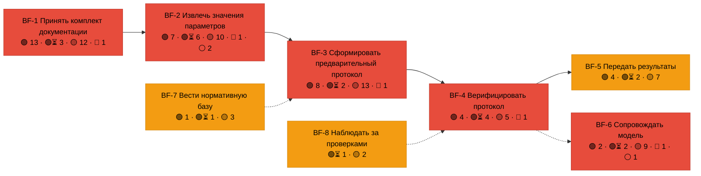

# Аудит требований ГЕРА против кода

Снимок: коммит `7e1f886` (после него в `main` три коммита, но модель ГЕРА, код API и ML в них не менялись —
выводы действуют и для `f8e0af7`). Проверено только чтением и лёгкими прогонами; ничего не исправлялось.

## Главное за 30 секунд

- **Трассировочная таблица и карта актуальны модели.** `pnpm trace:check` зелёный, пересборка `pnpm trace` не меняет
  ни одного файла — `TRACE-TZ.md/.html`, `TRACE-MAP.html`, `TZ-DECOMPOSITION.md`, `BOARD.md` соответствуют `model.yaml`.
- **Но зелёная трасса говорит «ссылки на месте», а не «код делает то, что написано».** Гейт проверяет только, что
  подстрока символа и название теста есть в файле. Тесты он не запускает и смысл не сверяет. По трассе ✅ реализовано
  68 из 78 пунктов ТЗ; по смысловой сверке из 129 правил сервисов полностью подтверждено **39**.
- **5 правил не соответствуют коду (🔴)** — одно из них опасное: подтверждённый через API MISSING_EVIDENCE
  превращается в нарушение и уходит в «РиН» (OS-INSP-4.3.2).
- **Упавших тестов нет.** 219 тестов из трассы прошли, 93 не запускались — тяжёлые (e2e, OCR, стенд §14, UI);
  что нужно, чтобы их прогнать, — в [TEST-INFRA-NEEDS.md](TEST-INFRA-NEEDS.md).

## Легенда

| Знак | Значение |
|---|---|
| 🟢 | соответствует: код делает то, что написано в правиле, тест это проверяет, тест прогнан сейчас и прошёл |
| 🟢⏳ | по коду соответствует, но тест тяжёлый и в этот раз не прогонялся (e2e, OCR, UI) |
| 🟡 | частично: реализован не весь текст правила, тест косвенный или проверяет соседнее, ссылка ведёт на комментарий или строку сообщения |
| 🔴 | не соответствует: код расходится с правилом, или тестов нет, или тест упал |
| ⚪ | не реализовано: в `model.yaml → impl` записи нет (to-be) |

Прогон тестов: ✅ прошёл · ❌ упал · ⏭ пропущен (нет модели) · ⏳ не прогонялся (тяжёлый) · ❓ тест не найден.

## Итог

| Что | 🟢 | 🟢⏳ | 🟡 | 🔴 | ⚪ | Всего |
|---|---|---|---|---|---|---|
| Правила сервисов (OS-INSP-x.y.n) | 39 | 21 | 61 | 5 | 3 | 129 |
| НФТ (constraints) | 4 | 2 | 10 | 0 | 10 | 26 |
| Диалоги (экраны) | 0 | 18 | 2 | 0 | 0 | 20 |
| Объекты данных | 25 | 0 | 1 | 0 | 0 | 26 |

Прогон тестов, на которые ссылается трасса: **✅ 228** (из них 9 найдены по префиксу названия) · **⏭ 4** · **⏳ 93** · **❌ 0**.
Лёгкие наборы целиком: API без e2e 422/422, ML без OCR и стенда 155 прошли + 5 пропущено, deploy 15/15.

## Поток: бизнес-функции и их состояние

Красный узел — в функции есть хотя бы одно 🔴; жёлтый — есть 🟡 или непрогнанные тесты.

## Актуальность трассировочной таблицы и карты

| Проверка | Результат | |
|---|---|---|
| Гейт `pnpm trace:check` | «Трасса цела: 78 пунктов ТЗ — ✅ 68 · 🟡 2 · ⏸ 8» | 🟢 |
| Пересборка `pnpm trace` на снимке | 0 изменённых файлов: таблица, карта, декомпозиция ТЗ и доска свежие | 🟢 |
| Каждое правило `03-services.md` есть в `model.yaml` и наоборот | 129 = 129, лишних записей impl нет | 🟢 |
| Правила без impl | OS-INSP-2.2.4, 2.2.5, 6.4.2 — в трассе честно «не начато» | 🟢 |
| Правило с кодом без тестов | OS-INSP-6.5.5 — в трассе «частично» | 🟢 |
| Гейт ловит неточные названия тестов | **нет**: сравнение по подстроке пропускает обрезанные названия — `1.2.5`, `1.3.3`, `1.4.2`, `3.4.3`, `4.1.5` | 🟡 |
| Гейт отличает логику от комментария | **нет**: ссылки на `// OS-INSP-…`, текст сообщения или схему ввода засчитываются как код (например 1.2.6, 1.2.18, 1.5.1, 2.1.7, 3.1.8, 5.2.3) | 🟡 |
| Гейт запускает тесты | **нет**: «✅ реализовано» в трассе не означает, что тест проходит | 🟡 |
| Текст правил сам с собой согласован | **нет**: 1.2.1 «только PDF, DOCX и XML» противоречит 1.2.9 (XLSX, JPG, PNG, TIF) | 🟡 |
| impl полон | нет: у 2.3.1, 3.2.4–3.2.7, 3.4.4 нужные тесты есть в репозитории, но в impl не указаны | 🟡 |

**Вывод.** Таблица и карта точно отражают `model.yaml`, но `model.yaml` местами описывает связи оптимистичнее, чем
код: зелёная клетка в трассе — это «есть ссылка на символ и тест», а не «требование выполнено».

## Изменения после снимка (до `82e9b1a`, 26.09.2026)

Сессия T-082…T-087 закрыла часть находок. Проверено чтением и лёгким прогоном; таблицы выше не пересчитаны.

| Код | Было | Стало | Проверка |
|---|---|---|---|
| NFR-OBS-STACK | 🟡 Alertmanager нет, алерт по накопительному среднему | 🟢 Alertmanager в стенде, `prometheus.yml → alerting`, `InspectorSlowResponses` = `rate(latency_sum[5m]) / rate(requests[5m])`, связи в model.yaml обновлены (T-085) | deploy-тесты 21/21 |
| OS-INSP-3.2.4 | 🟡 связан только тест приёма гипотезы | 🟡 добавлены тесты выбора LLM-провайдера (gpu без провайдера — отказ при старте), но отказ валидатора без bbox/цитаты по-прежнему не связан (T-086) | test_llm_provider 10/10 |

Пять 🔴 после снимка не менялись. `pnpm trace:check` на `82e9b1a` цел: ✅ 68 · 🟡 2 · ⏸ 8.

## Несоответствия (🔴)

1. **OS-INSP-4.3.2 — MISSING_EVIDENCE можно превратить в нарушение.** `decide()` (`apps/api/src/services/inspections.ts:590`)
   и `applyDecision()` (`apps/api/src/domain/lifecycle.ts:50`) не проверяют `finding_status`: `confirm` по записи
   MISSING_EVIDENCE даёт CONFIRMED_VIOLATION, она попадает в `confirmed_violations` протокола и после финализации — в «РиН».
   Интерфейс кнопку не показывает, но API пропускает. Правило прямо запрещает.
2. **OS-INSP-1.3.1 — черновик-преемник выбивает утверждённую редакцию.** `apps/api/src/domain/revisions.ts:56–61`:
   редакция считается заменённой по `predecessor_id` без учёта статуса преемника. Утверждённая ред. A + черновик ред. B
   с `predecessor_id = A` → A SUPERSEDED, B UNRESOLVED, эталона нет, все параметры уходят в CLARIFICATION_REQUIRED.
   Подтверждено вызовом функции.
3. **OS-INSP-3.1.2 — нет значения в обязательной стадии, а запись «проверено».** `apps/api/src/domain/compare.ts:105–121`:
   для пороговых правил MISSING_EVIDENCE ставится, только если значения нет ни в одной стадии; если есть хотя бы в одной —
   NEGATIVE_VERIFIED, обязательность стадии не учитывается. Тест `domain.test.ts:213` закрепляет это поведение.
   Нужно решение: править код или переформулировать правило.
4. **OS-INSP-2.2.6 — исправление шифра по реестру в рабочем контуре не работает.** `fix_code` вызывается только из
   оценочного стенда `ml/eval/run.py:157`; в `/analyze` и API вызова нет.
5. **OS-INSP-6.5.5 — сравнения с пределами §11 нет.** `scripts/bench-11.mjs` только замеряет, пределов и вердикта нет;
   вторая ссылка (`bench_pages.py::def page`) — генератор картинки. Тестов нет.

## Существенные 🟡 (риск выше «слабый тест»)

- **OS-INSP-1.2.12 — безопасность.** Срок сертификата подписи сверяется с временем подписания, которое подписант пишет
  сам (`apps/api/src/services/signature.ts:227,230`); штампа времени и CRL/OCSP нет — подпись задним числом истёкшим
  ключом даёт VALID. Тест «через 25 лет… — VALID» закрепляет это.
- **OS-INSP-1.2.14.** Подпись, пришедшая отдельной дозагрузкой, не запускает пересчёт (`app.ts:186`, `rin-pull.ts:194`).
- **OS-INSP-1.4.3.** Файл вне реестра маскирует недостающий: реестр A, B; загружены A, C → стадия UPLOADED. Подтверждено вызовом.
- **OS-INSP-2.3.4, 2.2.8.** ML находит значение (рег. номер, дату, меру близости), API его не сохраняет — инспектор видит
  факт находки, но не значение.
- **OS-INSP-3.2.2.** Проверка «гипотезы не среди нарушений» в `e2e.test.ts:323` проходит всегда: поля `discovery_method`
  в карточке нет. Что гипотезы не попадают в GOLD, не проверяется нигде.
- **OS-INSP-3.3.4.** При появлении новой стадии пересчитываются все параметры, а не только затронутые (`inspections.ts:424`).
- **NFR-API.** В OpenAPI 19 путей при ~55 маршрутах API.

Полные разборы по каждому правилу — в [details/](details/) (по бизнес-функциям).

## Требования по потоку

### BF-INSP-1 · Принять комплект документации

**OS-INSP-1.1 Зарегистрировать объект проверки** — BO-INSP-1.1

| | Правило | Требование (текст ГЕРЫ) | Прогон тестов | Вывод аудита |
|---|---|---|---|---|
| 🟡 | `OS-INSP-1.1.1` | Система присваивает объекту стабильный object_id, который не меняется при переименовании. | ⏳ 1 | Скорректировано координатором (было RED): переименования в системе нет, поэтому object_id стабилен тривиально; тест про object_id отсутствует — слабое доказательство, а не нарушение. |
| 🟡 | `OS-INSP-1.1.2` | Когда объект заведён, система открывает по нему проверку в статусе PENDING. | ⏳ 1 | Код верен (inspections.ts:115), но ни один тест не проверяет PENDING после создания: e2e ждёт READY |

**OS-INSP-1.2 Принять файлы комплекта с реестром** — BO-INSP-1.2

| | Правило | Требование (текст ГЕРЫ) | Прогон тестов | Вывод аудита |
|---|---|---|---|---|
| 🟡 | `OS-INSP-1.2.1` | Система принимает только PDF, DOCX и XML; иной формат отклоняется с перечнем поддерживаемых. | ✅ 1 · ⏳ 1 | Код принимает 7 форматов (upload.ts:9, по 1.2.9), текст правила не обновлён; в тесте «неподдерживаемый» — усечённый PNG |
| 🟢 | `OS-INSP-1.2.2` | Если файл больше 50 МБ, система отклоняет его и называет предел. | ✅ 1 | checkFile (upload.ts:37-43), тест проверяет код и «50 МБ». Ссылка ведёт на константу, а не на checkFile |
| 🟢 | `OS-INSP-1.2.3` | Если пакет больше 200 МБ, система отклоняет пакет целиком и называет превышенный предел. | ✅ 1 | ingest бросает 413 до приёма любого файла (inspections.ts:143-144), тест проверяет границу и текст |
| 🟡 | `OS-INSP-1.2.4` | Если PDF повреждён, система отклоняет файл с просьбой загрузить его повторно. | ✅ 1 · ⏳ 1 | «Повреждён» определяется только по отсутствию `%%EOF` в последних 2 КБ (upload.ts:47). PDF с битым телом или xref принимается и падает уже в ML |
| 🟢⏳ | `OS-INSP-1.2.5` | Система вычисляет SHA-256 каждого файла и никогда не перезаписывает файл под существующим file_id. | ⏳ 1 | inspections.ts:162-170: FILE_ID_EXISTS/DUPLICATE, тест проверяет оба случая и HASH_MISMATCH. Ссылка на тест — префикс названия |
| 🟡 | `OS-INSP-1.2.6` | Если у пакета нет реестра файлов, система принимает пакет со статусом CLARIFICATION_REQUIRED. | ⏳ 1 | Ссылка ведёт на строку сообщения (inspections.ts:202); логика в selectRevisions(!hasManifest)→UNRESOLVED. Статус проверки CLARIFICATION_REQUIRED не ставится, он есть только в тексте ответа |
| 🟡 | `OS-INSP-1.2.7` | Пока протокол не финализирован, система принимает дозагрузку без перезагрузки уже принятых файлов. | ✅ 1 · ⏳ 1 | Во время PARSING дозагрузка отклоняется с 409 (lifecycle.ts:6), хотя протокол не финализирован. Основной путь проверен e2e |
| 🟢⏳ | `OS-INSP-1.2.8` | Если протокол финализирован, система отклоняет дозагрузку и предлагает открыть новую проверку. | ⏳ 1 | inspections.ts:140-141: 409 и «Создайте новую проверку», e2e проверяет 409 и текст |
| 🟢 | `OS-INSP-1.2.9` | Когда в пакете таблица XLSX или изображение JPG, PNG, TIF, система принимает файл как документ пакета. | ✅ 2 | sniff по сигнатуре (upload.ts:18-34), parse_xlsx в ML, тесты на каждую сигнатуру |
| 🟡 | `OS-INSP-1.2.10` | Когда реестр связывает части одного документа, система принимает документ больше 50 МБ частями и собирает его в один. | ✅ 1 | Ссылка и тест покрывают только наследование роли частями; сборку (сквозные страницы, счёт как одного документа) проверяет e2e OBJ-SKL-5, но в impl его нет |
| 🟢 | `OS-INSP-1.2.11` | Когда рядом с документом пакета лежит откреплённая подпись CMS с тем же именем и расширением .sig или .p7s, система проверяет подпись по содержимому документа и записы… | ✅ 5 | ingest отделяет подписи (inspections.ts:155), attachSignatures пишет signature_check_json и аудит; тест маршрута проверяет всё |
| 🟡 | `OS-INSP-1.2.12` | Когда подпись математически верна, сертификат подписанта действовал в момент подписания и его цепочка сходится к доверенному корню, система ставит VALID и относит подп… | ✅ 9 | Реализовано и сильно покрыто, но «момент подписания» берётся из signingTime, который подписант указывает сам (services/signature.ts:227,230), без штампа времени. Отзыв сертификата (CRL/OCSP) не проверяется |
| 🟢 | `OS-INSP-1.2.13` | Если подпись выполнена по ГОСТ Р 34.10-2012, а сертифицированного СКЗИ в контуре нет, система ставит UNVERIFIED с причиной и не считает подпись действительной. | ✅ 3 | signatureVerdict:98-99 ставит ГОСТ раньше математики, signatureFacts:229-235 не считает математику и цепочку; тесты по OID и маршруту |
| 🟡 | `OS-INSP-1.2.14` | Если проверка подписи дала INVALID или UNVERIFIED, система не считает документ подписанным электронно, даже когда реестр заявляет подпись, и проверяет реквизиты как у … | ✅ 2 | Правило в evaluateRequisites верно (requisites.ts:67), но подпись, дозагруженная отдельно, не пересчитывает протокол: app.ts:186 и rin-pull.ts:194 зовут startProcessing только при accepted>0. Тест вызывает writeRequisites вручную |
| 🟢 | `OS-INSP-1.2.15` | Когда в ИАИС «РиН» появился новый пакет документов по объекту, система без ручной загрузки забирает файлы и реестр пакета и принимает их по правилам OS-INSP-1.2 (ТЗ 7,… | ✅ 4 | setInterval(pollRin) в server.ts:21 (gpu: on), приём через ingest, тест проверяет актор system:rin, реестр, файлы и очередь |
| 🟢 | `OS-INSP-1.2.16` | Система забирает каждый пакет «РиН» один раз: повторный опрос не создаёт дублей файлов и проверок. | ✅ 3 | pickNew + завершённые статусы в rin_packages + DUPLICATE как безвредный код; тест проверяет отсутствие новых файлов, проверок и скачиваний |
| 🟢 | `OS-INSP-1.2.17` | Если протокол проверки объекта финализирован, система не дозагружает забранный пакет, а уведомляет инспектора о новом пакете. | ✅ 2 | planPackage→NOTIFY_ONLY до скачивания, notify inspector (rin-pull.ts:221-224); тест проверяет отсутствие файлов и скачиваний и одно уведомление |
| 🟡 | `OS-INSP-1.2.18` | Если «РиН» недоступна, система не отмечает пакет забранным и повторяет забор в следующем цикле опроса. | ✅ 3 | Поведение верно и сильно протестировано, но вторая code-ref — комментарий (rin-pull.ts:81), а не логика; настоящая логика — rin-pull.ts:77-84,145,148 |
| 🟢 | `OS-INSP-1.2.19` | Если файл пакета «РиН» отклонён правилами приёма, система отмечает пакет REJECTED с причиной и уведомляет администратора. | ✅ 8 | packageOutcome + savepoint (всё или ничего) + notify admin; 8 тестов на каждую причину отказа |

**OS-INSP-1.3 Определить актуальные редакции** — BO-INSP-1.3

| | Правило | Требование (текст ГЕРЫ) | Прогон тестов | Вывод аудита |
|---|---|---|---|---|
| 🔴 | `OS-INSP-1.3.1` | Система выбирает эталоном последнюю применимую редакцию со статусом APPROVED или FOR_CONSTRUCTION. | ✅ 1 | revisions.ts:61: редакция считается заменённой по predecessor_id без учёта статуса преемника. APPROVED A + DRAFT B(pred=A) → A SUPERSEDED, B UNRESOLVED, эталона нет (подтверждено прогоном) |
| 🟢 | `OS-INSP-1.3.2` | Система исключает редакции SUPERSEDED и CANCELLED из эталона и сохраняет их для аудита. | ✅ 1 | revisions.ts:59-60, файлы остаются в files с ролью SUPERSEDED; тест точный. Ссылка — строковый литерал с 4 вхождениями |
| 🟢⏳ | `OS-INSP-1.3.3` | Если у документа несколько кандидатов в эталон или нет признака утверждения, система помечает документ CLARIFICATION_REQUIRED. | ✅ 1 · ⏳ 1 | CONFLICT/UNRESOLVED (revisions.ts:63-73) → compare.ts:93-97 CLARIFICATION_REQUIRED; unit и e2e. Ссылка на e2e — префикс названия |

**OS-INSP-1.4 Оценить комплектность и сценарий проверки** — BO-INSP-1.4

| | Правило | Требование (текст ГЕРЫ) | Прогон тестов | Вывод аудита |
|---|---|---|---|---|
| 🟢 | `OS-INSP-1.4.1` | Система присваивает каждой стадии статус UPLOADED, PARTIAL или MISSING (PD_*, RD_*, ID_*). | ✅ 1 | loadCodes/stageLoad, тест на все три кода |
| 🟢 | `OS-INSP-1.4.2` | Система определяет сценарий FULL, PD_RD_ONLY, PD_ID_ONLY, RD_ID_ONLY, SINGLE_ONLY или PARTIALLY_LOADED. | ✅ 1 | Все 6 сценариев в it.each (плюс NO_DOCUMENTS сверх правила). Ссылка — префикс шаблона «… %#» |
| 🟡 | `OS-INSP-1.4.3` | Система считает стадию PARTIAL, когда реестр объявляет больше файлов этой стадии, чем загружено. | ✅ 1 | documentCounts (completeness.ts:36-41) добавляет файлы вне реестра к uploaded и маскирует недостающие: объявлены A,B; загружены A и C вне реестра → PD_UPLOADED (подтверждено прогоном). Тест проверяет только stageLoad |
| 🟢 | `OS-INSP-1.4.4` | Система сверяет перечень скрытых работ из Общих данных ПД с принятыми АОСР и ставит MISSING_EVIDENCE по каждой работе без акта. | ✅ 1 | evaluateHiddenWorks: по каждой позиции NEGATIVE_VERIFIED со ссылкой или MISSING_EVIDENCE HW-n; тест точный |

**OS-INSP-1.5 Зарегистрировать согласованное изменение** — BO-INSP-1.5

| | Правило | Требование (текст ГЕРЫ) | Прогон тестов | Вывод аудита |
|---|---|---|---|---|
| 🟡 | `OS-INSP-1.5.1` | Система хранит согласованное изменение с номером, датой, затронутыми параметрами и документом-основанием. | ✅ 1 | Ссылка ведёт только на zod-схему ввода, хранение в services/changes.ts::addChange в impl нет; документ-основание необязателен (changes.ts:9), а по правилу обязателен; тест проверяет только валидацию |

### BF-INSP-2 · Извлечь значения параметров

**OS-INSP-2.1 Распознать текст документа** — BO-INSP-2.1

| | Правило | Требование (текст ГЕРЫ) | Прогон тестов | Вывод аудита |
|---|---|---|---|---|
| 🟢⏳ | `OS-INSP-2.1.1` | Система берёт текстовый слой PDF, когда он есть, и запускает OCR только для страниц без него. | ⏳ 1 | Решение принимается по каждой странице отдельно (`chars >= MIN_TEXT_CHARS`, parse.py:210); тест проверяет source=text и source=ocr |
| 🟡 | `OS-INSP-2.1.2` | Если качество распознавания страницы ниже порога, система помечает страницу LOW_QUALITY. | ⏳ 1 | Код верен (parse.py:177), но тест допускает `ABSTAIN` и выбирает страницу без строк: сравнение с порогом 60 не проверяется |
| 🟢⏳ | `OS-INSP-2.1.3` | Система кэширует результат разбора по SHA-256 файла. | ⏳ 1 | Ключ = sha256 + ревизии разборщика и извлечения + хеш параметров (app.py:62-69); тест проверяет `cached` и совпадение извлечений |
| 🟡 | `OS-INSP-2.1.4` | Если разбор файла превысил тайм-аут, система повторяет его до 2 раз и затем уведомляет администратора. | ✅ 1 | Проверена общая очередь с `maxRetries: 2`, заданным в самом тесте; прод-конфиг `parseWork` (inspections.ts:258-263) и `notify(admin)` тестом не проверяются |
| 🟢⏳ | `OS-INSP-2.1.5` | Система читает страницу без текстового слоя несколькими движками OCR и выбирает текст голосованием. | ⏳ 2 | Голосование большинством с правилом ничьей реализовано (ocr_ensemble.py:309-355) и проверено фейковыми движками. Оговорка: в dev это три прогона одного Tesseract с разными настройками |
| 🟢⏳ | `OS-INSP-2.1.6` | Если движки расходятся в слове, система помечает слово как сомнительное и снижает уверенность значения. | ⏳ 1 | Пометка `disputed` в vote, штраф ×0,6 в extract.py:164-165; тест сравнивает уверенность одного значения со спорным словом и без него |
| 🟡 | `OS-INSP-2.1.7` | Система сохраняет, какие движки OCR участвовали в разборе страницы и как они разошлись. | ⏳ 1 | Ссылка ведёт на объявление поля pydantic, а не на логику; сохраняются только агрегаты (движки, число спорных слов, доля согласия) в pages_json; тест пропускается без tesseract |
| 🟢 | `OS-INSP-2.1.8` | Если скан страницы наклонён, система собирает слова одной строки таблицы в одну строку с поправкой на наклон. | ✅ 3 | `words_skew` и группировка с поправкой на наклон (ocr_ensemble.py:364-418); тест на наклоне −0,02 проверяет, что каждая строка «подпись — ед. — значение» собрана целиком |

**OS-INSP-2.2 Извлечь значения параметров с координатами** — BO-INSP-2.2

| | Правило | Требование (текст ГЕРЫ) | Прогон тестов | Вывод аудита |
|---|---|---|---|---|
| 🟡 | `OS-INSP-2.2.1` | Система сохраняет для каждого значения file_id, SHA-256, стадию, шифр, редакцию, статус утверждения, страницу и bbox. | ⏳ 1 | Ссылка и тест покрывают только страницу и bbox (ML Extraction). Остальные 6 атрибутов берутся соединением с `files` и `evidence_fragments` в API, но это не прослежено и не проверено |
| 🟡 | `OS-INSP-2.2.2` | Система нормирует bbox к диапазону [0;1] видимой области страницы с учётом CropBox и Rotate. | ⏳ 1 | Используется `FPDF_PageToDevice` (parse.py:66-83); тест проверяет только /Rotate 90. CropBox нет ни в тестах, ни в синтетике |
| 🟢⏳ | `OS-INSP-2.2.3` | Если значение не найдено, система не выдумывает его и оставляет параметр без извлечения. | ⏳ 1 | Если `_find_value` вернул None, строка пропускается (extract.py:148-150); тест проверяет отсутствие извлечения |
| ⚪ | `OS-INSP-2.2.4` | Система ищет значение каждого из 132 параметров Матрицы в источниках, которые Матрица задаёт для стадии. | — | Записи impl нет. Фактически extract ищет каждый параметр во всех документах, без учёта source_pd/source_rd/source_id |
| ⚪ | `OS-INSP-2.2.5` | Значение из ячейки таблицы система связывает с наименованием и единицей измерения из той же строки таблицы. | — | Записи impl нет. Единица измерения из строки не извлекается и не связывается |
| 🔴 | `OS-INSP-2.2.6` | Если шифр отличается от записи реестра только гомоглифами (3/З, 0/О, 6/Б), система исправляет шифр по реестру и помечает исправление. | ✅ 4 | `fix_code` вызывается только из оценочного стенда ml/eval/run.py:157 (флаг `.corrected` отбрасывается). В /analyze и API вызова нет: система шифр не исправляет |
| 🟢⏳ | `OS-INSP-2.2.7` | Система определяет вид документа внутри марки: спецификация, ведомость, общие данные, смета, опросный лист, расчёт. | ✅ 4 · ⏳ 1 | `classify` по заголовку и шапке ГОСТ 21.110; API отфильтровывает сметы и ОЛ (inspections.ts:410); тесты ML, домена и e2e |
| 🟡 | `OS-INSP-2.2.8` | Если лексическое совпадение якоря ниже порога, система сопоставляет якорь с текстом по смысловой близости и сохраняет меру близости. | ✅ 4 · ⏭ 4 | ML возвращает `match` и `similarity`, но API их не хранит: в таблице extractions нет таких столбцов (db.ts:29-31, INSERT в inspections.ts:313). Семантика работает только для числовых параметров без шаблона |
| 🟢 | `OS-INSP-2.2.9` | Если параметр строковый, а правило сравнения числовое или порядковое, система извлекает главное число значения вместе с текстом; если числа нет, ставит NOT_COMPARABLE. | ✅ 4 | `num_rule` (extract.py:154), `compare_kind` передаётся из API (inspections.ts:298); NOT_COMPARABLE проверяется в domain.test |
| 🟢 | `OS-INSP-2.2.10` | Строка таблицы даёт значение только одному из параметров с похожими якорями — тому, чей якорь совпал лучше и конкретнее. | ✅ 4 | `_rivals` и `_claim` (кортеж сходство, длина), пропуск на extract.py:144; тест со «Строительный объем (Подземный)» |
| 🟢 | `OS-INSP-2.2.11` | Строковое или перечислимое без шаблона значение параметра система берёт целиком — хвост строки после якоря, а не только число из него. | ✅ 3 | extract.py:94-98 с очисткой `STRIP`; тесты на string, enum и соринку скана |

**OS-INSP-2.3 Проверить реквизиты документа** — BO-INSP-2.3

| | Правило | Требование (текст ГЕРЫ) | Прогон тестов | Вывод аудита |
|---|---|---|---|---|
| 🟡 | `OS-INSP-2.3.1` | Система находит на странице печати, подписи и штампы «В производство работ» и «Выполнено согласно проекту» с bbox. | ✅ 2 | `detect` находит все виды, но тесты в impl проверяют только печать и отсутствие ложных срабатываний. Тесты подписей и штампов есть, но в трассу не включены |
| 🟢 | `OS-INSP-2.3.2` | Если на документе ИД нет обязательного реквизита, система ставит MISSING_EVIDENCE по документу. | ✅ 2 | `evaluateRequisites` (обязательна подпись) и `writeRequisites` пишут проверку REQ-файла; тесты на отказ и исключения |
| 🟡 | `OS-INSP-2.3.3` | Если на рабочем чертеже в составе ИД нет штампа «В производство работ» или «Выполнено согласно проекту», система ставит MISSING_EVIDENCE по документу. | ✅ 2 · ⏳ 1 | Логика верна (REQUIRED_DRAWING, isWorkingDrawing) и протестирована; одна code-ссылка ведёт на генератор синтетики `ml/synth/generate.py::def _work_stamp`, а это не реализация |
| 🟡 | `OS-INSP-2.3.4` | Система извлекает регистрационный номер документа с bbox. | ✅ 2 · ⏳ 1 | ML извлекает номер (`value`) с bbox, но API теряет его: в таблице requisites нет столбца value (db.ts:107-108), `saveRequisites` его не пишет, ответ app.ts:295 его не отдаёт |

**OS-INSP-2.4 Измерить размеры на чертеже** — BO-INSP-2.4

| | Правило | Требование (текст ГЕРЫ) | Прогон тестов | Вывод аудита |
|---|---|---|---|---|
| 🟡 | `OS-INSP-2.4.1` | Система определяет масштаб листа по размерной линии с числом размера и сохраняет его вместе со способом определения. | ✅ 2 · ⏳ 1 | Масштаб и способ вычисляются заново на каждый GET /measure (app.ts:307-318) и нигде не сохраняются |
| 🟢 | `OS-INSP-2.4.2` | Система находит линии чертежа и измеряет расстояние между ними в миллиметрах с bbox обоих концов. | ✅ 2 | `distances` возвращает мм, a_bbox и b_bbox; тесты на точность 2 %, bbox и отказ для не противолежащих линий |
| 🟢 | `OS-INSP-2.4.3` | Если масштаб нельзя определить или две размерные линии дают разный масштаб, система не измеряет и ставит NOT_COMPARABLE. | ✅ 3 | measure.py:111-115 и `distances` → [] при mm_per_px=None; тесты на противоречие, отсутствие линии и эндпоинт |

### BF-INSP-3 · Сформировать предварительный протокол

**OS-INSP-3.1 Сопоставить источники по параметру** — BO-INSP-3.1

| | Правило | Требование (текст ГЕРЫ) | Прогон тестов | Вывод аудита |
|---|---|---|---|---|
| 🟡 | `OS-INSP-3.1.1` | Система сначала проверяет применимость, комплектность и актуальность, и только затем сравнивает значения. | ✅ 1 | Порядок в коде соблюдён (compare.ts:88–138), но тест проверяет только «применимость раньше сравнения»; порядок актуальности и комплектности относительно сравнения не проверен |
| 🔴 | `OS-INSP-3.1.2` | Если обязательного источника нет, система ставит MISSING_EVIDENCE и не считает запись нарушением. | ✅ 1 | Условие «обязательный источник» в решении не проверяется: MISSING_EVIDENCE только при <2 значениях (compare.ts:128) или 0 значений для min/max (compare.ts:107); при обязательной, загруженной, но пустой стадии выходит NEGATIVE_VERIFIED/CANDIDATE, и тест это закрепляет (domain.test.ts:213) |
| 🟢 | `OS-INSP-3.1.3` | Если актуальная редакция не определена, система ставит CLARIFICATION_REQUIRED. | ✅ 1 | Роли CONFLICT/UNRESOLVED → CLARIFICATION_REQUIRED до сравнения (compare.ts:93–102), тест проверяет обе роли |
| 🟢 | `OS-INSP-3.1.4` | Если значения нельзя привести к общему виду, система ставит NOT_COMPARABLE. | ✅ 1 | violates()→null даёт NOT_COMPARABLE (compare.ts:110, 147), тест: число против текста и значение вне шкалы |
| 🟢 | `OS-INSP-3.1.5` | Когда расхождение превышает порог параметра, система ставит CANDIDATE с expected, actual и delta. | ✅ 1 | violates + evaluate дают CANDIDATE с тремя полями, тест проверяет значения; замечание: берётся последняя нарушающая стадия, а не максимальное отклонение (compare.ts:113, 150) |
| 🟢 | `OS-INSP-3.1.6` | Когда расхождение в пределах порога, система ставит NEGATIVE_VERIFIED. | ✅ 1 | compare.ts:124, 164; тест проверяет границу: ровно 1 % — в допуске, 1,01 % — нет |
| 🟢 | `OS-INSP-3.1.7` | Система никогда не присваивает CONFIRMED_VIOLATION сама. | ✅ 1 | evaluate такого статуса не возвращает; в src он ставится только решением инспектора (lifecycle.ts:51); тест перебирает правила и значения |
| 🟡 | `OS-INSP-3.1.8` | Если параметр неприменим к объекту, система ставит NOT_APPLICABLE с основанием. | ✅ 1 | Поведение есть (compare.ts:89–90), тест хороший, но ссылка указывает на словарь текстов причин APPLICABILITY_RU, а не на логику |
| 🟢 | `OS-INSP-3.1.9` | Когда на параметр зарегистрировано согласованное изменение, система прикладывает его к карточке кандидата. | ✅ 1 | changesFor подключён в checkRows→attachApprovedChanges (inspections.ts:540), тест проверяет поля карточки |

**OS-INSP-3.2 Сформировать гипотезы вне Матрицы** — BO-INSP-3.2

| | Правило | Требование (текст ГЕРЫ) | Прогон тестов | Вывод аудита |
|---|---|---|---|---|
| 🟢⏳ | `OS-INSP-3.2.1` | Система проверяет активные логические правила вида «если A, то B» по извлечённым фактам объекта. | ✅ 1 · ⏳ 1 | logical() проверяет is_active, A и B (suspicions.ts:73–94), вызывается в writeSuspicions; тест покрывает срабатывание, неактивное правило, ложное A и выполненное B |
| 🟡 | `OS-INSP-3.2.2` | Система не включает SUSPICION в число нарушений и в GOLD. | ⏳ 1 | Структурно верно (отдельный раздел protocol.ts:145, GOLD строится только из checks), но проверка в тесте тавтологична (e2e.test.ts:323: у evidenceCard нет поля discovery_method), а GOLD не проверяется |
| 🟡 | `OS-INSP-3.2.3` | Система объединяет одинаковые гипотезы только внутри одного объекта. | ✅ 1 | dedupe() не знает про объект, сливает по dedup_key; границу объекта задаёт вызывающий код (одна проверка) и unique(inspection_id, dedup_key); тест не проверяет, что гипотезы разных объектов не сливаются |
| 🟡 | `OS-INSP-3.2.4` | Система принимает гипотезу LLM-советника только со ссылкой на файл, страницу, bbox и дословную цитату. | ✅ 1 | validate реализует все проверки (advisor.py:277–335), но связанный тест проверяет только принятие; «только» (отказы без bbox, цитаты, файла) проверяется в несвязанных тестах |
| 🟡 | `OS-INSP-3.2.5` | Если цитата советника не найдена на указанной странице, система отбрасывает гипотезу и записывает причину. | ✅ 1 | Отказ с кодом есть (advisor.py:314–318), но запись причины делает advisor.ts:60 (журнал аудита): этот код не в impl, и связанный тест её не проверяет |
| 🟡 | `OS-INSP-3.2.6` | Система подбирает к гипотезе применимую норму поиском по нормативной базе. | ✅ 1 | Код полный (NormIndex.search + attachNorms), но связанный тест проверяет только ранжирование BM25, а не то, что норма прикреплена к гипотезе |
| 🟡 | `OS-INSP-3.2.7` | Когда у гипотезы есть файл, страница и bbox, система позволяет инспектору перевести её в CANDIDATE. | ✅ 1 | Код реализует (advisor.ts:76–111, роль inspector/supervisor в app.ts:407), но связанный тест проверяет только отказ без bbox; основной путь (advisor.test.ts:81) не связан; страница не сверяется с числом страниц файла (suspicions.ts:192) |

**OS-INSP-3.3 Выпустить версию протокола** — BO-INSP-3.3

| | Правило | Требование (текст ГЕРЫ) | Прогон тестов | Вывод аудита |
|---|---|---|---|---|
| 🟡 | `OS-INSP-3.3.1` | Система фиксирует в протоколе matrix_version, model_version, dataset_version и input_manifest_hash. | ⏳ 1 | Все 4 поля есть в протоколе и в таблице protocols, но тест проверяет только matrix_version, model_version и хеш, dataset_version не проверен (e2e.test.ts:168–169) |
| 🟢⏳ | `OS-INSP-3.3.2` | Система выводит раздельно: комплектность, кандидатов, подтверждённые, отрицательные и гипотезы. | ⏳ 1 | buildProtocolBody выдаёт отдельные разделы (protocol.ts:140–147), тест сверяет список ключей разделов |
| 🟡 | `OS-INSP-3.3.3` | Когда протокол выпущен, система переводит проверку в READY и уведомляет инспектора. | ⏳ 1 | Код есть (inspections.ts:493–496), но тест READY явно не проверяет (только косвенно через waitFor в uploadAndWait), а уведомление инспектору не проверяет нигде |
| 🟡 | `OS-INSP-3.3.4` | Когда пришла дозагрузка, система пересчитывает только параметры с новыми данными и сохраняет прежнюю версию в истории. | ⏳ 1 | Версии хранятся, v1 доступна (тест это проверяет), но то, что пересчитаны только затронутые параметры, не проверено; при новой стадии пересчитываются все параметры (inspections.ts:424) |

**OS-INSP-3.4 Выявить изменения листа между редакциями** — BO-INSP-3.4

| | Правило | Требование (текст ГЕРЫ) | Прогон тестов | Вывод аудита |
|---|---|---|---|---|
| 🟢 | `OS-INSP-3.4.1` | Система совмещает растры двух листов по ключевым точкам и гомографии. | ✅ 1 | SIFT/ORB + ratio-test + findHomography RANSAC (sheetdiff.py:119–161); тест: сдвиг и поворот, инлайеров > 4×порог |
| 🟢 | `OS-INSP-3.4.2` | Система строит карту изменений и выделяет области изменений рамками bbox. | ✅ 1 | change_map (SSIM + чернила) и regions (контуры → bbox на A и B); тест сверяет IoU с эталоном, bbox на B и отсутствие шума |
| 🟡 | `OS-INSP-3.4.3` | Система создаёт по каждой области изменения карточку CANDIDATE с обеими страницами и рамками. | ✅ 1 | Код и тест сильные (sheetdiff.ts:113–126), но в impl название теста усечено: «…с двумя фрагментами» — только префикс полного названия (совпадает как подстрока, не точно) |
| 🟡 | `OS-INSP-3.4.4` | Если листы не совмещаются, система ставит NOT_COMPARABLE. | ✅ 1 | Ссылка указывает на одну из вспомогательных проверок (degenerate); статус NOT_COMPARABLE ставит diffToChecks (sheetdiff.ts:98–111), он не связан; тест проверяет ML-строку `not_comparable`, а не статус системы |

### BF-INSP-4 · Верифицировать протокол

**OS-INSP-4.1 Принять решение по кандидату** — BO-INSP-4.1

| | Правило | Требование (текст ГЕРЫ) | Прогон тестов | Вывод аудита |
|---|---|---|---|---|
| 🟡 | `OS-INSP-4.1.1` | Система показывает ожидаемое и фактическое значения рядом со страницами ПД/РД/ИД и выделенными областями. | ⏳ 1 | API-карточка есть (protocol.ts:58), вёрстка «рядом» есть (Verify.tsx:104-113, 326), но тест по ссылке проверяет только данные API, отрисовку не проверяет |
| 🟡 | `OS-INSP-4.1.2` | Когда инспектор подтверждает, система ставит CONFIRMED_VIOLATION с user_id, временем и комментарием. | ✅ 1 · ⏳ 1 | decide() пишет user_id/created_at/comment (inspections.ts:599-601), но ни один тест не проверяет, что user_id, время и комментарий сохранены |
| 🟢⏳ | `OS-INSP-4.1.3` | Когда инспектор отклоняет, система требует reason_code и комментарий и ставит NEGATIVE_VERIFIED. | ✅ 1 · ⏳ 1 | lifecycle.ts:53-55 плюс route app.ts:347 отклоняет неизвестный код; тесты проверяют оба отказа (400) |
| 🟢 | `OS-INSP-4.1.4` | Когда инспектор запрашивает уточнение, система ставит CLARIFICATION_REQUIRED. | ✅ 1 | lifecycle.ts:52; тест проверяет статус; e2e — через части M-002 |
| 🟡 | `OS-INSP-4.1.5` | Система позволяет принять решение по кандидату не более чем за 3 клика. | ⏳ 1 | Код-ссылка ведёт на комментарий (Verify.tsx:2); test-ref — только префикс настоящего названия (dialogs.test.mjs:155), сам тест сильный: считает реальные клики 1/3/1 |
| 🟢 | `OS-INSP-4.1.6` | Когда инспектор отклоняет кандидата, система пишет запись журнала отклонений: вердикт ИИ, причина, комментарий и предложенная правка. | ✅ 2 | feedback-logs.ts:46 плюс вставка inspections.ts:608; юнит-тест и e2e проверяют все поля |
| 🟢 | `OS-INSP-4.1.7` | Когда инспектор ставит «Требует уточнения» или расходится с советником, система пишет спорный случай с комментариями инспектора и ИИ. | ✅ 2 | disputeEntry различает CLARIFICATION и ADVISOR_DISAGREEMENT; есть юнит-тест и e2e (2 спора) |

**OS-INSP-4.2 Разделить составной кандидат** — BO-INSP-4.2

| | Правило | Требование (текст ГЕРЫ) | Прогон тестов | Вывод аудита |
|---|---|---|---|---|
| 🟢⏳ | `OS-INSP-4.2.1` | Система создаёт у каждого атомарного finding собственные доказательства и собственное решение. | ⏳ 1 | splitCandidate копирует фрагменты по частям (inspections.ts:640-651); e2e проверяет PD+ID / PD+RD, решения по частям и 409 на родителя |
| 🟡 | `OS-INSP-4.2.2` | Система не использует статус PARTIALLY_CONFIRMED. | ⏳ 1 | В коде PARTIALLY_CONFIRMED отсутствует, в типе VerificationStatus его нет. Ссылка ведёт на механизм SPLIT, а не на запрет, и отсутствие статуса ничем не проверено |

**OS-INSP-4.3 Финализировать протокол** — BO-INSP-4.3

| | Правило | Требование (текст ГЕРЫ) | Прогон тестов | Вывод аудита |
|---|---|---|---|---|
| 🟢⏳ | `OS-INSP-4.3.1` | Если остался хоть один необработанный CANDIDATE, система не даёт финализировать. | ✅ 1 · ⏳ 1 | canFinalize плюс isOpenCandidate (lifecycle.ts:19-28); домен и e2e (409) проверяют |
| 🔴 | `OS-INSP-4.3.2` | Система выводит MISSING_EVIDENCE отдельным перечнем и не превращает его в нарушение. | ⏳ 1 | Перечень отдельный (protocol.ts:144), но decide() не проверяет finding_status (inspections.ts:590-597): подтверждение по API превращает MISSING_EVIDENCE в CONFIRMED_VIOLATION, и запись уходит в «РиН». Тест по ссылке проверяет только набор ключей sections |
| 🟢⏳ | `OS-INSP-4.3.3` | Когда протокол финализирован, система запрещает дозагрузку и смену статусов. | ✅ 1 · ⏳ 1 | canVerify/canUpload плюс отдельные запреты в suspicions/promote/changes; домен и e2e (409 на решение и загрузку) |

**OS-INSP-4.4 Отменить финализацию** — BO-INSP-4.4

| | Правило | Требование (текст ГЕРЫ) | Прогон тестов | Вывод аудита |
|---|---|---|---|---|
| 🟢 | `OS-INSP-4.4.1` | Система разрешает отмену только супервизору или администратору и требует причину. | ✅ 1 | canUnfinalize (lifecycle.ts:31-36) плюс auth("supervisor") с неявным admin (app.ts:83, 386); домен и e2e (403) проверяют |
| 🟡 | `OS-INSP-4.4.2` | Когда финализация отменена, система возвращает протокол в VERIFICATION_COMPLETED и пишет запись аудита. | ⏳ 1 | Статус ставится литералом "COMPLETED" (inspections.ts:677), а OpenAPI обещает "VERIFICATION_COMPLETED" (openapi.ts:85): внешний контракт расходится с фактическим ответом. Аудит пишется и проверен |

### BF-INSP-5 · Передать результаты

**OS-INSP-5.1 Выгрузить протокол** — BO-INSP-5.1

| | Правило | Требование (текст ГЕРЫ) | Прогон тестов | Вывод аудита |
|---|---|---|---|---|
| 🟡 | `OS-INSP-5.1.1` | Система выгружает протокол в JSON, PDF, DOCX и XML с версиями и карточками доказательств. | ⏳ 1 | Код формирует всё, render.py выводит versions и sources, но тест проверяет только сигнатуру файла ({, <?xml, %PDF, PK), а наличие версий и карточек не проверяет |
| 🟢⏳ | `OS-INSP-5.1.2` | Система формирует запись о применении ИИ-средства для акта (SRC-INSP-07, п. 9(1).8): факт применения, наименование и категорию средства (прил. 2, п. 2), версии модели,… | ✅ 3 · ⏳ 1 | aiUsageRecord содержит все элементы: факт, категорию, версии, дату, исправность, данные с доказательствами, SHA-256. Юнит-тесты проверяют каждый, e2e — текст и хеш |

**OS-INSP-5.2 Передать протокол в ИАИС «РиН»** — BO-INSP-5.2

| | Правило | Требование (текст ГЕРЫ) | Прогон тестов | Вывод аудита |
|---|---|---|---|---|
| 🟡 | `OS-INSP-5.2.1` | Система передаёт только финализированный протокол и только подтверждённые инспектором записи. | ⏳ 1 | Фильтр подтверждённых проверен (e2e, domain-ai-usage). Отказ «не финализирован → CANCELLED» (rin.ts:40-44) не покрыт ни одним тестом. В act_text записи ai_usage, которая уходит в «РиН», остаются счётчики неподтверждённых кандидатов |
| 🟡 | `OS-INSP-5.2.2` | Если внешняя система недоступна, система ставит PENDING_SYNC и повторяет отправку через 1, 5 и 15 минут. | ⏳ 1 | backoffMs и config [1,5,15] (config.ts:75) реализуют правило, но интервалы не проверяются: e2e прыгает на +44/+52/+72 мин (e2e.test.ts:278), и мутация [1,5,15]→[2,6,20] выживет. Юнит-теста backoffMs нет |
| 🟡 | `OS-INSP-5.2.3` | Система не меняет решение инспектора из-за сбоя передачи. | ⏳ 1 | Скорректировано координатором (было RED): по коду сбой передачи решения не трогает (rin.ts), но ссылка ведёт на текст уведомления, а тест не сравнивает решения до и после сбоя. |
| 🟢⏳ | `OS-INSP-5.2.4` | Система передаёт в ИАИС «РиН» запись о применении ИИ-средства вместе с подтверждёнными записями (SRC-INSP-07, п. 9(1).10). | ✅ 1 · ⏳ 1 | rinPayload включает aiUsageForRin; юнит (null вместо пропуска) и e2e (sent[0].ai_usage) проверяют |

**OS-INSP-5.4 Отразить статус предписания** — BO-INSP-5.4

| | Правило | Требование (текст ГЕРЫ) | Прогон тестов | Вывод аудита |
|---|---|---|---|---|
| 🟢 | `OS-INSP-5.4.1` | Когда ИАИС «РиН» сообщает статус предписания, система принимает только ISSUED, IN_PROGRESS, COMPLETED, CANCELLED или EXTENDED; иной статус отклоняется с перечнем допус… | ✅ 5 | parsePrescriptionMessage плюс PRESCRIPTION_STATUSES; route-тест проверяет 400 с allowed и отсутствие записей |
| 🟡 | `OS-INSP-5.4.2` | Если проверки с указанным process_id нет, система отклоняет сообщение и не заводит предписание. | ✅ 1 | Поведение верно и проверено (404, 0 строк), но code-ref указывает на комментарий (services/prescriptions.ts:73), а не на inspectionExists/throw |
| 🟢 | `OS-INSP-5.4.3` | Система считает текущим статус с самой поздней датой события в «РиН», а не последний пришедший, и хранит историю всех смен. | ✅ 4 | currentStatus по event_at, при равенстве — по seq; домен и route-тест с опоздавшим событием |
| 🟢 | `OS-INSP-5.4.4` | Если сообщение с тем же предписанием, статусом и датой события пришло повторно, система не дублирует запись истории. | ✅ 3 | Нормализация в UTC плюс unique в БД (db.ts:120) плюс insert or ignore; route-тест: 200, 1 событие, аудит не растёт |
| 🟡 | `OS-INSP-5.4.5` | Система показывает по проверке текущий статус каждого предписания и его историю. | ✅ 2 | API реализован и проверен. UI-компонент Prescriptions (Inspection.tsx:359) ни одним тестом не покрыт: в dialogs.test.mjs нет диалога предписаний |
| 🟢 | `OS-INSP-5.4.6` | Если сообщение пришло без действующего ключа интеграции «РиН», система его отклоняет. | ✅ 3 | rinKeyVerdict (503/401, сравнение в постоянном времени) плюс checkRinInboundKey на маршруте до разбора; тесты проверяют 401/503 и отсутствие записей |
| 🟡 | `OS-INSP-5.4.7` | Система не меняет протокол и решения инспектора по статусу предписания. | ✅ 1 | Тест сильный (снимок protocols/checks/decisions/inspections до и после), но code-ref — заголовочный комментарий (services/prescriptions.ts:2); инвариант держится на отсутствии кода |

### BF-INSP-6 · Сопровождать модель

**OS-INSP-6.1 Выпустить версию GOLD-набора** — BO-INSP-6.1

| | Правило | Требование (текст ГЕРЫ) | Прогон тестов | Вывод аудита |
|---|---|---|---|---|
| 🟡 | `OS-INSP-6.1.1` | Система включает в набор только CONFIRMED_VIOLATION и NEGATIVE_VERIFIED с полными карточками. | ✅ 1 · ⏳ 1 | Логика верна (gold.ts:18-21, выборка только FINALIZED app.ts:506-511), но ссылка на e2e-тест — префикс названия «GOLD: …, разбиение по объектам» (e2e.test.ts:427) |
| 🟢 | `OS-INSP-6.1.2` | Система разбивает набор на train/validation/test по object_id. | ✅ 1 | splitOf хеширует object_id (gold.ts:24-28); тест проверяет: один объект — одна выборка, все три выборки есть |
| 🟡 | `OS-INSP-6.1.3` | Система фиксирует dataset_version и SHA-256 каждой выборки. | ✅ 1 | Хеш считается только по списку finding_id (gold.ts:43-44): смена gold_label или split при тех же id хеш не меняет. Тест не проверяет dataset_version и не проверяет, что при другом содержимом хеш другой |

**OS-INSP-6.2 Сформировать отчёт по дообучению** — BO-INSP-6.2

| | Правило | Требование (текст ГЕРЫ) | Прогон тестов | Вывод аудита |
|---|---|---|---|---|
| 🟡 | `OS-INSP-6.2.1` | Система еженедельно собирает статистику отклонений по reason_code и параметрам с рекомендациями. | ⏳ 1 | Code-ref — строка маршрута; логика в services/report.ts:19-25. Рекомендации есть только по reason_code, у by_param их нет. e2e-тест проверяет только by_reason |
| 🟢 | `OS-INSP-6.2.2` | Система формирует отчёт по дообучению еженедельно по расписанию. | ✅ 2 | reportDue и runWeeklyReportIfDue: неделя ISO, идемпотентность, догон после простоя; тик в server.ts:28. Тесты на границы периода и однократность |

**OS-INSP-6.3 Допустить модель к публикации** — BO-INSP-6.3

| | Правило | Требование (текст ГЕРЫ) | Прогон тестов | Вывод аудита |
|---|---|---|---|---|
| 🟢⏳ | `OS-INSP-6.3.1` | Если Recall по любой категории упал больше чем на 2 п.п. или FPR вырос больше чем на 2 п.п., система блокирует публикацию. | ✅ 1 · ⏳ 1 | publicationGate сравнивает с последней PUBLISHED (gold.ts:64-70, app.ts:542-544). Тест на границах: 3 п.п. — блок, 2 п.п. — пропуск; FPR +2,5 п.п. — блок |
| 🟡 | `OS-INSP-6.3.2` | Система публикует модель только с подписью ответственного и хранит ссылку для отката. | ⏳ 1 | approved_by и rollback_to пишутся (app.ts:554), но тест проверяет только approved_by, rollback_to нигде не проверяется, операции отката нет. Code-ref — строка audit-действия |

**OS-INSP-6.4 Дообучить модель на эталонном наборе** — BO-INSP-6.4

| | Правило | Требование (текст ГЕРЫ) | Прогон тестов | Вывод аудита |
|---|---|---|---|---|
| 🟡 | `OS-INSP-6.4.1` | Система генерирует синтетические листы с известными ответами: значения, штампы, печати, подписи, изменения. | ✅ 3 | Фабрика генерирует всё перечисленное, но тесты из impl проверяют только значения, детерминизм и метки. Тест на реквизиты и изменения (test_factory_gold_has_requisites_changes_and_scans, test_factory.py:92) в impl не указан |
| ⚪ | `OS-INSP-6.4.2` | Система запускает дообучение LoRA на GPU-контуре по версии набора и сохраняет параметры обучения. | — | Записи impl нет — требование to-be |
| 🟡 | `OS-INSP-6.4.3` | Фабрика синтетики порождает для каждого из 132 параметров Матрицы пять исходов: нарушение, отрицательный результат, MISSING_EVIDENCE, неприменимость и конфликт редакций. | ✅ 4 | По коду исход «неприменимость» получают только параметры с applicability (factory_v3.py:212), а «нарушение» не для всех параметров достижимо — docstring сам говорит «в каждом достижимом исходе». Ни один тест не проверяет, что у каждого параметра есть все пять меток; проверка NA в тесте может пройти вхолостую (test_factory_v3.py:28) |

**OS-INSP-6.5 Измерить качество на эталонном наборе** — BO-INSP-6.5

| | Правило | Требование (текст ГЕРЫ) | Прогон тестов | Вывод аудита |
|---|---|---|---|---|
| 🟡 | `OS-INSP-6.5.1` | Система считает Character Accuracy, CER, WER, Exact Match, связку, IoU, Precision, Recall, F1 и FPR. | ⏳ 4 | Все метрики есть в METRICS, но «связка» считается в run.py:305-309, на который нет code-ref, и не покрыта ни одним тестом из impl |
| 🟡 | `OS-INSP-6.5.2` | Система публикует для каждой метрики размер выборки, coverage и 95 % доверительный интервал. | ⏳ 2 | Для precision/recall/f1/fpr coverage всегда NaN → в отчёте null (metrics.py:257-280). Тесты из impl проверяют только математику бутстрапа, а не то, что отчёт это публикует |
| 🟢⏳ | `OS-INSP-6.5.3` | Система сравнивает метрики с порогами §14 и выносит вердикт «принято / не принято». | ⏳ 2 | 8 порогов 14.3-01…06, любой непройденный порог даёт «не принято», n=0 или NaN — «не пройден»; тесты на границы |
| 🟡 | `OS-INSP-6.5.4` | Стенд публикует покрытие извлечения и качество сверки по каждому параметру Матрицы. | ✅ 1 | Срез slices["param"] есть (run.py:451), но в markdown по параметрам coverage не выводится (только value(n), run.py:626-630). Тест не проверяет coverage и прогоняет один объект из 22 параметров, а не 132 |
| 🔴 | `OS-INSP-6.5.5` | Стенд измеряет время этапов обработки и сравнивает его с пределами §11 ТЗ. | — | bench-11.mjs только замеряет: пределов §11 и вердикта по ним в коде нет. Второй code-ref (bench_pages.py::def page) — генератор картинки, а не замер. Тестов нет |

### BF-INSP-7 · Вести нормативную базу

**OS-INSP-7.1 Изменить параметр Матрицы** — BO-INSP-7.1

| | Правило | Требование (текст ГЕРЫ) | Прогон тестов | Вывод аудита |
|---|---|---|---|---|
| 🟡 | `OS-INSP-7.1.1` | Система даёт администратору менять пороги, ссылки и активность параметра без перекодирования. | ⏳ 1 | PATCH /params/:code работает, но: `compare: z.any()` без валидации (app.ts:418); при min_value≠null max_value в compare_json игнорируется, а min_value на параметре decrease/equal молча меняет вид сравнения (app.ts:430-433). Тест проверяет только min_value на min-параметре и указан префиксом названия |
| 🟡 | `OS-INSP-7.1.2` | Когда Матрица изменена, система поднимает matrix_version. | ⏳ 1 | Версия поднимается (app.ts:442-444), тест проверяет «1.1.1». Но ссылка на тест — префикс, и пустой PATCH {} тоже поднимает версию |

**OS-INSP-7.2 Вести нормативный документ** — BO-INSP-7.2

| | Правило | Требование (текст ГЕРЫ) | Прогон тестов | Вывод аудита |
|---|---|---|---|---|
| 🟢⏳ | `OS-INSP-7.2.1` | Система хранит нормативный документ со сроком действия и деактивирует его вместо удаления. | ⏳ 1 | effective_from/to, is_active, маршрута DELETE нет (app.ts:457-474). Тест: после деактивации число записей то же, is_active=0, effective_to записан |
| 🟢 | `OS-INSP-7.2.2` | Справочник норм содержит 13 нормативных актов из §2 ТЗ с редакцией и датой, на которую она действует. | ✅ 3 | Seed из 13 записей, сверка с текстом ТЗ, API. Замечание: тест «не дублируется при повторном открытии» базу повторно не открывает |

**OS-INSP-7.3 Вести логическое правило** — BO-INSP-7.3

| | Правило | Требование (текст ГЕРЫ) | Прогон тестов | Вывод аудита |
|---|---|---|---|---|
| 🟡 | `OS-INSP-7.3.1` | Система даёт администратору включать, выключать и редактировать логические правила свободного поиска. | ⏳ 1 | PATCH /rules/:id меняет только is_active, rule_name, normative_base (app.ts:484): условие, ожидание и якоря не редактируются. Тест проверяет только выключение |

### BF-INSP-8 · Наблюдать за проверками

**OS-INSP-8.1 Просмотреть сводку проверок** — BO-INSP-8.1

| | Правило | Требование (текст ГЕРЫ) | Прогон тестов | Вывод аудита |
|---|---|---|---|---|
| 🟢⏳ | `OS-INSP-8.1.1` | Система окрашивает объект зелёным без кандидатов и нарушений, жёлтым при кандидатах или уточнениях, красным при подтверждённых нарушениях. | ✅ 1 · ⏳ 1 | objectColor (lifecycle.ts:59-63) соответствует правилу; юнит-тест покрывает все ветки, e2e — red и yellow |
| 🟡 | `OS-INSP-8.1.2` | Система фильтрует проверки по разделам, статусам и датам. | ⏳ 1 | Фильтры есть (app.ts:264-272), но тест проверяет только color и section; status, from и to не тестируются. `to` сравнивается строкой с «T23:59:59», поэтому записи последней секунды (…T23:59:59.5Z) выпадают |

**OS-INSP-8.2 Просмотреть журнал аудита** — BO-INSP-8.2

| | Правило | Требование (текст ГЕРЫ) | Прогон тестов | Вывод аудита |
|---|---|---|---|---|
| 🟡 | `OS-INSP-8.2.1` | Система записывает каждое действие пользователя с временем, IP-адресом, типом действия и объектом. | ⏳ 1 | audit() пишет все поля, но часть действий в журнал не попадает: logout (app.ts:117), ручной sync (app.ts:391), INTEGRITY_CHECK пишется без IP (integrity.ts:60), просмотры не пишутся. Тест проверяет лишь `toHaveProperty("ip_address")` — проходит и при null |

## НФТ

| | Код | Требование | Прогон | Вывод аудита |
|---|---|---|---|---|
| 🟡 | `NFR-API` | REST over HTTPS, JSON, схема OpenAPI 3.0 | ⏳ 1 | В OpenAPI 19 путей, а у API около 55 маршрутов. Тест проверяет только строку версии и один путь |
| 🟢⏳ | `NFR-ASYNC` | Асинхронная pull-модель: process_id и эндпоинт статуса | ⏳ 1 | Upload отвечает 202 с process_id, `/inspection/:id/status` отдаёт статус. uploadAndWait в тесте проверяет 202 и опрашивает статус до READY |
| 🟢 | `NFR-STACK` | React, Node.js, Python ≥ 3.11, RabbitMQ | ✅ 5 | fastify, react, requires-python >=3.11, amqpQueue на месте. В gpu без amqp не стартует (config.ts:41). Брокер в тестах поддельный |
| ⚪ | `NFR-OCR-Q` | OCR: Character Accuracy ≥ 0,95; Exact Match ключевых полей ≥ 0,90 · _gpu_ | — | Нет impl (mode gpu) |
| ⚪ | `NFR-CV` | CV: масштаб по размерной линейке, измерение расстояний на чертеже · _gpu_ | — | Нет impl (mode gpu). Сама механика измерения есть в OS-INSP-2.4 и DLG-INSP-16, но НФТ к ней не привязано |
| ⚪ | `NFR-PERF` | Производительность по ТЗ §11 (время OCR, сравнения, протокола, p95 API) · _gpu_ | — | Нет impl (mode gpu). Есть scripts/bench-11.mjs и docs/qa/PERF-11.md, но в model.yaml они не привязаны |
| ⚪ | `NFR-SLA` | SLA 99,9 %, RTO ≤ 1 ч, RPO ≤ 15 мин, 100 одновременных инспекторов · _prod_ | — | Нет impl (mode prod) |
| 🟢⏳ | `NFR-AUTH` | Вход по логину и паролю | ✅ 1 · ⏳ 2 | scrypt и timingSafeEqual, сессия с TTL, 401 без токена, 429 после 5 попыток (app.ts:92–118) |
| 🟡 | `NFR-ROLES` | Роли: инспектор, супервизор, администратор, ML-инженер, куратор | ⏳ 1 | Роли и проверка в auth() есть (app.ts:82). Ссылка ведёт на строку сообщения. Тест покрывает одну пару ролей (admin/inspector) на одном маршруте |
| ⚪ | `NFR-CRYPTO` | Шифрование в покое (БД и файловое хранилище) · _prod_ | — | Нет impl (mode prod). Прототип на SQLite без шифрования |
| 🟢 | `NFR-TLS` | API только по HTTPS с TLS 1.3; в профиле gpu без сертификата сервер не стартует · _prod_ | ✅ 6 | TLS 1.3 закреплён min и max (tls.ts:13), gpu без cert и key падает (config.ts:49–50), nginx на ssl_protocols TLSv1.3. Тесты делают реальные рукопожатия |
| 🟡 | `NFR-IMAGES` | Эксплуатационный контур — из образов по digest: гейт собирает, запускает каждый образ и сверяет ревизию; в рантайме нет пакетного менеджера и root, код только для чтения; интерфейс — по HTTPS с CSP · _prod_ | ✅ 6 · ⏳ 1 | В ml/Dockerfile:32–36 `… && pip uninstall … \ |
| 🟢 | `NFR-LOGRET` | Хранение логов 90 дней / 1 год для событий безопасности · _prod_ | ✅ 4 | ILM: rollover за 1d, delete 90d и 365d. Шаблон data stream привязан к политике. 401/403/429 уходят в inspector-security |
| ⚪ | `NFR-PDN` | Обработка ПДн по 152-ФЗ · _prod_ | — | Нет impl (mode prod) |
| 🟡 | `NFR-INTEGRITY` | Целостность данных (187-ФЗ): ежедневная сверка хешей хранилища | ⏳ 1 | verifyBlobs верна, но «ежедневно» — это setInterval 24 ч в server.ts:24, которого нет в impl. Его не покрывает ни один тест, а каждый рестарт сбрасывает таймер. Проверяются только блобы, не БД |
| ⚪ | `NFR-BACKUP` | Ежедневный бэкап БД и хранилища, хранение 30 дней · _prod_ | — | Нет impl (mode prod), в deploy/ бэкапа нет вообще |
| ⚪ | `NFR-IDS` | IDS и защита от DDoS · _prod_ | — | Нет impl (mode prod) |
| ⚪ | `NFR-UKEP` | Подписание запросов к ИАИС «РиН» УКЭП · _prod_ | — | Нет impl (mode prod) |
| 🟡 | `NFR-MTLS` | Аутентификация в ИАИС «РиН» клиентским сертификатом (mTLS, УКЭП) · _prod_ | ✅ 18 | Механика mTLS сделана полностью, 18 тестов. Но УКЭП на ГОСТ-ключе в коде нет: режим gost-proxy отдаёт это внешнему шлюзу СКЗИ (rin-tls.ts:3–11). Ошибка конфигурации всплывает только при первой отправке (rin.ts:22) |
| 🟡 | `NFR-VERIFY-30` | Полный цикл верификации протокола ≤ 30 минут у опытного инспектора; юзабилити-тест на 5 инспекторах · _prod_ | ✅ 12 | Есть только инструмент замера: VERIFICATION_OPENED, cycleOf/summarize, отчёт. Сам юзабилити-тест не проведён, утверждение ≤ 30 мин ничем не подтверждено |
| 🟢 | `NFR-AV` | Антивирусная проверка файлов перед сохранением · _prod_ | ✅ 3 | screen стоит до ingest (app.ts:181–184). При сбое сканера — отказ, gpu без clamd не стартует (config.ts:36) |
| 🟡 | `NFR-LOGS` | Структурированные JSON-логи: timestamp, level, service, message, request_id, user_id | ✅ 2 | formatLog верен, но только в API. ML (uvicorn и logging в ocr_ensemble.py) пишет не-JSON: Logstash помечает такие строки `_inspector_not_json` |
| 🟡 | `NFR-METRICS` | Метрики Prometheus: CPU/RAM, диск, RPS, латентность, 5xx, очередь, сессии | ⏳ 1 | Метрики диска нет. Латентность — среднее с момента старта процесса (app.ts:132), без гистограммы и p95. Тест проверяет одно имя метрики |
| 🟡 | `NFR-OBS-STACK` | Prometheus + Grafana, ELK, алерты на почту и в Telegram · _prod_ | ✅ 4 | Alertmanager нет, нет ни email, ни Telegram: prometheus.yml знает только rule_files. Алерт InspectorSlowResponses строится на накопительном среднем |
| ⚪ | `NFR-QUALITY` | Приёмка: Precision ≥ 0,90, Recall ≥ 0,80, F1 ≥ 0,85, FPR ≤ 0,10, IoU ≥ 0,5 · _gpu_ | — | Нет impl (mode gpu). В ml/eval/metrics.py и thresholds.py заготовки есть, но не привязаны |
| 🟡 | `NFR-C01` | Корпус corpus-ABC не попадает в репозиторий и демо; демо — синтетика | ⏳ 1 | Реализация — только `.gitignore corpus*/`, она ловит лишь каталоги с таким именем. Тест проверяет правильность извлечения на синтетике, а не инвариант. Защиты в CI нет |

## Диалоги (экраны)

| | Код | Экран | Прогон UI-теста | Вывод аудита |
|---|---|---|---|---|
| 🟢⏳ | `DLG-INSP-01` | Вход | ⏳ 1 | Форма, ошибка неверного пароля, успешный вход |
| 🟢⏳ | `DLG-INSP-02` | Дашборд проверок | ⏳ 1 | Фильтры, сводка, объект в группе «Требует внимания» |
| 🟢⏳ | `DLG-INSP-03` | Загрузка пакета | ⏳ 1 | Зона файлов, поля карточки, предупреждение без реестра, кнопка неактивна |
| 🟢⏳ | `DLG-INSP-04` | Карточка проверки · Обзор | ⏳ 1 | Коды комплектности, 4 формата экспорта, верификация, дозагрузка |
| 🟢⏳ | `DLG-INSP-05` | Карточка проверки · Документы | ⏳ 1 | Роли редакций («заменена», «эталон») и OCR |
| 🟢⏳ | `DLG-INSP-06` | Карточка проверки · Протокол | ⏳ 1 | Четыре раздельные группы статусов |
| 🟡 | `DLG-INSP-07` | Карточка проверки · Гипотезы | ⏳ 1 | Тест «решение по гипотезе» проверяет только подзаголовок панели (Inspection.tsx:234), который виден и без гипотез. Решение не выполняется |
| 🟢⏳ | `DLG-INSP-08` | Карточка проверки · Версии и журнал | ⏳ 1 | Версии протокола, журнал, v1 |
| 🟢⏳ | `DLG-INSP-09` | Верификация | ⏳ 1 | Очередь, лист, решение клавишей «3» уменьшает число ждущих |
| 🟢⏳ | `DLG-INSP-10` | Матрица контроля | ⏳ 1 | Поиск M-041, кнопка «Изменить» у admin |
| 🟢⏳ | `DLG-INSP-11` | Нормативная база и правила | ⏳ 1 | Норматив и логическое правило видны |
| 🟢⏳ | `DLG-INSP-12` | Модель и эталонный набор | ⏳ 1 | Блоки GOLD, отчёт, реестр моделей (smoke) |
| 🟡 | `DLG-INSP-13` | Журнал аудита | ⏳ 1 | Тест «действия с IP» не проверяет колонку IP (Audit.tsx:33), только строку LOGIN_FAILED |
| 🟢⏳ | `DLG-INSP-14` | Карточка проверки · Документы: вид документа | ⏳ 1 | Бейджи data-doc-type для чертежа, сметы и опросного листа |
| 🟢⏳ | `DLG-INSP-15` | Реквизиты: карточка документа и рамки на листе | ⏳ 1 | Список по страницам, рамки .hl.req, находка REQ, переключатель слоя |
| 🟢⏳ | `DLG-INSP-16` | Измерение на чертеже | ⏳ 1 | 6000 мм и расстояния. Без масштаба — «не определён» и 0 расстояний |
| 🟢⏳ | `DLG-INSP-17` | Карточка проверки · Отклонения и споры | ⏳ 1 | Супервизор видит журналы, у инспектора вкладки нет. Тест зависит от состояния, созданного тестом OS-INSP-4.1.5 |
| 🟢⏳ | `DLG-INSP-18` | Справочник нормативных правовых актов | ⏳ 1 | 13 строк и все колонки |
| 🟢⏳ | `DLG-INSP-19` | Еженедельные отчёты по дообучению | ⏳ 1 | Неделя как диапазон дат, раскрытие отчёта |
| 🟢⏳ | `DLG-INSP-20` | Карточка проверки · Протокол: запись о применении ИИ для акта | ⏳ 1 | Показан режим до финализации. Финализированный режим эмулирован перехватом `final: true`, копирование проверено |

## Объекты данных

| | Код | Объект | Прогон | Вывод аудита |
|---|---|---|---|---|
| 🟢 | `DO-OBJECT` | Объект капитального строительства | — | Таблица objects есть, строка в 04-data есть |
| 🟢 | `DO-INSPECTION` | Проверка (process_id) | — | inspections |
| 🟢 | `DO-FILE` | Файл документа с метаданными реестра | — | files |
| 🟢 | `DO-MANIFEST` | Реестр файлов пакета | — | inspections.manifest_json, пишется в inspections.ts:193 |
| 🟡 | `DO-COMPLETENESS` | Статус загрузки и сценарий | — | В data.table указана колонка inspections.scenario, а code-ref ведёт на load_codes_json. Обе колонки есть (db.ts:16), ссылка неточная |
| 🟢 | `DO-PAGE` | Страница с текстом и словами (bbox) | — | files.pages_json |
| 🟢 | `DO-EXTRACTION` | Извлечённое значение параметра | — | extractions |
| 🟢 | `DO-PARAM` | Параметр Матрицы (132) | — | params, в сид data/seed/matrix.json ровно 132 |
| 🟢 | `DO-CHECK` | Доказательная группа / finding | — | checks |
| 🟢 | `DO-FRAGMENT` | Доказательный фрагмент | — | evidence_fragments |
| 🟢 | `DO-REJECTION` | Запись журнала отклонений (Rejection_Log) | — | rejection_log |
| 🟢 | `DO-DISPUTE` | Спорный случай (Dispute_Log) | — | dispute_log |
| 🟢 | `DO-RETRAIN-REPORT` | Отчёт по дообучению за неделю | — | retraining_reports |
| 🟢 | `DO-LEGAL-ACT` | Нормативный правовой акт ТЗ §2 с редакцией | — | legal_acts, сид 13 актов |
| 🟢 | `DO-SUSPICION` | Гипотеза вне Матрицы | — | suspicions |
| 🟢 | `DO-RULE` | Логическое правило | — | logical_rules |
| 🟢 | `DO-NORM` | Нормативный документ | — | normative_base |
| 🟢 | `DO-PROTOCOL` | Версия протокола | — | protocols с unique (inspection_id, version) |
| 🟢 | `DO-DECISION` | Решение инспектора | — | decisions |
| 🟢 | `DO-SIGNATURE-CHECK` | Результат проверки откреплённой подписи документа | — | files.signature_check_json, добавляется через addColumns (db.ts:144) |
| 🟢 | `DO-RIN-PACKAGE` | Пакет ИАИС «РиН», забранный автоматически | — | rin_packages |
| 🟢 | `DO-SYNC` | Задание передачи в ИАИС «РиН» | — | sync_jobs |
| 🟢 | `DO-PRESCRIPTION` | Предписание и история его статусов по данным ИАИС «РиН» | — | prescriptions и prescription_events с FK и unique |
| 🟢 | `DO-DATASET` | Версия GOLD-набора и её элементы | — | dataset_versions и dataset_items. dataset_items в API только пишется и нигде не читается |
| 🟢 | `DO-MODEL` | Версия модели | — | model_versions |
| 🟢 | `DO-AUDIT` | Запись журнала аудита | — | audit_log с ip_address и user_agent |

## Как проверялось

1. **Механика** — `pnpm trace:check` и `pnpm trace` в отдельном worktree на `7e1f886`, `git status` после пересборки.
2. **Исполнение** — лёгкие наборы: `vitest` API без e2e (JSON-отчёт), `pytest` ML без `test_parse_extract`,
   `test_ocr_ensemble`, `test_eval` (JUnit), `node --test scripts/deploy.test.mjs`. Каждое название теста из
   `model.yaml → impl` сопоставлено с результатом. Тяжёлое не запускалось по правилу №0 и решению владельца.
3. **Смысл** — шесть ревьюеров (только чтение) по бизнес-функциям и по НФТ/диалогам/данным: текст правила → код по
   ссылке → тест по ссылке. Все 🔴 перепроверены координатором по коду; два вердикта понижены до 🟡 (1.1.1, 5.2.3) —
   причина указана в строке.

Ограничение: смысловая сверка — чтение кода, не формальное доказательство; 🟢 значит «аудитор не нашёл расхождения».
