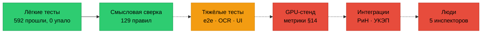

# Что построено и что нужно, чтобы проверить это до конца

Документ для владельца: к нему можно вернуться, когда будут решения по ресурсам. Цифры — на коммите `7e1f886`
(25.09.2026). Цен здесь нет намеренно: их нужно запросить у поставщиков, а не брать из памяти.

## 1. Что построено

Прототип «Инспектора ИИ» — не набросок, а рабочая система с доказательной базой.

| Слой | Объём |
|---|---|
| Код | ≈ 17 400 строк: API (57 маршрутов), веб (9 страниц, 20 экранов-диалогов), ML (21 модуль: разбор PDF/DOCX/XML, ансамбль OCR, извлечение 132 параметров, реквизиты, измерения на чертеже, семантические якоря), стенд качества §14, фабрика синтетики |
| Тесты | ≈ 9 900 строк: API 444 (422 модульных и маршрутных + 22 сквозных), ML 220, UI 21, развёртывание 15 |
| Мутационное тестирование | новые модули API 87–100 %, ML 82–94 % (порог проекта 80 %) |
| Требования | модель ГЕРА: 8 бизнес-функций, 30 сервисов, 129 правил; у 126 есть код, у 125 — код и тест |
| Трасса ТЗ | 78 пунктов, 68 закрыты ссылками на код и тесты; таблица и карта пересобираются из модели и сейчас актуальны |
| Задачи | 52 закрыты, 14 в проверке; 106 коммитов |
| Эксплуатационный контур | образы API, ML, веба по стандарту прод-образов; стенд gpu собран и прошёл smoke на CI-фабрике (trivy 0 HIGH/CRITICAL), TLS 1.3, mTLS к «РиН», RabbitMQ, Redis, ClamAV, Prometheus/Grafana, ELK |

Независимый аудит требований ([GERA-AUDIT-2026-09-25](GERA-AUDIT-2026-09-25.md)) подтвердил по смыслу 60 из 129
правил, нашёл 5 расхождений и 61 место, где доказательство слабее, чем показывает трасса. Упавших тестов нет.

## 2. Что проверено, а что нет

| Уровень | Состояние | Чего не хватает |
|---|---|---|
| Лёгкие тесты на маке | 🟢 API 422/422, ML 155 + 5 пропущено, deploy 15/15 — секунды | — |
| Тяжёлые тесты на маке | 🟡 не прогонялись в аудите: 93 связи трассы | свободный диск |
| Метрики качества ТЗ §14, OCR на нейросетях, дообучение | 🔴 не измерялись ни разу | сервер с GPU |
| Интеграция с ИАИС «РиН», ГОСТ-TLS, подпись УКЭП | 🔴 проверено на заглушках и обычных сертификатах | контракт API, лицензия СКЗИ |
| Юзабилити ≤ 30 минут на протокол | 🔴 инструмент замера готов, замера нет | 5 инспекторов, объект T-081 |

## 3. Что нужно — по уровням

### 3.1. Мак разработчика: освободить диск (без покупок)

**Сейчас свободно 9,4 ГБ; правило №0 требует ≥ 20 ГБ**, иначе тяжёлое не запускается — своп некуда растить.
Что это откроет: e2e API (22 сценария, 52 связи трассы), ML-тесты разбора, OCR и стенда §14 (~65 тестов),
UI-тесты Playwright (20 экранов), мутационные прогоны Stryker и mutmut. Оценка по замерам: каждый блок —
от 30 секунд до 3 минут, пик памяти 2–3 ГБ; запуск по одному через `scripts/heavy.sh`.

Кандидаты на освобождение (решение владельца, перенос — только через `translog`, в корзину, не насовсем):

| Что | Объём | Как |
|---|---|---|
| `~/Library/Caches` | 6,2 ГБ | чистка кэшей приложений |
| `~/Library/pnpm` | 1,8 ГБ | `pnpm store prune` |
| `~/.cache` | 1,8 ГБ | модели и кэши Python — проверить, что не нужно |
| `~/.npm` | 1,4 ГБ | `npm cache clean --force` |
| крупные папки вне проектов | — | выселить в холодный ярус (Яндекс.Диск / Google Drive) по реестру переносов |

Альтернатива без чистки — внешний SSD под рабочие каталоги и кэши.

### 3.2. Сервер с GPU (покупка или аренда)

ADR-0001: эксплуатация — GPU класса NVIDIA H100 (80 ГБ). На серверах HOSTKEY (`hk-ru`, `hk-nl`, `hk-nl-heavy`)
GPU нет, поэтому сейчас не проверяется:

- метрики приёмки §14 на скрытой выборке: Character Accuracy ≥ 0,95, Precision ≥ 0,90, Recall ≥ 0,80, F1 ≥ 0,85,
  FPR ≤ 0,10, IoU ≥ 0,5 (NFR-OCR-Q, NFR-QUALITY);
- нейросетевой OCR PaddleOCR / Surya (T-063);
- дообучение LoRA и реестр итераций (T-076, OS-INSP-6.4.2);
- производительность §11 на целевом железе (NFR-PERF, T-066) и нагрузочный тест на 100 инспекторов (T-075).

Что запросить у поставщика: сервер с GPU — для стенда проверки метрик достаточно одной карты с большим объёмом
видеопамяти, для эксплуатации — класс H100 по ADR-0001; диск под корпус, модели и образы (ML-образ 1,5 ГБ).
Варианты — аренда почасово на время прогонов или помесячно под стенд; выбор — после цен.

### 3.3. Выкатка стенда gpu (T-060)

Стенд собран и проверен на CI-фабрике, выкатки не было. Нужно:

1. Репозиторий в GitHub и раннер с Docker и ≥ 10 ГБ диска (`vars.RUNNER_LABEL`).
2. Приватный реестр образов (`REGISTRY_HOST/USER/PASSWORD`).
3. Хост стенда: `hk-nl-heavy` заполнен на ~93 % — освободить место или взять другой хост; внешнее имя и сертификат.
4. «Да» владельца на выкатку.

### 3.4. Внешние доступы и документы

| Что | Зачем | Задача |
|---|---|---|
| Контракт API ИАИС «РиН» (через организатора) | сейчас формат обмена — допущение: передача протокола, статусы предписаний, автозабор | T-067 |
| Лицензия СКЗИ (КриптоПро) и сертификат УКЭП | ГОСТ-TLS к «РиН», подпись запросов, проверка ГОСТ-подписей ИД, CRL/OCSP | T-068 |
| Скрытая выборка организатора | приёмка метрик §14 | TZA-9.1.1-02 |
| Ответы на 8 вопросов организатору | API «РиН», Приложение 2, реквизиты актов, пределы объёмов | T-078 |

### 3.5. Люди

- **5 опытных инспекторов** на юзабилити-тест: цикл верификации ≤ 30 минут, протокол теста (T-077).
  Методика — `docs/qa/usability-test-protocol.md`, замер система снимает сама.
- До теста — синтетический объект «132 параметра, 14 нарушений» (T-081, это код, покупок не требует).

## 4. Что можно сделать без ресурсов

Пять расхождений из аудита чинятся кодом на маке, без железа и доступов:

| Правило | Суть |
|---|---|
| OS-INSP-4.3.2 | API позволяет подтвердить MISSING_EVIDENCE как нарушение — запись уходит в «РиН» |
| OS-INSP-1.3.1 | черновик-преемник выбивает утверждённую редакцию из эталона |
| OS-INSP-3.1.2 | нет значения в обязательной стадии — запись всё равно «проверено» (нужно решение: код или правило) |
| OS-INSP-2.2.6 | исправление шифра по реестру работает только в стенде оценки |
| OS-INSP-6.5.5 | бенчмарк §11 не сравнивает с пределами |

Плюс риск безопасности OS-INSP-1.2.12: срок сертификата сверяется с датой, которую пишет сам подписант.

## 5. Решения, которые ждут владельца

| № | Решение | Что откроет |
|---|---|---|
| 1 | Освободить ≥ 11 ГБ на маке (или внешний SSD) | тяжёлые тесты, мутации — полная картина по 93 непрогнанным связям |
| 2 | Сервер с GPU: запросить цены, выбрать аренду или покупку | метрики §14, нейросетевой OCR, дообучение, производительность |
| 3 | GitHub, раннер, реестр, хост и «да» на выкатку стенда | стенд gpu в работе |
| 4 | Лицензия СКЗИ и УКЭП; контракт «РиН» через организатора | реальная интеграция вместо заглушек |
| 5 | Пять инспекторов на юзабилити-тест | приёмка TZA-9.3.6 |
| 6 | Завести задачи на 5 расхождений аудита | зелёные вердикты без покупок |
