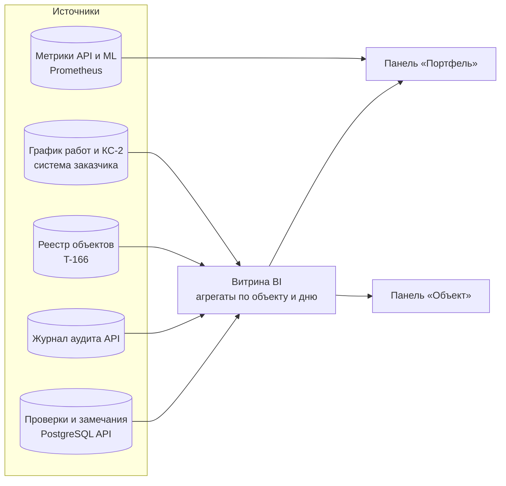

# BI-дашборд платформы: словарь метрик

Макет — `docs/bi/dashboard.html`, на демо-стенде — `/docs/bi/dashboard.html`. Свёрстан языком «Чертёжный бетон»
(дизайн-система T-167, `docs/design/DESIGN-SYSTEM.html`): токены, контрастные замены §04, шкала кеглей §05, радиусы
по роли §06, красный — только «признано инспектором» (срок под угрозой и просрочка — оранжевым), голос §13,
клавиши по `e.code`, ⌘K, `G P`, `J`/`K`. Данные вымышленные: их даёт генератор
с зерном прямо в странице, поэтому плитки считаются из тех же рядов, что и графики. У каждой панели есть кнопка «i»:
как считается и откуда будут данные. Ниже тот же перечень одной таблицей — по нему решаем, что и куда подключать.

## Панель «Портфель» (руководство, все объекты)

| Метрика | Как считается | Будущий источник |
|---|---|---|
| Объектов под контролем | Объекты в реестре со статусом «на контроле» | Реестр объектов (T-166) |
| Пакетов ИД проверено | Проверки с решением инспектора за период | `inspections`: статус и дата решения |
| Срок проверки пакета | Среднее «загрузка → решение» по пакетам, часы; цель 4 ч; до платформы ~11 календарных дней (9 рабочих) | Журнал аудита API |
| Расхождений на пакет | Признанные инспектором расхождения ÷ проверенные пакеты; всего и критичных — в подписи | Таблица замечаний |
| Совпадение с рекомендацией | Доля решений без правок инспектора, взвешенная по пакетам | Решения инспектора против рекомендаций |
| Высвобождено часов | Пакеты × 11,2 ч (14,6 ч вручную − 3,4 ч с платформой); ₽ по ставке 2 900 ₽/ч | Расчёт; ставку и нормы утверждает заказчик |
| Пакеты по итогам | Принят / на доработку / отклонён по корзинам периода | `inspections` |
| Объекты по состоянию | Индекс здоровья (см. ниже): норма ≥ 75, внимание 55–74, риск < 55 | Витрина объектов |
| Полнота ИД объект × раздел | Принятые документы против обязательных на этапе (Приказ Минстроя № 344/пр) | Перечень ИД по этапу + проверки |
| Частые расхождения | Признанные расхождения по коду правила, топ-7 | Замечания + каталог правил ГЕРЫ |
| Файлы, страницы, доступность | Разобранные файлы, страницы с текстом или OCR, доля минут с ответом 200 на /health | Prometheus / внешний пинг |

## Панель «Объект» (директор строительства)

| Метрика | Как считается | Будущий источник |
|---|---|---|
| Паспорт и этап | Реквизиты объекта, этап по графику производства работ | Реестр объектов, график заказчика |
| Индекс здоровья | 0,30 × полнота ИД + 0,30 × замечания + 0,25 × сроки + 0,15 × сверка М-023; каждая часть 0–100 | Витрина объекта |
| — замечания | 100 − min(100, 8 × критические + 0,6 × открытые) | Замечания |
| — сроки | 100 − min(100, 1,5 × дни сдвига ЗОС) | График заказчика |
| Открытые замечания | Снимок открытых на конец корзины; отдельно критические | Замечания со статусом на дату |
| ИД по разделам | То же определение, что на тепловой карте: принято / на проверке / не представлено, % от требуемого на сегодня | Перечень ИД + статусы документов |
| Готовность СМР | План — S-кривая до ЗОС, факт — по актам КС-2; отметки «сегодня», ЗОС план и прогноз | КС-2 заказчика (интеграции нет) |
| Сверка М-023 | Параметры пожарной безопасности в ПД, РД и ИД; нет источника — «нет в пакете», не пропуск | Результаты М-023 (T-165) |
| Журнал объекта | Загрузки, разборы, решения, предписания | Журнал аудита API |
| Критические замечания | Критические открытые, срок 10 дней с выявления | Замечания + каталог правил |

## Что решить при подключении

- Веса индекса здоровья и пороги состояний — предложение BI, утверждает заказчик.
- Нормы «вручную — 14,6 ч, с платформой — 3,4 ч на пакет» и ставка 2 900 ₽/ч — гипотезы макета, их нужно заменить замером у заказчика.
- График производства и КС-2 живут вне платформы: нужна интеграция или ручная загрузка.
- Метрики станут требованиями ГЕРЫ, когда панель начнёт показывать живые данные. Пока это макет, и в модель он не заносится.
