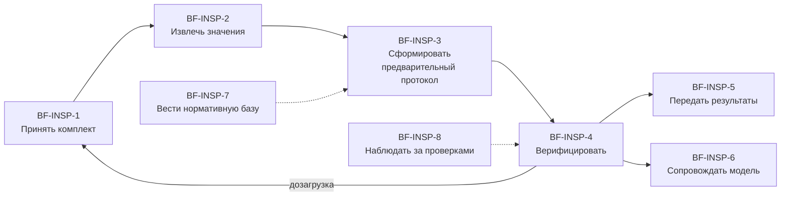

# Инспектор ИИ: бизнес-уровень

Стадия 2 из 8. Вход — [обследование](01-survey.md). Граф связей — [model.yaml](model.yaml).

## Процесс

**BP-INSP — Провести камеральную проверку документации объекта капитального строительства.**
Цель: по трём массивам документов (ПД, РД, ИД) одного объекта получить протокол, в котором
каждое признанное нарушение подтверждено инспектором и доказательством на листе.

## Функции и операции

| Функция | Операция | Исполнитель | Источник |
|---|---|---|---|
| BF-INSP-1 Принять комплект документации | BO-INSP-1.1 Зарегистрировать объект проверки | инспектор | SRC-INSP-01 §10 (Objects) |
| | BO-INSP-1.2 Принять файлы комплекта с реестром | инспектор / ИАИС «РиН» | SRC-INSP-01 §9.1, SRC-INSP-03 |
| | BO-INSP-1.3 Определить актуальные редакции | система | SRC-INSP-01 §9.1, SRC-INSP-03 |
| | BO-INSP-1.4 Оценить комплектность и сценарий проверки | система | SRC-INSP-01 §9.1, §9.2 п.2 |
| | BO-INSP-1.5 Зарегистрировать согласованное изменение | инспектор | SRC-INSP-01 §9.2 п.3, §9.3 п.1 (итерация 2) |
| BF-INSP-2 Извлечь значения параметров | BO-INSP-2.1 Распознать текст документа | система | SRC-INSP-01 §9.1 п.1 |
| | BO-INSP-2.2 Извлечь значения параметров с координатами | система | SRC-INSP-01 §9.1 п.2–4 |
| | BO-INSP-2.3 Проверить реквизиты документа | система | SRC-INSP-01 §5 прим. 2–3 (итерация 2) |
| | BO-INSP-2.4 Измерить размеры на чертеже | система | SRC-INSP-01 §9.1.3 «CV-модуль»: масштаб по размерной линейке, измерение расстояний (итерация 3) |
| BF-INSP-3 Сформировать предварительный протокол | BO-INSP-3.1 Сопоставить источники по параметру | система | SRC-INSP-01 §9.2 п.3 |
| | BO-INSP-3.2 Сформировать гипотезы вне Матрицы | система | SRC-INSP-01 §9.5 |
| | BO-INSP-3.3 Выпустить версию протокола | система | SRC-INSP-01 §9.2 п.4–5 |
| | BO-INSP-3.4 Выявить изменения листа между редакциями | система | SRC-INSP-01 наименование и §1.2; SRC-INSP-04 (итерация 2) |
| BF-INSP-4 Верифицировать протокол | BO-INSP-4.1 Принять решение по кандидату | инспектор | SRC-INSP-01 §9.3 п.1–2 |
| | BO-INSP-4.2 Разделить составной кандидат | инспектор | SRC-INSP-01 §9.3 п.2 |
| | BO-INSP-4.3 Финализировать протокол | инспектор | SRC-INSP-01 §9.3 п.4–5 |
| | BO-INSP-4.4 Отменить финализацию | супервизор / администратор | SRC-INSP-01 §9.3 |
| BF-INSP-5 Передать результаты | BO-INSP-5.1 Выгрузить протокол | инспектор | SRC-INSP-01 §7 п.7 |
| | BO-INSP-5.2 Передать протокол в ИАИС «РиН» | система | SRC-INSP-01 §9.6 |
| | BO-INSP-5.3 Выдать предписание | инспектор | SRC-INSP-01 §9.6 — **вне системы**: юридическое действие в ИАИС «РиН» |
| | BO-INSP-5.4 Отразить статус предписания | система (по данным ИАИС «РиН») | SRC-INSP-01 §9.6.4 «Статусы предписаний» (итерация 4) |
| BF-INSP-6 Сопровождать модель | BO-INSP-6.1 Выпустить версию GOLD-набора | куратор данных | SRC-INSP-01 §9.4, §14 |
| | BO-INSP-6.2 Сформировать отчёт по дообучению | система | SRC-INSP-01 §7 п.10 |
| | BO-INSP-6.3 Допустить модель к публикации | ML-инженер + ответственный | SRC-INSP-01 §9.4 |
| | BO-INSP-6.4 Дообучить модель на эталонном наборе | ML-инженер | SRC-INSP-01 §7 п.4, §9.4 (итерация 2) |
| | BO-INSP-6.5 Измерить качество на эталонном наборе | ML-инженер | SRC-INSP-01 §14 (итерация 2) |
| BF-INSP-7 Вести нормативную базу | BO-INSP-7.1 Изменить параметр Матрицы | администратор | SRC-INSP-01 §7 п.8 |
| | BO-INSP-7.2 Вести нормативный документ | администратор | SRC-INSP-01 §10 (Normative_Base) |
| | BO-INSP-7.3 Вести логическое правило | администратор | SRC-INSP-01 §10 (Logical_Rules) |
| BF-INSP-8 Наблюдать за проверками | BO-INSP-8.1 Просмотреть сводку проверок | инспектор | SRC-INSP-01 §7 п.7 |
| | BO-INSP-8.2 Просмотреть журнал аудита | администратор | SRC-INSP-01 §7 п.9 |

Дозагрузка (SRC-INSP-01 §9.3 п.3) — это повторное исполнение BO-INSP-1.2 внутри открытой
проверки, отдельной операцией не заводится.

## Итерация 2 (2026-09-24): технологии для приёмки по §14

Решение владельца: добавить в модель ансамбль OCR, дифф листов между редакциями, LLM-советника с
обязательной ссылкой на лист и bbox, поиск по нормативам, фабрику синтетики и дообучение. Новые
операции — BO-INSP-1.5, 2.3, 3.4, 6.4, 6.5; остальное — новые правила существующих сервисов
(см. 03-services.md, раздел «Итерация 2»). Приоритет — `docs/plan/TOP-10.md`.

## Итерация 4 (2026-09-25): статус предписания

Выдача предписания остаётся вне системы (BO-INSP-5.3). ТЗ §9.6.4 требует, чтобы система знала его
статус — ISSUED, IN_PROGRESS, COMPLETED, CANCELLED, EXTENDED. Это отдельное действие системы с одним
результатом (статус предписания по проверке), поэтому заведено операцией BO-INSP-5.4. Источник статуса —
ИАИС «РиН»; система статус не вычисляет и не меняет.

## Итерация 5 (2026-09-27, T-129): М-023, пакет архивом, S3, паспорт параметра

Новых операций нет — постановка владельца (SRC-INSP-12) и каталог TO-BE (SRC-INSP-10) разворачиваются в правила
существующих сервисов. Проверка по трём доводам остановки: у каждого нового действия тот же исполнитель, тот же
результат и то же место в процессе, что у существующей операции.

| Что появилось | Операция | Почему не новая операция |
|---|---|---|
| Приём пакета архивом или папкой, реестр по структуре, части ≤ 200 МБ, хранение в S3 | BO-INSP-1.2 | тот же исполнитель (инспектор) и результат — принятые файлы комплекта |
| Упоминания класса, ограничение «не ниже», отсев чужих упоминаний (ENT-16, NRM-03, NRM-04) | BO-INSP-2.2 | результат тот же — значение параметра с координатами |
| Приоритет источников, комплект по базовому шифру, противоречие внутри стадии, сравнение по шкале (LNK-01, CMP-04, CMP-30) | BO-INSP-3.1 | результат тот же — доказательная группа со статусом |
| Итоговый выходной набор проверки | BO-INSP-5.1 | выгрузка протокола, расширенная описью и отчётами |
| Автоматическая верификация независимым пересчётом | BO-INSP-6.5 | измерение качества на эталоне — тот же исполнитель (стенд) |
| Паспорт параметра и таблица его метрик | BO-INSP-7.1 | чтение параметра Матрицы, на котором администратор меняет пороги |

Каталог TO-BE целиком (206 операций L0–L11) разложен по операциям модели в `model.yaml → catalog`: у каждой
операции каталога — бизнес-операция и правила, которыми она реализована. Операции каталога — это **технические
шаги** внутри сервисов, а не бизнес-операции (допущение проекта: у автора метода такого слоя нет).

## Сквозные требования (не операции)

Производительность (§11), безопасность (§12), мониторинг (§13), обработка ошибок (§7 п.12)
и приёмка качества (§14) операциями не являются — это ограничения на сервисы, они лежат
в `constraints:` модели. Это **допущение** проекта: у автора метода НФТ нет.

## It's working if

- [x] Каждая операция — одно действие одного исполнителя с одним результатом.
- [x] У каждой операции есть источник из обследования.
- [x] Операция вне системы названа с причиной (BO-INSP-5.3).
