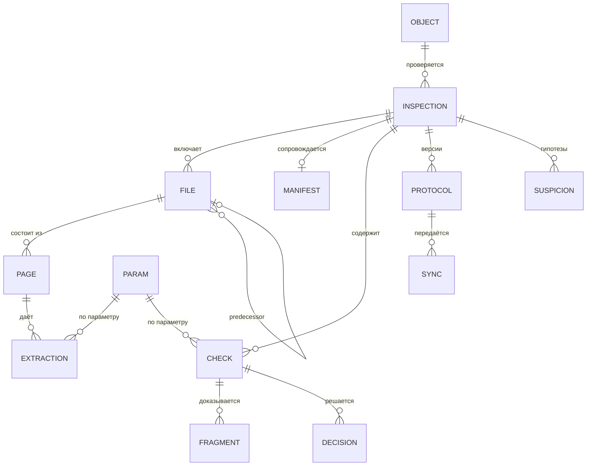

# Инспектор ИИ: информационная модель

Стадия 4 из 8, этаж 6 карты трассы. Истина — `model.yaml` → `data`; таблица ниже с ней сверена. Объекты выведены из сервисов: у каждого названа операция, в которой он
рождается (`new_in`), и операции, которые его читают (`used_by`). Имена таблиц — по ТЗ §10.

| Код | Объект | Таблица | Класс | Рождается в | Читают |
|---|---|---|---|---|---|
| DO-OBJECT | Объект капитального строительства | objects | new | BO-INSP-1.1 | BO-INSP-1.2, BO-INSP-3.1, BO-INSP-6.1, BO-INSP-8.1 |
| DO-INSPECTION | Проверка (process_id) | inspections | new | BO-INSP-1.1 | BO-INSP-1.2, BO-INSP-1.4, BO-INSP-3.3, BO-INSP-4.3, BO-INSP-4.4, BO-INSP-5.2, BO-INSP-8.1 |
| DO-FILE | Файл документа с метаданными реестра | files | new | BO-INSP-1.2 | BO-INSP-1.3, BO-INSP-2.1, BO-INSP-3.1 |
| DO-MANIFEST | Реестр файлов пакета | inspections.manifest_json | new | BO-INSP-1.2 | BO-INSP-1.3, BO-INSP-1.4 |
| DO-COMPLETENESS | Статус загрузки и сценарий | inspections.scenario | new | BO-INSP-1.4 | BO-INSP-3.3, BO-INSP-8.1 |
| DO-PAGE | Страница с текстом и словами (bbox) | files.pages_json | new | BO-INSP-2.1 | BO-INSP-2.2 |
| DO-EXTRACTION | Извлечённое значение параметра | extractions | new | BO-INSP-2.2 | BO-INSP-3.1, BO-INSP-3.2 |
| DO-PARAM | Параметр Матрицы (132) | params | predefined | — | BO-INSP-2.2, BO-INSP-3.1, BO-INSP-7.1 |
| DO-CHECK | Доказательная группа / finding | checks | new | BO-INSP-3.1 | BO-INSP-3.3, BO-INSP-4.1, BO-INSP-4.2, BO-INSP-4.3, BO-INSP-8.1 |
| DO-FRAGMENT | Доказательный фрагмент | evidence_fragments | new | BO-INSP-3.1 | BO-INSP-4.1, BO-INSP-4.2, BO-INSP-5.1, BO-INSP-6.1 |
| DO-REJECTION | Запись журнала отклонений (Rejection_Log) со статусом дообучения (T-234) | rejection_log | new | BO-INSP-4.1 | BO-INSP-6.1, BO-INSP-6.2 |
| DO-DISPUTE | Спорный случай (Dispute_Log) с исходом и автором закрытия (T-234) | dispute_log | new | BO-INSP-4.1 | BO-INSP-4.1, BO-INSP-6.2 |
| DO-RETRAIN-REPORT | Отчёт по дообучению за неделю | retraining_reports | new | BO-INSP-6.2 | — |
| DO-LEGAL-ACT | Нормативный правовой акт ТЗ §2 с редакцией | legal_acts | predefined | — | BO-INSP-7.2 |
| DO-SUSPICION | Гипотеза вне Матрицы | suspicions | new | BO-INSP-3.2 | BO-INSP-3.3 |
| DO-RULE | Логическое правило | logical_rules | predefined | — | BO-INSP-3.2, BO-INSP-7.3 |
| DO-NORM | Нормативный документ — единственный источник пределов и сроков (T-234) | normative_base | predefined | — | BO-INSP-3.1, BO-INSP-3.2, BO-INSP-7.2 |
| DO-PROTOCOL | Версия протокола | protocols | new | BO-INSP-3.3 | BO-INSP-4.3, BO-INSP-5.1, BO-INSP-5.2 |
| DO-DECISION | Решение инспектора | decisions | new | BO-INSP-4.1 | BO-INSP-4.3, BO-INSP-6.1, BO-INSP-6.2 |
| DO-SYNC | Задание передачи в ИАИС «РиН» | sync_jobs | new | BO-INSP-5.2 | — |
| DO-PRESCRIPTION | Предписание и история его статусов по данным ИАИС «РиН» | prescriptions, prescription_events | new | BO-INSP-5.4 | — |
| DO-RIN-PACKAGE | Пакет ИАИС «РиН», забранный автоматически (OS-INSP-1.2.15) | rin_packages | new | BO-INSP-1.2 | — |
| DO-SIGNATURE-CHECK | Результат проверки откреплённой подписи документа (OS-INSP-1.2.11) | files.signature_check_json | new | BO-INSP-1.2 | BO-INSP-2.3 |
| DO-DATASET | Версия GOLD-набора и её элементы | dataset_versions, dataset_items | new | BO-INSP-6.1 | BO-INSP-6.3, BO-INSP-6.4 |
| DO-MODEL | Версия модели | model_versions | new | BO-INSP-6.3 | BO-INSP-3.3 |
| DO-RETRAIN-LOG | Журнал дообучения (ML_Retraining_Log, ТЗ §10 п. 11) — представление над model_versions (ADR-0011) | ml_retraining_log (view) | new | BO-INSP-6.4 | BO-INSP-6.3 |
| DO-METRIC | Снимок метрики производительности (Monitoring_Metrics, ТЗ §10 п. 13) | monitoring_metrics | new | — (NFR-METRICS-STORE) | — |
| DO-BLOB | Объект хранилища — зашифрованный файл по SHA-256 (ADR-0006) | S3 `blobs/<sha256>` + кэш-том | new | BO-INSP-1.2 | BO-INSP-2.1, BO-INSP-5.1 |
| DO-PASSPORT | Паспорт параметра: источники, шкала, шаги алгоритма (T-129) | `data/seed/passports/*.json` | predefined | — | BO-INSP-3.1, BO-INSP-7.1 |
| DO-VERIFICATION | Результат автоматической верификации параметра (T-129) | param_verifications | new | BO-INSP-6.5 | BO-INSP-7.1, BO-INSP-5.1 |
| DO-MENTION | Упоминание значения параметра в документе с причиной отсева (T-129, OS-INSP-2.2.13) | extractions.meta_json | new | BO-INSP-2.2 | BO-INSP-3.1 |
| DO-AUDIT | Запись журнала аудита | audit_log | new | BO-INSP-1.1, BO-INSP-1.2, BO-INSP-4.1, BO-INSP-4.3, BO-INSP-4.4, BO-INSP-7.1 | BO-INSP-8.2 |

**Решение (ADR-0003, T-107).** Хранилище — PostgreSQL 18 во всех профилях: сервер в эксплуатации, PGlite
(тот же PostgreSQL в процессе) в разработке и тестах. Схема — версионированные миграции
`apps/api/src/db/migrations` с контрольной суммой; типы — timestamptz, boolean, json, identity; внешние ключи.
Шифрование в покое и бэкапы под RPO 15 мин — прод-контур (T-071, T-072).

**Поля ТЗ §10 (T-234).** Все 128 ключевых полей 16 таблиц ТЗ есть в схеме (миграция 0015 добавила недостающие) и
читаются процессом. Соответствие «поле ТЗ → колонка → где пишется → где читается → тест» —
[`docs/qa/t234/tz10-db-coverage.md`](../../qa/t234/tz10-db-coverage.md); ER-модель по полям —
[`docs/architecture/C4-и-модель-БД.md`](../../architecture/C4-и-модель-БД.md) §5. ML_Retraining_Log слит с Model_Versions
(ADR-0011): одна таблица, представление `ml_retraining_log` с полями ТЗ.
