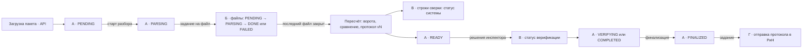
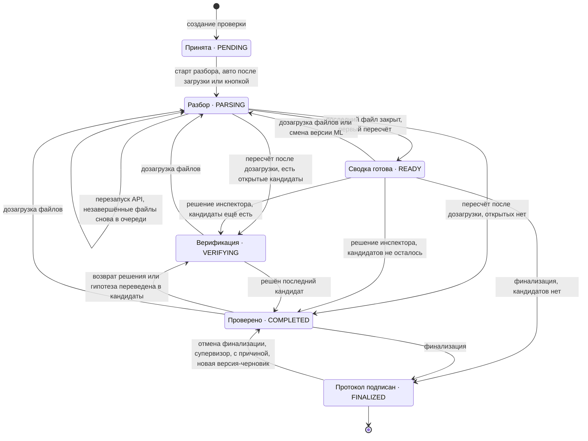
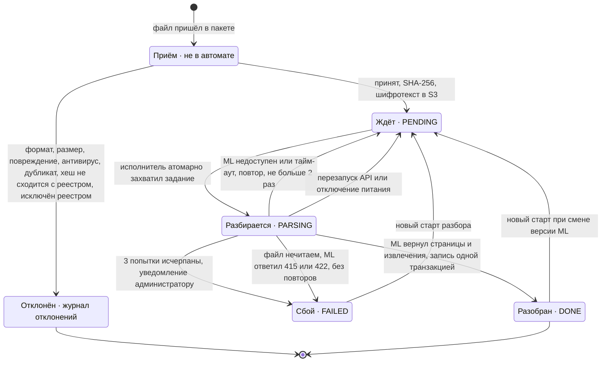
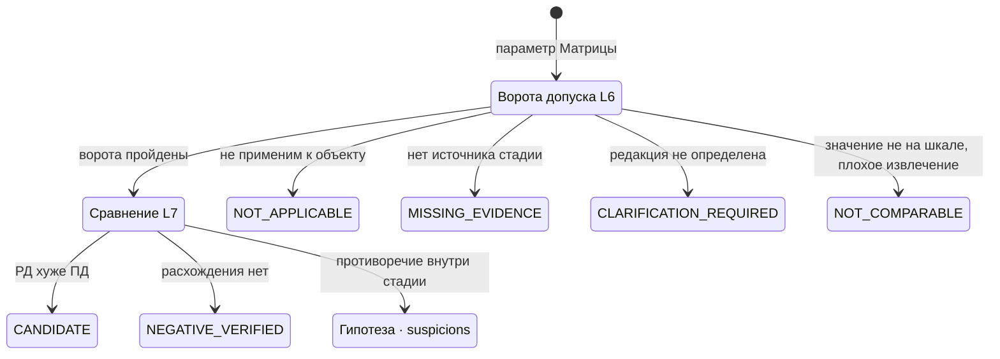
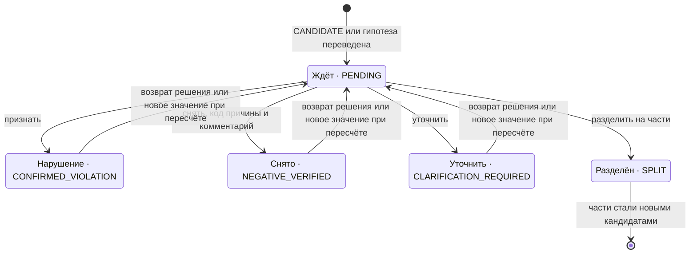
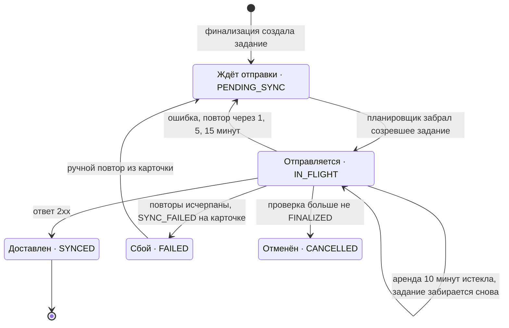
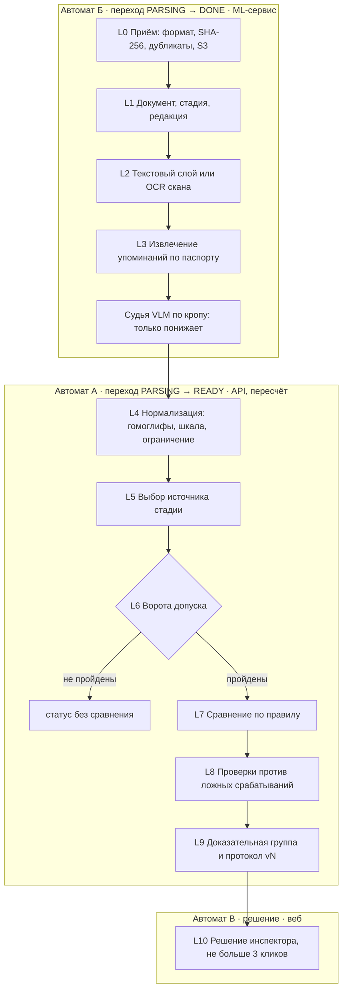

# Стейт-машина обработки пакета

Документ описывает, **как построено сейчас**: состояния и переходы сняты с кода, новых требований здесь нет.
Бизнес-смысл шагов описан на странице «Пайплайн» (`docs/gera/PIPELINE.html`), правила — в `03-services.md`.

## Коротко: да, это стейт-машина, и не одна

Процесс держат **четыре связанных автомата**. У каждого своё поле статуса в PostgreSQL, и каждый переход
выполняется одной транзакцией под блокировкой проверки.

| Автомат | Чей статус | Поле в БД | Состояния | Кто двигает |
|---|---|---|---|---|
| A. Проверка | пакет целиком (ТЗ 9.1) | `inspections.status` | PENDING, PARSING, READY, VERIFYING, COMPLETED, FINALIZED | API по событиям и решениям инспектора |
| Б. Файл | один документ пакета | `files.parse_status` | PENDING, PARSING, DONE, FAILED | очередь разбора и ML |
| В. Строка сверки | параметр × доказательная группа (ТЗ 9.2, 9.3) | `checks.finding_status` + `checks.verification_status` | система: CANDIDATE, NEGATIVE_VERIFIED, MISSING_EVIDENCE, NOT_APPLICABLE, NOT_COMPARABLE, CLARIFICATION_REQUIRED; инспектор: PENDING, CONFIRMED_VIOLATION, NEGATIVE_VERIFIED, CLARIFICATION_REQUIRED, SPLIT | пересчёт (система) и инспектор |
| Г. Отправка в «РиН» | подписанная версия протокола | `sync_jobs.status` | PENDING_SYNC, IN_FLIGHT, SYNCED, FAILED, CANCELLED | планировщик API |

Как они связаны: автомат А стоит в PARSING, пока хотя бы один файл автомата Б в PENDING или PARSING. Выход
из PARSING — это пересчёт, и пересчёт порождает строки автомата В. Переходы А между READY, VERIFYING и
COMPLETED считаются по открытым строкам В. Переход в FINALIZED создаёт задание автомата Г.

**Шаги паспорта L0–L10 автоматом не являются.** Это конвейер чистых функций: он выполняется внутри
перехода А: PARSING → READY и внутри перехода Б: PARSING → DONE. «Ворота» конвейера не хранят состояния,
а задают итоговый статус строки В.

## Общая картина: кто в каком автомате

## Автомат А. Проверка (пакет)

Сторожа переходов — чистые функции `domain/lifecycle.ts`:

- `canUpload` — дозагрузка разрешена в PENDING, READY, VERIFYING, COMPLETED; в PARSING и FINALIZED — 409.
- `canVerify` — решения по кандидатам принимаются только в READY и VERIFYING.
- `canFinalize` — не в PENDING и PARSING; нет открытых кандидатов; критические параметры без вердикта просмотрены
  инспектором (`CRITICAL_UNREVIEWED`).
- `canUnfinalize` — только супервизор или администратор, причина не короче 5 знаков.
- `statusAfterDecision` — есть открытый кандидат → VERIFYING, иначе COMPLETED.
- Возврат из PARSING: при первом прогоне — READY, при повторном — статус, из которого разбор стартовал
  (`resumeStatus`), пересчитанный по открытым кандидатам.

## Автомат Б. Файл

Файл появляется в БД только после приёма. Отклонённый на приёме файл в автомат не попадает: он записывается
в журнал отклонений с кодом причины.

- FAILED не блокирует проверку: пересчёт стартует, когда в пакете не осталось файлов в PENDING и PARSING.
  Параметры, для которых источником был только упавший файл, получат MISSING_EVIDENCE или NOT_COMPARABLE.
- Задание идемпотентно. Захват — `update … where parse_status in ('PENDING','FAILED') returning id`, поэтому
  дубль из брокера видит файл занятым и пропускается. Извлечения файла при повторе заменяются целиком.

## Автомат В. Строка сверки (параметр)

У строки два независимых статуса. **Система** ставит `finding_status` при пересчёте и никогда не ставит
CONFIRMED_VIOLATION. **Инспектор** ставит `verification_status`. Внутреннее противоречие одной стадии — это
отдельная сущность «гипотеза» (`suspicions`), а не строка сверки. Гипотеза становится строкой только по действию
инспектора.

**В1. Статус системы** — ставится при каждом пересчёте:

**В2. Решение инспектора** — открыто только у кандидата и у гипотезы, переведённой в кандидаты:

- Открытый кандидат — это строка с `CANDIDATE` и `PENDING`. От числа открытых кандидатов зависит переход
  автомата А.
- При пересчёте решение инспектора переносится на новую версию протокола, если значение и доказательная группа не
  изменились. Если изменились, решение сбрасывается в PENDING («снова на оценке»).
- SPLIT: кандидат делится на две или больше атомарных частей, каждая становится новым кандидатом в PENDING.

## Автомат Г. Отправка протокола в «РиН»

## Конвейер внутри переходов: паспорт параметра L0–L10

Шаги паспорта — общий алгоритм определения параметра. Они не хранят собственного состояния. Каждый шаг
пишет результат в поля автоматов Б и В.

## Таблица операций

Операции перечислены в порядке прохождения пакета. В столбце «Переход» указан автомат и его состояния.

| № | Операция | Переход | Кто или что запускает | Что происходит | Технологии | При сбое | Код |
|---|---|---|---|---|---|---|---|
| 1 | Создание проверки | А: → PENDING | инспектор, веб | карточка объекта и пустая проверка | React 19, Fastify (Node 24), PostgreSQL 18 | — | `services/inspections.ts` createInspection |
| 2 | Приём пакета | Б: → PENDING или журнал отклонений | инспектор или автозабор из «РиН» | архив читается потоком без распаковки на диск; тип по содержимому; SHA-256 по потоку; дубликаты по file_id и по хешу; сверка с реестром; части до 200 МБ; подписи .sig и .p7s проверяются отдельно | Fastify multipart, чтение ZIP потоком, node:crypto (SHA-256, CMS-подпись), ClamAV (clamd, INSTREAM) | файл отклонён с кодом причины, остальные принимаются; пакет больше лимита — 413 | `ingest`, `domain/upload.ts`, `services/archive-reader.ts`, `services/antivirus.ts` |
| 3 | Хранение | Б: внутри приёма | API | файл шифруется на клиенте и кладётся в бакет под ключом SHA-256; на томе остаётся кэш для ML; запись в БД — только после записи в хранилище | AES-256-GCM (node:crypto), Yandex Object Storage (S3 API), том api-blobs | хранилище недоступно — 503, в БД ничего | `services/blobstore.ts`, `domain/blob-crypto.ts`, ADR-0006 |
| 4 | Реестр пакета | Б: атрибуты файла | API, оператор | реестр берётся из пакета или выводится из папок и имён; выведенный реестр подтверждает оператор | JSON и XML реестра, эвристики имён | реестр не подтверждён — редакции не определены, итог CLARIFICATION_REQUIRED | `mergeFiles`, `guessStage`, `domain/revisions.ts` |
| 5 | Старт разбора | А: PENDING, READY, VERIFYING или COMPLETED → PARSING | авто после загрузки, кнопка «Запустить», автозабор «РиН» | под блокировкой проверки выбираются файлы PENDING и FAILED, а также DONE от прежней версии ML; на каждый файл ставится задание в очередь | PostgreSQL (select … for update), RabbitMQ (amqps, очередь inspector.parse) или очередь в процессе в dev | разбор уже идёт или протокол финализирован — 409 | `startProcessing` |
| 6 | Захват задания | Б: PENDING → PARSING | исполнитель очереди | задание берёт ровно один исполнитель; атомарный UPDATE … RETURNING; 2 файла параллельно | RabbitMQ, ack после обработки; INSPECTOR_PARSE_CONCURRENCY | дубль задания пропускается | `parseWork` |
| 7 | Разбор файла (L2) | Б: PARSING | ML-сервис, POST /analyze | вид страницы (вектор, скан, гибрид); текстовый слой с координатами слов; страница без слоя уходит в OCR с голосованием движков; склейка переносов | Python, FastAPI, pypdfium2 под PDFIUM_LOCK, python-docx, defusedxml; OCR: 3 прохода Tesseract на маке, PaddleOCR-VL, GLM-OCR, MinerU в профиле gpu | ML недоступен — ожидание готовности до 5 мин, затем повтор | `ml/inspector_ml/parse.py`, `pagekind.py`, `ocr_ensemble.py` |
| 8 | Вид документа и реквизиты | Б: PARSING | ML | вид документа внутри марки (спецификация, смета, чертёж…); печати, подписи, штампы, даты | эвристики заголовка и шапки таблицы; OpenCV (HSV-маска чернил, контуры) | реквизита нет — решает API по совокупности страниц | `doctype.py`, `requisites.py`, `titleblock.py` |
| 9 | Извлечение значений (L3) | Б: PARSING | ML | значения всех параметров Матрицы по якорям и шаблону; для параметров с паспортом — свой экстрактор (М-023: оборот и класс не дальше 160 знаков); каждое упоминание с листом, рамкой и цитатой; ловушки отсеиваются с причиной | регулярные шаблоны, семантические якоря (ONNX MiniLM), таблицы, паспорта `data/seed/passports` | упоминаний нет — у стадии нет значения | `extract.py`, `class_mentions.py`, `semantic.py`, `tables.py` |
| 10 | Судья VLM | Б: PARSING | ML | кроп листа вокруг упоминания; судья отсевает соседнее здание или норму и может понизить уверенность; повышать не может | Qwen3.5-9B: MLX на маке, vLLM на H100 в целевом профиле (T-063, пока не поднят) | сбой модели не ломает разбор: упоминание остаётся, в meta — «ошибка судьи» | `vlm_verify.py`, `vlm.py` |
| 11 | Запись результата разбора | Б: PARSING → DONE | API | извлечения, помещения, реквизиты и страницы файла заменяются целиком одной транзакцией | PostgreSQL 18 | ответ 415 или 422 — FAILED без повтора; 3 неудачи — FAILED и уведомление администратору | `parseOne`, `onDead` |
| 12 | Восстановление после сбоя | Б: PARSING → PENDING; А остаётся PARSING | старт API | застрявшие проверки дочищаются: незавершённые файлы снова в очереди, DONE не трогаются | RabbitMQ (возврат неподтверждённых), идемпотентный захват | — | `recoverParsing` |
| 13 | Завершение разбора | А: PARSING → пересчёт | последний закрытый файл | ровно один пересчёт на проверку, флаг `finishing`; до пересчёта — дифф листов пар редакций | Node, ML POST /diff | — | `maybeFinishParsing`, `autoSheetDiff` |
| 14 | Пересчёт: редакции и комплектность (L1) | А: PARSING | API | сквозные страницы частей; роль редакции (CURRENT, SUPERSEDED, CONFLICT); комплектность; только затронутые параметры, при смене правил — все | чистые функции `domain/*`, PostgreSQL | редакция не определена — CLARIFICATION_REQUIRED | `recompute`, `domain/revisions.ts`, `domain/completeness.ts` |
| 15 | Нормализация и выбор источника (L4–L5) | В: подготовка | API | гомоглифы, шкалы классов, числа и единицы; источник стадии выбирается по приоритету разделов; смета и опросный лист не считаются источником | `domain/cipher.ts`, `domain/class-param.ts`, `domain/quantity-param.ts` | ни одно упоминание не на шкале — NOT_COMPARABLE | `domain/*` |
| 16 | Ворота допуска (L6) | В: → NOT_APPLICABLE, MISSING_EVIDENCE, CLARIFICATION_REQUIRED, NOT_COMPARABLE | API | ворота проверяются по порядку: применимость, комплектность, актуальность, сопоставимость, качество извлечения; первые непройденные задают статус | `domain/compare.ts` | — | `domain/compare.ts` |
| 17 | Сравнение (L7–L8) | В: → CANDIDATE или NEGATIVE_VERIFIED; гипотеза | API | правило сравнения параметра (шкала, дельта %, «не ниже», совпадение); противоречие внутри стадии оформляется гипотезой; у результата обязаны быть фрагменты ПД и РД | `domain/compare.ts`, `domain/suspicions.ts` | нет двусторонних доказательств — NOT_COMPARABLE | `domain/compare.ts` |
| 18 | Протокол vN и уведомление | А: PARSING → READY, VERIFYING или COMPLETED | API | версия протокола +1, снимок DRAFT, перенос решений инспектора, уведомление; после фиксации — нормы к гипотезам и LLM-советник | PostgreSQL (снимок protocols), ML /advise, /norms/search | откат пересчёта оставляет статус возврата для повтора | `recompute`, `snapshotProtocol`, `services/advisor.ts` |
| 19 | Решение инспектора (L10) | В: PENDING → CONFIRMED_VIOLATION, NEGATIVE_VERIFIED, CLARIFICATION_REQUIRED; А: READY → VERIFYING или COMPLETED | инспектор, веб | лист PDF с рамкой, цитата, основание; не больше 3 кликов; снятие — с кодом причины и комментарием | React 19, pdf.js (рендер листа), Fastify, OpenAPI-валидация | финализирован — 409; решение возвращается клавишей Z | `decide`, `domain/lifecycle.ts` applyDecision |
| 20 | Разделение кандидата | В: → SPLIT и новые кандидаты | инспектор | составной кандидат делится на атомарные части, у каждой свои доказательства | Fastify, PostgreSQL | меньше двух частей или часть без доказательств — 400 | `splitCandidate` |
| 21 | Гипотеза → кандидат | В: гипотеза → CANDIDATE; А: COMPLETED → VERIFYING | инспектор | внутреннее противоречие становится кандидатом с опорным листом | Fastify, PostgreSQL | финализирован — 409 | `services/advisor.ts` promoteSuspicion |
| 22 | Возврат решения | В: → PENDING; А: COMPLETED → VERIFYING | инспектор | решение по строке снова открыто | Fastify | — | `services/reopen.ts` |
| 23 | Финализация | А: READY или COMPLETED → FINALIZED; Г: → PENDING_SYNC | инспектор | проверка открытых кандидатов и критических точек; снимок FINALIZED становится неизменяемым (триггер БД); ставится задание отправки | PostgreSQL (триггер неизменяемости), окно отмены 10 с в вебе | открытые кандидаты или критические без просмотра — 409 | `finalize`, `canFinalize` |
| 24 | Отмена финализации | А: FINALIZED → COMPLETED | супервизор или администратор | новая версия-черновик; подписанная версия остаётся в истории | Fastify, аудит | нет роли — 403; нет причины — 409 | `unfinalize` |
| 25 | Отправка в «РиН» | Г: PENDING_SYNC → IN_FLIGHT → SYNCED | планировщик API | задания забираются атомарно (skip locked), 4 одновременно; доставка «хотя бы раз» | HTTPS с mTLS, подпись запроса; ГОСТ-шлюз СКЗИ — ещё нет (T-068) | повторы через 1, 5, 15 мин, затем FAILED и ручной повтор | `services/rin.ts`, `services/request-signer.ts` |
| 26 | Выход и автоверификация | вне автоматов, по FINALIZED или по запросу | ML-инженер, API | протокол в JSON, XML, PDF, DOCX; независимый пересчёт оракулом (свой читатель текста, общий только паспорт); выходной набор с описью SHA-256 | ML POST /render/{fmt}, `services/export.ts` | расхождение — набор помечается «не проверено» с названием поля | `services/export.ts`, `ml/eval/verify_class_param.py` |

## Технологии по слоям

| Слой | Технологии | Где работает |
|---|---|---|
| Интерфейс инспектора | React 19, Vite, nginx (unprivileged), TLS 1.3 | веб-контейнер |
| API и правила | Node 24, Fastify, OpenAPI; предметные правила — чистые функции `apps/api/src/domain` | API-контейнер |
| Данные | PostgreSQL 18: проверки, файлы, извлечения, строки сверки, протоколы, аудит; PGlite в разработке | контейнер БД |
| Файлы | Yandex Object Storage (бакет nadzorium), AES-256-GCM на клиенте, ключ объекта — SHA-256; кэш-том | Москва |
| Очередь | RabbitMQ (amqps) в стенде и на сервере; очередь в процессе в разработке | контейнер очереди |
| Антивирус | ClamAV (clamd INSTREAM) | сервер с GPU; на маке нет |
| Разбор и извлечение | Python, FastAPI, pypdfium2, python-docx, defusedxml, OpenCV, Tesseract; ONNX MiniLM для якорей | ML-контейнер |
| Модели | Qwen3.5-9B (судья VLM), GLM-OCR и PaddleOCR-VL (читатели сканов): MLX на маке, vLLM на H100 в целевом профиле (не поднят, T-063) | мак; цель — H100 |
| Интеграция | ИАИС «РиН»: HTTPS с mTLS и подписью; автозабор пакетов | внешняя сторона |
| Наблюдаемость | Prometheus, Grafana, Alertmanager, ELK | сервер с GPU |

## Где это видно в интерфейсе и на демо-стенде

- Статус автомата А показан на дашборде цветом объекта и в карточке проверки. Клиент API читает его по
  `process_id` (pull-модель).
- Статус автомата Б — на вкладке файлов и в отчёте о целостности. Автомат В — в сводке сверки и на экране
  сравнения. Автомат Г — в поле `sync_status` карточки.
- **На демо-стенде «Надзориум» переходов нет.** API работает в режиме `INSPECTOR_READONLY=1`: любой изменяющий
  запрос получает 403. Все состояния на стенде посчитаны на MacBook и опубликованы дампом (T-131).
