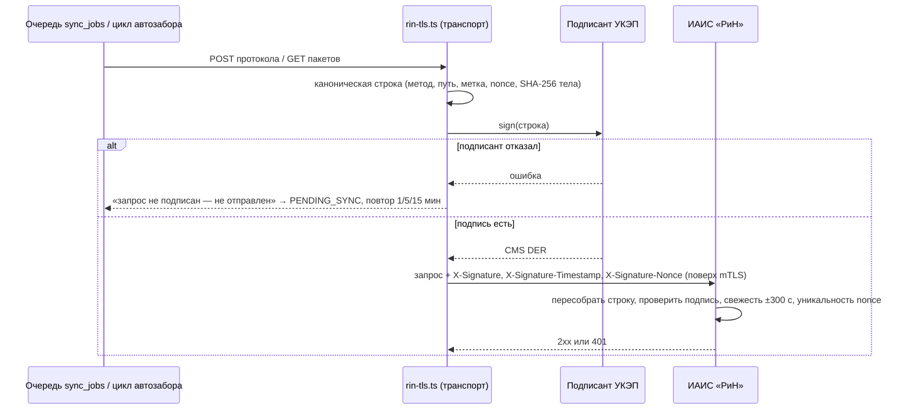

# Подпись УКЭП запросов к ИАИС «РиН»

ТЗ 12.10: «Все запросы к внешним системам подписываются УКЭП». Внешняя информационная система для «Инспектора ИИ» одна,
это ИАИС «РиН». ML, S3 и RabbitMQ относятся к инфраструктуре контура, внешними ИС не считаются (допущение плана T-137, §4).

Подпись дополняет mTLS (NFR-MTLS, `services/rin-tls.ts`) и не заменяет его. mTLS аутентифицирует канал. Подпись
закрепляет авторство и целостность каждого запроса, и её можно проверить после разрыва соединения.

## Что подписывается

Каноническая строка запроса в UTF-8. Пять полей соединены символом `\n` (0x0A), в конце перевода строки нет:

```
METHOD
path?query
timestamp
nonce
sha256hex(body)
```

| Поле | Правило |
|---|---|
| `METHOD` | метод HTTP заглавными: `POST`, `GET` |
| `path?query` | как в строке запроса HTTP: путь и `?query` без схемы, хоста и фрагмента, без перекодирования; пустой путь — `/` |
| `timestamp` | целые секунды unix (UTC) — то же значение, что в `X-Signature-Timestamp` |
| `nonce` | 128 случайных бит, 32 символа нижнего hex — то же значение, что в `X-Signature-Nonce` |
| `sha256hex(body)` | SHA-256 ровно тех байтов тела, что ушли в сеть, 64 символа нижнего hex; у GET тело пустое (`e3b0c442…b855`) |

Код находится в `apps/api/src/domain/request-signing.ts` (`canonicalRequest`). Строка с переводом строки в пути,
с не-hex хешем или с чужим форматом nonce не собирается: неоднозначное не подписывается.

## Заголовки запроса

| Заголовок | Значение |
|---|---|
| `X-Signature` | base64 DER откреплённой CMS SignedData (RFC 5652) над канонической строкой |
| `X-Signature-Timestamp` | `timestamp` из канонической строки |
| `X-Signature-Nonce` | `nonce` из канонической строки |

Состав CMS:

- `eContent` отсутствует, подпись откреплённая;
- подписываемые атрибуты: `contentType` (id-data), `messageDigest` и `signingTime`;
- сертификат подписанта включён в `certificates`, при наличии добавляется и цепочка.



## Где подписывается

Все запросы к «РиН» идут через `apps/api/src/services/rin-tls.ts`. Внутри него каждый путь отправки в режимах `off`,
`gost-proxy` и `direct`, для POST и для GET, вызывает одну функцию `signedHeaders`. Сейчас таких запросов два:

- отправка протокола, `services/rin.ts` → `rinTransportFromEnv`;
- автозабор пакетов, `services/rin-pull.ts` → `rinGetTransportFromEnv`.

Статусы предписаний сюда не входят: это входящие сообщения от «РиН» (`services/prescriptions.ts`), исходящего запроса у них нет.

Обойти подпись новым вызовом не даёт архитектурный тест в `apps/api/tests/ukep-signing.test.ts`:

- `fetch`, `http(s).request`/`get` и `undici` в `apps/api/src` разрешены только модулям из белого списка
  (`rin-tls.ts`, ML: `ml-client.ts`, `norms.ts`, `export.ts`; S3: `blobstore.ts`; CLI-клиент API: `cli/load-package.ts`);
- `rinTransport`/`rinGetTransport` вне `rin-tls.ts` не вызываются, только функции `*FromEnv`, которые берут подписанта из окружения.

**Отказ подписанта.** Если СКЗИ недоступно, истёк таймаут или программа вернула ошибку, запрос не отправляется. Отправка
протокола остаётся в `PENDING_SYNC` и повторяется через 1, 5 и 15 минут, после третьей неудачи получает `SYNC_FAILED`
(OS-INSP-5.2.2). Цикл автозабора завершается с ошибкой и повторяет попытку в следующий раз.

## Провайдеры подписи (`services/request-signer.ts`)

| `INSPECTOR_UKEP_MODE` | Как подписывает | Где применять |
|---|---|---|
| `off` | не подписывает | dev и заглушка «РиН» (`INSPECTOR_RIN_MOCK=1`); по умолчанию |
| `pem` | RSA (PKCS#1 v1.5, SHA-256) или ECDSA P-256 средствами node:crypto, CMS собирает pkijs | стенд и тесты; **не УКЭП** |
| `openssl-gost` | `openssl cms -sign -binary -outform DER -md md_gost12_256 -engine gost` (или `-provider <имя> -provider default`), данные подаются в stdin, DER возвращается из stdout | ГОСТ Р 34.10-2012 через gost-engine |
| `cryptopro` | `cryptcp -sign -detached -der -thumbprint <T> <вход> <выход>`, временный каталог 0700 удаляется в `finally` | КриптоПро CSP, эксплуатация |

Переменные окружения:

- `pem`: `INSPECTOR_UKEP_CERT_FILE`, `INSPECTOR_UKEP_KEY_FILE`, `INSPECTOR_UKEP_CHAIN_FILE` (необязательна);
- `openssl-gost`: `INSPECTOR_UKEP_CERT_FILE`, `INSPECTOR_UKEP_KEY_FILE`, `INSPECTOR_UKEP_OPENSSL_BIN` (по умолчанию `openssl`),
  `INSPECTOR_UKEP_GOST` = `engine` | `provider` (по умолчанию `engine`), `INSPECTOR_UKEP_GOST_NAME` (по умолчанию `gost` / `gostprov`);
- `cryptopro`: `INSPECTOR_UKEP_THUMBPRINT` (40 hex, SHA-1 сертификата в хранилище КриптоПро),
  `INSPECTOR_UKEP_CRYPTCP_BIN` (по умолчанию `/opt/cprocsp/bin/amd64/cryptcp`).

Ключи и сертификаты задаются только путями к файлам (`*_FILE`), значения в окружении не принимаются. Если файла нет,
API не стартует. Текст ошибок внешних программ проходит через маску: пути (в том числе путь к ключу) заменяются на
`<путь>` или `<скрыто>`.

**Проверки при старте (fail-closed, `config.ts`).** В профиле `gpu` с настоящей «РиН» (`INSPECTOR_RIN_MOCK=0`) режим
`off` запрещён, режим `pem` тоже: RSA и ECDSA не являются УКЭП. API в этом случае не стартует и называет переменную
в сообщении. Допустимые режимы: `openssl-gost` и `cryptopro`.

## Что обязана проверять «РиН»

Это требование к стороне «РиН», его нужно согласовать при интеграции (T-067, T-068). Тестовый сервер «РиН»
в `ukep-signing.test.ts` (`verifyAtRin`) выполняет эти проверки на каждом запросе:

1. **Три заголовка на месте**: `X-Signature` содержит base64 DER, `X-Signature-Nonce` состоит ровно из 32 hex, `X-Signature-Timestamp` — целое число.
2. **Строка пересобирается на своей стороне** из фактических метода, пути с запросом и байтов тела. Значениям,
   присланным клиентом, получатель не доверяет. Подменённое тело или путь дают неверную подпись.
3. **Подпись верна**: `messageDigest` совпадает с SHA-256 строки, подпись над атрибутами верна. Цепочка сертификата подписанта
   доходит до аккредитованного УЦ, сертификат действовал в момент `signingTime`, при необходимости отзыв проверяется по CRL/OCSP.
   Сертификат подписанта сопоставлен с учётной записью «Инспектора ИИ».
4. **Свежесть**: |время получателя − `timestamp`| ≤ 300 с включительно. Граница ровно в 300 с принимается, 300 с + 1 мс отклоняется
   (`checkFreshness`).
5. **Уникальность nonce**: nonce, уже принятый в пределах окна свежести, отклоняется как повтор. Хранить nonce нужно
   не меньше 600 с (окно ±300 с).
6. Любой отказ даёт ответ 401 без побочных эффектов. На стороне «Инспектора» 401 приводит к повтору по очереди.

## Настройка на стенде

- **Стенд без настоящей «РиН»** (заглушка): режим `off` по умолчанию. Чтобы проверить контур подписи, задать
  `INSPECTOR_UKEP_MODE=pem` с RSA/ECDSA-сертификатом из тестовой PKI.
- **ГОСТ без КриптоПро**: `INSPECTOR_UKEP_MODE=openssl-gost` и OpenSSL с gost-engine, ключ ГОСТ Р 34.10-2012 в PEM.
  В тестах используется образ `seshhekotikhin/openssl-gost@sha256:6b20b178…17e8` (OpenSSL 3.5.1 + gost-engine, amd64/arm64,
  около 2,3 ГБ). Тест подписывает через обёртку `docker run … openssl` и проверяет результат `openssl cms -verify -engine gost`.
  Если образ не загружен, тест пропускается и указывает причину.
- **Эксплуатация**: `INSPECTOR_UKEP_MODE=cryptopro` и `INSPECTOR_UKEP_THUMBPRINT` сертификата УКЭП в хранилище
  КриптоПро CSP на хосте API. Нужна лицензия СКЗИ от владельца (T-068).

## Ограничения

- `pem` подписывает RSA только с PKCS#1 v1.5: RSA-PSS не поддерживает собственная проверка `services/signature.ts`,
  и круг «подписал → проверил» замыкался бы только снаружи.
- Своя проверка ГОСТ-подписи (`services/signature.ts`) без СКЗИ возвращает UNVERIFIED (OS-INSP-1.2.13). Математику ГОСТ
  проверяет OpenSSL с gost-engine в тесте, а в эксплуатации её проверяет «РиН».
- Боевой `cryptcp` не запускался: лицензии СКЗИ нет. Аргументы, временные файлы и отказы проверены поддельным бинарником.
