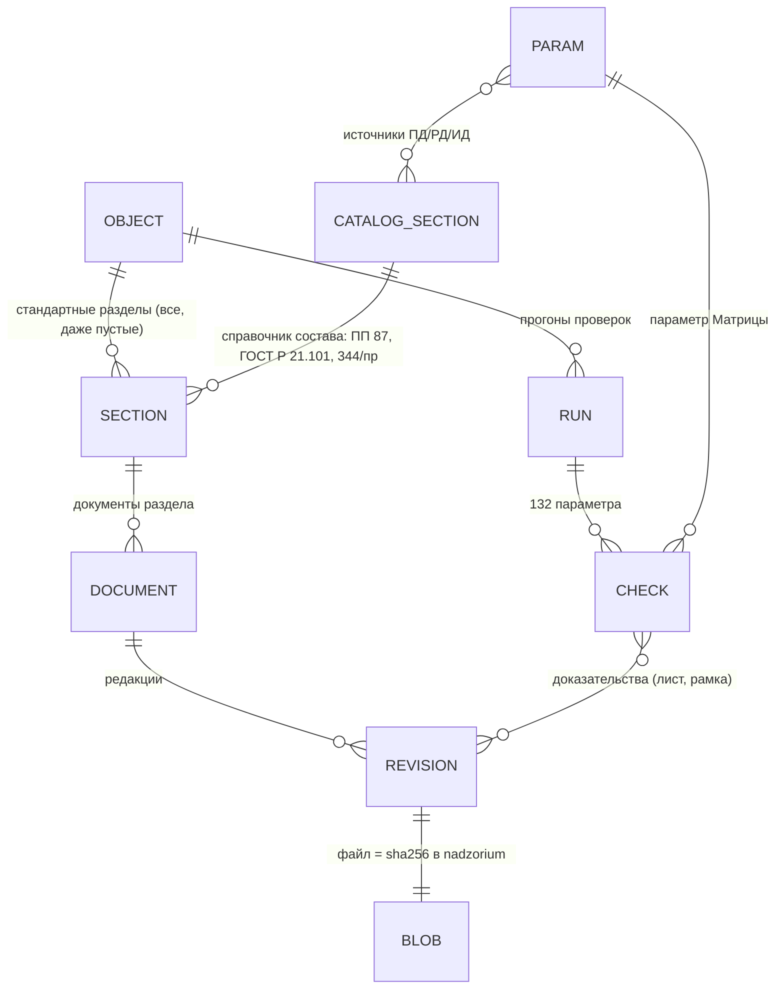

# План перехода к «Объектам» и эталонной базе

## 0. К чему идём (что увидит владелец)

1. **Слева в меню — «Объекты»** вместо «Проверок». Список объектов: название, адрес, состояние комплекта,
   сколько разделов заполнено, сколько параметров проверено, сколько находок.
2. **Страница объекта — стандартная**, одинаковая для всех: шапка (реквизиты, шифр договора, профиль —
   подземная часть, газ, снос) и **все разделы состава документации**, даже пустые:
   - ПД — 13 разделов по ПП РФ № 87 (ТЗ §3) + ПОД и ЗУ из §6 ТЗ;
   - РД — комплекты марок по ГОСТ Р 21.101 (ГП, АР, КР/КЖ/КМ, ОВ, ВК, ЭОМ, СС, ТХ …);
   - ИД — 13 видов по Приказу Минстроя № 344/пр (ТЗ §5).
   Пустой раздел показан как пустой («не представлен»), заполненный — со списком документов, редакциями, листами.
3. **Два режима внутри объекта:**
   - «Документы» — разделы и файлы, просмотр листов (как вкладка «Документы» сейчас, но по разделам);
   - «Проверки» — таблица 132 параметров Матрицы (сейчас это вкладка «Сводка сверки» и страница «Матрица»):
     у каждого параметра видно, **какие его источники есть в объекте**, запускалась ли проверка и чем кончилась.
     Проверка параметра запускается, только если в объекте есть хотя бы две стадии-источника; иначе —
     «сравнить не с чем, нет раздела X» (как М-001 сейчас).
4. **Эталонная база:** все исходные материалы корпуса лежат в бакете `nadzorium` один раз (по SHA-256), выверены
   (дубли, противоречия, битые файлы — в отчёте), разложены по объектам и разделам; любой объект можно
   перепроверить с нуля, данные не теряются и не дублируются.
5. **Доказано на нескольких объектах:** М-001…М-005 и М-023 (и далее — все реализованные параметры) проходят на
   3 объектах разной формы с независимым пересчётом (как `verification-*.json` в T-132) и на эталоне
   организатора (TRAIN, Тюменская 5 — 10 проверок с золотой разметкой).

## 1. Что есть сейчас (AS-IS)

### Данные — `yandex:Загрузки/Хакатон`, 144,4 ГиБ, 51 объект хранения

| Что | Объём | Содержимое (по описям `_ОПИСИ`, 26.09) |
|---|---|---|
| `01_ПАКЕТ_УЧАСТНИКАМ_3_ОБЪЕКТА.tar` | 8,3 ГБ | Новослободская (TRAIN), Тюменская 5 (TRAIN, 10 проверок — золото), Речников 7/7 (TEST_HIDDEN) |
| `02_ЭТАЛОННАЯ_РАЗМЕТКА_И_МЕТОДИКА.tar` | 0,5 ГБ | схема ответа, баллы, разметка 9 объектов, OCR-пилот 300 стр. |
| `10…18_*.tar` | 60 ГБ | 9 доп. объектов без разметки: СОШ, Полярная 16, ДОО, УНДМС, Алтуфьевское 79Б, Полярная 17, Лосевская 3А, Изумрудная 12, Октябрьская 103 |
| `РАЗМЕЧЕННЫЙ_*.zip` | 11,6 ГБ | копии PDF с наложенной разметкой (для OCR брать исходники из 01) |
| `_ZIP_ДУБЛИ/` | остаток | дубли архивов |

Итого по описям: **12 объектов, 9 345 файлов, 66 ГБ, 180 104 PDF-страниц, из них 75 525 (42 %) — сканы**;
DWG 29 (+1 349 во вложенных архивах), вложенных архивов 93, **групп точных дублей 1 014 (1 437 лишних копий)**.
Сквозная тройка ПД+РД+ИД есть не у всех: у Тюменской 5 нет РД и ИД, у Алтуфьево нет ИД, у Лосевской ИД — один скан.
Описи уже содержат SHA-256 каждого файла.

### Первая выверка по описям (E1/E3, 27.09 — без скачивания архивов)

Всего в описях **10 037 файлов, 83,7 ГБ**; уникальных по SHA-256 — **8 456 (79,1 ГБ)**; **уникальных исходников без
«размеченных» копий организатора — 8 024 файла, 66,9 ГБ** — это объём эталонной базы в бакете.

| Архив | Файлов | Уникальных | Дубли внутри | Общие с другими архивами | ПД | РД | ИД | Без стадии | Влож. архивы | ГБ |
|---|---|---|---|---|---|---|---|---|---|---|
| 01 пакет участникам (3 объекта) | 437 | 437 | 0 | 20 | 172 | 97 | 136 | 32 | 39 | 8,7 |
| 02 эталонная разметка | 237 | 225 | 12 | 20 | 0 | 0 | 1 | 236 | 5 | 0,5 |
| 10 Полярная 25, СОШ 1100 | 3 774 | 3 470 | 304 | 110 | 178 | 103 | 3 493 | 0 | 8 | 20,9 |
| 11 Полярная 16 | 293 | 228 | 65 | 0 | 35 | 238 | 20 | 0 | 0 | 10,3 |
| 12 Полярная 25, ДОО 220 | 1 770 | 846 | **924** | 110 | 95 | 886 | 789 | 0 | 11 | 6,0 |
| 13 УНДМС | 2 472 | 2 359 | 113 | 0 | 792 | 117 | 1 562 | 1 | 30 | 16,1 |
| 14 Алтуфьевское 79Б | 78 | 59 | 19 | 0 | 68 | 10 | 0 | 0 | 0 | 0,8 |
| 15 Полярная 17 | 142 | 141 | 1 | 0 | 65 | 51 | 26 | 0 | 0 | 3,1 |
| 16 Лосевская 3А | 152 | 152 | 0 | 0 | 47 | 104 | 1 | 0 | 0 | 2,6 |
| 17 Изумрудная 12 | 72 | 72 | 0 | 0 | 54 | 9 | 9 | 0 | 0 | 1,4 |
| 18 Октябрьская 103 | 176 | 165 | 11 | 0 | 26 | 13 | 137 | 0 | 6 | 1,1 |
| Размеченные TEST_HIDDEN / TRAIN | 434 | 434 | 0 | 2 | — | — | — | 434 | 0 | 12,1 |

Что видно сразу: ДОО 220 на половину состоит из копий (924 из 1 770); СОШ и ДОО делят 110 файлов — один комплекс
«Полярная 25» (общие ГПЗУ, изыскания): это **один объект с двумя корпусами или два объекта с общими документами** —
решение для модели. Стадия по папкам определяется почти для всего, кроме материалов организатора (у них своя
разметка). Вложенных архивов 99 — их содержимое в описях не раскрыто, это работа E2. Реестр с путями — в
`var/corpus-registry/` (вне git, ADR-0002), в репозитории — только эта статистика.

### Хранилище — бакет `nadzorium` (ADR-0004, ADR-0006)
- API пишет файлы в бакет под ключом `blobs/<sha256>`, **шифр AES-256-GCM на клиенте**, ключ вне git. Ключ по
  содержимому = **дубль физически не повторяется**: второй такой же файл — тот же объект.
- Сервисный аккаунт `nadzorium-s3` — `storage.uploader` (удалять не может). Заливка — только `translog enqueue`.
- С мака в бакет — мимо VPN, ~35 МБ/с (`scripts/egress-direct.py`).

### Код, на который опираемся
| Нужное | Уже есть | Где |
|---|---|---|
| Приём архива потоком, безопасные пути, пределы, дубли по SHA-256 | ✅ | `domain/archive.ts` (`dedupeBySha`, `safeEntryPath`, `checkLimits`), `cli/load-package.ts` |
| Стадия по папке, шифр/раздел/редакция по имени | ✅ (3 формы шифра, T-132 добавил цифровую) | `archive.ts::stageFromPath`, `domain/cipher.ts::parseDocName` |
| Вид документа внутри марки (чертёж, ОД, спецификация, АОСР…) | ✅ | `domain/doctype.ts`, ML `doctype.py` |
| Комплектность и сценарий (FULL / PD_RD_ONLY / …) | ✅ по стадиям | `domain/completeness.ts` |
| Редакции (актуальная, заменённая, спорная) | ✅ | `domain/revisions.ts` |
| Объект в базе | 🟡 только запись `objects` (реквизиты, профиль); документы привязаны к **проверке**, не к объекту | миграция 0001 |
| Разделы состава ПД/РД/ИД как справочник | 🟡 разделы Матрицы и §3/§6 ТЗ есть в данных, как **структуры объекта** — нет | `matrix.json`, `00-run-notes` GAP-INSP-08 |
| 132 проверки | ✅ пересчёт по пакету проверки; паспорта у М-001…М-005, М-023 | `services/inspections.ts`, `data/seed/passports` |
| Интерфейс «Объекты» | ❌ | меню: Проверки, Загрузка, Матрица, Нормы |

### Ограничения
- **Правовой режим.** ADR-0002 запрещает класть `corpus-ABC` куда-либо, кроме чтения потоком. Для набора
  «Хакатон» (данные организатора и доп. объекты 10–18) режим **не записан**; «Алтуфьево» уже на публичном демо.
- **Мак:** свободно ~46 ГБ диска, 24 ГБ памяти, мутации и OCR — только под `heavy.sh`, не больше 2 потоков
  (CPU ≤ 90 °C). **OCR всех 75 525 сканов на маке — порядка двух суток непрерывно** (по «Алтуфьево»: 646 сканов
  ≈ 25 мин) — только очередью ночью или на GPU-стенде.
- Разбор PDF текстового слоя — быстрый (7 PDF ≈ 21 с), его можно делать для всего корпуса.

## 2. Целевая модель (TO-BE)



- **Справочник состава (`CATALOG_SECTION`)** — данные, не код: стадия, код (ПЗ, СПЗУ/ПЗУ, АР, КР, ИОС1…5, ТХ, ПОС,
  ПОД, ООС, ППМ/ПБ, БЭ/ТБЭО, ОДИ, ЗУ/ЭЭ, СМ, ИН; марки РД; 13 видов ИД), синонимы из имён файлов корпуса
  (СПОЗУ = ПЗУ, ОПЗ = ПЗ, ТБЭО = БЭ…), обязательность (для бюджетного объекта — ТХ, ОДИ, ИОС, ППМ, GAP-INSP-10).
- **Объект владеет документами**, проверка — это **прогон** 132 параметров над текущим составом объекта (версия
  состава фиксируется в прогоне). Сегодняшняя «проверка = пакет» становится частным случаем: загрузка пакета
  добавляет документы в разделы объекта и запускает прогон.
- **Источники параметра ↔ разделы:** у каждого из 132 параметров источники ПД/РД/ИД Матрицы размечены кодами
  справочника (частично уже: `paramMarks` T-133, паспорта). Отсюда в режиме «Проверки» видно: «М-001 — ПД: ПЗУ ✅,
  РД: ГП — раздел пуст, ИД: техплан — пуст → сравнить не с чем».

## 3. Конвейер загрузки корпуса в эталонную базу

```mermaid
flowchart LR
    A[E0 Решение о режиме<br/>ADR-0007] --> B[E1 Инвентаризация<br/>описи + SHA-256 + MD5]
    B --> C[E2 Распаковка вложенных<br/>zip/rar/7z потоком, по объекту]
    C --> D[E3 Выверка<br/>дубли, редакции, битые, противоречия]
    D --> E[E4 Классификация<br/>объект → стадия → раздел → документ]
    E --> F[E5 Заливка в nadzorium<br/>blobs/sha256 через translog]
    F --> G[E6 Регистрация в базе<br/>объект, разделы, документы]
    G --> H[E7 Разбор<br/>текстовый слой сразу, OCR очередью]
    H --> I[E8 Прогон 132 параметров<br/>по фактическому составу]
    I --> J[E9 Подтверждение<br/>оракулы + золото организатора]
```



| Этап | Что делается | Результат, по которому этап считается сделанным | Тяжесть |
|---|---|---|---|
| **E0** | Решение владельца о режиме набора «Хакатон» (ADR-0007): что можно в бакет, что на демо, срок хранения, ПДн | ADR-0007 принят | — |
| **E1** | По описям `_ОПИСИ/*.jsonl` (SHA-256 уже есть) — единый реестр корпуса; MD5 — только для сверки с Яндекс.Диском (его ETag), ключом остаётся SHA-256 | `corpus-registry.jsonl`: файл, архив, путь, размер, SHA-256, MD5, страниц, сканов | лёгкий |
| **E2** | Вложенные архивы (93) и DWG — распаковка потоком по одному объекту в `var/corpus-tmp/<объект>`, после заливки — удаление локальной копии (в КОРЗИНУ по правилу №1) | реестр дополнен содержимым вложенных архивов | диск: по объекту, ≤ 20 ГБ за раз |
| **E3** | Выверка: точные дубли (1 014 групп) → одна копия + ссылки; одинаковое имя, разный хеш → кандидат в редакции; шифр в имени ≠ папка стадии; битые PDF (нет страниц, ошибка разбора); DWG без PDF-дубля; разметка организатора (`РАЗМЕЧЕННЫЙ_*`) — не исходник, отдельно | `corpus-validation.md`: по каждому объекту — счётчики и список спорного на решение | лёгкий |
| **E4** | Классификация: объект (папка верхнего уровня) → стадия (папка/шифр) → раздел (марка шифра + вид документа `doctype`) по справочнику; нераспознанное → «Прочее» с причиной | у каждого файла раздел или «не определён»; доля «не определён» ≤ 5 % на объекте | лёгкий (текстовый слой) |
| **E5** | Заливка уникальных файлов в `nadzorium` под `blobs/<sha256>` (шифр на клиенте) **через `translog enqueue`**, по объекту; сверка: число объектов в бакете = числу уникальных SHA | реестр переносов закрыт, `rclone check`-сверка | 8 024 файла, 66,9 ГБ ≈ 32 мин при 35 МБ/с (плюс 99 вложенных архивов); очередью по объекту |
| **E6** | Регистрация: объект, разделы (все из справочника), документы и редакции — **без повторной загрузки** (API берёт blob по SHA из бакета) | страница объекта в интерфейсе с разделами | лёгкий |
| **E7** | Разбор: текстовый слой — сразу для всех; OCR сканов — очередью `heavy.sh` ночью по объекту, приоритет — разделы-источники реализованных параметров | кэш разбора по SHA; доля разобранных страниц на объекте | **тяжёлый** (сканы) |
| **E8** | Прогон 132 параметров по фактическому составу объекта: параметр, у которого нет двух стадий-источников, не «падает», а даёт «сравнить не с чем, нет раздела X» | таблица 132 × объект | средний |
| **E9** | Подтверждение: независимый пересчёт (как `verification-*.json` T-132) на 3 объектах + TRAIN организатора (Тюменская 5: 10 проверок с золотом) | `MATCH` по полям; F1 на TRAIN | средний |

## 4. Выверка непротиворечивости — правила

1. **Дубль** — одинаковый SHA-256. Хранится один раз; в реестре — все пути. В разных объектах — отмечается
   (типовые проекты, общие ГПЗУ) и не мешает.
2. **Редакция** — один шифр документа, разный хеш (`Изм.1`, `Корр.4`, дата в имени). Актуальная — по правилам
   `revisions.ts`; без явного признака — «спорная редакция» на решение (сегодня так же).
3. **Противоречие стадии** — шифр говорит «П», а лежит в «Рабочей документации» (и наоборот) → в отчёт.
4. **Чужой объект** — шифр договора в имени не совпадает с основным шифром объекта (как ЖС-РД-270121 и
   П-2025-04-266 в «Алтуфьево») → второй комплект: справочно, не смешивать (как `pdKitPresent` T-132).
5. **Не исходник** — PDF с наложенной разметкой (`РАЗМЕЧЕННЫЙ_*`), миниатюры, `Thumbs.db`, `.sig` без документа —
   отдельно, не в разделы.
6. **Битый/пустой** — PDF без страниц, архив-бомба, ошибка чтения → в отчёт с причиной, в разделы не попадает.
7. **Обязательный раздел пуст** — не ошибка корпуса, а находка комплектности (ТЗ §7.2: «комплектность» и
   «кандидаты» — разные разделы протокола).

## 5. Волны перехода

```mermaid
gantt
    dateFormat  YYYY-MM-DD
    axisFormat  %d.%m
    section Решения и модель
    E0 ADR-0007 режим набора                 :a0, 2026-09-28, 1d
    ГЕРА: объект, разделы, прогон (стадии 3–4) :a1, after a0, 2d
    Справочник состава ПД/РД/ИД              :a2, after a0, 2d
    section Волна 1 — 3 объекта (есть в работе)
    Алтуфьево, Полярная 17, Изумрудная 12    :w1, after a1, 2d
    Раздел «Объекты» v1 (список, страница, режимы) :u1, after a1, 3d
    section Волна 2 — средние + эталон
    Лосевская 3А, Октябрьская 103, Тюменская 5 (TRAIN) :w2, after w1, 2d
    section Волна 3 — крупные
    Полярная 16, ДОО, СОШ, УНДМС, Новослободская, Речников :w3, after w2, 4d
```

| Волна | Объекты | Почему | Критерий готовности волны |
|---|---|---|---|
| **1** | Алтуфьевское 79Б, Полярная 17, Изумрудная 12 | первые два уже прогнаны (М-001…М-005, М-023); Изумрудная — малая (1,3 ГБ) и с тройкой ПД+РД+ИД | 3 страницы объекта со всеми разделами; выверка без необработанного спорного; М-001…М-005 и М-023 `MATCH` с оракулом на всех трёх |
| **2** | Лосевская 3А, Октябрьская 103, **Тюменская 5 (TRAIN)** | разные формы: ИД-сканы (Лосевская), ИД с XML/docx/.sig (Октябрьская), золото организатора | F1 на Тюменской по 10 размеченным проверкам ≥ целевого; выгрузка в формате организатора |
| **3** | Полярная 16, ДОО 220, СОШ 1100, УНДМС, Новослободская, Речников 7/7 (TEST_HIDDEN — только прогон, без подглядывания в ответы) | объём: 5–20 ГБ, до 3 774 файлов, вложенные архивы и DWG | весь корпус в бакете и в базе; OCR — очередью ночью / GPU |

## 6. Как подтверждаем, что функциональность «отвечает за то, что есть»

- **Для каждого реализованного параметра** (сейчас М-001…М-005, М-023; T-134…T-141 добавляют свои) — на каждом
  объекте волны: результат системы, независимый пересчёт, совпадение по полям. Расхождение — дефект или находка
  корпуса, разбирается до следующей волны.
- **Покрытие параметров составом:** таблица «132 параметра × объект»: сколько параметров вообще проверяемы на
  объекте (есть 2 стадии-источника), сколько проверено, сколько «сравнить не с чем». Это честная картина «что мы
  умеем на том, что есть».
- **Золото:** TRAIN организатора (Тюменская 5) — единственная золотая разметка; TEST_HIDDEN — только финальный
  прогон. Своя «золотая» разметка для доп. объектов — ручная перепроверка по образцу
  `РУЧНАЯ-ПЕРЕПРОВЕРКА-М-001.md` на 3 объектах волны 1 (владелец подтверждает).

## 7. Задачи (по порядку)

| Задача | Суть | Зависит от |
|---|---|---|
| **T-142** | этот план; ADR-0007 (режим набора «Хакатон»); реестр корпуса E1 и отчёт выверки E3 по описям — без заливки | решение владельца по E0 |
| **T-143** | ГЕРА: бизнес-операции «вести объект», «вести состав документации», «прогнать проверки объекта» → сервисы → модель данных (объект, разделы, документы, прогоны); миграция | T-142 |
| **T-144** | справочник состава ПД (ПП 87 + §6 ТЗ), РД (марки ГОСТ Р 21.101), ИД (344/пр) с синонимами корпуса; разметка источников 132 параметров кодами справочника | T-143 |
| **T-145** | интерфейс «Объекты»: список, стандартная страница объекта, режимы «Документы» и «Проверки» (132 параметра с состоянием источников) | T-143, T-144 |
| **T-146** | конвейер E2–E6 для одного объекта (скрипт + API регистрации по SHA без повторной загрузки), волна 1 | T-143 |
| **T-147** | волны 2–3, OCR-очередь, отчёт покрытия «132 × объект», подтверждение на TRAIN | T-146 |

## 8. Решения владельца (27.09.2026)

1. **Режим набора «Хакатон» (E0):** корпус — в бакет `nadzorium` (шифр на клиенте); оформлено ADR-0007, загрузку
   ведёт отдельная сессия.
2. **OCR 75 тыс. сканов — на маке.** Порядок прогона (очерёдность разделов, окна по времени, замер на 10 объектах
   по правилу №0) владелец обсудит отдельно после перезапуска сессий; до этого OCR не запускается.
3. **Меню — вариант Б:** главный раздел — «Объекты»; проверка — одна из сущностей объекта (журнал прогонов внутри
   карточки объекта). Вся история проверок сохраняется.
