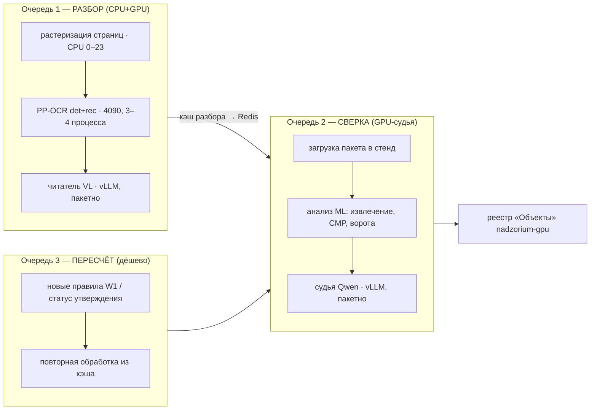

# Очередь обработки всех объектов без простоя CPU и GPU

## Исходные цифры (28.09, сервер HOSTKEY 54831: 32 потока, 62 ГБ, RTX 4090 24 ГБ)

| Объект | Страниц | Сканов | Статус |
|---|---|---|---|
| Алтуфьевское 79Б | 4 286 | 646 | разобран (r4), обработан на nadzorium-gpu |
| Полярная 17 | 10 817 | 3 113 | разобран (r4), обработан |
| Лосевская 3А | 10 993 | 4 103 | разобран (r4), обработан |
| Изумрудная 12 | 5 387 | 2 120 | корпус на сервере |
| Октябрьская 103 | 3 615 | 613 | корпус на сервере |
| Полярная 25 ДОО | 17 086 | 5 330 | корпус на сервере |
| УНДМС | 35 362 | 12 275 | корпус на сервере |
| Полярная 16 | 28 786 | 14 573 | корпус на сервере |
| Полярная 25 СОШ | 37 669 | 20 950 | корпус на сервере |
| **Осталось (6 объектов)** | **≈ 128 000** | **≈ 55 900** | |

Параметры: сегодня код извлекает значения ≈ 37 из 132 (на POL-17/LOS-3A они найдены, но стоят за воротами
«актуальная редакция» — нужен статус утверждения); волна W1 (T-171…T-180) добавляет 47 параметров.

Узкие места, найденные ночью:
1. OCR сканов — главный объём работы (≈ 10,8 CPU-с на скан у Tesseract; GPU-OCR T-184 — 1,1 с/скан на 8 ядрах,
   GPU загружен лишь на 41 %: упор в растеризацию страниц на CPU).
2. Единица работы — файл: том ИД в 3 956 страниц держит один процесс 47 минут; OOM на крупноформатных листах.
3. Утечка памяти в GPU-OCR (RSS растёт от файла к файлу) — обход: новый процесс на пачку из 8 файлов.
4. Параллельность стенда: только N файлов в ML одновременно (было 4, поднято до 8).
5. Судья ждёт конца разбора объекта; GPU между этапами простаивает.

## Принцип: конвейер из трёх очередей, две фазы видеопамяти



- **Q1 и Q2 работают одновременно по разным объектам**: пока объект k проходит судью (Q2), объект k+1 разбирается (Q1).
- **Q3** — пересчёт уже разобранных объектов при каждом влитии правил W1 или решении по статусу утверждения:
  минуты на объект, разбор не повторяется (кэш).

## Раскладка ресурсов по фазам

| Фаза | GPU (24 ГБ) | CPU | Когда |
|---|---|---|---|
| A — массовый разбор | читатель VL 0,15 + PP-OCR 3–4 процесса по 2 ГБ; судья выгружен | 0–23 растеризация и OCR (волны W2/W3 уступают на время фазы, W1 — 24–31) | пока в Q1 есть объекты |
| B — сверка | судья 0,55 + читатель 0,15 + 1 процесс PP-OCR (добор) | 0–7 ML стенда, 8–23 — волнам | между объектами и в конце |
| Смешанная (штатная) | читатель 0,15 + судья 0,50 + 1–2 PP-OCR | 0–15 конвейер, 16–31 — волны | когда объект в Q2, а следующий в Q1 |

Переключение фаз — скриптом (`vllm.sh` из T-230 с ревизиями моделей), без ручных docker-команд.

## Порядок объектов

От малого к большому — результат по новым объектам появляется через час, а не утром:
Октябрьская 103 → Изумрудная 12 → Полярная 25 ДОО → УНДМС → Полярная 16 → Полярная 25 СОШ.
Внутри объекта — сначала разделы-источники ключевых параметров (ПЗ, ПБ, АР, КР, ИД-заключения), потом остальное.

## Оценка времени (проверить замером на первом объекте)

- Q1: ≈ 55 900 сканов. GPU-OCR на 8 ядрах — ≈ 17 ч; на 24 ядрах и 3–4 процессах — **≈ 5–7 ч**
  (растеризация масштабируется по ядрам, 4090 загружена сейчас на 41 %). Текстовые страницы (≈ 72 000) — ≈ 1 ч суммарно.
- Q2: судья на объект — минуты (кэш, 8 файлов параллельно); на 6 объектов — < 1 ч, идёт внутри Q1.
- Q3: на каждое влитие W1 — ≈ 10–20 мин на все 9 объектов.
- **Итого: все 9 объектов по всем параметрам, которые есть в коде, — ≈ 6–8 ч чистого времени сервера.**

## Что нужно сделать перед запуском (по порядку)

1. **T-184 в main** (гейт зелёный, мутации у W1) и **T-230** (GPU-образ ML + починка утечки памяти + vLLM из репозитория)
   — без T-230 стенд nadzorium-gpu после влития T-184 не пересобирается.
2. **Единица работы — страница, а не файл** (задача после T-230): очередь страниц RabbitMQ `ocr` с воркерами
   по числу процессов PP-OCR; снимает «хвост» тома ИД и OOM на больших файлах. До неё — пачки по 8 файлов
   и отдельный процесс с лимитом 28 ГБ для крупноформатных томов (как ночью).
3. **Решение владельца о статусе утверждения** для корпуса «Хакатон» (одно на все пакеты): без него ≈ 37 параметров
   на каждом объекте остаются «уточнить редакцию». Предложение: ПД — «утверждена», РД — «в производство работ»,
   источник — «подтверждение владельца для корпуса Хакатон 28.09», с отметкой в отчёте о приёме.
4. **Решение по ПДн на диске** (OWASP-0191, T-231) — до загрузки шести новых объектов в стенд.
5. **Предоплата HOSTKEY** — баланса хватает до ≈ 03:00 29.09; 6–8 ч конвейера укладываются, но впритык.

## Сценарий запуска после «да»

```
1. T-230 → гейт на раннере W1 → влитие T-184 + T-230 → пересборка nadzorium-gpu с GPU-образом ML
2. vllm.sh phase-A                                  # судья выгружен, читатель 0,15
3. queue.sh enqueue 18 17 12 13 11 10               # объекты в Q1 по порядку
4. queue.sh workers --ocr 4 --cores 0-23            # 4 процесса PP-OCR пачками по 8 файлов
5. на каждый готовый объект: кэш → Redis → load-package --approval (после «да») → start (Q2)
6. vllm.sh phase-B для сверки; после последнего объекта — Q3 пересчёт всех 9 при влитии W1
```

Мониторинг: статус в Telegram раз в 5 минут (объект, страниц/сканов, загрузка CPU и GPU, очередь Q1/Q2/Q3).
