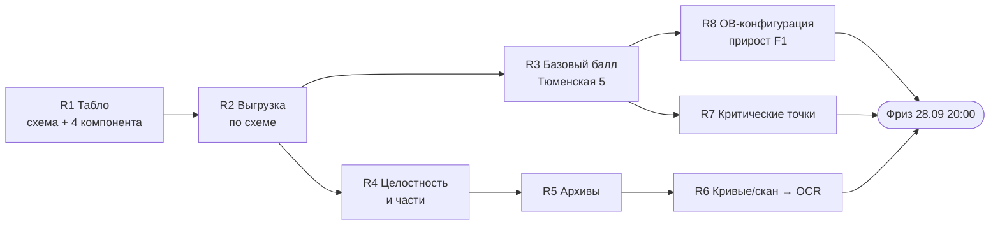

# Перезапуск: план от балла организатора

Ночь 27.09. Всё, что было в работе у сессий, слито в `main` (de9336c) и прошло гейт: юнит-тесты и трасса, ML 683,
UI, паритет PostgreSQL 737/737. До фриза (28.09 20:00) около 40 часов, до стоп-кода (29.09 23:59) — около 70.
Анализы, на которых построен план: `TOP-20-FINAL.md`, `RESEARCH-ALIGNMENT.md`, `TO-BE-GAP.md`, OWASP-аудит БД,
решение по DWG (T-103), ML-концепция. Ниже — что из них следует, если читать их вместе с данными организатора.

## Главное: как оценивают на самом деле

Официальные ответы организатора от 16.09 (`docs/Q&A 16.09.2026 (1).xlsx`, вопрос 13) перебивают пакет 02:
**рейтинг — 40 баллов**. Из них 30 — экспертная оценка: функциональная полнота, OCR и ключевые поля, связывание,
несоответствия, доказательность. Ещё 10 — питч, и больше всего в нём весит живое демо, затем архитектура и
метрики. **F1 и Recall учитываются только при равенстве баллов.** Шкала «100 баллов, потолок 59» из
`scoring_summary_without_answers.json` и доски `lct_scoring_board` — архивная.
Табло R1 поэтому нужно не для балла, а для трёх вещей: честные метрики в питче, тай-брейк и сама выгрузка,
потому что пример JSON входит в комплект сдачи (вопрос О-2). Единица совпадения в табло
(`object_id + parameter_code + location`) совпадает с ответом организатора на вопрос 14.

## Пять фактов из пакета организатора (разобраны 27.09)

Источник — `02_ЭТАЛОННАЯ_РАЗМЕТКА_И_МЕТОДИКА/УЧАСТНИКАМ_БЕЗ_ОТВЕТОВ/data` и `РАЗМЕЧЕННЫЙ_TRAIN_PUBLIC_203/data`.
Лежат вне репозитория, в `~/Documents/2026.09 ЛЦТ НАДЗОРИУМ/Хакатон/gold/`.

1. **Локализация оценивается по файлу и номеру страницы PDF, а не по bbox.** В `submission_schema.json` у
   доказательства три поля: `stage`, `file_id`, `pdf_page_number`. Рамки в балл не входят. Зонный bbox (DEC-02),
   IoU и точность рамок — это качество интерфейса, а не баллы.
2. **Ответ — один JSON на объект:** `object_id` и массив `checks`. У каждой проверки есть `parameter_code`,
   `location`, значения ПД/РД/ИД, `violation_label` (4 значения), `protocol_status` (7 значений), `criticality`
   и `evidence`. Выгрузки в этом формате у нас нет. Без неё ответ не сдаётся.
3. **Публичный эталон крошечный:** в балл идут 10 проверок, все из объекта Тюменская 5, все `VIOLATION_PRESENT`,
   все про ОВ (конфигурация приточных установок IOS4-078/079 и свободный поиск по отоплению FREE-HEATING-001).
   Они лежат на трёх PDF: F0171 (ПД, 177 стр.), F0201 (РД ОВ1, 676 стр.), F0202 (РД ОВ2.1, 36 стр.).
   Ещё 5 проверок Новослободской — `NO_VIOLATION`, в балл не идут. Остальные 30 тыс. записей `annotations.jsonl` —
   машинная предразметка полей (`AUTO_FIELD_CANDIDATE`), а не эталон.
4. **Экзамен — объект Речников 7/7:** 213 файлов, 56 % страниц — сканы, 5 DWG рядом с PDF и ещё 662 DWG внутри
   38 вложенных архивов. Значит, на экзамене решают: распаковка архивов, маршрут «скан/кривые → OCR»,
   целостность и части документов (10 баллов) и честные `MISSING_DOCUMENT` / `COMPARISON_IMPOSSIBLE` там,
   где сравнить нечем.
5. **Закрытая часть пакета 02 — архивная, её можно читать** (организатор назвал её архивной, владелец разрешил 26.09).
   Из неё три вещи. `scoring_config.json` подтверждает ключ `object_id + parameter_code + location` и разрешает
   групповой ответ, если он покрывает все места группы. По тому же файлу UNREVIEWED не считается отрицательным классом:
   лишняя находка вне эталона не ложное срабатывание. Старый скрытый тест Речникова — четыре числовых параметра
   СПЗУ по листам ПД F0250 и РД F0325: площадь 3694,60 → 3663,10 м² (`CRITICAL`), МАФ 16 → 27 (`NO_VIOLATION`:
   рост — не нарушение, как и в нашем правиле `decrease`), ограждение и лотки совпадают. Коды организатора
   (`SPZU-029`) один в один переводятся из наших (`M-029`) по номеру: все 132 названия совпадают.

## Что это меняет в прежних планах

| Было | Стало | Почему |
|---|---|---|
| Зонный bbox DEC-02 — №3 до фриза | после фриза, как UX | рамки в балл не входят (факт 1) |
| CMP-24 TOL-ASBUILT (P10) — №1 до фриза | №7 | P10 — пилот исследования, а не эталон балла; эталон — ОВ Тюменской |
| T-096 «замер на 203 документах» | замер на 10 проверках Тюменской + прогон формы на Новослободской | реального эталона 10 строк (факт 3) |
| T-117 выгрузка — №2 | **№1**, вместе с табло | без неё нет ни ответа, ни замера |
| DWG — только свидетель РД | распаковка архивов — до фриза, DWG-текст — после | на экзамене 662 DWG внутри 38 архивов (факт 4) |

## Порядок работ

Линия A — эта сессия (балл). Линия B (скорость верификации: T-081, T-062; T-111 и T-112 в проверке) с 27.09 без
исполнителя: сессия building-tech-53 закрыта, владелец назначит линию заново. Отчёт по ней — `docs/qa/QA-REPORT-T105-SCENARIOS.md`.
Каждый шаг идёт отдельным коммитом: сначала тест, потом код, потом локальный гейт.

| # | Шаг | Задача | Правила ГЕРЫ | Оценка | Готово, когда |
|---|---|---|---|---|---|
| R1 | **Табло** ✅ 27.09: валидатор по `submission_schema.json` и счётчик 4 компонентов (архивные веса 60/15/15/10 — как метрики, не как балл) | T-096 | OS-INSP-6.5.6, 6.5.7 | 2 ч | `ml/eval/submission.py`, 31 тест, мутации 293/363 (80,7 %) |
| R2 | **Выгрузка ответа** из проверки: статусы проекта → `violation_label` / `protocol_status`, доказательство → файл и страница | T-117 | OS-INSP-5.1.3–5.1.5 | 3 ч | `GET /api/checks/:id/submission` проходит схему; тест в `domain*.test.ts` |
| R3 | **Базовый балл на Тюменской**: 3 исходника из 01_ПАКЕТ через translog, прогон, выгрузка, табло | T-096 | 6.5.6 | 3 ч + прогон | число в `docs/qa/` с разбивкой по компонентам; правило №0: сначала F0202 (36 стр.) |
| R4 | **Целостность и части** по `split_policy` и манифесту: исключённые файлы, дубли, части тома | T-120 | 1.2.10, 1.3 | 2 ч | компонент «integrity» считается табло на Новослободской |
| R5 | **Распаковка архивов** (bsdtar, cp866, лимиты, traversal), `file_id` потомков — от родителя | T-103 п. 1 | TZA-11-05 | 3 ч | синтетический zip-в-zip проходит; злой архив отклонён |
| R6 | **Маршрут «кривые/скан → OCR»** по `pagekind.py` | новая | GAP по L2 | 2–3 ч | страница с SHX-кривыми уходит в OCR, а не в «текста нет» |
| R7 | **Критические контрольные точки**: ни одного пропуска | T-118 | 6.5.7 | 3 ч | табло не опускает синтетику до 59 |
| R8 | **ОВ: конфигурация установок** (IOS4-078/079, отопление) — то, на чём стоит эталон | новая | по модели | 4–5 ч | прирост F1 на Тюменской, измеренный R3 |
| R9 | H1 `reason_code`, H2 IP за nginx | T-089, T-090 | NFR-AUTH | 1,5 ч | тесты, OWASP-таблица |
| — | После фриза: CMP-24, CMP-10 AGG-SUM, зонный bbox, SERVE-MAP, DWG-текст, бэкап в S3 (T-072), SSE-KMS (T-071) | | | | |

**Поправка к порядку по официальной оценке.** После R1–R2 первым идёт сквозной путь ядра на объекте
экзаменационного типа (R4–R7: архивы, сканы в OCR, честные статусы, целостность) — это функциональная полнота и живое демо.
Затем три пункта из комплекта сдачи, которых нет в R-списке: публичная ссылка на стенд и README одной командой (О-2),
одна воспроизводимая итерация дообучения с артефактом и метриками (вопрос 24), перечень моделей с лицензиями (вопрос 23).
R8 (ОВ-конфигурация на Тюменской) — после них.

Каждое следующее решение принимается по числу из табло, а не по оценке «на глаз». Если шаг не двигает ни один
компонент балла на Тюменской или на синтетике экзаменационного типа (сканы, архивы, пропуски документов), он
уходит за фриз.

## Нужно от владельца

1. Скачивание трёх исходников Тюменской (F0171, F0201, F0202; около 76 МБ по описи 01_ПАКЕТ) через `translog` —
   делаю сам, по правилу №1, если нет возражений.
2. Прежние решения остаются в силе: 13 пунктов в `00-run-notes.md`, сервисный аккаунт S3 и KMS.
