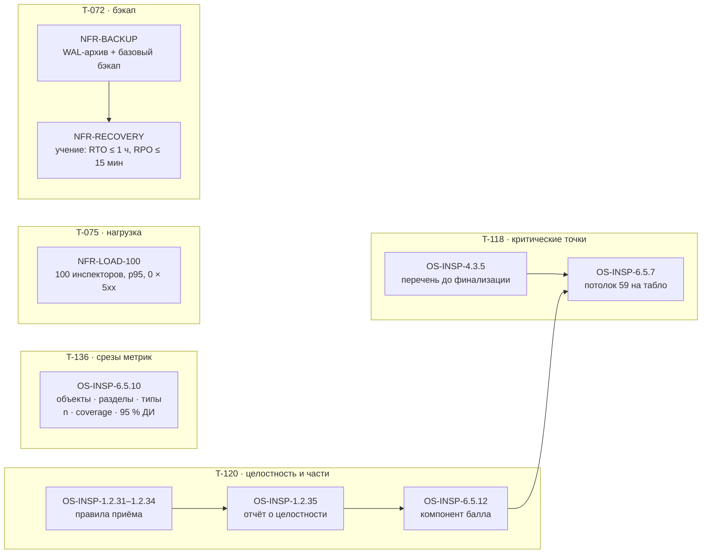

# Пять нереализованных требований ТЗ: проект

Согласовано владельцем 27.09. С соседними сессиями поделено без пересечений: c3 (T-134) делает выгрузку и протокол
(5.1.3–5.1.6, 2.2.4), bf (T-135) — ячейки таблиц (2.2.5), M-072 и замеры §11. Сессия d5 берёт требования ниже.
Резерв номеров: правила OS-INSP-1.2.31–1.2.35, 4.3.5, 6.5.10, 6.5.12; миграция 0009.

## Почему именно эти пять

По трассе все атомы прототипа реализованы, кроме двух частичных, и они у соседей. «Не реализовано» осталось в двух видах.
Первое — правила из `03-services.md`, для которых в трассе нет кода (6.5.6 и 6.5.7). Второе — атомы вне прототипа,
у которых нет ни кода, ни замера: 14.3-07, 11-11, 11-13/14 и 12.8-01. Сюда же относится компонент балла «целостность и части»:
его нечем измерить.

## 1. T-118 — критические контрольные точки (TZA-14.3-08)

**Операции.** BO-INSP-4.3 «Финализировать протокол» и BO-INSP-6.5 «Измерить качество на эталоне». Источник — SRC-INSP-08:
в `scoring_summary` задан `critical_miss_gate`, в `parameter_catalog_132` — поле `criticality`.
«Критическое (приостановка работ)» совпадает с `review_priority = HIGH` Матрицы: 106 из 106, сверено сессией c3.

- **OS-INSP-4.3.5 (новое).** По критическому параметру может не быть вердикта сравнения (NOT_COMPARABLE, CLARIFICATION_REQUIRED
  или MISSING_EVIDENCE). Такие параметры система перечисляет перед финализацией. Финализирует она только после того, как инспектор
  подтвердил просмотр перечня. В аудит пишется подтверждение с числом параметров.
  *Допущение:* организатор задаёт гейт для балла, а не для интерфейса. Мы переносим его на человека, чтобы пропуск
  критической точки был видимым решением, а не молчанием.
- **OS-INSP-6.5.6 и 6.5.7 (есть в коде, нет в трассе).** Табло `ml/eval/submission.py` написано в T-096 и покрыто 31 тестом,
  но в `model.yaml → impl` его нет. Задача — связать. Отдельно появляется прогон табло по объектам `ml/eval/score_run.py`:
  таблица балла по объектам, флаг потолка и перечень пропущенных точек в `docs/qa/SCORE-ORGANIZER.md`.

Код: `domain/lifecycle.ts::criticalUnresolved` и `canFinalize(…, ack)` как чистые функции; `services/inspections.ts::finalize`
принимает `critical_reviewed`; `POST /finalize` при непустом перечне и без подтверждения отвечает 409 `CRITICAL_UNREVIEWED`
с перечнем. В вебе окно финализации показывает перечень и флажок «Перечень просмотрен».
Миграция не нужна: подтверждение хранится в аудите.

## 2. T-120 — целостность документов и обработка частей (TZA-1.2-04, компонент балла 10)

**Операция** — BO-INSP-1.2 «Принять файлы комплекта с реестром». Источник — SRC-INSP-08: `document_manifest.jsonl`
с полями `sha256`, `pdf_pages`, `exclusion_reason`, `duplicate_group`; `split_policy.json` с полем `excluded_file_ids`.

- **OS-INSP-1.2.31** SHA-256 не совпадает с реестром → HASH_MISMATCH. Код уже есть, не хватает теста и связи.
- **OS-INSP-1.2.32** Реестр исключает файл (`exclusion_reason`) → файл не идёт в сверку и попадает в отчёт с причиной.
- **OS-INSP-1.2.33** Файл с тем же SHA-256 уже принят под другим `file_id` → в сверку повторно не идёт, показывается дублем.
- **OS-INSP-1.2.34** Число страниц PDF расходится с `pdf_pages` реестра → файл неполный (оба числа), стадия PARTIAL.
- **OS-INSP-1.2.35** Отчёт о целостности пакета: статус каждого файла реестра и доля файлов, учтённых без расхождений.
- **OS-INSP-6.5.12** Стенд считает компонент «целостность и части» по манифесту и отчёту и передаёт его в табло 6.5.6.
  *Допущение:* формулу организатор не раскрыл, поэтому берём долю файлов манифеста, учтённых верно.

Код: `domain/integrity-report.ts` (чистая функция: реестр + принятые файлы + страницы → отчёт), расширение `ManifestFile`
(`pdf_pages`, `exclusion_reason`, `duplicate_group`), `GET /api/v1/inspection/:id/integrity`, `ml/eval/integrity.py`.

## 3. T-136 — метрики в разрезах с 95 % ДИ (TZA-14.3-07)

**Операция** — BO-INSP-6.5. Срезы по разделам и типам в `ml/eval/run.py` уже есть. Не хватает трёх вещей. В отчёте `.md` нет ДИ
и coverage по срезам. У среза «объект» ДИ не считается: бутстрэп по одному объекту вырожден. Атом не связан ни с одним правилом.

- **OS-INSP-6.5.10** Стенд публикует метрики выявления и локализации по объектам, разделам Матрицы и типам нарушений.
  У каждого среза есть n, coverage и 95 % ДИ. Для одного объекта ДИ считается по Уилсону на группах, в остальных случаях — бутстрэпом по объектам.

Код: `ml/eval/ci.py::wilson`, срез «объект» с ДИ Уилсона, колонки ДИ в `to_markdown`.

## 4. T-075 — 100 одновременных инспекторов (TZA-11-11)

Новое ограничение **NFR-LOAD-100**: 100 сессий инспекторов работают одновременно, 5xx нет, p95 ответа API ≤ 200 мс (ТЗ 11-10).
Сейчас атом 11-11 смотрит в NFR-SLA вместе с 99,9 % и RTO/RPO; его переводим на NFR-LOAD-100.

Код: `scripts/load-100.mjs`. Он поднимает отдельный PostgreSQL 18 в docker на случайном порту выше 40000, API и ML из
этого дерева, заводит 100 учёток и 100 проверок: первая идёт через ML, остальные 99 берутся из кэша по SHA-256.
Дальше 100 виртуальных инспекторов 3 минуты ходят по сценарию «дашборд → проверка → карточка → решение»
с паузой 1–3 с. Статистика — `scripts/lib/load-stats.mjs` (перцентили, вердикт), тест
`scripts/load-100.test.mjs` в `test:deploy`. Итог — `docs/qa/LOAD-100.md`. Прогон — только через `heavy.sh`.

## 5. T-072 — бэкап и учение по восстановлению (TZA-12.8-01, 11-13, 11-14)

- **NFR-BACKUP** в профиле gpu:
  - `archive_mode=on`, `archive_command` пишет WAL в том `pg-wal-archive` без перезаписи;
  - `archive_timeout=300`, то есть худший RPO — 5 минут при пределе 15;
  - служба `pg-backup` делает ежедневный `pg_basebackup` и чистит копии старше 30 дней;
  - надстройка `compose.backup-s3.yml` отправляет копии в бакет, где object lock — свойство бакета.
- **NFR-RECOVERY (новое)**: учение `scripts/restore-drill.sh`.
  1. Поднимается PostgreSQL с тем же `backup.conf`, что и в gpu.
  2. Идёт поток записей с отметкой времени, снимается базовый бэкап, поток продолжается.
  3. Мастер «падает» через `docker kill`.
  4. Восстановление в новый контейнер: базовый бэкап плюс WAL из архива.
  5. Замер: RTO — от начала восстановления до готовности базы со сверенным числом строк; RPO — разница между последней записью
     до падения и последней восстановленной.
  Итог — `docs/qa/BACKUP-DRILL.md`.

Лёгкие тесты в `scripts/backup.test.mjs`: конфиг gpu, запрет перезаписи в архиве WAL, чистка ровно старше 30 дней. Учение —
тяжёлое (docker, около 7 минут) и идёт через `heavy.sh`.

## Тесты по эшелонам

| Требование | L1 домен | L2 контракт/роут | L3 сквозной | Обкатка |
|---|---|---|---|---|
| 4.3.5 | `domain-lifecycle-critical.test.ts` | `finalize-critical-route.test.ts` (409 + перечень, аудит) | UI-диалог `dialogs.test.mjs` | стенд мака, проверка до финализации |
| 1.2.31–1.2.35 | `domain-integrity-report.test.ts` | `integrity-route.test.ts` | — | манифест Новослободской (метаданные, без файлов) |
| 6.5.7, 6.5.12 | `test_submission.py` (есть), `test_integrity.py` | — | `test_score_run.py` | табло на синтетике v3 |
| 6.5.10 | `test_eval.py::wilson`, срезы | — | `test_factory_v3.py` | `ACCEPTANCE-14.md` пересобран |
| NFR-LOAD-100 | `load-100.test.mjs` | — | — | `docs/qa/LOAD-100.md` |
| NFR-BACKUP/RECOVERY | `backup.test.mjs` | — | — | `docs/qa/BACKUP-DRILL.md` |

Мутации: новые модули `domain/integrity-report.ts`, функции `lifecycle.ts`, `ml/eval/integrity.py`, `ci.py::wilson` — скор ≥ 80 %,
только через `heavy.sh` и только после того, как соседние мутации отпустят замок.
