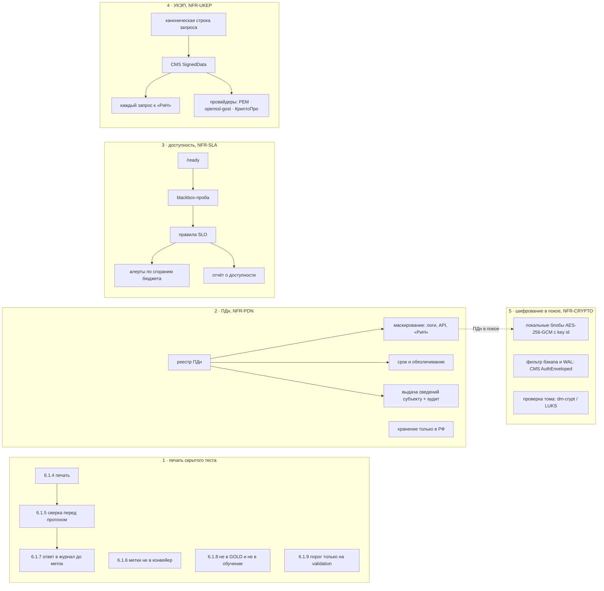

# Пять нереализованных требований ТЗ: проект

Владелец согласовал пакет 27.09. С соседними сессиями пересечений нет:

| Сессия | Задача | Что взяла |
|---|---|---|
| c3 | T-134 | выгрузка и протокол |
| bf | T-135 | таблицы, М-072, §11-04/05/10 |
| d5 | T-136 | целостность, критические точки, ДИ, нагрузка, бэкап |
| 4d | T-138 | метрики OCR, §11-06/07/08, IDS |
| a5 | T-139 | состав классов теста 14.2-03 |

На трассе у пяти атомов этого пакета нет ни кода, ни замера. У 9.4.2-03 трасса есть, но она смотрит в хеш выборки GOLD (OS-INSP-6.1.3) и не запрещает обучение на скрытом тесте.

## 1. Печать скрытого теста (TZA-14.2-04, TZA-9.4.2-03)

**Операция** — BO-INSP-6.1 «Выпустить версию GOLD-набора». **Источник** — ТЗ §14.2 и §9.4.2. Организатор фиксирует состав скрытого теста и его SHA-256 до соревнования. Метки участнику не передаются, подбирать порог по скрытому тесту запрещено, обучаться на нём нельзя.

У нас скрытых тестов два:
- **TEST_HIDDEN организатора (213 объектов).** У нас есть его опись с SHA-256 каждого файла, сами файлы не открываются (T-096).
- **Выборка `test` нашего GOLD-набора.**

- **OS-INSP-6.1.4.** Система запечатывает скрытый тест до его использования. Печать хранит:
  - число файлов;
  - SHA-256 каждого файла с ролью «вход» или «метки»;
  - общий отпечаток печати.

  Печать только добавляется. Повторная печать под тем же именем с другим составом отклоняется.
- **OS-INSP-6.1.5.** Перед прогоном на скрытом тесте система сверяет файлы с печатью. Добавленный, пропавший или изменённый файл останавливает прогон, и система называет его.
- **OS-INSP-6.1.6.** В конвейер уходят только входные документы скрытого теста. Файл, SHA-256 которого совпадает с файлом меток любой печати, API не принимает и отвечает HIDDEN_TEST_LABELS.
- **OS-INSP-6.1.7.** Балл по меткам скрытого теста считается только по ответу, записанному в журнал печати заранее. В записи хранятся SHA-256 ответа, версия модели и время. Ответ, которого нет в журнале, не оценивается.
- **OS-INSP-6.1.8.** Система исключает из GOLD-набора решения по файлам скрытого теста и называет число исключённых. Дообучение по выпуску, в котором такие решения есть, отклоняется с причиной.
- **OS-INSP-6.1.9.** Порог подбирается только на validation. Если validation пересекается со скрытым тестом по SHA-256 файлов или по object_id, система отказывает в подборе и называет пересечение.

*Допущение.* Роль файла в описи организатора определяется правилом:
- **«метки»** — `data/annotations.jsonl`, `data/hidden_gold_checks_organizer_only.jsonl`, `annotated_documents/*`, `VALIDATION.json`, `QA_SUMMARY.json`;
- **«вход»** — всё остальное.

Печать хранит только хеши и роли, без путей: опись TEST_HIDDEN не публикуется (T-096).

**Код:**
- `apps/api/src/domain/hidden-seal.ts` — чистые функции: отпечаток, сверка, пересечения.
- `ml/eval/hidden_seal.py` — тот же отпечаток байт в байт, проверяется тестом паритета. CLI: `seal`, `verify`, `commit`, `score`.
- Таблица `hidden_seals` и журнал `hidden_seal_runs`, только добавление.
- Маршруты `POST/GET /api/v1/ml/hidden-seals`.
- Гард в `gold/release`, `retrain.train` и `chooseThreshold`.
- Реальная печать описи организатора — `ml/eval/seals/organizer-test-hidden-213.json`.

## 2. ПДн по 152-ФЗ (TZA-12.6-01, NFR-PDN)

**Что есть сейчас.** В системе хранятся:
- `users.name` — ФИО инспектора;
- `users.login`;
- `objects.customer` и `objects.contractor` — застройщик и подрядчик;
- `audit_log.ip_address` и `audit_log.user_agent`;
- `decision.user_name` внутри `protocols.body_json`.

ФИО уходит в «РиН» и в выгрузки. Заказчик отдаётся через `select * from objects`. Маскирования и срока хранения нет.

**Требования NFR-PDN** (у автора метода нефункциональных требований нет, это допущение проекта):

1. **Реестр ПДн** — `domain/pdn.ts::PDN_REGISTRY`. Для каждого поля указаны:
   - категория, цель и основание (152-ФЗ ст. 6);
   - срок и способ защиты.

   Гейт падает, если в миграциях появилась колонка из словаря ПДн (`name`, `login`, `customer`, `contractor`, `ip_address`, `user_agent`, `phone`, `email`, `fio`), которой нет в реестре.
2. **Маскирование.**
   - Функция `log()` маскирует e-mail, телефоны, СНИЛС и ключи из реестра.
   - Строка запроса в логе ответа маскируется.
   - Текст ошибок внешних систем проходит через ту же маску.
3. **Минимизация:**
   - В «РиН» уходит `user_id` решения без ФИО. *Допущение:* «РиН» идентифицирует должностное лицо по своей учётке.
   - Карточка проверки отдаёт `customer` и `contractor` только ролям inspector, supervisor и admin. Для остальных поля маскируются.
   - Журнал аудита отдаёт полный IP только admin, supervisor видит IP с обнулённым последним октетом.
4. **Срок и обезличивание** (ст. 21 ч. 7).
   - Учётка, выключенная больше `INSPECTOR_PDN_USER_DAYS` дней назад (по умолчанию 30), обезличивается: ФИО заменяется на «Обезличен #id», логин — на `deleted-<id>`.
   - IP и User-Agent в журнале аудита старше 365 дней обнуляются. Это единственное разрешённое изменение неизменяемого журнала, его выполняет функция БД.
   - Задача выполняется раз в сутки, её результат пишется в аудит.
5. **Сведения субъекту** (ст. 14). `GET /api/v1/admin/pdn/subject/:userId` отдаёт все ПДн о пользователе и где они лежат. Доступ пишется в аудит как PDN_ACCESS.
6. **Локализация** (ст. 18 ч. 5). В профиле gpu API не стартует, если S3-хранилище вне РФ. Допускаются `storage.yandexcloud.net` и регион `ru-central1`, иные — только списком `INSPECTOR_PDN_RU_ENDPOINTS`.

## 3. Доступность 99,9 % (TZA-11-12, NFR-SLA)

- **`GET /ready`.** Отвечает 200, когда отвечают БД и ML, иначе 503 с именем отказавшей зависимости.
- **Проба.** `blackbox-exporter` в compose (по digest, hardened) опрашивает `https://api:8810/ready` и `http://web:8080/` каждые 15 с.
- **Правила записи** `deploy/gpu/rules/slo.yml`:
  - `slo:probe_success:ratio_rate{5m,30m,1h,6h,1d,30d}`;
  - `slo:api_requests_ok:ratio_rate*` = 1 − доля 5xx.
- **Алерты по сгоранию бюджета** (multiwindow, multi-burn-rate, SRE Workbook):
  - `InspectorSloBurnFast` — ×14,4 за 1 ч и 5 мин, page;
  - `InspectorSloBurnSlow` — ×6 за 6 ч и 30 мин, ticket;
  - `InspectorSloBudgetExhausted` — за 30 дней < 99,9 %.
- **Проверка правил.** Модульные тесты правил `promtool test rules` — `slo.test.yml`. Гейт гоняет их в образе Prometheus.
- **Расчёт бюджета** — `domain/slo.ts`, чистые функции: бюджет, скорость сгорания, остаток.
- **Отчёт** `scripts/availability-report.mjs` берёт данные из API Prometheus и пишет `docs/qa/AVAILABILITY.md`.
- **Обкатка** — локальный прогон blackbox, Prometheus и API. Отказ ML даёт 503 на `/ready`, `probe_success` = 0, быстрый алерт срабатывает.

## 4. Подпись УКЭП запросов к внешним системам (TZA-12.10-01, NFR-UKEP)

- **Каноническая строка:** `METHOD\npath?query\nts\nnonce\nsha256hex(body)` (`domain/request-signing.ts`). Метка времени в пределах ±300 с, nonce 128 бит.
- **Подпись** — откреплённая CMS SignedData. Подписываемые атрибуты: contentType, messageDigest, signingTime; сертификат подписанта включён. Заголовки запроса:
  - `X-Signature` (base64 DER);
  - `X-Signature-Timestamp`;
  - `X-Signature-Nonce`.
- **Провайдеры** `services/request-signer.ts`:
  - `pem` — RSA и ECDSA на node:crypto с pkijs; для тестов и стенда.
  - `openssl-gost` — `openssl cms -sign` с провайдером ГОСТ (gost-engine), ГОСТ Р 34.10-2012.
  - `cryptopro` — `cryptcp -sign -detached`; проверяется поддельным бинарником.
- **Подключение.** Каждый запрос к «РиН» — отправка протокола, автозабор, статусы предписаний — идёт через транспорт с подписью.
- **Отказ без подписи.** В профиле gpu без настроенного подписанта API не стартует. Отказ подписанта означает, что запрос не уходит и ставится PENDING_SYNC.
- **Проверка.** Подпись проверяется своим же `services/signature.ts`, круг «подписал → проверил» замкнут. Тестовый сервер «РиН» проверяет подпись каждого запроса.
- **Архитектурный тест.** Исходящий `fetch`, `https.request` и `http.request` разрешены только в модулях из белого списка. Внешняя система = «РиН»; ML, S3 и RabbitMQ — инфраструктура контура.

*Допущение.* S3 не относится к внешней ИС: у него своя подпись запросов (SigV4), а данные шифруются на клиенте (ADR-0006).

## 5. Шифрование в покое (TZA-12.3-01, NFR-CRYPTO)

- **Локальные блобы.** `FsBlobStore` и локальный кэш Tiered пишут формат `IBE1‖key_id(8)‖nonce(12)‖ct‖tag(16)`:
  - `key_id` — первые 8 байт SHA-256 ключа;
  - старые ключи читаются по `key_id` (ротация);
  - открытый текст без заголовка читается как наследие, а `pnpm blobs:encrypt` перешифровывает его.

  В профиле gpu без ключа API не стартует.
- **Бэкап и WAL.** `deploy/gpu/backup/at-rest-encrypt.sh` шифрует stdin в CMS AuthEnvelopedData AES-256-GCM на сертификат получателя. Закрытый ключ на сервере не лежит, поэтому утечка сервера не раскрывает старые бэкапы. Рядом с каждым файлом кладётся `.sha256` открытого текста: повторная архивация WAL сравнивается по нему (стык с T-136). `at-rest-decrypt.sh` — для учения по восстановлению.
- **Том PostgreSQL.** `deploy/gpu/at-rest-check.sh` проверяет, что каталоги томов (`postgres-data`, `api-blobs`, бэкапы) лежат на устройстве dm-crypt (LUKS): `findmnt` → `lsblk -s`. Стенд без этого не стартует.

## Ведение и проверка

- Правила 6.1.4–6.1.9 — в `03-services.md`. Блоки `impl` NFR-PDN, NFR-SLA, NFR-UKEP, NFR-CRYPTO — в `model.yaml`. Атомы ведут в них в `tz-decomposition.yaml`, `pnpm trace:check` зелёный.
- Новые чистые модули — критичные:
  - `hidden-seal.ts`, `pdn.ts`, `slo.ts`, `request-signing.ts`, `at-rest.ts`;
  - `request-signer.ts`, `hidden_seal.py`.

  Мутационный скор ≥ 70 %, прогоны по одному модулю через `scripts/heavy.sh`.
- Эшелоны: L1 правила, L3 границы (метка времени ±300 с, 30 дней, 99,9 %), L4 отказы (подписант упал, ML упал → 503), L6 враждебные данные (подменённый файл печати, метки в загрузке), L7 дисциплина (гейт реестра ПДн, архитектурный тест исходящих запросов).
