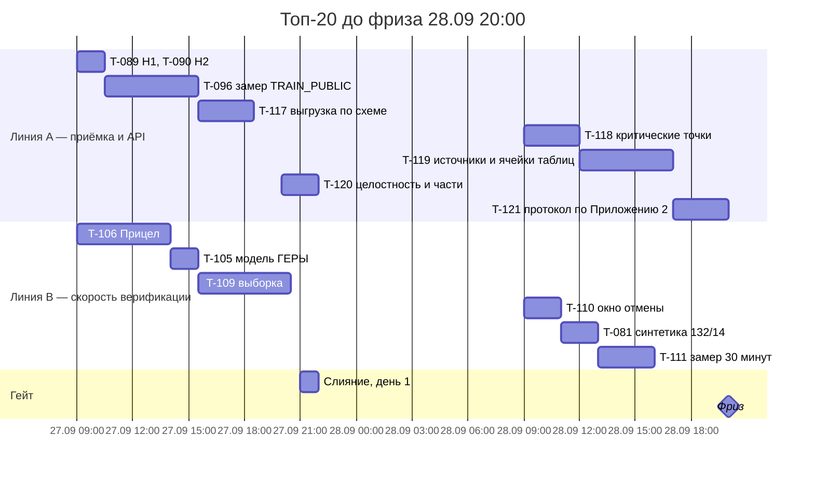

# Топ-20 до фриза

Сводный план CTO на 26.09, ночь. Вход — модель ГЕРЫ после актуализации T-113, план T-103 (`docs/scenario-map/10-план-работ.md`),
ответы организатора (Q&A 16.09) и его методика оценки из пакета участника.

## Что изменило приоритеты

1. **Методика балла организатора** (`scoring_summary_without_answers.json`, SRC-INSP-08): выявление нарушений F1 — **60**,
   локализация файла и страницы — **15**, значения и статусы — **15**, целостность документов и частей — **10**.
   **Пропуск любой критической контрольной точки ограничивает итог 59 баллами.** Ответ сдаётся по `submission_schema.json`.
   В коде нет ни выгрузки по этой схеме, ни замера на публичном эталоне TRAIN_PUBLIC_203.
2. **Q&A 18:** обязательны метрики §14 на прототипе; SLA, RTO/RPO, «РиН», УКЭП, IDS — задел, для MVP не блокируют.
   Эксплуатационный контур — после линии отсечения.
3. **Q&A 16:** юзабилити-тест проводит организатор на своих инспекторах, порог 30 минут на протокол READY.
   Скорость верификации — вторая по весу линия (план T-103).
4. **Бакет S3 (ADR-0004):** даёт цель для бэкапа PostgreSQL (T-072); блобы — позже, по триггеру второго хоста.
5. **Рамки:** фриз функциональности 28.09 20:00, стоп-код 29.09 23:59 МСК; около 24 часов работы до фриза.

## Остаток по модели ГЕРЫ (после T-113)

| Что | Количество | Где |
|---|---|---|
| Правила без реализации | 10 из 148 | OS-INSP-2.2.4, 2.2.5 · 5.1.3–5.1.6 (выгрузка организатору, образец протокола) · 6.4.2 (LoRA, gpu) · 6.5.5 (тест) · 6.5.6–6.5.7 (балл организатора) |
| Пункты ТЗ | ✅ 68 · 🟡 3 · ⏸ 7 | 🟡 — TZ-7.1, TZ-9.1.2 (2.2.4/2.2.5), выгрузка протокола (новые правила 5.1.x) |
| Атомы ТЗ | ✅ 194 · 🟡 2 · ⏸ 56 | 🟡 — M-072 без шкалы (GAP-07), образец протокола (GAP-02, теперь закрывается кодом) |
| Пробелы | 13 открыто | 1 закрывается кодом (GAP-02), 5 ждут подтверждения ответа организатора (01, 03, 04, 05, 13), 7 — решения владельца |
| OWASP приложения | H1, H2, H6 открыты | H3, H4 закрыты T-107; H5, H7 (раннер CI) неприменимы до появления раннера |

## Топ-20

Оценка — часы работы агента с тестом первым и локальным гейтом. Линия A — эта сессия (приёмка и API), линия B —
сессия T-103 (интерфейс и скорость верификации).

| # | Задача | Зачем | Правила / атомы | Линия | Оценка | До фриза |
|---|---|---|---|---|---|---|
| 1 | **T-096** Замер на TRAIN_PUBLIC_203 по методике организатора | главный показатель: 100-балльная шкала и гейт критических точек | OS-INSP-6.5.6, 6.5.7 | A | 5 ч | ✅ |
| 2 | **T-117** Выгрузка ответа по `submission_schema.json` | без неё ответ не сдаётся | OS-INSP-5.1.3–5.1.5 | A | 3 ч | ✅ |
| 3 | **T-118** Критические контрольные точки: ни одного пропуска | потолок 59 баллов при одном пропуске | OS-INSP-6.5.7 | A | 3 ч | ✅ |
| 4 | **T-119** Извлечение по источникам Матрицы и ячейкам таблиц | F1 (60) и значения (15) на реальных документах | OS-INSP-2.2.4, 2.2.5 | A | 5 ч | ✅ |
| 5 | **T-120** Целостность документов и части по `split_policy` | 10 баллов | OS-INSP-1.2.10, 1.3 | A | 2 ч | ✅ |
| 6 | **T-121** Протокол по Приложению 2 + экранирование разметки (H6) | TZA-9.2.0-02, OWASP H6 | OS-INSP-5.1.6 · T-094 | A | 3 ч | ✅ |
| 7 | **T-089** H1: `reason_code` из прототипа | запись решения без аудита | OS-INSP-4.1 | A | 0,5 ч | ✅ |
| 8 | **T-090** H2: IP клиента за nginx | блокировка входа всем | NFR-AUTH | A | 1 ч | ✅ |
| 9 | **T-106** Прицел (в работе) | юзабилити-тест организатора, 30 мин | — | B | 5 ч | ✅ |
| 10 | **T-109** Совпадения выборкой | главный «вау» скорости | 4.1.8–4.1.11 (кандидаты) | B | 5 ч | ✅ |
| 11 | **T-110** Сводка и окно отмены финализации | безопасная финализация | 4.3.4 (кандидат) | B | 2 ч | ✅ |
| 12 | **T-111** Замер эффекта NFR-VERIFY-30 | доказательство 30 минут | NFR-VERIFY-30 | B | 3 ч | ✅ |
| 13 | **T-105** Перенос принятых кандидатов в модель ГЕРЫ | трасса новых правил | 4.1.8–4.1.16 и др. | B | 1,5 ч | ✅ после «да» |
| 14 | **T-081** Синтетический объект «132 параметра, 14 нарушений» | сценарий юзабилити-теста | NFR-VERIFY-30 | B | 2 ч | ✅ |
| 15 | **T-122** Перемер §11 после PostgreSQL | PERF-11 снят на SQLite | OS-INSP-6.5.5 | A | 1 ч | ✅ |
| 16 | **T-112** Общий корень причин | ускорение однотипных решений | 4.1.12–4.1.14 (кандидаты) | B | 4 ч | если успеем |
| 17 | **T-072** Бэкап PostgreSQL в S3 + проверка восстановления | задел ТЗ 12.8, RPO 15 мин | NFR-BACKUP, NFR-OBJSTORE | A | 4 ч | после фриза |
| 18 | **T-071** Шифрование в покое: SSE-KMS бакета, том БД | условие ADR-0004 для ПДн | NFR-CRYPTO | A | 2 ч | после фриза |
| 19 | **T-062** Демо-ролик финальной версии | показ жюри | — | B | 2 ч | до стоп-кода |
| 20 | **T-060** Выкат стенда gpu | эксплуатационный задел | — | A | 3 ч | только по «да» владельца |

**Сумма до фриза:** линия A — 23,5 ч (п. 1–8, 15), линия B — 23,5 ч (п. 9–14). Параллельно, в отдельных worktree,
слияние вечером каждого дня после зелёного локального гейта. П. 16 — если останется время, п. 17–20 — за линией отсечения.

**Не входит:** нейросетевой OCR и LoRA (нет GPU, OS-INSP-6.4.2), IDS и DDoS, УКЭП ГОСТ (лицензия СКЗИ), нагрузочный тест
на 100 инспекторов, LOW-находки аудитов.

## Нужно от владельца

1. Подтвердить ответы организатора в `00-run-notes.md` (п. 1–5) и решения по п. 6–13 — без них 7 пробелов остаются открытыми.
2. «Да» на перенос кандидатов в модель (T-105).
3. Сервисный аккаунт S3 для бэкапов и KMS-ключ — перед T-072 и T-071 (платно).
4. Выкат стенда (T-060) — только по отдельному «да».
