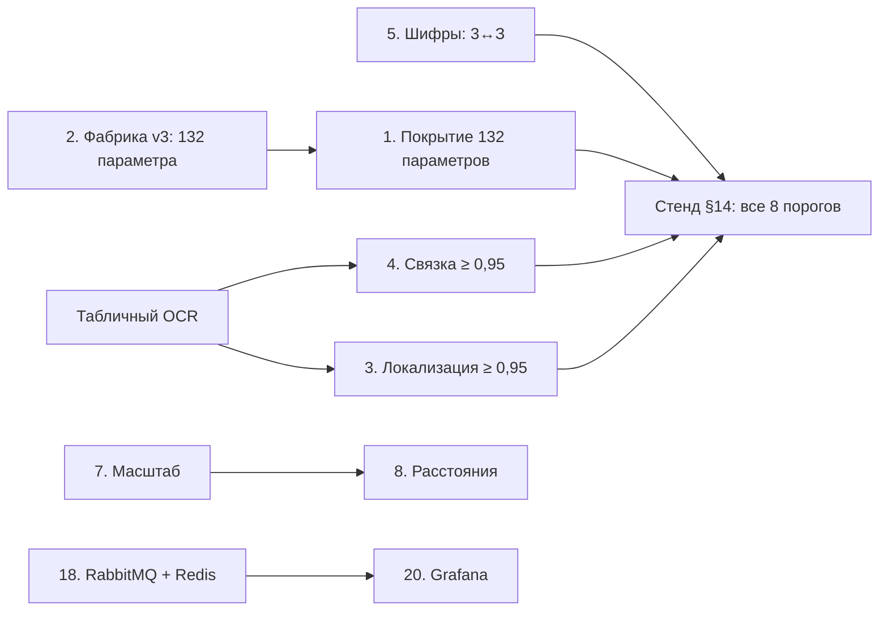

# Топ-20 требований ТЗ для итерации 3

Отбор идёт только из атомов исходного ТЗ (`docs/tz/tz-decomposition.yaml`), которые ещё не закрыты полностью.
Главный критерий — что проверит жюри: приёмка по §14 на скрытом тесте весит больше любой отдельной функции.

**Критерии ранжирования, по убыванию веса:**
1. Влияние на приёмку по §14. Недостижение любого порога означает «не принято» (TZA-14.3-08).
2. Приоритет, заданный в ТЗ: High, затем Medium, затем Low.
3. Прямое требование ТЗ, которое другие команды вероятнее всего пропустят.
4. Стоимость: делается ли без GPU, на маке или на `hk-nl-heavy`.

**Главная находка отбора.** Атомы «132 параметра» (TZA-1.2-01, TZA-7.1-02) в трассе значатся реализованными.
На деле извлечение и сравнение проверены синтетикой только по 15 параметрам из 132: в эталоне ответов v1
их 15, в gold фабрики v2 — 13. Правила и якоря есть на все 132, но проверки на данных нет. Скрытый тест
организатора пойдёт по всем разделам Матрицы, поэтому это пункт №1.

## Список

Трудоёмкость: S — до дня, M — 2–3 дня, L — неделя и больше.

| № | Атом ТЗ | Требование | Сейчас | Что сделать | Трудоёмкость | Нужен GPU |
|---|---|---|---|---|---|---|
| **P0 — приёмка по §14** | | | | | | |
| 1 | TZA-7.1-02 (High), TZA-1.2-01 | Извлечение и сверка по всем 132 параметрам Матрицы | ✅ в трассе, по данным — 15 из 132 | Замер покрытия по каждому параметру; добить якоря и нормализацию там, где извлечение пустое | L | нет |
| 2 | TZA-14.2-03 | В тесте — подтверждённые нарушения, отрицательные, MISSING_EVIDENCE, неприменимые, конфликт редакций | фабрика v2 покрывает 13 параметров | Фабрика v3: все 132 параметра и все пять классов исходов; корм для п. 1 | M | нет |
| 3 | TZA-14.3-04 | Локализация: file_id и страница точно, IoU ≥ 0,50 — не меньше 95 % групп | 0,933 — **не пройден** | Табличный режим OCR: ячейки по линиям таблицы, правые колонки на сканах не теряются | M | нет |
| 4 | TZA-14.3-03 | Связка документов ≥ 0,95 | 0,933 — **не пройден** | Та же причина, что в п. 3; плюс разбор каждой проваленной группы | S после п. 3 | нет |
| 5 | TZA-9.1.1-03 | Exact Match ключевых полей ≥ 0,90 | пройден, но у шифра 0,929, у номера помещения 0,933 | Постправка «3» ↔ «З» и «0» ↔ «О» в шифрах по словарю реестра; запас до порога | S | нет |
| 6 | TZA-11-01…05, 11-09, 11-10 | Время загрузки, OCR на 100 и 500 страниц, сравнения, протокола, пересчёта; p95 API ≤ 200 мс | не измерено | Бенчмарк на маке; узкие места — на ансамбле OCR, он кратно медленнее одного движка | M | для итоговых цифр прода |
| **P1 — прямые требования ТЗ, которые пропустят другие** | | | | | | |
| 7 | TZA-9.1.3-01 | Масштаб чертежа по размерной линейке | нет | Поиск размерной цепочки и подписи размера, расчёт мм на пиксель | M | нет |
| 8 | TZA-9.1.3-02 | Распознавание линий и измерение расстояний на чертеже | нет | Линии (Хаф/LSD) плюс масштаб из п. 7 → расстояние с bbox как доказательство | M | нет |
| 9 | TZA-5.N3-01 | Штампы «В производство работ» и «Выполнено согласно проекту» на чертежах ИД | 🟡 штамп находится, находки по его отсутствию нет | Правило MISSING_EVIDENCE по чертежу ИД без штампа; детектор уже есть | S | нет |
| 10 | TZA-5.N2-02 | На сканах — подписи, печати, даты, регистрационные номера | 🟡 нет регистрационного номера | Извлечение рег. номера по шаблонам рядом с датой и печатью | S | нет |
| 11 | TZA-4-02 | Спецификации (ГОСТ 21.110), ведомости, общие данные, сметы, расчёты | 🟡 вид документа не классифицируется | Классификатор вида документа по заголовку и форме таблицы; от вида зависит применимость параметров | M | нет |
| 12 | TZA-9.1.2-02 | Семантические якоря на Sentence-BERT (all-MiniLM-L6-v2) или аналоге | лексическое сопоставление | MiniLM на CPU (≈90 МБ) — **нужно «да» владельца: на диске 13 ГБ** | S | нет |
| 13 | TZA-2-01 | Перечень из 13 нормативных актов в редакциях на июль 2026 | 🟡 3 из 13 | Наполнить справочник норм оставшимися 10 актами; поиск BM25 уже работает | M | нет |
| **P2 — хвосты прототипа, дёшево** | | | | | | |
| 14 | TZA-9.3.6-02 | Не более 3 кликов на одно нарушение | 🟡 код есть, теста нет | UI-тест Playwright, который считает клики | S | нет |
| 15 | TZA-10-06 | Rejection_Log — лог отклонений для дообучения | 🟡 отклонения только в decisions | Таблица и поля ai_verdict, suggested_fix | S | нет |
| 16 | TZA-10-07 | Dispute_Log — спорные случаи с комментариями инспектора и ИИ | ⬜ | Таблица; наполняется из «Требует уточнения» и из ответов советника | S | нет |
| 17 | TZA-7.10-03 (Medium) | Отчёт формируется еженедельно автоматически | ⬜ | Планировщик в API; отчёт уже строится по запросу | S | нет |
| **P3 — минимальный эксплуатационный контур** | | | | | | |
| 18 | TZA-1.5-05, TZA-9.1.5-02 | RabbitMQ между модулями, кэш в Redis | профиль gpu — только флаг в конфиге | Адаптеры очереди и кэша плюс docker-compose профиля gpu | M | нет |
| 19 | TZA-12.11-01 | Антивирусная проверка файлов до сохранения | нет | ClamAV в конвейере приёма; заражённый файл отклоняется с кодом | S | нет |
| 20 | TZA-13.5-01 | Интеграция с Prometheus и дашборды Grafana | метрики отдаются, дашбордов нет | Дашборд Grafana поверх `/metrics` в docker-compose из п. 18 | S | нет |

## Что сознательно не вошло

| Атом | Почему не сейчас |
|---|---|
| TZA-7.4-04 (High) — управляемое дообучение | Единственное, что требует GPU. Сначала нужны данные из п. 1–2 и журнал отклонений из п. 15, иначе дообучать не на чем |
| TZA-9.2.0-02 — протокол по Приложению № 2 | Образца нет в материалах (GAP-INSP-02) — вопрос к организатору, не к коду |
| TZA-11-08 — CV-анализ DWG за 30 с | DWG не поддерживается вовсе; конвертер DWG тяжёлый, а в материалах чертежи приходят в PDF |
| TZA-9.5-04 — ML-паттерн-анализ по истории | Нет исторических данных |
| TZA-5.N1-01, 9.6.2-03, 12.10-01 — УКЭП | Криптопроверка ГОСТ-подписи требует сертифицированного СКЗИ; в прототипе не проверить |
| TZA-11-11…15, 12.x, 13.6–13.7 — SLA, RTO/RPO, TLS, бэкапы, IDS, ELK | Имеют смысл только на прод-хосте; выкатка — отдельное решение владельца |
| TZA-9.3.6-01, 9.3.6-03 — 30 минут на протокол, юзабилити на 5 инспекторах | Нужны живые инспекторы (GAP-INSP-01) |

## Порядок и эффект

Если закрыть P0, стенд §14 на синтетике переходит в «принято» по всем восьми порогам и опирается на все 132 параметра, а не на 15.
P1 даёт демо-аргументы, которых нет у других: измерение по чертежу, реквизиты, классификация документов.
P2 закрывает последние незакрытые атомы прототипа: после него «не начато» — 0.
