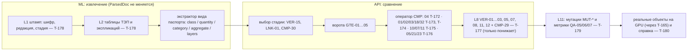

# План волны W1

## Цель

Все 47 параметров волны W1 (каталог TO-BE §16–17, реестр `data/seed/w1-wave.json`) извлекаются из ПД, РД и ИД,
сравниваются своими операторами CMP и проходят ворота L6 и проверки L8. Качество каждого параметра и оператора
измерено: Precision, Recall, F1, FPR и доля воздержаний, на мутациях и на реальных объектах. Стоп-код не ориентир.

## Архитектура — ADR-0008

## Задачи и владение

Одна задача — одна ветка — один worktree `~/code/building-tech-t<NNN>` со **своим** `ml/.venv` (память
`worktree-venv-symlink-gate`). Номера правил ГЕРЫ выданы диапазонами: чужой диапазон не занимать.

| Задача | Ветка | Что | Параметры | Правила 03-services |
|---|---|---|---|---|
| T-171 | `plan/t171-w1` | Координация: план, ADR-0008, реестр W1, ревью, интеграция, таблица качества | все | — |
| T-172 | `feat/t172-cmp04-scales` | CMP-04 тираж шкал с М-023, CMP-26 для ИД | M-015, 021, 022, 050, 055, 056, 057, 069, 103, 107, 109, 124 | 2.2.40–2.2.49, 3.1.30–3.1.39 |
| T-173 | `feat/t173-building-numbers` | CMP-01/02/03/06/18 — показатели здания Р1 ПЗ и ССР | M-004, 005, 006, 008, 009, 013, 019, 020, 132 (+ M-001) | 2.2.50–2.2.54, 3.1.40–3.1.44 |
| T-174 | `feat/t174-loads-balance` | CMP-03/02/32 — нагрузки, расходы, балансы против ТУ, толщины и диаметры | M-014, 016, 017, 018, 062, 067, 069, 073, 079, 112, 125, 128, 131 (+ 002, 003, 046, 077) | 2.2.55–2.2.59, 3.1.45–3.1.49 |
| T-175 | `feat/t175-agg-count` | CMP-10 AGG-SUM, CMP-07 COUNT, CMP-11, CMP-08; корень VER-12 | M-002, 003, 006, 007, 010, 011, 046, 067, 077 | 2.2.60–2.2.69, 3.1.50–3.1.59 |
| T-176 | `feat/t176-subst-layers` | CMP-05 SUBST, CMP-21 LAYER-SEQ, CMP-23 TEXT-SEM, CMP-09 | M-003, 032, 044, 050, 072, 075, 079, 125, 128, 130 | 2.2.70–2.2.79, 3.1.60–3.1.69 |
| T-177 | `feat/t177-gates-l8` | Ворота GTE-04/05, L8 VER-01…03, 05, 07, 08, 11, 12, пост-оператор CMP-29 | все | 3.1.70–3.1.89, 1.5.2–1.5.9 |
| T-178 | `feat/t178-l1-l3` | L1 штамп (IDN), L2 таблицы ТЭП и экспликаций, ENT-15/16 общим API | все | 2.1.30–2.1.39, 2.2.80–2.2.89 |
| T-179 | `feat/t179-mutations` | L11: генератор MUT-01…08, 11, 12, 17, 18, метрики QA-05/06, гейт QA-07, метки в эталон T-156 | все | 6.5.40–6.5.49 |
| T-180 | `feat/t180-w1-real` | Замер на реальных объектах (GPU через T-165), таблица качества, справка владельцу | все | 6.5.50–6.5.54 |

Номер миграции БД — следующий свободный на момент влития (память `test-harness-gotchas`).

## Порядок

1. **Сразу, параллельно:** T-172 (самый дешёвый прирост: шкалы на готовом движке), T-179 (стенд мутаций —
   без него качество не измерить), T-177 (понижающий слой общий для всех операторов).
2. **Когда освободится место** (диск и замок `heavy.sh`): T-173 → T-174 → T-175 → T-176 → T-178.
   Одновременно не больше четырёх веток: каждая стоит около 1 ГБ диска, свободно ~20 ГБ (правило №0).
3. **Интеграция:** координатор сливает ветки в `integration/w1` (не в `main`), гоняет гейт и стенд мутаций
   на сумме изменений.
4. **Реальные объекты:** T-180 на GPU-сервере через CTO-сессию T-165 — после влития её кэша разбора.
5. **Влитие в `main` и выкат на демо** — только после «да» владельца на список изменений.

## Готово (для каждой задачи)

- Правила в своём диапазоне `docs/gera/inspector/03-services.md`, связи `model.yaml → impl` (код и тест),
  `pnpm trace:check` зелёный.
- Каждое правило сначала тестом в `apps/api/tests/domain-*.test.ts` (или `ml/tests/test_*.py`); новый тестовый файл
  сразу в `apps/api/vitest.unit.config.ts` и `echelons.json`.
- Гейт `scripts/heavy.sh scripts/local-gate.sh` зелёный в своём worktree со своим venv.
- Мутационный скор ≥ 70 % по новым модулям (Stryker `--concurrency 2`, mutmut `--max-children 2`, под `heavy.sh`).
- Для каждого оператора — строка качества на стенде мутаций T-179: ≥ 100 положительных и ≥ 100 отрицательных.
- QA-отчёт `docs/qa/QA-REPORT-T<NNN>.md` по `~/Documents/Claude/qa-standard/docs/qa-report.template.md`.
- Новая поверхность атаки (парсер, маршрут, модель) — точечный OWASP-аудит `OWASP/audits/2026-09-28-*-T<NNN>/`.
- Задача переезжает в `tasks/03-testing/`, ветка запушена; в `main` не вливать.

## Ограничения

- `PARSER_REV = 4`, `ParsedDoc`, `parse_file` не менять до влития T-165. С влитием T-184 (OCR сканов на GPU: PP-OCRv5 +
  PaddleOCR-VL, решение владельца 28.09 «никакого Tesseract на CPU») PARSER_REV поднимается: извлечение W1 строится на
  контракте `ParsedDoc` (текст, строки, слова, рамки, источник страницы) и не опирается на артефакты Tesseract —
  его уверенность слова, разбивку на слова, флаг `disputed` ансамбля. Тест, который проверяет такую особенность, — дефект.
- Корпус `corpus-ABC` и реальные документы — никогда в репо, тесты, демо, скриншоты (ADR-0002). Тесты — синтетика.
- Тяжёлое — только `scripts/heavy.sh`; мутации — 2 потока; свободный диск < 20 ГБ — тяжёлое не запускать.
- Не дублировать соседние сессии: T-164 (трасса), T-165 (М-023 на трёх объектах, GPU), T-166 («Объекты»),
  T-169 (серверный импорт), T-170 (правила по аудиту трассы).

## Параметры W1

| Код | Параметр | Ед. | Операторы (§17) | Задачи |
|---|---|---|---|---|
| M-001 | Площадь застройки | м² | CMP-01, CMP-15 (W2) | T-173 |
| M-002 | Общая площадь здания | м² | CMP-02, CMP-10 | T-174, T-175 |
| M-003 | Полезная / Расчетная площадь | м² | CMP-03, CMP-10, CMP-23 | T-174, T-175, T-176 |
| M-004 | Строительный объем (Общий) | м³ | CMP-02, CMP-03 | T-173 |
| M-005 | Строительный объем (Подземный) | м³ | CMP-03, CMP-18 | T-173 |
| M-006 | Строительный объем (Надземный) | м³ | CMP-03, CMP-07 | T-173, T-175 |
| M-007 | Этажность (надземная) | ед. | CMP-07 | T-175 |
| M-008 | Высота здания | м | CMP-03, CMP-18 | T-173 |
| M-009 | Абсолютная отметка 0.000 | м | CMP-01 | T-173 |
| M-010 | Количество квартир | шт. | CMP-07, CMP-10 | T-175 |
| M-011 | Квартирография | шт. | CMP-11, CMP-08 | T-175 |
| M-013 | Технологическая мощность / Вместимость | ед. | CMP-03, CMP-01 | T-173 |
| M-014 | Расчетная электрическая мощность | кВт | CMP-03, CMP-32 | T-174 |
| M-015 | Категория надежности электроснабжения | Кат. | CMP-04 | T-172 |
| M-016 | Суточный расход водопотребления | м³/сут | CMP-03, CMP-32 | T-174 |
| M-017 | Суммарная тепловая нагрузка | Гкал/ч | CMP-03, CMP-32 | T-174 |
| M-018 | Максимальный часовой расход газа | м³/ч | CMP-03, CMP-32 | T-174 |
| M-019 | Коэффициент застройки (КЗ) | % | CMP-03, CMP-06, CMP-10 | T-173, T-175 |
| M-020 | Коэффициент использования территории (КИТ) | % | CMP-03, CMP-06, CMP-10 | T-173, T-175 |
| M-021 | Класс энергетической эффективности | Буква | CMP-04 | T-172 |
| M-022 | Степень огнестойкости здания | Степень | CMP-04 | T-172 |
| M-023 | Класс конструктивной пожарной опасности | Класс (С0, С1) | CMP-04 | T-172 |
| M-032 | Конструкция дорожной одежды | мм (слои) | CMP-21 | T-176 |
| M-044 | Послойный состав пирога кровли | мм (слои) | CMP-21, CMP-05, CMP-09 | T-176 |
| M-046 | Общее количество и габариты оконных блоков | шт. / м² | CMP-07, CMP-13 (W2), CMP-10 | T-175 |
| M-050 | Спецификация и типы внутренней отделки помещений | Класс (КМ) | CMP-04, CMP-05 | T-172, T-176 |
| M-055 | Класс прочности бетона монолитных конструкций | Марка (B) | CMP-04, CMP-26 | T-172 |
| M-056 | Марка стали и класс прочности металлопроката | Марка (С) | CMP-04, CMP-26 | T-172 |
| M-057 | Марка и класс прочности рабочей арматуры | Класс (А) | CMP-04, CMP-26 | T-172 |
| M-062 | Диаметр продольной (рабочей) арматуры в колоннах/пилонах | мм | CMP-03 | T-174 |
| M-067 | Ведомости расхода материалов (бетон, сталь) | м³ / т | CMP-02, CMP-10 | T-174, T-175 |
| M-069 | Сечение жил и маркировка распределительных кабелей | мм² | CMP-03, CMP-04 | T-172, T-174 |
| M-072 | Материал и класс давления напорных труб В1/Т3 | Марка | CMP-05 | T-176 |
| M-073 | Характеристики насосных станций хоз-питьевого водоснабжения | м³/ч / м / кВт | CMP-03 | T-174 |
| M-075 | Материал и тип канализационных труб и фасонных частей | Марка | CMP-05 | T-176 |
| M-077 | Технические параметры отопительных приборов (радиаторов) | Вт / шт. | CMP-07, CMP-03, CMP-20 (W2) | T-174, T-175 |
| M-079 | Характеристики вентиляторов общеобменной вентиляции | м³/ч / Па / кВт | CMP-03, CMP-05, CMP-19 (W2) | T-174, T-176 |
| M-103 | Пределы огнестойкости противопожарных дверей и ворот (EI) | мин | CMP-04, CMP-26 | T-172 |
| M-107 | Класс пожарной опасности отделочных материалов | Класс (КМ) | CMP-04 | T-172 |
| M-109 | Пожарная маркировка кабелей систем ПЗ (СПЗ) | Марка | CMP-04 | T-172 |
| M-112 | Производительность вентиляторов ДУ и подпора воздуха | м³/ч / Па | CMP-03 | T-174 |
| M-124 | Класс энергетической эффективности здания | Буква | CMP-04 | T-172 |
| M-125 | Толщина теплоизоляционного слоя наружных стен | мм | CMP-03, CMP-21 | T-174, T-176 |
| M-128 | Толщина утеплителя чердачных перекрытий / кровли | мм | CMP-03, CMP-21 | T-174, T-176 |
| M-130 | Установка энергосберегающего осветительного оборудования | - | CMP-05 | T-176 |
| M-131 | Удельный годовой расход тепловой энергии на отопление | кВт·ч/м² | CMP-03 | T-174 |
| M-132 | Итоговая стоимость по Сводному сметному расчету (ССР) | тыс. руб. | CMP-02 | T-173 |

Счёт по операторам W1: CMP-03 — 21, CMP-04 — 13, CMP-10 — 7, CMP-05 — 6, CMP-07 — 5, CMP-02 — 4, CMP-26 — 4,
CMP-21 — 4, CMP-32 — 4, CMP-01 — 3, CMP-06 — 2, CMP-18 — 2, CMP-08, 09, 11, 23 — по 1. Геометрия и топология
(CMP-13, 15, 19, 20) — волна W2.

## Таблица качества (итог T-180)

Строка на пару «параметр × оператор» и сводная строка на оператор:
`код | оператор | мутации: n+ / n− | P | R | F1 | FPR | воздержания | реальные: n | P | R | FPR | воздержания`.
Интервалы — Уилсон 95 % (один объект) или бутстрэп по объектам (OS-INSP-6.5.10). Воздержание — MISSING_EVIDENCE,
NOT_COMPARABLE, CLARIFICATION_REQUIRED на примере, где истинная метка известна.

## Журнал сведения в `integration/w1` (что учесть при сборке)

- T-175 × T-179: в `ml/eval/mutations/w1.json` у М-007 и М-010 `wired: true`, единицы, диапазоны, правило `abs tol 0`,
  счётчики MUT-05/12/17/18 — по сообщению T-175 28.09 05:31; включать только вместе с паспортами T-175.
- T-174 × T-172/T-175/T-176: вторые операторы параметра — в `parts` одного паспорта (механизм T-174, d89af1b);
  `data/seed/passports/parts/*.json` при сведении переносятся в основной файл.
- T-173 — владелец движка количества (включены W3 68601bb, 160c74a, eb710c9); T-174 и W3 T-211 стоят на нём.
- EXTRACT_REV: в ветках — как в main; при каждом влитии, меняющем извлечение, вливающий поднимает на +1.
