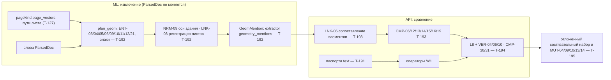

# План волны W2

## Цель

Все 50 параметров волны W2 (каталог TO-BE §16–17, реестр `data/seed/w2-wave.json`) извлекаются из ПД, РД и ИД,
сравниваются своими операторами и проходят ворота L6 и проверки L8. Вместе с W1 (47) это 97 из 132 параметров
Матрицы — 73,5 %. Качество каждого оператора измерено на **отложенном состязательном наборе** (T-195), а не на
генераторе, по которому писался код.

| Путь | Параметров | Доля от 132 | С W1 нарастающим | Что нужно |
|---|---|---|---|---|
| text — текст и таблицы, операторы W1 | 19 | 14,4 % | 50,0 % | паспорта; виды CMP-05/07/09 — из W1 T-175/T-176 |
| entity — сущности только с чертежа, операторы W1 | 15 | 11,4 % | 61,4 % | извлечение T-192 + паспорта T-193 |
| geometry — операторы геометрии и топологии | 16 | 12,1 % | 73,5 % | извлечение T-192 + операторы T-193 + L8 T-194 |

## Архитектура — ADR-0010

## Задачи, ветки и владение

Одна задача — одна ветка — один worktree `~/code/building-tech-w2-<ветка>`. Мак — только редактор (ADR-0009):
тесты, гейт, мутации — `scripts/remote-run.sh` на 158.255.3.179; `--light` для одного файла, heavy-полоса W2 — ядра
16–23 после разбора T-165 (до этого код 75). Номера правил ГЕРЫ — только из своего диапазона.

| Задача | Ветка | Что | Параметры | Правила 03-services |
|---|---|---|---|---|
| T-190 | `feat/w2-plan` | Координация: план, ADR-0010, реестр, контракт, ревью, влитие, таблица качества | все | — |
| T-191 | `feat/w2-text-params` | Паспорта 16 параметров текстового пути на видах W1 (M-041, 105, 117 — в T-193) | text (16) | 2.2.100–2.2.109, 3.1.100–3.1.109 |
| T-192 | `feat/w2-geom-extract` | `plan_geom`: ENT-03…06, 09…12, 21, знаки по легенде; NRM-09; LNK-03; генератор планов разработки | entity + geometry (31) | 2.4.20–2.4.44, 2.2.110–2.2.124 |
| T-193 | `feat/w2-cmp-geom` | Паспорт `geometry`, `norm.ref`, `norms.json`, LNK-06, CMP-06, 12, 13, 14, 15, 16, 19; маршрут в `inspections.ts` | entity + geometry (31) + M-041, 105, 117 | 2.4.45–2.4.52, 3.1.110–3.1.124, 2.2.125–2.2.129 |
| T-194 | `feat/w2-verify-xdisc` | VER-04, 06, 09, 10 в понижающем слое; CMP-30 внутренняя, CMP-31 между разделами | все | 2.4.53–2.4.59, 3.1.125–3.1.139 |
| T-195 | `feat/w2-verify-xdisc` (подветка `feat/w2-holdout`) | Отложенный состязательный набор, MUT-04/09/10/13/14, NEG-01…03, метрики QA-05/06 по операторам W2 | все | 6.5.60–6.5.69 |
| T-196…T-209 | — | резерв на дефекты и доработки волны | | |

## Порядок

1. **Сразу, параллельно:** T-191, T-192, T-193 (на фикстурах контракта), T-195 (независимый автор; генератор
   T-192 не читает). T-194 — сразу по VER-04/06/10 и CMP-30/31 на фикстурах.
2. **Когда T-192 выдаёт реальные `GeomMention`:** сквозной прогон T-193 на наборе разработки, затем замер на
   отложенном наборе T-195.
3. **Зависимости от W1:** L8 (`verify-l8.ts`) — T-177, стенд мутаций — T-179, виды CMP-05/07/09 по тексту — T-175/T-176.
   Ветка W2 вливает в себя нужную ветку W1 после её влития в `plan/t171-w1`/`main`; до этого — работа на своих
   фикстурах, без копирования чужого кода.
4. **Интеграция:** тимлид сливает ветки в `feat/w2-plan`, гоняет гейт и замер на сумме. Влитие в `main` — после W1,
   по порядку, номер миграции и `EXTRACT_REV` — следующие свободные на момент влития.
5. **Выкат на демо и прод** — только после «да» владельца на список изменений.

## Готово (для каждой задачи)

- Правила в своём диапазоне `docs/gera/inspector/03-services.md` под существующими операциями BO-INSP-2.2, 2.4, 3.1,
  6.5; связи `model.yaml → impl` (код и тест); `pnpm trace:check` зелёный на раннере.
- Каждое правило сначала тестом: `apps/api/tests/domain-geom-*.test.ts` или `ml/tests/test_plan_geom*.py`; новый
  файл сразу в `apps/api/vitest.unit.config.ts` и `echelons.json`, маркеры эшелонов `l1_functional`…`l8_regression`.
- Гейт `scripts/remote-run.sh scripts/local-gate.sh` зелёный на HEAD ветки (без `--wip`).
- Мутационный скор ≥ 70 % по логике новых модулей (Stryker `MUTATE=src/domain/geom-*.ts`, mutmut по `plan_geom*.py`).
- Для каждого оператора — строка качества на **отложенном** наборе T-195: ≥ 100 положительных и ≥ 100 отрицательных,
  P, R, F1, FPR, доля воздержаний, интервалы Уилсона 95 %. Цель каталога §12: Precision ≥ 0,90, FPR ≤ 0,10.
- QA-отчёт `docs/qa/QA-REPORT-T<NNN>.md` по `~/Documents/Claude/qa-standard/docs/qa-report.template.md`.
- Новая поверхность атаки (парсер путей PDF, новый вид паспорта) — точечный аудит `OWASP/audits/2026-09-28-*-T<NNN>/`.

## Ограничения

- `PARSER_REV`, `ParsedDoc`, `parse_file` не менять (ADR-0008 п. 5). Геометрия — свой проход pdfium под `PDFIUM_LOCK`.
- Без новых зависимостей (ADR-0010 п. 2). PyMuPDF — никогда (AGPL).
- Корпус `corpus-ABC` и реальные документы — никогда в репо, тесты, скриншоты, на раннере (ADR-0002). Только синтетика.
- На маке не запускать `pnpm install`, `uv sync`, `docker build`, тесты. GPU и `/opt/inspector` — T-165.
- Лист на CV-анализ ≤ 30 с (OS-INSP-2.4.7): тот же предел для `plan_geom`, превышение → NOT_COMPARABLE, частичного нет.

## Параметры W2

Полный список с операторами, сущностями и триггерами — `data/seed/w2-wave.json`.

| Путь | Параметры |
|---|---|
| text (T-191) | M-024, 029, 041, 045, 052, 066, 086, 088, 093, 094, 105, 110, 115, 117, 120, 123, 126, 127, 129 |
| entity (T-192 → T-193) | M-012, 036, 037, 038, 039, 049, 058, 059, 061, 071, 074, 076, 113, 116, 121 |
| geometry (T-192 → T-193, T-194) | M-025, 026, 027, 028, 030, 040, 054, 060, 064, 068, 078, 080, 104, 108, 111, 119 |

Счёт по операторам в строках W2 (`w2-wave.json`): CMP-03 — 21, CMP-07 — 12, CMP-06 — 12, CMP-05 — 7, CMP-12 — 7,
CMP-09 — 7, CMP-13 — 5, CMP-02 — 4, CMP-04 — 3, CMP-16 — 3, CMP-08, 14, 24, 19 — по 2, CMP-01, 11, 18, 26, 29, 32 — по 1.
Владельцы общих операторов (`docs/ops/WAVES.md`, bcb62d5): CMP-07 COUNT и CMP-10, CMP-08 — W1 T-175; CMP-05 — W1 T-176;
CMP-09 PRESENCE — W3 T-212 (`domain/presence-param.ts`). W2 их не пишет: T-193 даёт счёт и наличие знаков по чертежу
(`symbols` T-192) как второй источник для двойного подсчёта в их операторах.
