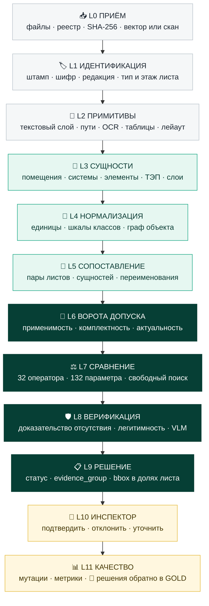

# «Инспектор ИИ»: целевой (TO BE) каталог операций распознавания и сравнения ПД / РД / ИД

Версия 1.0 · команда «Надзориум» · ЛЦТ 2026, кейс Мосгосстройнадзора

Документ описывает **полный целевой набор операций**, которые должна выполнять система, чтобы достичь метрик ТЗ (Precision ≥ 0,90, Recall ≥ 0,80, FPR ≤ 0,10, Exact Match ключевых полей ≥ 0,90, связка ≥ 0,95, IoU доказательств ≥ 0,5). Это не план спринта, а эталонная «карта всех движений»: от приёма байтов PDF до решения инспектора и возврата метки в GOLD. Для хакатона из неё вырезается MVP (раздел 16).

---

## Содержание

1. Как читать документ
2. Семь принципов, на которых держится каталог
3. Сквозной конвейер (схема)
4. L0 Приём и целостность
5. L1 Идентификация документа, листа и редакции
6. L2 Примитивы: текст, векторы, растр, таблицы
7. L3 Извлечение сущностей
8. L4 Нормализация и граф объекта
9. L5 Сопоставление между стадиями
10. L6 Ворота допуска (до сравнения)
11. L7 Каталог операторов сравнения (32 оператора)
12. L8 Верификация и защита от ложных срабатываний
13. L9 Решение, статус, карточка доказательств
14. L10 Инспектор в контуре
15. L11 Качество: мутации, метрики, регресс
16. Приоритизация: волны внедрения
17. Матрица M-001…M-132 → операции
18. Трассировка пилотной разметки → операции
19. Применимость операторов по сценариям загрузки
20. Справочники: коды причин, шкалы, словари

---

## 1. Как читать документ

Каждая операция имеет стабильный идентификатор `СЛОЙ-NN` (например, `ENT-07`, `CMP-19`), по которому на неё ссылаются правила Матрицы, логи и карточки доказательств. Идентификатор операции пишется в `evidence_group.provenance`, чтобы любой finding можно было воспроизвести.

**Метод выполнения** обозначен меткой:

| Метка | Значение | Где допустимо |
|---|---|---|
| **[Д]** | Детерминированный алгоритм, правило, геометрия, регулярное выражение | Везде; единственный метод, который может формировать CANDIDATE самостоятельно |
| **[ML]** | Обучаемая модель: OCR, детектор, классификатор, эмбеддинги | Извлечение и классификация; выход всегда с уверенностью |
| **[VLM]** | Мультимодальная LLM на кропах | Классификация, чтение легенды, верификация кандидата; **только понижает** статус, никогда не повышает |
| **[LLM]** | Текстовая LLM над JSON-подграфами | Свободный поиск (SUSPICION), объяснения, ранжирование |
| **[Ч]** | Человек (инспектор, куратор данных) | CONFIRMED_VIOLATION, выбор авторитетной редакции, разметка |

**Уровень детализации** операции задан столбцами «Вход → Выход», «Как», «Инструмент», «Контроль / при сбое». Колонка «при сбое» всегда называет статус, в который уходит результат, если операция не смогла отработать надёжно. Это ключ к Precision: система не угадывает, она воздерживается.

---

## 2. Семь принципов, на которых держится каталог

1. **Сравниваем графы, а не картинки.** Лист любого типа (схема, план, спецификация, акт) переводится в узлы и рёбра объекта. Сравнение «схема ПД ↔ план РД» возможно только на уровне графа (`LNK-08`, `CMP-19`, `CMP-20`).
2. **Текст важнее пикселей.** В векторном PDF номера помещений, марки систем и позиции лежат как Unicode с координатами. Первый источник истины - текстовый слой (`PRM-01`), OCR - запасной (`PRM-09`).
3. **Отсутствие надо доказать.** «Не нашли» ≠ «нет». Любой вывод REMOVED / отсутствует проходит `VER-05` (доказательство покрытия): лист найден, разобран, область покрыта, синонимы и переименования проверены, другие листы дисциплины просмотрены.
4. **Уточнение ≠ изменение.** РД законно детализирует ПД. Оператор сравнения знает уровень детализации обеих сторон (`VER-07`), иначе порождает лавину ложных срабатываний.
5. **Каждое различие проверяется на легитимность.** До CANDIDATE система ищет согласованное изменение (`CMP-29`): облако ревизии, номер изменения, ведомость изменений, откорректированную ПД.
6. **Атомарность и корень.** Один finding = один факт одного параметра. Каскады (площадь помещения → площадь этажа → ТЭП) группируются под корневое расхождение (`VER-12`).
7. **Каждое значение несёт происхождение.** file_id, SHA-256, страница, bbox в долях листа [0;1], метод, уверенность. Без этого finding не засчитывается метрикой и не попадает в GOLD.

---

## 3. Сквозной конвейер



Цвета: серый - подготовка данных, зелёный - построение модели объекта, тёмно-зелёный - принятие решения системой, жёлтый - человек и качество.

**Параллелизм.** L0-L2 выполняются постранично в очередях RabbitMQ (`vector`, `ocr`, `vlm`); L3-L5 - по объекту и дисциплине; L6-L9 - по параметру; при дозагрузке пересчитываются только параметры, чьи источники изменились (`DEC-07`).

---

## 4. L0 Приём и целостность

| ID | Операция | Вход → Выход | Как | Инструмент | Контроль / при сбое |
|---|---|---|---|---|---|
| ING-01 | Регистрация файла | байты → file_id, SHA-256, размер, MIME, uploaded_at | [Д] хеш по потоку, file_id неизменяем, перезапись запрещена | hashlib, MinIO | Формат вне PDF/DOCX/XML/(DWG/DXF/IFC) → отклонить с перечнем форматов; > 50 МБ или пакет > 200 МБ → отклонить с лимитом |
| ING-02 | Антивирусная проверка | файл → clean / infected | [Д] до записи в хранилище | ClamAV | infected → отклонить, событие в Audit_Log |
| ING-03 | Приём машиночитаемого реестра файлов | CSV/XLSX/JSON → строки реестра | [Д] валидация по схеме: object_id, file_id, doc_stage, discipline, document_code, revision, approval_status, approval_date, sheet_page_range, predecessor/successor, signature_status | pydantic, JSON Schema | Нет реестра → пакет CLARIFICATION_REQUIRED; поля реестра позже сверяются со штампом (`IDN-02`), расхождение - отдельный сигнал |
| ING-04 | Проверка целостности PDF | PDF → ok / repaired / broken | [Д] открытие, xref, потоки, шифрование, попытка ремонта | qpdf --check, pikepdf, PyMuPDF | broken → отклонить, уведомить; repaired → флаг `repaired` в provenance |
| ING-05 | Постраничный манифест | PDF → по каждой странице MediaBox, CropBox, Rotate, UserUnit, размер в мм, формат (А1, А3×4…) | [Д] | PyMuPDF | Вычислить и сохранить матрицу `page → view[0;1]` (учёт Rotate и смещения CropBox) - основа всех bbox |
| ING-06 | Классификация природы страницы | страница → VECTOR / SCAN / HYBRID / VECTOR_TEXT_AS_CURVES / EMPTY | [Д] признаки: число символов текстового слоя, число путей, доля площади изображений, наличие полностраничного изображения, «шум» из коротких штрихов высотой шрифта | PyMuPDF `get_text`, `get_drawings`, `get_images` | Определяет ветку L2; HYBRID обрабатывается обеими ветками по зонам |
| ING-07 | Извлечение электронной подписи | PDF / .sig → наличие, подписант, время, целостность | [Д] PAdES/CMS | pyHanko, OpenSSL | Результат пишется в signature_status; юридическая проверка УКЭП вне ядра сравнения |
| ING-08 | Разбор DOCX | DOCX → абзацы, таблицы, встроенные изображения | [Д] | python-docx, extract-text | Встроенные изображения таблиц → ветка SCAN |
| ING-09 | Разбор XML (ПЗ, ИД по схемам Минстроя) | XML → дерево + валидация по XSD | [Д] | lxml | Невалидный XML → NOT_COMPARABLE для зависящих параметров; валидный XML - приоритетный источник значений |
| ING-10 | Опциональный CAD/BIM-канал | DWG/DXF/IFC → слои, блоки, атрибуты, IfcSpace, IfcDistributionSystem | [Д] | ODA File Converter + ezdxf, IfcOpenShell | Строит граф напрямую; обязательно сверяется с подписанным PDF (`VER-06`), расхождение DWG и PDF - сигнал |
| ING-11 | Дедупликация | страницы → группы дубликатов | [Д] точный хеш файла + перцептивный хеш страницы + совпадение штампа | imagehash | Дубли не удваивают доказательства; в карточке ссылка на первичный экземпляр |
| ING-12 | Кэш по хешу | SHA-256 → готовые результаты L1-L4 | [Д] | Redis | Повторная загрузка того же файла не пересчитывается |
| ING-13 | Дифф манифеста при дозагрузке | новый пакет → added / replaced / unchanged | [Д] | - | Запускает инкрементальный пересчёт (`DEC-07`); после PROTOCOL_FINALIZED только уведомление |

---

## 5. L1 Идентификация документа, листа и редакции

| ID | Операция | Вход → Выход | Как | Инструмент | Контроль / при сбое |
|---|---|---|---|---|---|
| IDN-01 | Локализация основной надписи | страница → bbox штампа и его граф ячеек | [Д] поиск прямоугольной сетки линий в правом нижнем углу (с учётом Rotate), шаблоны форм основной надписи ГОСТ Р 21.101-2020; [ML] детектор для сканов | PyMuPDF, OpenCV, DocLayout-YOLO | Нет штампа → IDN-02 по реестру, флаг `no_title_block` |
| IDN-02 | Разбор полей штампа | ячейки → шифр, наименование объекта, наименование листа, стадия (П/Р), лист, листов, организация, ФИО, даты | [Д] текст по ячейкам + словарь подписей ячеек; [ML] OCR кропа для сканов; [VLM] только если оба не дали валидного значения | regex, PaddleOCR, Qwen2.5-VL | Валидация регулярными выражениями и сверка с реестром; Exact Match ≥ 0,90 - контрольная метрика |
| IDN-03 | Разбор таблицы изменений штампа | штамп → [Изм., Кол.уч., Лист, № док., Подп., Дата] | [Д] | - | Каждое изменение → узел `Change` в графе редакций; используется в `CMP-29` |
| IDN-04 | Детекция отметок изменений на поле листа | страница → облака ревизий, треугольники/кружки с номером изменения, их bbox | [Д] замкнутые «волнистые» полилинии (облака), треугольник + цифра рядом; [ML] для сканов | PyMuPDF, OpenCV | Облако рядом с различием = кандидат на согласованное изменение |
| IDN-05 | Разбор состава тома / комплекта | титул, содержание, «Ведомость рабочих чертежей основного комплекта», «Ведомость ссылочных и прилагаемых документов» → ожидаемый перечень листов | [Д] табличный разбор | pdfplumber | Основа комплектности (`IDN-13`) и отображения страница ↔ лист |
| IDN-06 | Отображение страница PDF ↔ номер листа | манифест + штампы → таблица соответствия | [Д] с учётом листов «1.1», «2а», пропусков, листов других марок в том же PDF | - | Конфликт со sheet_page_range реестра → CLARIFICATION_REQUIRED для листа |
| IDN-07 | Нормализация и разбор шифра | строка → компоненты: базовый код объекта/договора, стадия, раздел/марка, подраздел, номер тома | [Д] гомоглифы (`NRM-03`), дефисы, слэши, пробелы; библиотека шаблонов шифров проектных организаций | regex | Нераспознанный шифр → документ не участвует в связке, CLARIFICATION_REQUIRED |
| IDN-08 | Определение стадии и дисциплины | шифр + штамп + содержание → doc_stage (PD/RD/ID), раздел ПД по ПП РФ № 87, марка РД, вид ИД | [Д] таблица соответствий «раздел ПД ↔ марки РД» задаётся **конфигурацией проекта**, а не хардкодом (в пилоте ОВ проходит как «П-ИОС5.4.2» в ПД и «РД-ОВ1 / ОВ2.1» в РД) | YAML-справочник | Неоднозначность → CLARIFICATION_REQUIRED |
| IDN-09 | Классификация типа листа | страница → PLAN / SECTION / FACADE / PRINCIPAL_SCHEME / AXONOMETRIC / SPECIFICATION / SCHEDULE (ведомость) / GENERAL_DATA / DETAIL (узел) / SITE_PLAN / TEP_TABLE / EXPLICATION / TEXT / ASBUILT_SCHEME / ACT / CERTIFICATE / JOURNAL / GANTT | [Д] наименование листа из штампа («План на отм.», «Принципиальная схема», «Спецификация»); [ML] классификатор миниатюры; [VLM] арбитр при конфликте | CLIP-подобный классификатор, Qwen2.5-VL | Тип листа определяет, какие операторы вообще допустимы (`GTE-04`) |
| IDN-10 | Определение этажа, отметки, секции, фрагмента осей | наименование листа + содержимое → floor, elevation, section, axes_range | [Д] regex «План N этажа», «на отм. +3.300», «в осях 1-5/А-Г», «Секция 2» | regex | Без этажа план не участвует в поэтажных сравнениях |
| IDN-11 | Построение графа редакций | реестр + штампы + «Взамен», «Аннулирован», изменения → цепочки predecessor/successor | [Д] | NetworkX | Циклы, развилки, отсутствие утверждения → CLARIFICATION_REQUIRED |
| IDN-12 | Выбор актуальной применимой утверждённой редакции | граф редакций → одна редакция на (объект, стадия, шифр, лист) | [Д] правила ТЗ: последняя APPROVED / FOR_CONSTRUCTION; SUPERSEDED и CANCELLED - только для аудита | - | Метрика связки ≥ 0,95; устаревшая редакция никогда не эталон |
| IDN-13 | Контроль комплектности | ожидаемый состав (Матрица source_pd/rd/id + перечень ИД + ведомости) vs загруженное → PD/RD/ID_UPLOADED / PARTIAL / MISSING и сценарий FULL / PD_RD_ONLY / PD_ID_ONLY / RD_ID_ONLY / SINGLE_ONLY / PARTIALLY_LOADED | [Д] | - | Отдельная таблица протокола; не нарушение |
| IDN-14 | Детекция штампов ИД на листах РД | страница → «В производство работ», «Выполнено согласно проекту / с изменениями», подпись, дата | [ML] детектор прямоугольного штампа, цветовое разделение синих/красных чернил, OCR | OpenCV, PaddleOCR | Отсутствие штампа в комплекте ИД → CMP-25 |
| IDN-15 | Формирование пар кандидатов «лист ↔ лист» | все листы объекта → кортежи (дисциплина, этаж, секция, тип листа) по стадиям | [Д] | - | Вход для `LNK-02` |

---

## 6. L2 Примитивы: текст, векторы, растр, таблицы

### 6.1. Векторная ветка (VECTOR, HYBRID)

| ID | Операция | Вход → Выход | Как | Инструмент | Контроль / при сбое |
|---|---|---|---|---|---|
| PRM-01 | Извлечение текстового слоя | страница → символы и спаны: текст, bbox, шрифт, размер, цвет, вектор направления | [Д] `get_text("rawdict")` | PyMuPDF | Главный источник значений; Character Accuracy по тексту слоя близка к 1 |
| PRM-02 | Детекция «битой» кодировки | спаны → ok / garbled | [Д] доля словарных токенов, доля недопустимых символов, отсутствие ToUnicode | pymorphy3-словарь | garbled → OCR региона (`PRM-09`) |
| PRM-03 | Сборка слов и надписей | символы → токены, многострочные надписи, повёрнутый и вертикальный текст, индексы (м², ø), дроби, «±0.000» | [Д] кластеризация по базовой линии и направлению | - | Надписи вдоль воздуховода собираются с учётом угла |
| PRM-04 | Извлечение векторных путей | страница → линии, кривые, прямоугольники, заливки, цвет, толщина, штрих, замкнутость | [Д] `get_drawings()` | PyMuPDF | Счётчик путей и время в Monitoring_Metrics (ТЗ: CV ≤ 30 с на лист) |
| PRM-05 | Кластеризация путей в объекты | пути → графические группы (символ, контур, трасса) | [Д] `cluster_drawings()`, близость, общий стиль | PyMuPDF, Shapely | - |
| PRM-06 | Слои OCG | PDF → имена слоёв и принадлежность путей | [Д] | pikepdf | Имя слоя («ОВ_Воздуховоды», «АР_Стены») - сильный признак класса |
| PRM-07 | Текст, экспортированный кривыми (SHX) | кластеры коротких штрихов высотой шрифта → растр региона → OCR | [Д] детекция + [ML] OCR | OpenCV, PaddleOCR | Уверенность OCR ниже порога → LOW_QUALITY зона |
| PRM-08 | Размерные примитивы | пути + текст → размерные линии, засечки, выносные, значение | [Д] шаблон «линия + засечки на концах + число над линией» | - | Число без геометрии - только атрибут, без проверки масштаба |
| PRM-09 | Выноски и полки | пути + текст → leader: точка указания, полка, текст(ы) | [Д] полилиния, заканчивающаяся горизонтальной полкой с текстом | Shapely | Главный механизм привязки марки к элементу (`ENT-07`) |
| PRM-10 | Цветовые классы | пути → палитра страницы | [Д] кластеризация цветов; связь цвета с системой через легенду (`ENT-18`) | - | Цвет - подсказка, не доказательство |
| PRM-11 | Штриховки и заливки | заливки, повторяющиеся паттерны → зоны с типом штриховки | [Д] | - | Материал стены, зона тёплого пола, газон |

### 6.2. Растровая ветка (SCAN, HYBRID)

| ID | Операция | Вход → Выход | Как | Инструмент | Контроль / при сбое |
|---|---|---|---|---|---|
| PRM-12 | Адаптивная растеризация и тайлинг | страница → тайлы 200-400 dpi с перекрытием 15-25 % + матрица тайл → страница | [Д] dpi по плотности деталей; А0/А1 обязательно тайлами | PyMuPDF `get_pixmap` | Координаты всегда пересчитываются в систему страницы |
| PRM-13 | Предобработка скана | тайл → выровненный, очищенный | [Д] определение ориентации 0/90/180/270, deskew, denoise, бинаризация Sauvola, отделение цветных печатей | OpenCV, scikit-image | Остаточный наклон > 0,5° → флаг качества |
| PRM-14 | OCR печатного текста | тайл → токены с bbox и уверенностью на символ | [ML] детекция + распознавание, кириллица и латиница, словарь домена | PaddleOCR (осн.), Surya / docTR / Tesseract 5 (альт.) | Character Accuracy ≥ 0,95 на приёмочной выборке; рукописные зоны исключаются и помечаются ABSTAIN |
| PRM-15 | Склейка OCR по тайлам | токены тайлов → токены страницы | [Д] NMS по перекрытию, выбор версии с большей уверенностью | - | Разрезанные токены на границе тайла собираются заново |
| PRM-16 | Векторизация линий скана | тайл → отрезки, дуги | [ML/Д] LSD, Hough, морфология, трассировка | OpenCV | Только для геометрических операторов; точность ниже, порог допуска шире |
| PRM-17 | Детекция рукописи и нечитаемых зон | тайл → маска | [ML] | классификатор зон | В OCR-метрику не входят, но система обязана вернуть LOW_QUALITY / ABSTAIN |

### 6.3. Общая часть

| ID | Операция | Вход → Выход | Как | Инструмент | Контроль / при сбое |
|---|---|---|---|---|---|
| PRM-18 | Лейаут-сегментация листа | страница → зоны: поле чертежа, штамп, таблицы, примечания / технические требования, легенда / условные обозначения, узлы и фрагменты, экспликация | [Д] правила по рамкам + [ML] | DocLayout-YOLO, правила | Каждая сущность L3 знает свою зону |
| PRM-19 | Разбор таблиц | зона таблицы → ячейки с объединениями, заголовки, строки | [Д] векторная сетка линий; [ML] для сканов | pdfplumber, Camelot, Docling, img2table | Продолжение таблицы на следующем листе («Продолжение спецификации») склеивается по заголовку |
| PRM-20 | Детекция специальных меток | поле чертежа → кружки с номерами помещений, марки осей, отметки уровня (треугольник + число), стрелки уклона, знаки МГН, «Выход» | [Д] геометрические шаблоны; [ML] few-shot по образцу для сканов | OpenCV template matching, OWLv2 | - |
| PRM-21 | Детекция подписей, печатей, QR / штрихкодов | страница ИД → bbox + класс | [ML] | YOLO, pyzbar | Подтверждается наличие, не подлинность |

---

## 7. L3 Извлечение сущностей

Результат L3 - типизированные сущности с атрибутами и provenance. Каждая сущность хранит: `stage`, `file_id`, `page`, `bbox_norm`, `polygon_norm` (если есть), `method`, `confidence`, `source_zone`.

| ID | Сущность | Атрибуты | Как извлекается | Контроль / при сбое |
|---|---|---|---|---|
| ENT-01 | Помещение | номер, наименование, площадь, категория, этаж, секция, контур | [Д] метка помещения (кружок / текст в контуре) + ближайший замкнутый контур стен; при незамкнутых стенах контур восстанавливается по осевым линиям стен с допуском на проёмы; связь с экспликацией (`ENT-02`) по номеру | Номер есть, контур не построен → помещение участвует в текстовых и счётных операторах, но не в геометрических |
| ENT-02 | Экспликация помещений | № , наименование, площадь, категория, итог по этажу / квартире | [Д] таблица (`PRM-19`) | Сумма строк ≠ итог таблицы → сигнал `CMP-30` (внутренняя несогласованность) |
| ENT-03 | Координационные оси | марка оси, линия, шаг | [Д] кружок с буквой/цифрой на конце длинной штрихпунктирной линии; шаг из размерных цепей | Оси - опорная система координат здания (`NRM-09`) |
| ENT-04 | Размер | значение, единица, направление, привязанные элементы | [Д] `PRM-08`; проверка: измеренная длина × масштаб ≈ значение | Расхождение > 2 % → размер «условный» (например, «не в масштабе»), геометрию по нему не мерить |
| ENT-05 | Отметка уровня | значение, тип (чистый пол, верх плиты, низ), абсолютная / относительная | [Д] треугольник-выноска + число со знаком | - |
| ENT-06 | Масштаб листа | 1:N для поля или фрагмента | [Д] из штампа / подписи «М 1:100»; робастная регрессия «пиксели ↔ размеры» по всем размерам листа | Нет согласованного масштаба → геометрические операторы получают NOT_COMPARABLE |
| ENT-07 | Маркировка системы / ветви / сети | марка (П2, В2.7, ВЕ14, ПД15.1, Т11, Т21, В1, Т3, К1, К2, ГР-1…), родитель (В2 ← В2.7), привязанный объект | [Д] регулярные выражения по дисциплинам; привязка через выноску (`PRM-09`), вдоль трассы (текст параллелен линии), близость | Марка без привязки → атрибут листа, не элемента |
| ENT-08 | Элемент оборудования | класс (установка, вентилятор, клапан ОЗК / КПУ, решётка, диффузор, местный отсос М.О., радиатор, насос, щит, извещатель, оповещатель, табло, светильник, счётчик, подъёмник, МАФ), марка / модель (например, PRADO Universal 22-500-800), параметры (м³/ч, Вт, EI60, кВт), позиция спецификации | [Д] символ из легенды + выноска с маркой / позицией; [ML] few-shot поиск символа по образцу из легенды (`ENT-18`) | Символ без марки → элемент с классом, но без атрибутов |
| ENT-09 | Трасса (воздуховод, трубопровод, кабель) | система, сечение (400×400, ø200, ø16×2,2), материал, сегменты полилинии, узлы ветвления | [Д] трассировка линий одного стиля / слоя + подписи сечений | Разрыв трассы на границе фрагмента → склейка по совпадающим меткам обрыва |
| ENT-10 | Проём: дверь / окно / ворота | марка (Д1, ОК-2), ширина, высота, EI, направление открывания (сторона дуги), стена-носитель | [Д] дуга + полотно, разрыв стены; атрибуты из ведомости заполнения проёмов / спецификации | Ширина из ведомости и из геометрии сверяются (`VER-06`) |
| ENT-11 | Стена / перегородка / преграда | осевая линия, толщина, тип (штриховка), REI / EI, противопожарная | [Д] пары параллельных линий + штриховка | Непрерывность преград - вход `CMP-19` |
| ENT-12 | Лестница, пандус, лифт | число ступеней, подступенок, проступь, уклон пандуса, габариты шахты | [Д] параллельные отрезки ступеней, стрелка подъёма, текст | - |
| ENT-13 | Спецификация (ГОСТ 21.110) | поз., наименование и техническая характеристика, тип / марка, код, завод-изготовитель, ед., кол-во, масса, примечание | [Д] `PRM-19` + нормализация (`NRM-01…05`) | Многостраничные спецификации склеиваются; связь «поз. ↔ выноска на чертеже» |
| ENT-14 | Ведомости | заполнения проёмов, отделки (ГОСТ 21.501), расхода стали, объёмов работ, МАФ, покрытий, озеленения | [Д] таблицы | - |
| ENT-15 | Таблица ТЭП | показатель, ед., значение, раздел | [Д] таблица + канонизация наименований показателей (`NRM-06`) | «Площадь застройки» / «Пятно застройки» → один показатель |
| ENT-16 | Характеристики из «Общих данных» и текста | класс бетона, класс арматуры, марка стали, степень огнестойкости, класс КПО, класс энергоэффективности, категория надёжности, расчётные нагрузки и мощности, 0.000 = абс. отметка | [Д] NER-регулярки по шаблонам фраз; [LLM] извлечение в строгую JSON-схему как запасной путь с проверкой по исходному тексту | Значение без цитаты-источника не принимается |
| ENT-17 | Конструктивный пирог | упорядоченные слои: материал, толщина, плотность / марка | [Д] стек выноски («1. …, 2. …») или таблица состава; порядок сверху вниз | Нарушение порядка нумерации → уверенность вниз |
| ENT-18 | Легенда / условные обозначения | образец символа или стиля ↔ смысл (например, «контур тёплого пола», «Т1 подающий») | [Д] зона легенды: пары «графика + текст» | Легенда используется как словарь для `ENT-08`, `ENT-20` |
| ENT-19 | Примечания и технические требования | нумерованные пункты, нормативные ссылки, числовые требования | [Д] сегментация пунктов; ссылки «СП …, п. …» → `NRM-12` | - |
| ENT-20 | Специальная зона | тип (тёплый пол, пожарный отсек, зона МГН, опасная зона крана, охранная зона, зона складирования, тактильная полоса), контур | [Д] штриховки, характерные паттерны (змеевик тёплого пола), окружности радиусов, подписи; [ML] few-shot по легенде | - |
| ENT-21 | Генплан | контур здания, проезды (ширина), радиусы, парковочные места и знаки МГН, площадки, газоны, покрытия, сети с координатами точек подключения, ограждение | [Д] полигоны + подписи + ведомости; координаты по сетке / разбивочному чертежу | Координаты без опорной системы → только относительные операторы |
| ENT-22 | Документы ИД | АОСР: номер, дата, объект, работы, «выполнены по проекту» (шифр, листы), материалы и документы качества, разрешённые последующие работы, подписанты по ролям; акты испытаний: система, давление, время, результат; паспорта / сертификаты / декларации: номер, продукция, марка, класс, срок; журналы: записи, даты, класс бетона, партии; исполнительные схемы: проектные и фактические значения, отклонения, допуски | [Д] шаблоны форм по приказу № 344/пр + XML; [ML] OCR и разбор полей для сканов | Поле не извлечено → LOW_QUALITY, не нарушение |
| ENT-23 | Реквизиты документа | подписи по ролям, печати, даты, регистрационные номера, визуализация УКЭП | [ML] `PRM-21` + OCR | Наличие ≠ подлинность; в протоколе формулировка «реквизит обнаружен / не обнаружен» |
| ENT-24 | Календарный график (ПОС / ППР) | этапы, даты, длительности, критический путь | [Д] таблица или Гант (полосы + шкала времени) | - |
| ENT-25 | Смета | ССР: главы, итоги, НДС, лимиты; локальные сметы | [Д] таблицы / XML сметных программ | - |
| ENT-26 | Однолинейная / принципиальная схема (ЭОМ, ОВ, ВК) | узлы (ВРУ, автоматы с уставками, установки, насосы), рёбра (кабели, трубопроводы), марки, номиналы | [Д] графовая экстракция: символы-узлы + линии-рёбра + подписи; аналог P&ID-цифровизации | Основа `CMP-19` для схем |

---

## 8. L4 Нормализация и граф объекта

| ID | Операция | Вход → Выход | Как | Контроль / при сбое |
|---|---|---|---|---|
| NRM-01 | Нормализация чисел | «1 234,5», «1,5-1,8», «±0.000», «не менее 0,9», «≥ 1,2» → число / интервал / ограничение | [Д] | Непарсируемое значение → текстовый атрибут, числовые операторы недоступны |
| NRM-02 | Нормализация единиц | мм / см / м, м2 / кв.м / м², м³/ч, Гкал/ч ↔ кВт, л/с, Па, ‰ / % / ° → СИ-канон | [Д] таблица пересчёта; единица из заголовка столбца таблицы, если в ячейке её нет | Конфликт единиц (значение 1200 в столбце «м») → sanity-check `VER-13` |
| NRM-03 | Гомоглифы и типографика | кириллица ↔ латиница (В/B, Р/P, С/C, А/A, Е/E, Н/H, К/K, М/M, О/O, Т/T, Х/X), все виды тире и дефисов, неразрывные пробелы | [Д] канон для сравнения, оригинал хранится | Критично для шифров и марок систем |
| NRM-04 | Шкалы классов | марка / класс → ранг на упорядоченной шкале + направление «хуже» (справочник, раздел 20) | [Д] | Значение вне шкалы → CLARIFICATION_REQUIRED |
| NRM-05 | Сечения и типоразмеры | «400x400», «ø200», «Ø16х2,2», «500x1000» → ширина, высота, диаметр, стенка, площадь | [Д] | Для прямоугольного сечения ориентация сохраняется, но площадь - основной сравниваемый атрибут |
| NRM-06 | Канонизация наименований | наименования помещений, показателей ТЭП, работ, материалов → канонический класс | [Д] лемматизация (pymorphy3) + словарь синонимов; [ML] многоязычные эмбеддинги (paraphrase-multilingual-MiniLM-L12-v2 / multilingual-e5) как запасной путь | Сходство ниже порога → «класс не определён», оператор `CMP-23` уходит в SUSPICION |
| NRM-07 | Номера помещений | «012» / «12», «1.109», «2.4.1», секция-этаж-номер → канон | [Д] правила проекта | Ведущие нули значимы только если так в проекте |
| NRM-08 | Иерархия систем | «В2.7» → система В2, ветвь 7; «П17.1, 17.2» → две установки | [Д] грамматика марок по дисциплинам | - |
| NRM-09 | Координаты здания | страница → лист (мм, по масштабу) → система осей здания (per этаж) | [Д] аффинное преобразование по пересечениям осей, RANSAC | Остаточная ошибка > порога → геометрические операторы NOT_COMPARABLE |
| NRM-10 | Даты и сроки | форматы дат, периоды | [Д] | - |
| NRM-11 | Цвет, артикул | RAL, NCS, артикулы производителей → канон | [Д] | - |
| NRM-12 | Нормативные ссылки | «СП 1.13130.2020 п. 4.2.1» → id документа, пункт, редакция на дату объекта | [Д] справочник Normative_Base с effective_from / effective_to | Недействующая редакция → предупреждение в карточке |
| NRM-13 | Построение графа объекта по стадиям | сущности → G_PD, G_RD, G_ID | [Д] узлы: Объект, Документ, Лист, Этаж, Помещение, Ось, Система, Ветвь, Элемент, Трасса, Зона, Слой, Работа, Материал, Акт; рёбра: `located_in`, `serves`, `connected_to`, `part_of`, `crosses`, `specified_by`, `documented_by`, `refers_to_sheet` | Каждый узел и атрибут хранит provenance и confidence |
| NRM-14 | Слияние сущностей внутри стадии | одно помещение на плане, в экспликации и в ОВ-плане → один узел с несколькими доказательствами | [Д] ключ (этаж, номер) + пространственное совпадение | Конфликт атрибутов внутри стадии → `CMP-30` |
| NRM-15 | Проекции графа | полный граф → проекции уровня: «система - помещение», «система - ветвь - устройство», «помещение - функция - площадь», «элемент - материал - класс» | [Д] | Проекция выбирается по уровню детализации менее детальной стороны (`VER-07`) |

---

## 9. L5 Сопоставление между стадиями

| ID | Операция | Вход → Выход | Как | Контроль / при сбое |
|---|---|---|---|---|
| LNK-01 | Пары документов | документы по стадиям → пары ПД-раздел ↔ РД-марки, РД ↔ ИД | [Д] конфигурационная таблица соответствий; для ИД - ссылки внутри АОСР («выполнены по проекту шифр, лист») | Нет пары → MISSING_EVIDENCE по параметрам этой дисциплины |
| LNK-02 | Пары листов | листы → соответствия один-к-одному и один-ко-многим (ПД-план этажа ↔ несколько РД-фрагментов) | [Д] ключ (дисциплина, этаж, секция, тип листа) + перекрытие диапазонов осей | Неоднозначность → CLARIFICATION_REQUIRED для пары |
| LNK-03 | Геометрическая регистрация однотипных листов | пара PLAN ↔ PLAN → преобразование + остаток (мм) | [Д] якоря: пересечения осей, номера помещений, углы здания; RANSAC similarity / affine; запасной путь - SIFT / ORB / LoFTR по растру | Остаток > допуска → только текстовые / топологические операторы |
| LNK-04 | Сопоставление помещений | помещения ПД ↔ РД ↔ ИД → MATCH / RENUMBERED / SPLIT / MERGED / ADDED / REMOVED | [Д] 1) номер; 2) при несовпадении - IoU контуров в координатах здания + наименование + площадь, венгерский алгоритм | Перенумерация без изменения геометрии - не нарушение, фиксируется как контекст |
| LNK-05 | Сопоставление систем и ветвей | марки ПД ↔ РД → MATCH / RENAMED / SPLIT / MERGED / ADDED / REMOVED | [Д] 1) точная марка; 2) контекст: обслуживаемые помещения, родительская система, тип устройств, число ответвлений; 3) many-to-many | Пилот 147 / 198 / 314: В2.10 ↔ В2.2-В2.4 должно дать RENAMED или MODIFIED, а не «удалено + добавлено» |
| LNK-06 | Сопоставление элементов | элементы ↔ элементы | [Д] позиция спецификации, марка / модель, класс + положение в координатах здания с допуском | - |
| LNK-07 | Сопоставление строк таблиц | ТЭП, спецификации, экспликации, ведомости | [Д] канон наименования + код / марка; [ML] эмбеддинги при расхождении формулировок | Строка без пары → ADDED / REMOVED только после `VER-05` |
| LNK-08 | Сопоставление «схема ↔ план» | принципиальная схема ПД ↔ план РД → совпадение на уровне проекции `NRM-15` | [Д] план агрегируется до кортежей (система, ветвь, помещение, класс устройства, количество); схема даёт те же кортежи из топологии | Если схема не указывает помещения - сравнение только по системам и числу ветвей |
| LNK-09 | Сопоставление ИД ↔ РД / ПД | АОСР, исполнительные схемы, сертификаты ↔ элементы и листы РД | [Д] ссылки на шифр и лист в акте, наименование работ ↔ классы элементов, оси и отметки, материалы ↔ позиции спецификации | Акт без ссылки на лист → связь по наименованию работ и осям с пониженной уверенностью |
| LNK-10 | Кросс-дисциплинарные связи | помещения АР ↔ помещения на ОВ / ЭОМ / ВК-планах; преграды АР / ППМ ↔ трассы ОВ; ТУ из ПЗ ↔ нагрузки ЭОМ / ОВ / ВК | [Д] по номеру помещения и координатам здания | Основа `CMP-31` |
| LNK-11 | Таблица соответствий | всё выше → единая таблица match с типом и уверенностью | [Д] | Вход для L6-L7 |

---

## 10. L6 Ворота допуска (выполняются до любого сравнения)

ТЗ прямо требует: сначала применимость, комплектность, актуальность и сопоставимость, и только потом предметное сравнение. Ворота проходятся строго по порядку; первый непройденный определяет статус.

| ID | Ворота | Проверка | Не пройдено → статус |
|---|---|---|---|
| GTE-01 | Применимость | Параметр применим к типу объекта (жилой, школа, ДОО, производственный, линейный), к составу разделов ПД, к виду работ и стадии; для раздела ПОД - есть снос | NOT_APPLICABLE (с основанием) |
| GTE-02 | Комплектность | Для правила есть все обязательные стороны сравнения (например, ПД и РД); для парного правила достаточно двух стадий, отсутствующая неприменимая стадия → NOT_APPLICABLE | MISSING_EVIDENCE |
| GTE-03 | Актуальность | Каждая сторона - актуальная утверждённая редакция (`IDN-12`) | CLARIFICATION_REQUIRED |
| GTE-04 | Сопоставимость | Типы листов совместимы с оператором (геометрия только PLAN ↔ PLAN с успешной регистрацией; схема ↔ план только графовыми операторами); масштаб определён; уровень детализации совместим | NOT_COMPARABLE |
| GTE-05 | Качество извлечения | Нужные атрибуты извлечены с уверенностью выше порога оператора; зоны не LOW_QUALITY | NOT_COMPARABLE (причина EXTRACTION_QUALITY) |

Только после прохождения всех ворот оператор L7 вычисляет `expected_value`, `actual_value`, `delta` и предварительный результат: **CANDIDATE** или **NEGATIVE_VERIFIED**.

---

## 11. L7 Каталог операторов сравнения

Оператор - это чистая функция над двумя (или одним) узлами графа с явными параметрами. Правило Матрицы = набор операторов + параметры + порог. Свободный поиск = те же операторы, применённые ко всем узлам вне Матрицы, с выходом SUSPICION.

**Общая сигнатура:**

```text
compare(op, expected: Node|Value, actual: Node|Value, params) ->
  { result: EQUAL | DIFF | WORSE | BETTER | UNDETERMINED,
    expected_value, actual_value, delta, delta_rel,
    evidence: [fragment_expected..., fragment_actual...],
    confidence, op_id, params_hash }
```

`WORSE` / `DIFF` → CANDIDATE (после L8); `EQUAL` / `BETTER` → NEGATIVE_VERIFIED; `UNDETERMINED` → NOT_COMPARABLE.

### 11.1. Сводная таблица операторов

| ID | Код | Класс | Суть | Типичные параметры Матрицы |
|---|---|---|---|---|
| CMP-01 | EQ-NUM | Скалярный | Равенство чисел с абсолютным допуском | M-001, M-009 |
| CMP-02 | DELTA-REL | Скалярный | Относительное отклонение выше порога (1 / 2 / 5 / 10 %) | M-002, M-024-026, M-067, M-093, M-132 |
| CMP-03 | DIR-WORSE | Скалярный | Изменение в «плохую» сторону (уменьшение толщины, рост нагрузки) | M-003-008, M-058-062, M-071-079, M-125-128 |
| CMP-04 | ORD-RANK | Порядковый | Понижение класса по упорядоченной шкале | M-015, M-021-023, M-055-057, M-103, M-107, M-109, M-124 |
| CMP-05 | SUBST | Категориальный | Замена марки / материала / типа, проверка по таблице аналогов | M-044, M-052, M-072, M-075, M-130 |
| CMP-06 | NORM-THRESH | Нормативный | Значение одной стадии против нормативного min / max | M-030, M-040-042, M-047-049, M-104-105, M-116-121 |
| CMP-07 | COUNT | Счётный | Сравнение количеств, в том числе двойным подсчётом | M-007, M-010, M-012, M-037, M-046, M-080, M-108, M-110 |
| CMP-08 | SET-DIFF | Множественный | Добавлено / удалено / изменено в составе | M-011, M-029, M-039, свободный поиск |
| CMP-09 | PRESENCE | Множественный | Обязательный элемент есть в ПД и отсутствует в РД / ИД | M-039, M-063, M-111, M-115, M-120, M-122, M-123, M-129 |
| CMP-10 | AGG-SUM | Агрегатный | Сравнение сумм и итогов; пересчёт итога из строк | M-002, M-003, M-010, M-067 |
| CMP-11 | MIX-SHARE | Агрегатный | Сравнение распределения и долей | M-011, M-038 |
| CMP-12 | GEO-DIM | Геометрический | Линейный размер, измеренный по геометрии и по размеру | M-030, M-040, M-047, M-054, M-060, M-064 |
| CMP-13 | GEO-AREA | Геометрический | Площадь полигона | M-025-028, M-046, M-102, M-119 |
| CMP-14 | GEO-POS | Геометрический | Смещение положения в координатах здания | M-034, M-054, M-064, пилот LOS3A |
| CMP-15 | GEO-SHAPE | Геометрический | Изменение контура (IoU, Хаусдорф) | M-001, M-063, пилоты DOO25, POL16 |
| CMP-16 | GEO-REL | Пространственный | Отношения «внутри / пересекает / расстояние / покрытие» | M-035, M-080, M-081, M-083, M-085, M-108, M-111, M-114 |
| CMP-17 | GEO-ORIENT | Пространственный | Направление (открывание дверей, стрелки) | M-043, M-106 |
| CMP-18 | SLOPE-ELEV | Пространственный | Уклоны и отметки | M-005, M-008, M-009, M-033, M-045 |
| CMP-19 | GRAPH-TOPO | Топологический | Сравнение подграфов сети: узлы, рёбра, подключения, непрерывность | M-068, M-078, M-079, M-102, пилот «Венткамера 012» |
| CMP-20 | SERVE-MAP | Топологический | Отображение «помещение → обслуживающие системы и устройства» | M-077, пилоты 140 / 142, 147 / 198 / 314, «тёплый пол МГН» |
| CMP-21 | LAYER-SEQ | Последовательный | Сравнение упорядоченного состава слоёв | M-032, M-044, M-125, M-128, пилот UNDMS |
| CMP-22 | TEMPORAL | Временной | Длительности, последовательности, даты | M-082, M-087, даты ИД |
| CMP-23 | TEXT-SEM | Семантический | Изменение назначения / наименования по смыслу | M-003, M-087, M-091, пилоты ALT79B, DOO25 |
| CMP-24 | TOL-ASBUILT | Исполнительный | Факт против проекта с допуском внутри ИД | пилот OKT103, M-058, M-054 |
| CMP-25 | DOC-REQ | Документарный | Полнота ИД и реквизитов по перечню | раздел 5 ТЗ, M-096 |
| CMP-26 | CERT-MATCH | Документарный | Материал в ИД соответствует спецификации РД | M-029, M-055-057, M-066, M-103 |
| CMP-27 | LOGIC-RULE | Логический | «Если A, то должно быть B» | свободный поиск (лифт при этажности > N) |
| CMP-28 | EXT-REG | Внешний | Статусы внешних реестров | M-098-M-101 |
| CMP-29 | CHANGE-LEGIT | Легитимность | Поиск согласованного изменения для любого различия | все, обязательный пост-оператор |
| CMP-30 | INTERNAL-CONS | Внутренний | Согласованность внутри одного документа / стадии | контроль извлечения, SUSPICION |
| CMP-31 | CROSS-DISC | Кросс-дисциплинарный | Согласованность между разделами одной стадии | ТУ ↔ ЭОМ, АР ↔ ОВ |
| CMP-32 | BALANCE | Балансовый | Суммы мощностей, расходов, нагрузок против лимитов ТУ | M-014, M-016-018, M-088 |

### 11.2. Детальные карточки операторов

#### CMP-01 EQ-NUM · Равенство чисел с допуском

- **Определение:** `DIFF`, если `|a - b| > tol_abs`.
- **Параметры:** `tol_abs` (для M-001 это «> 0» после округления до точности документа: ТЭП в м² с одним знаком → допуск 0,05).
- **Точность документа:** допуск выводится из числа знаков в обоих источниках (`NRM-01`), иначе 0,50 м² станет «расхождением» 0,5 против 0,50.
- **Ловушки:** площадь застройки в ПД (ТЭП) и в ИД (техплан БТИ) считается по разным методикам; методика - атрибут значения, при разных методиках → NOT_COMPARABLE, а не CANDIDATE.

#### CMP-02 DELTA-REL · Относительное отклонение

- **Определение:** `DIFF`, если `|a - b| / |a| > p`, где `a` - эталон (ПД или РД).
- **Параметры:** `p` из Матрицы (1 % для M-002, 2 % для M-067, 5 % для M-024-026, M-093, M-132, 10 % для M-082).
- **Ловушки:** эталон всегда старшая стадия; при `a = 0` оператор переключается на CMP-01.

#### CMP-03 DIR-WORSE · Изменение в плохую сторону

- **Определение:** `WORSE`, если `sign(b - a) == bad_direction` и `|b - a| > tol`.
- **Параметры:** `bad_direction` в справочнике параметра: `down` (толщины, диаметры, сечения, площади озеленения, мощность насосов, производительность ДУ) или `up` (высота здания, нагрузки, расходы, λ утеплителя, удельный расход энергии).
- **Выход:** `BETTER` не является нарушением, но фиксируется в карточке (например, увеличение толщины плиты может менять нагрузки и попадает в свободный поиск).
- **Ловушки:** для M-078 сравнивается площадь сечения, а не стороны (500×300 и 300×500 равны).

#### CMP-04 ORD-RANK · Понижение класса по шкале

- **Определение:** `WORSE`, если `rank(b) < rank(a)` по шкале параметра (раздел 20).
- **Параметры:** шкала и направление «лучше» (для огнестойкости I лучше V; для КПО С0 лучше С3; для КМ0 лучше КМ5; для бетона B40 лучше B30).
- **Ловушки:** класс бетона в ПД может быть задан «не ниже B30», а в РД - B35 для отдельных элементов: сравнение идёт **поэлементно** по классам конструкций, а не по общему минимуму; значение «не ниже» - ограничение, а не точка.

#### CMP-05 SUBST · Замена марки, материала, типа

- **Определение:** `DIFF`, если канон (`NRM-06`, `NRM-11`) отличается; далее проверка по таблице аналогов: `EQUIVALENT` (аналог с не худшими характеристиками) → NEGATIVE_VERIFIED с пометкой; `NOT_EQUIVALENT` / неизвестно → CANDIDATE.
- **Параметры:** таблица аналогов и ключевые характеристики для сравнения (для труб - материал, класс давления, шумность; для мембраны - класс, толщина; для светильников - тип источника).
- **Ловушки:** ПД часто пишет «или аналог»; тогда сравнивается характеристика (`CMP-03` / `CMP-04`), а не марка.

#### CMP-06 NORM-THRESH · Нормативный порог

- **Определение:** `WORSE`, если значение одной стадии нарушает `min_value` / `max_value` из Normative_Base, действующей на дату.
- **Особенность:** это проверка **одной** стадии (РД или ИД), а не «между» стадиями; поэтому в карточке эталоном выступает норма (`expected_value = "≥ 1,2 м по СП 1.13130.2020, п. …"`), а не ПД. Если ПД тоже нарушает норму, это отдельный finding с другой стороной сравнения.
- **Ловушки:** ширина коридора в свету измеряется между отделанными поверхностями и за вычетом выступающих элементов; ширина двери в свету ≠ ширина полотна ≠ размер проёма. Каждый нормативный параметр в Normative_Base хранит **правило измерения**.

#### CMP-07 COUNT · Количество

- **Определение:** `DIFF` / `WORSE`, если `count_b ≠ count_a` (или меньше при `bad_direction = down`).
- **Двойной подсчёт:** количество берётся (1) из спецификации / ведомости / ТЭП и (2) подсчётом символов на чертеже; если внутри одной стадии эти числа расходятся, сначала `CMP-30`, а межстадийный вывод понижается до SUSPICION.
- **Ловушки:** этажность «надземная» vs «с техническим этажом» vs «с подвалом» - разные показатели.

#### CMP-08 SET-DIFF · Состав множества

- **Определение:** по таблице `LNK-11` → списки `ADDED`, `REMOVED`, `MODIFIED`, `RENAMED`.
- **Применение:** помещения этажа, ветви системы, позиции МАФ, позиции спецификации, виды работ в ИД (пилот IZM12: в ИД появились работы, которых нет в РД).
- **Ловушки:** `REMOVED` допускается только после `VER-05`; `ADDED` в РД - часто законная детализация (`VER-07`).

#### CMP-09 PRESENCE · Обязательное наличие

- **Определение:** элемент / мероприятие X присутствует в эталоне (или требуется нормой) и отсутствует в сравниваемой стадии.
- **Поиск X:** по всем листам дисциплины, узлам, спецификациям, примечаниям, ведомостям; по синонимам (демпферная лента = звукоизоляционная прокладка; ОЗК = клапан противопожарный нормально открытый).
- **Выход:** `REMOVED` с перечнем просмотренных листов в карточке (доказательство покрытия).

#### CMP-10 AGG-SUM · Суммы и итоги

- **Определение:** (1) пересчёт итога из строк внутри документа; (2) сравнение итогов между стадиями; (3) при расхождении итогов - спуск к строкам для поиска корня.
- **Применение:** общая площадь из экспликаций, количество квартир, расход материалов, площадь этажа (пилот SOSH25: итог изменился на 18,2 м² ровно из-за нового помещения 1.109).
- **Выход:** корневая строка становится finding, итог - производным (`VER-12`).

#### CMP-11 MIX-SHARE · Распределение и доли

- **Определение:** сравнение вектора распределения (квартиры по комнатности) и нормативных долей (места МГН ≥ 10 % от общего числа).
- **Выход:** какие категории изменились и на сколько.

#### CMP-12 GEO-DIM · Линейный размер по геометрии

- **Определение:** расстояние, измеренное по векторам в мм листа × масштаб, и проставленный размер (если есть); сравнение между стадиями или с нормой.
- **Правило:** если измерение и размерная надпись расходятся > 2 %, приоритет у надписи, флаг «не в масштабе».
- **Ловушки:** для сканов точность векторизации ограничена, порог увеличивается или оператор уходит в NOT_COMPARABLE.

#### CMP-13 GEO-AREA · Площадь полигона

- **Определение:** площадь замкнутого контура в координатах здания; сравнение с табличным значением и между стадиями.
- **Ловушки:** площадь по внутреннему контуру стен ≠ площадь помещения по правилам подсчёта (ниши, колонны); для площадей помещений приоритет у экспликации, геометрия - контроль.

#### CMP-14 GEO-POS · Смещение положения

- **Определение:** `DIFF`, если расстояние между положениями сопоставленных элементов в координатах здания > допуска (0,5 м для точек подключения сетей по M-034; для дверей и перегородок - по правилам проекта).
- **Предусловие:** успешная регистрация `LNK-03` (остаток регистрации меньше допуска).
- **Пилот LOS3A:** дверь санузла квартиры 2.4.1 смещена; изменение отражено в ведомости → обязательный `CMP-29`.

#### CMP-15 GEO-SHAPE · Изменение контура

- **Определение:** IoU контуров сопоставленных помещений / зданий / зон < порога или расстояние Хаусдорфа > допуска.
- **Применение:** перепланировка (пилот DOO25: комплекс помещений пищеблока 135-150), контур застройки (M-001).
- **Обратная логика (пилот POL16):** контур не изменился (IoU ≈ 1), а площадь в экспликации изменилась → finding по методике подсчёта, а не по геометрии.

#### CMP-16 GEO-REL · Пространственные отношения

- **Предикаты:** `inside(A, B)`, `intersects(A, B)`, `distance(A, B) ≤ d`, `covers(set_of_circles, polygon)`, `max_spacing(points) ≤ s`.
- **Применение:** ОЗК в месте пересечения воздуховодом противопожарной преграды (M-111: для каждого пересечения трассы с преградой должен существовать клапан в окрестности); временные здания вне охранных зон (M-083); опасная зона крана внутри границ участка (M-081); покрытие здания радиусами ПГ (M-114); шаг извещателей (M-108).
- **Инструмент:** Shapely, STRtree.

#### CMP-17 GEO-ORIENT · Направление

- **Определение:** сторона открывания двери (по положению дуги) относительно направления эвакуации (из схемы путей эвакуации или от помещения к выходу).
- **Выход:** `inward` / `outward` / `blocks_adjacent_flow`.

#### CMP-18 SLOPE-ELEV · Уклоны и отметки

- **Определение:** уклон = Δотметки / расстояние между точками отметок; сравнение с проектным уклоном и нормой; абсолютная отметка 0.000 между стадиями и геоподосновой.
- **Ловушки:** ‰, %, градусы, «i = 0,015» - нормализация `NRM-02`.

#### CMP-19 GRAPH-TOPO · Топология сети

- **Определение:** сравнение подграфов одной системы (или группы систем в помещении) между стадиями: наборы узлов с классами и марками, наборы рёбер «подключено к», степень узлов, пути от установки до конечных устройств. Метрика - graph edit distance с весами по типам операций (удалить ветвь дороже, чем переименовать); плюс явный список отличий.
- **Уровень:** выбирается по менее детальной стороне (`NRM-15`): если ПД - принципиальная схема, сравниваются только её узлы и рёбра, а детали РД (отводы, переходы, воздухораспределители без марок) игнорируются.
- **Пилот «Венткамера 012»:** в ПД на листе 26 группы приточных установок (П2, П3, П8, П9, П10, П2.1, П15, П17, П18) с подключением к Т12 / Т22; в РД ОВ1 лист 3 иная компоновка и подключения → `DIFF` по составу установок в помещении и по рёбрам подключения.
- **Непрерывность (M-102):** противопожарные преграды одного отсека должны образовывать замкнутый контур; разрыв - `DIFF`.

#### CMP-20 SERVE-MAP · Что обслуживает помещение

- **Определение:** для каждого помещения строится множество `S(room) = {(система, ветвь, класс устройства, количество)}` на каждой стадии; сравнение множеств даёт `REMOVED` / `ADDED` / `RENAMED` / `MODIFIED`.
- **Пилот 140 / 142:** в ПД для 142 ветви В2.4-В2.6, для 140 - В2.7-В2.9, по три местных отсоса М.О.; в РД в этих помещениях только общеобменная П2/ВЕ → `REMOVED` локальных вытяжных ветвей, при сохранении общеобменной (это важно для формулировки: «нарушение касается отсутствия локальных вытяжек, а не вентиляции в целом»).
- **Пилот 147 / 198 / 314:** ветви есть, но обозначения и число изменены → `MODIFIED` / `RENAMED` с явным отображением старых и новых марок.
- **Пилот «тёплый пол МГН» 267 / 270 / 271 / 272:** в ПД зона ENT-20 «тёплый пол» + регулятор Multibox; в РД ОВ2.1 только радиаторы → `REMOVED` элемента класса «тёплый пол» для четырёх помещений. Перед выводом - `VER-05`: тёплый пол мог быть вынесен на отдельный лист / марку.

#### CMP-21 LAYER-SEQ · Послойный состав

- **Определение:** выравнивание двух упорядоченных списков слоёв (материал, толщина) взвешенным алгоритмом редактирования (Needleman-Wunsch): операции `delete_layer`, `insert_layer`, `substitute_material`, `thickness_down`, `thickness_up`, `reorder`.
- **Пилот UNDMS:** в ПД в покрытии бронированный стальной лист 6 мм, в РД слой отсутствует → `delete_layer`.
- **Применение:** кровля (M-044), дорожная одежда (M-032), утеплитель стен и кровли (M-125, M-128).

#### CMP-22 TEMPORAL · Время

- **Определение:** длительности этапов (> 10 %, M-082), порядок технологических этапов (M-087), корректность дат ИД: дата АОСР не раньше даты работ, документ качества действует на дату применения, испытание раньше акта приёмки системы.

#### CMP-23 TEXT-SEM · Смысл наименования

- **Определение:** канон класса функции помещения / метода работ (`NRM-06`) различается между стадиями.
- **Шкала:** `SAME` (синоним), `REFINED` (уточнение: «Техническое» → «Электрощитовая»), `CHANGED` (смена функции: «Техническое» → «Склад ГСМ»).
- **Выход:** `CHANGED` → CANDIDATE, если класс функции влияет на нормы (пожарная категория, МГН, пищеблок); иначе SUSPICION.
- **Пилот ALT79B:** назначения помещений и итоговые площади этажей изменены.

#### CMP-24 TOL-ASBUILT · Факт против проекта с допуском

- **Определение:** в исполнительной схеме для каждой точки: `|факт - проект| > допуск` (допуск из самой схемы, из РД или из СП 70.13330 по типу конструкции).
- **Пилот OKT103:** допуски 15 мм, ±12 мм, 20 мм; отклонения до +980 мм → многократное превышение. Это единственный пилотный CONFIRMED_VIOLATION и эталон для оператора.
- **Особенность:** работает на одном документе ИД; сторона «ожидаемое» - проектное значение из той же схемы, связанное с РД через `LNK-09`.

#### CMP-25 DOC-REQ · Полнота и реквизиты ИД

- **Определение:** (1) перечень скрытых работ и конструкций из «Общих данных» РД → для каждой ожидается АОСР / акт освидетельствования; (2) для каждого документа ИД проверка обязательных реквизитов (номер, дата, объект, подписи ролей, ссылки на РД, документы качества); (3) штампы на комплекте рабочих чертежей.
- **Выход:** отсутствующий документ → MISSING_EVIDENCE (не нарушение); отсутствующий реквизит в имеющемся документе → CANDIDATE по реквизитам.

#### CMP-26 CERT-MATCH · Материал ИД против спецификации РД

- **Определение:** марка / класс / тип в паспорте, сертификате, декларации, журнале бетонных работ ↔ позиция спецификации РД, применённая в соответствующей конструкции (`LNK-09`).
- **Выход:** `WORSE` по шкале (`CMP-04`) или `DIFF` по марке (`CMP-05`).

#### CMP-27 LOGIC-RULE · Логические правила

- **Определение:** правила вида `if condition(G) then expect(G)` из таблицы Logical_Rules: этажность > N → лифт; ДОО → пищеблок и медблок; помещение МГН → кнопка вызова; пересечение преграды → ОЗК.
- **Выход:** SUSPICION, если правило вне Матрицы; CANDIDATE, если правило формализует параметр Матрицы.

#### CMP-28 EXT-REG · Внешние реестры

- **Определение:** статусы в АИС «ОСИГ», РНИС / ГЛОНАСС, «Мобильный КПТС», ТРПО.
- **Реальность:** из чертежей не извлекается; без интеграции → NOT_APPLICABLE для камеральной проверки с основанием «требуется интеграция», при наличии выгрузки - сверка статусов.

#### CMP-29 CHANGE-LEGIT · Легитимность изменения (обязательный пост-оператор)

- **Определение:** для каждого `DIFF` / `WORSE` ищется `approved_change_ref`: облако и номер изменения рядом с зоной (`IDN-04`), запись в таблице изменений штампа (`IDN-03`), ведомость изменений / «изм. 3» в выноске (как «Изм. №3» на пилотном листе ОВ2.1), откорректированная ПД с положительным заключением, письмо / решение, загруженное как документ.
- **Выход:** изменение найдено и его утверждение подтверждено документом → NEGATIVE_VERIFIED (причина APPROVED_CHANGE); изменение найдено, но утверждение не подтверждено → CANDIDATE с заполненным `approved_change_ref` и флагом `CHANGE_APPROVAL_UNVERIFIED` (пилот LOS3A: перенос двери прямо записан в ведомости, решение о согласовании за инспектором); не найдено → CANDIDATE с `approved_change_ref = NONE`. Конфликт редакций из-за изменения → CLARIFICATION_REQUIRED.

#### CMP-30 INTERNAL-CONS · Внутренняя согласованность

- **Определение:** одно и то же значение внутри стадии из разных мест (спецификация ↔ чертёж, ТЭП ↔ экспликация, «Общие данные» ↔ спецификация, план ↔ разрез).
- **Двойная роль:** контроль качества извлечения (расхождение чаще означает ошибку парсинга) и источник SUSPICION (внутренняя ошибка документа).

#### CMP-31 CROSS-DISC · Между разделами

- **Определение:** помещения, отсутствующие в АР, но обслуживаемые в ОВ; мощности в ЭОМ против ТУ из ПЗ; ОВ-трассы через противопожарные стены АР без клапанов.

#### CMP-32 BALANCE · Балансы и лимиты

- **Определение:** сумма нагрузок / расходов по спецификациям и расчётным таблицам РД против лимитов ТУ и значений ПД (электрическая мощность, вода, тепло, газ, временные ресурсы ПОС).

### 11.3. Свободный поиск (SUSPICION)

Свободный поиск - это не отдельная модель, а **режим** запуска тех же операторов:

| ID | Режим | Как | Выход |
|---|---|---|---|
| FRE-01 | Полный diff графов | `CMP-08`, `CMP-19`, `CMP-20` по всем узлам, не покрытым правилами Матрицы | SUSPICION с конкретными узлами и bbox |
| FRE-02 | Логические правила | `CMP-27` по таблице Logical_Rules | SUSPICION |
| FRE-03 | Нормативные проверки вне Матрицы | `CMP-06` по расширенной Normative_Base | SUSPICION |
| FRE-04 | Семантический диссонанс | `CMP-23` по всем помещениям и работам | SUSPICION |
| FRE-05 | Внутренние противоречия | `CMP-30` | SUSPICION |
| FRE-06 | Статистические аномалии | отклонение удельных показателей (расход бетона на м², армирование кг/м³) от распределения по аналогам | SUSPICION, низкий приоритет |
| FRE-07 | LLM-ранжирование и объяснение | [LLM] получает JSON-подграфы расхождений, ранжирует по риску, формулирует гипотезу со ссылкой на норму | только текст гипотезы; не создаёт факты |

**Важно:** пилотная разметка показывает, что заметная часть реальных находок (тёплый пол, локальные вытяжки, броневой лист, ремонт свай, назначение помещений) **не является** прямой строкой Матрицы. Сильный FRE-01 критичен для Recall; перевод SUSPICION в CANDIDATE требует доказательных фрагментов с обеих сторон.

---

## 12. L8 Верификация и защита от ложных срабатываний

Цель слоя - удержать Precision ≥ 0,90 и FPR ≤ 0,10. Любая проверка L8 может **только понизить** результат (CANDIDATE → CLARIFICATION_REQUIRED / NOT_COMPARABLE / NEGATIVE_VERIFIED / SUSPICION), но никогда не повышает.

| ID | Проверка | Логика | Понижение при провале |
|---|---|---|---|
| VER-01 | Повтор ворот на уровне кандидата | Ворота GTE-01…05 перепроверяются для конкретных источников кандидата (кандидат мог собраться из фрагментов разных редакций) | CLARIFICATION_REQUIRED |
| VER-02 | Двусторонность доказательства | У кандидата есть фрагмент «ожидаемого» и фрагмент «фактического» (для `REMOVED` фактическое - это зона, где элемента нет, с bbox) | NOT_COMPARABLE |
| VER-03 | Устаревшая редакция | Ни один фрагмент не ссылается на SUPERSEDED / CANCELLED | CLARIFICATION_REQUIRED; отдельный учёт в FPR ТЗ |
| VER-04 | Регистрация и масштаб | Для геометрических операторов остаток регистрации и согласованность масштаба в пределах допуска | NOT_COMPARABLE |
| VER-05 | Доказательство отсутствия (покрытие) | Для `REMOVED` / PRESENCE: (1) целевые листы дисциплины и этажа найдены и разобраны; (2) зона поиска покрыта без LOW_QUALITY; (3) поиск по всем листам дисциплины, узлам, спецификациям, примечаниям; (4) поиск синонимов и переименований (`LNK-05`); (5) поиск в смежных марках (тёплый пол может быть в ОВ2.x, а не в ОВ1) | MISSING_EVIDENCE или NOT_COMPARABLE; в карточке список просмотренных листов |
| VER-06 | Независимое подтверждение значения | Значение подтверждено вторым источником: спецификация + чертёж, текстовый слой + OCR, вектор + VLM-чтение, DWG + PDF | Уверенность вниз; при противоречии → SUSPICION |
| VER-07 | Детализация против изменения | Различие объясняется только разным уровнем детализации (РД добавила отводы, воздухораспределители, уточнила марку в пределах характеристик ПД) | NEGATIVE_VERIFIED, причина DETAIL_REFINEMENT |
| VER-08 | Согласованное изменение | Результат `CMP-29` | NEGATIVE_VERIFIED (APPROVED_CHANGE), флаг CHANGE_APPROVAL_UNVERIFIED или CLARIFICATION_REQUIRED |
| VER-09 | VLM-верификация по кропам | [VLM] получает два кропа (ожидаемое и фактическое) и закрытый вопрос в строгом JSON: `{"claim_supported": "yes/no/unreadable", "quote": "..."}`, например: «Есть ли в границах помещения 140 подписи В2.7, В2.8, В2.9?» | `no` → NEGATIVE_VERIFIED кандидата не делает, а понижает до SUSPICION; `unreadable` → NOT_COMPARABLE |
| VER-10 | Калибровка уверенности | Для каждого оператора калибровка на validation (изотоническая регрессия); порог выбирается по целевой Precision ≥ 0,90 с запасом | Ниже порога → SUSPICION |
| VER-11 | Атомизация | Составной кандидат разделяется на атомарные findings (одно помещение, один параметр, один факт) - требование ТЗ, статуса PARTIALLY_CONFIRMED нет | - |
| VER-12 | Корневая причина и каскады | Граф зависимостей параметров: площадь помещения → площадь этажа → общая площадь → КЗ / КИТ. Производные расхождения привязываются к корню и не считаются отдельными нарушениями | Производные → поле `derived_from` |
| VER-13 | Физическая правдоподобность | Диапазоны значений по классу (толщина плиты 100-3000 мм, ширина двери 0,6-3,0 м, площадь помещения 0,5-5000 м²) | Вне диапазона → NOT_COMPARABLE (скорее всего ошибка извлечения или единиц) |
| VER-14 | Дедупликация | Один факт, найденный несколькими операторами (например, `CMP-08` и `CMP-20`), объединяется | - |
| VER-15 | Приоритет доказательного источника | При конфликте источников внутри стадии: XML > текстовый слой PDF > DWG > OCR > VLM | - |

---

## 13. L9 Решение, статус, карточка доказательств

### 13.1. Таблица решений

| Ворота L6 | Оператор L7 | Проверки L8 | Итоговый статус системы |
|---|---|---|---|
| GTE-01 не пройдены | - | - | NOT_APPLICABLE |
| GTE-02 не пройдены | - | - | MISSING_EVIDENCE |
| GTE-03 не пройдены | - | - | CLARIFICATION_REQUIRED |
| GTE-04 / 05 не пройдены | - | - | NOT_COMPARABLE |
| пройдены | EQUAL / BETTER | - | NEGATIVE_VERIFIED |
| пройдены | DIFF / WORSE | все пройдены, изменение не найдено | **CANDIDATE** |
| пройдены | DIFF / WORSE | найдено утверждённое изменение | NEGATIVE_VERIFIED (APPROVED_CHANGE) |
| пройдены | DIFF / WORSE | изменение найдено, утверждение не подтверждено | CANDIDATE + флаг CHANGE_APPROVAL_UNVERIFIED |
| пройдены | DIFF / WORSE | изменение породило конфликт редакций | CLARIFICATION_REQUIRED |
| пройдены | DIFF / WORSE | VER-05 / 06 / 09 / 10 не пройдены | SUSPICION или NOT_COMPARABLE |
| вне Матрицы | любой | - | SUSPICION |
| - | - | решение инспектора | CONFIRMED_VIOLATION (только [Ч]) |

### 13.2. Операции формирования результата

| ID | Операция | Содержание |
|---|---|---|
| DEC-01 | Сборка evidence_group | Все поля схемы GOLD: evidence_group_id, finding_id, object_id, matrix_code / rule_version, expected_value, actual_value, source_expected_* и source_actual_* (file_id, SHA-256, стадия, шифр, редакция, утверждение, страница, bbox), approved_change_ref, completeness_status, finding_status, review_priority, версии матрицы / данных / модели; плюс provenance: список op_id, параметры, уверенности |
| DEC-02 | Построение bbox | Два уровня: (1) элементный (точные рамки сущностей); (2) зонный (объединение элементов с отступом по контуру помещения / группы помещений). **Основным** выдаётся зонный: в пилотной разметке эксперты выделяют зоны помещений, и IoU ≥ 0,5 считается против них. Координаты нормализуются с учётом CropBox, MediaBox, Rotate |
| DEC-03 | Полигоны | Для помещений и зон - полигон в долях листа; bbox - его охват |
| DEC-04 | Текст объяснения | Шаблон: «В [стадия, шифр, лист] для [объект сравнения] предусмотрено [ожидаемое]; в [стадия, шифр, лист] [фактическое]. Согласованное изменение: [ref / не обнаружено]. Норма: [ссылка]». [LLM] может перефразировать, но не менять факты; факты подставляются из полей |
| DEC-05 | Приоритет проверки | review_priority из Матрицы; внутри приоритета сортировка по уверенности и числу затронутых помещений. Приоритет - порядок проверки, не юридическое действие |
| DEC-06 | Протокол | Разделы по ТЗ: статус загрузки, тип проверки (сценарий), (1) комплектность и сопоставимость, (2) кандидаты, (3) подтверждённые нарушения, (4) проверенные отрицательные результаты, (5) гипотезы свободного поиска; экспорт JSON / PDF / DOCX / XML |
| DEC-07 | Инкрементальный пересчёт | Граф зависимостей «параметр ↔ файлы ↔ сущности»; при дозагрузке пересчитываются только затронутые параметры; предыдущая версия протокола сохраняется |
| DEC-08 | Версионирование | matrix_version, dataset_version, model_version, input_manifest_hash, версия каждого оператора (хеш параметров) |

---

## 14. L10 Инспектор в контуре

| ID | Операция | Содержание |
|---|---|---|
| HIL-01 | Экран сравнения | Две панели ПД / РД (и ИД) с синхронным зумом по регистрации `LNK-03`; подсветка bbox; для однотипных листов - режим overlay (ПД одним цветом, РД другим); для схемы ↔ план - подсветка соответствующих узлов графа на обеих сторонах |
| HIL-02 | Действия (≤ 3 клика) | «Подтвердить» → CONFIRMED_VIOLATION; «Отклонить» + reason_code + комментарий → NEGATIVE_VERIFIED; «Требует уточнения» → CLARIFICATION_REQUIRED |
| HIL-03 | Разделение составного кандидата | Инспектор делит кандидата на атомарные findings, каждый со своим решением и доказательствами |
| HIL-04 | Коррекция доказательства | Инспектор может сдвинуть bbox или указать правильный лист; правка сохраняется как метка локализации для обучения |
| HIL-05 | Выбор авторитетной редакции | При CLARIFICATION_REQUIRED инспектор выбирает редакцию и фиксирует основание |
| HIL-06 | Дозагрузка без сброса | Документ догружается, запускается `DEC-07`, решения по незатронутым кандидатам сохраняются |
| HIL-07 | Очередь активного обучения | Кандидаты рядом с порогом, новые типы листов, операторы с падающей точностью → в приоритет разметки куратору |
| HIL-08 | Журнал | Каждое действие в Audit_Log: user_id, время, IP, причина |

---

## 15. L11 Качество: мутации, метрики, регресс

### 15.1. Генератор синтетических мутаций (главный ответ на нехватку разметки)

Каждая мутация вносится программно в **векторный PDF** (или DXF) реального пилотного объекта, поэтому истинный bbox и тип нарушения известны заранее. Каждый оператор получает не менее сотни положительных и отрицательных примеров.

| ID | Мутация | Как вносится | Проверяемый оператор |
|---|---|---|---|
| MUT-01 | Удалить подпись ветви (В2.7) и её выноску | redaction области + перерисовка фона | CMP-20, CMP-08, VER-05 |
| MUT-02 | Переименовать ветви (В2.10 → В2.2) | замена текста в спане | LNK-05, CMP-20 (ожидается RENAMED, не REMOVED) |
| MUT-03 | Удалить зону тёплого пола | удаление путей змеевика | CMP-20, CMP-09 |
| MUT-04 | Удалить / добавить установку в венткамере | удаление группы путей + подписи | CMP-19 |
| MUT-05 | Изменить число в ТЭП / экспликации | замена текста | CMP-01, CMP-02, CMP-10 |
| MUT-06 | Понизить класс (B35 → B30, EI60 → EI30, А500С → А400) | замена текста | CMP-04 |
| MUT-07 | Заменить марку материала / кабеля (FRLS → LS) | замена текста | CMP-05, CMP-04 |
| MUT-08 | Уменьшить толщину слоя / удалить слой пирога | правка стека выноски | CMP-21 |
| MUT-09 | Сдвинуть дверь / перегородку | аффинный сдвиг группы путей | CMP-14, CMP-15 |
| MUT-10 | Сузить коридор / дверь ниже нормы | сдвиг стены + правка размера | CMP-06, CMP-12 |
| MUT-11 | Сменить назначение помещения | замена наименования в метке и экспликации | CMP-23 |
| MUT-12 | Добавить помещение и изменить итог | вставка метки и строки экспликации | CMP-08, CMP-10 |
| MUT-13 | Удалить ОЗК на пересечении с преградой | удаление символа клапана | CMP-16, CMP-09 |
| MUT-14 | Удалить позицию из спецификации, оставив символ на чертеже | удаление строки | CMP-30 (внутренняя), CMP-07 |
| MUT-15 | Повернуть / сместить CropBox, повернуть страницу | изменение словаря страницы | DEC-02 (IoU), ING-05 |
| MUT-16 | Растеризовать лист и добавить шум скана | рендер 200 dpi + искажения | вся растровая ветка, PRM-14 |
| MUT-17 | Добавить облако изменения рядом с мутацией | вставка облака и номера | CMP-29 (ожидается APPROVED_CHANGE / CLARIFICATION) |
| MUT-18 | Подменить редакцию (старая как актуальная) | правка реестра | IDN-12, VER-03 (контроль FPR по устаревшим) |

### 15.2. Отрицательные контроли

| ID | Контроль | Смысл |
|---|---|---|
| NEG-01 | Сравнение объекта с самим собой | Любая находка = ложное срабатывание |
| NEG-02 | Пары редакций без предметных изменений (только штамп, дата) | FPR на «шумных» различиях |
| NEG-03 | ПД ↔ РД с чистой детализацией | Проверка VER-07 |
| NEG-04 | Пилот POL17 (NEGATIVE_VERIFIED) | Эталонный отрицательный пример |

### 15.3. Метрики и регресс

| ID | Метрика | Разрез |
|---|---|---|
| QA-01 | Character Accuracy, CER, WER, coverage | по типу страницы (VECTOR / SCAN) |
| QA-02 | Exact Match ключевых полей | шифр, стадия, редакция, лист, номер помещения / элемента |
| QA-03 | Точность связки | по дисциплинам |
| QA-04 | Локализация (file + page + IoU ≥ 0,5) | по операторам |
| QA-05 | Precision / Recall / F1 по evidence_group | по разделам, операторам, типам нарушения; с 95 % ДИ и долей воздержаний |
| QA-06 | FPR | на NEGATIVE_VERIFIED и устаревших редакциях |
| QA-07 | Регресс-гейт | снижение Recall по любой обязательной категории или рост FPR более чем на 2 п.п. блокирует публикацию модели |
| QA-08 | Производительность | время на лист, на протокол, инкрементальный пересчёт (ТЗ: сравнение 132 параметров ≤ 2 мин, протокол ≤ 30 с) |

---

## 16. Приоритизация: волны внедрения

| Волна | Что входит | Почему | Горизонт |
|---|---|---|---|
| **W1 (MVP хакатона)** | L0-L1 целиком; L2 векторная ветка + OCR штампов и таблиц; ENT-01, 02, 05, 07, 08, 10 (атрибуты из ведомости проёмов), 13, 14, 15, 16, 17, 18, 20, 22 (поля АОСР и исполнительных схем); NRM-01…08, 13; LNK-01, 02, 04, 05, 07, 08; все ворота; операторы CMP-01…05, 06 (для значений из таблиц и текста), 07…11, 18 (отметки как числа), 20, 21, 23, 24, 26, 29, 32; VER-01…03, 05, 07, 08, 11, 12; DEC-01…06; мутации MUT-01…08, 11, 12, 17, 18 | Параметры, выражаемые через текст и таблицы, дают максимум Precision при минимуме CV; покрывают все пилотные случаи, кроме геометрических | дни |
| **W2** | Геометрия на векторных планах: ENT-03…06, 09…12, 21; NRM-09; LNK-03, 06; CMP-06 (с измерением по геометрии), 12, 13, 14, 15, 16, 19, 30, 31; VER-04, 06, 09, 10 | Нормативные ширины, счёт по чертежу, топология ОВ, пространственные связи | недели |
| **W3** | Растровая геометрия сканов, ENT-24…26, CMP-17, 18 (уклоны по геометрии), 22, 25, 27, 28, FRE-06, DWG / IFC-канал, интеграции с внешними реестрами | Высокая сложность, меньшая доля объектов | месяцы |

---

## 17. Матрица M-001…M-132 → операции

Волна параметра - это волна, в которой он начинает работать по табличным и текстовым источникам; геометрические и топологические операторы из той же строки подключаются в своей волне (раздел 16). Для каждого параметра указаны операторы сравнения (CMP-), основные сущности извлечения (ENT-), триггер из Матрицы редакции 1.1 и волна внедрения. Ко **всем** параметрам дополнительно применяются ворота GTE-01…05, пост-оператор CMP-29 и проверки L8; они в таблице не повторяются.

| Код | Раздел | Параметр | Ед. | Операторы CMP | Извлечение ENT | Триггер Матрицы | Волна |
|---|---|---|---|---|---|---|---|
| M-001 | Р1 ПЗ | Площадь застройки | м² | CMP-01, CMP-15 | ENT-15, ENT-21 | Расхождение контуров здания на генплане с данными БТИ или РД > 0. | W1 |
| M-002 | Р1 ПЗ | Общая площадь здания | м² | CMP-02, CMP-10 | ENT-15, ENT-02 | Дельта общей площади между ПД и РД (или ИД) > 1%. | W1 |
| M-003 | Р1 ПЗ | Полезная / Расчетная площадь | м² | CMP-03, CMP-10, CMP-23 | ENT-15, ENT-02 | Сокращение полезной площади в РД в пользу технических зон. | W1 |
| M-004 | Р1 ПЗ | Строительный объем (Общий) | м³ | CMP-02, CMP-03 | ENT-15, ENT-04 | Изменение внешних объемных габаритов здания в РД без корректировки ПД. | W1 |
| M-005 | Р1 ПЗ | Строительный объем (Подземный) | м³ | CMP-03, CMP-18 | ENT-15, ENT-05 | Изменение глубины заложения или объема паркинга/подвала в РД. | W1 |
| M-006 | Р1 ПЗ | Строительный объем (Надземный) | м³ | CMP-03, CMP-07 | ENT-15, ENT-05 | Изменение общего числа этажей (включая технический) в РД. | W1 |
| M-007 | Р1 ПЗ | Этажность (надземная) | ед. | CMP-07 | ENT-15, ENT-05, IDN-10 | Несовпадение количества надземных этажей в РД с утвержденной ПД. | W1 |
| M-008 | Р1 ПЗ | Высота здания | м | CMP-03, CMP-18 | ENT-05, ENT-15 | Увеличение высоты здания в РД (риск нарушения ограничений приаэродромных зон). | W1 |
| M-009 | Р1 ПЗ | Абсолютная отметка 0.000 | м | CMP-01 | ENT-05, ENT-16 | Несоответствие абсолютной отметки нуля на чертежах РД геоподоснове ПД. | W1 |
| M-010 | Р1 ПЗ | Количество квартир | шт. | CMP-07, CMP-10 | ENT-15, ENT-02 | Изменение общего количества жилых единиц (перепланировка в РД). | W1 |
| M-011 | Р1 ПЗ | Квартирография | шт. | CMP-11, CMP-08 | ENT-02, ENT-15 | Изменение пропорций (например, замена 3-комнатной на две студии). | W1 |
| M-012 | Р1 ПЗ | Количество машино-мест (подземных) | шт. | CMP-07, CMP-03 | ENT-15, ENT-21 | Сокращение количества машино-мест в РД (нарушение местных нормативов). | W2 |
| M-013 | Р1 ПЗ | Технологическая мощность / Вместимость | ед. | CMP-03, CMP-01 | ENT-15, ENT-16, ENT-13 | Снижение мощности (выпуск продукции в год) или вместимости (школа/детсад). | W1 |
| M-014 | Р1 ПЗ | Расчетная электрическая мощность | кВт | CMP-03, CMP-32 | ENT-16, ENT-15, ENT-13 | Превышение расчетной мощности в РД над лимитом ТУ, выданным в ПД. | W1 |
| M-015 | Р1 ПЗ | Категория надежности электроснабжения | Кат. | CMP-04 | ENT-16 | Снижение категории (например, перевод ИТП с 1-й на 2-ю категорию). | W1 |
| M-016 | Р1 ПЗ | Суточный расход водопотребления | м³/сут | CMP-03, CMP-32 | ENT-15, ENT-16 | Выход расчетного расхода в РД за объемы, утвержденные экспертизой в ПД. | W1 |
| M-017 | Р1 ПЗ | Суммарная тепловая нагрузка | Гкал/ч | CMP-03, CMP-32 | ENT-15, ENT-13 | Превышение суммарной тепловой нагрузки в спецификациях и таблицах РД. | W1 |
| M-018 | Р1 ПЗ | Максимальный часовой расход газа | м³/ч | CMP-03, CMP-32 | ENT-16 | Увеличение потребления газа в РД выше лимита, одобренного в ПД. | W1 |
| M-019 | Р1 ПЗ | Коэффициент застройки (КЗ) | % | CMP-03, CMP-06, CMP-10 | ENT-15 | Превышение КЗ над предельным значением, утвержденным в ПД. | W1 |
| M-020 | Р1 ПЗ | Коэффициент использования территории (КИТ) | % | CMP-03, CMP-06, CMP-10 | ENT-15 | Выход за нормативные рамки плотности, утвержденные в ПД. | W1 |
| M-021 | Р1 ПЗ | Класс энергетической эффективности | Буква | CMP-04 | ENT-16 | Снижение класса энергоэффективности в РД/ИД относительно ПД. | W1 |
| M-022 | Р1 ПЗ | Степень огнестойкости здания | Степень | CMP-04 | ENT-16 | Снижение степени огнестойкости (например, с I на II) в РД. | W1 |
| M-023 | Р1 ПЗ | Класс конструктивной пожарной опасности | Класс (С0, С1) | CMP-04 | ENT-16 | Снижение класса пожарной опасности (например, с С0 на С1) в РД. | W1 |
| M-024 | Р2 СПЗУ | Объем грунта (выемка/насыпь) | м³ | CMP-02 | ENT-14, ENT-22 | Дельта объемов выемки и обратной засыпки между стадиями > 5%. | W2 |
| M-025 | Р2 СПЗУ | Площадь асфальтобетонного покрытия | м² | CMP-02, CMP-13 | ENT-14, ENT-21 | Увеличение или уменьшение площади твердых покрытий > 5%. | W2 |
| M-026 | Р2 СПЗУ | Площадь тротуарного плиточного покрытия | м² | CMP-02, CMP-13, CMP-29 | ENT-14, ENT-21 | Изменение объемов мощения без согласования заказчика. | W2 |
| M-027 | Р2 СПЗУ | Площадь озеленения и газонов | м² | CMP-03, CMP-06, CMP-13 | ENT-14, ENT-21 | Сокращение площади озеленения в РД/ИД ниже минимальных требований ГПЗУ. | W2 |
| M-028 | Р2 СПЗУ | Площадь детских и спортивных площадок | м² | CMP-03, CMP-06, CMP-13 | ENT-21, ENT-14 | Уменьшение нормативной площади площадок отдыха/спорта в РД. | W2 |
| M-029 | Р2 СПЗУ | Спецификация МАФ | шт. / компл. | CMP-08, CMP-07, CMP-05, CMP-26 | ENT-14, ENT-13, ENT-22 | Сокращение позиций МАФ; подмена на аналоги низкого качества. | W2 |
| M-030 | Р2 СПЗУ | Ширина внутриплощадочных дорог и проездов | м | CMP-06, CMP-12, CMP-03 | ENT-21, ENT-04 | Ширина пожарного проезда в РД или в натуре (ИД) менее 4.2 м. | W2 |
| M-031 | Р2 СПЗУ | Радиусы поворота дорог и пожарных проездов | м | CMP-06, CMP-12 | ENT-21, ENT-04 | Уменьшение радиуса поворота пожарной техники < 10-12 м (норматив). | W3 |
| M-032 | Р2 СПЗУ | Конструкция дорожной одежды | мм (слои) | CMP-21 | ENT-17, ENT-22 | Исключение слоев или уменьшение толщины асфальта/щебня в РД и ИД. | W1 |
| M-033 | Р2 СПЗУ | Уклоны дорог и проездов | ‰ | CMP-18 | ENT-05, ENT-21 | Нарушение уклонов, ведущее к застою воды или превышению крутизны. | W3 |
| M-034 | Р2 СПЗУ | Точки и координаты подключения внешних сетей | Коорд. | CMP-14 | ENT-21, ENT-22 | Смещение точки подключения наружной сети относительно ТУ и ПД > 0.5 м. | W3 |
| M-035 | Р2 СПЗУ | Охранные зоны существующих коммуникаций | - | CMP-16 | ENT-20, ENT-21 | Посадка временных зданий, кранов или сетей в охранную зону. | W3 |
| M-036 | Р2 СПЗУ | Тип и высотные параметры ограждения территории | м | CMP-05, CMP-03 | ENT-14, ENT-04 | Замена типа ограждения (например, шумозащита на сетку); занижение высоты. | W2 |
| M-037 | Р2 СПЗУ | Количество и разметка парковочных мест на участке | шт. | CMP-07 | ENT-21, ENT-15 | Сокращение количества наземных парковочных мест в РД. | W2 |
| M-038 | Р2 СПЗУ | Количество парковочных мест для МГН на участке | шт. | CMP-07, CMP-11 | ENT-21 | Отсутствие или уменьшение доли мест для МГН (< 10% от общего числа). | W2 |
| M-039 | Р2 СПЗУ | Мероприятия по инженерной подготовке (дренажи) | - | CMP-09, CMP-08 | ENT-09, ENT-20, ENT-22 | Исключение из РД открытых лотков или закрытых систем пристенного дренажа. | W2 |
| M-040 | Р3 АР | Ширина магистральных эвакуационных коридоров | м | CMP-06, CMP-12, CMP-03 | ENT-01, ENT-04, ENT-11 | Снижение ширины коридора в РД/ИД менее 1.2 м (СП 1.13130). | W2 |
| M-041 | Р3 АР | Ширина эвакуационных выходов (дверей) | м | CMP-06, CMP-03 | ENT-10, ENT-14, ENT-22 | Ширина дверного полотна на путях эвакуации в РД/ИД < 0.9 м. | W2 |
| M-042 | Р3 АР | Высота путей эвакуации и проемов | м | CMP-06 | ENT-05, ENT-04 | Высота коридоров < 2.0 м или дверей < 1.9 м (СП 1.13130). | W3 |
| M-043 | Р3 АР | Направление открывания эвакуационных дверей | - | CMP-17, CMP-06 | ENT-10 | Дверь открывается внутрь помещения или блокирует смежный поток эвакуации. | W3 |
| M-044 | Р3 АР | Послойный состав пирога кровли | мм (слои) | CMP-21, CMP-05, CMP-09 | ENT-17, ENT-13 | Замена кровельной мембраны на класс ниже; исключение пароизоляционного слоя. | W1 |
| M-045 | Р3 АР | Уклоны кровли и система водостока | % / ° | CMP-18, CMP-07 | ENT-05, ENT-08 | Уменьшение уклона кровли ниже проектного; сокращение количества воронок. | W2 |
| M-046 | Р3 АР | Общее количество и габариты оконных блоков | шт. / м² | CMP-07, CMP-13, CMP-10 | ENT-10, ENT-14 | Сокращение количества окон; уменьшение площади остекления (риск КЕО). | W1 |
| M-047 | Р3 АР | Габариты и глубина тамбуров входных групп | м | CMP-06, CMP-12 | ENT-01, ENT-04 | Глубина тамбура в РД/ИД менее 1.5-1.8 м (невозможность проезда коляски). | W3 |
| M-048 | Р3 АР | Количество и параметры лестничных маршей и ступеней | шт. / мм | CMP-07, CMP-06 | ENT-12, ENT-04 | Изменение количества ступеней; высота подступенка > 150 мм или проступь < 300 мм. | W3 |
| M-049 | Р3 АР | Высота и тип ограждений лестниц, балкона, кровли | м | CMP-06, CMP-05 | ENT-04, ENT-14 | Снижение высоты ограждения < 1.2 м для кровли/балкона (СП 54.13330). | W2 |
| M-050 | Р3 АР | Спецификация и типы внутренней отделки помещений | Класс (КМ) | CMP-04, CMP-05 | ENT-14, ENT-22 | Подмена негорючей отделки (КМ0/КМ1) на горючую (КМ3) на путях эвакуации. | W1 |
| M-051 | Р3 АР | Параметры естественного освещения (КЕО) | % | CMP-05, CMP-13 | ENT-10 | Изменение конфигурации оконных переплетов в РД, снижающее светопропускание. | W3 |
| M-052 | Р3 АР | Цветовое решение и материалы облицовки фасадов | RAL / Артикул | CMP-05 | ENT-16, ENT-14 | Изменение колористического решения фасада в РД без согласования. | W2 |
| M-053 | Р3 АР | Конструктивные мероприятия по защите от шума | - | CMP-09 | ENT-19, ENT-17 | Отсутствие в РД демпферных лент в местах сопряжения перегородок и перекрытий. | W3 |
| M-054 | Р4 КР | Шаг и привязка координационных осей несущего каркаса | мм | CMP-14, CMP-12, CMP-24 | ENT-03, ENT-04, ENT-22 | Самовольное изменение шага колонн или сдвиг осей в РД/ИД. | W2 |
| M-055 | Р4 КР | Класс прочности бетона монолитных конструкций | Марка (B) | CMP-04, CMP-26 | ENT-16, ENT-13, ENT-22 | Понижение класса бетона несущих элементов (например, B35 на B30) в РД/ИД. | W1 |
| M-056 | Р4 КР | Марка стали и класс прочности металлопроката | Марка (С) | CMP-04, CMP-26 | ENT-16, ENT-13, ENT-22 | Подмена марки стали на менее прочную (например, С345 на С245). | W1 |
| M-057 | Р4 КР | Марка и класс прочности рабочей арматуры | Класс (А) | CMP-04, CMP-26 | ENT-16, ENT-13, ENT-22 | Замена класса арматуры на менее пластичный (например, А500С на А400). | W1 |
| M-058 | Р4 КР | Толщина монолитной фундаментной плиты / ростверка | мм | CMP-03, CMP-24 | ENT-04, ENT-16, ENT-22 | Уменьшение проектной толщины плиты в РД или по факту заливки (ИД). | W2 |
| M-059 | Р4 КР | Толщина монолитных плит перекрытий и покрытия | мм | CMP-03 | ENT-04, ENT-16 | Уменьшение конструктивной толщины диска перекрытия (риск деформаций). | W2 |
| M-060 | Р4 КР | Геометрические сечения несущих колонн и пилонов | мм² | CMP-03, CMP-12 | ENT-04, ENT-13 | Уменьшение площади поперечного сечения несущей вертикальной конструкции. | W2 |
| M-061 | Р4 КР | Толщина несущих монолитных стен (ядра жесткости) | мм | CMP-03 | ENT-11, ENT-04 | Уменьшение толщины стен лифтовых шахт или пилонов диафрагм жесткости. | W2 |
| M-062 | Р4 КР | Диаметр продольной (рабочей) арматуры в колоннах/пилонах | мм | CMP-03 | ENT-13, ENT-14 | Занижение диаметра продольных арматурных стержней в спецификациях РД. | W1 |
| M-063 | Р4 КР | Наличие и конструктивное исполнение деформационных швов | - | CMP-09, CMP-15 | ENT-11, ENT-19 | Отсутствие, исключение или конструктивное искажение узла шва в РД. | W3 |
| M-064 | Р4 КР | Привязки и габариты лифтовых шахт | мм | CMP-12, CMP-14 | ENT-12, ENT-04 | Сужение шахты или смещение закладных элементов в РД (риск монтажа лифта). | W2 |
| M-065 | Р4 КР | Схемы расположения и площади технологических проемов | м² | CMP-08, CMP-13 | ENT-20 | Самовольная заделка крупных проемов в РД без обрамляющего армирования. | W3 |
| M-066 | Р4 КР | Антикоррозионная и огнезащитная обработка конструкций | Марка / Толщина | CMP-04, CMP-05 | ENT-16, ENT-22 | Замена состава на менее огнестойкий (снижение предела REI). | W2 |
| M-067 | Р4 КР | Ведомости расхода материалов (бетон, сталь) | м³ / т | CMP-02, CMP-10 | ENT-14, ENT-22 | Итоговое расхождение объемов материалов между ПД, РД и ИД > 2%. | W1 |
| M-068 | Р5 ИОС1 | Номинальная аппаратная защита ВРУ/ГРЩ | А (Ампер) | CMP-01, CMP-19 | ENT-26, ENT-13 | Занижение или завышение токов уставки в РД (риск пожара или ложных отключений). | W2 |
| M-069 | Р5 ИОС1 | Сечение жил и маркировка распределительных кабелей | мм² | CMP-03, CMP-04 | ENT-09, ENT-13 | Занижение сечения кабелей или подмена негорючих марок (например, FRLS на обычный LS). | W1 |
| M-070 | Р5 ИОС1 | Параметры и контуры заземления и молниезащиты | Ом / мм² | CMP-07, CMP-09 | ENT-08, ENT-09 | Уменьшение количества заземлителей или исключение элементов молниезащиты в РД. | W3 |
| M-071 | Р5 ИОС2 | Диаметры стояков и разводящих трубопроводов В1/Т3 | мм | CMP-03 | ENT-09, ENT-07 | Уменьшение диаметров стояков или магистралей ХВС/ГВС в РД/ИД. | W2 |
| M-072 | Р5 ИОС2 | Материал и класс давления напорных труб В1/Т3 | Марка | CMP-05 | ENT-13 | Подмена оцинкованных/чугунных труб на полипропилен без перерасчета расширения. | W1 |
| M-073 | Р5 ИОС2 | Характеристики насосных станций хоз-питьевого водоснабжения | м³/ч / м / кВт | CMP-03 | ENT-13, ENT-08 | Занижение рабочих параметров закупаемого насосного оборудования в РД. | W1 |
| M-074 | Р5 ИОС3 | Диаметры выпусков и магистралей К1/К2 | мм | CMP-03 | ENT-09 | Уменьшение диаметров выпусков канализации из здания в РД (риск засоров). | W2 |
| M-075 | Р5 ИОС3 | Материал и тип канализационных труб и фасонных частей | Марка | CMP-05 | ENT-13 | Самовольная замена малошумных или чугунных труб на тонкостенный ПВХ. | W1 |
| M-076 | Р5 ИОС4 | Диаметры магистралей и стояков отопления (Т1, Т2) | мм | CMP-03 | ENT-09, ENT-07 | Изменение диаметров Т1/Т2, нарушающее гидравлическую увязку системы. | W2 |
| M-077 | Р5 ИОС4 | Технические параметры отопительных приборов (радиаторов) | Вт / шт. | CMP-07, CMP-03, CMP-20 | ENT-08, ENT-13 | Сокращение количества секций или замена на модели с меньшей теплоотдачей. | W1 |
| M-078 | Р5 ИОС4 | Сечения и геометрия воздуховодов общеобменной вентиляции | мм² | CMP-03, CMP-19 | ENT-09 | Уменьшение площади сечения воздуховода в РД (падение объема воздуха, рост шума). | W2 |
| M-079 | Р5 ИОС4 | Характеристики вентиляторов общеобменной вентиляции | м³/ч / Па / кВт | CMP-03, CMP-05, CMP-19 | ENT-08, ENT-13 | Подмена установок на аналоги с меньшей кратностью воздухообмена. | W1 |
| M-080 | Р5 ИОС5 | Состав и емкость систем пожарной сигнализации (АПС) | шт. / зоны | CMP-07, CMP-16 | ENT-08 | Сокращение количества извещателей в РД или нарушение расстояний между ними. | W2 |
| M-081 | Р6 ПОС | Границы опасных зон работы грузоподъемных кранов | м | CMP-16 | ENT-20, ENT-21 | Выход опасной зоны работы стрелы крана за границы участка или на жилые здания. | W3 |
| M-082 | Р6 ПОС | Продолжительность этапов строительства (Календарный график) | дни | CMP-22 | ENT-24 | Превышение продолжительности критического этапа в графике РД > 10%. | W3 |
| M-083 | Р6 ПОС | Посадка и габариты временных зданий и сооружений | м | CMP-16, CMP-14 | ENT-21, ENT-20 | Размещение бытовок в охранных зонах сетей или с нарушением пожарных разрывов. | W3 |
| M-084 | Р6 ПОС | Схемы движения и ширина временных автодорог | м | CMP-06, CMP-12 | ENT-21 | Сужение временных дорог < 3.5-4.5 м (нарушение ПОС). | W3 |
| M-085 | Р6 ПОС | Места размещения площадок складирования материалов | - | CMP-16 | ENT-20 | Размещение тяжелых конструкций в зоне откосов котлована или на непредусмотренных перекрытиях. | W3 |
| M-086 | Р6 ПОС | Потребность в кадрах (Максимальная численность) | чел. | CMP-03 | ENT-16, ENT-15 | Превышение пиковой численности персонала в РД над вместимостью бытового городка. | W2 |
| M-087 | Р6 ПОС | Технологическая последовательность возведения | - | CMP-23, CMP-22 | ENT-19, ENT-16 | Самовольное изменение критических технологий (например, монолит на сборный ЖБ). | W3 |
| M-088 | Р6 ПОС | Точки подключения и мощности временных ресурсов | кВт / м³ | CMP-03, CMP-32 | ENT-16 | Превышение запрашиваемой мощности для строймашин над лимитом ПОС. | W2 |
| M-089 | Р6 ПОС | Расположение пунктов мойки колес и выездов | - | CMP-09, CMP-14 | ENT-21, ENT-08 | Отсутствие или перенос пункта мойки колес в зону без оборотного водоснабжения. | W3 |
| M-090 | Р7 ПОД | Границы опасных зон развала и обрушения конструкций | м | CMP-16 | ENT-20 | Выход зоны развала в ППР за границы участка или на пешеходные зоны. | W3 |
| M-091 | Р7 ПОД | Методы и технологическая последовательность демонтажа | - | CMP-23 | ENT-19 | Самовольное изменение метода (например, с плазменного на обрушение экскаватором). | W3 |
| M-092 | Р7 ПОД | Мероприятия по защите действующих коммуникаций | - | CMP-09 | ENT-19 | Отсутствие в ППР защитных мероприятий для сетей в зоне работы техники. | W3 |
| M-093 | Р7 ПОД | Общие объемы демонтируемых конструкций (по типам) | м³ | CMP-02 | ENT-14 | Расхождение объемов лома между ПД и РД/ИД > 5%. | W2 |
| M-094 | Р7 ПОД | Масса и класс опасности образующихся отходов | т / Класс | CMP-03, CMP-04 | ENT-14, ENT-22 | Превышение объемов опасных отходов в ИД или занижение класса опасности. | W2 |
| M-095 | Р7 ПОД | Мероприятия по пылеподавлению и снижению шума | - | CMP-09 | ENT-19 | Отсутствие систем гидроорошения или защитных экранов в РД при демонтаже стен. | W3 |
| M-096 | Р7 ПОД | Узлы временного расчленения сохраняемых конструкций | - | CMP-03, CMP-25 | ENT-17, ENT-22 | Занижение сечений элементов расчленения в РД; отсутствие актов монтажа. | W3 |
| M-097 | Р7 ПОД | Места и габариты площадок временного складирования лома | м² | CMP-16, CMP-13 | ENT-20 | Складирование тяжелого мусора на бровке котлована или над действующими сетями. | W3 |
| M-098 | Р8 ООС | Регистрация лимитов в АИС "ОСИГ" | Статус | CMP-28 | - | Начало земляных/демонтажных работ без открытого разрешения на перемещение ОСС. | W3 |
| M-099 | Р8 ООС | Верфикация транспортных средств (ГЛОНАСС) | Статус | CMP-28 | - | Рейс самосвала без ГЛОНАСС-трекера или не зарегистрированного в РНИС. | W3 |
| M-100 | Р8 ООС | Фиксация рейсов через мобильный КПТС | Статус | CMP-28 | - | Выезд самосвала с отходами без генерации QR-кода в "Мобильном КПТС". | W3 |
| M-101 | Р8 ООС | Сверка легитимности полной утилизации | Статус | CMP-28 | - | Выгрузка отходов на полигон, не входящий в ТРПО или без лицензии ГРОО. | W3 |
| M-102 | Р9 ППМ | Деление здания на пожарные отсеки | - | CMP-19, CMP-13, CMP-16 | ENT-11, ENT-20 | Нарушение непрерывности противопожарных стен в РД/ИД; увеличение площади отсека. | W3 |
| M-103 | Р9 ППМ | Пределы огнестойкости противопожарных дверей и ворот (EI) | мин | CMP-04, CMP-26 | ENT-10, ENT-14, ENT-22 | Снижение предела огнестойкости (например, EI-60 на EI-30) в РД. | W1 |
| M-104 | Р9 ППМ | Ширина и высота эвакуационных проходов | м | CMP-06, CMP-12 | ENT-01, ENT-04, ENT-11 | Сужение коридоров < 1.2 м (СП 1.13130). | W2 |
| M-105 | Р9 ППМ | Ширина эвакуационных дверей наружных выходов | м | CMP-06 | ENT-10, ENT-14 | Ширина дверного полотна в РД/ИД < 0.9 м. | W2 |
| M-106 | Р9 ППМ | Направление открывания дверей на путях эвакуации | - | CMP-17 | ENT-10 | Дверь открывается внутрь или блокирует смежный поток эвакуации. | W3 |
| M-107 | Р9 ППМ | Класс пожарной опасности отделочных материалов | Класс (КМ) | CMP-04 | ENT-14, ENT-22 | Подмена КМ0/КМ1 на КМ3 на путях эвакуации в РД/ИД. | W1 |
| M-108 | Р9 ППМ | Количество и расстановка извещателей АПС | шт. / м | CMP-07, CMP-16 | ENT-08 | Сокращение количества датчиков в РД или нарушение расстояний между ними. | W2 |
| M-109 | Р9 ППМ | Пожарная маркировка кабелей систем ПЗ (СПЗ) | Марка | CMP-04 | ENT-13 | Применение кабеля без индекса огнестойкости (например, замена FRLS на обычный LS). | W1 |
| M-110 | Р9 ППМ | Количество и расстановка оповещателей СОУЭ | шт. | CMP-07, CMP-09 | ENT-08 | Сокращение количества динамиков; отсутствие табло "Выход" на путях эвакуации. | W2 |
| M-111 | Р9 ППМ | Расположение и пределы огнестойкости клапанов (ОЗК) | мин (EI) | CMP-16, CMP-09, CMP-04 | ENT-08, ENT-09, ENT-11 | Отсутствие ОЗК в местах пересечения воздуховодами противопожарных преград в РД. | W2 |
| M-112 | Р9 ППМ | Производительность вентиляторов ДУ и подпора воздуха | м³/ч / Па | CMP-03 | ENT-08, ENT-13 | Занижение производительности или давления вентиляторов ДУ в РД. | W1 |
| M-113 | Р9 ППМ | Расход воды и количество струй внутреннего пожаротушения (ВПВ) | л/с / шт. | CMP-03, CMP-07 | ENT-09, ENT-08 | Уменьшение диаметра кольцевого трубопровода ВПВ; сокращение количества кранов. | W2 |
| M-114 | Р9 ППМ | Расход воды на наружное пожаротушение (НПВ) | л/с | CMP-16 | ENT-21 | Радиус действия ПГ на чертеже РД не покрывает наиболее удаленную точку здания. | W3 |
| M-115 | Р10 ОДИ | Технические параметры и наличие инвалидных подъемников | - | CMP-09, CMP-05 | ENT-08, ENT-13 | Исключение подъемника из РД или замена на модель без автоматического управления. | W2 |
| M-116 | Р10 ОДИ | Ширина коридоров на путях движения МГН | м | CMP-06 | ENT-01, ENT-04 | Сужение коридоров < 1.5-1.8 м (СП 59.13330). | W2 |
| M-117 | Р10 ОДИ | Ширина дверных проемов на путях движения МГН | м | CMP-06 | ENT-10, ENT-14 | Ширина полотна двери в свету < 1.5 м (СП 59.13330). | W2 |
| M-118 | Р10 ОДИ | Высота порогов в дверных проемах на путях МГН | м | CMP-06 | ENT-04, ENT-19 | Высота порога > 0.014 м (СП 59.13330). | W3 |
| M-119 | Р10 ОДИ | Габариты и планировка санузлов для инвалидов (универсальные кабины) | м² / м | CMP-06, CMP-12, CMP-13 | ENT-01, ENT-04 | Внутренние размеры универсальной кабины в РД/ИД < 1.5 м (СП 59.13330). | W2 |
| M-120 | Р10 ОДИ | Спецификация опорных стационарных и откидных поручней | шт. | CMP-09, CMP-07 | ENT-13, ENT-08 | Отсутствие в РД откидных и стационарных поручней в санузлах для инвалидов. | W2 |
| M-121 | Р10 ОДИ | Количество и габариты парковочных мест для инвалидов | шт. / м | CMP-07, CMP-06 | ENT-21 | Сокращение количества мест для инвалидов; уменьшение ширины места < 3.5 м. | W2 |
| M-122 | Р10 ОДИ | Наличие и расстановка тактильно-контрастных указателей | - | CMP-09 | ENT-08, ENT-20 | Отсутствие в РД предупреждающих тактильных полос перед лестницами и дверями. | W3 |
| M-123 | Р10 ОДИ | Состав систем двухсторонней связи и вызова помощника | - | CMP-09 | ENT-08 | Отсутствие в РД кнопок вызова персонала в санузлах или на входе в здание. | W2 |
| M-124 | Р11 ЗУ | Класс энергетической эффективности здания | Буква | CMP-04 | ENT-16 | Снижение проектного класса энергоэффективности в РД/ИД. | W1 |
| M-125 | Р11 ЗУ | Толщина теплоизоляционного слоя наружных стен | мм | CMP-03, CMP-21 | ENT-17 | Уменьшение толщины утеплителя в РД, ведущее к падению сопротивления теплопередаче. | W1 |
| M-126 | Р11 ЗУ | Коэффициент теплопроводности (λ) утеплителя стен | Вт/(м·С) | CMP-03, CMP-05 | ENT-13, ENT-22 | Замена утеплителя на аналог с более высоким коэффициентом теплопроводности. | W2 |
| M-127 | Р11 ЗУ | Коэффициент сопротивления теплопередаче окон (Ro) | м²·С/Вт | CMP-03 | ENT-14 | Ухудшение теплозащитных свойств оконных блоков в РД/ИД. | W2 |
| M-128 | Р11 ЗУ | Толщина утеплителя чердачных перекрытий / кровли | мм | CMP-03, CMP-21 | ENT-17 | Уменьшение проектного слоя кровельного утеплителя в РД. | W1 |
| M-129 | Р11 ЗУ | Наличие приборов учета расхода энергоресурсов | шт. | CMP-09, CMP-07 | ENT-08, ENT-13 | Отсутствие в РД общедомовых/поквартирных счетчиков (электричество, вода, тепло). | W2 |
| M-130 | Р11 ЗУ | Установка энергосберегающего осветительного оборудования | - | CMP-05 | ENT-13 | Замена светодиодных светильников (LED) на люминесцентные или лампы накаливания. | W1 |
| M-131 | Р11 ЗУ | Удельный годовой расход тепловой энергии на отопление | кВт·ч/м² | CMP-03 | ENT-16 | Превышение удельного годового расхода энергии в РД над лимитом из ПД. | W1 |
| M-132 | Р12 СМ | Итоговая стоимость по Сводному сметному расчету (ССР) | тыс. руб. | CMP-02 | ENT-25 | Превышение итоговой стоимости строительства в РД/ИД над утвержденной ПД > 5%. | W1 |

**Итог по волнам:** W1 - 47 параметров, W2 - 50, W3 - 35.

| Раздел | W1 | W2 | W3 | Всего |
|---|---|---|---|---|
| Р1 ПЗ | 22 | 1 | 0 | 23 |
| Р2 СПЗУ | 1 | 11 | 4 | 16 |
| Р3 АР | 3 | 5 | 6 | 14 |
| Р4 КР | 5 | 7 | 2 | 14 |
| Р5 ИОС1 | 1 | 1 | 1 | 3 |
| Р5 ИОС2 | 2 | 1 | 0 | 3 |
| Р5 ИОС3 | 1 | 1 | 0 | 2 |
| Р5 ИОС4 | 2 | 2 | 0 | 4 |
| Р5 ИОС5 | 0 | 1 | 0 | 1 |
| Р6 ПОС | 0 | 2 | 7 | 9 |
| Р7 ПОД | 0 | 2 | 6 | 8 |
| Р8 ООС | 0 | 0 | 4 | 4 |
| Р9 ППМ | 4 | 6 | 3 | 13 |
| Р10 ОДИ | 0 | 7 | 2 | 9 |
| Р11 ЗУ | 5 | 3 | 0 | 8 |
| Р12 СМ | 1 | 0 | 0 | 1 |

**Частота использования операторов в Матрице** (сколько параметров опираются на оператор; показывает, какие операторы строить первыми):

| Оператор | Параметров | Оператор | Параметров | Оператор | Параметров | Оператор | Параметров |
|---|---|---|---|---|---|---|---|
| CMP-03 | 43 | CMP-06 | 21 | CMP-07 | 19 | CMP-04 | 16 |
| CMP-09 | 15 | CMP-05 | 14 | CMP-16 | 11 | CMP-12 | 10 |
| CMP-13 | 10 | CMP-02 | 8 | CMP-10 | 7 | CMP-14 | 5 |
| CMP-26 | 5 | CMP-32 | 5 | CMP-01 | 4 | CMP-08 | 4 |
| CMP-18 | 4 | CMP-19 | 4 | CMP-21 | 4 | CMP-28 | 4 |
| CMP-23 | 3 | CMP-11 | 2 | CMP-15 | 2 | CMP-17 | 2 |
| CMP-22 | 2 | CMP-24 | 2 | CMP-20 | 1 | CMP-25 | 1 |
| CMP-29 | 1 | CMP-27 | 0 | CMP-30 | 0 | CMP-31 | 0 |

---

## 18. Трассировка пилотной разметки → операции

Каждый пилотный случай - это тест цепочки операций. Если цепочка не воспроизводит разметку эксперта, виноват конкретный op_id, а не «модель в целом».

| # | Случай | Источники | Цепочка операций | Главная ловушка | Ожидаемый выход системы |
|---|---|---|---|---|---|
| P1 | Венткамера 012: конфигурация приточных установок | ПД П-ИОС5.4.2 л. 26 (принципиальная схема) ↔ РД ОВ1 л. 3 (план) | IDN-09 (PRINCIPAL_SCHEME ↔ PLAN) → ENT-26, ENT-07, ENT-08 → NRM-15 → LNK-08 → GTE-04 (только графовые операторы) → CMP-19 → VER-07 → CMP-29 | РД законно добавляет воздуховоды, отводы, клапаны; сравнивать можно только состав установок в помещении и рёбра подключения | CANDIDATE по составу установок и подключений в помещении 012 (или SUSPICION, если правило вне Матрицы) с bbox зоны помещения на обоих листах |
| P2 | Тёплый пол в помещениях МГН 267 / 270 / 271 / 272 | ПД л. 21 ↔ РД ОВ2.1 л. 4 | ENT-18 (легенда) → ENT-20 (змеевик) + ENT-08 (регулятор Multibox) → ENT-01 → LNK-04 → CMP-20 → VER-05 → CMP-29 | Тёплый пол может быть на отдельном листе или в другой марке; на листе РД рядом стоит отметка «Изм. №3» - её обязательно проверить через CMP-29 | CANDIDATE `REMOVED: тёплый пол` × 4 помещения (атомарно по помещениям или группам 267 / 270 и 271 / 272 по решению эксперта) с перечнем просмотренных листов ОВ2.x |
| P3 | Помещения 140 и 142: нет локальных вытяжных ветвей | ПД л. 10 ↔ РД ОВ1 л. 4 | ENT-07 (В2.4…В2.9) + ENT-08 (М.О. поз. 169) → ENT-01 → LNK-05 → CMP-20 → VER-05 → VER-09 | На листе РД марки В2.7-В2.10 **присутствуют**, но в коридоре рядом с 141, а не внутри 140 / 142. Проверка «марка есть на листе» дала бы ложный отрицательный результат; правильна проверка «что обслуживает помещение» | CANDIDATE `REMOVED: местные отсосы В2.4-В2.6 (142), В2.7-В2.9 (140)`, формулировка: общеобменная П2/ВЕ сохранена |
| P4 | Помещения 147 и 198: изменена конфигурация вытяжки | ПД л. 10 ↔ РД л. 4 | LNK-05 (сопоставление по контексту помещения) → CMP-20 → CMP-08 | Марки «перекрёстно» сменились: в ПД 147 - В2.10, в РД 147 - В2.2-В2.4; в ПД 198 - В2.2, В2.3, в РД 198 - В2.8-В2.10. Сопоставление по марке склеит ветви разных помещений; сопоставлять нужно по помещению | CANDIDATE `MODIFIED` для каждого помещения: число ветвей и обозначения |
| P5 | Помещение 314: иная конфигурация В3 | ПД л. 10 ↔ РД ОВ1 л. 6 | ENT-07, ENT-08 → CMP-20 → CMP-31 (связь с технологией: в ПД отсосы над поз. 132, в РД зонт над 3D-принтером, ТХ поз. 133) | Изменение может быть вызвано изменением технологического оборудования - это не снимает расхождение, но меняет формулировку | CANDIDATE `MODIFIED`: 2 местных отсоса → 1 зонт, привязка к другой позиции ТХ |
| P6 | ALT79B: назначения и площади помещений | ПД стр. 19-20 ↔ РД стр. 4-5 | ENT-01, ENT-02 → LNK-04 → CMP-23 → CMP-10 → CMP-02 → VER-12 | Каскад: площади помещений → итог этажа; корень - изменение функций | CANDIDATE с корнем «смена назначения» и производными итогами |
| P7 | UNDMS: исключён бронированный лист 6 мм | ПД стр. 16 ↔ РД стр. 10 и 4 | ENT-17 → CMP-21 (`delete_layer`) → VER-05 → CMP-29 | Слой может быть перенесён в узел или примечание | CANDIDATE `delete_layer: бронированный стальной лист 6 мм` |
| P8 | IZM12: в ИД ремонт свай, которого нет в РД | РД КЖ02.1 стр. 4 ↔ ИД стр. 15 | LNK-09 → CMP-08 (`ADDED` в ИД) → CMP-25 (дефектная ведомость, проект ремонта, согласование) → CMP-29 | Отсутствие документов основания - MISSING_EVIDENCE, а не нарушение | CANDIDATE `ADDED: работы по ремонту свай` + список недостающих документов основания |
| P9 | LOS3A: перенос двери санузла кв. 2.4.1 | ПД стр. 41 ↔ РД стр. 15, ведомость стр. 8 | ENT-10 → LNK-03 → CMP-14 → CMP-29 (запись в ведомости найдена) | Изменение задокументировано самим проектировщиком - согласование не доказано | CANDIDATE + `approved_change_ref` на запись ведомости + флаг CHANGE_APPROVAL_UNVERIFIED |
| P10 | OKT103: отклонения до +980 мм при допусках 12-20 мм | ИД стр. 1 | ENT-22 (исполнительная схема) → CMP-24 | Пары стадий нет: сравнение внутри ИД | CANDIDATE → инспектор: CONFIRMED_VIOLATION (единственный пилотный положительный GOLD) |
| P11 | POL16: изменены площади квартир при той же геометрии | ПД стр. 62 ↔ РД стр. 21 | ENT-01, ENT-02 → CMP-15 (IoU ≈ 1) → CMP-02 / CMP-10 → CMP-30 | Разные методики подсчёта (летние помещения с коэффициентами) | CANDIDATE «площади изменены при неизменном контуре» |
| P12 | DOO25: пищеблок, помещения 135-150 | ПД стр. 27 ↔ РД стр. 12 | ENT-01 → LNK-04 (SPLIT / MERGED) → CMP-15 → CMP-08 → CMP-02 → CMP-23 | Перенумерация помещений маскирует изменение | CANDIDATE по комплексу пищеблока (атомизация по помещениям) |
| P13 | SOSH25: добавлено помещение 1.109 (18,2 м²) | ПД стр. 49 ↔ РД стр. 34 | ENT-01, ENT-02 → CMP-08 (`ADDED`) → CMP-10 → VER-12 | Итог этажа 6234,1 → 6252,3 - производное | CANDIDATE `ADDED: 1.109` + производный итог |
| P14 | POL17: расхождений нет | ПД стр. 26-27 ↔ РД стр. 7-8 | вся цепочка | Любая находка - ложное срабатывание | NEGATIVE_VERIFIED; эталон для FPR |

---

## 19. Применимость операторов по сценариям загрузки

### 19.1. Операторы по парам стадий

| Оператор | ПД ↔ РД | РД ↔ ИД | ПД ↔ ИД | Одна стадия |
|---|---|---|---|---|
| CMP-01…05 (скалярные, классы, замены) | да | да | да | - |
| CMP-06 NORM-THRESH | - | - | - | да (РД или ИД против нормы) |
| CMP-07…11 (счёт, состав, наличие, суммы, доли) | да | да | да | CMP-10, CMP-11 внутри документа |
| CMP-12…18 (геометрия) | да (PLAN ↔ PLAN) | да (план ↔ исполнительная схема) | да | CMP-16 для норм |
| CMP-19, CMP-20 (топология, обслуживание) | да, включая схема ↔ план | да (исполнительные схемы сетей) | ограниченно | - |
| CMP-21 LAYER-SEQ | да | да (АОСР по слоям) | да | - |
| CMP-22 TEMPORAL | да (ПОС ↔ ППР) | да (даты ИД) | - | да |
| CMP-23 TEXT-SEM | да | да | да | - |
| CMP-24 TOL-ASBUILT | - | да | - | да (внутри ИД) |
| CMP-25 DOC-REQ | - | да | - | да |
| CMP-26 CERT-MATCH | - | да | да | - |
| CMP-27 LOGIC-RULE, CMP-30 INTERNAL-CONS | - | - | - | да |
| CMP-28 EXT-REG | - | - | - | внешние данные |
| CMP-29 CHANGE-LEGIT | да | да | да | да |
| CMP-31, CMP-32 | да | да | да | да |

### 19.2. Сценарии ТЗ

| Сценарий | Доступные пары | Что уходит в MISSING_EVIDENCE / NOT_APPLICABLE |
|---|---|---|
| FULL | все | ничего по составу; по отдельным параметрам - при отсутствии конкретного листа |
| PD_RD_ONLY | ПД ↔ РД + одностадийные | операторы CMP-24, 25, 26 и параметры с обязательным ИД-источником → MISSING_EVIDENCE (если ИД требуется на этом этапе строительства) или NOT_APPLICABLE (если работы не начаты) |
| PD_ID_ONLY | ПД ↔ ИД + одностадийные | РД-зависимые правила → MISSING_EVIDENCE; сравнение ПД ↔ ИД идёт напрямую, с пометкой об отсутствии промежуточной РД |
| RD_ID_ONLY | РД ↔ ИД + одностадийные | ПД-эталон отсутствует: межстадийные правила с эталоном ПД → MISSING_EVIDENCE; CMP-06 и CMP-24 работают |
| SINGLE_ONLY | только одностадийные | всё межстадийное → MISSING_EVIDENCE |
| PARTIALLY_LOADED | по фактическому составу | параметры, чьи source_* не загружены → MISSING_EVIDENCE; дозагрузка запускает DEC-07 |

---

## 20. Справочники

### 20.1. Коды причин отклонения (reason_code)

| Код | Когда применяется | Куда уходит обратная связь |
|---|---|---|
| OCR_ERROR | Значение неверно распознано | PRM-09 / PRM-14 |
| EXTRACTION_ERROR | Неверно извлечена сущность или атрибут | ENT-* соответствующего типа |
| LINK_ERROR | Сопоставлены не те листы / помещения / ветви | LNK-* |
| WRONG_REVISION | Использована не та редакция | IDN-11 / IDN-12 |
| APPROVED_CHANGE | Изменение согласовано | CMP-29 |
| DETAIL_REFINEMENT | Различие - законная детализация | VER-07, NRM-15 |
| NOT_APPLICABLE | Параметр неприменим к объекту | GTE-01 |
| NORM_MISAPPLIED | Неверная норма или правило измерения | Normative_Base, CMP-06 |
| MEASUREMENT_RULE | Неверный способ измерения (в свету / по полотну / по осям) | CMP-12, CMP-13 |
| DERIVED | Производное от уже учтённого расхождения | VER-12 |
| DUPLICATE | Дубликат другого finding | VER-14 |
| OTHER | Иное, с обязательным комментарием | куратор |

### 20.2. Шкалы классов (для CMP-04)

| Шкала | Порядок от худшего к лучшему | Примечание |
|---|---|---|
| Класс бетона по прочности | B7,5 < B10 < B12,5 < B15 < B20 < B22,5 < B25 < B30 < B35 < B40 < B45 < B50 < B55 < B60 … | Сравнение поэлементно; «не ниже Bx» - ограничение |
| Класс арматуры | A240 < A400 < A500 < A600 < A800 < A1000 | Индекс «С» (свариваемость) - отдельный признак; его потеря тоже ухудшение |
| Марка стали | С235 < С245 < С255 < С345 < С355 < С390 < С440 … | - |
| Предел огнестойкости (R / E / I, мин) | 15 < 30 < 45 < 60 < 90 < 120 < 150 < 180 < 240 | Сравнивается и число, и набор букв (EI60 ≠ E60) |
| Степень огнестойкости здания | V < IV < III < II < I | I - лучшая |
| Класс конструктивной пожарной опасности | С3 < С2 < С1 < С0 | С0 - лучший |
| Класс пожарной опасности отделки | КМ5 < КМ4 < КМ3 < КМ2 < КМ1 < КМ0 | КМ0 - лучший |
| Класс энергетической эффективности | G < F < E < D < C < B < A < A+ < A++ | - |
| Категория надёжности электроснабжения | III < II < I < I (особая группа) | - |
| Исполнение кабелей | признак FR обязателен для систем противопожарной защиты; потеря FR, LS, HF, LTx - ухудшение | Частичный порядок: сравнивается набор индексов |
| Класс опасности отходов | V (наименее опасный) … I (наиболее опасный) | Для M-094 подозрительно «занижение» опасности в ИД относительно ПД |

### 20.3. Библиотека регулярных выражений (после нормализации NRM-03)

Все выражения проверены на пилотных примерах; для каждого проекта библиотека расширяется конфигурацией.

| Назначение | Выражение | Пример совпадения |
|---|---|---|
| Шифр документа | `^(?P<base>[А-ЯA-Z0-9]+(?:/[А-ЯA-Z0-9]+)*)-(?P<stage>П\|РД\|Р)-(?P<disc>[А-ЯA-Z]+)(?P<num>\d+(?:\.\d+)*)?$` | `АНО/150321/1-П-ИОС5.4.2` → база, П, ИОС, 5.4.2; `АНО/150321/1-РД-ОВ2.1` → база, РД, ОВ, 2.1 |
| Марка вентиляционной системы / ветви | `^(?P<sys>ВЕ\|ПЕ\|ДУ\|ПД\|П\|В)(?P<n>\d{1,3})(?:\.(?P<br>\d{1,3}))?$` | `В2.7`, `ВЕ14`, `ПД15.1`, `П17.1` |
| Сечение / диаметр | `(?P<w>\d{2,4})\s?[xх×]\s?(?P<h>\d{2,4})\|[øØ⌀]\s?(?P<d>\d{2,4})(?:\s?[xх×]\s?(?P<t>\d+(?:[.,]\d+)?))?` | `400x400`, `600х400`, `ø200`, `ø16x2,2` |
| Отметка уровня | `(?:^\|\s)(?P<s>[+\-±])\s?(?P<v>\d{1,3}[.,]\d{3})(?!\d)` | `+3.300`, `±0.000`, `-4,150` |
| Класс бетона | `\bB\s?(?P<v>\d{1,3}(?:[.,]5)?)\b` | `B30`, `B22,5` |
| Предел огнестойкости | `\b(?P<k>REI\|RE\|EIW\|EIS\|EI\|R\|E)\s?-?\s?(?P<v>\d{2,3})\b` | `EI60`, `EI-30`, `REI 150` |

**Коллизия марок между дисциплинами:** «В2» в ОВ - вытяжная система 2, а в ВК - противопожарный водопровод; «Т1» в ОВ и в ТС может означать разные контуры; «К1» - бытовая канализация в ВК и кондиционер в ОВ у части проектировщиков. Разбор марки **всегда** выполняется в контексте дисциплины листа (`IDN-08`) и легенды (`ENT-18`).

### 20.4. Словарь синонимов (начальный)

| Канон | Синонимы и варианты |
|---|---|
| Площадь застройки | пятно застройки, площадь застройки здания |
| Местный отсос | М.О., местный отсос, МО, зонт, вытяжной зонт (зонт - подкласс) |
| Противопожарный клапан | ОЗК, КПУ, клапан огнезадерживающий, клапан противопожарный нормально открытый |
| Тёплый пол | водяной тёплый пол, система напольного отопления, контур тёплого пола |
| Звукоизоляционная прокладка | демпферная лента, виброизоляционная прокладка, упругая прокладка |
| Санузел для МГН | универсальная кабина, санузел для маломобильных групп, с/у МГН |
| Тамбур | тамбур входа, тамбур-шлюз (шлюз - отдельный класс при пожарных требованиях) |

---

## Приложение. Критерий готовности каталога

Каталог считается реализованным для параметра, если для него:

1. указаны операторы и их параметры в YAML-описании правила (версия правила хешируется);
2. есть не менее 100 синтетических положительных и 100 отрицательных примеров (раздел 15);
3. на validation достигнута Precision ≥ 0,90 при измеренном Recall и доле воздержаний;
4. любой CANDIDATE по параметру открывается инспектором с двумя подсвеченными фрагментами за один клик;
5. отклонение инспектора с reason_code попадает в отчёт соответствующему op_id.
