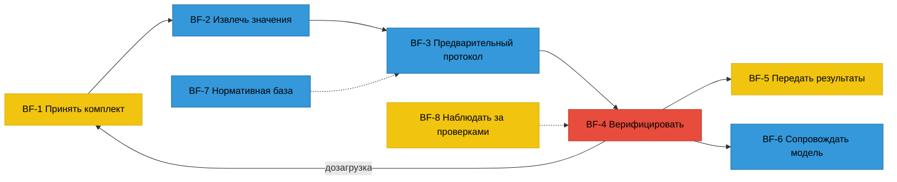

# 01. Анализ ТЗ и модели ГЕРЫ

Вход карты сценариев. Что ТЗ требует от скорости, что уже выведено в модели ГЕРЫ, где у модели
пробелы, из-за которых скорость нельзя спроектировать, и какой бюджет времени получается арифметикой.

## 1. Что ТЗ говорит о скорости прямо

| Атом ТЗ | Требование | Что это значит для сценариев |
|---|---|---|
| TZA-9.3.6-01 / TZA-11-15 | Полный цикл верификации протокола: **132 параметра, 14 нарушений ≤ 30 мин** у опытного пользователя | Не «быстрые экраны», а бюджет на **весь протокол**: 1 800 с на 132 группы = 13,6 с на группу, если смотреть каждую |
| TZA-9.3.6-02 | **≤ 3 клика** на одно нарушение | Решение не должно требовать мыши вовсе; клик — запасной путь |
| TZA-9.3.6-03 | Юзабилити-тест на 5 инспекторах с доработкой | Замер встроен в продукт, а не делается секундомером |
| TZA-11-09 | Инкрементальное обновление протокола ≤ 1 мин | Дозагрузка не прерывает работу — пересчёт идёт, пока инспектор решает |
| TZA-11-10 | API p95 ≤ 200 мс | Верхняя граница; для ощущения мгновенности нужно < 100 мс на переход между кандидатами → предвыборка |
| TZA-9.2.7-01 | Риск — только очерёдность, не основание | Риск можно и нужно использовать для **порядка** очереди; слова «нарушение выявлено» системе запрещены |
| TZA-9.2.3-03 | CONFIRMED_VIOLATION ставит только инспектор | Любая автоматизация останавливается перед подтверждением; пакетно можно только то, что закон позволяет |
| TZA-9.3.4-01 | Финализация — после обработки всех CANDIDATE | Финализация — счётчик до нуля, его надо видеть всё время |

## 2. Модель ГЕРЫ сегодня

Процесс BP-INSP «Провести камеральную проверку» (юридически — документарная проверка по ПП РФ № 2161, см. [02](02-экспертная-панель.md)): **8 функций, 34 операции, 30 сервисов, 142 правила
(138 с кодом и тестом), 20 диалогов DLG-INSP**. Атомы ТЗ: ✅ 194 · 🟡 2 · ⏸ 56 из 252.

Цвет — где тратит время **человек**: красное — инспектор сидит в операции минутами, жёлтое — минутами
раз в проверку, синее — работает машина. Вся скорость решается в BF-4 и на стыках с BF-1, BF-5, BF-8.

### Операции, которые исполняет человек (кандидаты на ускорение)

| Операция | Исполнитель | Частота | Где горит время сейчас (по DLG AS-IS) |
|---|---|---|---|
| BO-4.1 Принять решение по кандидату | инспектор | ×N кандидатов | поиск листа и зоны, переключение ПД↔РД↔ИД, ввод причины отклонения |
| BO-4.2 Разделить составной кандидат | инспектор | редко | ручная разметка частей |
| BO-4.3 Финализировать | инспектор | ×1 | проверка «ничего не забыл» |
| BO-1.2 Принять файлы (и дозагрузка) | инспектор | ×1–3 | ожидание разбора, переписка о недостающем |
| BO-3.2→перевод гипотезы | инспектор | ×M гипотез | нет доказательства рядом → гипотезу пропускают |
| BO-5.1 Выгрузить протокол / запись для акта | инспектор | ×1 | ручной перенос в акт |
| BO-8.1 Сводка проверок | инспектор | ежедневно | выбор, чем заняться, по цвету, а не по сроку и цене |
| BO-4.4, 6.1, 6.3, 7.1–7.3 | супервизор, куратор, ML, админ | редко | вне критичного пути инспектора |

### Что в модели мешает спроектировать скорость

1. **Диалоги выведены реверсом по экранам** (допущение в `03b-dialogs.md`). Значит, карта сценариев
   не обязана повторять 20 DLG — её строим от операций и бюджета времени, а DLG переписываются после.
2. **Нет сервиса очерёдности.** OS-INSP-6.4.9 даёт кандидату вероятность, OS-INSP-8.1 красит объекты,
   но нет правила, в каком порядке инспектору показывать кандидатов и проверки. А ТЗ прямо разрешает
   риск как очерёдность (TZA-9.2.7-01). Это главный рычаг скорости, и он пустой.
3. **NEGATIVE_VERIFIED от системы и от человека не различаются в пути.** OS-3.1.6 ставит его системой,
   OS-4.1.3 — человеком при отклонении. Для 30 минут нужно, чтобы системные отрицательные не требовали
   просмотра по одному, но оставались видимыми и выборочно проверяемыми.
4. **Нет операции «запросить недостающее у застройщика».** MISSING_EVIDENCE и CLARIFICATION_REQUIRED —
   статусы, а действие, которое их закрывает, в модели не названо. В реальной работе это переписка
   на дни (см. [02](02-экспертная-панель.md), предметники).
5. **Нет операции «подготовить акт»** кроме записи о применении ИИ (OS-5.1.2). Текст замечаний с
   нормой и листом инспектор набирает вручную вне системы.
6. **Замер времени — только в T-077**, а не в модели. Без правила «система считает время решения»
   30 минут не доказать.

Каждый пункт становится кандидатом в модель — см. [06-кандидаты-в-геру.md](06-кандидаты-в-геру.md).
В `03-services.md` правила попадают только после решения владельца.

## 3. Бюджет 30 минут — арифметика

Эталон ТЗ: 132 группы, 14 подтверждаемых нарушений. Допущения по составу протокола — из прогонов
стенда §14 на синтетике (638 групп на 30 объектов ≈ 21 группа на объект с данными) и из того, что
в ТЗ всего 14 нарушений на 132 параметра.

| Слой протокола | Групп (допущение) | Как смотрит инспектор TO-BE | Секунд на группу | Итого |
|---|---|---|---|---|
| CANDIDATE, истинные | 14 | Прицел: три листа уже на рамке, клавиша `1` | 40 | 9 мин 20 с |
| CANDIDATE, ложные | 8 | Прицел, `2` + номер причины | 25 | 3 мин 20 с |
| CLARIFICATION / NOT_COMPARABLE | 6 | в черновик требования застройщику | 6 | 36 с |
| MISSING_EVIDENCE | 12 | перечнем, одним черновиком требования | 4 | 48 с |
| NEGATIVE_VERIFIED системные | 84 | партией после выборки 30 карточек | 3 × 30 | 1 мин 30 с |
| NOT_APPLICABLE | 8 | не смотрит | 0 | 0 |
| SUSPICION | 6 | доказательство рядом, `H` — в оценку или `X` | 20 | 2 мин |
| Финализация и текст для акта | — | сборка сводки, окно отмены, черновик с нормами | — | 2 мин 30 с |
| **Итого** | **132 + 6** | | | **≈ 20 мин** |

Запас до 30 минут — 10 минут, это место для трудных кандидатов и разделения составных. AS-IS
по текущим экранам (оценка UX-директора и ML-панели, [02](02-экспертная-панель.md)) — порядка 45–60 минут: без очерёдности инспектор
открывает все 132 строки таблицы.

**Вывод.** Скорость делают не быстрые кнопки, а три вещи: порядок (что смотреть первым), пропуск
(что не смотреть по одному, оставаясь в законе) и доказательство без поиска (лист уже открыт на нужной
зоне). Кнопки и клавиши — четвёртое.
