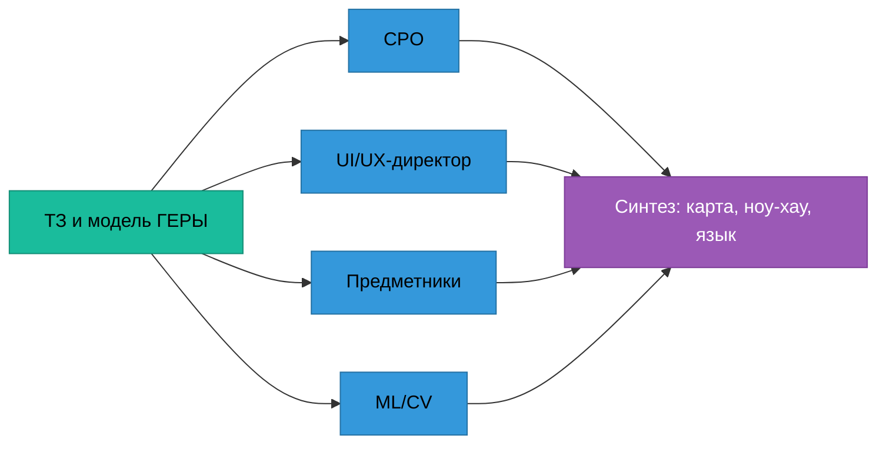

# 02. Экспертная панель

Панель собрана 2026-09-26 для T-103. Четыре голоса работали независимо и параллельно по одним
материалам: ТЗ, модель ГЕРЫ, текущий код `apps/web` и `ml`. Полные записки — в
[panel/](panel/). Здесь — что каждый принёс, где они разошлись и как спор разрешён.

**Допущение.** Панель — не респондент в смысле ГЕРЫ. Живого инспектора по-прежнему нет (GAP-INSP-01).
Утверждения панели о практике надзора помечены источником, где он найден, и «допущение», где нет.
Хронометража инспекторов в открытом доступе нет вовсе — все доли времени являются оценками.

| Голос | Кто | Записка |
|---|---|---|
| CPO | продукт: роли, JTBD, North Star, экономика, приоритеты | [panel/cpo.md](panel/cpo.md) |
| UI/UX-директор | взаимодействие, карта сценариев, дизайн-язык, движение | [panel/ux.md](panel/ux.md) |
| Предметники | инспектор ГСН (15 лет), инженер ПТО генподрядчика, ГИП | [panel/domain.md](panel/domain.md) |
| ML/CV-архитектор | механики скорости, бюджет латентности | [panel/ml.md](panel/ml.md) |

## Главное от каждого

**CPO.** Сильный рычаг скорости один: не заставлять человека смотреть 118 «чистых» параметров ради
14 кандидатов. North Star — медианные активные минуты инспектора на сводку, финализацию которой потом
не отменили; ТЗ ≤ 30, цель ≤ 15. Экономия ФОТ в Москве — десятки миллионов рублей; сотни миллионов дают
предотвращённые переделки на бюджетных объектах и продажа регионам и девелоперам. Узкое место не в
интерфейсе: экзаменационный объект ≈ 16 тыс. страниц, 56 % сканов, распознавание 10–15 часов.

**UI/UX-директор.** Время уходит не на клики, а на поиск значения на листе и ожидание следующего
кандидата. Лист формата A1 ужат в колонку 260–400 px — рамка значения выходит 3–6 px. После каждого
решения перезагружается вся проверка. `J`/`K` не работают в русской раскладке. «Подтвердить» —
самая яркая кнопка на экране, это подталкивает соглашаться с ИИ. Финализация — один клик без сводки
и без отмены.

**Предметники.** Ценность — «найти лист и доказать» (шифр, изменение, лист, зона), а не «найти
расхождение»: поиск листа и сверка изменений — около 40 % документной работы. ПД и РД не равноправны:
утверждённое по ч. 1.3 ст. 52 изменение РД становится частью ПД, кроме несущих конструкций. Слово
«протокол» инспектор слышит как протокол по КоАП. Документарная проверка — 10 рабочих дней без продления,
ожидание документов в срок не входит.

**ML/CV.** Скорость решают три величины — сколько кандидатов человек открывает, сколько секунд до
доказательства на экране, сколько решений принимается одним действием. Модели для этого почти не нужны:
всё, что видно в карточке, должно быть посчитано до её открытия.

## Споры и решения

| # | Спор | Позиции | Решение | Почему |
|---|---|---|---|---|
| 1 | Объём выборки при приёме «чистых» партией | CPO: 5–8 листов. ML: 30 по правилу трёх | **30**, стратифицированно по файлу и странице | Пять чистых карточек дают верхнюю границу доли ошибок 45 % — это не гарантия. Тридцать дают 10 %. С Прицелом это 1,5 минуты |
| 2 | Пакетное признание расхождений | UX: можно для просмотренных ≥ 1,5 с. ML и предметники: никогда | **Никогда** | Признание — юридический акт инспектора по каждой записи. 14 признаний — это 14 нажатий, экономить тут нечего, а риск велик |
| 3 | Подавление однотипных ложных тревог | исходная гипотеза ML | **Отвергнуто**, заменено «Общим корнем» | Скрытый кандидат — решение без человека и невидимый пропуск. Группировка с поштучной записью даёт ту же скорость |
| 4 | Конформная гарантия на «чистые» | исходная гипотеза ML | **Отложено** до сотен отрицательных меток | Честное n ≈ 4; калибровать не на чем. Выборка сама копит метки |
| 5 | Термин «протокол» | ТЗ: протокол. Предметники: «сводка сверки» | **В интерфейсе — «сводка сверки»**, в API и трассе — протокол | Интерфейс говорит словами пользователя, коды ТЗ остаются. Решение за владельцем, см. [08](08-дорожная-карта.md) |
| 6 | Когда менять визуальный язык | UX: после замера механик | **После замера** | Иначе эффект новизны смешается с эффектом скорости в T-077 |
| 7 | Шрифт дисплея | было: Onest. UX: Geologica | **Geologica** | Рядом с Golos Onest не даёт второй роли |

## Что панель нашла в самих требованиях

Эти находки не про интерфейс, но меняют сценарии. Каждая — кандидат в задачу, не правка.

| Находка | Где | Что предлагается |
|---|---|---|
| Порог M-117 «ширина двери на путях МГН» — 1,5 м; для дверей порядок 0,9 м (1,5 — ширина путей) | `data/seed/matrix.json` | Сверить по СП 59.13330; иначе кандидатами станут все двери объекта |
| M-118 (порог ≤ 0,014 м) стоит на сравнении `delta_pct 0` | Матрица | Перевести на абсолютный максимум |
| Семь пар параметров дублируют друг друга (M-021/M-124, M-040/M-104, M-041/M-105, M-043/M-106, M-050/M-107, M-080/M-108, M-069/M-109) | Матрица | Склеивать карточки при показе, в GOLD не склеивать |
| M-098…M-101, M-132, M-082 — не предмет документарной проверки ГСН | Матрица | По умолчанию «неприменимо» с основанием |
| Улучшение («B30 → B35») на сравнении `equal` даёт кандидата | Матрица | Статус «отличие в лучшую сторону» с низкой очерёдностью |
| Штамп «В производство работ» не нужен при действительной ЭП (СП 48 п. 5.8 — сверить пункт) | OS-INSP-2.3.3 | Не требовать штамп при подписи VALID |
| Основание «2078-ПП в ред. 1318-ПП» как порядок применения ИИ не подтвердилось обзором | OS-INSP-5.1.2, DLG-20 | Прочитать первоисточник до презентации |
| Подписи статусов звучат как правовые выводы | `apps/web/src/lib/labels.ts` | Словарь в [03](03-карта-сценариев.md#словарь-интерфейса) |

## Двенадцать сценариев, которых нет в постановке

Предметники назвали сценарии, которые инспектор оценит сразу. В карту вошли пять; остальные — в
дорожную карту после стоп-кода.

| Сценарий | В карте |
|---|---|
| Черновик требования о представлении документов | SC-03 |
| Черновик текста акта | SC-12 |
| Чек-лист выезда с телефона | SC-13 |
| Досье объекта между проверками | SC-10 (перенос решений) |
| Самопроверка застройщиком до извещения | SC-18 |
| Привязка к программе проверок (этап → параметры) | дорожная карта |
| Проверка исполнения предписания | дорожная карта |
| Готовность к итоговой проверке и ЗОС | дорожная карта |
| Хронология АОСР против общего журнала работ | дорожная карта, кандидат в наблюдения ИИ |
| Изменения РД и граница ч. 1.3 ст. 52 | Н7 в [04](04-ноу-хау.md) |
| Индикатор «подрядчик систематически занижает класс бетона» | дорожная карта; это не основание для проверки |
| Приём XML-ИД по схемам Минстроя | дорожная карта; значения без распознавания |
