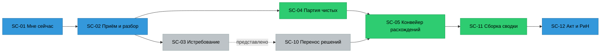
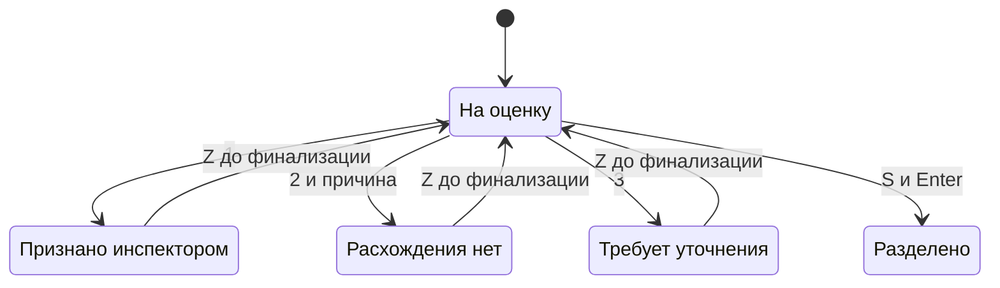
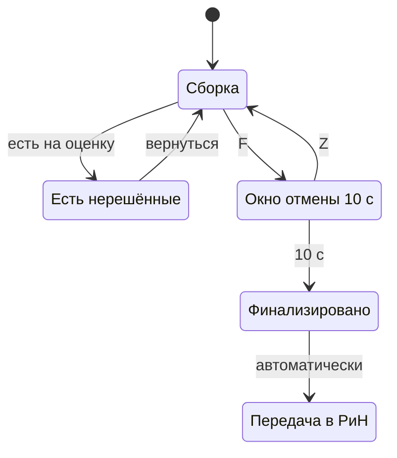

# 03. Карта сценариев TO-BE

Построена с нуля от операций модели и бюджета времени ([01](01-анализ-тз-и-модели.md)), а не от
текущих экранов. Каждый сценарий трассируется на операции BO, сервисы OS и диалоги DLG модели ГЕРЫ.
Статус сценария: **есть** — поведение уже выведено в модели и реализовано; **доработка** — сервис есть,
меняется взаимодействие; **новое** — нужен кандидат в ГЕРУ ([06](06-кандидаты-в-геру.md)).

## Четыре закона скорости

Их вывела панель ([02](02-экспертная-панель.md)), каждый сценарий ниже им подчиняется.

1. **Доказательство раньше вопроса.** Инспектор не ищет лист. Когда кандидат на экране, листы ПД, РД и ИД
   уже открыты на нужной зоне в читаемом масштабе. Всё, что видно в карточке, посчитано до её открытия.
2. **Не смотреть по одному то, что закон позволяет принять партией.** Система сама ставит
   NEGATIVE_VERIFIED (OS-INSP-3.1.6). Эти записи инспектор принимает партией после случайной выборки
   с опубликованной границей ошибки. Подтверждение расхождения партией запрещено всегда.
3. **Порядок — это рычаг.** Риск по ТЗ — только очерёдность (TZA-9.2.7-01). Мы используем его ровно так:
   сначала дорогое для пропуска, потом остальное.
4. **Отмена вместо вопроса.** В цикле нет ни одного «Вы уверены?». Любое решение до финализации
   откатывается клавишей `Z`. Тормоз стоит в двух местах: финализация (окно 10 с) и подпись модели
   (удержание 600 мс).

## Словарь интерфейса

Решение панели предметников: интерфейс говорит словами инспектора, коды ТЗ живут в API и протоколе.

| В ТЗ и API | В интерфейсе |
|---|---|
| камеральная проверка | документарная проверка |
| протокол | сводка сверки (в шапке мелко: «протокол по ТЗ 9.2») |
| CANDIDATE | расхождение на оценку |
| CONFIRMED_VIOLATION | признано инспектором |
| NEGATIVE_VERIFIED | расхождения нет |
| MISSING_EVIDENCE | не представлено |
| SUSPICION | наблюдение ИИ |
| дозагрузка | представление документов (по требованию) |
| уровень риска | очерёдность |

Запрещённые формулировки и замены — в [05-дизайн-язык.md](05-дизайн-язык.md#голос).

## Карта целиком

Внутри конвейера расхождений (SC-05) работают сценарии SC-06 «Общий корень», SC-07 «Разделение»,
SC-08 «Наблюдения ИИ», SC-09 «Что изменилось на листе». Вокруг цикла инспектора — роли супервизора,
администратора, ML-инженера и застройщика (SC-13…SC-18).

## Бюджет цикла: 132 параметра, 14 признанных

| Сценарий | Единиц | Цель на единицу | Итого |
|---|---|---|---|
| SC-01 → первый кандидат | 1 | ≤ 5 с | 0,1 мин |
| SC-03 Истребование (черновик) | 1 | ≤ 60 с | 1,0 мин |
| SC-04 Партия чистых: выборка 30 карточек | 30 | 3 с | 1,5 мин |
| SC-05 Расхождения, признанные | 14 | ≤ 40 с | 9,3 мин |
| SC-05 Расхождения, снятые | 8 | ≤ 25 с | 3,3 мин |
| SC-06 Колоды однотипных | 2 | ≤ 20 с | 0,7 мин |
| SC-08 Наблюдения ИИ | 6 | ≤ 20 с | 2,0 мин |
| SC-11 Сборка и финализация | 1 | ≤ 90 с | 1,5 мин |
| SC-12 Текст для акта, передача | 1 | ≤ 60 с | 1,0 мин |
| **Итого** | | | **≈ 20 мин** (ТЗ ≤ 30) |

Цифры — цели, не замер. Замер встроен: `domain/verify-timing.ts` уже считает активное время по журналу
аудита; SC-05 добавляет счётчик действий на решение. Приёмка — на 5 инспекторах (T-077).

Интерфейсные цели:

| Что | Цель |
|---|---|
| Переход к следующему кандидату до прицела на рамке | ≤ 100 мс |
| Решение «признать» / «уточнить» | 1 клавиша |
| Решение «снять с причиной» | 2 клавиши |
| Модальных подтверждений в цикле | 0 |
| Высота цифры значения на кропе листа | ≥ 14 CSS px |

---

## Инспектор

### SC-01. Мне сейчас · доработка

- **Операции:** BO-INSP-8.1 · OS-INSP-8.1.1, 8.1.2, 3.3.3 · DLG-INSP-02.
- **Триггер:** начало смены или уведомление «сводка готова» (OS-INSP-3.3.3).
- **Что видит:** одна колонка проверок, отсортированная по правилу «готово к решениям → начато →
  в разборе (с ETA) → сбой передачи». На карточке: адрес и № разрешения на строительство (так объект
  знает инспектор), счётчик «осталось 22 решения · ≈ 14 мин», точка цвета OS-INSP-8.1.1, срок
  документарной проверки «день 3 из 10» (248-ФЗ ст. 72). Цветовые группы — фильтр-чипы, а не заголовки.
- **Действие:** `Enter` на первой карточке — сразу в конвейер на первом нерешённом, минуя «Обзор».
- **Клавиши:** `J`/`K` — по карточкам, `Enter` — продолжить, `O` — обзор проверки, `/` — поиск,
  `N` — новая проверка.
- **Пусто:** «Решать нечего. Три проверки в разборе, ближайшая будет готова примерно через 6 минут.»
- **Сбой:** передача в РиН висит дольше 15 минут — строка на карточке «Не ушло в РиН, 3 попытки» и
  `⇧R` «Повторить» (OS-INSP-5.2.2).
- **Что меняется против AS-IS:** пять KPI-плиток уходят, три перехода до работы сокращаются до одного.

### SC-02. Приём пакета и лента разбора · доработка

- **Операции:** BO-INSP-1.1, 1.2, 1.3, 1.4, 2.1 · OS-INSP-1.1–1.4, 2.1 · DLG-INSP-03, 04.
- **Триггер:** `N` или перетаскивание файлов в любое место окна. Зона сброса появляется только во время
  перетаскивания.
- **Шаги:** файлы и реестр → карточка объекта заполнена из реестра, инспектор её сверяет →
  `⌘Enter`. Экран становится **лентой разбора**: три дорожки ПД, РД, ИД, в каждой файлы со своим этапом
  (очередь, распознавание, извлечение, готово, низкое качество), общий ETA.
- **Ноу-хау внутри:** комплектность и скрытые работы считаются в первую минуту, до распознавания всего
  пакета (Н5 «Истребование за минуту»). Инспектор узнаёт, чего не хватает, пока машина ещё читает.
- **Клики:** ≤ 3.
- **Отказы:** превышение 200 МБ показывается до отправки (OS-INSP-1.2.3). Отклонённый файл — строка с
  причиной и действием «Заменить». Нет реестра — жёлтая строка «Изменения определяются по основным
  надписям листов, возможны уточнения» (OS-INSP-1.2.6), продолжить можно.
- **Готово:** карточка в «Мне сейчас» поднимается наверх с отметкой «Готово к решениям». Экран сам
  не переключается.

### SC-03. Истребование недостающего · новое

- **Операции:** BO-INSP-1.4 · OS-INSP-1.4.1, 1.4.4, 2.3.2, 3.1.2 · новый кандидат BO-INSP-1.6
  «Подготовить требование о представлении документов».
- **Триггер:** в ленте разбора появился перечень «Не представлено».
- **Что видит:** черновик требования о представлении документов: пункт перечня 344/пр, чего нет, где
  это следует из комплекта (перечень скрытых работ в Общих данных, лист, рамка). Счётчик срока
  проверки с оговоркой «ожидание документов в срок не входит» (248-ФЗ ст. 72 ч. 7).
- **Действия:** `C` — скопировать текст, `E` — выгрузить DOCX. Отправляет инспектор сам, через РиН
  или письмом. Система не отправляет ничего застройщику.
- **Граница шума:** «вид документа не распознан» идёт отдельной строкой «Уточнить», а не требованием
  (в корпусе отладки у 109 из 154 файлов вид «прочий» — это наш пробел, а не застройщика).
- **Параметры, зависящие от непредставленного,** получают отметку «ждёт документов» и не занимают очередь.
- **Цель:** от загрузки до «знаю, чего не хватает» — меньше минуты. AS-IS — на 20-й минуте проверки.

### SC-04. Партия чистых · новое

- **Операции:** BO-INSP-4.1 · OS-INSP-3.1.6, 4.1 · новые правила OS-INSP-4.1.8–4.1.11 (кандидаты).
- **Ноу-хау:** Н2 «Партия с выборкой».
- **Триггер:** разбор готов, в сводке есть записи «расхождения нет», поставленные системой.
- **Шаги:**
  1. Система собирает партию: только системные «расхождения нет». В партию **не попадают** критичные
     параметры Матрицы и значения, прочитанные распознаванием с уверенностью ниже 0,7. Они идут в обычную
     очередь.
  2. Из партии случайно, стратифицированно по файлу и странице, выбираются 30 карточек (seed
     фиксируется). Каждая открыта Прицелом: значение ПД рядом со значением РД или ИД.
  3. Инспектор листает выборку клавишей `J`. Нашёл ошибку — `2` и причина: партия распадается в обычную
     очередь, причина уходит в «Общий корень».
  4. Ноль ошибок в 30 — строка внизу «Партия 84 записи. Выборка 30, ошибок 0. Верхняя граница доли
     ошибок в партии — 10 % при уверенности 95 %». `⇧Enter` — принять партию.
- **В протоколе:** размер партии, объём выборки, seed, граница, кто принял. Каждая запись партии хранит
  ссылку на акт приёмки партии.
- **Почему 30, а не 5.** Пять чистых карточек дают верхнюю границу 45 % — статистически это ничего.
  Тридцать дают 10 %, шестьдесят — 5 %. С Прицелом карточка — 3 секунды, 30 карточек — полторы минуты
  вместо 84 просмотров по одному.
- **Юридическая граница:** партия содержит только записи, которые система и так вправе поставить сама.
  Признание расхождения партией не существует ни в одном сценарии.
- **Бонус для модели:** 30 просмотренных карточек — проверенные отрицательные метки для GOLD, которых
  сейчас не хватает для доказательства FPR ≤ 0,10.

### SC-05. Конвейер расхождений · доработка

Ядро. 80 % времени цикла.

- **Операции:** BO-INSP-4.1 · OS-INSP-4.1.1–4.1.7, 3.1.9, 2.3, 2.4 · DLG-INSP-09, 15, 16.
- **Ноу-хау:** Н1 «Прицел», Н7 «Граница ч. 1.3 ст. 52».
- **Раскладка от 1280 px:**
  - верхняя полоса 40 px — адрес объекта, **лента прогресса** из делений по числу расхождений (деление
    окрашивается исходом, клик — переход), «7 / 22», тихое «≈ 11 мин»;
  - стопка слева 232 px, убирается клавишей `\` — полосы «Расхождения по очерёдности», «Колоды»,
    «Уточнения», «Наблюдения ИИ»; решённые уходят в лоток и не мешают;
  - **сцена** в центре, ≥ 60 % ширины — колонки ПД | РД | ИД в постоянном порядке. Стадию сообщает
    место колонки, а не цвет. Пустая стадия — колонка с текстом «ИД не требуется» или «ИД не
    представлено», а не схлопывание;
  - рейка решений справа 320 px — параметр, **«по проекту» и «фактически» кеглем 28**, Δ и порог,
    одна строка советника ИИ, компактные источники (стадия, шифр, изм., лист), выноска о согласованном
    изменении, три решения равного веса внизу.
- **Шаги:**
  1. Кандидат появляется уже в прицеле (переход T2). Цифры на кропе не мельче 14 px.
  2. `Tab` перебирает источники, камера переезжает к рамке выбранного листа. Удержание `Space` — весь
     лист, отпустил — назад к рамке.
  3. `1` — признать. `2` → `1…6` — снять с причиной; комментарий подставлен из причины и правится в окне
     отмены. `3` — уточнить.
  4. Решённое улетает в лоток (переход T1), следующий кандидат уже отрисован.
- **Согласованное изменение (OS-INSP-3.1.9):** если у параметра есть утверждённое изменение РД, причина
  «Согласованное изменение» стоит первой: `2`, `Enter`. **Кроме несущих конструкций** — там выноска
  «Изменение утверждено застройщиком, но касается несущих конструкций. По ч. 1.3 ст. 52 ГрК такое
  изменение не проводится — оцените отдельно», и причина не предвыбирается (Н7).
- **Советник ИИ:** его позиция — одна строка серым под значениями. Отдельно «согласен ли с советником»
  не спрашиваем; расхождение пишется в спорные случаи само (OS-INSP-4.1.7).
- **Слои листа:** `R` — реквизиты (DLG-INSP-15), `M` — приложить измерение (DLG-INSP-16; если масштаб
  не определён — текст вместо линий), `D` — было/стало для изменений листа (SC-09).
- **Отказы:** решение не сохранилось — запись возвращается на сцену с красной строкой причины, `Enter`
  повторяет. Лист не отрисовался — заглушка с шифром и страницей, `⇧O` открыть файл целиком; решение
  без картинки допустимо, но в журнале помечается «без просмотра листа».
- **После финализации:** сцена только для чтения, клавиши решений сняты, в рейке — кто может отменить.
- **Клики мышью:** признать — 1, снять — 2, уточнить — 1 (ТЗ ≤ 3).

### SC-06. Общий корень · новое

- **Операции:** BO-INSP-4.1 · OS-INSP-4.1.3, 4.1.6, 1.3 · новые правила 4.1.12–4.1.14 (кандидаты).
- **Ноу-хау:** Н3 «Общий корень».
- **Триггер:** инспектор снял расхождение с причиной, а у других расхождений этой проверки та же
  сигнатура причины: тот же документ и выбор изменения, та же плохо распознанная страница, тот же
  параметр с Δ в пределах полутора порогов.
- **Что видит:** в рейке строка «Ещё 7 расхождений из-за того же изменения 132-ОВ изм. 3. Снять с той же
  причиной?» и веер из семи мини-сцен в прицеле. `X` снимает отметку с любой, `Enter` применяет.
- **Запись:** каждое из семи решений пишется отдельно — своё время, своя причина, отметка
  `propagated_from`. Журнал отклонений видит все семь.
- **Пересчёт вместо подавления:** причина «не то изменение» пересчитывает эталон по документу, и лишние
  расхождения исчезают, потому что пересчитаны. Причина «ошибка распознавания» отправляет страницу на
  перечитывание.
- **Границы:** только для снятия, никогда для признания. Критичные параметры в колоду не попадают.
  Колода больше 20 делится. Всё откатывается `Z`.
- **Цель:** действий на кандидата — 0,6 вместо 1,0.

### SC-07. Разделение составного · доработка

- **Операции:** BO-INSP-4.2 · OS-INSP-4.2.1, 4.2.2 · DLG-INSP-09.
- **Шаги:** `S` показывает предпросмотр N частей (переход T6), у каждой своя рамка своего листа.
  `Enter` применяет, `Esc` отменяет. Части встают в очередь на место исходного.
- **Что меняется:** AS-IS делит сразу по клику без предпросмотра и без отмены.

### SC-08. Наблюдения ИИ · доработка

- **Операции:** BO-INSP-3.2 · OS-INSP-3.2.1–3.2.10 · DLG-INSP-07.
- **Где:** отдельная полоса в конце стопки «Наблюдения ИИ · не расхождения». Сцена та же, рейка
  нейтрального тона, без красного.
- **Действия:** `H` — взять в оценку, если есть файл, страница и рамка (OS-INSP-3.2.7): запись встаёт
  в очередь расхождений под текущей. `X` — отклонить. `→` — пропустить.
- **Для ML-паттерна** одной строкой: медиана по истории объектов и объём выборки (OS-INSP-3.2.9).
- **Для советника LLM** — дословная цитата с листа, подсвеченная на кропе (OS-INSP-3.2.4). Без цитаты
  наблюдение не показывается вовсе.

### SC-09. Что изменилось на листе · доработка

- **Операции:** BO-INSP-3.4 · OS-INSP-3.4.1–3.4.4.
- **Ноу-хау:** Н4 (подпись изменений словами), часть Прицела.
- **Взаимодействие:** `D` мгновенно, **без анимации** переключает «было / стало»: глаз ловит изменение
  при резкой смене кадра лучше, чем при плавном наложении. Удержание `D` — наложение 50 %.
- **Подпись:** каждая область изменения подписана словами из текста обеих редакций: «Ø110 → Ø160»,
  «В2.7 → В2.8». Изменения внутри основной надписи и графы изменений сворачиваются в строку
  «служебные изменения — 6», а не удаляются.

### SC-10. Представлено по требованию: решения переносятся · новое

- **Операции:** BO-INSP-1.2 (дозагрузка), 3.3 · OS-INSP-1.2.7, 3.3.4 · новые правила 3.3.5–3.3.6 (кандидаты).
- **Ноу-хау:** Н4 «Отпечаток доказательства».
- **Триггер:** застройщик представил документы (ручная дозагрузка или автозабор из РиН, OS-INSP-1.2.15).
- **Что происходит:** пересчитываются только параметры с новыми данными (≤ 1 мин по ТЗ, 2 с на стенде).
  У каждого прежнего решения есть отпечаток: хеши файлов, лист, рамка, значение, эталонное изменение.
  Отпечаток не изменился — решение остаётся с прежним автором и временем и пометкой «доказательства не
  изменились». Изменился — расхождение снова в очереди с подписью «что стало иначе».
- **Что видит инспектор:** «Перенесено 18 решений. Заново на оценку — 3.» Повторный цикл — это дельта.
- **Граница:** перенос признанного расхождения — с заметной пометкой и клавишей «пересмотреть».

### SC-11. Сборка сводки и финализация · доработка

- **Операции:** BO-INSP-3.3, 4.3 · OS-INSP-3.3.2, 4.3.1–4.3.3 · DLG-INSP-04, 06, 08.
- **Триггер:** решено последнее расхождение. Сцена сама перестраивается в сборку (переход T5),
  промежуточного экрана «Все обработаны» нет.
- **Разделы строго по ТЗ:** признано инспектором · снято (с причинами) · требует уточнения ·
  **не представлено — отдельным перечнем** · наблюдения ИИ (не расхождения) · расхождения нет и
  неприменимо (свёрнуто, со счётчиком и актом приёмки партии). Любая строка по `Enter` возвращает
  запись на сцену.
- **Блок:** «Финализировать» не гаснет молча, а говорит: «Осталось 2 расхождения без решения —
  вернуться (Enter)» (OS-INSP-4.3.1).
- **Финализация:** `F` → панель снизу «Сводка v4 будет финализирована и передана в РиН через 10 с ·
  Отменить Z» (переход T8). Запрос уходит по истечении окна.
- **Что меняется:** AS-IS финализирует одним кликом без сводки и без отмены — единственное место,
  где тормоз нужен, и там его не было.

### SC-12. Текст для акта и передача в РиН · доработка

- **Операции:** BO-INSP-5.1, 5.2 · OS-INSP-5.1.1, 5.1.2, 5.2.1–5.2.4 · DLG-INSP-20 · кандидат BO-INSP-5.5
  «Подготовить черновик текста акта».
- **Ноу-хау:** Н6 «Каждое предложение с якорем».
- **Что видит:** сразу после финализации — черновик раздела акта. Каждое предложение собрано из
  признанного расхождения: «В РД шифр 132-КЖ2, изм. 3, л. 4 указано: бетон B30. В АОСР № 12 от 14.03
  указано: бетон B25.» Норма — дословная цитата пункта из справочника 13 актов, выбор из трёх
  кандидатов клавишами `1…3`. Ниже — запись о применении средства (OS-INSP-5.1.2).
- **Действия:** `⌘C` — скопировать, `E` — DOCX. Основная выгрузка — PDF, прочие форматы в меню «Ещё».
- **Граница:** система не пишет «нарушение выявлено» и не выдаёт предписание (BO-INSP-5.3 вне системы).
  Предложение без ссылки на запись сводки или цитату нормы подсвечивается и не выгружается.
- **Передача:** статус живой строкой; сбой — «Передача не удалась, повтор через 5 мин» и «Повторить
  сейчас» (OS-INSP-5.2.2).

### SC-13. Чек-лист выезда · новое, после стоп-кода

- **Операции:** кандидат BO-INSP-4.5 «Подготовить выездную проверку».
- **Что это:** из нерешённых расхождений и того, что по документам не проверить, — 8–12 пунктов
  «что измерить на месте» с кропом листа и рамкой. Телефон, крупные цели, фото прикрепляется к пункту.
- **Правовая опора:** выездная проверка и фотофиксация по ПП РФ № 2161; осмотр и замер — только инспектор.

## Супервизор

### SC-14. Надзор: споры, сбои, отмены · доработка

- **Операции:** BO-INSP-4.4, 8.2 · OS-INSP-4.4.1, 4.4.2, 4.1.6, 4.1.7, 8.2.1 · DLG-INSP-13, 17.
- **Экран:** три полосы с числами — споры за сутки (инспектор разошёлся с советником), сбои передачи,
  запросы на отмену финализации. `Enter` открывает ту же сцену конвейера только для чтения:
  решение, комментарий инспектора, позиция ИИ.
- **Отмена финализации:** `U` → причина (обязательна) → `⌘Enter` → окно отмены 10 с → запись аудита.
- **Цель:** спор — ≤ 30 с, отмена финализации — ≤ 20 с.

### SC-15. Подпись публикации модели · доработка

- **Операции:** BO-INSP-6.3 · OS-INSP-6.3.1, 6.3.2, 6.4.7 · DLG-INSP-12.
- **Экран:** метрики новой и текущей модели бок о бок по категориям §14, красным — провал ворот
  (Recall −2 п. п. или FPR +2 п. п.). Кнопка «Подписать публикацию» — удержание 600 мс: действие
  юридически значимо и отмены у него нет.

## Администратор НСИ

### SC-16. Матрица с предпросмотром влияния · доработка + новое

- **Операции:** BO-INSP-7.1–7.3 · OS-INSP-7.1.1, 7.1.2, 7.2.1, 7.3.1 · DLG-INSP-10, 11 · кандидат 7.1.3.
- **Шаги:** `/` — поиск по коду, `Enter` — править порог на месте. Правки копятся в черновике версии.
  Перед выпуском — «Эта правка на открытых проверках: 14 расхождений станут „расхождения нет“, 2 новых
  появятся» (новое). «Выпустить Матрицу v13 (3 правки)» показывает разницу.
- **Конфликт:** «Матрицу изменил другой администратор 2 минуты назад: показать разницу / наложить
  мои правки».

## ML-инженер и куратор данных

### SC-17. Понедельник: от отклонений к модели · есть + доработка

- **Операции:** BO-INSP-6.1, 6.2, 6.4, 6.5 · OS-INSP-6.1.*, 6.2.*, 6.4.4–6.4.9, 6.5.* · DLG-INSP-12, 17, 19.
- **Поток:** недельный отчёт открыт по умолчанию — главная причина отклонений, пять параметров,
  рекомендации → переход в журнал отклонений с этим фильтром → черновик GOLD (+N признанных, +M
  проверенных «чистых» из выборок SC-04) → «Выпустить версию набора» → дообучение → ворота → подпись
  супервизора (SC-15).

## Застройщик

### SC-18. Самопроверка до подачи · новое, стратегическое, после стоп-кода

- **Операции:** кандидат нового процесса BP-SELF «Подготовить комплект к проверке» — вне BP-INSP.
- **Что это:** ПТО генподрядчика прогоняет комплект тем же движком и той же версией Матрицы до
  извещения. Видит те же карточки, собирает папку, закрывает дыры до выезда инспектора.
- **Правовая граница:** результат самопроверки **не уходит** в надзор автоматически. Иначе это сбор
  доказательств без контрольного мероприятия. Пакет приходит в надзор с хешем самопроверки, и
  инспектор видит только, что изменилось с тех пор.
- **Зачем:** это рынок девелоперов и сетевой эффект одной Матрицы — см. [07-экономика.md](07-экономика.md).

---

## Трассировка: сценарий → модель

| Сценарий | BO | OS | DLG | Статус |
|---|---|---|---|---|
| SC-01 | 8.1 | 8.1.1–8.1.2, 3.3.3 | 02 | доработка |
| SC-02 | 1.1–1.4, 2.1 | 1.1–1.4, 2.1 | 03, 04 | доработка |
| SC-03 | 1.4, **1.6** | 1.4.1, 1.4.4, 2.3.2, 3.1.2 | новый | новое |
| SC-04 | 4.1 | 3.1.6, **4.1.8–4.1.11** | новый | новое |
| SC-05 | 4.1 | 4.1.1–4.1.7, 3.1.9, 2.3, 2.4 | 09, 15, 16 | доработка |
| SC-06 | 4.1 | 4.1.3, 4.1.6, 1.3, **4.1.12–4.1.14** | 09 | новое |
| SC-07 | 4.2 | 4.2.1, 4.2.2 | 09 | доработка |
| SC-08 | 3.2 | 3.2.1–3.2.10 | 07 | доработка |
| SC-09 | 3.4 | 3.4.1–3.4.4, **3.4.5** | 09 | доработка |
| SC-10 | 1.2, 3.3 | 1.2.7, 3.3.4, **3.3.5–3.3.6** | 04 | новое |
| SC-11 | 3.3, 4.3 | 3.3.2, 4.3.1–4.3.3, **4.3.4** | 04, 06, 08 | доработка |
| SC-12 | 5.1, 5.2, **5.5** | 5.1.1–5.1.2, 5.2.1–5.2.4 | 20 | доработка |
| SC-13 | **4.5** | — | новый | после стоп-кода |
| SC-14 | 4.4, 8.2 | 4.4.1–4.4.2, 4.1.6–4.1.7, 8.2.1 | 13, 17 | доработка |
| SC-15 | 6.3 | 6.3.1–6.3.2, 6.4.7 | 12 | доработка |
| SC-16 | 7.1–7.3 | 7.1.1–7.3.1, **7.1.3** | 10, 11 | доработка |
| SC-17 | 6.1–6.5 | 6.1–6.5 | 12, 17, 19 | есть |
| SC-18 | **BP-SELF** | — | — | после стоп-кода |

Жирным — кандидаты в модель, их формулировки в [06-кандидаты-в-геру.md](06-кандидаты-в-геру.md).
Операции без изменений: BO-INSP-5.3 (выдача предписания — вне системы), 5.4 (статус предписания виден
в SC-01 на карточке проверки).
