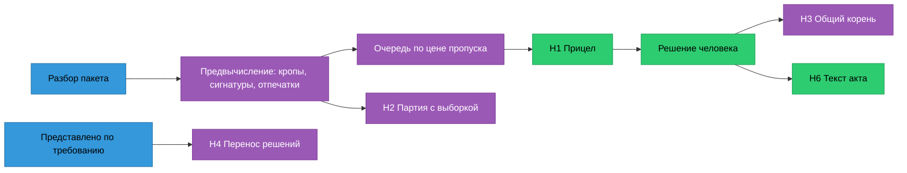

# 04. Семь ноу-хау

Ноу-хау здесь — механика, которая убирает работу человека и при этом не решает за него. Модель
в каждой из них либо не нужна вовсе, либо стоит за валидатором. Общее правило для всех семи:
**система может переставить, сгруппировать и заполнить заранее, но не может скрыть запись и не может
признать расхождение.** Каждое предзаполнение пишется в аудит с отметкой «принято без правки» или
«исправлено».

| # | Название | Что убирает у человека | Эффект (гипотеза до замера) | Демо до 29.09 |
|---|---|---|---|---|
| Н1 | Прицел | поиск листа и зоны, зум | 15–25 с → < 1 с на расхождение | целиком |
| Н2 | Партия с выборкой | просмотр «чистых» по одному | 84 просмотра → 30 за 1,5 мин | механика, граница SYNTH |
| Н3 | Общий корень | повтор одинаковых снятий | действий на кандидата 1,0 → 0,6 | на синтетике |
| Н4 | Отпечаток доказательства | повторную проверку решённого | повторный цикл 30 мин → 2–5 мин | да |
| Н5 | Истребование за минуту | цикл «начал → упёрся → запросил» | минус одна переписка, дни | да |
| Н6 | Предложение с якорем | набор текста акта | 5–10 мин → 1–2 мин вычитки | шаблоном, без LLM |
| Н7 | Граница ч. 1.3 ст. 52 | ложные тревоги от утверждённых изменений РД и пропуск опасных | крупнейший источник шума гаснет, опасное всплывает | правилом |

Порядок по отдаче на час работы до фриза: Н1 → Н3 → Н4 → Н5 → Н2 → Н6 → Н7 (ML-панель, скорректировано
по предметникам). По ценности для продукта: Н2 и Н7 — самые защитимые.

---

## Н1. Прицел

**Идея.** Доказательство оказывается на экране раньше, чем инспектор о нём попросил.

**Механизм.**
1. На разборе у каждой находки уже есть растр и рамка в координатах [0;1] с учётом CropBox и Rotate
   (OS-INSP-2.2.2). Там же режется кроп: рамка плюс 35 % поля, не меньше 12 % ширины листа, чтобы были
   видны оси и соседние строки. В кроп всегда входит якорь строки — наименование параметра, а не только
   число. Формат WebP, 20–40 КБ, ключ `sha256 + страница + рамка`, кэш неизменяемый.
2. Сцена открывается кропами «по проекту» и «фактически» рядом, цифры ≥ 14 px. Полный лист
   в pdf.js дорисовывается фоном и по `Space` открывается уже спозиционированным.
3. Синхронное панорамирование: тянем один лист — остальные сдвигаются на тот же вектор относительно своей
   рамки, а не относительно страницы (листы разного формата).
4. Пока инспектор решает кандидата N, клиент тянет кропы N+1…N+3 и открывает их документы в воркере.
5. Решение уходит оптимистично: интерфейс уже на следующем, запись идёт фоном с повтором, время решения
   ставит сервер.

**Что есть:** рамки, рендер и распознавание в `parse.py`, кэш по SHA, клавиши 1/2/3 в `Verify.tsx`.
**Чего нет:** эндпоинта кропов, предвыборки, синхронного панорамирования. Модели не нужны.

**Метрика:** время до доказательства p95 < 150 мс; доля решений без открытия полного листа ≥ 60 %
для числовых параметров.

**Риск.** Кроп вырывает значение из контекста → якорь строки всегда в кадре; на страницах низкого
качества распознавания кроп помечен, и решение по нему не засчитывается как просмотр листа.

## Н2. Партия с выборкой

**Идея.** Перенести в надзор приёмочный выборочный контроль — логику, которую инспектор и так знает
по стройке, — вместо того чтобы просить его смотреть 84 «чистых» записи или верить машине вслепую.

**Механизм.**
1. Партия — только системные «расхождения нет» (OS-INSP-3.1.6). Критичные параметры Матрицы и значения,
   прочитанные распознаванием с уверенностью < 0,7, в партию не идут.
2. Стратифицированная по файлу и странице случайная выборка k карточек с seed в протоколе. Страты нужны,
   потому что ошибки коррелированы: одна плохая страница портит несколько значений.
3. Правило трёх: 0 ошибок в k = 30 — верхняя 95 % граница доли ошибок в партии ≤ 10 %; k = 60 — ≤ 5 %.
4. Нашлась ошибка — партия распадается в обычную очередь, причина уходит в Н3.
5. Ноль ошибок — инспектор подписывает партию одним действием. В протоколе: размер, k, seed, граница,
   кто подписал.

**Почему это сильнее «конформной гарантии».** Для калибровки нужно сотни размеченных отрицательных по
нескольким объектам; у проекта честное n ≈ 4 (ML-CONCEPT §6). Выборочный контроль честен с первого
дня и сам копит данные для будущей калибровки: каждая просмотренная карточка — проверенная отрицательная
метка для GOLD. Позже, когда их сотни, k уменьшается по конформному риску (Learn-then-Test) — после
ворот OS-INSP-6.3.

**Юридически.** Партия содержит только то, что система и так ставит сама. Мы не автоматизируем решение —
мы уменьшаем число просмотров и публикуем, насколько можно доверять остатку. Вопрос о допустимости
выборочного подхода в документарной проверке — в список вопросов организатору (T-078).

**Честность в демо.** Граница показывается с меткой SYNTH. На реальных данных не заявляется.

## Н3. Общий корень

**Идея.** Одно объяснение закрывает всех его детей — но каждого ребёнка видит и подписывает человек.

Подавление однотипных ложных тревог панель отвергла: скрыть кандидата — значит решить за инспектора
и получить невидимый пропуск.

**Механизм.** Сигнатура корня считается на разборе: `(документ, выбранное изменение)`,
`(файл, страница, низкое качество)`, `(параметр, вид сравнения, |Δ| ≤ 1,5 порога)`. Инспектор снимает
расхождение с причиной — система показывает соседей с той же сигнатурой веером мини-сцен. Одно действие —
N решений, у каждого своё время и отметка `propagated_from`. Причина «не то изменение» пересчитывает
эталон (OS-INSP-1.3), и лишние расхождения исчезают потому, что пересчитаны. «Ошибка распознавания» —
страница уходит на перечитывание (`reread.py`).

**Границы.** Только снятие. Критичные параметры исключены. Колода больше 20 делится. Всё откатывается.

## Н4. Отпечаток доказательства

**Идея.** Решение инспектора переживает представление новых документов, если его доказательства
не изменились.

**Механизм.** Отпечаток решения — хеши файлов, лист, рамка, нормализованное значение и эталонное
изменение документа. После дозагрузки пересчитываются только затронутые параметры (OS-INSP-3.3.4,
2,0 с на стенде). Совпал отпечаток — решение переносится с прежним автором и временем и пометкой
«доказательства не изменились». Не совпал — запись снова на оценке с подписью «что стало иначе».

**Зачем.** Документарная проверка идёт кругами «требование → представление». Без переноса каждый круг
стоит полного цикла; с ним — дельты.

**Граница.** В отпечаток входит эталонное изменение документа: новая редакция соседнего листа, меняющая
эталон, отпечаток ломает. Перенос признанного — с заметной пометкой.

## Н5. Истребование за минуту

**Идея.** Инспектор узнаёт, чего не хватает, в первую минуту, а не на двадцатой — и сразу получает
черновик требования о представлении документов.

**Механизм.** Сразу после приёма, до распознавания всего пакета, считаются комплектность по реестру
(OS-INSP-1.4), перечень скрытых работ из Общих данных против АОСР (OS-INSP-1.4.4) и реквизиты
(OS-INSP-2.3). Из этого собирается черновик требования: пункт 344/пр, что не представлено, откуда это
следует (лист и рамка перечня скрытых работ). Счётчик срока документарной проверки — 10 рабочих дней,
время ожидания документов в срок не входит (248-ФЗ ст. 72).

**Граница.** Требование направляет инспектор. «Вид документа не распознан» — строка «уточнить», а не
пункт требования: это наш пробел распознавания, а не пробел застройщика.

## Н6. Предложение с якорем

**Идея.** Текст акта собирается из доказательств, а не пишется из головы — и ни одно предложение не может
существовать без ссылки на запись сводки или дословную цитату нормы.

**Механизм.** Детерминированный шаблон собирает раздел из признанных расхождений: параметр, «по проекту»
с шифром, изменением и листом, «фактически» с документом ИД, Δ. Норма подбирается поиском по справочнику
13 актов (`normsearch.py`) и вставляется дословной цитатой пункта с редакцией; выбор из трёх — клавишей.
LLM на стенде H100 — только связки между фактами, через тот же валидатор, что у советника: предложение без
якоря подсвечивается и не выгружается.

**Граница.** Черновик — это черновик. Квалификация и подпись — инспектор. Слова «выявлено нарушение»
система не пишет никогда.

## Н7. Граница ч. 1.3 ст. 52

**Идея.** Одно правило предметной области, которое одновременно гасит главный источник ложных тревог
и поднимает самый опасный случай.

**Факт.** Изменения РД, утверждённые застройщиком по ч. 1.3 ст. 52 ГрК, признаются частью ПД. Значит,
«ПД ≠ РД» при утверждённом изменении — не расхождение, и это самая частая ложная тревога. Но изменение,
затрагивающее несущие конструкции, по ч. 1.3 провести нельзя (п. 1 ч. 3.8 ст. 49 — сверить по
первоисточнику).

**Механизм.**
1. Утверждённое изменение РД из реестра согласованных изменений (OS-INSP-1.5) становится эталоном для
   своих параметров, и расхождение с ним гасится ещё до очереди — с записью основания.
2. **Кроме раздела КР и параметров несущих конструкций** (M-054…M-066): там утверждённое изменение
   не гасит расхождение, а поднимает его наверх очереди с выноской «Изменение утверждено застройщиком,
   но касается несущих конструкций».

**Почему это ноу-хау.** Ни одна ML-модель этого не выучит на 10 размеченных находках. Это знание
предмета, закодированное в правило с тестом. Карточка «утверждено застройщиком, но несущие» — ровно то,
что опытный инспектор ищет глазами, и ровно то, что пропускает уставший.

---

## Что сознательно не ноу-хау

| Кандидат | Почему нет |
|---|---|
| Ещё одна модель OCR, VLM или LLM | Модели публичные. На скорость влияют только через число ложных кандидатов, а это уже Н3 и Н7 |
| Подавление однотипных ложных | Невидимый пропуск; заменено на Н3 |
| Конформная гарантия на «чистые» сейчас | Нет калибровочных данных; заменено на Н2, вернётся надстройкой |
| Пакетное признание расхождений | Юридически запрещено, ни в одном сценарии |
| Измерение на чертеже как отдельный продукт | Параметров, решаемых геометрией, мало; встроено в Прицел клавишей `M` |

## Стратегические механики продукта (после стоп-кода)

Их вывел CPO, они про защитимость бизнеса, а не про скорость одного цикла:

- **Разметка как побочный продукт работы.** Каждое решение — эталонная метка от должностного лица
  надзора. Купить такие данные нельзя; маховик «больше проверок → точнее очередь → быстрее проверки».
- **Юридически воспроизводимая сводка.** Версии Матрицы, модели, набора и хеш входа в каждой сводке,
  запись о применении средства. Любой вывод пересчитывается и оспаривается по хешу.
- **Одна Матрица по обе стороны.** Самопроверка застройщика тем же движком (SC-18). Чем больше регионов
  на одной версии Матрицы, тем выгоднее федеральному девелоперу один формат ИД.
