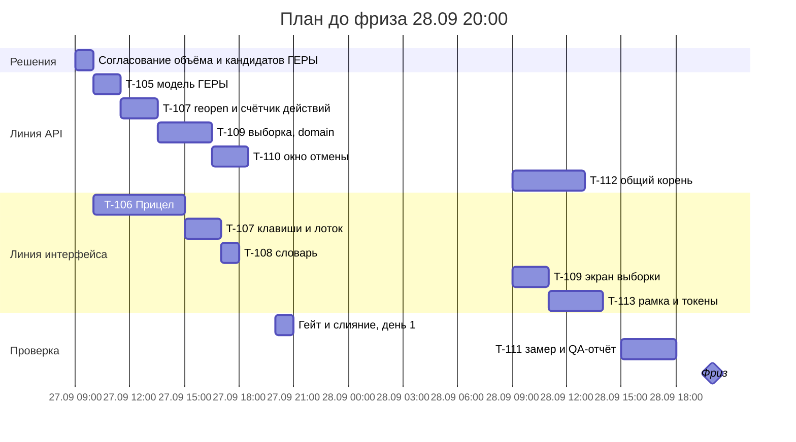

# 10. План работ

**Черновик для обсуждения.** Задачи в `tasks/` заводятся после согласования объёма.

**Ход работ (26.09, ночь).** Сделаны первые 20 % — только фронтенд, без API: **T-106** (ветка `feat/t106-pricel`)
включает Прицел (строка T-106 ниже), UI-часть клавиш из строки T-107 и словарь из строки T-108. Номер **T-107
занят** переводом API на PostgreSQL (соседняя сессия), поэтому строки ниже с T-107 и далее получат новые номера при
заведении задач. Серверная часть строки T-107 (`reopen`, счётчик действий) ждёт решения по правилам 4.1.15–4.1.16
и слияния PostgreSQL.

**Исполнение (27.09).** Весь объём плана, 39,5 ч, реализован в ветке `feat/t106-pricel`. Соответствие строк плана и
карточек в `tasks/`: строки T-106–T-108 — карточка **T-106**; T-109 — **T-110**; T-110 — **T-111**; T-112 и T-115
реализованы кодом под T-105; T-113 — **T-109**; T-114 — **T-123**; T-116 — **T-112**. Правила 4.1.8–4.1.16,
3.3.5–3.3.6 и 4.3.4 внесены в модель с кодом и тестами (**T-105**). Замер и отчёт по строке T-111 —
`docs/qa/QA-REPORT-T105-SCENARIOS.md`: мутационный скор новых модулей 84–99 %, UI 26/26, гейт зелёный. Замер
робота показывает задержку интерфейса (от J до доказательства на листе p50 35 мс); время инспектора замер не
доказывает. Паритет на сервере PostgreSQL 18.6 зелёный (737/737). Владелец 27.09 дал «да» на слияние в `main` и на «сводку сверки» вместо «протокола»
в интерфейсе. Слияние сделано. Название выгружаемого документа «Протокол проверки» (приложение к акту) не менялось.

## Рамки

| Что | Значение |
|---|---|
| Сейчас | 26.09, вечер |
| Фриз функциональности | 28.09 20:00 |
| Стоп-код | 29.09 23:59 МСК — после него ни коммитов, ни правок |
| Рабочих окон до фриза | 27.09 и 28.09 — около 24 часов работы агента с прогонами гейта |
| Обязательный порядок (правило №2) | до кода — сверка со стандартами (infra-as-a-code, qa-standard, iac-standard); новое правило — тестом в `apps/api/tests/domain-*.test.ts`; готовность — отчёт по `qa-report.template.md` с мутационным скором |
| Гейт | `scripts/heavy.sh scripts/local-gate.sh`, мутации — по одному модулю через `heavy.sh` |
| Модель ГЕРЫ | новые правила — в `03-services.md` только после «да» владельца, затем `pnpm trace` |

## Задачи и оценки

Оценка — часы работы агента, включая тест первым, правку и локальный гейт. Код — сколько строк задевается.

| № | Задача | Сценарии, ноу-хау | Правила ГЕРЫ | Где в коде | Оценка | Приоритет |
|---|---|---|---|---|---|---|
| T-105 | Перенос принятых кандидатов в модель, `pnpm trace` | все | 4.1.8–4.1.16, 3.3.5–3.3.6, 4.3.4 | `docs/gera/inspector` | 1,5 ч | обязательно |
| T-106 | **Прицел**: кроп вокруг рамки, камера, `Space` — весь лист, кэш документов pdf.js, предрендер следующих трёх | SC-05, Н1 | — (взаимодействие) | `Sheet.tsx` 302, `Verify.tsx` 333 | 5 ч | обязательно |
| T-107 | Клавиши по `e.code`, `2` → `1…6`, отмена `Z` (`reopen` в API), счётчик действий, оптимистичное решение без перезагрузки, лоток вместо тостов, три решения равного веса | SC-05 | 4.1.15, 4.1.16 | `Verify.tsx`, `services/inspections.ts` (`decide`) | 4 ч | обязательно |
| T-108 | Словарь инспектора в интерфейсе: «сводка сверки», «признано инспектором», «не представлено» | все | — | `lib/labels.ts` 71, тексты экранов | 1 ч | обязательно |
| T-109 | **Совпадения выборкой**: сборка партии, стратифицированный сэмплер с seed, граница ошибки, приёмка одним действием, экран | SC-04, Н2 | 4.1.8–4.1.11 | новый `domain/sample-accept.ts`, API, экран | 5 ч | обязательно (главный «вау») |
| T-110 | Сборка сводки и окно отмены финализации 10 с | SC-11 | 4.3.4 | `Inspection.tsx` 661, API | 2 ч | обязательно |
| T-111 | Замер эффекта: одна синтетическая проверка, механики выкл/вкл, `verify-timing`; QA-отчёт с мутационным скором | NFR-VERIFY-30 | — | `domain/verify-timing.ts`, `docs/qa` | 3 ч | обязательно |
| T-112 | **Общий корень**: сигнатура причины, веер однотипных, поштучная запись, пересчёт эталона при «не то изменение» | SC-06, Н3 | 4.1.12–4.1.14 | `domain`, `revisions.ts`, `Verify.tsx` | 4 ч | желательно |
| T-113 | **Язык и вписанная рамка**: токены «Чертёжный бетон», Geologica, только светлая тема, каркас «навигация на подложке — работа в рамке», язычки стадий на листах, переходы T1, T2, T8 | все, SMAP-05 | — | `styles.css` 228, каркас `main.tsx`, экраны | 5 ч (минимум — 3 ч: рамка + токены) | желательно |
| T-114 | Синтетика уровня помещения: «в ПД тёплый пол — в РД радиаторы», облако «Изм. N» на листе РД | SC-05, Н1, живые документы | 3.1.12, 3.4.6 (кандидаты) | `ml/synth` | 3 ч | желательно |
| T-115 | **Отпечаток доказательства**: перенос решений после дозагрузки | SC-10, Н4 | 3.3.5–3.3.6 | `domain`, `services` | 4 ч | можно |
| T-116 | «Мне сейчас»: `Enter` сразу в конвейер, срок проверки на карточке | SC-01 | — | `Inspections.tsx` 152 | 2 ч | можно |

**Сумма:** обязательно — 21,5 ч; желательно — ещё 12 ч; можно — ещё 6 ч. Всего 39,5 ч при
ёмкости около 24 ч до фриза. Всё не влезает, режем.

## После стоп-кода (бэклог)

Экран «Путь сверки», карточка «помещение: было → стало», облако изменений как якорь Прицела, черновик
требования о представлении документов (SC-03), черновик текста акта по формуле инспектора (SC-12),
реквизиты и хронология АОСР, граница ч. 1.3 ст. 52 (Н7), палитра `⌘K`, предпросмотр влияния правки
Матрицы (SC-16), чек-лист выезда (SC-13), самопроверка застройщика (SC-18), юзабилити-тест на 5 инспекторах (T-077).

## Три варианта объёма

| Вариант | Что входит | Часы | Риск |
|---|---|---|---|
| **A. Надёжно** | обязательное | 21,5 | низкий: запас на сбои гейта; демо показывает Прицел, выборку, отмену и замер |
| **B. Рекомендую** | обязательное + T-112 Общий корень + T-113 в минимуме (рамка и токены) | 28,5 | средний: нужен параллельный запуск двух агентов в отдельных worktree |
| C. Всё желательное | B + полный T-113 + T-114 | 35,5 | высокий: фриз съедает прогон мутаций и замер |

## Как выполняем (вариант B)

Две параллельные линии без общих файлов, слияние вечером каждого дня после локального гейта.

- **Линия API** (агент 1, worktree): T-105 → T-107 (API-часть) → T-109 (domain) → T-110 (API) → T-112 (domain).
- **Линия интерфейса** (агент 2, worktree): T-106 → T-107 (UI-часть) → T-108 → T-109 (экран) → T-113 (минимум).
- **Я** — сверка со стандартами, разбор конфликтов на слиянии, замер T-111 и QA-отчёт.

## Точки остановки

| Когда | Проверка | Если не выполнено |
|---|---|---|
| 27.09 20:00 | гейт зелёный, Прицел и клавиши работают | 28.09 — только T-109 и замер, T-112 и T-113 выпадают |
| 28.09 12:00 | T-109 работает, гейт зелёный | T-113 выпадает; язык остаётся текущим, меняются только тексты |
| 28.09 18:00 | замер записан | фриз без новых механик, только отчёт |
| 29.09 | только репетиция демо и документы | стоп-код 23:59 |

## Решения владельца

1. Вариант объёма: A, B или C. Рекомендация — B.
2. Принять кандидатов 4.1.8–4.1.16, 3.3.5–3.3.6, 4.3.4 в модель. Без этого T-107, T-109, T-110, T-112 не начинаются.
3. Параллельные агенты в двух worktree — да или нет. «Нет» означает вариант A.
4. «Сводка сверки» вместо «протокола» в интерфейсе.
5. Живые документы в демо — нет (подписи и реквизиты); вместо них T-114 перерисовывает случай «тёплый пол → радиаторы» на синтетике. Да или нет.
