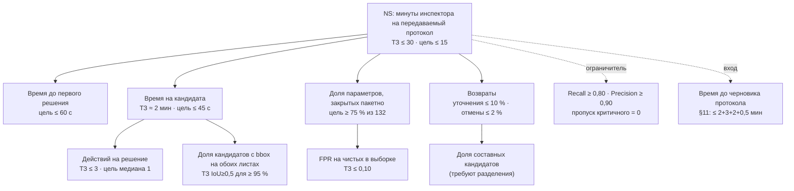

# Инспектор ИИ: продуктовая основа карты сценариев скорости

Вход: 01-survey, 02-business, 03-services (OS-INSP-*), 03b-dialogs (DLG-INSP-*), TZ-DECOMPOSITION §9.3/§11/§14,
TOP-20-ITER4, ML-CONCEPT. Внешние цифры найдены WebSearch 26.09.2026, источники в §7.

**Главный вывод до таблиц.** Замера AS-IS нет (01-survey, «Чего нет»), поэтому любая цифра экономии — модель,
а не факт. В Москве экономия ФОТ даёт десятки миллионов рублей, а не сотни. Сотни миллионов дают два других
рычага: предотвращённые переделки на бюджетных объектах и тиражирование на регионы и девелоперов. Сильный
рычаг скорости у инспектора один: не заставлять человека смотреть 118 «чистых» параметров, чтобы признать 14 кандидатов.

---

## 1. Роли и JTBD

| Роль | Топ-3 работы (JTBD: «когда …, хочу …, чтобы …») | Где сегодня горит время | Что уже закрыто в системе | Разрыв |
|---|---|---|---|---|
| **Инспектор ГСН** (исполнитель BO-INSP-1.*, 4.*, 5.1) | 1. Когда пришёл комплект ПД/РД/ИД, хочу сразу видеть только расхождения с доказательством на листе, чтобы не листать тысячи страниц. 2. Когда нашёл нарушение, хочу признать его в 1 действие с готовым обоснованием, чтобы оно годилось для предписания. 3. Когда застройщик дозагрузил документы, хочу перепроверить только изменённое, не теряя своих решений | Поиск значения и листа в трёх массивах (132 параметра × 3 источника); выбор актуальной редакции; перенос в протокол и акт; повторная полная проверка после дозагрузки | Очередь с J/K и 1/2/3 (DLG-09, OS-4.1.5); листы с bbox (4.1.1); инкрементальный пересчёт (3.3.4, v2 за 2,0 с на M4); текст для акта по 1318-ПП (DLG-20) | Нет пакетного признания «чистых»; очередь не упорядочена по риску × уверенности; таймер цикла не показан инспектору |
| **Супервизор / начальник отдела** (BO-4.4, 6.3, 8.2) | 1. Когда проверок больше, чем людей, хочу видеть, какие объекты горят, чтобы распределить нагрузку. 2. Когда инспектор расходится с ИИ, хочу видеть это до подписи, чтобы не выпустить спорный акт. 3. Когда нужна отчётность, хочу цифры цикла без ручного сбора | Ручной сбор статусов; разбор спорных случаев постфактум; отмены финализации | Дашборд (DLG-02); журналы отклонений и споров (DLG-17); отчёт по циклу `verify-timing.ts`, `/usability/verification-report` | Нет очереди «на контроль» по доле несогласий и SLA; нет нагрузки по инспекторам |
| **Администратор НСИ** (BO-7.*) | 1. Когда меняется норма (ГОСТ Р 21.101-2026), хочу поправить порог без релиза. 2. Хочу знать, какие проверки заденет правка, до её сохранения. 3. Хочу деактивировать норму, не ломая историю | Правка порогов через разработчиков; неизвестное влияние на открытые проверки | Матрица без перекодирования (DLG-10); версия Матрицы в протоколе (3.3.1) | Нет предпросмотра влияния («эта правка переведёт N кандидатов в чистые») |
| **ML-инженер** (BO-6.3–6.5) | 1. Хочу видеть, где модель ошибается, с причинами. 2. Хочу выпускать ступень под флагом без правки кода. 3. Хочу доказуемую приёмку по §14 до публикации | Ручной разбор отказов; отсутствие реальной разметки (10 находок TRAIN) | Журнал отклонений с «что исправить» (4.1.6); еженедельный отчёт (DLG-19); ворота публикации (6.3) | Нет единого реестра флагов (ML-CONCEPT §1.2) |
| **Куратор данных** (BO-6.1) | 1. Хочу получать GOLD как побочный продукт работы инспектора, а не отдельной разметкой. 2. Хочу разделение по object_id без утечек. 3. Хочу видеть покрытие классов | Разметка вручную, 2–3 ч на ≈30 отрицательных примеров (ML-CONCEPT §6) | GOLD только из CONFIRMED/NEGATIVE_VERIFIED (6.1.1); split по object_id (14.2-01) | Выборочный аудит «чистых» сейчас не даёт проверенных отрицательных меток, хотя мог бы (см. §5, ноу-хау 3) |
| **Застройщик / генподрядчик** (внешний, источник дозагрузки 1.2) | 1. Когда запросили уточнение, хочу получить точный список недостающего, чтобы закрыть за одну итерацию. 2. Хочу проверить ИД до подачи, чтобы не получить предписание. 3. Хочу знать статус предписания | Круги «запрос → письмо → дозагрузка»; неполный реестр файлов → CLARIFICATION_REQUIRED (1.2.6) | Перечень MISSING_EVIDENCE отдельным списком (4.3.2); статусы предписаний из «РиН» (5.4) | Нет машиночитаемого запроса недостающего; нет предпроверки на стороне застройщика |

Застройщик — не пользователь прототипа, но главный источник возвратов. Каждый круг дозагрузки — это дни календарного
времени проверки при минутах работы инспектора.

---

## 2. North Star и дерево метрик скорости

**North Star — «минуты инспектора на передаваемый протокол» (MTP):** медиана активного времени от открытия
верификации до финализации, которую потом не отменили. Активное время уже считает `verify-timing.ts` с порогом простоя.
Метрика защищена ограничителями качества: скорость, купленная пропуском нарушений, не засчитывается.

| Уровень | Метрика | Определение (как считаем) | ТЗ | Цель продукта | Где считается сейчас |
|---|---|---|---|---|---|
| NS | MTP, минуты на передаваемый протокол | медиана активных минут VERIFICATION_OPENED → PROTOCOL_FINALIZED без последующего FINALIZATION_CANCELLED | ≤ 30 мин ±10 (9.3.6-01, 11-15) | ≤ 15 мин медиана, ≤ 30 p90 | `verify-timing.ts` (есть); нужен фильтр «без отмены» |
| L1 | Время до первого решения (TTFD) | открытие → первое решение по кандидату | — | ≤ 60 с | `cycleOf`: источник FIRST_DECISION (есть) |
| L1 | Минут на кандидата | активное время ÷ число кандидатов в протоколе | неявно: 30 мин / 14 нарушений ≈ 2,1 мин | ≤ 45 с | выводится из журнала решений |
| L1 | Доля параметров, закрытых пакетно | NEGATIVE_VERIFIED + NOT_APPLICABLE, принятые одним действием с выборкой ÷ 132 | — (система ставит NEGATIVE_VERIFIED сама, 3.1.6) | ≥ 75 % | **нет**, это новый сценарий S2 |
| L1 | Возвраты на уточнение | CLARIFICATION_REQUIRED ÷ кандидаты; отмены финализации ÷ финализации | — | ≤ 10 % и ≤ 2 % | аудит (есть) |
| L2 | Действий на решение | нажатий или кликов от показа кандидата до решения | ≤ 3 (9.3.6-02) | медиана 1 (клавиша 1), отклонение ≤ 3 | не логируется; добавить счётчик |
| L2 | Доля кандидатов с доказательством на обоих листах | bbox в ПД и в РД/ИД | IoU ≥ 0,5 для ≥ 95 % (14.3-04) | ≥ 95 % | стенд §14 |
| L2 | Доля составных кандидатов | кандидаты, которые пришлось разделить (4.2) | — | ≤ 5 % | аудит |
| Вход | Время до черновика | загрузка → READY | 2 + 3 + 2 + 0,5 мин (11-01/02/04/05) | ≤ 10 мин на 100 стр. | PERF-11: 100 стр. OCR 91 с на M4 |
| Вход | Сквозное время протокола | загрузка → отправка в «РиН» | сумма §11 + 30 мин + 30 с | ≤ 45 мин | нет сквозного замера |
| Ограничитель | Recall / Precision / FPR | по §14.3 | ≥ 0,80 / ≥ 0,90 / ≤ 0,10 | те же, критичные без пропусков | стенд §14 |

**Узкое место входа.** Экзаменационный объект — около 16 тыс. страниц, 56 % сканов, и оценка по ML-CONCEPT
даёт 10–15 часов при одном процессе OCR. Инспектор работает 15 минут, но ждёт полдня. Для реальной скорости
это важнее UI-сценариев. Решение за CTO: параллельный OCR на GPU, приоритет листов, на которые ссылается Матрица.

---

## 3. Экономическая модель

### 3.1. Входные данные

| Код | Величина | Значение | Источник, дата | Статус |
|---|---|---|---|---|
| D1 | Стройплощадок под надзором Мосгосстройнадзора | ≈ 3 000 | gazetametro.ru, 16.10.2023 (итоги 9 мес. 2023) | факт, устарел на 3 года |
| D2 | Штрафов Мосгосстройнадзора | > 7 000 на сумму > 1,2 млрд ₽ за 9 мес. 2023 | там же | факт |
| D3 | Дистанционных проверок в долевом строительстве Москвы | 2 798 за 1-е полугодие 2026, в 92 % без нарушений | mperspektiva.ru, 29.07.2026 | факт, другой вид проверки |
| D4 | Ввод недвижимости в Москве | ≈ 6,5 млн м² жилья + 5,3 млн м² нежилой, 2025 | ria.ru 22.12.2025; nsn.fm (Ефимов) | факт |
| D5 | АИП Москвы (бюджетное строительство) | 895,2 млрд ₽ на 2026 (931,8 на 2025) | stroygaz.ru / mskagency.ru, АИП 2024–2026 | факт |
| D6 | Объём работ «Строительство» в РФ | 18,8 трлн ₽, 2025 | sherpagroup.ru, итоги 2025 (по Росстату) | факт |
| D7 | Ввод жилья в РФ | 108,1 млн м², 2025; запуски застройщиков 41,3 млн м² (−12 %) | kommersant.ru/doc/8397220 (Росстат) | факт |
| D8 | Норматив затрат заказчика на строительный контроль | 2,14 % стоимости строительства (ПП РФ № 468) | garant.ru, консультация | факт |
| D9 | Прямые затраты на переделки | 5 % стоимости проекта в среднем, разброс 2–20 % (CII) | asce.org, 22.01.2026 | факт, США |
| D10 | Измеренные затраты на переделки (Love, 2026) | 0,38 % до сдачи; 0,76 % с учётом исправлений после сдачи; на отдельных проектах до 7,3 % | asce.org, 22.01.2026 | факт, выборка подрядчиков |
| D11 | Средняя зарплата в Москве | 180 861 ₽ (2025); 173 748 ₽ (октябрь 2025, Росстат) | hr-ratings.com; rbc.ru | факт |
| D12 | Зарплата инспектора ГСН Москвы, брутто | 150 000 ₽/мес | — | **допущение** (данных по госслужбе Москвы не нашёл) |
| D13 | Стоимость часа инспектора с взносами | 150 000 × 1,302 × 12 / 1 970 ч ≈ **1 190 ₽/ч**, округлённо 1 200 | D12; взносы 30,2 % и 1 970 ч в год | **допущение** |
| D14 | Штат инспекторов Мосгосстройнадзора | не найден | — | **допущение**: в модели не нужен, считаем по проверкам |
| D15 | Число субъектов РФ с органом регионального ГСН | 85 по постановке; 89 по ст. 65 Конституции (ред. 2022) | ГрК РФ ст. 54 (consultant.ru): орган ГСН есть в каждом субъекте | 89 не перепроверено поиском |
| D16 | Время ручной камеральной сверки ПД↔РД↔ИД на объект (T0) | 12 / 20 / 32 ч | — | **допущение**: замера нет (01-survey), закрывается T-077 |
| D17 | Время с системой (T1) | 2 ч: загрузка, 30 мин верификации, чтение гипотез, акт | ТЗ 9.3.6-01 + запас | **допущение** |
| D18 | Конкуренты-смежники в Москве | «Проверка документов для оформления РС», «Платформа детекции нарушений» (в разработке), облачная предэкспертиза Мосгосэкспертизы | mos.ru/news/item/170147073, 19.05.2026 | факт: сервиса сверки ПД↔РД↔ИД для ГСН среди них нет |

### 3.2. Формулы

- **E1. Высвобождение ФОТ, Москва:** `E1 = N × (T0 − T1) × H`, где N — камеральных сверок в год, H = D13.
- **E2. Предотвращённые переделки, бюджет Москвы:** `E2 = V × r × c`, где V — АИП (D5), r — доля переделок (D10/D9),
  c — доля переделок, чья первопричина — расхождение ПД↔РД↔ИД, пойманное системой до исполнения работ (**допущение**).
- **E3. Тиражирование на регионы:** `E3 = N_reg × P_reg`, лицензия или SaaS в год.
- **E4. Предпроверка ИД у девелоперов:** `E4 = K × p`, где K — объектов в год, p — цена предпроверки объекта.
  Якорь цены: при нормативе строительного контроля 2,14 % (D8) у объекта за 10 млрд ₽ бюджет стройконтроля
  около 214 млн ₽, и p = 300 тыс. ₽ составляет 0,14 % этого бюджета.

E1 и E2 — эффект для города, E3 и E4 — выручка продукта. Складывать их можно только как «совокупный эффект», не как выручку.

### 3.3. Три сценария

| Рычаг | Параметры: консерв. / базовый / амбиц. | Консервативный | Базовый | Амбициозный |
|---|---|---|---|---|
| E1 ФОТ Москвы | N = 1 500 / 3 000 / 6 000 (0,5 / 1 / 2 сверки на площадку D1); T0−T1 = 10 / 18 / 30 ч | 18 млн ₽ | 65 млн ₽ (≈ 27 ставок) | 216 млн ₽ |
| E2 Переделки, АИП | V = 895,2 млрд; r = 0,38 % / 0,76 % / 5 %; c = 2 % / 5 % / 5 % | 68 млн ₽ | 340 млн ₽ | 2 238 млн ₽ |
| E3 Регионы | N_reg = 5 / 20 / 50 из 84; P_reg = 4 / 6 / 10 млн ₽ в год | 20 млн ₽ | 120 млн ₽ | 500 млн ₽ |
| E4 Девелоперы | K = 80 / 300 / 1 500 объектов (≈ 1 400 новых очередей в год при 41,3 млн м² запусков и средней очереди 30 тыс. м², допущение); p = 200 / 300 / 400 тыс. ₽ | 16 млн ₽ | 90 млн ₽ | 600 млн ₽ |
| **Эффект для Москвы (E1+E2)** | | **86 млн ₽** | **405 млн ₽** | **2,45 млрд ₽** |
| **Выручка продукта (E3+E4)** | | **36 млн ₽** | **210 млн ₽** | **1,10 млрд ₽** |
| **Совокупно** | | **122 млн ₽/год** | **615 млн ₽/год** | **3,55 млрд ₽/год** |

**Чувствительность.** Главный драйвер — c в E2. Чтобы один только E2 давал 100 млн ₽ при базовом r = 0,76 %,
достаточно c = 1,47 %. При c = 0 базовый сценарий падает до 275 млн ₽, и «сотни миллионов» держатся на E1 + E3 + E4.
Амбициозный E2 опирается на американский бенчмарк CII: для жюри его нужно называть потолком, а не прогнозом.

**Как проверить за пилот.** c измеряется так: доля подтверждённых нарушений, по которым к моменту проверки работы
ещё не выполнены, умноженная на медианную стоимость их переделки. Это два поля в карточке нарушения:
«работы выполнены?» и «оценка устранения». Их стоит добавить после стоп-кода.

**Позиционирование для жюри.** «Сотни миллионов» честно звучат так: «в базовом сценарии около 400 млн ₽ в год
для Москвы, главным образом за счёт переделок, которые не случились. Высвобождение инспекторов — около 27 ставок,
это ёмкость под рост ввода, а не сокращение».

---

## 4. Приоритизация сценариев скорости

RICE: Reach — проверок в квартал при N = 3 000 в год (750 = все); Impact — 0,25…3; Confidence — 0…1;
Effort — человеко-недели.

| № | Сценарий | Есть в коде | R | I | C | E | RICE | Решение |
|---|---|---|---|---|---|---|---|---|
| S2 | **Пакетное признание «чистых» с выборочным аудитом**: 118 параметров закрываются одним действием после просмотра случайной выборки из 5–8 штук; при расхождении в выборке пакет раскрывается целиком | нет | 750 | 3 | 0,6 | 1 | **1 350** | делать первым; единственный сценарий, который меняет порядок MTP |
| S5 | **Очередь по риску × уверенности**: критичные и сомнительные первыми, abstain-сигналы из `selective.ts` видны | частично | 750 | 1 | 0,8 | 0,5 | **1 200** | делать |
| S6 | **Протокол → акт → «РиН» без перепечатки**: текст для акта по 1318-ПП, отправка | есть (DLG-20, 5.2) | 750 | 0,5 | 0,9 | 0,5 | 675 | довести и показать |
| S4 | **«Что изменилось с прошлой проверки»**: дифф листов и пересчёт только затронутых параметров | есть (3.4, 3.3.4) | 375 | 2 | 0,7 | 1 | 525 | показать в демо |
| S8 | **Панель супервизора**: SLA, доля несогласий по инспектору, очередь «на контроль» | частично (DLG-17, отчёт цикла) | 750 | 0,5 | 0,7 | 1 | 262 | после хакатона |
| S3 | **Машиночитаемый запрос недостающего застройщику** + портал дозагрузки | нет (перечень MISSING есть) | 450 | 2 | 0,5 | 2 | 225 | после хакатона; кандидат в E4 |
| S9 | **Предпросмотр влияния правки Матрицы** для НСИ | нет | 750 | 0,25 | 0,6 | 1 | 112 | позже |
| S7 | **Предпроверка ИД застройщиком тем же движком** | нет | 75 | 3 | 0,3 | 6 | 11 | низкий RICE сейчас, но это главный рычаг E4 и сетевого эффекта: решение стратегическое, не по RICE |

**Ограничение по сроку.** Стоп-код 29.09 23:59, осталось около трёх дней. S2 — новая функция, 1 неделя по оценке.
Минимальный срез за день: кнопка «Принять чистые (N)» + модальное окно со случайной выборкой из 5 листов с рамками +
одна запись в аудите `BULK_NEGATIVE_ACCEPTED` с seed выборки. По ГЕРЕ это новое правило в OS-INSP-4.1, сначала
тест в `domain*.test.ts`. Не успевается за день — демо строится на S5, S4 и S6 без S2.

### «Вау» для жюри за 3 минуты

Жюри оценивает удобство (2 балла), доказательность (3) и функциональность (4) по доске `lct_scoring_board`.
Весь ролик держится на секундомере цикла в углу экрана: он уже считается в `verify-timing.ts`, его нужно только показать.

| Время | Кадр | Что видит жюри |
|---|---|---|
| 0:00–0:20 | Перетаскиваем синтетический пакет ПД/РД/ИД с реестром | принятые файлы с SHA-256, отклонённый файл с причиной |
| 0:20–0:40 | READY: «132 параметра — 14 кандидатов, 3 без доказательства, 115 чистых» | раздельные группы: пробел комплектности не превращается в нарушение |
| 0:40–1:00 | S2: «Принять чистые» → выборка 5 листов → одно действие | 115 параметров закрыты за 20 с, выборка записана в аудит |
| 1:00–1:50 | Очередь кандидатов, клавиши 1/2/3: ПД и РД рядом, рамки на листе, Δ; один составной кандидат делим | 4–5 решений за 50 с, у каждого доказательство |
| 1:50–2:20 | Застройщик дозагрузил лист → пересчитаны 3 параметра за 2 с, решения на месте, дифф листа подсвечен | работа не теряется при дозагрузке |
| 2:20–2:50 | Финализация → готовый текст для акта (основание 2078-ПП разд. 9(1), версии, хеш) → отправка в «РиН» | юридически пригодный выход |
| 2:50–3:00 | Секундомер: «цикл 6:40 при цели ТЗ 30:00; действий на решение: 1» | главный тезис одной строкой |

Честная оговорка в кадре: данные синтетические (ADR-0002), цифра цикла — демо-прогон, а не замер на пяти инспекторах (T-077).

---

## 5. Продуктовые ноу-хау с защитимостью

| № | Механика | Почему защитимо | Чем подтверждается в коде или ТЗ |
|---|---|---|---|
| 1 | **Разметка как побочный продукт работы.** Каждое решение инспектора — эталонная метка с reason_code, bbox, версиями источников и должностным лицом. Датасет растёт с каждым протоколом без отдельной разметки | Данные: такие метки создаёт только уполномоченный по ГрК ст. 54 инспектор внутри надзорного контура. У конкурента без потока проверок их нет, а купить их нельзя. Маховик: больше протоколов → точнее ранжирование → быстрее протоколы | OS-INSP-6.1.1, 4.1.6, TZA-14.1-01…03; журнал отклонений (DLG-17) |
| 2 | **Выборочный аудит «чистых» как статистическая гарантия.** Пакетное признание разрешается только после случайной выборки; объём выборки задаётся от наблюдаемого FPR, по логике приёмочного контроля. Каждая выборка — ещё и проверенные отрицательные метки, которых не хватает для доказательства FPR ≤ 0,10 | Методика, а не фича: скорость (минус 115 ручных позиций) и доказуемое качество одним механизмом. Закрывает дефицит отрицательных примеров (≥ 30 для FPR, ML-CONCEPT §6) бесплатно | 3.1.6 (система ставит NEGATIVE_VERIFIED), 14.3-06; требуется новое правило |
| 3 | **Юридически воспроизводимый протокол.** Протокол содержит matrix_version, model_version, dataset_version, input_manifest_hash и готовую запись о применении ИИ по ПП Москвы № 2078-ПП разд. 9(1) в ред. 1318-ПП. Любой вывод можно пересчитать и оспорить по хешу | Регуляторная: мы первыми попадаем в формат, который требует новый акт. Акт появился в мае 2026, в ТЗ его нет. Сменить поставщика — значит заново пройти юридическую приёмку формата | OS-INSP-3.3.1, 5.1.2, DLG-20, T-079 |
| 4 | **Асимметричный отказ от ответа.** По некритичным параметрам система честно говорит «сравнение невозможно», по критичным при сомнении выносит кандидата «требует проверки». Пропуск критичного дороже ложной тревоги | Доверие инспектора — главный барьер внедрения ИИ в надзоре. Правило асимметрии закреплено в предметном слое и тестах, а не в промпте | `apps/api/src/domain/selective.ts`, ML-CONCEPT §5; доска жюри: пропуск критичного — потолок 59 баллов |
| 5 | **Одна Матрица по обе стороны.** Застройщик прогоняет ИД тем же движком и той же версией Матрицы до подачи. Пакет приходит с хешем предпроверки, и инспектор видит, что изменилось с тех пор | Сетевой эффект: чем больше регионов на одной версионируемой Матрице, тем выгоднее федеральному девелоперу один формат подготовки ИД. Чем больше девелоперов, тем «чище» входящие пакеты у ГСН. Матрица как код с версиями — стандарт де-факто | Матрица без перекодирования (7.1), версия в протоколе (3.3.1); S7 — после хакатона |

Сознательно не ноу-хау: OCR, GLiNER, LLM-советник. Модели публичные. Ноу-хау в схеме меток и валидаторах
вокруг них (ML-CONCEPT §4.1) и в пяти механиках выше.

---

## 6. Риски, компромиссы, действия

| Риск или компромисс | Чем платим | Решение |
|---|---|---|
| S2 похоже на «ИИ подтвердил за инспектора» | юридический риск: только инспектор признаёт (01-survey п. 5) | пакетно принимаются только NEGATIVE_VERIFIED и NOT_APPLICABLE; CONFIRMED_VIOLATION пакетом — никогда; решение с user_id и seed выборки |
| Экономика без замера AS-IS | цифры T0 и c — допущения | в демо называть их допущениями; в пилоте 5 инспекторов (T-077) измеряют T0 и два поля для c |
| Вход 10–15 ч на крупном объекте съедает выигрыш в UI | NS хорош, сквозное время плохое | CTO: OCR на GPU и приоритет листов Матрицы; метрика «время до черновика» рядом с NS |
| Смежные сервисы Москвы (mos.ru, 19.05.2026) | риск «уже есть» | позиционирование: не проверка комплектности для разрешения на строительство, а сверка ПД↔РД↔ИД для ГСН с доказательством на листе |

| Действие | Ответственный | Готово, когда |
|---|---|---|
| Решить судьбу S2 до 27.09 утра: минимальный срез за 1 день или демо без него | владелец + CTO | «да» или «нет» записано в tasks/ |
| Вывести секундомер цикла и счётчик действий на экран верификации | фронтенд | цифры видны в демо-прогоне |
| Отфильтровать отменённые финализации в NS-отчёте `verificationReport` | бэкенд | тест в `domain-verify-timing.test.ts` |
| Слайд экономики: базовый сценарий, формулы, пометки «допущение» | CPO | каждая цифра со ссылкой |
| После стоп-кода: поля «работы выполнены?» и «оценка устранения» в карточке нарушения | CPO → ГЕРА | правило в 03-services, связь в model.yaml |

---

## 7. Источники (WebSearch 26.09.2026)

- Мосгосстройнадзор, итоги 9 месяцев 2023 (≈ 3 000 площадок, > 7 000 штрафов, > 1,2 млрд ₽): https://www.gazetametro.ru/articles/mosgosstrojnadzor-podvel-itogi-raboty-za-9-mesjatsev-2023-go-16-10-2023
- 2 798 проверок долевого строительства, 1-е полугодие 2026: https://mperspektiva.ru/topics/pochti-2-8-tys-proverok-stroek-zhilya-proveli-v-moskve-s-nachala-goda/
- Ввод в Москве 2025 (Ефимов): https://ria.ru/20251222/efimov-2063915042.html · https://nsn.fm/novosti-moskvy/efimov-v-2025-godu-v-moskve-postroili-53-mln-kvadratnyh-metrov-nezhiloi-nedvizhimosti
- АИП Москвы (895,2 млрд ₽ на 2026): https://www.mskagency.ru/materials/3336027 · https://stroygaz.ru/publication/construction/masshtabnye-plany-moskva-utverdila-gradostroitelnyy-byudzhet-do-2028-goda/
- Объём строительства РФ 2025, 18,8 трлн ₽: https://sherpagroup.ru/analytics/3p7pdnr
- Ввод жилья РФ 2025, 108,1 млн м²: https://www.kommersant.ru/doc/8397220
- Норматив строительного контроля 2,14 % (ПП РФ № 468): https://www.garant.ru/consult/account/1741911/
- Затраты на переделки, CII и Love 2026: https://www.asce.org/publications-and-news/civil-engineering-source/article/2026/01/22/how-much-does-field-rework-in-construction-actually-cost
- Зарплаты в Москве: https://hr-ratings.com/zarplaty-v-moskve · https://www.rbc.ru/life/news/6985bb749a79471eec2ff7ed
- ГСН в субъектах (ГрК РФ ст. 54): https://www.consultant.ru/document/cons_doc_LAW_51040/d6aa4f5374347120919d6d0ca106e089be185a9b/
- ИИ-сервисы Москвы для строительства (ЦИПР): https://www.mos.ru/news/item/170147073/

Не найдено в открытых источниках: штат инспекторов Мосгосстройнадзора, число камеральных проверок документации в год,
зарплата госслужащих Москвы по ведомству, объём рынка стройконтроля РФ в рублях. Всё это в модели помечено как допущение.
