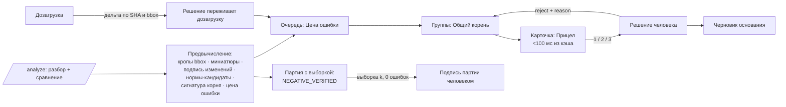

# Операционная скорость инспектора: ML/CV-ноу-хау

Источники: `docs/architecture/ML-CONCEPT.md`, `C4.md`, `docs/gera/inspector/03-services.md`, `docs/qa/PERF-11.md`,
код `ml/inspector_ml/*`, `apps/api/src/domain/*`, `apps/web/src/pages/Verify.tsx`, `components/Sheet.tsx`.
Ничего не запускалось.

## 0. Рамка: что вообще ускоряем

ТЗ 9.3.6 (NFR-VERIFY-30): полный цикл верификации (132 параметра, 14 нарушений) — не дольше 30 минут у опытного инспектора.
Замер уже есть в коде: `domain/verify-timing.ts` считает wall-clock и активное время по журналу аудита.

Модель времени инспектора (гипотеза, проверяется тем же `verify-timing.ts`):

| Составляющая на одного кандидата | Сейчас (оценка) | Куда уходит |
|---|---|---|
| Найти доказательство: открыть лист, долистать, найти рамку, приблизить | 15–25 с | pdf.js рендерит страницу целиком по клику; три листа — три рендера |
| Сравнить: ПД ↔ РД ↔ ИД, прочитать значения глазами | 10–15 с | зум на каждом листе отдельно |
| Решить и обосновать: reason_code + обязательный комментарий (OS-INSP-4.1.3) | 5–20 с | комментарий набирается с нуля |
| Итого на кандидата | ≈ 30–60 с | при 40–60 кандидатах — 20–60 минут |

Вывод: скорость решают **не модели**, а три вещи — (1) сколько кандидатов человек вообще открывает,
(2) сколько секунд от «открыл» до «вижу доказательство», (3) сколько решений делается одним действием.
Ниже — механики под каждую, все на уже существующих данных и коде.

**Юридические инварианты, которые ни одна механика не нарушает:**

- CONFIRMED_VIOLATION ставит только человек (OS-INSP-3.1.7, 4.1.2); ни одна механика не создаёт его пакетно.
- Гипотеза советника живёт только с файлом, страницей, bbox и дословной цитатой (3.2.4–3.2.5, `advisor.validate`).
- Система **никогда не скрывает** кандидата: она может переставить, сгруппировать, предзаполнить — но не убрать из очереди.
- Каждое предзаполнение (причина, комментарий, текст) помечается в аудите как «принято без правки» / «исправлено».

## 1. Ноу-хау — сводка

| # | Название | Что убирает у человека | Эффект (гипотеза) | Демо 29.09 |
|---|---|---|---|---|
| 1 | **Прицел** (доказательство-первым) | поиск и зум доказательства | 15–25 с → < 1 с на кандидата | да, целиком |
| 2 | **Общий корень** (распространение причины) | повтор одинаковых отклонений | −30…60 % решений-действий | да, на синтетике |
| 3 | **Партия с выборкой** (приёмка отрицательных по правилу трёх) | ручной просмотр «чистых» | 90 NEGATIVE → 30 просмотров | да, как механика; гарантия — только SYNTH |
| 4 | **Цена ошибки** (очередь по риску) | время на пустые кандидаты в начале сессии | критичные — в первые 5 минут | да, без ML (эвристика Матрицы) |
| 5 | **Решение переживает дозагрузку** (дельта-досье) | повторную проверку уже решённого | повторный цикл: 30 мин → 2–5 мин | да |
| 6 | **Дифф с подписью** (семантический дифф редакций) | разглядывание карты изменений | служебные изменения листа — 0 кликов | частично |
| 7 | **Недостача до старта** (комплектность наперёд) | цикл «начал → упёрся → запросил» | −1 цикл переписки (дни) | да |
| 8 | **Черновик основания** (текст по находкам с цитатами) | набор текста протокола/основания | 5–10 мин → 1–2 мин вычитки | шаблон без LLM — да; LLM — дорожная карта |

Отброшено / понижено — раздел 3.

## 2. Ноу-хау по одному

### 2.1. Прицел — доказательство раньше, чем инспектор о нём попросил

**Механизм.**
1. На `/analyze` ML уже держит растр каждой OCR-страницы и знает bbox каждого фрагмента. Там же режется **кроп
   вокруг bbox с полем 15 %** (WebP, ≈ 20–40 КБ) и миниатюра страницы; для текстовых PDF — рендер pdfium той же области.
   Кропы кладутся рядом с кэшем разбора по ключу `sha256+page+bbox` (`cache.py`).
2. Карточка кандидата открывается **сначала кропами** ожидаемого и фактического значения рядом, крупно, с подписанными
   значениями; полный лист в pdf.js подгружается фоном и открывается по `Space` уже спозиционированным на рамку.
3. **Синхронный зум:** листы ПД/РД/ИД в карточке двигаются вместе, привязка — по центру bbox на каждом листе,
   а не по координатам страницы (листы разного формата).
4. **Предвыборка:** пока инспектор смотрит кандидата N, клиент тянет кропы N+1…N+3 и открывает их PDF в воркере pdf.js.
5. Решение уходит оптимистично: интерфейс сразу переходит к следующему, запись идёт фоном с повтором;
   время решения в аудите ставит сервер.

**Данные/модели.** Есть: bbox в [0;1] с учётом CropBox/Rotate (OS-INSP-2.2.2), рендер и OCR в `parse.py`, кэш по SHA,
горячие клавиши J/K/1/2/3 в `Verify.tsx`, оверлеи в `Sheet.tsx`. Нет: эндпоинта кропов, предвыборки, синхронного зума.
Моделей не нужно.

**Метрика.** `time-to-evidence` (от перехода к кандидату до отрисовки кропов) p95 < 150 мс; клики до решения — 1
(клавиша) вместо 3–6; доля решений без открытия полного листа (цель ≥ 60 % для числовых параметров).

**Риск → как гасим.** Кроп вырывает значение из контекста (не та строка таблицы) → в кроп всегда входит **якорь
строки** (наименование параметра), а не только число; полный лист — одна клавиша; для OCR-страниц LOW_QUALITY кроп
показывается с меткой и «решение по кропу» для них не засчитывается как просмотр листа.

**Демо 29.09:** целиком, на `ml/synth/generate.py` (sever/school/clinic). **Дорожная карта:** тайловый предрендер A1/A0
(связано с `ocr.tiling`).

### 2.2. Общий корень — одно объяснение закрывает всех его детей

Улучшенная версия кандидата «обучение на отклонениях в реальном времени». Подавление отбрасываю: скрыть кандидата —
значит решить за человека. Вместо этого — **группировка по причине и пакетное подтверждение причины человеком**.

**Механизм.**
1. При сравнении у каждого кандидата считается **сигнатура корня**: `(file_id, page, LOW_QUALITY?)`,
   `(document_code, выбор редакции)`, `(param, compare_kind, |delta| ≤ 1,5×порог)`, «глобальное переименование систем».
2. Инспектор отклоняет кандидата с reason_code (например, `WRONG_REVISION` или `OCR_ERROR`).
3. Система тут же находит **соседей с той же сигнатурой** в этой проверке и показывает: «Ещё 7 кандидатов из-за той же
   редакции 132-…-ОВ изм.3. Отклонить с той же причиной?» — список с кропами (Прицел), снять галку с любого.
4. Одно действие = N записанных решений, **каждое** со своим user_id, временем, reason_code и пометкой
   `propagated_from=<check_id>` в журнале отклонений (`feedback-logs.ts`).
5. Обратная связь в конвейер: `WRONG_REVISION` → пересчёт эталона редакции для документа (OS-INSP-1.3) — кандидаты
   исчезают **сами, потому что пересчитаны**, а не потому что подавлены. `OCR_ERROR` → страница в перечитывание (`reread.py`).

**Данные/модели.** Есть: `REASON_CODES`, `SUGGESTED_FIX`, `rejectionEntry`, `revisions.ts`, `reread.py`. Нет: сигнатуры корня,
группового решения. Модель не нужна — правила; ML (кластеризация причин по признакам карточки `retrain.ts`) — позже.

**Метрика.** Действий на кандидата: цель ≤ 0,6 (сейчас 1,0); доля решений, принятых групповым действием.

**Риск → как гасим.** Групповое решение прячет исключение → групповое действие **только для отклонения** (никогда для
CONFIRMED_VIOLATION); критичные параметры Матрицы из группы исключаются и требуют отдельного решения; группа > 20 —
разбивается; всё обратимо до финализации.

**Демо:** синтетика с конфликтом редакций уже есть в `generate.py` — показать «отклонил одного → закрылись семь».

### 2.3. Партия с выборкой — «чистые» подписываются партией после выборочного контроля

Замена «конформной гарантии». Честная конформная калибровка на 10 размеченных находках невозможна (раздел 6 ML-CONCEPT:
честный n ≈ 4), а обещание «гарантии» жюри и юристам — мина. Статистически честная механика, работающая с нуля, —
**приёмочный выборочный контроль**.

**Механизм.**
1. NEGATIVE_VERIFIED система ставит сама (OS-INSP-3.1.6). Риск здесь — **пропуск**: значение извлечено неверно, и «совпадение» ложное.
2. Отрицательные делятся на страты: уверенное извлечение на текстовом слое / OCR / критичный параметр.
   Критичные и OCR с `conf < 0,7` в партию **не идут** — они в обычной очереди.
3. Из партии система случайно (seed в протоколе) вынимает k карточек и показывает их Прицелом. **Правило трёх:**
   0 ошибок в k=30 → верхняя 95 % граница доли ошибок в партии ≤ 10 %; k=60 → ≤ 5 %.
4. Нашлась ошибка → партия распадается в обычную очередь, reason_code уходит в «Общий корень».
5. Ноль ошибок → инспектор **одним действием подписывает партию**; в протоколе: размер партии, k, seed, граница.
6. Позже, когда в GOLD накопятся NEGATIVE_VERIFIED с проверкой по объектам, k уменьшается по конформному риску
   (Learn-then-Test), разбиение по object_id — но только после ворот OS-INSP-6.3.

**Данные/модели.** Есть: статусы, `confidence` у фрагментов, LOW_QUALITY, `gold.ts` с разбиением. Нет: страт, сэмплера,
записи партии в протоколе. Модель не нужна.

**Метрика.** Просмотров на 100 отрицательных: 100 → 30; верхняя граница пропуска публикуется числом в протоколе.

**Риск → как гасим.** Выборка случайна, но ошибки коррелированы (одна плохая страница) → стратификация по странице/файлу;
партия никогда не содержит критичных параметров; подпись партии — действие человека, а не системы.
Юридически: это переносит в ИИ-инспекцию привычную инспектору логику выборочного контроля — вопрос организатору (T-078).

**Демо:** механика на синтетике (`factory_v3.py` даёт исход «отрицательный» по каждому из 132 параметров);
граница помечается «SYNTH», на реальных данных — не заявляем.

### 2.4. Цена ошибки — очередь начинается с того, что дороже пропустить

**Механизм.** Порядок очереди = `критичность параметра (Матрица) × P(нарушение) × (1 − уверенность, если отказ)`.
Сейчас без обученной модели P(нарушение) — детерминированный прокси: `|delta|/порог`, согласие стадий, чистота страницы.
Когда `rank.ai_score` (`retrain.ts`, logreg + Платт) пройдёт ворота — прокси заменяется калиброванной вероятностью.
Внутри корня (2.2) кандидаты идут подряд — меньше переключений контекста.

**Данные.** Есть: `review_priority`, `retrain.ts`, асимметрия отказа по критичности (раздел 5 ML-CONCEPT). Нет данных
для обучения — поэтому до стоп-кода только прокси, флаг `rank.ai_score=off`.

**Метрика.** Время до первого CONFIRMED_VIOLATION по критичному параметру; доля критичных, решённых в первые 25 % сессии.

**Риск.** Очередь «учит» не смотреть хвост → финализация закрыта, пока есть необработанный CANDIDATE (OS-INSP-4.3.1) — уже есть.

**Демо:** да, сортировка по прокси. **Дорожная карта:** калибровка на GOLD после первых реальных проверок.

### 2.5. Решение переживает дозагрузку — досье объекта

**Механизм.**
1. У каждого решения есть **отпечаток доказательства**: SHA-256 файлов, страница, bbox, нормализованное значение, редакция-эталон.
2. Дозагрузка (OS-INSP-1.2.7) → пересчёт только параметров с новыми данными (OS-INSP-3.3.4, уже 2,0 с — PERF-11).
3. Если отпечаток у пересчитанного кандидата **совпал** — прежнее решение переносится с исходным user_id/временем и
   пометкой «доказательства не изменились». Если изменился любой компонент — кандидат снова в очереди с диффом «что стало иначе».
4. Для инспектора повторный цикл = только дельта.

**Данные.** Есть: SHA-256, версии протокола, `revisions.ts`, инкремент. Нет: отпечатка доказательства и переноса решения.

**Метрика.** Время повторной верификации после дозагрузки: доля перенесённых решений, минуты цикла v2 против v1.

**Риск.** Перенос решения при изменившемся контексте (новая редакция другого листа меняет эталон) → в отпечаток
входит эталон редакции (OS-INSP-1.3.1); перенос CONFIRMED_VIOLATION — только с визуальной пометкой и возможностью пересмотра.

**Демо:** да — загрузить синтетический пакет, решить 5 кандидатов, дозагрузить один файл, показать «перенесено 4, заново 1».

### 2.6. Дифф с подписью — изменения листа объясняются словами

**Механизм.**
1. `sheetdiff.py` (SIFT + RANSAC + SSIM) даёт области изменений с bbox на обоих листах (OS-INSP-3.4).
2. Для каждой области — текст слов из OCR/текстового слоя **обеих** редакций в bbox → токенный дифф:
   «Ø110 → Ø160», «В2.7 → В2.8», «добавлена линия».
3. Классификация области правилами: **служебная** (штамп, графа изменений, дата, номер изм.) / **числовая** / **код системы** /
   **геометрия без текста**.
4. Числовые и коды — привязываются к параметру Матрицы и помещению через якоря (`extract.py`, `semantic.py`), и карточка
   SHEET-DIFF получает подпись «изменение параметра X в помещении Y», а служебные складываются в одну строку «служебные изменения — 6».
5. Сверка с реестром согласованных изменений (OS-INSP-1.5, 3.1.9): изменение с основанием помечается.

**Данные.** Есть: `sheetdiff.py`, `domain/sheetdiff.ts`, OCR-слова с bbox, якоря. Нет: текстового диффа в области и классификатора.
VLM (Qwen3.5-9B) — только как «прочитать текст в двух кропах» для геометрии без текста, флаг `decide.roomdiff_vlm`, GPU.

**Метрика.** Доля областей, закрытых подписью без открытия листа; число SHEET-DIFF-кандидатов после сворачивания служебных.

**Риск.** Ложная «служебность» спрячет содержательное изменение → служебной считается только область внутри рамки штампа/графы
изменений по ГОСТ Р 21.101 (координаты штампа уже ищутся в `requisites.py`/`fields.stamp`), и она сворачивается, а не удаляется.

**Демо:** частично — синтетические листы `sheets.py` с двумя редакциями; подпись для числовых/кодов, служебные по рамке штампа.

### 2.7. Недостача до старта — комплектность как первое, что видит инспектор

**Механизм.**
1. Сразу после приёма (до OCR всего пакета) — `completeness.ts` (UPLOADED/PARTIAL/MISSING, сценарий) и `hidden-works.ts`
   (перечень скрытых работ из Общих данных ↔ АОСР, OS-INSP-1.4.4).
2. Реквизиты ИД (`requisites.py`): нет штампа «В производство работ» / подписи → MISSING_EVIDENCE по документу (OS-INSP-2.3).
3. Сборка **черновика запроса застройщику**: перечень недостающего с основанием (Приказ Минстроя № 344/пр, пункт; позиция
   перечня скрытых работ с bbox), отдаётся инспектору на отправку через РиН или письмом — отправляет человек.
4. Проверка по параметрам, зависящим от недостающего, помечается «ждёт документов» и не занимает очередь.

**Данные.** Есть: `completeness.ts`, `hidden-works.ts`, `requisites.ts/py`, `doctype.py`. Нет: шаблона запроса,
связи параметр ↔ требуемый документ ИД в Матрице (частично — `source_id`).

**Метрика.** Время от загрузки до «инспектор знает, чего не хватает» (цель < 1 мин против «на 20-й минуте проверки»);
число циклов дозапроса на объект.

**Риск.** 109 из 154 файлов корпуса — `other` (вид документа не распознан) → ложная «недостача». Гасим: MISSING только по
реестру и перечню, «не распознан» — отдельная строка «уточнить», не требование застройщику. GLiNER (`link.gliner`) поднимет
распознавание — после замера.

**Демо:** да — `generate.py` уже закладывает пропуски комплекта.

### 2.8. Черновик основания — текст пишется из доказательств, а не из головы

**Механизм.**
1. Из подтверждённых человеком записей собирается **детерминированный** черновик раздела протокола / основания для
   предписания: параметр, ожидаемое (ПД, шифр, лист, bbox), фактическое (РД/ИД), дельта, цитата-кроп.
2. Норма подбирается `normsearch.py` (BM25 по 13 актам, реранк — если есть Ollama) и **вставляется дословной цитатой пункта**
   с редакцией и датой действия (OS-INSP-7.2.2); выбор нормы — клик инспектора из 3 кандидатов.
3. LLM (флаг `hyp.advisor`, GPU) — только перефраз связок между фактами; валидатор тот же, что у советника: каждое
   предложение черновика обязано ссылаться на finding_id или цитату нормы; «голое» предложение подсвечивается и не экспортируется.
4. Предписание выдаётся в РиН человеком (BO-INSP-5.3 — вне системы); система отдаёт основание.

**Данные.** Есть: `normsearch.py`, `render.py` (PDF/DOCX), `ai-usage.ts` (запись о применении ИИ, п. 9(1).8). Нет: текстов 13
актов с разметкой по пунктам (в сиде — справочник), шаблона основания, LLM на стенде.

**Метрика.** Минуты на оформление 14 нарушений (оценка: 5–10 мин набора → 1–2 мин вычитки); доля предложений с якорем = 100 %.

**Риск.** Галлюцинация нормы → норма только дословной цитатой из индекса, LLM её не пишет; ответственность — подпись инспектора.

**Демо:** шаблонный вариант без LLM — да. **Дорожная карта:** LLM-связки на H100, разметка 13 актов по пунктам.

## 3. Кандидаты, которые я не беру или понижаю

| Кандидат | Вердикт | Почему |
|---|---|---|
| Конформная гарантия на «чистые» | **заменить** на 2.3 | нет калибровочных данных (честный n ≈ 4), обмен объектами не доказан; вернуть как надстройку над выборкой, когда GOLD ≥ сотни отрицательных по ≥ 5 объектам |
| Подавление однотипных ложных у объекта | **заменить** на 2.2 | подавление = решение без человека и невидимый пропуск; пересчёт по причине — то же ускорение без юридического риска |
| Измерение на чертеже как доказательство | **понизить**, встроить в Прицел | `measure.py` рабочий, но параметров Матрицы, решаемых геометрией, мало; ускоряет редкие случаи. В карточку — «приложить измерение» одной клавишей; в находки не идёт до замера качества на реальных листах |
| «Ещё одна модель» (VLM/OCR на GPU) как ноу-хау скорости | **не ноу-хау скорости** | повышает качество, но на скорость инспектора влияет через число ложных кандидатов — это уже учтено в 2.2/2.4 |

## 4. Бюджет латентности UI

| Действие | Бюджет | Как достигается | Где предвычислено |
|---|---|---|---|
| Клавиша 1/2/3, J/K → следующий кандидат на экране | **< 100 мс** | оптимистичный переход, запись фоном | очередь и порядок — на сервере при `/analyze`, в клиенте целиком |
| Кропы доказательств кандидата | **< 100 мс** (из предвыборки), < 250 мс холодно | статические WebP по ключу SHA+page+bbox, HTTP-кэш immutable | кропы режутся на `/analyze` |
| Подпись дифф-области, нормы-кандидаты, сигнатура корня | **< 100 мс** | лежат в карточке | на `/analyze` / `/diff` |
| Группа «Общий корень» после отклонения | **< 100 мс** | сигнатуры уже в клиенте, группировка локально | сигнатуры — на `/analyze` |
| Полный лист в pdf.js, спозиционированный на bbox | < 1 с, фоном | воркер pdf.js, предзагрузка N+1…N+3 | миниатюры страниц |
| Синхронный зум трёх листов | 16 мс на кадр | CSS-трансформация поверх уже отрисованного канваса | — |
| Партия с выборкой: формирование | < 300 мс | сэмплер детерминирован по seed | страты — на `/analyze` |
| Пересчёт после дозагрузки | фоном, 2–60 с (TZA-11-09) | инкремент по SHA | отпечатки доказательств |
| Черновик основания (шаблон) | < 1 с | детерминированная сборка | нормы-кандидаты по параметру |
| Черновик основания (LLM) | фоном, до 30 с | стриминг, флаг | — |
| Советник, дифф редакций, OCR | фоном, минуты | очередь | — |

Правило: **всё, что инспектор видит в карточке, вычисляется до того, как он её открыл**. На клик сервер отвечает
только записью решения (p95 18,5 мс — PERF-11). Новые артефакты `/analyze` (кропы ≈ 30 КБ × 3 фрагмента × ~200
кандидатов ≈ 18 МБ на объект) — укладываются в текущий кэш.

## 5. Что показать 29.09 и что в дорожную карту

| Демо на синтетике (`ml/synth`) | Дорожная карта |
|---|---|
| Прицел: кропы, синхронный зум, предвыборка, секундомер `verify-timing` на экране | тайлы A0/A1, VLM-чтение геометрии |
| Общий корень: «отклонил одного — закрылись семь» с журналом | кластеризация причин моделью по картам `retrain.ts` |
| Партия с выборкой: 30 из 90, граница «≤ 10 %, SYNTH» | конформный риск на GOLD по объектам |
| Цена ошибки: прокси по Матрице | калиброванный `rank.ai_score` после ворот 6.3 |
| Решение переживает дозагрузку: v1 → v2, «перенесено 4, заново 1» | перенос между проверками одного объекта |
| Недостача до старта + черновик запроса | GLiNER для вида документа и ссылок ИД→РД |
| Черновик основания шаблоном с дословными нормами | LLM-связки на H100, разметка 13 актов по пунктам |
| Дифф с подписью: числа/коды + свёртка служебных | классификатор изменений, обученный на решениях |

**Приоритет по отдаче на час работы до фриза 28.09 20:00:** 1 → 2 → 5 → 7 → 4 → 3 → 8 → 6.
Все механики — чистые функции в `apps/api/src/domain` с тестом первым (правило проекта); новые правила — кандидатами
в ГЕРУ, в `03-services.md` — только после «да» владельца.

## 6. Как доказать эффект, а не заявить

- Один сценарий, одна синтетическая проверка, два прогона: механики выключены / включены (флаги), замер
  `verify-timing.ts` — wall-clock, активное время, решений, действий на кандидата, time-to-evidence p95.
- Цифры до замера на людях — **гипотезы**; ТЗ 9.3.6 принимается на 5 инспекторах, наш замер — на себе, так и пишем.
- Корпус `yandex:…` не используется ни для демо, ни для замера (ADR-0002).
