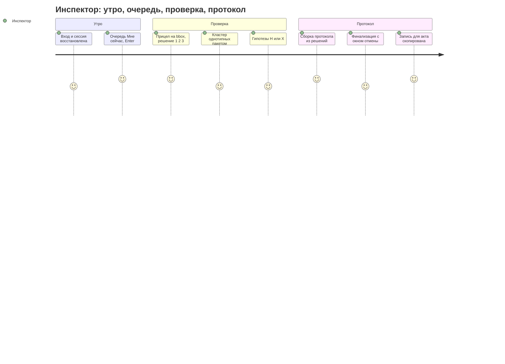
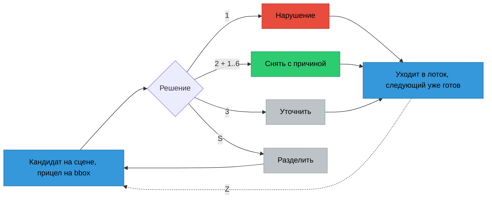
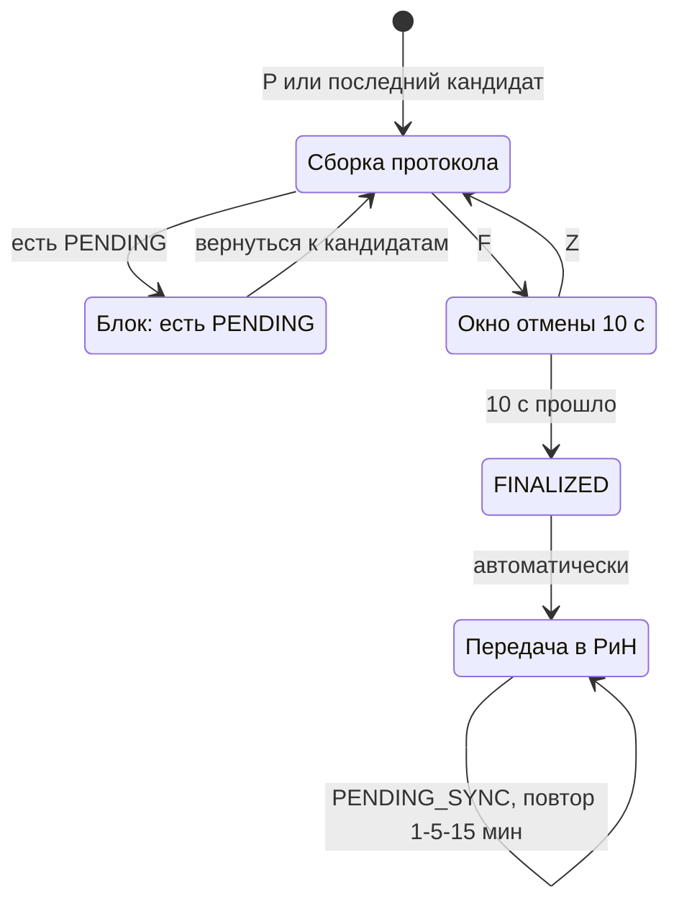
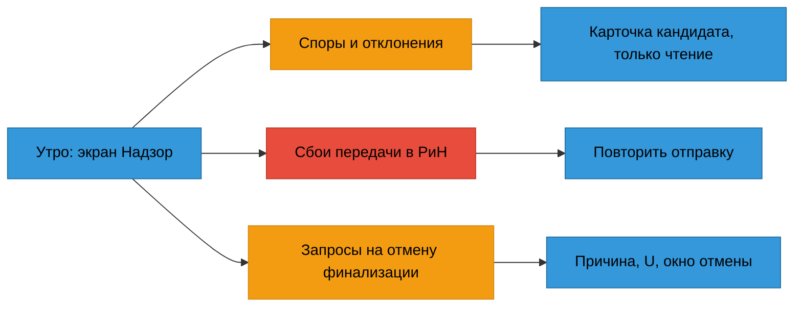
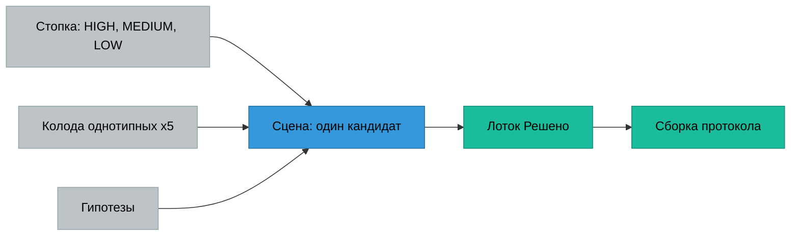

# Инспектор ИИ: сценарии TO-BE, рассчитанные на скорость

Основание: 03b-dialogs.md (DLG-INSP-01…20), 03-services.md (OS-INSP-3.*, 4.*, 8.*), 02-business.md,
`apps/web/src/pages/{Verify,Inspection,Inspections}.tsx`, `components/Sheet.tsx`, `styles.css`.
Целевые требования: весь цикл по 132 параметрам с 14 нарушениями — не больше 30 мин (NFR-VERIFY-30); решение по кандидату —
не больше 3 кликов (OS-INSP-4.1.5); интерфейс светлый, «в духе ClickUp».

**Главный тезис.** Время инспектора уходит на то, чтобы **найти значение на листе** и **дождаться следующего
кандидата**, а не на сами клики. AS-IS хорошо справляется с кликами (1/2/3 уже есть), но показывает лист формата A1
в колонке шириной 260–400 px и после каждого решения заново загружает всю проверку. TO-BE строится на трёх опорах:
**прицел на bbox**, **предзагрузка**, **отмена вместо подтверждений**.

---

## 1. Критика AS-IS: где теряются секунды, клики и внимание

### 1.1 `Verify.tsx` + `Sheet.tsx` — главный экран, 80 % времени цикла

| # | Где | Что не так | Цена | Решение TO-BE |
|---|---|---|---|---|
| V1 | `Sheet.tsx` `PdfPage`: `getViewport({scale:1.6})`, `canvas {width:100%}` | Лист рендерится целиком и ужимается до ширины колонки. `.sheets` раскладывает листы по сетке `minmax(260px,1fr)`, и на 1440 px каждый из 2–3 листов получает 260–330 px. На чертеже A1 bbox значения занимает 3–6 px, прочитать цифру невозможно, а зума и панорамирования нет | 10–25 с на кандидата: открыть файл отдельно или прищуриться. Главная потеря цикла | Камера с автоприцелом на bbox (§3.3) |
| V2 | `PdfPage` useEffect | На каждого кандидата вызываются `pdfjs.getDocument()` и полный рендер заново. Кэшируются только байты, `PDFDocumentProxy` не кэшируется, следующий кандидат не предзагружается | 0,4–2 с пустого холста на каждом переходе | Кэш документов, предрендер кропа следующих 2 кандидатов (§3.5) |
| V3 | `decide()` → `reload()` | После каждого решения заново запрашивается `GET /inspections/:id`: все 132 проверки, все файлы и их реквизиты | 200–800 мс, лишний ре-рендер всего экрана | Оптимистичное обновление одной записи, фоновая сверка |
| V4 | `decide()` → `toast(r.system_comment)` | После каждого решения приходит тост с длинным системным текстом (`inspections.ts:627`) | Взгляд уходит в правый нижний угол 20 раз за цикл | Тихий счётчик в лотке «Решено» и тост только с «Отменить» |
| V5 | `onKey`: `e.key === "j"` / `"k"` | **J/K не работают в русской раскладке**: там `e.key` равен «о»/«л». Инспектор, который только что набирал комментарий по-русски, нажимает J и ничего не происходит | Потеря доверия к клавиатуре, дальше человек работает мышью | Сопоставлять клавиши по `e.code` (`KeyJ`), а не по `e.key` |
| V6 | Отклонение: `2` → причина (клик) → «Отклонить» (клик) | С клавиатуры отклонение не завершить: `2` открывает панель, фокус в textarea не переводится, причины цифрами не выбрать, Enter не отправляет. Шесть кнопок с длинными подписями переносятся в несколько строк | 3 клика плюс поиск глазами среди 6 кнопок, около 4 с | `2` → `1…6` (причина) и сразу отправка. Комментарий подставлен и правится в окне отмены |
| V7 | `.btn.danger` «Подтвердить» и `.btn.good` «Отклонить» | «Подтвердить» — первая и самая насыщенная красная кнопка. Визуальный вес подталкивает к согласию с ИИ (automation bias), хотя по OS-INSP-3.1.7 решение принимает только человек | Риск ложных подтверждений, юридический | Три решения с равным весом, цвет только у маркера исхода |
| V8 | Карточка → `srcs` | SHA-256 выводится в каждой строке источника, в горячей зоне | Шум, около 1 с на отсев глазом | Хеш — в раскрытии по `I` (info) и в протоколе |
| V9 | `.viewer` | Легенда рамок и чекбокс «реквизиты» отрисовываются заново на каждом кандидате и занимают 2 строки над листом | Минус 50 px по высоте, шум | Легенда один раз в справке `?`, реквизиты переключаются клавишей `R` |
| V10 | `queue` | В плоский список попадают все кандидаты, в том числе решённые (rank 2). Групп, прогресса и отметки «просмотрен» нет. Однотипные кандидаты (например, 5 штук из-за одной заменённой редакции) идут вперемешку | Нельзя принять пакетное решение, нет ощущения темпа | Конвейер-стопка с кластерами (§3.2) |
| V11 | Разделение (`split`) | Выполняется сразу по клику, без предпросмотра частей и без отмены | Ошибка необратима до финализации | Предпросмотр N частей, `Enter`, отмена `Z` |
| V12 | `@media (max-width:1100px)` | Три колонки складываются в одну, лист уходит под карточку | На ноутбуке 13″ приходится прокручивать | Колонку очереди убирать клавишей `\`, лист всегда главный |

### 1.2 `Inspections.tsx` — утро инспектора

- **I1.** Пять KPI-плиток показывают сумму по всем объектам. Это отчёт, а не очередь: инспектор хочет знать, «что мне делать сейчас», а не «сколько нарушений во вселенной». Плитки занимают 90 px, и ни одна не кликабельна.
- **I2.** До начала работы три хопа: строка → `Inspection` (Обзор) → «Верифицировать» → `Verify`. Лишний экран и около 2 с на каждую проверку.
- **I3.** По списку нельзя ходить клавиатурой, у поиска нет клавиши `/`. Четыре фильтра (select, select, date, date) — всегда развёрнутые формы.
- **I4.** Группы по цвету (OS-INSP-8.1.1) внутри не отсортированы по срочности. Нет сроков и нет признака «моя / не моя».

### 1.3 `Inspection.tsx` — карточка проверки

- **C1.** Шесть вкладок равного веса. Работа инспектора живёт в «Протоколе» и «Верификации», но «Верификация» вынесена на отдельный маршрут, а «Протокол» — это статичный список, из которого запись открывается в другом экране.
- **C2.** «Завершить» финализирует протокол одним кликом: ни сводки, ни подтверждения, ни окна отмены. Действие необратимо для инспектора, отменить его может только супервизор (OS-INSP-4.4.1). Это единственное место, где нужен тормоз, и именно здесь его нет.
- **C3.** Во время `PARSING` каждые 1500 мс перезапрашивается вся проверка. Нет ETA и нет покомпонентного прогресса по стадиям.
- **C4.** Шесть KPI дублируют дашборд. Четыре кнопки экспорта (PDF/DOCX/XML/JSON) равного веса стоят на главном экране, хотя основной формат один.
- **C5.** `UnfinalizeButton` раскрывается прямо в шапке: причина вводится в топбаре, вне контекста журнала.

### 1.4 `styles.css` — визуальный язык

- Фиолетовый акцент `#6a4df4` на тёмном рейле и белые карточки на `#f3f4f8`: это ClickUp один в один и заодно один из кластеров ИИ-дефолта (индиго/фиолетовый SaaS). Фон почти белый, поэтому карточки от него не отделяются.
- Стадии ПД/РД/ИД окрашены в фиолетовый, бирюзовый и оранжевый. Плюс шесть статусных цветов и акцент — больше девяти хроматических сигналов на одном экране. Цвет перестаёт что-либо значить.
- Анимаций нет вовсе, `prefers-reduced-motion` глушит всё через `!important`. Нет ни пространственной памяти (откуда пришёл кандидат и куда ушёл), ни подтверждения действия движением.

---

## 2. Карта сценариев TO-BE

### 2.0 Бюджет времени цикла (NFR-VERIFY-30)

Типичный пакет: 132 параметра → около 22 кандидатов (14 истинных, около 8 ложных), около 6 гипотез,
около 4 MISSING_EVIDENCE, остальное — NEGATIVE/N/A.

| Этап | Кол-во | Цель на единицу | Итого |
|---|---|---|---|
| Вход в работу (дашборд → первый кандидат) | 1 | ≤ 5 с, 1 нажатие | 0,1 мин |
| Кандидаты: чтение листа + решение | 22 | ≤ 45 с (из них интерфейс ≤ 3 с) | 16,5 мин |
| Кластеры однотипных (пакетно) | 2 кластера | ≤ 20 с | 0,7 мин |
| Гипотезы: взять или отклонить | 6 | ≤ 20 с | 2 мин |
| Уточнения и MISSING_EVIDENCE: просмотр | 4 | ≤ 20 с | 1,3 мин |
| Сборка протокола и финализация | 1 | ≤ 90 с | 1,5 мин |
| **Итого** | | | **≈ 22 мин, запас 8 мин** |

Интерфейсные SLO: переход к следующему кандидату — **≤ 100 мс до прицела на bbox** (он предзагружен);
решение — **1 клавиша** (подтвердить, уточнить) или **2 клавиши** (снять с причиной); **0 модальных подтверждений** в цикле.

### 2.1 Инспектор: сквозной день

#### S1. Утро → очередь (DLG-INSP-01, 02 · OS-INSP-8.1)

- **Триггер:** начало смены или уведомление «протокол выпущен» (OS-INSP-3.3.3).
- **Шаги:** вход (сессия 8 ч, повторный ввод не нужен) → экран **«Мне сейчас»**: одна колонка карточек-проверок, отсортированных по правилу «READY с кандидатами → VERIFYING (начато) → PARSING (ETA) → ошибки синхронизации». На карточке: объект, счётчик «осталось N решений», оценка «≈ 14 мин», цветовая точка OS-INSP-8.1.1. Группы красный/жёлтый/зелёный сохраняются как **фильтр-чипы** над списком, а не как заголовки таблиц.
- **Клики и время:** 0 кликов, `Enter` на первой карточке → **сразу в верификацию на первом PENDING**, минуя «Обзор» (устраняет I2). Цель — ≤ 5 с от входа до первого листа.
- **Клавиатура:** `J/K` — по карточкам, `Enter` — продолжить верификацию, `O` — открыть обзор проверки, `/` — поиск, `F` — фильтры (раздел ПД, даты), `N` — новая проверка.
- **Пустое состояние:** «Решать нечего. 3 проверки в разборе, ближайшая будет готова ≈ через 6 мин» + ссылка «Загрузить пакет (N)». Без иллюстрации.
- **Ошибки:** PENDING_SYNC висит больше 15 мин (OS-INSP-5.2.2) — строка-плашка на карточке «Не ушло в РиН, 3 попытки», действие «Повторить» (`⇧R`).

#### S2. Загрузка и разбор (DLG-INSP-03, 04 · OS-INSP-1.1, 1.2, 1.4)

- **Триггер:** `N` или перетаскивание файлов в любое место окна: глобальная drop-зона появляется только во время drag.
- **Шаги:** файлы и реестр → карточка объекта подставляется из реестра (JSON/CSV), и инспектор только сверяет её → «Загрузить» (`⌘Enter`). Экран превращается в **ленту разбора**: по стадиям ПД/РД/ИД идут полоски файлов, у каждой свой статус (очередь, OCR, извлечение, готово, LOW_QUALITY), общий ETA и «Уведомить, когда будет готово».
- **Клики:** ≤ 3 (drop, сверка, запуск).
- **Ошибки:** превышение 200 МБ показывается до отправки, а не после. Отклонённые файлы — список с кодом причины и действием «Заменить», которое открывает выбор файла точечно. Нет реестра — жёлтая плашка «Без реестра редакции определяются по штампам — возможны уточнения», продолжить можно.
- **Переход:** когда разбор закончился, карточка в «Мне сейчас» поднимается наверх с отметкой «Готово». Окно автоматически не перехватывается.

#### S3. Конвейер решений — ядро (DLG-INSP-09, 15, 16 · OS-INSP-4.1, 4.2, 3.1.9, 2.3, 2.4)

- **Триггер:** `Enter` из «Мне сейчас» или `G V` с карточки проверки.
- **Шаги на одного кандидата:**
  1. Появление: сцена уже в прицеле на bbox, листы ПД|РД|ИД стоят в фиксированных колонках (§3.3).
  2. Чтение: крупно «ожидается → факт, Δ, порог» в правой рейке. `Tab` циклически перебирает источники (камера переезжает к bbox выбранного листа), `Space` удерживается для показа всего листа, отпускание возвращает прицел.
  3. Решение: `1` — нарушение, `2` → `1…6` — снять с причиной (причины пронумерованы, комментарий подставлен), `3` — уточнить. Если есть согласованное изменение (OS-INSP-3.1.9), причина APPROVED_CHANGE стоит первой и предвыбрана: `2`, `Enter`.
  4. Уход: запись улетает в лоток «Решено» (переход T1), следующий кандидат уже на сцене.
- **Клики мышью:** подтвердить — 1, снять — 2 (кнопка «Снять» → строка причины, отправка по выбору), уточнить — 1. Укладываемся в OS-INSP-4.1.5 с запасом.
- **Комментарий (OS-INSP-4.1.3):** подставляется из причины. `C` открывает поле **до** решения. После решения 8 секунд горит тост «Снято · WRONG_REVISION · Изменить комментарий (C) · Отменить (Z)».
- **Советник ИИ:** его позиция — одна строка серым под значениями. «Согласен / не согласен с советником» отдельно не спрашивается: расхождение пишется в спорные случаи автоматически (OS-INSP-4.1.7).
- **Разделение (OS-INSP-4.2):** `S` показывает предпросмотр N атомарных частей (переход T6), `Enter` применяет, `Esc` отменяет. Части встают в очередь на место исходного кандидата.
- **Слои листа:** `R` — реквизиты (DLG-15), `M` — измерение (DLG-16; при «Несопоставимо» — текст вместо линий, OS-INSP-2.4.3), `D` — дифф было/стало для SHEET-DIFF (§3.4).
- **Пустое состояние:** «Кандидатов нет. Все 132 параметра разобраны системой. Перейти к сборке протокола — P».
- **Ошибки:** решение не сохранилось — запись **возвращается на сцену** с красной строкой «Не сохранено: <причина>», `Enter` повторяет, очередь не сдвигается. Лист не отрисован — кроп-заглушка с шифром, страницей и «Открыть файл целиком» (`⇧O`) плюс извлечённое значение текстом. Решать можно и без картинки, но решение помечается «без просмотра листа» в журнале.
- **Финализированный протокол:** сцена в режиме «только чтение», клавиши решений сняты, в рейке причина и кто может отменить.

#### S4. Пакетные решения по однотипным (OS-INSP-4.1 · 4.2.1)

- **Триггер:** система сгруппировала кандидатов в **кластер** по одинаковой сигнатуре (одна пара документов и та же спорная или заменённая редакция; одна область изменений листа; один параметр в нескольких разделах). В стопке кластер выглядит как «колода ×5».
- **Шаги:** `Enter` на колоде → раскладка «веером»: 5 мини-сцен сеткой, каждая в прицеле → `X` отмечает/снимает отметку, `⇧A` отмечает все → `2` + причина → решения записываются **поштучно** (у каждой записи свой user_id, время и комментарий, OS-INSP-4.2.1).
- **Ограничение:** **пакетное «Нарушение» (`1`) доступно только для просмотренных** записей: мини-сцена засчитывается просмотренной через ≥ 1,5 с в фокусе. Пакетно снимать и уточнять можно сразу. Подтверждать нарушение, не взглянув на лист, нельзя — это юридическая граница, а не UX-вкус.
- **Цель:** 5 однотипных за ≤ 20 с вместо 5 × 45 с.

#### S5. Гипотезы вне Матрицы (DLG-INSP-07 · OS-INSP-3.2)

- Отдельная полоса в конце стопки «Гипотезы · не нарушения». Сцена та же, но рейка другого тона: нейтральная, без красного.
- `H` — взять в работу, то есть перевести в CANDIDATE: доступно, если есть файл, страница и bbox (OS-INSP-3.2.7). Запись **встаёт в очередь кандидатов** под текущей. `X` — отклонить, `→` — пропустить («не рассмотрена»).
- У ML_PATTERN показывается медиана истории и объём выборки одной строкой (OS-INSP-3.2.9).

#### S6. Сборка протокола и финализация (DLG-INSP-04, 06, 08, 20 · OS-INSP-3.3, 4.3, 5.1, 5.2)

- **Триггер:** решён последний кандидат. Сцена сама перестраивается в «Сборку протокола» (переход T5), без экрана «Все обработаны — к протоколу».
- **Экран:** разделы строго по OS-INSP-3.3.2 и 4.3.2: Подтверждённые нарушения · Снятые (с причинами) · Уточнение · **Нет доказательства — отдельный перечень** · Гипотезы (не нарушения) · Отрицательные и неприменимые (свёрнуто, счётчик). Строка кликается или открывается `Enter` и возвращает кандидата на сцену для пересмотра до финализации.
- **Блокировка (OS-INSP-4.3.1):** кнопка «Финализировать» не выключается молча, а говорит: «Осталось 2 кандидата без решения — вернуться (Enter)».
- **Финализация:** `F` → **окно отмены 10 с** (панель внизу: «Протокол v4 будет финализирован и отправлен в РиН через 10 с · Отменить Z»). Запрос уходит на сервер по истечении окна. Модального «Вы уверены?» нет.
- **После:** запись для акта (DLG-20) раскрыта сразу, `⌘C` копирует её. Экспорт — одна основная кнопка «PDF» и меню «Ещё: DOCX, XML, JSON». Статус передачи в РиН идёт живой строкой.
- **Ошибка передачи (OS-INSP-5.2.2):** «Передача не удалась, повтор через 5 мин» и действие «Повторить сейчас».

### 2.2 Супервизор (DLG-INSP-04, 08, 13, 17 · OS-INSP-4.4, 4.1.6–7, 8.2)

- **Триггер:** начало смены или уведомление «инспектор запросил отмену финализации».
- **«Надзор»** — три полосы с числами: споры за сутки (где инспектор разошёлся с ИИ), сбои PENDING_SYNC, отмены финализации. Из любой строки `Enter` ведёт на ту же сцену конвейера в режиме «только чтение»: с решением, комментарием инспектора и позицией ИИ.
- **Отмена финализации (OS-INSP-4.4):** `U` → поле причины в рейке (обязательное) → `⌘Enter` → окно отмены 10 с. После — запись аудита и статус VERIFICATION_COMPLETED.
- **Цель:** разобрать спор ≤ 30 с, отменить финализацию ≤ 20 с.
- **Пустое состояние:** «Споров за сутки нет · передачи в норме» одной строкой.

### 2.3 Администратор (DLG-INSP-10, 11, 13, 18 · OS-INSP-7.1–7.3, 8.2)

- **Матрица:** таблица 132 строк с редактированием на месте. `/` — поиск по коду, `Enter` — редактировать порог, `Enter` — сохранить, и в строке сразу появляется бейдж «v12 → v13». Изменения копятся в черновике версии; кнопка «Выпустить версию Матрицы (3 изменения)» показывает diff перед выпуском.
- **Нормативы и правила:** «Деактивировать» вместо удаления (OS-INSP-7.2), переключатель правила (7.3) с окном отмены.
- **Журнал аудита:** фильтр-чипы по действию, клавишная навигация, `Enter` раскрывает детали в строке.
- **Ошибка:** конфликт версий (Матрицу правил кто-то другой) — «Матрица изменена Ивановым 2 мин назад: показать разницу / наложить мои правки».

### 2.4 ML-инженер и куратор данных (DLG-INSP-12, 17, 19 · OS-INSP-6.1–6.3)

- **Понедельник:** «Модель» → последний недельный отчёт раскрыт по умолчанию: главная причина отклонений, топ-5 параметров, рекомендации. Из строки причины — переход в журнал отклонений с этим фильтром.
- **GOLD:** черновик набора → «Выпустить версию» → diff к прошлой версии (+N положительных, −M).
- **Публикация модели:** ML-инженер готовит, **подпись — супервизор** (OS-INSP-6.3). У супервизора это строка в «Надзоре» с метриками новая/текущая бок о бок и кнопкой «Подписать» (hold 600 мс: действие юридически значимое, отмены у него нет).
- **Пустое состояние:** «Отчёт за неделю ещё не построен: планировщик запустится в пн 03:00».

---

## 3. Модель взаимодействия «скорости»

### 3.1 Keyboard-first грамматика

Принцип: **одиночные клавиши — для частого, аккорды `G x` — для навигации, `⌘K` — для всего остального**.
Все клавиши сопоставляются по `KeyboardEvent.code`, поэтому одинаково работают в раскладках ЙЦУКЕН и QWERTY (устраняет V5).
В полях ввода одиночные клавиши отключены, `Esc` выводит из поля.

| Клавиша | Контекст | Действие |
|---|---|---|
| `J` / `K`, `↓` / `↑` | везде | следующий / предыдущий |
| `Enter` / `Esc` | везде | открыть или отправить / назад или закрыть |
| `1` `2` `3` | сцена | нарушение / снять / уточнить |
| `2` → `1…6` | сцена | причина: 1 согласованное изменение (если есть), затем WRONG_REVISION, OCR_ERROR, BINDING_ERROR, NOT_APPLICABLE, WITHIN_TOLERANCE |
| `Z` (`⌘Z`) | везде до финализации | отменить последнее действие |
| `C` | сцена | комментарий |
| `S` | сцена | разделить на атомарные |
| `Tab` / `⇧Tab` | сцена | следующий или предыдущий источник, камера к его bbox |
| `Space` (удерживать) | сцена | весь лист, отпустить — назад к прицелу |
| `+` `-` `0` | сцена | зум / сброс к прицелу |
| `L` | сцена | синхронное панорамирование вкл/выкл |
| `R` `M` `D` | сцена | реквизиты / измерение / дифф было-стало |
| `X`, `⇧A` | стопка, кластер | отметить / отметить все |
| `H` | гипотеза | взять в работу |
| `I` | сцена | подробности: SHA-256, редакция, утверждение |
| `P` | проверка | сборка протокола |
| `F` | сборка | финализировать (окно отмены 10 с) |
| `G I` `G V` `G P` `G D` | везде | к проверкам / конвейеру / протоколу / документам |
| `/` | списки | поиск |
| `⌘K` | везде | палитра команд |
| `?` | везде | карта клавиш поверх экрана |

**Палитра `⌘K`** контекстная, с нечётким поиском по коду параметра, шифру и командам:
«КР-017» → прыжок к кандидату; «снять все WRONG_REVISION» → пакет; «лист АР-12 стр 4» → открыть лист;
«экспорт docx»; «дозагрузить». Последние 5 команд — наверху. В каждой строке показана клавиша, чтобы палитра учила быстрым путям.

### 3.2 Конвейер решений вместо таблиц

Раскладка экрана (от 1280 px), по зонам:
- **Верхняя полоса, 40 px.** Хлебная крошка объекта; **полоса прогресса из N делений**: каждое деление — кандидат, окрашенный по исходу, клик прыгает к нему; счётчик «7 / 22», тихий темп «≈ 11 мин осталось».
- **Стопка слева, 232 px, убирается клавишей `\`.** Полосы: Кандидаты по приоритету (риск — только очерёдность, подпись один раз), Колоды, Уточнения, Гипотезы. Решённые из стопки **уходят** в лоток, их не нужно пропускать глазами (устраняет V10).
- **Сцена в центре, не меньше 60 % ширины.** Листы в фиксированных колонках ПД | РД | ИД: пространственная память, а не цвет, говорит, какая это стадия. Отсутствующая стадия — пустая колонка с текстом «ИД не требуется» или «ИД нет — MISSING_EVIDENCE», а не схлопывание.
- **Рейка решений справа, 320 px.** Название параметра, **ожидается и факт кеглем 28 px с табличными цифрами**, Δ и порог, строка ИИ, компактные источники (стадия, шифр, ред., стр.), выноска о согласованном изменении, три кнопки решений **равного веса**, прилипшие к низу, с клавишами.
- **Лоток «Решено» справа внизу:** стопка чипов и счётчики по исходам. Клик разворачивает список, `Z` возвращает последний.

### 3.3 Лист: автоприцел и синхронное панорамирование

- **Рендер кропа, а не страницы.** Для каждого источника считается окно = bbox + 35 % поля (не меньше 12 % ширины листа, чтобы был виден контекст: оси, штамп рядом). pdf.js рендерит **только окно** в масштабе, при котором высота цифр ≥ 14 CSS px (`viewport` с `offsetX/offsetY`). Затем в фоне дорисовывается вся страница в низком разрешении — для `Space` и панорамирования.
- **Камера** — `transform: translate() scale()` на слое листа (без reflow). Переход к новому bbox — переход T2.
- **Синхронное панорамирование** (`L`, по умолчанию включено): тащим один лист — остальные сдвигаются на тот же вектор **в нормированных координатах относительно своего bbox-якоря**. Смещение в ПД на «+20 % ширины от значения» даёт то же смещение в РД. Зум тоже синхронный. Прямая манипуляция идёт 1:1 **без easing**, инерция после отпускания — 280 мс, общая для всех панелей.
- **Рамки:** «ожидается» — сплошная синяя, «факт» — оранжевая **двойная** линия, реквизиты — пунктир (DLG-15). Форма рамки дублирует цвет, так что различие видно и при дальтонизме. Подпись рамки прилипает к ней снаружи через anchor positioning (Baseline с Firefox 147, январь 2026; для `@position-try` нужен Safari ≥ 18.4) и не перекрывает цифру.
- **Номер листа и страницы** в шапке панели кликабелен: `⇧O` открывает файл целиком в отдельном окне на этой странице.

### 3.4 Дифф листа (SHEET-DIFF, OS-INSP-3.4)

- По умолчанию — **мерцание A/B**: `D` мгновенно, **без анимации**, переключает было/стало. Человеческий глаз ловит изменение при резкой смене кадра лучше, чем при плавном наложении. Удержание `D` показывает наложение с прозрачностью 50 %.
- Альтернатива — шторка (перетаскивание разделителя). Области изменений — рамки bbox из 3.4.2.

### 3.5 Предзагрузка и оптимизм

- Кэш `PDFDocumentProxy` по `file_id` (LRU, 12 документов) плюс **предрендер кропов следующих 2 кандидатов** в `ImageBitmap` в idle-время (`requestIdleCallback`). Переход к следующему кандидату занимает ≤ 100 мс, и это просто подмена битмапа (устраняет V2).
- **Оптимистичное решение:** запись сразу улетает в лоток, `POST /decision` уходит в фоне, при ошибке запись возвращается на сцену (S3, «Ошибки»). Полной перезагрузки нет — обновляется одна запись (устраняет V3).
- При `PARSING` вместо опроса всей проверки — SSE или лёгкий `GET /status` (устраняет C3).

### 3.6 Отмена вместо подтверждений

| Действие | AS-IS | TO-BE |
|---|---|---|
| Решение по кандидату | без подтверждения и без отмены | мгновенно, `Z` отменяет до финализации |
| Разделение | сразу, без отмены | предпросмотр → `Enter`, `Z` |
| Финализация | 1 клик, необратимо | окно 10 с, `Z` |
| Подпись модели, отмена финализации | — | hold 600 мс / причина + окно 10 с |

**Нужна правка API:** сейчас `decide()` (`services/inspections.ts:594`) позволяет перерешить запись до финализации, но
**не умеет вернуть её в PENDING**. Для `Z` после первого решения нужен `action: "reopen"` с записью аудита;
иначе отмена возможна только заменой одного решения другим.

---

## 4. Дизайн-язык сентября 2026

### 4.1 Что берём из актуальных систем (и чего не берём)

| Система | Берём | Не берём |
|---|---|---|
| **Linear, UI refresh 12.03.2026** | Навигация приглушена, контент ярче; одинаковые шапки и панели вида на всех экранах; тема из **трёх входов (base, accent, contrast) вместо 98 переменных** с автоматическим high-contrast | Тёмная тема по умолчанию |
| **Vercel Geist** | Жёсткая сетка 4 px, моно для идентификаторов, чёрный как основной цвет кнопки; Geist 1.7 получил кириллицу — резервный вариант | — |
| **Figma UI3** | Камера «приблизить к выделению» (`⇧2`) как модель для прицела на bbox; плавающие панели над холстом | Плавающие панели в горячем цикле: рейка решений закреплена |
| **Raycast** | Палитра как основной вход, клавиши-«клавиши» в каждой строке | — |
| **Attio** | Чёрный primary и спокойная светлая плотная таблица для админских списков | — |
| **Arc / Dia** | Шторка / убираемая колонка (`\`) и работа на полный экран | ИИ-чат как главный вход: здесь ИИ — советник в одной строке |
| **Material 3 Expressive** | Пружины (stiffness/damping) вместо длительностей для пространственных движений; разделение spatial и effect токенов (у effect нет overshoot) | Экспрессивная схема с отскоком: для рабочего инструмента берём Standard |
| **Apple Liquid Glass** | Ничего в рабочей зоне. Максимум — матовая подложка палитры `⌘K` поверх сцены (`backdrop-filter: blur(12px)` плюс непрозрачность ≥ 88 %) | Прозрачность над чертежом: переменный контраст, критика доступности, нагрузка на GPU |

**Веб-платформа, что уже можно (Baseline):**
- View Transitions (same-document) — Baseline с 14.10.2025. Основа переходов T1, T5, T7.
- `@starting-style` и `transition-behavior: allow-discrete` — Baseline с Firefox 129. Появление поповеров и лотка из `display:none`.
- Anchor positioning — Baseline с Firefox 147 (01.2026). Подписи рамок, меню причин от кнопки; для `@position-try` — Safari ≥ 18.4.
- `linear()` easing — пружины на чистом CSS.
- Scroll-driven animations — **не Baseline** (Firefox не выпустил): только как прогрессивное улучшение, например тень у прилипшей шапки. На смысл не опираться.

### 4.2 Палитра (6 основных + 1 статусный)

Логика: **подложка среднего тона, карточки светлее её; основной цвет — графит, а не фиолетовый; хроматика несёт только
аргумент — «ожидается ↔ факт» (сине-оранжевая пара, различима при дальтонизме) и «нарушение»**.
Стадии ПД/РД/ИД различаются позицией колонки и моно-биркой, без цвета.

| Токен | Hex | Роль |
|---|---|---|
| `--ground` | `#D9DDE3` | подложка «холодный бетон»: сцена, фон приложения |
| `--surface` | `#F8F9FB` | карточки, рейка, стопка |
| `--ink` | `#11151D` | текст, основная кнопка, рейл навигации (приглушённый, как у Linear) |
| `--aim` | `#1F49F0` | прицел, фокус, выделение, рамка «ожидается» — «кобальт» |
| `--actual` | `#EC6A14` | рамка «факт», Δ, «стало» в диффе — «сигнальный оранжевый» |
| `--violation` | `#D0241C` | только исход «нарушение подтверждено»: деления прогресса, маркер в протоколе |
| `--cleared` (статус) | `#137A55` | исход «снято», цвет OS-INSP-8.1.1 «зелёный» |

Производные (`--ink-2 #3F4656`, `--mute #6B7384`, `--line #C9CED6`, мягкие заливки 10–14 %) выводятся из трёх
входов (ground, aim, contrast) через `color-mix(in oklch, …)`, по модели Linear. **Проверить до кода:** `--mute` на
`--surface` ≥ 4,5:1 и `--actual` как текст на `--surface` (для текста может понадобиться затемнённый `#B84E08`).

### 4.3 Шрифты (кириллица проверена)

| Роль | Шрифт | Почему |
|---|---|---|
| **Дисплей и цифры** | **Geologica** (Monokrom, OFL, Google Fonts; вариативный: wght, slnt, CRSV, **SHRP 0–100**; кириллица, в том числе расширенная) | Ось «резкости» при SHRP≈60 даёт чертёжную, инженерную остроту — характер без засечек. Для «ожидается / факт» 28 px, заголовков, счётчиков |
| **Текст интерфейса** | **Golos Text** (ParaType, уже в репо) | Спроектирован под кириллицу и госинтерфейсы, плотный и читаемый на 13–14 px |
| Идентификаторы | JetBrains Mono (уже в репо, кириллица есть) | шифры, коды параметров, хеши |

Onest с роли дисплея снимается: рядом с Golos он слишком похож на текстовый шрифт, и второй роли не получается.
**Проверить:** табличные цифры (`tnum`) у Geologica на реальном наборе; если их нет, цифры значений набирать JetBrains Mono.
Резервный вариант — Geist 1.7+ (кириллица добавлена в 1.7.0).

Шкала кегля: 11 · 12 · 13 · 14 · 16 · 20 · 28 px; межстрочный 1,45 для текста и 1,1 для цифр значений.

### 4.4 Отступы, радиусы, плотность

- Отступы (сетка 4): `2 · 4 · 8 · 12 · 16 · 24 · 32 · 48`.
- Радиусы: `4` (бирки, подписи рамок) · `6` (кнопки, поля) · `10` (карточки, панели) · `14` (палитра, всплывающие листы) · `999` (пилюли).
- Высота строки: 32 px (плотно, по умолчанию для инспектора) и 40 px (комфортно). Переключение в профиле.
- Тени: только у плавающего (палитра, лоток), одна ступень `0 8px 24px rgb(17 21 29 / .14)`. Панели отделяются от подложки светлотой, без обводок.

### 4.5 Motion-токены

| Токен | Значение | Где |
|---|---|---|
| `--dur-0` | 0 мс | мерцание диффа, прямая манипуляция |
| `--dur-1` | 90 мс | нажатие, hover, отметка `X` |
| `--dur-2` | 150 мс | поповер причин, тост, раскрытие строки |
| `--dur-3` | 220 мс | уход в лоток, морф маршрута |
| `--dur-4` | 280 мс | камера к bbox, инерция |
| `--ease-out` | `cubic-bezier(.2,.8,.2,1)` | появления, камера |
| `--ease-exit` | `cubic-bezier(.4,0,1,1)` | исчезновения (короче появления на 30 %) |
| `--ease-inout` | `cubic-bezier(.45,0,.2,1)` | морфы View Transition |
| `--spring-land` | `linear(0, .22 8%, .6 18%, .9 30%, 1.035 42%, 1.02 55%, 1 72%, 1)` | только посадка чипа в лоток (overshoot ≈ 3,5 %) |

**Законы:** (1) в горячем цикле ни одна анимация не длиннее 280 мс; (2) **ввод никогда не ждёт анимацию**: следующее
нажатие мгновенно доводит текущий переход до конца (`viewTransition.skipTransition()`); (3) камера над чертежом
**без overshoot** — отскок чертежа дезориентирует; (4) `prefers-reduced-motion` заменяет перемещения на смену прозрачности
за 90 мс, а не выключает всё: пространственная связь остаётся читаемой.

### 4.6 Фирменные переходы

| # | Название | Что во что морфится | Длительность и easing |
|---|---|---|---|
| **T1** | «Кандидат уходит в стопку решённых» | Рейка решений (`view-transition-name: cand-<id>`) сжимается в чип 28 px с кодом и цветной точкой исхода и летит по дуге в лоток справа внизу. Счётчик лотка прокручивает цифру вверх (translateY −100 %). Следующий кандидат уже отрисован под ней и проявляется opacity 0 → 1 | Полёт 220 мс `--ease-inout`, посадка `--spring-land`; счётчик 120 мс со стартом на 160 мс; проявление 120 мс. Всего ≤ 260 мс, ввод не блокируется |
| **T2** | «Bbox-прицел» | Камера (transform слоя листа) переезжает из прежнего кадра в окно нового bbox. Когда камера останавливается, четыре уголка-скобки рамки сходятся от 140 % размера к 100 %, затем появляется подпись значения | Камера 280 мс `--ease-out`; скобки 160 мс со стартом на 200 мс (перекрытие 80 мс); подпись 90 мс. Один раз, никаких пульсаций |
| **T3** | «Синхронный пан» | Все панели ПД/РД/ИД двигаются как одно стекло. При отпускании — общая инерция. При включении `L` иконка замка «защёлкивается» (поворот дужки 20°) | Во время drag 0 мс (1:1); инерция 280 мс `--ease-out`; замок 90 мс |
| **T4** | «Причина из кнопки» | Кнопка «Снять» раскрывается в список из 6 пронумерованных причин (anchor positioning, `@starting-style` opacity 0, translateY 4 px). Выбранная строка растягивается в строку комментария с подставленным текстом, потом сворачивается обратно, и запускается T1 | Раскрытие 150 мс `--ease-out`; растяжение 120 мс; закрытие 100 мс `--ease-exit` |
| **T5** | «Протокол собирается из карточек» | Чипы из лотка разлетаются в разделы сборки (нарушения, снятые, уточнение, нет доказательства) и разворачиваются в строки протокола. Заголовки разделов досчитывают числа | Каждый чип 220 мс `--ease-inout` с задержкой 18 мс на строку, суммарно ≤ 400 мс, дальше без задержек; счётчики 200 мс |
| **T6** | «Разделение на атомарные» | Рейка кандидата расщепляется по вертикали на N карточек-превью, каждая наследует одну фактическую рамку своего листа. После `Enter` превью ужимаются в N строк стопки на месте исходной | Расщепление 200 мс `--ease-out`; вставка строк: высота 0 → 32 px, 150 мс |
| **T7** | «Проверка раскрывается в конвейер» | Карточка проверки в «Мне сейчас» (`view-transition-name: insp-<id>`) морфится в верхнюю полосу конвейера: название объекта становится хлебной крошкой, счётчик «осталось N» — счётчиком прогресса. Сцена проявляется под ней | 220 мс `--ease-inout`; сцена opacity 120 мс со стартом на 100 мс |
| **T8** | «Окно отмены» | Панель финализации выезжает снизу (`@starting-style` translateY 100 %), полоса времени убывает линейно 10 с. `Z` — панель складывается обратно, строки протокола возвращаются в состояние «черновик» | Въезд 150 мс `--ease-out`; полоса 10 000 мс `linear`; отмена 120 мс `--ease-exit` |

---

## 5. Анти-нейрослоп: «никогда» и «обязано быть» парами

| Никогда | Обязано быть |
|---|---|
| Фиолетовый или индиго-градиент как «цвет продукта» | Графитовый primary и один функциональный кобальт для прицела и фокуса |
| Серифный дисплей с терракотой на светлом, бежевый «крафт» | Geologica SHRP с чертёжной резкостью на холодной бетонной подложке `#D9DDE3` |
| Белый фон, на котором белые карточки обведены линией | Подложка среднего тона, карточки светлее, разделение светлотой |
| KPI-плитки «для красоты» над рабочим списком | Одно число «осталось N решений» и оценка минут на карточке проверки |
| Цвет на каждой стадии, статусе и приоритете одновременно | Хроматика только у аргумента: ожидается ↔ факт и исход «нарушение» |
| Самая яркая кнопка на «Подтвердить» (подталкивание к согласию с ИИ) | Три решения равного веса, исход окрашивается уже после решения |
| Модальное «Вы уверены?» | Окно отмены `Z` (10 с для финализации) и hold только для подписи |
| Тост с абзацем системного текста после каждого действия | Тихий счётчик лотка и тост из одной строки с «Отменить» |
| Лист целиком, ужатый в колонку 300 px | Кроп вокруг bbox, цифры ≥ 14 px, `Space` — весь лист |
| Скелетоны и спиннеры между кандидатами | Предрендер следующих 2 кадров, переход ≤ 100 мс |
| Декоративные пульсации, свечения, glass над чертежом | Одно движение с причиной (T1–T8), ≤ 280 мс, прерываемое вводом |
| Горячие клавиши по `e.key` (ломаются в ЙЦУКЕН) | Клавиши по `e.code` плюс подсказка клавиши рядом с каждой кнопкой и в `⌘K` |
| Пустое состояние с иллюстрацией-маскотом | Одна фраза: что произошло, когда изменится и какой клавишей идти дальше |
| Эмодзи и «✨ ИИ» в интерфейсе надзорного органа | Позиция советника серым в одну строку со ссылкой на лист и bbox |
| Иконки без подписей в рабочей зоне | Подпись и клавиша; иконка только в плотном рейле с подсказкой |
| Цвет как единственный носитель различия рамок | Форма рамки: сплошная / двойная / пунктир + подпись |

---

## 6. Порядок внедрения (по вкладу в 30 минут)

1. **V1 + V2: кроп вокруг bbox, камера, кэш документов, предрендер.** Самый большой выигрыш, около 10 мин цикла.
2. **V5 + V6: `e.code`, `2 → 1…6`, отмена `Z`** (плюс `action:"reopen"` в API).
3. **V3 + V4: оптимистичное решение без `reload()`, лоток вместо тостов.**
4. «Мне сейчас» с `Enter` сразу в конвейер (I2), сборка протокола с окном отмены (C2).
5. Кластеры и пакетные решения (S4), палитра `⌘K`.
6. Смена палитры и шрифта, переходы T1–T8.

Шаги 1–3 работают внутри текущего `Verify.tsx` без смены визуального языка. Их стоит замерить юзабилити-прогоном
NFR-VERIFY-30 **до** редизайна, чтобы отделить эффект скорости от эффекта новизны.

**До вёрстки (правило владельца «дизайн утверждается на картинке»):** открыть и заскриншотить три живых референса —
Linear Triage (после refresh 03.2026), Bluebeam Revu «Compare Documents» (доменный: сравнение редакций чертежей),
Figma UI3 zoom-to-selection. Затем один статичный макет сцены S3 на реальных синтетических данных (`ml/synth`) и утверждение по картинке.

---

### Источники
- [Linear — UI refresh, changelog 2026-03-12](https://linear.app/changelog/2026-03-12-ui-refresh) · [How we redesigned the Linear UI](https://linear.app/now/how-we-redesigned-the-linear-ui)
- [View Transitions в 2026](https://brainstormsandraves.com/css/view-transitions-2026/) · [MDN View Transition API](https://developer.mozilla.org/en-US/docs/Web/API/View_Transition_API) · [Baseline 2026](https://www.buildmvpfast.com/blog/web-platform-baseline-2026-new-features-browser-support)
- [web.dev — entry animations in Baseline](https://web.dev/blog/baseline-entry-animations) · [MDN @starting-style](https://developer.mozilla.org/en-US/docs/Web/CSS/Reference/At-rules/@starting-style) · [Josh Comeau — springs via linear()](https://www.joshwcomeau.com/animation/linear-timing-function/)
- [M3 Expressive motion](https://m3.material.io/blog/m3-expressive-motion-theming) · [M3 Motion](https://m3.material.io/styles/motion/overview/how-it-works)
- [CSS-Tricks — Liquid Glass](https://css-tricks.com/getting-clarity-on-apples-liquid-glass/) · [Infinum — Liquid Glass accessibility](https://infinum.com/blog/apples-ios-26-liquid-glass-sleek-shiny-and-questionably-accessible/)
- [Geist releases (кириллица в 1.7.0)](https://github.com/vercel/geist-font/releases) · [Geologica (googlefonts)](https://github.com/googlefonts/geologica)
- [Dia (browser)](https://en.wikipedia.org/wiki/Dia_(web_browser)) · [Attio design system](https://www.designmd.co/d/attio-com)
