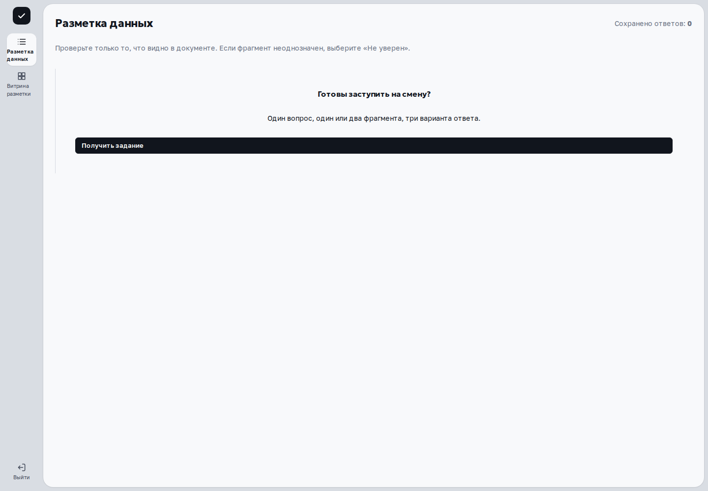
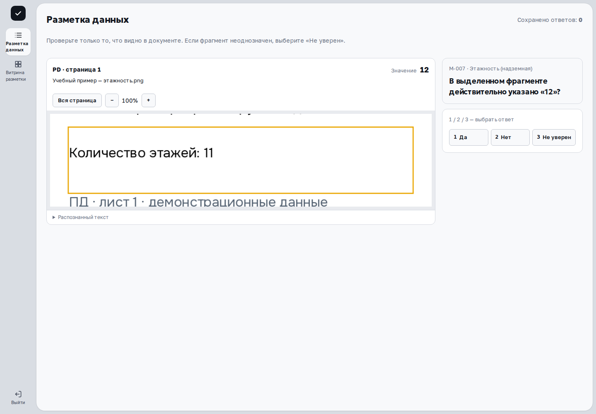
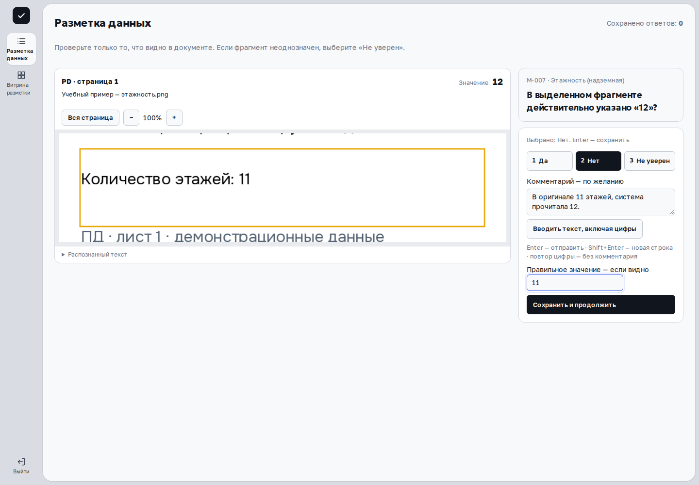

В разметке вы проверяете извлечение информации: соответствует ли показанное поле и значение оригиналу. Решение о нарушении по объекту принимается отдельно, в проверке инспектора.

> Применимость: инструкция сверена с интерфейсом и API установленного выпуска `df65e188`. Сценарий на этой странице проверен на отдельной учебной базе. CPU-демо предназначено для просмотра. Выдача заданий доступна верификатору, инспектору, супервизору, администратору и куратору при наличии соответствующих прав.

## Получите задание

Откройте «Разметка данных» и нажмите **«Получить задание»**. Пока идёт запрос, кнопка показывает «Получаю…». На карточке будут один вопрос и один или два источника; задания могут относиться к разным стадиям и форматам документов.

Если появилось **«Доступных заданий пока нет»**, доступная очередь сейчас пуста. Это не доказывает отсутствие информации в документах. Можно повторить получение позже; при неожиданно пустой очереди сообщите администратору стенд, время и свою роль.

## Проверьте оригинал

Сверьте название параметра, предложенное значение, имя документа и его контекст. Если источников два, изучите оба. Значение из соседней строки или другого объекта не подтверждает показанное поле.

| Источник | Как проверить |
|---|---|
| PDF и изображение | Проверьте страницу и выделенную область. Нажмите «Вся страница» для контекста и «Фрагмент», чтобы вернуться. Кнопки + и − меняют масштаб. |
| XLSX | Проверьте лист по обозначению источника, номера строк, буквенные столбцы и соседние ячейки. Подсвечена строка найденного значения; формулы представлены сохранёнными значениями файла. |
| Word/XML | Прочитайте выделенную строку и соседний текст. Это структурированное представление, которое не воспроизводит печатную вёрстку. |

Для XLSX, Word и XML есть **«Скачать оригинал»**. Для PDF и изображений раскрываемый **«Распознанный текст»** помогает сопоставить извлечение, но не заменяет сам оригинал.

> Сообщение «Показана полоса страницы. Точное положение значения ещё не проверено» означает приблизительное выделение. Проверьте принадлежность значения самостоятельно.

Пока источник открывается или уточняется детализация, ответы «Да» и «Нет» не выбираются: интерфейс сообщает **«Дождитесь источника или выберите „Не уверен“»**. При ошибке источника не подтверждайте значение догадкой.

## Выберите ответ и сохраните

| Клавиша | Ответ | Когда выбрать |
|---|---|---|
| 1 | Да | Значение, единицы и принадлежность совпадают с оригиналом. |
| 2 | Нет | Значение прочитано неверно или относится к другому полю/объекту. |
| 3 | Не уверен | Источник недоступен, неразборчив или не даёт достаточного контекста. |

Выбор кнопкой или цифрой открывает **«Комментарий — по желанию»**. Пояснение полезно для любого ответа: например, «В строке указано 11; 14 относится к соседнему зданию».

При ответе **«Нет»** в задании на прочтение появляется **«Правильное значение — если видно»**. Введите исправление, только если уверенно прочитали его в источнике. В других типах заданий это поле не показывается. Комментарий и исправление ограничены 2000 символами каждое.

Нажмите **«Сохранить и продолжить»** или Enter. Shift+Enter добавляет строку в комментарий. Повтор той же цифры при пустом комментарии отправляет выбранный ответ без пояснения. Чтобы вводить цифры как текст, нажмите **«Вводить текст, включая цифры»**. Во время сохранения кнопка показывает «Сохраняю…» и повторная отправка блокируется.

После успешного сохранения растёт счётчик **«Сохранено ответов»**, затем запрашивается следующее задание. Найти свой ответ и его оригинал можно в [витрине разметки](library.html). Счётчик ответов не является оценкой точности модели.

## Видеоурок

{{video:annotation-walkthrough}}

## Если возникла ошибка

| Что произошло | Что делать |
|---|---|
| Ошибка сохранения, карточка и ввод остались | Прочитайте сообщение и повторите сохранение текущего ответа, если задание ещё действует. |
| «Ответ сохранён. Не удалось получить следующее задание…» | Предыдущий ответ уже сохранён. Нажмите «Получить задание» для продолжения; не отправляйте предыдущий ответ заново. |
| Задание истекло или конфликтует с сохранённым ответом | Кнопки ответа блокируются. При сомнении проверьте витрину, затем нажмите «Получить действующее задание». |
| Источник не загрузился или не читается | Проверьте масштаб и доступный оригинал. Если проверить всё равно нельзя, выберите «Не уверен» и объясните причину. |

Не переносите пароли, токены или посторонние персональные сведения в комментарии. Для сообщения администратору достаточно стенда, времени, параметра, операции и текста ошибки.

## Для куратора: независимый разбор

В блоке **«Управление разметкой»** куратор или администратор может выбрать **«Разобрать»**. В вопросе появится пометка «независимый разбор». Изучите источник и выберите свой ответ. Здесь комментарий обязателен: без основания интерфейс сообщает **«Для независимого разбора укажите основание»**.

Независимый разбор должен выполнять другой куратор, который не давал исходный ответ. Сначала завершите текущее задание; задание, уже взятое другим куратором, недоступно. После успешного сохранения разбора карточка закрывается. Контроль покрытия и выпуск версии описаны в [витрине разметки](library.html).

## Дальше

[Витрина разметки](library.html) · [Модели и GOLD](models.html)
