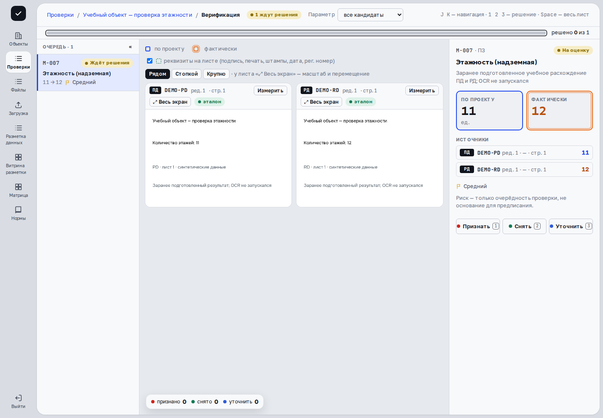

> Применимость: CPU-демо `cfb0ebc6` предназначено для просмотра. В основной платформе проверенные действия сняты на развёрнутых веб-ресурсах с отдельным API `c0851cc7` и синтетическими данными; соответствие исходников опубликованной сборке UI не заявляется. Остальные действия описаны по исходникам и требуют проверки на вашем рабочем стенде и разрешённых прав. В записи инспектора подтверждено чтение двух учебных PDF-оригиналов ПД 11 / РД 12 при заранее подготовленной сводке. Принятие совпадений выборкой, остальные статусы и маршруты доказательств не показаны.

## Откройте параметр

Начните с готовой проверки и вкладки **«Сводка сверки»**. Найдите код и название параметра; сравните колонки **«Ожидается»**, **«Факт»**, **«Δ»**, **«Статус»** и **«Решение»**. Нажмите строку, чтобы открыть карточку и источники.

Сверьте правило, единицы, стадии, объект и редакции документов. При необходимости найдите паспорт параметра в [Матрице](references.html). Числа сравнимы только когда относятся к одному элементу и сопоставимым условиям.

## Прочитайте статус и решение отдельно

| Статус | Значение |
|---|---|
| На оценку | Кандидат, ожидающий решения человека. |
| Расхождения нет | Результат сверки либо подтверждённая отрицательная находка; источник всё равно нужно проверить. |
| Не представлено | Не получено необходимое доказательство; это не нулевое значение. |
| Неприменимо | Параметр не применяется в данном контексте. |
| Несопоставимо | Найденные значения нельзя корректно сравнить. |
| Нужно уточнение | Недостаточно определённости, в том числе по редакции. |
| Признано инспектором | Нарушение подтверждено решением человека. |
| Наблюдение ИИ | Гипотеза системы, требующая оценки. |

У кандидата отдельно показано **«Ждёт решения»**, признание, снятие или уточнение. Открытая карточка результата системы не обязательно является кандидатом: кнопки решений доступны именно для кандидатов в разрешённом состоянии пакета.

## Проверьте доказательства

Откройте ожидаемый и фактический источники. Сверьте имя файла, редакцию, страницу, принадлежность значения и контекст. Не используйте число соседнего здания или характеристику оборудования вместо показателя всего объекта. Если данных недостаточно, результат должен оставаться неопределённым до уточнения.

Результат просмотра — понятная связь между параметром, значением и документом. Готовая сводка и отсутствие расхождения не измеряют общую точность извлечения.

## На рабочем стенде: совпадения выборкой

В готовой проверке или во время верификации нажмите **«Совпадения выборкой»**. Проверьте предложенные совпадения по источникам и отметьте **«Верно»** или **«Ошибка»**. Размер выборки и остаток показаны на экране; не считайте фиксированное число универсальным для любого пакета.

**«Принять остальные»** доступно после предусмотренной проверки без ошибок. После успеха показаны принятый объём и акт приёмки. Если найдена ошибка, партия не принимается; действие **«Записать: партия распалась»** фиксирует этот исход. Проверьте совпадения по одному. Ошибочно выбранный ответ в выборке можно вернуть клавишей Z до фиксации результата.

**«Совпадений для выборки нет»** означает, что соответствующих некритичных отрицательных результатов нет. Выборка не заменяет решения по кандидатам и не доказывает качество всего корпуса.

## Пример в интерфейсе

Сценарий записан на учебных данных с заранее подготовленной сводкой. [Посмотреть видео со всеми шагами](videos.html).

## Дальше

[Решения инспектора](decisions.html) · [Матрица и нормы](references.html)
