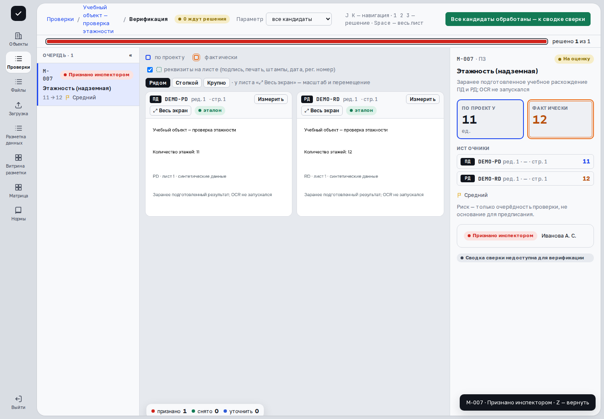
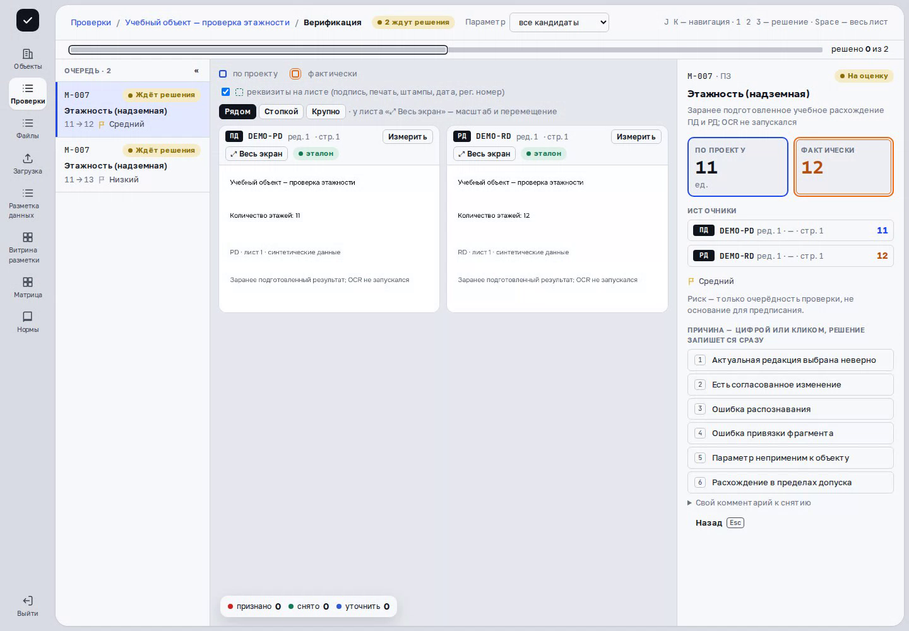
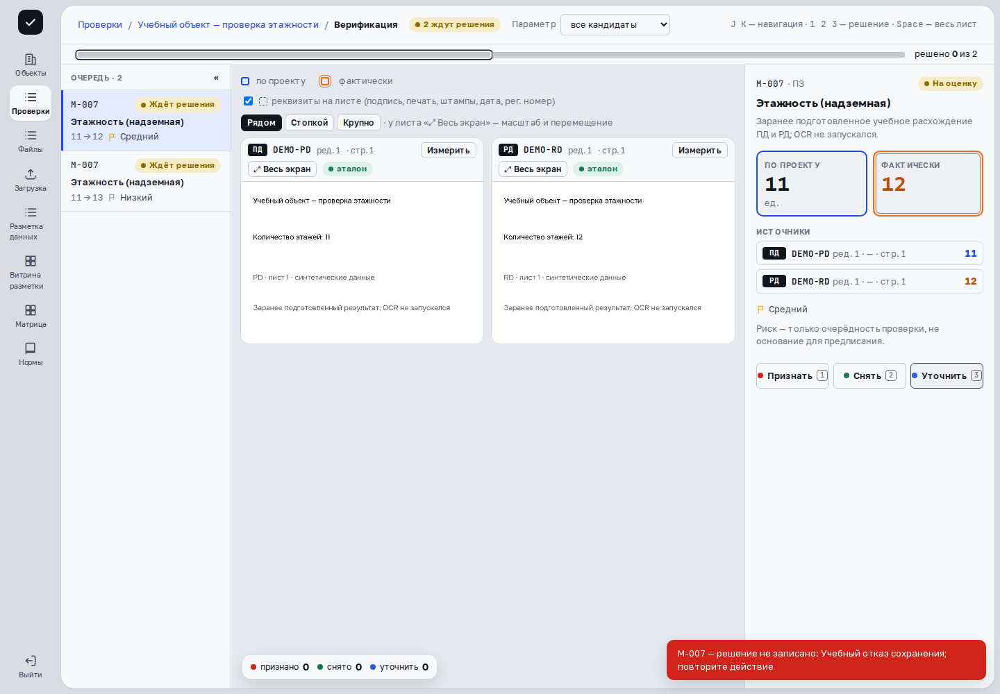

> Применимость: CPU-демо `cfb0ebc6` предназначено для просмотра. В основной платформе проверенные действия сняты на развёрнутых веб-ресурсах с отдельным API `c0851cc7` и синтетическими данными; соответствие исходников опубликованной сборке UI не заявляется. Остальные действия описаны по исходникам и требуют проверки на вашем рабочем стенде и разрешённых прав. В учебной проверке подтверждены «Признать», сохранение решения настоящим API и запись аудита. Дополнительно проверены снятие с причиной, возврат до завершения очереди и уточнение. Проверено восстановление после учебного отказа 503 до записи; разделение ещё не проверено.

## Откройте кандидат

В готовой проверке или во время верификации нажмите **«Верифицировать»**. Прочитайте параметр, правило, ожидаемое и фактическое значения; откройте источники и проверьте объект, редакцию, страницу и контекст.

Режим просмотра называется **«Карточки кандидатов»**. Для администратора показано **«Просмотр: решения выносят инспектор и супервизор»**; после финализации решения неизменяемы. Результаты системы, которые не являются кандидатами, не предлагают обычные кнопки решения.

## Выберите исход

| Действие | Что произойдёт |
|---|---|
| **Признать** / 1 | Запишется подтверждение нарушения. |
| **Снять** / 2 | Откроется выбор причины снятия. |
| **Уточнить** / 3 | Запишется необходимость уточнения. |

Перед признанием убедитесь, что доказательства подтверждают именно данный вывод. При снятии **нажатие стандартной причины сразу сохраняет решение** — отдельного подтверждения нет.

Для своего пояснения раскройте **«Свой комментарий к снятию»**, выберите причину, заполните обязательный комментарий и нажмите **«Снять с комментарием»** или Enter. **«Назад»** / Escape закрывает выбор причины без снятия.

## Проверьте сохранение

При отправке интерфейс может сразу показать следующий кандидат. Дождитесь сообщения о записанном решении. Если запрос завершился ошибкой, исходная карточка возвращается и появляется **«решение не записано»** с пояснением. Переход к следующему экрану сам по себе не подтверждает сохранение.

Сохранённый исход отражается в карточке, счётчиках признанных/снятых/уточняемых результатов и истории проверки. Клавиша **Z** возвращает последнее решение, если сервер и состояние пакета это допускают. После возврата перепроверьте карточку. **Ограничение текущей версии:** после решения по последнему кандидату проверка блокируется; клавиша Z в этом состоянии не возвращает решение. Не рассчитывайте на неё после завершения очереди.

Для движения между карточками используйте **J / стрелку вниз** и **K / стрелку вверх**. Горячие клавиши решения относятся к этому экрану: в [разметке данных](annotation.html) цифры означают другие ответы. Не применяйте клавиши решения при вводе комментария.

## Если причина касается нескольких кандидатов

После снятия интерфейс может предложить связанные кандидаты по тому же документу. Проверьте предложенный список и область действия, снимите лишний выбор и применяйте действие только к просмотренным случаям. Каждое снятие сохраняется отдельно; общее происхождение не доказывает общую ошибку.

**«Разделить на атомарные»** доступно для составного кандидата с несколькими фактическими источниками. Кнопка сразу запускает разделение, без предварительного окна подтверждения. До нажатия изучите источники; после успеха перепроверьте отдельные созданные карточки. При одном фактическом источнике разделять нечего.

## Пример в интерфейсе

Сценарий записан на учебных данных с заранее подготовленной сводкой. [Посмотреть видео со всеми шагами](videos.html).

{{video:inspector-walkthrough}}

## Дальше

[Завершение проверки](finalization.html) · [Сводка сверки](comparison.html)

## Снятие, возврат и уточнение

{{video:decisions-walkthrough}}

После снятия первого кандидата открывается следующий. Z возвращает первый; после уточнения его метка видна в левой очереди. Второй кандидат остаётся без решения. После последнего решения Z недоступна.

## Если решение не записано

1. Прочитайте сообщение «решение не записано» и проверьте, что открыта нужная карточка.
2. Если соединение восстановилось, повторите нужное действие и дождитесь подтверждения.
3. Проверьте метку в очереди и счётчик решений. При повторной ошибке передайте администратору идентификатор проверки и текст сообщения.

Проверка выполнена с намеренным ответом 503 **до записи в API**: запись отсутствовала, последующее снятие и уточнение сохранились. Обрыв ответа после возможного сохранения — другой случай: сначала обновите проверку и выясните текущий исход, не повторяйте решение вслепую.
