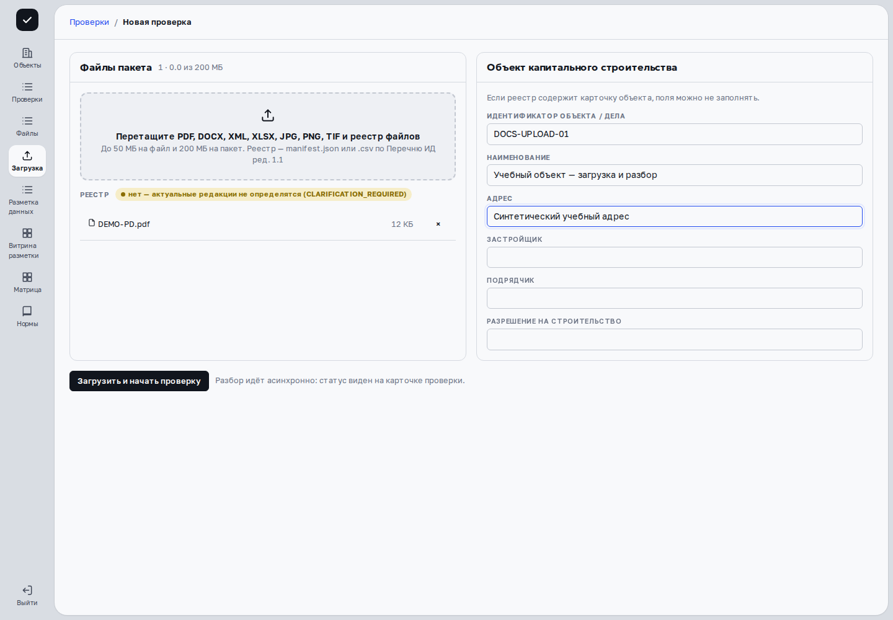
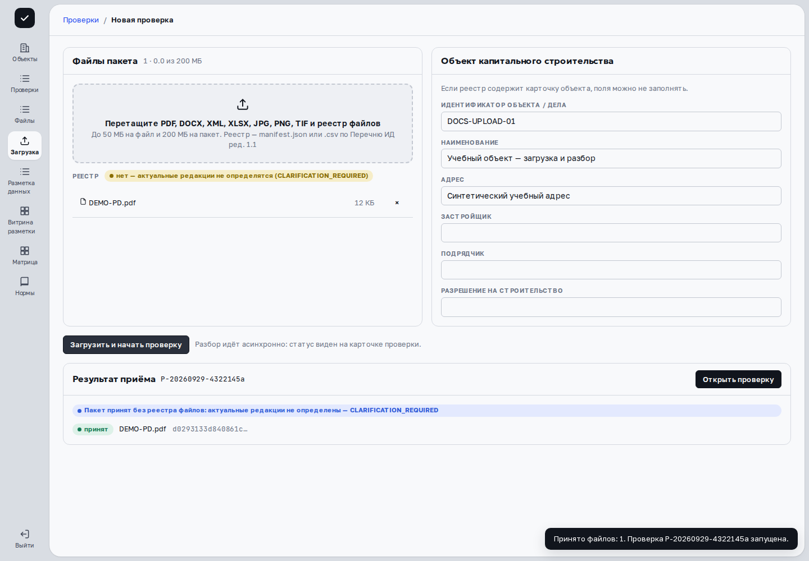
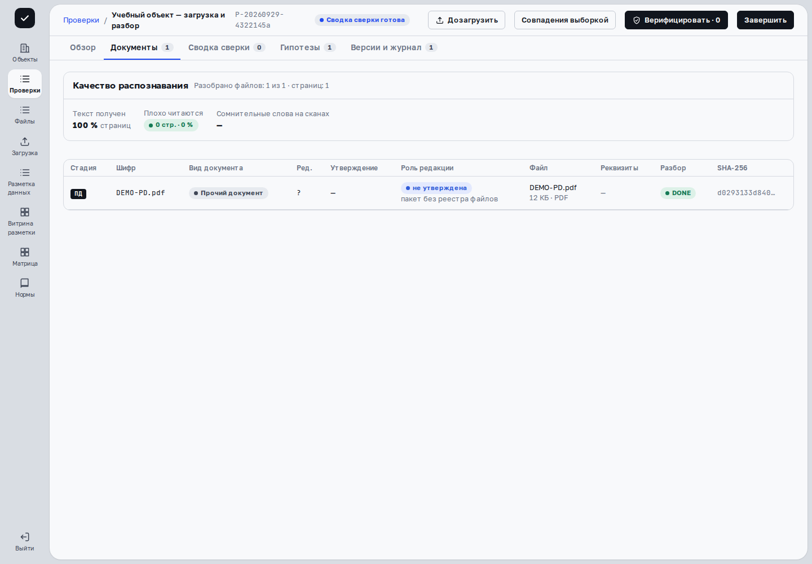
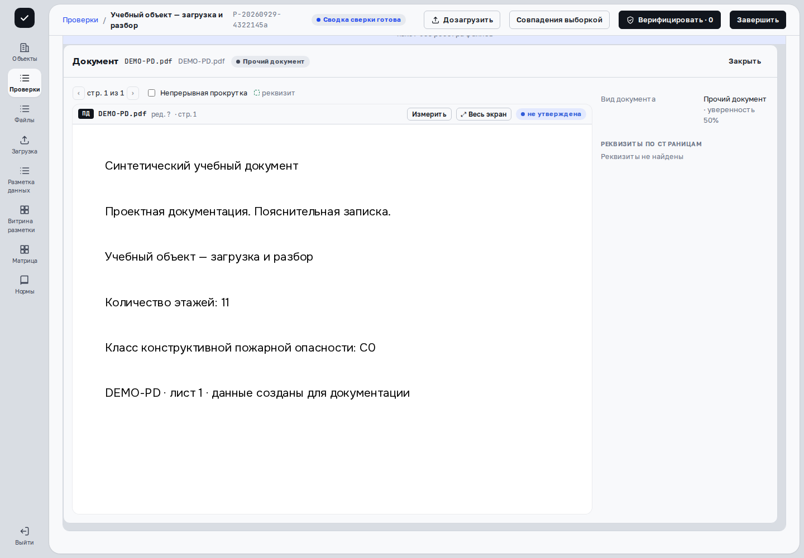
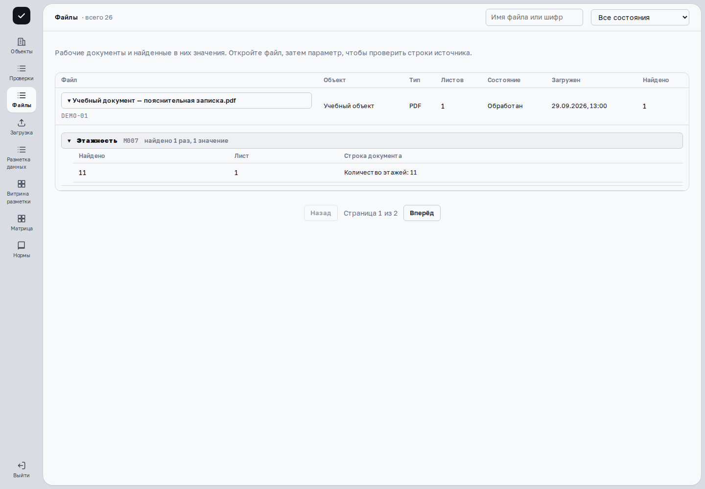
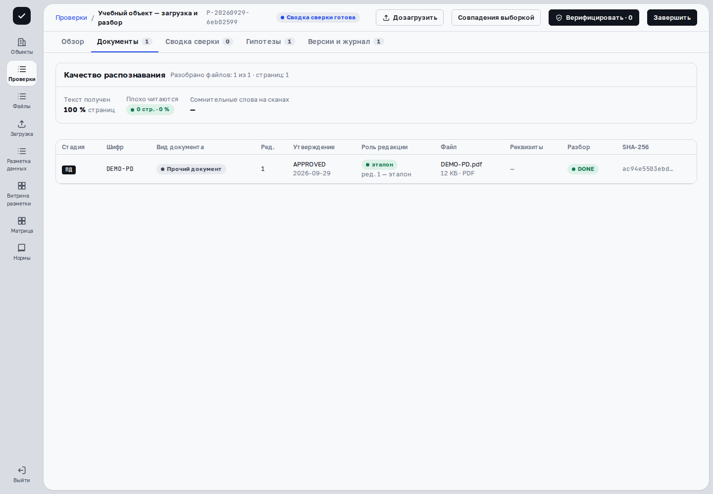
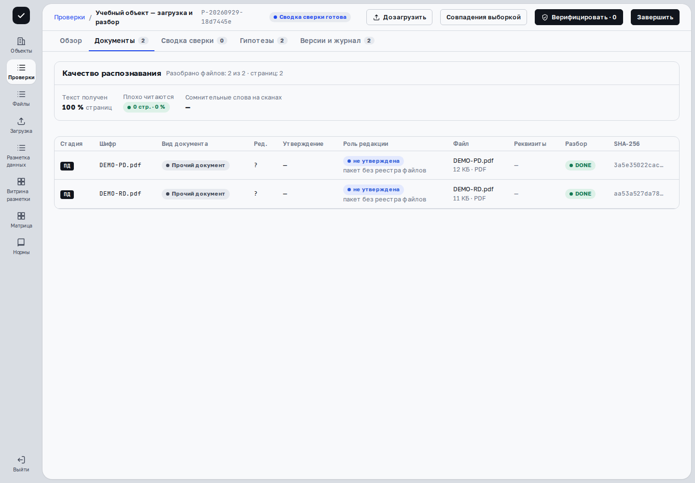

> Применимость: CPU-демо версии `cfb0ebc6` предназначено для просмотра. Для изменяющих операций нужен стенд с разрешённой записью и роль инспектора либо супервизора. Загрузка учебного PDF с текстовым слоем, приём настоящим API `c0851cc7`, CPU-разбор до DONE и просмотр оригинала проверены в отдельной синтетической базе. Соответствие исходников опубликованной сборке UI не заявляется. OCR скана, GPU-обработка, антивирус рабочего контура и отказные ветки не проверены. Дозагрузка второго PDF в тот же пакет проверена отдельно: оба файла DONE, первый сохранён. Реестр «Файлы» показан отдельно на синтетических HTTP-ответах UI `d77fd911`, не как реальный ответ backend.

## Подготовьте файлы и реестр

В форме загрузки перечислены PDF, DOCX, XML, XLSX, JPG, PNG и TIF; указаны ограничения **50 МБ на файл и 200 МБ на пакет**. Перед отправкой проверьте требования вашего стенда. Сохраняйте исходные имена, стадии ПД/РД/ИД и сведения о редакциях.

Реестр передаётся как JSON или CSV по поддерживаемому формату. Автоматически выделяется файл, имя которого начинается с `manifest` или «реестр» и заканчивается на `.json`/`.csv`. Произвольное имя может попасть в список обычных файлов. Без реестра форма предупреждает, что актуальные редакции не определятся и потребуется уточнение.

## Загрузите пакет

{{video:upload-walkthrough}}

В учебном сценарии PDF с текстовым слоем проходит настоящий приём и отдельный CPU-разбор. Статус DONE и два извлечённых значения получены обработкой файла, а не подготовлены заранее. Ролик не демонстрирует OCR скана, GPU-профиль или проверку антивирусом.

1. Откройте **«Новая проверка»** из списка проверок или раздел загрузки на рабочем стенде.
2. Перетащите файлы в **«Файлы пакета»** либо выберите их. Проверьте количество, размер и реестр; лишний файл удалите крестиком.
3. Заполните **«Объект капитального строительства»**: идентификатор объекта/дела, наименование и остальные известные сведения. Если карточка уже есть в реестре, поля можно не заполнять. Ручная карточка отправляется при заполненных идентификаторе и наименовании.
4. Нажмите **«Загрузить и начать проверку»**. Во время отправки кнопка показывает «Загружаем…»; без файлов она недоступна.

**«Результат приёма»** показывает номер проверки, принятые файлы и отклонения с кодом и сообщением. Принятие файла ещё не означает успешный разбор. Нажмите **«Открыть проверку»**.





При ошибке запроса прочитайте сообщение. Перед повторной отправкой проверьте, не появилась ли проверка в списке: не создавайте повторный пакет, если первый уже принят.

## Проверьте обработку и исходник

Откройте **«Документы»**. У каждой строки видны стадия, шифр, редакция, утверждение, роль редакции, имя файла и статус разбора. **DONE** означает завершённый разбор; **FAILED** — ошибку, пояснение показано рядом. Во время разбора обзор показывает число готовых файлов.

Нажмите строку: карточка документа раскрывается непосредственно под ней. Сверьте оригинал и реквизиты с тем источником, на который ссылается результат. Плохо читаемый лист или отсутствие извлечения не доказывают отсутствия значения в документе.





## Найдите файл в общем реестре

Раздел **«Файлы»** в левом меню показывает документы из доступных проверок. Это рабочий реестр; инструкции и технические отчёты находятся отдельно в [каталоге материалов](materials.html).

1. Введите имя или шифр в строку **«Имя файла или шифр»**. При необходимости выберите состояние обработки.
2. Проверьте объект, тип, число листов и дату загрузки. Для перехода между страницами используйте **«Назад»** и **«Вперёд»**; поиск сохраняется при переходе.
3. Нажмите название файла. Под ним появятся группы найденных параметров. С клавиатуры выберите кнопку клавишей Tab и нажмите Enter или пробел.
4. Раскройте нужный параметр: таблица покажет найденное значение, лист и строку документа. Большая группа загружается частями через **«Показать ещё»**.



Число **«Найдено»** относится к упоминаниям, а не к подтверждённым нарушениям. Служебные факты раскрываются отдельно и не входят в Матрицу. Сверяйте найденное значение с оригиналом через документы соответствующей проверки.

Если обновление списка завершилось ошибкой, прочитайте сообщение и нажмите **«Повторить»**. При ошибке раскрытия параметра повтор находится рядом с сообщением. Пустой результат поиска и отсутствие извлечённых параметров не доказывают отсутствия информации в оригинале.

## Реестр: стадия и редакция

Добавьте вместе с PDF файл **manifest.json**. В форме рядом с «Реестр» должно появиться его имя. Карточку объекта заполните отдельно, как при обычной загрузке.

Учебный пример для одного файла:

```json
{
  "files": [{
    "file_id": "DEMO-PD-1",
    "file_name": "DEMO-PD.pdf",
    "doc_stage": "PD",
    "discipline": "ПЗ",
    "document_code": "DEMO-PD",
    "revision": "1",
    "approval_status": "APPROVED",
    "approval_date": "2026-09-29"
  }]
}
```

Замените учебные значения реквизитами своего документа. Имя файла должно совпадать с загружаемым. Стадии: PD — проектная, RD — рабочая, ID — исполнительная документация. Статус APPROVED указывайте только по имеющемуся основанию утверждения: запись в реестре сама по себе не подтверждает подлинность подписи.

После приёма откройте **«Документы»** и сверяйте столбцы «Стадия», «Шифр», «Ред.», «Утверждение», «Роль редакции» с реестром. В проверенном примере сервер сохранил ПД, редакцию 1, APPROVED и CURRENT; интерфейс показал «эталон».



Этот пример подтверждает один корректный реестр, а не разрешение конфликтов нескольких редакций. Если роль редакции не определена, сначала выясните причину; завершение разбора DONE этого не исправляет.

## Добавьте документы в существующую проверку

На рабочем стенде откройте нужный пакет и нажмите **«Дозагрузить»**, затем **«Дозагрузить и пересчитать»**. Форма указывает номер существующей проверки; новая карточка объекта здесь не заполняется. Проверьте результат приёма и пересчитанную сводку.

Дозагрузка не предлагается во время разбора и после финализации. Для изменения зафиксированного пакета нужен разрешённый процесс [отмены финализации](finalization.html), затем новый разбор и проверка результата.

{{video:supplement-walkthrough}}



**Проверьте метаданные отдельно.** В этом примере реестр не передан. Имя DEMO-RD.pdf не назначило стадию РД: интерфейс показывает ПД и неподтверждённую редакцию. DONE означает завершение разбора, а не корректность стадии, редакции или сопоставления. Для рабочего пакета передавайте корректный реестр и сверяйте его поля после приёма.

## Дальше

[Сводка сверки](comparison.html) · [Решения инспектора](decisions.html)
