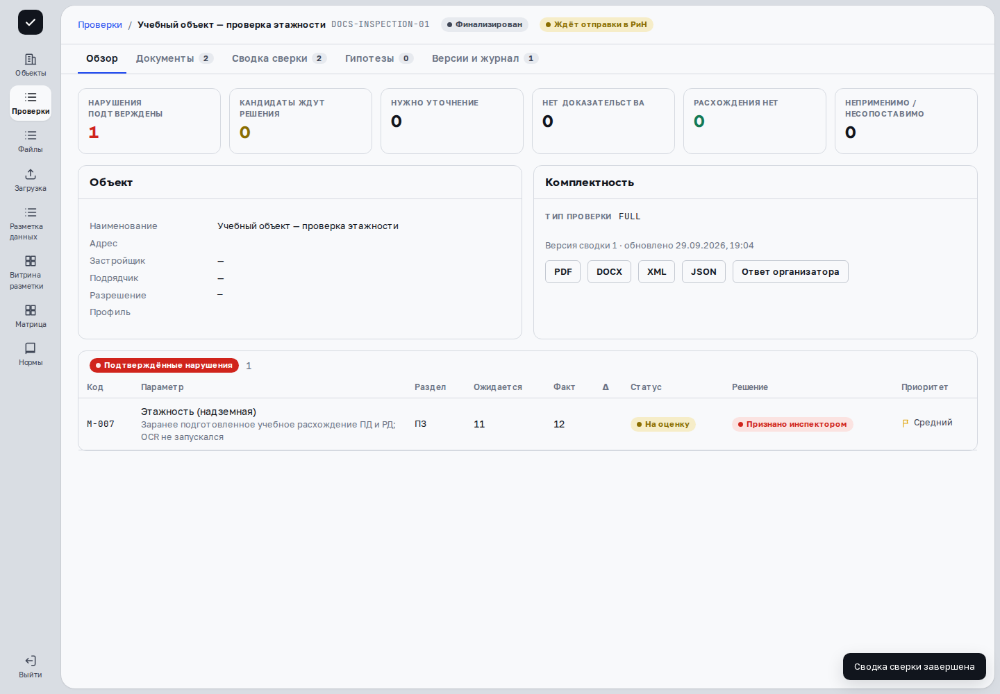

> Применимость: CPU-демо `cfb0ebc6` предназначено для просмотра. В основной платформе проверенные действия сняты на развёрнутых веб-ресурсах с отдельным API `c0851cc7` и синтетическими данными; соответствие исходников опубликованной сборке UI не заявляется. Остальные действия описаны по исходникам и требуют проверки на вашем рабочем стенде и разрешённых прав. В учебной проверке подтверждены реальное 10-секундное окно, фиксация протокола и отдельный статус `PENDING_SYNC`. Критические нерешённые параметры, отмена финализации, электронная подпись и успешная внешняя передача в РиН не демонстрировались.

## Проверьте готовность пакета

Начните с результатов решений и вкладки **«Сводка сверки»**. Оставшиеся кандидаты, уточнения и ошибки источников должны быть понятны. Кнопка **«Завершить»** предлагается после завершения верификации либо в готовом/верифицируемом пакете без кандидатов, ожидающих решения. Число разобранных файлов не заменяет эту проверку.

## Просмотрите критические параметры

Нажмите **«Завершить»**. Если сервер обнаружил критические параметры без ответа, откроется их перечень. Проверьте код, название и статус: отсутствие документа, несопоставимость и неясная редакция не становятся подтверждённым соответствием.

Выберите **«Вернуться к сверке»**, если требуется работа с результатом. Если перечень действительно изучен, отметьте **«Перечень просмотрен»**, затем **«Продолжить завершение»**. Отметка подтверждает просмотр перечня, а не отсутствие нарушения.

## Дождитесь фиксации и проверьте версию

После продолжения открывается **окно отмены на 10 секунд**. Пока оно действует, можно отменить завершение; сводка останется черновиком. После окончания окна отправляется запрос финализации. При ошибке прочитайте сообщение и проверьте реальный статус пакета перед повторной попыткой.

Успешное завершение фиксирует протокол и переводит пакет в **«Финализирован»**. Обычный инспектор больше не изменяет решения и не дозагружает файлы. Во вкладке **«Версии и журнал»** проверьте зафиксированную версию и событие в истории. Доступные выгрузки протокола относятся к существующей версии; до её выпуска соответствующие кнопки недоступны.

## Проверьте передачу в РиН отдельно

| Статус | Что проверять |
|---|---|
| Ждёт отправки в РиН | Протокол зафиксирован, передача ещё не подтверждена. |
| Передано в РиН | Система зарегистрировала успешную передачу; учитывайте профиль интеграции стенда. |
| РиН недоступна | Передача завершилась ошибкой; откройте историю попыток и сообщение. |

**«Версии и журнал»** содержит блок **«Передача в ИАИС „РиН“»** с версией и попытками. Повторная отправка зависит от прав и доступности интеграции. На демонстрационном профиле результат может быть имитацией: перед признанием внешнего приёма уточните профиль стенда у администратора. Финализация и передача — два отдельных результата.

## Исправьте ошибку после финализации

На рабочем стенде супервизор или администратор может нажать **«Отменить финализацию»**. Введите обязательную причину отмены: кнопка **«Отменить»** становится доступна при основании не короче пяти символов. После успеха появится сообщение **«Финализация отменена, запись в журнале аудита»**; проверьте статус и историю.

При отказе сервера пакет не считайте открытым для изменения. После успешной отмены исправьте документы или решения, снова проверьте сводку и выпустите новую версию. История предыдущей фиксации сохраняется.

## Пример в интерфейсе

Сценарий записан на учебных данных с заранее подготовленной сводкой. Финализация не подтверждает отправку в РиН или электронную подпись. [Посмотреть видео со всеми шагами](videos.html).

{{video:inspector-walkthrough}}

## Дальше

[Журнал и метрики](operations.html) · [Загрузка и документы](documents.html)
