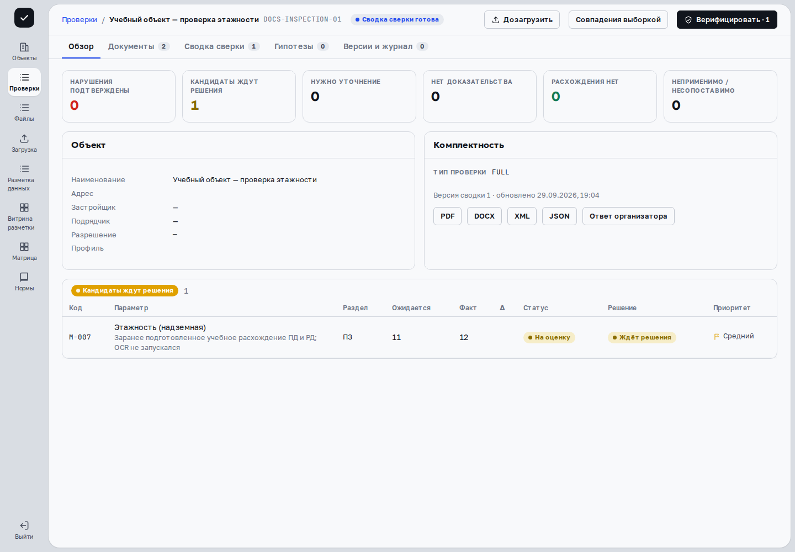

> Применимость: CPU-демо `cfb0ebc6` предназначено для просмотра. В основной платформе проверенные действия сняты на развёрнутых веб-ресурсах с отдельным API `c0851cc7` и синтетическими данными; соответствие исходников опубликованной сборке UI не заявляется. Остальные действия описаны по исходникам и требуют проверки на вашем рабочем стенде и разрешённых прав. Проверены вход, ввод номера в поиск, открытие строки учебной проверки и переход к источникам и решениям. Фильтры по датам/разделам, все статусы и меню «Объекты» этим прогоном не проверены.

Проверка — отдельный пакет документов и результаты его обработки. Несколько проверок одного объекта могут содержать разные редакции и решения.

## Найдите проверку

Откройте **«Проверки»**. В поле **«Объект, адрес или номер проверки»** введите известные сведения. При необходимости выберите статус, раздел и даты «С даты» / «По дату». Строки сгруппированы по результату: «Есть нарушения», «Требует внимания», «Без замечаний», «Нет результатов».

Нажмите строку, чтобы открыть пакет. На рабочем стенде кнопка **«Новая проверка»** открывает загрузку. Раздел **«Объекты»** описан в более новых рабочих исходниках и не входит в подтверждённую навигацию CPU `cfb0ebc6`; используйте его только если он действительно опубликован на вашем стенде.

## Определите этап

| Статус | Следующий шаг |
|---|---|
| Загружено | Дождаться начала обработки; проверить состав пакета. |
| Разбор | Следить за количеством разобранных файлов и ошибками во вкладке «Документы». |
| Сводка сверки готова | Открыть результат и проверить источники. |
| Верификация | Продолжить решения по кандидатам. |
| Верификация завершена | Проверить итог перед финализацией. |
| Финализирован | Просмотреть зафиксированный протокол и отдельный статус передачи. |

Цвет группы и готовность сводки не подтверждают правильность всех значений. Различайте решение инспектора и автоматический результат.

## Откройте нужную вкладку

**«Обзор»** показывает объект, комплектность и итоги; **«Документы»** — файлы и разбор; **«Сводка сверки»** — параметры и результаты; **«Гипотезы»** — наблюдения системы; **«Версии и журнал»** — версии и историю действий. «Отклонения и споры» видны при соответствующей роли.

Когда пакет готов или находится в верификации, **«Верифицировать»** открывает карточки. Для роли просмотра кнопка называется **«Карточки кандидатов»**. Администратор может просматривать проверки, но обычные решения, загрузка и завершение относятся к инспектору и супервизору.

## Если нужного пакета нет

Сообщение **«Проверок по фильтру нет»** относится к текущему отбору: очистите поиск и ограничения даты/статуса. Если обработка остановилась, откройте документы и сохраните номер проверки, имя файла и текст ошибки. Не создавайте дубликат пакета ради обновления статуса.

## Пример в интерфейсе

Сценарий записан на учебных данных с заранее подготовленной сводкой. [Посмотреть видео со всеми шагами](videos.html).

## Дальше

[Загрузка и документы](documents.html) · [Сводка сверки](comparison.html)
