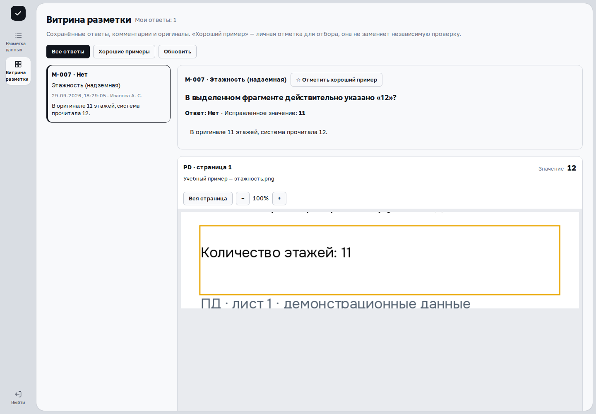
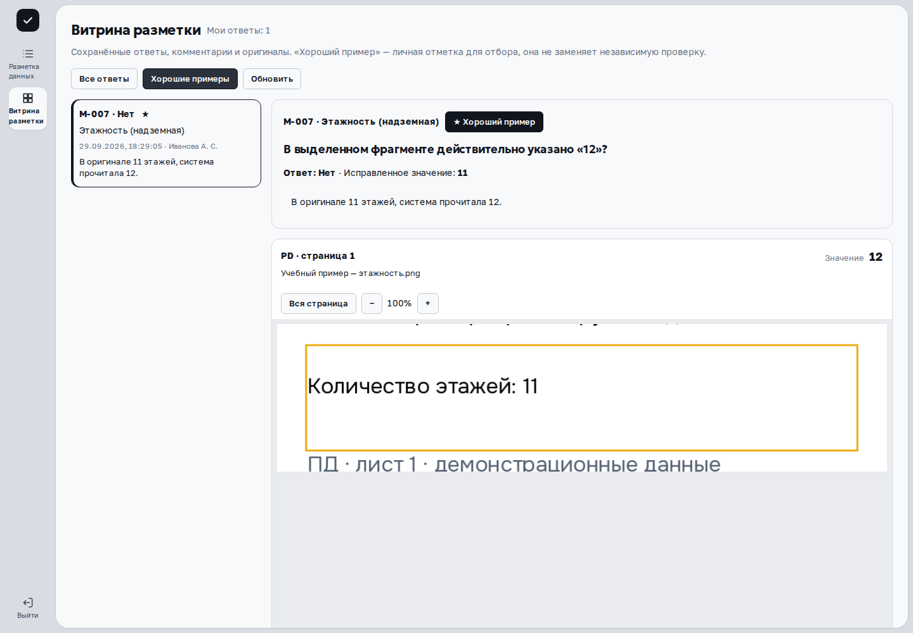
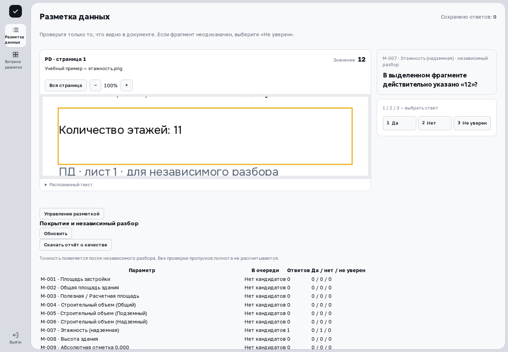
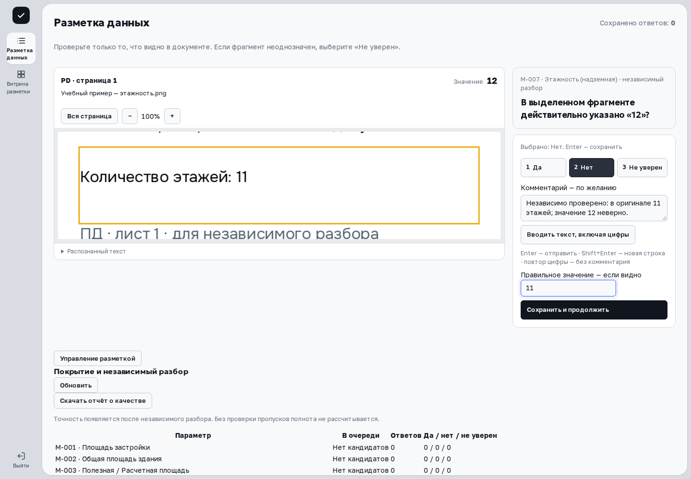
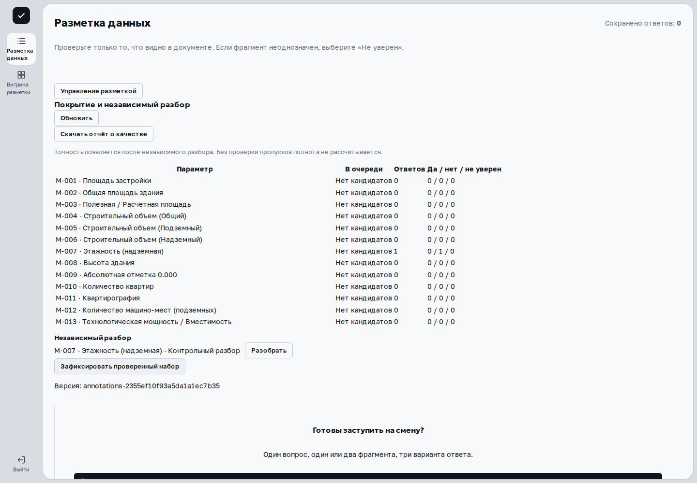

Витрина показывает сохранённые ответы вместе с комментариями и источниками. Она помогает проверить свою работу и вернуться к полезному примеру.

> Применимость: названия сверены с исходниками установленного выпуска `df65e188`. Просмотр ответа, комментария, исправления и личная отметка проверены с настоящим API на отдельной учебной базе. CPU-демо предназначено для просмотра. Раздел доступен верификатору, инспектору, супервизору, администратору и куратору при наличии соответствующих прав.

## Найдите сохранённый ответ

Откройте **«Витрина разметки»**. Обычный пользователь видит **«Мои ответы»**; куратор и администратор — **«Ответы операторов»**. Число справа показывает количество ответов в текущем отборе.

1. Нажмите **«Все ответы»**, чтобы открыть доступные вам записи, или **«Хорошие примеры»**, чтобы показать личные отметки.
2. Выберите запись в списке слева. В ней указаны параметр, ответ, название, дата, автор и начало комментария.
3. Справа проверьте вопрос, **«Ответ»**, комментарий и оригинал. Если при ответе «Нет» было сохранено исправление, здесь появится **«Исправленное значение»**.
4. Используйте **«Показать ещё»** внизу списка для следующей порции записей. **«Обновить»** заново загружает текущий отбор; после обновления может открыться первая запись.

Ответы «Да», «Нет» и «Не уверен» имеют разный смысл. Неопределённость не следует автоматически считать ошибкой извлечения. В текущем интерфейсе нет отдельного поиска по тексту или фильтра по типу ответа: используйте существующий список и два переключателя отбора.

Источники открываются рядом с ответом. Для PDF и изображений доступны **«Вся страница»**, **«Фрагмент»**, масштаб и распознанный текст; для XLSX, Word/XML — структурированное представление, масштаб и **«Скачать оригинал»**. Как читать источники, объясняет [разметка данных](annotation.html).

## Отметьте хороший пример

Нажмите **«☆ Отметить хороший пример»** в открытой записи. После сохранения кнопка станет **«★ Хороший пример»**. Повторное нажатие снимает отметку. В отборе «Хорошие примеры» снятая запись исчезает после обновления списка.

Это личная закладка: отметки других пользователей не попадают в ваш отбор. Она помогает вернуться к материалу для обсуждения и не заменяет независимый разбор или выпуск эталонного набора.

## Видеоурок

{{video:annotation-walkthrough}}

## Если список или источник не открылся

| Сообщение или состояние | Следующий шаг |
|---|---|
| «Открываю сохранённые ответы…» | Дождитесь загрузки. |
| «Сохранённых ответов пока нет» | Проверьте, что ответ действительно сохранён, и нажмите «Обновить». |
| «Отмеченных примеров пока нет» | Переключитесь на «Все ответы» и добавьте личную отметку. |
| Ошибка списка, следующей порции или отметки | Прочитайте сообщение. Обновите список или повторите действие после восстановления связи. При ошибке отметки проверьте её состояние после обновления. |
| Ошибка источника | Сохранённый ответ остаётся записью витрины, но источник сейчас не удалось показать. Сообщите администратору параметр, время и текст ошибки. |

Нецензурные слова в отображаемом комментарии маскируются; появляется пояснение **«Нецензурные слова скрыты»**. Маскировка не переписывает исходный ответ. В витрине нет формы редактирования сохранённого ответа: спорный пример передают на независимый разбор.

## Для куратора: покрытие и независимый разбор

Управление находится в **«Разметка данных»**, а не внутри витрины. Нажмите **«Управление разметкой»**; блок доступен куратору и администратору.

Таблица **«Покрытие и независимый разбор»** показывает параметр, количество заданий **«В очереди»**, число **«Ответов»** и распределение **«Да / нет / не уверен»**. **«Нет кандидатов»** означает отсутствие готовых заданий в этой очереди, а не проверенное отсутствие информации в документах. Кнопка **«Обновить»** запрашивает состояние заново.

В **«Независимый разбор»** выводятся примеры с сомнением, расходящимися ответами или для контрольного разбора. Нажмите **«Разобрать»**, проверьте источник и сохраните ответ с обязательным основанием. Во время активного задания кнопка разбора заблокирована. Нельзя разбирать свой исходный ответ или задание, занятое другим куратором. Подробности — в [разметке данных](annotation.html).

Если список пуст, появляется **«Примеров для независимого разбора пока нет»**. Это состояние списка, а не оценка точности всей системы.

## Выпустите проверенный набор и скачайте отчёт

**«Зафиксировать проверенный набор»** выпускает версию из примеров, прошедших независимый разбор. После успеха появляется **«Версия: …»** — сохраните идентификатор. Если разобранных примеров нет, выпуск завершится сообщением **«Нет разобранных куратором примеров для выпуска»**. Выпуск более 10 000 примеров требует отдельного процесса с явно заданным объёмом.

{{video:curator-walkthrough}}

Этот набор содержит проверенные человеком задания; он не объявляет автоматически обученную модель или GOLD основной платформы. Перед использованием для обучения нужны контроль качества и разделение независимой оценки. Различия описаны в [моделях и GOLD](models.html).

Нажмите **«Скачать отчёт о качестве»**: скачивается файл `annotation-quality.json`. Пока он готовится, кнопка показывает **«Готовлю отчёт…»**. Отчёт относится к проверенной выборке. Точность появляется после независимого разбора; без проверки пропусков полнота не рассчитывается. Согласованность операторов и число ответов не означают точность на всём корпусе.

## Для администратора: создайте верификатора

В том же блоке администратору доступна форма **«Новый верификатор»**. Укажите логин, имя и пароль длиной не менее 12 символов, затем нажмите **«Создать»**. При успехе появляется **«Верификатор создан»**, поля очищаются. При ошибке прочитайте сообщение и проверьте введённые данные.

Создание учётной записи выполняется на рабочем стенде. Передавайте реквизиты отдельно от комментариев разметки; снимки руководства показывают только пустую форму или разрешённые демонстрационные данные.

## Дальше

[Разметка данных](annotation.html) · [Модели и GOLD](models.html) · [Роли и доступ](roles.html)
