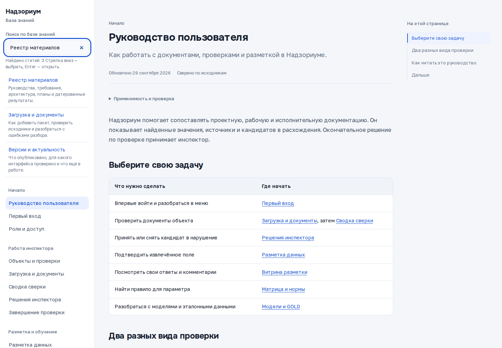
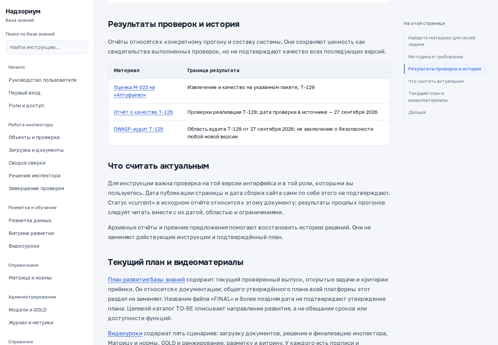

## Найдите материал для своей задачи

{{video:materials-walkthrough}}

Введите «Реестр материалов» в поиск слева и откройте найденную статью. В таблице выберите материал по задаче, затем проверьте его назначение, дату и область применимости. Раздел «Текущий план и видеоматериалы» содержит ссылку на план работ.

Начните с руководства, если хотите выполнить действие в приложении. Схемы и технические материалы помогают понять устройство системы; отчёты показывают результаты конкретных проверок.

| Что нужно | Где искать |
|---|---|
| Освоить работу с проверками и документами | [Руководство пользователя](../guide/index.html) |
| Понять путь пакета после загрузки | [Пайплайн](../gera/PIPELINE.html) |
| Посмотреть состав системы | [Архитектура](../gera/ARCHITECTURE.html) и [схемы C4](../approach/c4.html) |
| Найти требование, его реализацию и тесты | [Trace Map](../gera/TRACE-MAP.html) |
| Разобраться в моделях и распознавании | [ML-концепция](../approach/ml-concept.html) |
| Изучить принятые решения по хранению файлов | [ADR-0006](../approach/adr-0006.html) |
| Проверить правила оформления интерфейса | [Дизайн-система](../design/design-system.html) |
| Посмотреть пример аналитики портфеля | [BI-дашборд](../bi/dashboard.html) — макет с вымышленными данными |

## Методика и требования

Материалы ГЕРА раскрывают связь исходных фактов, бизнес-процесса, требований и данных. Наличие материала в каталоге не означает, что описанная возможность уже доступна на вашем стенде.

| Материал | Для чего читать |
|---|---|
| [Записка прогона](../method/00-run-notes.html) | Решения и вопросы, возникшие при моделировании |
| [Обследование](../method/01-survey.html) | Источники и факты процесса |
| [Бизнес-уровень](../method/02-business.html) | Процессы и операции |
| [Сервисы и правила](../method/03-services.html) | Функциональные требования системы |
| [Информационная модель](../method/04-data.html) | Состав и связи данных |
| [Состояния обработки пакета](../method/05-state-machine.html) | Состояния, переходы и обработка исключений |
| [Обследование М-023](../method/survey-m023.html) | Как параметр встречается в документах пакета |
| [Целевой каталог TO-BE](../approach/to-be.html) | Полный предполагаемый набор операций; это целевая модель, а не действующий план работ |

## Результаты проверок и история

Отчёты относятся к конкретному прогону и составу системы. Они сохраняют ценность как свидетельства выполненных проверок, но не подтверждают качество всех последующих версий.

| Материал | Граница результата |
|---|---|
| [Оценка М-023 на «Алтуфьево»](../results/m023-altufyevo.html) | Извлечение и качество на указанном пакете, T-129 |
| [Отчёт о качестве T-129](../results/qa-t129.html) | Проверки реализации T-129; дата проверки в источнике — 27 сентября 2026 |
| [OWASP-аудит T-129](../results/owasp-t129.html) | Область аудита T-129 от 27 сентября 2026; не заключение о безопасности любой новой версии |

## Что считать актуальным

Для инструкции важна проверка на той версии интерфейса и в той роли, которыми вы пользуетесь. Дата публикации страницы и дата сборки сайта сами по себе этого не подтверждают. Статус «current» в исходном отчёте относится к этому документу; результаты прошлых прогонов следует читать вместе с их датой, областью и ограничениями.

Архивные отчёты и прежние предложения помогают восстановить историю решений. Они не заменяют действующие инструкции и подтверждённый план.

## Текущий план и видеоматериалы

[План развития базы знаний](../plans/knowledge-base.html) содержит текущий проверенный выпуск, открытые задачи и критерии приёмки. Он относится к документации; общего утверждённого плана всей платформы этот раздел не заменяет. Название файла «FINAL» и более поздняя дата не подтверждают утверждение плана. Целевой каталог TO-BE описывает направление развития, а не обещание сроков или доступности функций.

[Видеоуроки](videos.html) содержат сценарии основных действий: загрузку документов, решение и финализацию инспектора, Матрицу и нормы, GOLD и ранжирование, разметку и витрину. У каждого есть подписи и текстовые шаги. Ограничения и история проверенных выпусков — в [версиях и актуальности](release.html).

## Дальше

[Все материалы стенда](../index.html) · [Руководство пользователя](../guide/index.html)
