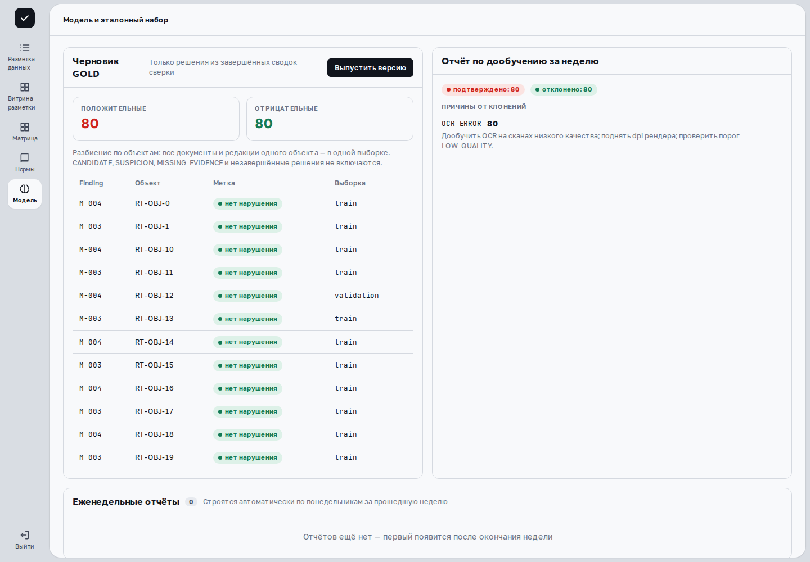
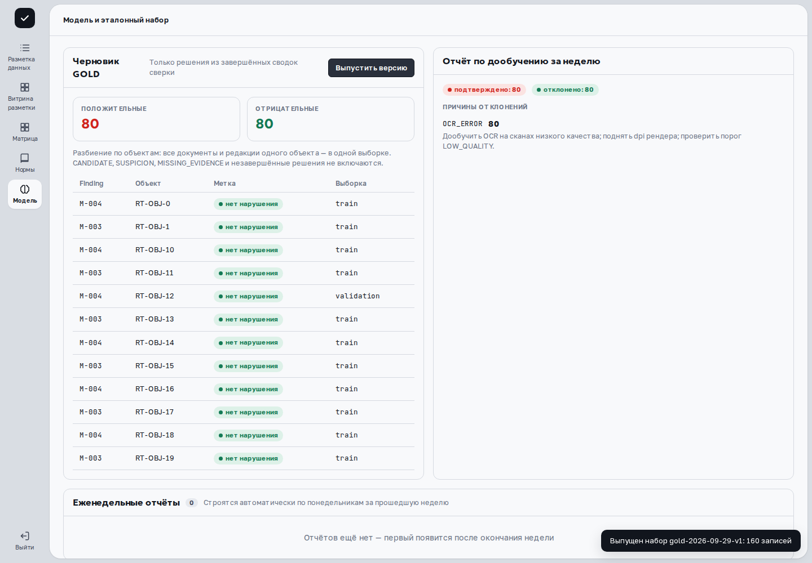
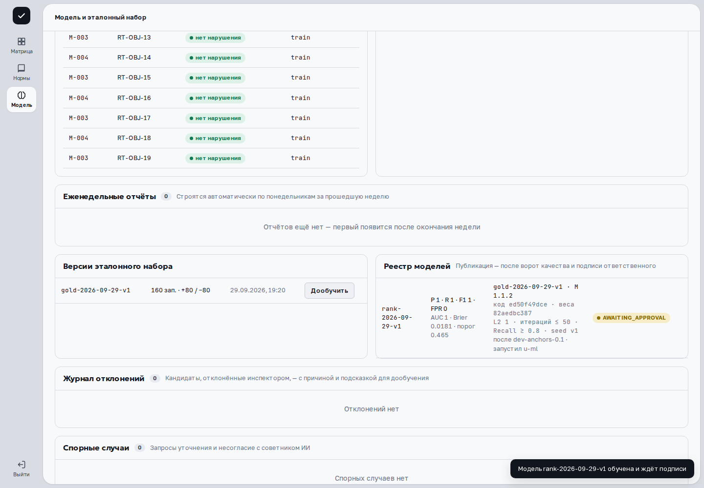
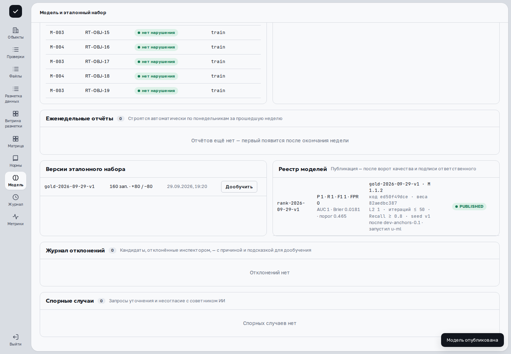

> Применимость: CPU-демо `cfb0ebc6` предназначено для просмотра. В основной платформе проверенные действия сняты на развёрнутых веб-ресурсах с отдельным API `c0851cc7` и синтетическими данными; соответствие исходников опубликованной сборке UI не заявляется. Остальные действия описаны по исходникам и требуют проверки на вашем рабочем стенде и разрешённых прав. На отдельном синтетическом наборе подтверждены выпуск GOLD, CPU-обучение модели ранжирования, прохождение ворот, одобрение публикации и запись аудита. Это не обучение GPU/LLM и не оценка качества рабочего корпуса; другие наборы и отказные ветки не проверены.

## Различайте четыре операции

| Операция | Проверяемый результат |
|---|---|
| Инференс | Готовая модель обработала документ; её веса от этого не изменились. |
| Разметка | Сохранён ответ оператора по конкретному источнику. |
| Независимый разбор | Другой куратор сохранил собственный ответ с основанием. |
| Обучение и оценка | Обучаемый компонент получил новую версию; качество измерено на выделенной выборке. |

Работающая GPU-модель и количество запросов не подтверждают дообучение. Ответы «Да» в разметке подтверждают чтение, а не отсутствие нарушения.

## Выпустите GOLD основной платформы

Откройте **«Модель»** под куратором или администратором. В **«Черновик GOLD»** показаны положительные/отрицательные метки и разбиение по объектам. Здесь собираются решения из финализированных сводок; кандидаты, гипотезы, отсутствие доказательств и незавершённые решения не включаются.

Проверьте состав, затем нажмите **«Выпустить версию»**. При пустом составе кнопка недоступна. После успеха сообщение называет версию и число записей; найдите их в **«Версии эталонного набора»**. Все документы и редакции одного объекта должны оставаться в одной выборке.

В отдельном модуле разметки **«Зафиксировать проверенный набор»** выпускает задания после независимого разбора. Это иной набор и иной процесс; он не переносит ответы автоматически в GOLD основной платформы. Его маршрут описан в [витрине](library.html).

## Запустите поддерживаемое обучение

ML-инженер или администратор выбирает выпущенный набор и нажимает **«Дообучить»**. Кнопка меняется на «Обучение…». Текущая реализация обучает **модель ранжирования**; это не дообучение OCR/VLM или LoRA.

При успехе появляется версия модели и результат ворот качества: «обучена и ждёт подписи» либо «не прошла ворота» с причинами. Ошибка **«Версия набора … не найдена»** требует проверить версию; сообщение о расхождении состава означает, что данные не соответствуют выпущенному набору. **«Дообучение невозможно»** содержит причины ограничений данных или скрытой оценки. Не повторяйте запуск, не разобрав причину.

## Проверьте оценку и публикацию

В **«Реестр моделей»** проверьте версию набора, Матрицу, хеши кода/весов, параметры обучения, предыдущую модель и автора запуска. Метрики P, R, F1, FPR, а при наличии AUC/Brier относятся к конкретной оценке этой модели.

**AWAITING_APPROVAL** означает ожидание подписи; **REJECTED_BY_GATE** — отказ ворот; **PUBLISHED** — опубликованную версию. Кнопка **«Подписать публикацию»** появляется для ожидающей модели при соответствующей роли. После успеха проверьте сообщение «Модель опубликована» и статус реестра. Кнопку отката текущий экран не предлагает: не рассчитывайте на неё без отдельного подтверждённого процесса администратора.

Пустой реестр может показывать профиль dev «якоря + regex» и отсутствие кандидатов. Это не подтверждает работу обученной модели на вашем стенде.

## Что показывают отчёты

**«Отчёт по дообучению за неделю»** и **«Еженедельные отчёты»** показывают решения, причины отклонений и рекомендации. Они не доказывают состоявшееся обучение. У недельного отчёта проверьте период и дату построения; пустой список не означает нулевую ошибку извлечения.

Отчёт разметки отдельно оценивает проверенную выборку. Согласованность операторов не равна точности; полнота требует проверки пропусков. Независимая оценка должна быть отделена от данных настройки, включая общие документы и объекты.

## Учебный сценарий: от GOLD до публикации

{{video:models-walkthrough}}

В записи используются 160 заранее подготовленных экспертных меток по 80 синтетическим объектам. Куратор выпускает GOLD, ML-инженер запускает **«Дообучить»**, администратор подтверждает публикацию. Все переходы выполнены настоящим API в отдельной базе.

Показанные Precision/Recall/F1 относятся только к 20 тестовым примерам синтетического набора. Они не измеряют точность всего корпуса, OCR или языковой модели. Кнопка в этом сценарии обучает CPU-модель ранжирования. Отказ проверки качества не снят в этом ролике и остаётся отдельным сценарием.

После публикации проверьте событие и автора в [журнале](operations.html). Действие «Подписать публикацию» в этом сценарии подтверждает версию модели; оно не демонстрирует УКЭП документа.

## Дальше

[Витрина разметки](library.html) · [Журнал и метрики](operations.html)
