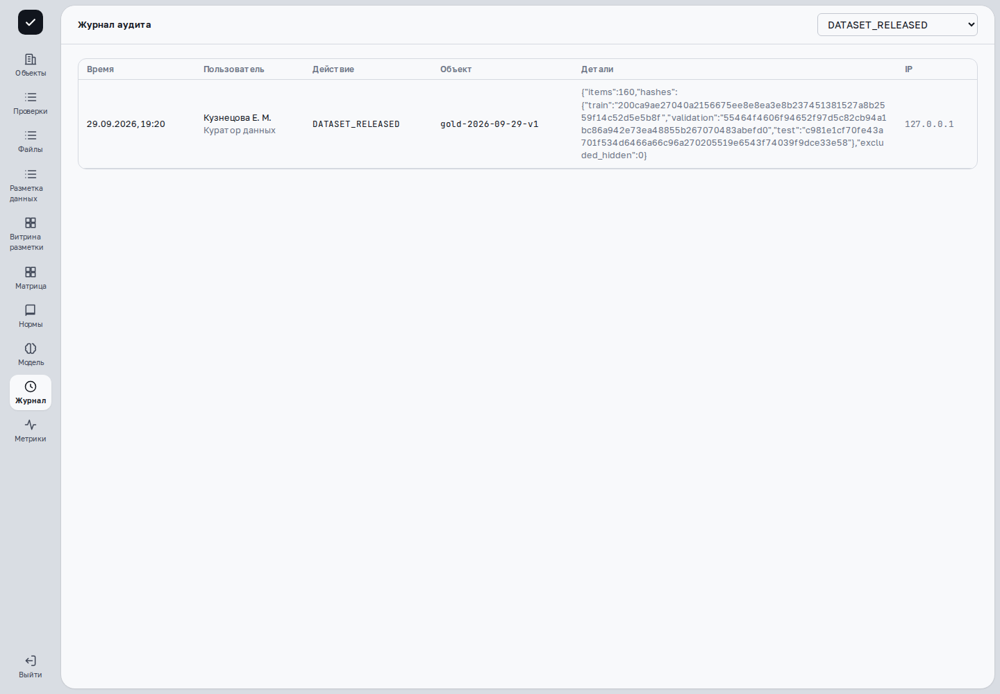

> Применимость: CPU-демо `cfb0ebc6` предназначено для просмотра. В основной платформе проверенные действия сняты на развёрнутых веб-ресурсах с отдельным API `c0851cc7` и синтетическими данными; соответствие исходников опубликованной сборке UI не заявляется. Остальные действия описаны по исходникам и требуют проверки на вашем рабочем стенде и разрешённых прав. В учебном сценарии GOLD подтверждён фильтр журнала по событию выпуска набора. Мониторинг метрик, полнота истории и другие события этой записью не проверены.

## Найдите действие в журнале

Под супервизором или администратором откройте **«Журнал»**. В **«Журнал аудита»** выберите фильтр **«Действие»**: например, DECISION_CONFIRM, DECISION_REJECT, PROTOCOL_FINALIZED или FINALIZATION_CANCELLED. «Все действия» снимает ограничение.

Сверьте время, пользователя, действие, объект, детали и IP. Сопоставьте событие с номером проверки и её **«Версии и журнал»**. В текущем глобальном экране нет отдельного фильтра даты или поиска по объекту: не ожидайте их от формы.

Пустая таблица после фильтра не доказывает, что действие никогда не выполнялось. Проверьте отбор и сведения о доступной истории. При ошибке загрузки зафиксируйте сообщение; экранный статус не заменяет запись события.

## Посмотрите состояние обработки

Администратор открывает **«Метрики»**; экран называется **«Мониторинг»**. Выберите **«Метрика»** и **«Интервал»**: Час, Сутки, Неделя или 90 дней. Плитки показывают последние значения; график — среднее по окну и диапазон min–max. Проверьте время последнего измерения.

В каталоге есть запросы/секунду, задержки, ошибки 5xx, CPU и память процесса, диск, очередь разбора и активные сессии. Дополнительные метрики показываются, если поступают от сервиса; GPU-графики не следует предполагать только по наличию рабочего GPU.

| Наблюдение | Что оно означает |
|---|---|
| «Нет снимков за интервал» или прочерк | Измерение отсутствует; значение не равно нулю. |
| Очередь разбора пуста | В этой очереди нет ожидающих задач; разметка и другие процессы имеют свои очереди. |
| Есть ошибки 5xx | Серверные запросы завершались ошибками; это не диагноз конкретного файла. |
| Высокая нагрузка CPU/GPU | Идут вычисления; качество извлечения этим не измеряется. |
| Файл разобран | Обработка завершена; правильность полей проверяется по источникам. |

Надпись о минутных снимках и хранении 90 дней описывает настройки экрана. Реальную полноту истории проверяйте по доступным измерениям.

## Сообщите о сбое

Запишите приложение и стенд, время с часовым поясом, номер проверки/задания, операцию и полный текст ошибки. Приложите разрешённый снимок без паролей, токенов и приватных документов. Для ошибки разметки отдельно укажите, был ли ответ сохранён: её очередь не тождественна очереди разбора.

Повторная массовая обработка или перезапуск сервисов не являются способом обновить экран. Если связь восстановилась, повторите чтение и сопоставьте результат с журналом.

## Пример: найти выпуск GOLD

Откройте **«Журнал»** под ролью с правом просмотра и выберите действие **DATASET_RELEASED**. Сопоставьте автора, время и идентификатор версии с выполненным выпуском.

В [видеоуроке GOLD и ранжирования](videos.html) этот шаг завершает сценарий. События обучения и публикации проверены отдельно в учебной базе; в кадре показан фильтр выпуска набора.

## Дальше

[Частые вопросы](faq.html) · [Завершение проверки](finalization.html)

[Развёртывание и доступ](deployment.html) · [S3 и восстановление](storage-restore.html) · [Ограничения передачи](handoff-limitations.html)
