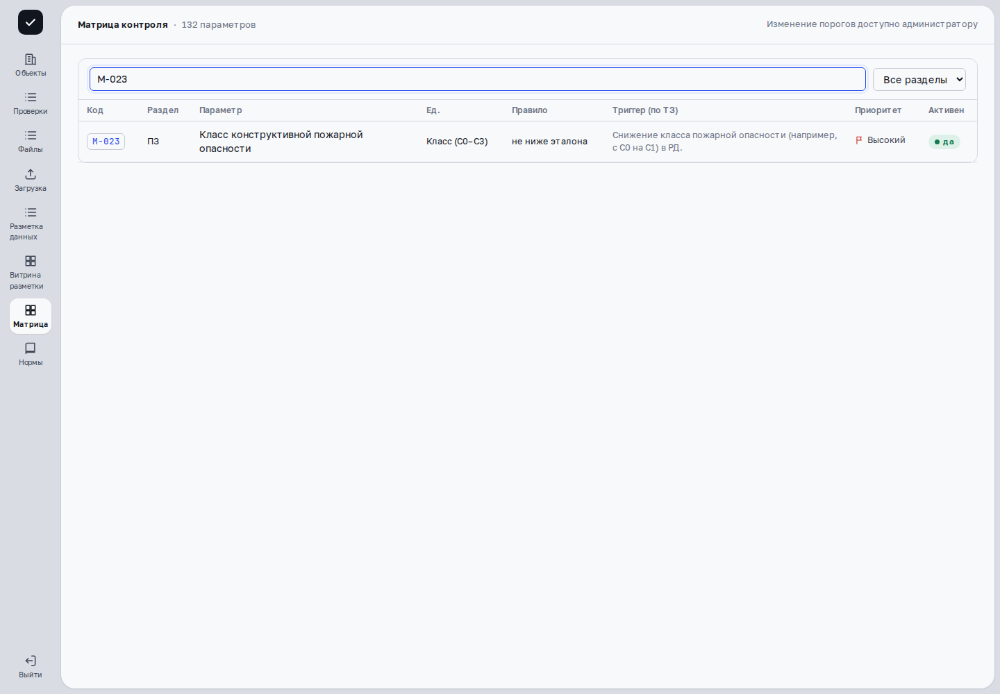
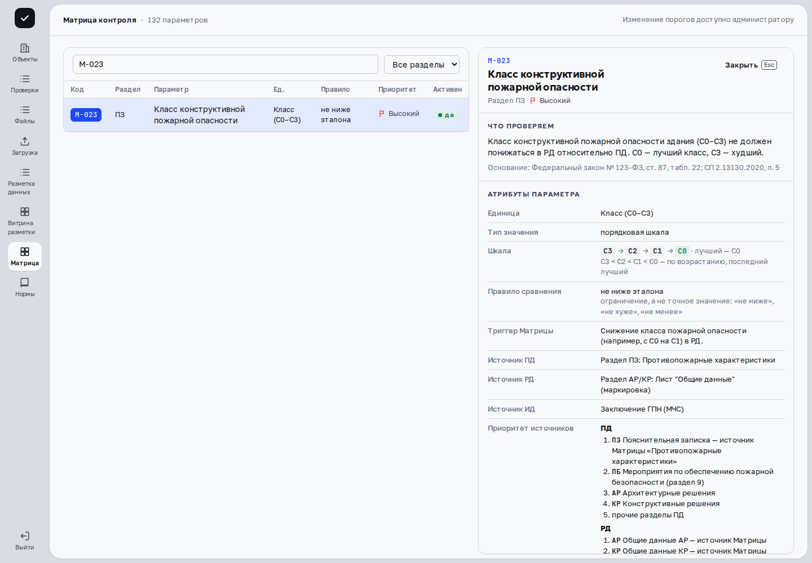
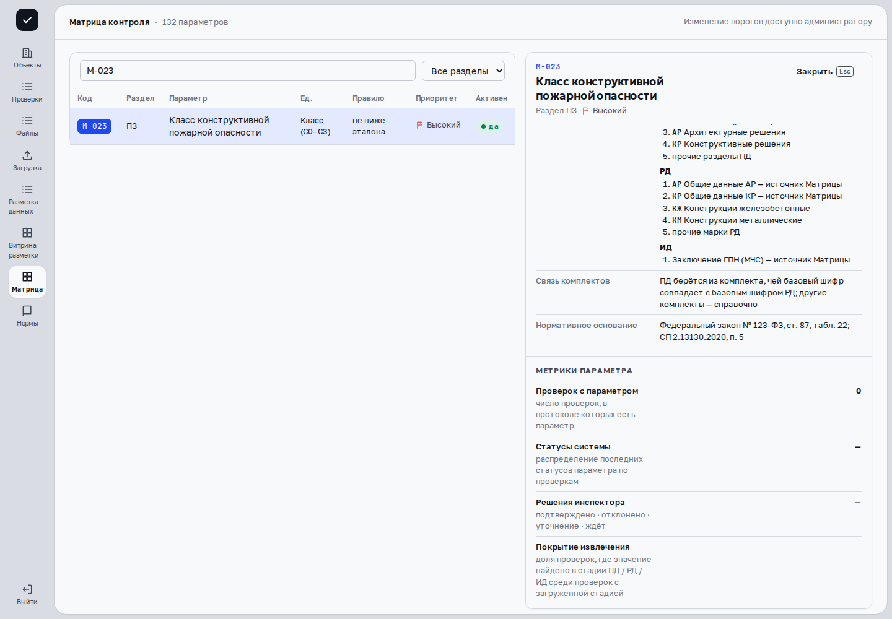
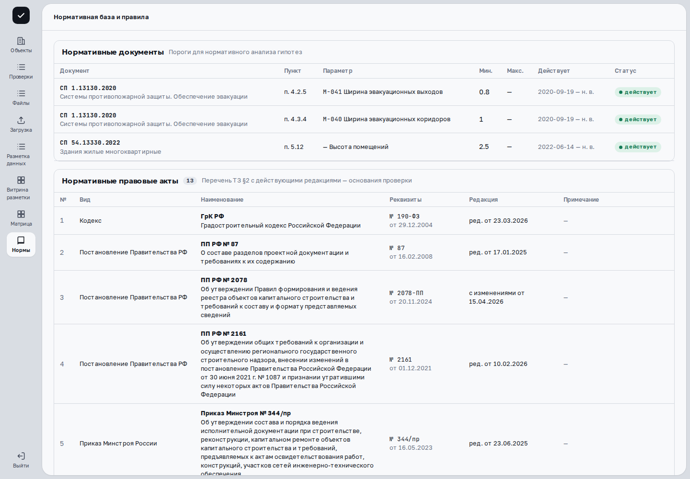

> Применимость: CPU-демо `cfb0ebc6` предназначено для просмотра. В основной платформе проверенные действия сняты на развёрнутых веб-ресурсах с отдельным API `c0851cc7` и синтетическими данными; соответствие исходников опубликованной сборке UI не заявляется. Остальные действия описаны по исходникам и требуют проверки на вашем рабочем стенде и разрешённых прав. На публичном справочнике в изолированной базе подтверждены поиск M-023, паспорт параметра и список нормативных оснований. Действующая редакция закона и изменение Матрицы администратором не проверялись.

## Найдите параметр

{{video:references-walkthrough}}

В записи показаны поиск, паспорт и список норм на отдельной учебной базе. Изменение справочников и актуальность редакции закона проверяются отдельно.

Откройте **«Матрица»**, введите код или часть названия в **«Код или название параметра»**; ограничьте список полем **«Раздел»**. Количество параметров показано в заголовке и относится к загруженному справочнику, а не к числу проверенных значений корпуса.

Нажмите код в строке, чтобы открыть **«Паспорт параметра»** рядом с таблицей. Код сохраняется в адресе, поэтому ссылку можно передать коллеге с правом доступа. **«Закрыть»** или Escape закрывает паспорт. Если параметр не найден, проверьте код в адресе и выберите существующую строку.

## Проверьте правило и источник

Сопоставьте название, единицу, тип значения, допустимую шкалу, активность, приоритет, правило сравнения, порог/допуск и нормативные ссылки. Похожее название не делает два параметра взаимозаменяемыми. Неактивный параметр и отсутствие найденного источника — разные состояния.

Откройте **«Нормы»**. **«Нормативные документы»** показывают документ, пункт, параметр, минимум/максимум, период действия и активность. **«Нормативные правовые акты»** и **«Логические правила свободного поиска»** дают другие виды оснований; логическое правило формирует гипотезу, а не решение инспектора.

Для конкретной проверки сверяйте редакцию, дату и применимость с разрешённым нормативным источником. Встроенный список ссылок помогает найти основание, но не заменяет его текст и профессиональную оценку.

## Для администратора: измените справочник

На рабочем стенде откройте форму изменения строки Матрицы. Проверьте приоритет, активность, нормативную ссылку, триггер и правило/порог, затем нажмите **«Сохранить»**. После успеха сообщение **«Сохранено. Версия Матрицы …»** называет новую версию. При ошибке не считайте значения сохранёнными; перечитайте сообщение и обновлённую строку.

В «Нормы» администратор может **«Деактивировать»** или **«Включить»** норматив; деактивация также задаёт окончание периода действия. Для добавления заполните номер и наименование, остальные предусмотренные поля и нажмите **«Добавить»**. Логические правила включаются/выключаются отдельно. На CPU-демо изменения запрещены.

Изменение справочника не означает автоматической перепроверки всех существующих протоколов. Сверьте версию правил конкретного результата и предусмотренный процесс пересчёта.

## Если по параметру нет задания

Матрица перечисляет возможные параметры; очередь разметки — доступные задания по найденным доказательствам. Отсутствие задания не означает неприменимость параметра или отсутствие информации в документе. Откройте источники и статус обработки.

## Дальше

[Сводка сверки](comparison.html) · [Разметка данных](annotation.html)
